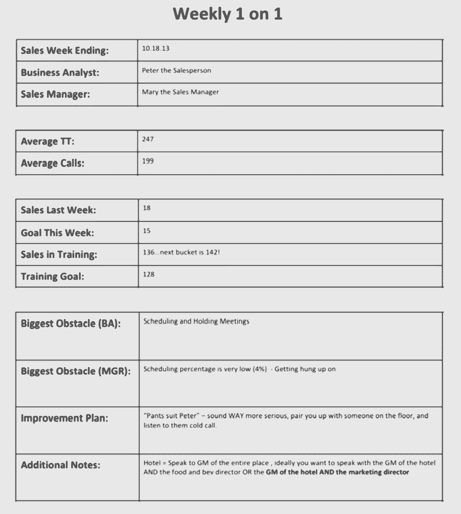

# 今年你将听到的 39 条最佳销售建议

> 原文：<https://review.firstround.com/The-39-Best-Pieces-of-Sales-Advice-Youll-Hear-This-Year>

Wiley Cerilli 从挨家挨户兜售优惠券开始了他的销售生涯。不出所料，他将其描述为“几乎是有史以来最糟糕的工作”“不管你说什么，人们通常都会讨厌你，”他回忆道。但是他从这次经历中得到了宝贵的一课:**如果你敲了足够多的门，最终会有人答应的。**

“人们不会要求什么，因为他们不想被拒绝，”他说。“但有时被拒绝是你能遇到的最好的事情。意味着你抓住了机会。它可以帮助你到达你应该去的地方。”

Cerilli 的情况就是如此，他从早期的销售经历中毕业，成为了[无缝](http://www.seamless.com/ "null")的合作伙伴销售和服务副总裁，以及[单一平台](https://www.singleplatform.com/ "null")的联合创始人兼首席执行官——两年前被 [Constant Contact](http://www.constantcontact.com/overview-main?s_tnt=57295:4:0 "null") 以 1 亿美元收购。(你可以在这里阅读他给初创公司 CEO 的建议。)

在白手起家建立了庞大的销售团队后，他为希望做同样事情的初创公司创始人总结了一系列经验。在这个独家的首轮审查采访中，他分享了 39 条对他和他的公司影响最大的销售建议。

**做好基础工作**

**1。你需要一个为达到你的指标而设计的脚本式推销。**在创业初期，你应该做的就是开发合适的策略来销售你的产品，这并不容易。“要想出正确的配方，需要月复一月的测试，”Cerilli 说。“在 SinglePlatform，我们在构建测试版之前就已经销售了四个月的产品，只是为了看看有什么共鸣。”

**2。从亲自销售开始**。您希望看到人们对您的演示和您的幻灯片的未经过滤的反应，以便您可以相应地进行调整。只有在 Cerilli 亲自去推销客户几个月后，他才决定将销售转移到内部，并着手微调电话销售的脚本。

**3。测试许多不同的定价模式**。解读产品的最优定价是你销售策略的基石。而不考，就不知道自己站在什么位置。“只有通过测试，我们才发现，随着价格的提高，我们能够卖出更多的东西，”他说。“我们从免费增值模式发展到现在每月收取 79 美元的产品费用，随着我们收取更多的费用，销售生产率只会上升**。”**

人们根据价格标签来评价你的产品。

“如果你免费提供任何东西，人们通常会持怀疑态度，”Cerilli 说。“无论你告诉他们多少价值，他们都会相信你的产品。如果你收 20 美元，人们会想，‘哦，它只值那个？我不想把时间花在只给我带来 20 美元价值的东西上……”

**4。如果你低估你的产品，人们会更少使用它。从心理学上讲，如果人们没有为某样东西付费，他们就没有理由使用它。“考虑一下。如果你买了昂贵的东西，比如健身房会员卡，你会使用它，因为你觉得自己有责任。”有一段时间，Cerilli 会对一组多收一点，对另一组少收一点，看看这是否会影响敬业度。付费的人越多，他们登录单一平台系统的频率就越高。然后，他会在稍后纠正价格，让被多收了钱的那群人觉得他们得到了一笔大交易。**

**5。精确定位最佳交付方式。大多数人认为有效的销售只能通过电话或面对面进行。但这取决于你所追求的客户类型，你的受众住在哪里，以及他们喜欢如何被接触到。确保你测试任何非正统的销售方法。查看电子邮件与陌生电话的表现。测试在互动中你应该在什么时候提出销售要求。**

**6。每周测试一次。**“你正在进行的所有这些测试都会受到很多因素的影响——人们的个人生活，他们最近有多少次亲密接触，一系列特别容易或特别难的目标，等等。，”塞利说道。“你要确保你的剧本在大多数情况下都能发挥最佳效果。另外，不要每次重复测试一两个以上的变化，否则你就不知道什么起作用了。”经过六个多月的测试，Cerilli 达到了可以通过电话与任何客户成交的程度。直到那时，他才雇佣了其他销售人员。

**7。采取“买方心态”。**“在无缝公司，销售团队举步维艰。他们的策略根本不起作用，Cerilli 意识到他们需要重新考虑他们的方法。他们有什么好处呢？他们与使用该平台定期订购食品的大公司有许多预先形成的关系。“当你带着卖家的心态进去时，你会说‘嘿，如果你签了无缝就好了。他说:“对你来说，这太棒了，因为所有这些事情……，”“当你带着买家的心态进入时，你会说，‘你好，我们为高盛管理食品订购，我们正在考虑将你的餐厅加入我们的系统。“我们有些问题要问你，不如我们开个会吧，”“你必须包装你的资产，让你的服务成为你的客户想要购买的东西。在无缝案例中，他们控制了消费者市场。

**8。不要过度销售**。人们过度销售的一个主要方式是提供太多的功能。Cerilli 说，当你给别人太多的前期介绍时，他们不知道他们在买什么，你可能最终会创造出一个蹩脚的产品。“保持专注，擅长更少的事情——不要擅长很多事情。你不希望客户看到你的一些功能时知道他们不会使用它们。那么他们不会同意你的要价。”

**9。设计能吸引你注意力的套牌。**“我们最终用于面对面销售电话的资料主要是图片和客户成功案例。成功的销售人员接受过捕捉和管理客户注意力的培训。你不想把权力交给你身后的人。"

**10。找一个有丰富个人贡献者销售经验的副总裁。人们希望为以前做过他们工作的人工作，这些人可以设定合理的目标，并了解他们的问题。**

这么多职业教练是了不起的运动员是有原因的——他们已经知道如何获胜。

**以正确的方式雇佣和培训员工**

11。从 4 名新员工开始。当你刚刚开始组建销售团队时，你必须假设会有很多客户流失。这是一项艰苦的工作，你的产品是新的，销售是高营业额平均。你雇佣的一半人可能不会成功——即使你对他们非常挑剔。现实就是这样。所以，当你扩大规模时，真的要试着在班级里招聘。

“我听到所有的时间经理说，‘这周我要开始一个新的销售人员’，我想，‘一个人？“哦，我的上帝，那真是浪费时间，因为他们可能不会成功，”切利里说。“当你开始时有四个人，你更有可能得到一个摇滚明星和一个 B 级球员，他们可以成长为角色。”

**12。你希望新员工年轻且充满渴望。“你想要一个有点脾气暴躁的人——我称之为汤姆·布拉迪综合症。他被征召太晚了，所以他现在要证明他是一个多么伟大的四分卫。通常，我们会聘用常春藤联盟学校毕业的人，他们不需要证明什么，所以他们没有那么大的动力。”**

纵观他合作过的 600 名销售人员，Cerilli 说表现最好的人是那些在大学里有工作的人——他们从小就知道一美元的价值。

**13。在每次销售面试中问这三个问题:**

你小时候有卖柠檬水的摊子吗？“信不信由你，我雇佣的人中，95%的人小时候都有柠檬水摊。他们是天生的企业家。”

“现在就卖给我这个房间里的东西。随便你怎么编，但是把你坐的椅子卖给我。现在告诉我为什么我应该买番茄酱而不是芥末。好极了，现在卖给我番茄酱上的芥末。”这些是了解某人天生的创造力和多才多艺的最佳问题。

如果有一部关于你的电影，谁会扮演你？你的主题曲会是什么？你会给你的自传起什么名字？“你可以从这样的问题中了解到很多关于一个人的自信和他们如何看待自己的信息，”Cerilli 说。“你想要一个能够快速思考、机智敏捷、让你保持专注的人。”

Wiley Cerilli, Venture Partner at First Round and Founder of SinglePlatform

**14。雇人 3 个月试用期**。“我们选择三个月，因为我们知道会有很多人无法晋级，这给了你一个很好的正式分手终点。此外，为这段时间设定一个确切的目标也很容易。一个人该不该留下，变成了量化的决定。”

然而，员工参加面试并不意味着他们不应该寻求帮助。“在此期间，实际上销售代表应该举手示意，以便他们的经理可以在电话中指导他们，或者在需要时接手。那很好。事实上，如果有人在前三个月没有定期寻求这样的帮助，那就是一个危险信号。”

**15。让新兵参加新兵训练营。在 SinglePlatform，所有新员工在销售前都要接受一周的培训。培训包括各种内容，从分解性格测试——这样他们就可以知道他们在和什么样的客户交谈——到书面测试，再到听一小时又一小时的现场销售电话。“在培训结束时，你希望他们确切地知道会发生什么，以及如何处理意外情况。”培训的最后一个阶段包括给他们的经理和公司的其他人打模拟电话，看看他们是否能说服最强硬的听众。**

**16。让员工沉浸在成功中。**在 SinglePlatform，Cerilli 的团队每周都会播放成功通话的录音。“当你给他们播放那些与他们一起工作并获得销售的人打来的电话时，人们开始假设他们也会达成销售，”他说。

统计数据显示，当你卖出一笔交易时，你在下一次通话中卖出的概率会高得多。

当人们假设成功时，他们带着必要的信心去实现自我实现的预言。

**17。a 级和 B 级玩家应该能够获得 80%的销售额。“你不会想要 C 级玩家的，”Cerilli 说。“所以要明确 80%是完全现实的目标。即使有人打了很多电话，态度也很好——如果他们没有达到目标，他们仍然没有成功。没有例外。”**

18。给季度奖金，不要提成。“你想按季度发放奖金，因为每三个月就会有人离开公司，你可以省下这笔钱。最终，你会省下一大笔钱。尤其是当你处于初创阶段时，四分之一的佣金或奖金可以决定你公司的成败。”

**19。给人们可以达到的目标。“你可以随时根据需要提高目标，但降低目标从来都不是好事，”Cerilli 说。“你需要赢得人们的信任，让他们相信你在正确的地方设定了配额。尽你所能算出这个数字，但是好员工应该获得更多的胜利。”**

**二十。一直把剧本放在人们面前。这适用于新老员工。你希望人们坚持你花了这么多时间精心制作的东西。“你知道你真正的杠杆是什么，什么有用，什么没用。有一个精确的脚本可能是你最大的优势之一，当你很好地训练人们时，它会变得很自然。他们将能够即兴发挥，同时击中所有正确的点。”Cerilli 建议尽可能保持脚本的一致性，一个月不要超过一个明显的变化。这也有助于每周打印出一个新版本，并突出显示任何更改。**

**21。教员工用客户故事进行销售。**“你不希望人们在电话销售时使用‘我’或‘我们’这样的词。没人关心为什么一个自己都不认识的人会觉得这个产品很牛逼。他们需要谈论他们的目标可以联系到的人，以及他们为什么喜欢这个产品。您希望您的销售代表传达为什么其他客户认为该产品有价值。他们可以这样说，“我前几天刚和你认识的某某人聊过，他非常喜欢这个功能。”"

**22。迅速开火。**在前三个月，你有 80%的规则生效，之后，SinglePlatform 执行两次出局规则。“在这个行业里，你必须解雇相当多的人，”Cerilli 说。“这就是管理和维护高绩效团队的方式。这是这份工作最艰难的事情之一，但你必须做好它。”

**创建强大的管理层**

23。经理应该密切跟踪他们的团队。在 SinglePlatform，经理们不断监听销售代表的电话，以收集情报、记录反馈并帮助他们更好地达成交易。Cerilli 建议每 10 到 12 名销售代表配备一名经理，这样他们就可以投入足够的时间来研究如何管理每个人取得成功。 **24。让持续指导变得实用**。为了让经理们能够监控和帮助他们的销售代表，Cerilli 的团队使用了 ShoreTel 的 M5 电话系统。这使得副总裁和经理不仅可以监听电话，还可以向销售代表提供客户听不到的实时反馈。这简直就像有人在你耳边说话并提供建议，“嘿，听起来他们仍然担心 X，为什么不试着说 Y？”

经理们可以密切关注即将到来的大交易，这样他们就可以在必要时帮助他们的销售代表。“通常经理会让销售代表提前知道他们是否在听，或者他们会过来坐在他们旁边，或者之后过来坐在他们旁边提供反馈，”Cerilli 说。

**25。用指标推动每周一对一。** SinglePlatform 提供了两个表格，经理可以填写每个员工的指标，包括完成的交易、通话时间，以及如何改进的定性建议。将信息以这种格式发布会不那么吓人，并给人们一个具体的改进参考点。

“此外，这种形式让经理们有了条理——这对于可能在监督他们以前同事的新经理来说尤其重要，”Cerilli 说。“他们可以看着表格说，‘好吧，首先让我们谈谈你的结束技巧……，‘他们对谈话有更多的控制权。”这里有一个例子:

**26。从右边的音符**开始周一的比赛。Cerilli 和他的团队每周都会召开销售会议，重点是激励。客户经理走进来，阅读本周“令人惊叹”的客户成功故事，这样销售人员就可以听到他们对整天打电话的人产生的影响。

“有一段时间，我们通过电子邮件传播这些故事，但人们只是浏览了一下。当他们在与他们一起工作的每个人面前听到它时，会有很大的不同。现在，我们试着挑选一个故事，在这个故事中，顾客起初持怀疑态度，但最终被说服了。这样，当每个人都打电话时，他们就不会因为碰到持怀疑态度的客户而紧张了。”

销售人员会议还包括“本周总结”，即记录上周最成功的拜访。完成这笔交易的人将成为销售区的国王或王后。是的，有一个真正的皇冠。

**27。以小组竞赛**激励。SinglePlatform 为团队举办各种比赛:谁打电话的时间最多？谁离得最近？谁是最稳定的连胜纪录？“人们真的很喜欢它，”Cerilli 说。“他们开始为自己的经理而战，这确实巩固了忠诚度。”

创造竞争，鼓励人们更加努力地工作，但要共同取得成就。

**28。让它变得有趣。**除了这些比赛(偶尔会有三月疯狂和性别之战这样的主题)，SinglePlatform 还会给销售人员奖励大销售额的大乐高和小销售额的小乐高。“现在，当你走过办公室时，你会看到这些巨大的乐高积木塔，这是一种非常酷、简单的识别优秀员工的方法。”

**磨练您的过程，庆祝您的胜利**

**29。组建一支特警队。**跟上市场趋势并跟踪客户需求至关重要。为了让你的剧本朝着正确的方向发展，Cerilli 建议成立一个由 2 到 3 人组成的 SWAT 团队来测试新的定价或宣传。“每月运行一个大型测试，”他说。“如果成功了，把新剧本扩大到 4 到 8 个人，然后扩大到 10 到 12 个人。最近，我们让两个人测试了一个模型，这个模型定位了我们的移动产品的价值，而不是像往常一样定位了我们的网络。反响令人难以置信。一名销售代表一周内从每天销售一个半许可证增加到 40 个。”

要让特警队尽可能有效，就不要把变化搞得太大。确保它是你当前使用的脚本的一个现实的支点。您还希望团队成为您销售组织的一部分。“你不能让所有最优秀的人都加入你的特警队，因为那会扭曲数据。你需要一个摇滚明星，然后是一两个能代表你大部分员工的优秀销售人员。”

**30。尽可能在任何地方庆祝胜利。**你希望不断地、尽可能明显地传达人们的成功。向整个团队发送电子邮件。确认员工与公司的周年纪念日和他们的销售里程碑。也许他们有史以来本周、本月最大的销售。奖励实际的奖品——无论是饼干还是一天的卡丁车比赛。你给予他们的正面强化越多，每个人就会越有动力。

SinglePlatform 使用一个叫做 [Hoopla](https://www.hoopla.net/ "null") 的系统在办公室的屏幕上显示刚刚完成交易的人的面孔。该系统甚至会播放一首由图中的销售人员选择的国歌——一首真正的胜利之舞。

31。也庆祝拒绝。“当人们第一次说 10 个不的时候，我们也会敲钟庆祝，”塞利里说，回忆起他兜售优惠券的日子。“让人们去他们想去的地方的一部分就是让他们克服被拒绝的恐惧。让它变得不那么可怕，更容易被人接受，这是一件大事。”

**32。从内部提升。这有几个功能。首先，你知道你正在创造的经理们分享着密切监控、不断反馈和保持高昂士气的理念。通过让他们成为销售代表和新员工的导师，你只是细化了这些让你的组织一开始就成功的细节。第二，当你从团队内部招聘时，你发出的信息是你奖励努力工作和成果。**

**营造良好的环境**

33。让你的办公室成为人们真正想要工作的地方。去年， [SinglePlatform 被评为 Crain 的最佳工作场所之一](http://www.crainsnewyork.com/gallery/20131206/FEATURES/120909999/54 "null")。但是这不是偶然的，Cerilli 说。为了获得最大的生产力，你必须精心设计一个环境，让人们首先快乐，然后努力工作。这是该公司从一开始就执行严格的“无屁眼规则”的一个原因。“我们解雇了优秀员工，因为他们不符合我们的文化，”他说。消极和糟糕的态度是会传染的。

**34。尽可能多的把客户带进来。**这并不一定意味着邀请他们去办公室，而是意味着经常讲述他们的故事，让他们成为一个重要的存在。

你想让你的员工知道他们的客户正在成功。

为此，SinglePlatform 的经理们不仅通过电子邮件传播客户的成功案例，他们还发布了一份每个人都可以阅读的月度报告，展示了前 10 到 20 个在该计划中获得良好体验的客户。“当销售人员看到和听到客户说他们喜欢这个系统，或者他们上个月登录了 200 次，他们开始更加相信产品，他们可以更好地销售产品。”

**35。开始一个有意义的音箱系列。许多公司请来了外部演讲者，但出席率往往很低。为了让这种体验更有意义，Cerilli 专注于引入其他销售导向型公司的首席执行官，他们不仅会谈论自己在销售方面的挣扎，还会谈论客户管理和技术问题。“听到这些类型的人的声音会让他们的环境正常化，也会激励那些可能也在挣扎的人。”**

36。尽早并经常进行产品演示。 Cerilli 建议让产品团队的代表每月演示一次新功能或产品，这样整个销售组织就有机会提问，了解所有产品的功能，并真正理解他们可能会遇到的棘手问题。

**37。利用午餐将销售与公司联系起来**。销售人员在科技公司很容易被孤立，因为他们拥有如此不同的技能。通过正式确定跨职能午餐来确保这种情况不会发生。给员工个人一个和公司其他部门的高管一起吃饭的机会，这样他们就能更好地理解他们所支持的使命和方向。

你越能将销售人员与你公司的价值观联系起来，他们就越能感受到公司的成功。

**打开涡轮增压器**

一旦你有了合适的剧本，你的培训计划培养出了有才华的销售人员，以及一个强大的管理层，是时候扩大经营规模以销售更多了。**你可以做两件事，这两件事会比其他任何事都更重要:**

**38。雇人来做这项工作。**在某种程度上，销售主管参与每一次招聘变得难以管理。通过雇佣内部招聘人员来进行寻找和筛选，你简化了这一过程，并为不断扩大的候选人渠道提供了食物，最终让更多的人参与进来。这也解放了高层销售管理人员，让他们更战略性地考虑脚本编写、谁应该被提升以及你的 SWAT 团队下一步应该关注什么。

39。雇人做培训。教新人——尤其是那些最终成为最佳销售代表的年轻、经验不足的人——非常耗时。如果你想想 SinglePlatform 为让新员工为销售拜访做好准备所做的一切，它需要有人设计和管理测试，运行一周的全天编程，建立模拟拜访，并提供粒度反馈。Cerilli 说，如果你能雇佣一个有教学经验的人，他真正理解你想做的事情，你就能节省很多经理的时间，最终得到一支训练有素的销售队伍。

在一天结束时，你的人力资本将永远是你销售的最大推动者。当你进入高速增长期时，你能做的最好的事情就是找到能够专注于优化这一部分的人。如果你给人们所有他们需要的获胜工具，他们就会赢。