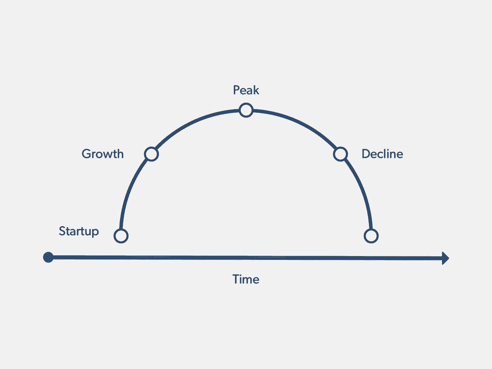
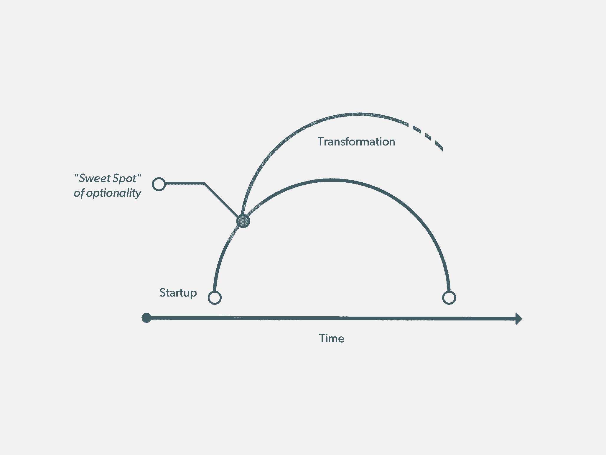
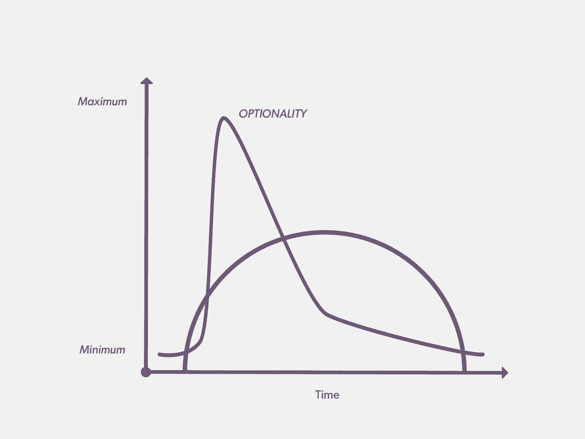
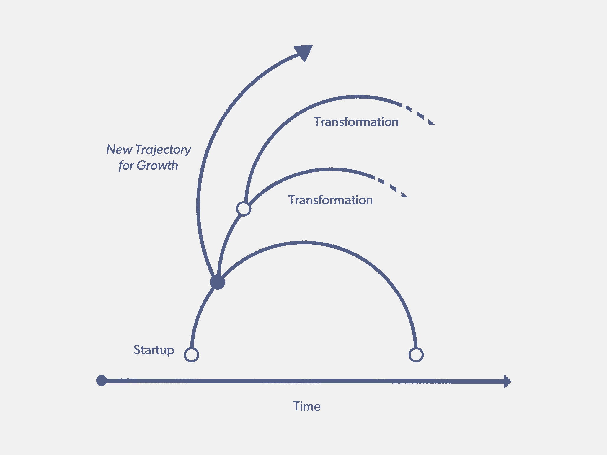
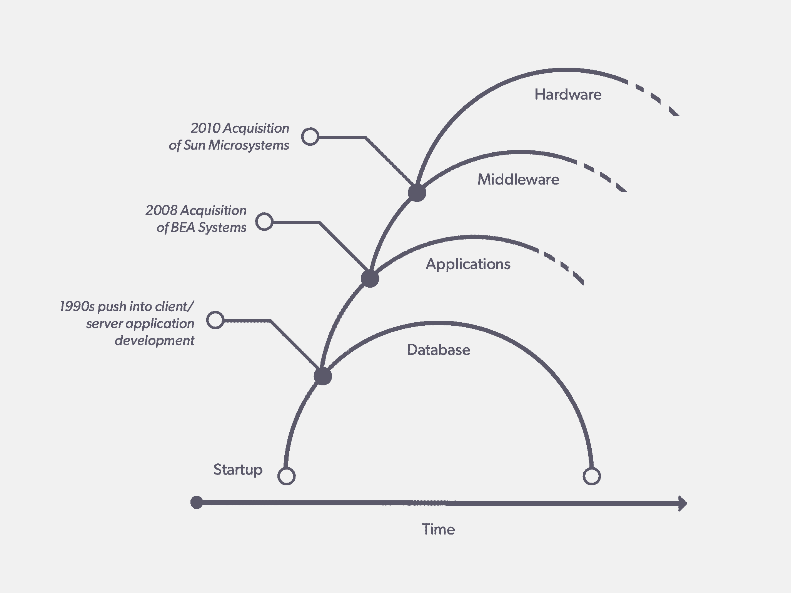

# 公司生活的弧线-以及如何延长它

> 原文：<https://review.firstround.com/The-Arc-of-Company-Life-and-How-to-Prolong-It>

2011 年，IBM 在《华尔街日报》、《华盛顿邮报》和《纽约时报》上刊登了一则长达四页的广告。它说:“几乎所有我们的祖父母所钦佩的公司都消失了。1961 年，财富 500 强中排名前 25 位的公司，如今只剩下 6 家。这则广告可能是为了赞美 IBM 的弹性，但它也强调了对今天在硅谷和其他地方出现的新公司的一个有力观察。

想想最近柯达和黑莓的例子。两者在各自的市场中都占有神圣的地位。两者都曾是技术的先驱，但面对不可否认的颠覆却未能做出调整。为什么他们没有采取行动？为什么在一个所有人都关注品牌火箭般上升的时代，如此多的企业家忽略了保持创新的需要？

在这篇独家报道中， **[马克·莱斯利](http://www.gsb.stanford.edu/faculty-research/faculty/mark-leslie "null")** ，维尔软件公司的长期董事长兼首席执行官，顾问和投资者([和一篇关于创业销售学习曲线的基础文章的作者](https://hbr.org/2006/07/the-sales-learning-curve "null"))，将企业的“生命之弧”清晰地展现出来，解释了公司如何避免停滞和衰退，并阐述了这对那些寄希望于长期成功的新创企业意味着什么。

# 企业生活的轨迹

成功的企业有一个生命周期。创业公司生产一种产品或服务，进入市场并吸引顾客。一旦他们克服了这些最初的障碍，他们就进入了一个增长阶段，随着年复一年的大幅增长，他们的收入和市场份额迅速增加。他们继续开发自己的产品，随着收入开始持平，利润率稳定在较低但仍有吸引力的水平，他们对产品进行微调。

随着这些公司的成熟，增长速度会进一步放缓，最终趋于平缓，但随着它们努力与市场上的新参与者竞争，运营费用会继续攀升。最后，无法跟上，背负着膨胀的预算，公司陷入负增长，以裁员，高燃烧率和最终破产或清算为标志。

这描绘了一幅相当黯淡的画面——尤其是如果考虑到这种模式的不可避免性的话——但重要的是要注意到，对于不同的公司来说，这个周期在完全不同的时间线内结束。许多成功的公司将其相关性延续了几十年，有些甚至超过了一个世纪。科技公司就像“真正的公司”一样，只是周期更短，所以一切都发生得更快。

# 伟大的公司经久不衰

持续增长的关键是战略转型。当一家公司放弃成熟、可控增长和市场领导地位的“美好生活”，并愿意在面临生存风险时承担转型风险时，它就能实现新的增长水平，并扩大自己的视野。

做到这一点的能力在很大程度上取决于指引方向的领导者的类型。大多数领导者都属于两种类型之一:机会驱动型(T0)或运营驱动型(T2)。正如您将在下面读到的，有一个机会驱动型领导者掌舵来推动转型有着不可思议的优势。运营驱动型领导者虽然在推动效率和可预测性方面表现出色，但可能会将公司置于长期风险之中，因为它只是停留在生命之弧的轨道上。

# 甲骨文和机会驱动型领导者

作为世界上最大和最有影响力的软件公司之一，[甲骨文](http://www.oracle.com/ "null")最初成立于 1977 年，当时是软件开发实验室。从那时到 1982 年，该公司一直在寻找适合市场的产品，最终确定了如何将其面向企业的关系数据库系统商业化。那就是它正式命名为甲骨文并进入成长的时候。但是当大多数早期员工回忆起是什么给了公司早期的竞争优势时，他们指向了首席执行官拉里·埃里森。

Oracle 数据库前三个版本的共同架构师和作者 Bruce Scott 这样说:“我想了很多关于 Oracle 成功的原因...这真的是拉里的魅力，远见，和他的决心，使这件事无论如何工作。我可以给你举一个他思考过程的例子:我们有分配给我们的空间，我们需要把我们的终端接到隔壁的计算机房。我们没有地方安装电线。”

拉里拿起一把锤子，在墙中间砸出一个洞，然后说，“好了。”

埃里森被描述为一个冒险家，他看到了快速、非传统的解决方案来让事情继续发展，这引起了人们对持久公司最重要的特征之一的关注:他们的首席执行官是机会驱动的领导者。你可以通过他们不仅能预见未来，还能把握未来的能力、他们对非常规策略的适应力以及他们对大胆冒险的接受度来识别这种类型的领导者。他们不以排名、季度收益或流动性事件来衡量自己的成功。他们有一个更宏伟的愿景，那就是改变世界，打造全球品牌，颠覆现有行业。

机会驱动型领导者的另一个重要例子是 2014 年被任命为微软首席执行官的塞特亚·纳德拉。在其前任史蒂夫·鲍尔默(Steve Ballmer)14 年的任期内，该公司失去了其作为行业推动者和动摇者的地位。这些年来，股价一直萎靡不振。自从纳德拉的到来，微软作为行业的主要参与者重新崛起。他打破了公司的许多旧规则，致力于成为一流的云玩家。他成功地引起了消费者和开发者对 Windows 10 的兴趣，并监督了一系列新产品的发布，从 iPhone 的新前景到令人难以置信的雄心勃勃的 HoloLens。他甚至策划了一次大规模裁员，成功地让公司变得更精简、更快速。股票也相应地做出了反应，从 30 多美元稳步上涨到今天的每股 60 多美元。

这种类型的领导者用魅力和人格力量来推动变革，这可以更好地描述为引力而不是管理风格。公司需要这类数据来证明不寻常的、不直观的和有风险的方向转变。对他们来说，说服人们相信他们是正确的，或者跟随他们走上不同的道路是不够的——他们让任何其他选择或目的地看起来都站不住脚。

# 转型的最佳时机

当 Oracle 开始构建可移植、可伸缩的数据库系统时，市场上有许多其他初创公司也在尝试做同样的事情。

他们中的大多数都将竞争优势放在更多的功能和更好的性能上，而 Oracle 则专注于一个行业范围的平台——使其数据库与尽可能多的计算平台兼容(IBM、Digital Equipment、多种风格的 UNIX、nt 等)。).到 20 世纪 80 年代中期，它的软件可以在 80 个不同的供应商系统上使用，这使得它几乎可以被任何企业使用。

Oracle 的多功能性使其成为应用程序开发人员和经销商的选择，因为这也使他们能够进入更大的市场。

随着应用需求的增长，Oracle 的收入也在增长。到 1987 年，它已经是世界上最大的数据库管理公司，收入超过 1 亿美元，在 55 个国家拥有 4，500 个客户。发现了这一成功的源泉，埃里森引进了一家顶级会计应用程序开发公司的创始人[杰夫·沃克](https://www.linkedin.com/pub/jeffrey-l-walker/4/b74/5aa "null")，并让他负责在公司内部建立一个应用程序部门。

**尽管甲骨文的数据库业务有着多年的稳定增长和健康的利润，他还是这么做了。尽管甲骨文自己的应用直到 90 年代才开始腾飞，他还是这样做了。最重要的是，他这样做是面对应用程序供应商(即人软、SAP 等)的事实。)的人现在会将 Oracle 视为具有不公平优势的竞争对手，而不是推动者。这样做，埃里森把他现有的市场置于极大的风险之中。他看到了转型的机会，并利用公司在增长阶段的势头使之成为可能。**

在成长和成熟之间的企业生命周期中，有一个时刻允许**最大的选择性**——这是改变和更新的最佳时机。你怎么能预见这一刻的到来？它通常是这样的:

你终于走出了创业阶段，不再需要担心稀缺的资源或牵引力。

该组织已经实现了一定程度的稳定——未来看起来很光明，收入正在攀升，业务模式已经形成。

你刚刚达到了一个点，你有人才，资金和市场影响力来做一些新的事情，同时保持和发展核心业务。

风在你背后！

当一家初创公司接近其增长曲线的顶点时，其领导者需要做出选择:公司会利用其势头和主动性进入未知领域(新的产品线、新的业务类别、新的行业)吗？还是会继续沿着这条明显的道路，尽可能多地从现有业务中挤出利润？

当事情进展顺利时，大多数领导者都不愿意为了市场优势而冒不必要的风险。在这样做的时候，他们看不到“成功”的另一面是什么——停滞和衰退。即使他们周围的生态系统发生了变化，他们仍然坚持他们所知道的和以前有效的东西，而不是进行创新来满足客户的新期望。

与此形成鲜明对比的是，机会驱动型领导不把可选性的甜蜜点视为风险，而是将公司推向下一个层次的跳板。他们的愿景描绘了公司需要走的路线，他们对选择的信念迫使核心员工致力于这一旅程，即使结果并不立即明朗。

# 少走的路

回想起来，创新的需要似乎是显而易见的，甚至是容易的。但是决定走这条路——远离传统的生活轨迹——绝非易事。

当时，甲骨文进军应用业务是一个激进的举动。这一举措不仅超越了该公司以往任何尝试的规模，还向依赖其软件为生的应用经销商宣战——这实质上迫使他们在甲骨文和其竞争对手之间做出选择，并威胁到资助其新应用业务的收入流。

尽管面临诸多挑战，甲骨文还是能够在市场上为自己的应用产品腾出空间。尽管如此，许多人认为该公司在这一领域的投资金额分散了注意力，而且不计后果，尤其是当该公司仍在从其核心数据库业务中获得巨大的年同比收入增长时。他们没有看到的是，这项业务的许可收入开始以越来越快的速度变平。

该公司前进的道路上还有一个障碍:SAP，这个 800 磅重的市场巨头为企业生产基于客户机/服务器的应用程序。这是无可避免的。除非形势发生变化，否则甲骨文无法击败 SAP 成为企业应用的头号供应商。因此，它在已经充满风险的应用战略上又下了一次大赌注，为该行业构建了一个新的格局。

马修·西蒙兹(Matthew Symonds)在他为甲骨文和埃里森撰写的传记《软件大战》(Softwar)中描述了这个爆发点:“令许多同事和客户感到恐惧的是，[埃里森决定]放弃所有基于客户机/服务器的应用程序的进一步开发，并将整个公司的工程努力集中在互联网建设上。”

甲骨文的销售人员怒不可遏，客户纷纷逃离。但是埃里森不会被这个全新的方向所阻止。“他们把现在误认为未来，”他说。“**客户机/服务器已经死了，房间里的人会在葬礼上发现这一点**。”他知道甲骨文迫不及待地改变路线。

当时，其他公司也在开发基于网络的应用程序，但甲骨文是唯一一家全心全意追求互联网战略，并以整个业务为代价的公司。当时有人引用埃里森的话说:“如果互联网不是计算的未来，我们就完了。如果是的话，我们就成功了。”

2000 年，该公司推出了 Oracle 电子商务套件，这是第一个完全集成的、全面的企业业务应用程序套件。它消除了对昂贵的系统集成的需求，并因其易用性和高效性而广受欢迎。

甲骨文一直致力于战略转型。在 25 年零收购之后，它将火力转向通过大规模收购巩固企业应用市场。2003 年，Peoplesoft 首次以 51 亿美元的价格被硅谷有史以来第一次恶意收购。BEA 和许多其他人很快跟进。甲骨文最终击败了除 SAP 之外的所有竞争对手，最终占据了市场主导地位。

它最近的赌注是收购太阳微系统公司，成为一个完全集成的系统供应商。并不是所有的赌注都赢了，现在谈论最近的这一次还为时过早。(还有一个有趣的附带赌注值得注意。拉里·埃里森是同一行业低端市场 [NetSuite](http://www.netsuite.com/ "null") 的主要投资者和大股东。

甲骨文对该领域这一地位的不懈追求说明了企业生命周期中一个更重要的教训:一个组织的转型在规模、执行时间和对业务的影响方面不可避免地会有所不同。

**但是，将一系列成功的转变——或大或小——放在一起，随着时间的推移，将融合成一个关于转变和延长预期寿命的总体故事。**

这是它的样子:

**下面是它对甲骨文的看法:**

另一个被许多变革所鼓舞的公司的例子是 **[亚马逊](http://www.amazon.com/ "null")**——还有[杰夫·贝索斯](http://en.wikipedia.org/wiki/Jeff_Bezos "null")，另一个真正受机会驱动的领导者引领变革。在其 20 年的历史中，亚马逊利用可选性的优势覆盖新的领域，开发远远超出其核心竞争力的产品，同时塑造了消费者购买和零售商在线销售的方式。

亚马逊转型的最大亮点之一是推出了 zShops，这个平台让小企业能够建立自己的虚拟店面，并通过网站销售产品。虽然它本身并不是游戏规则的改变者，但它最终导致了[亚马逊网络服务](http://aws.amazon.com/ "null")的诞生，利用该公司的内部软件架构为其他企业提供负担得起的云服务。在这种情况下，一个巨大的，成功的商业迂回起源于一个较小的企业。网络服务现在的增长速度比亚马逊面向消费者的零售业务要快。

要点是**并非所有的转变都必须改变世界**。有些可能只是做一个凹痕或打开一扇门。几乎可以肯定的是，并非所有激进变革的尝试都会成功。由机会驱动的领导者来权衡失败的风险和回报的风险。你的公司有足够的财力、员工忠诚度和广泛的支持来度过失败的蜕变吗？还是后果太可怕了？有时，一家公司需要做出飞跃，即使后者是真的。

# 运营驱动型领导者

在这个故事的另一面，你会看到成百上千的公司，如果不是成千上万的话，已经走上了猛犸象的道路，因为他们没有能力适应。

甲骨文和亚马逊绝对是一条广为人知的规则的例外。几乎在所有情况下，首席执行官都尽职尽责地带领他们的公司走上以度量为中心的执行和可靠增长的道路。在这个过程中，他们要么故意绕过可选性的最佳点，要么错过给公司带来新想法的机会。

这些领导者更受运营卓越和效率的驱动，成为机会驱动型领导者的陪衬。他们被激励去实现成功的既定标准和传统定义。

这种类型的人非常适合在公司经历重大转型后需要无缝执行的时期主持大局。他们甚至可能擅长阐明未来的愿景。但这种愿景更可能是保守的，规模更小，风险更低。具有讽刺意味的是，这些类型的首席执行官受到华尔街的崇敬，因为他们的公司每个季度都表现可靠。也就是说，直到他们脱离增长曲线，无处可去。

即使业务驱动型领导看到了转型的最佳时机，他们也可能无法抓住——他们不具备同样的风险承受能力、直面反对者的能力或带领整个组织前进的魅力。如果一个领导者没有勇气去追求，那么愿景就没有任何意义。

行动驱动的领导者可能擅长走一条标明的道路，但不会挥舞弯刀去创造一条新的道路。

在这种类型的领导下，一家公司可以享受许多迈向成熟的好时光。但是，如果不能在适当的时候创造新的增长曲线，即使是历史上最成功的公司也会面临灭绝的风险。

诺基亚是一家公司的典型例子，这家公司历史上一直处于领先地位，但现在却在苦苦挣扎。像甲骨文一样，该公司的成功建立在早期变革性飞跃的基础上。很多人不知道它是 1871 年从芬兰的一家造纸厂起家的，是一家与时俱进完美变革的公司的最佳范例之一。

当汽车变得更加普遍时，诺基亚演变成一个橡胶制造商，生产从轮胎到雨鞋的一切产品。当电话开始进入主流时，它成为首批电信公司之一，为军队开发无线电话。这种态度一直延续到 20 世纪 80 年代，当时它推出了第一款移动车载电话。到 20 世纪 90 年代，它已经是全球手机技术的领导者。

现在，随着苹果和三星瓜分移动市场，诺基亚在过去四年里一直在稳步失去市场份额。它只是停止了创新。它的领导层停止了巨额押注，新增长曲线的缺乏直到现在才变得明显——特别是在 2013 年将其设备业务出售给微软之后。除非诺基亚领导层愿意并能够实现与其早期历史相同规模的变革性飞跃，否则这可能是终点。

具有讽刺意味的是(而且越来越多)，苹果的 **[蒂姆·库克](https://en.wikipedia.org/wiki/Tim_Cook "null")** **正在进入运营驱动的范畴**。自从他升任首席执行官以来，公司在运营业务方面做得很好。但它也失去了一些光泽。其旗舰产品 iPhone 的每一个新版本都不如上一个版本有趣。在库克的领导下，他们最大的产品创新似乎是 EarPods——这是苹果从他们的基础上获取更多资金的一个很好的方式，但不是人们可能会称之为“疯狂的伟大”著名企业家史蒂夫·布兰克称库克为新的史蒂夫·鲍尔默。是的，史蒂夫·乔布斯留下了一本非常棒的剧本。但是，当剧本完成后，库克会做什么呢？基于苹果公司所享有的巨大发展势头，该公司股票迄今表现良好。但很少知情人认为长期来看价格会上涨。

# 结果是

无论提出什么借口或宣布什么例外，这是一个规律，即一度被视为明显赢家的公司最终将在生命周期结束时经历衰落和灭绝的威胁。没有一个组织能幸免于这种命运。只有少数人证明了他们有能力进行足够的变革，将自己的寿命延长几十年，超越竞争对手。

尽管一家公司的发展轨迹可能会受到许多因素的影响——市场力量、政治气候、经济起伏、流行趋势——但有争议的是，没有什么比其领导者设定的愿景和道路更重要。

为了确保长期成功，董事会和投资者应该寻找并奖励那些受机会驱动的领导者，他们愿意在前路开始变得平坦、变得更加确定之前，在墙上打洞并接受新的、往往是危险的风险。尽管良好的估值和强劲的市场地位可能看起来很有前途、有利可图，但它们并不能保证一家公司能够长期存在。

没有休息的地方是悲哀却又真实的:**没有终点**。

*[马克·莱斯利](http://www.gsb.stanford.edu/faculty-research/faculty/mark-leslie "null")* *是斯坦福大学商学院的讲师，教授企业家精神、伦理和销售组织方面的课程。他还是私人投资公司 Leslie Ventures 的董事总经理，并在两家上市公司、六家私营公司和三家非营利组织的董事会任职。此前，Leslie 是 Veritas Software 的创始董事长兼首席执行官。他在**[@ mles lie 45](https://twitter.com/mleslie45 "null")**发微博。*

斯坦福大学商学院的案例作家 Sara Rosenthal 对此文亦有贡献。