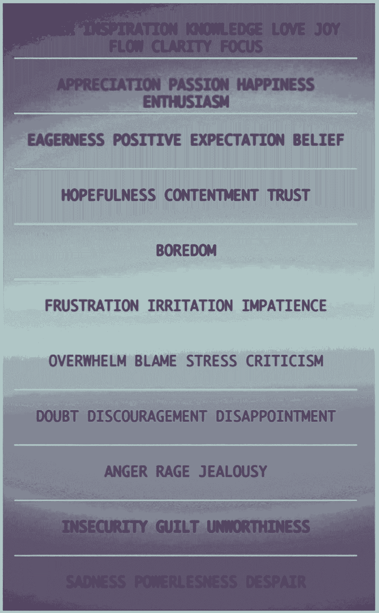

# 顶级创始人用来完成工作的头脑风暴

> 原文：<https://review.firstround.com/The-Brain-Hacks-Top-Founders-Use-to-Get-Stuff-Done>

卡蒂亚·韦里森 **的新客户遇到了一个大问题**:他需要在一天中挤出 3 到 4 个小时。当然，对于一个超额认购的初创公司创始人来说，这似乎是一个不可能的壮举，但他筹集资金和招募最优秀人才的能力取决于此。当他遇到许多这样的创始人的执行教练韦里森时，他已经精疲力尽，悲观，在创业开始前的每个星期都感到恐惧。

尽管科技文化推崇失眠、加班和倦怠，但韦里森已经看到了这种心态如何导致失败。为了扭转这种局面，她的首要任务是尽可能多地收集客户的数据，并将其纳入一个只有一个目标的计划:**最大化精力**。身体能量、情绪能量和精神能量。这些都是经常被忽视的成功执行的要素。

但是证据在布丁里。在采纳了韦里森的建议后，这位筋疲力尽的客户说，他觉得自己白天的精力增加了 60%，前景更加乐观，而且——通过在早上完成更多的工作——找到了晚上需要的四个小时。“最重要的是，他记得这是他的，”韦里森说。“他找到了对自己生活的控制，这样他就可以再次享受生活，同时也获得了所需的资金，并组建了自己的管理团队。”

她的方法让韦里森成为了业内最受欢迎的教练之一。

明智地维护和使用能源似乎是显而易见的建议，但它很少被注意到。“你一天能听到多少次人们吹嘘自己睡眠不足？说他们会在接下来的两个星期继续努力？”这是企业家的普遍说法。但它很少表明进步，韦里森说。

相反，她鼓励她的客户将三种类型的能量想象成需要装满的桶:

**体能:**你做任何事情的基础。这种能量最容易受到影响，但也最容易被忽视(例如，“我今天只吃了健怡可乐”，“我睡三个小时完全可以工作”)。

**情绪能量:**你在任何时刻的感受——兴奋、焦虑、绝望等。它支配了你一半以上的行为和决策。

精神能量:最高等级的能量，只有当你有足够的体力和精力去观察、感知和专注时才能实现。

当这三个阶段相互建立时，人们就有机会达到 Verresen 所说的“**性能+T1”状态。有些人可能会称之为“流动”，或“区域”——这是一种流动的生产力，可以在更短的时间内成倍地提高你作为领导者的能力。**

这就是 Verresen 的用武之地——提供一个尽可能多的实现性能提升的公式。

“对我来说，辅导不仅仅是改变某人的环境，或调整他们的行为——我不认为这真的有用，”她说。“你必须改变他们的信仰体系。当一个人成为领导者时，他的外在身份会发生变化。要想成功，他们的内在身份必须迎头赶上。”

如果人真的不能改变，我们就不会有今天这些最令人惊叹的公司。

为了收集推动这种转变所需的数据，Verresen 不仅让她的客户审核他们的行为，还与他们最常共事的人进行一对一的会谈。她收集了一份 360 度的清单，记录了他们如何互动，他们的能量在一天中如何波动，以及这如何影响他们所做的决定。

大多数人都知道身体能量的核心组成部分:充足的睡眠、合理的饮食、锻炼。但是知道这些规则的人和遵守这些规则的人之间的差距是巨大的。除此之外，还有很多人们甚至没有意识到的生理变化。

“我们的很多感觉都是本能的，我们不知道如何识别它，”韦里森说。“如果你是一名创始人或经理，而且你真的跟踪你的身体感觉，你会意识到，你可能大部分时间都处于‘战斗或逃跑’模式。”

当我们还是食物链的一部分时，人类需要这种高肾上腺素的环境。现在，它出现在董事会议、产品发布会上，每当“感知到”威胁时，即使没有威胁。“关于‘战斗或逃跑’的事情是，它在我们不知不觉中耗尽了我们的能量，”她说。这就是为什么尽可能地保存体力是至关重要的。

为了了解客户的身体储备，Verresen 问了他们几个基本问题:他们通常感觉有多警觉？他们的睡眠模式是什么样的？他们有时间锻炼吗？他们经常在会议间隙休息还是连续开会？他们参与会议的程度如何？

然后她变得颗粒化。她让他们使用电子表格，以每小时为单位，绘制出他们的警觉程度和疲劳程度。她让他们连续这样做三天到一周——足够时间来观察一个模式的出现。

“当你如此近距离地追踪事物时，它就成了一部可以回放的电影。当我们一起看电影时，我们可以识别出他们通常更清醒的时间段，以及他们不清醒的时间段。”

韦里森说，这不仅仅是“做一个早起的人”。它是知道一天中的哪些时间你能够进行更高层次的思考。你什么时候能解决最棘手的问题？什么时候你能够把精力投入到不容易或者没有已知解决方案的任务中？

韦里森非常喜欢一种叫做“**日历阻塞**”的策略，她鼓励她的客户找出他们日历上最有精力工作的时间段。她让他们在精力较少的时候做同样的事情，这样他们就可以在那些时候做一些简单或低强度的工作。

按照你个人的能量模式来设计你的日程表会大大提高你的工作效率。

韦里森曾与许多确信自己是深夜工作者的客户合作过。他们声称在晚上 7 点至凌晨 3 点之间完成的工作最多，但当她查看他们的精力日志时，很明显他们只是晚班工作者，因为他们整天都在开会或被打扰。他们唯一集中注意力的机会是在晚上。这并不意味着他们在那个时候尽了最大努力。他们中的许多人工作到很晚，错过了睡眠，然后在早上什么也做不了——即使他们本来是早起的人。

睡眠并不像人们希望的那样可以讨价还价，与睡眠讨价还价是 Verresen 看到的人们犯的头号错误。安德斯·埃里克森(Anders Ericcson)有一项著名的研究表明，世界上最好的小提琴手每天平均睡 8.5 小时，以保持领先地位。她说:“对于真正的顶级员工来说，建议 8 小时。“我总是会遇到一些人，他们说他们只需要 3 或 4 个小时就可以了，但你最终总是会用你能够完成的事情来回报他们。”

为了弥补这一点，韦里森提倡午睡。如果这些都不可能，那么每 90 分钟到 2 小时休息 10 分钟就成了一个可取之处。不一定要长时间休息。可以只是站起来伸展一下你的腿，或者喝杯水——但是这应该包括把目光从你的屏幕上移开，注意你的呼吸。

**这非常重要，她建议她的客户在手机上设置一个计时器，提醒他们真正休息一下。**

“人们往往知道这些事情，但当他们处于战斗或逃跑模式时，他们会告诉自己没有时间，他们可能负担不起上下文切换。目标不应该是推进，而应该是缓解这种紧张。”

战斗或逃跑的致命信号之一是心跳加速。但这很容易动摇。深呼吸是一个非常基本但被证明有效的提升自己脱离这种状态的策略——你想感受你肚子里的呼吸。它也有助于计算你的呼吸。韦里森说，很快，你就会开始感觉与自己更加同步。

“没有身体能量，我们甚至不能谈论情绪或精神能量，”她说。"但是，这仍然是最容易被忽视的."这是一个巨大的错误，因为你的身体能量不仅仅与你有关，它也与你周围的每个人有关。

“你的能量水平在会议中表现出来，体现在肢体语言这样的小事上，”她说。“也许你显得不那么投入。你会很快变得不耐烦或沮丧。你的员工会注意到。你甚至没有注意到的最小的滴答声改变了人们对你的看法、你的控制力以及他们与你的关系。你可能认为没人会注意到，但当我与他们的同事交谈时，这种感觉马上就显现出来了。”

如果人们想尝试同伴指导，Verresen 建议与同事合作，走过彼此的日子，将警觉性与高低水平的效率相匹配。重要的是永远不要删掉任何东西。她表示:只有到那时，你才会意识到，你在哪里因为疲劳而失去了机会。

对韦里森来说，情商有了新的含义。假设的定义是社交能力，但它确实是一种管理情绪的战略方法，产生了最大的差异。

利用他们用来跟踪身体感觉的相同图表，Verresen 还要求她的客户评估他们一整天的感觉。为了帮助他们，她给了他们一张记录人类情感的图表。在图表的顶部，您正在以性能加速度和敏捷性运行。在底部，你不仅感到气馁，而且感到无助。

目标不是让客户总是对自己和他们的工作感觉良好。每个人都会有情绪低落的时候。创业是一个巨大的过山车。更确切地说，我们的目标是为客户提供他们需要的工具和语言，以便在他们需要的时候将自己从这个图表的底部提升到顶部。

“要填满情绪能量桶，你需要做的第一件事就是变得更有自知之明，”韦里森说。“你已经在手机上设置了休息时间。花些时间真正审视自己——那一刻你的感受是什么？把握你的情感脉搏会让你知道自己还剩多少精力来完成任务。”

如果说身体能量是你的汽车，情绪能量就是你油箱里有多少汽油。

“我总是听到人们说，‘我只需要熬过接下来的两周，或者下个月，或者其他什么。她说:“这听起来很可怕，但已经成为常态。问题是，然后呢？你真的认为你会有很大的不同吗？当我们真正开始审视自己的情绪时，它们变得比你想象的更容易预测。"

当你有数据显示你在下午 3 点到 5 点之间总是感到消极或焦虑时，你就有能力选择不同的东西。“当我的客户最终看到他们的情感调色板时，我总是告诉他们，现在你可以玩它了。”

做出这些改变从早上的第一件事开始。

“你醒来时的心情至关重要。把它当作你一整天的默认字体。想想看——当你醒来时心情不好，通常会是糟糕的一天。但如果你意识到这一点，你可以按下刷新按钮。”

这也是一天中身体和情绪能量联系最明显的时候。“当你身体疲劳时，你从压力中重组或摆脱情绪的缓冲能力会大大减弱。你基本上无法从情绪上恢复过来。”

**这一点被证明是千真万确的，以至于 Verresen 实际上告诉她的客户，如果他们没有得到足够的睡眠，他们不应该在第二天认真对待他们的情绪。它们不能代表实际发生的事情。当你真的很累的时候，这可能是一个脱离的好日子，在家工作，取消会议，如果可以的话，专注于更简单的任务。**

改变情绪的另一个重要部分是理解它们的触发因素。一旦客户记录了他们几天的情绪， **Verresen 会问他们以下问题:**在他们最积极和最消极的情绪出现之前，他们和谁在一起？他们在做什么？特别是如果他们感觉良好，情绪突然下降，是什么改变了？

如果你知道你的触发因素，你可以决定是否回应它们。

“每当有人告诉我会议很有挑战性时，我不会问为什么，而是会问之前发生了什么。通常那才是真正的答案。也许他们看到了一些令人沮丧的数据，或者打了一个粗略的电话。”

在这种情况下，打破导火索的诀窍是抓住情绪，然后把它们抛在脑后。“人们从一个会议走到另一个会议，没有想到一个会影响他们在另一个会议上的表现或反应，”Verresen 说。"作为一个民族，我们给自己零过渡时间，结果是情感转移."

为了防止这种溢出，你必须非常有意地留下行李。“我告诉我的客户，想象他们提着行李箱，把它们放下。这并不容易。这需要承诺和实践。”

韦里森看到的一种特别适得其反的情绪是“比较”。当涉及到高水平的执行者时，它可能是极具破坏性的。“人们认为他们通过与他人比较自己的成功水平来激励自己，但潜在的感觉是不安全，无力改变。这是牺牲你所有情绪能量的最简单的方法。”

比较导致愤怒和失望。这已经够糟糕的了，因为它让你看不到其他的可能性，并阻碍了生产力。但是在外面——对同事和直接下属——它表现为不耐烦，这可能更有害。

“这对科技领域的创始人和领导者来说是一个非常大的挑战，因为他们天生做事很快，他们希望周围的每个人都这样，”韦里森说。“他们混淆了不耐烦和效率。他们觉得自己在推动事情向前发展，但实际上他们只是在传播自己的焦虑。”

为了改写这个剧本，韦里森要求她的客户回忆一个事情高效运转的时代。当一切顺利进行时，他们是什么感觉？每次，他们都会说他们感觉很好——不焦虑，不劳累，对未来充满期待。当你不耐烦地推推搡搡时，你不会有这些感觉。

幸运的是，就像你可以欺骗你的心脏慢下来一样，你可以通过访问记忆来欺骗你的大脑更积极地思考。当你花几分钟回忆一些你引以为豪的事情，一些你建立的事情，一些运作良好的事情，你会感觉到心理上的转变。如果你心烦意乱，根本不想工作，同样的事情可以通过想一些你真正欣赏的事情来完成。可能是你的家人，也可能是你的狗，也可能是击败神秘海域 3。这可能是你感到安全的时候，或者是你真正归属的时候。

当你花时间详细回忆这些记忆时，你的大脑会放开现在并发生化学变化。

“举个例子，我的一些客户热衷于滑雪，并进入山上的区域，”韦里森说。“所以，当他们感到沮丧，需要额外的情绪能量时，我告诉他们想象一下毫不费力地从斜坡上滑下是什么样子。同样，当他们注意到一个可能导致情绪波动的触发因素时，他们可以选择在大脑中预先装载积极的想法。”

她说，这听起来可能很简单，但是进化不在我们这边。因为我们在食物链上呆了太久，人类偏向于消极和偏执。“这就是为什么我们很容易忘记感觉良好的时刻。你经常在绩效评估中看到它。人们甚至听不到好的东西，他们沉迷于他们的增长领域。即使他们只是实现了一个大目标，他们也已经在关注下一个问题了。”

我们删除我们的胜利如此容易。难怪我们看不到未来的可能性。

韦里森说，庆祝和重温最近的成就是让你的大脑变得清晰的最好方式。这对首席执行官和创始人来说尤其重要，因为他们有责任为其他所有人定下基调——在全体会议上，在与董事会的一对一会谈中。“你不仅需要回忆自己的胜利，还要让其他人真正感受和享受胜利，这样他们也能从中汲取情感能量。”

真正的清晰来自精神能量。虽然这是不可能的，除非你的身体和情绪已经满了，但它可以成为一个好的领导者和一个标志性的领导者。

“精神能量是将你自己从你的想法中分离出来的能力，”韦里森说。“每天，我们都有数以百万计的想法导致压力、焦虑和抑郁——它们会以一百万种不同的方式让你停滞不前——**但你不必相信它们**。”

# 精神能量的转化力量

企业家是一群令人担忧的人。他们担心事情花费的时间比他们应该花费的时间长，担心他们没有雇用合适的人，担心他们不会完成下一轮融资。这些想法都有一个共同点，那就是它们都没有实现。他们所做的就是扭曲现实，直到你突然瘫痪。

另一个企业家共有的品质是:他们经常在没有充分关注或投入脑力的情况下逃脱。他们中的大多数人从小学一直到大学都能做到这一点。韦里森说，他们投入了最少的精神能量，但仍然取得了成功。但是当你在创建一家公司时，你不能就这么一带而过。

“精神能量让你对你的公司和团队里实际发生的事情有一个更全面的看法，”她说。“当你有很多精神能量时，你的大脑就像一台摄像机，拍摄每个房间和每个情况下的一切。它还能让你观察而不急于下结论或做出假设。”

真正的思维敏捷让你有能力读懂别人，而不投射任何东西到他们身上。韦里森建议，当你的预测发生时，通过注意并承担责任来实践这一点。例如，如果你对一些数据感到沮丧，你发现自己责怪同事没有取得更多进展——你真的在批评自己的表现吗？把自己叫出来。

当你熟悉了那些让你脱离心流的想法时，你可以看到它们的到来，并以不同的方式做出反应，以获得更强有力的结果。在冥想中，人们被教导要注意他们的思想何时偏离当下，并温和地引导他们回来。同样，韦里森建议客户识别破坏性思维模式，引导自己回到手头的任务。

“你通过内在观察自己来保持你的精神能量，而不是购买一切，”她说。“这是你大脑的一部分，它会注意到正在发生的事情，并问‘我的这些想法是真的吗？’"

有几个迹象表明你的精神能量正在下降:

你发现自己陷入了对基本上超出你控制的事情的假设中。为什么有人辞职？事情最终会如何分崩离析？都是你的错吗？

你不能专注于一项任务超过几分钟。你点击了格查尔特或脸书或任何你不需要做的事情。

你看着清单上的下一个任务，你已经感到不知所措了。

你只是被动的——你所有的工作都是短期的，与长期愿景无关。

这很大程度上与被困感有关——被困在你的头脑中，在某个时刻，在一个糟糕的情况下。

“重置你精神能量的最好方法是让它回到现实世界，”韦里森说。“屏幕不算。你应该把困扰你或你需要完成的事情写在白板上。把它写下来，贴在墙上。在它周围留点空间。我们都花了几个小时在脑子里，盯着这些小盒子。我们需要思考的空间。”

**给某物空间也意味着给它时间**。韦里森建议她的客户每周划出两个 90 分钟到 2 小时的时段作为**精神空白。**他们需要把它写在日历上，确保在这段时间里不会被打断或打扰——理想情况下，他们也不应该紧接着开会。

“这段时间必须是不可触及的，并且安排在你最警觉的时候，”她说。“我们的目标是缩小视野，思考当前正在发生的事情，以及未来你想做什么。这是创造性解决方案和好想法的来源。”

这段时间也应该在他们觉得最舒服最安全的地方度过。韦里森个人建议离开你通常工作的地方，只是为了转移你的视角，减少分心的机会。

人有了空间，就放大了。当他们感到局促时，他们的能力就会收缩。

如果可能的话，Verresen 还建议她的客户安排好人们可以打断他们并与他们互动的时间。有计划的一对一是显而易见的需要，但办公时间也被证明可以有效地限制干扰和分散注意力。尤其是当一家公司进入成长期，有新人加入的时候，这可以成为救命稻草。它保持了门户开放政策而不浪费时间的形象。

“许多领导者认为，只要他们积极响应或帮助一群人满足他们的需求，他们就做得很好，”韦里森说。“如果他们把大部分时间花在这上面，通常意味着他们忽略了更大、更重要的优先事项。”

**将所有这些放在一起**

筹资是科技创始人承受的最大压力之一。它对所有三种能源都征税。睡眠不足。有被拒绝、被接受、被撕裂的起伏。他们不停地互动，一次又一次地预约会议，同时还在日常运营他们的公司。

# 把所有的放在一起

“对你来说，管理你的触发因素变得至关重要，”韦里森说。“投资者在每次会议上都表达了复杂的情绪，当你离开时，你可能会对自己和公司感到糟糕。你必须能够问自己，‘这些是谁的情感？’在你自己和你交往的人之间设置一个界限。"

同时，用积极的情感储备来储备你的头脑变得比以往任何时候都重要。“你必须不断回想你建立了什么，你为之自豪的是什么，以及你钦佩的同事，”她说。“如果你在这一行，你对自己所做的事坚信不疑，所以你必须坚信钱迟早会到来。你不应该在担忧或焦虑发生之前就相信它。”

重视你自己和你的团队成为你抵御触底反弹的第一道防线。就像你在飞机上帮助别人之前戴上自己的氧气面罩一样，你首先需要照顾好自己。确保你有足够的睡眠，加倍检查你的情绪，打击那些不绝对真实的想法。对于动力来说，把注意力放在什么能抵消自然的负面偏见上。

“筹款是一场马拉松，但大多数人把它当成短跑，并马上耗尽他们所有的资源，”韦里森说。“你买不起这个。你需要精神能量在门口检查你的自我，意识到你的负面感觉是正常的，但不能预测结果。”

更重要的是，你需要精神能量来考虑筹款过程。如果你只是为了安全而不顾一切地结束一轮融资，你不会考虑为什么要与特定的投资者合作。

Verresen 提醒她的客户说:“你希望在一轮融资结束后，有一群战略思维伙伴，而不仅仅是钱。“你需要清楚地考虑钱打到你的账户后需要做什么。从长远来看，这将决定你的成功。”

如果你不小心，你最终会陷入情绪低谷。这时，潜在投资者开始变得越来越像敌人。“如果你让这些人成为你的敌人，你可能会错过一系列的机会，”韦里森说。“你错过了所有对你有利的事情。你可能得不到你想要的资金，但如果你观察敏锐，表现良好，你以后可能会得到——或者你可能会得到一个无价的导师或顾问。”

一旦钱存入银行，你就必须承认成就的重要性。

“筹款带来的巨大压力和恐慌往往会淹没你在结束后的如释重负感。你必须尽可能彻底地庆祝胜利。当你未来需要给自己重要的动力时，它会成为你腰带上的又一个工具。”

英特尔首席执行官安迪·格罗夫声称[只有偏执狂才能生存](http://www.amazon.com/Only-Paranoid-Survive-Exploit-Challenge/dp/0385483821 "null")。但是韦里森不同意。只有那些具有无畏精神的人才能生存并享受人生。