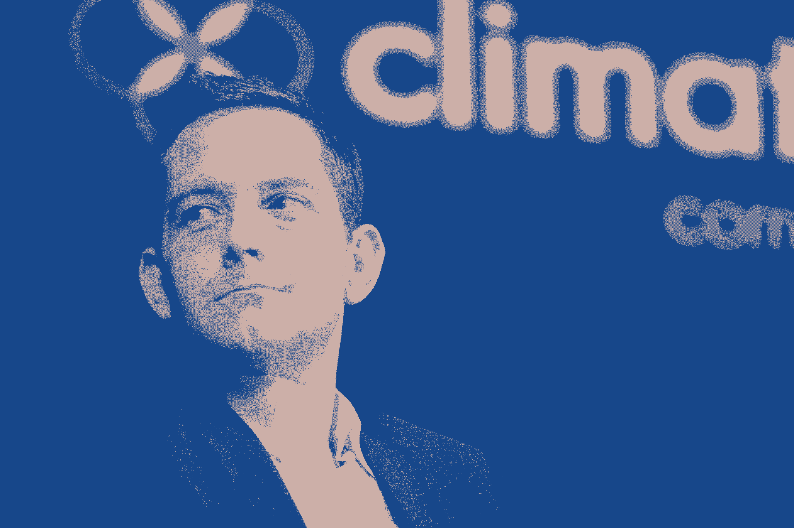

# 有 0.00006%的机会建立一个 10 亿美元的公司:这个人是如何做到的

> 原文：<https://review.firstround.com/Theres-a-00006-Chance-of-Building-a-Billion-Dollar-Company-How-This-Man-Did-It>

大卫·弗里德伯格 从他在谷歌的工作岗位开车回家，在瓢泼大雨中堵车。在路边，他注意到一家面向游客的自行车租赁店，由于天气原因，这家店提前关门了。第二天，他又看到了同样的事情，第三天——持续了一周。“事情到了这种地步，我敢肯定那个地方的主人甚至都没有出现——没有人想在雨中骑自行车。我对自己说，这是一个非常糟糕的行业。”

但后来他想得更多了。“我突然想到，这个人在某个月是否赚钱是基于下雨的天数。这实际上是一个巨大的问题。”再深入一点，弗里德伯格发现每年有超过 70%的企业受到天气的影响——一个简单的统计数据催生了一个想法:为公司提供一种保险服务，当坏天气即将来临时，这种服务将会赔付。

当时，他对保险一无所知，甚至连天气也不知道。但他还是创办了这家公司，并将其命名为韦瑟比尔。[上周，他以 10 亿美元的价格将其出售。](http://techcrunch.com/2013/10/02/monsanto-acquires-weather-big-data-company-climate-corporation-for-930m/ "null")

如今，它更为人所知的名字是**[气候公司](http://climate.com/ "null")** ，这是全国成千上万农民使用的一项服务，以保护他们的收入免受恶劣天气的影响——这也是硅谷最近的成功故事。但这一胜利来之不易。事实上，就在 2011 年公布公司更名之前，弗里德伯格在斯坦福创业角发表了一次演讲，讲述了创业有多艰难，以及创业教会了他什么——所有这些都发生在他瞥见自己最终的幸福结局之前。

# 永远不要说‘我想创业’

对弗里德伯格来说，任何值得做的事情都必须从一个值得做的问题开始。建立公司的愿望不足以让你通过这个过程。

说你要创业或者你想成为一名“连续创业者”和说“我要从飞机上跳下来”的意思差不多

“为什么你会从事这样的活动，你每天都被踢屁股，得不到足够的报酬，忍受多年的痛苦，只是为了找到一个值得解决的问题？”他说。

这样做的唯一原因是如果你对以一种有意义的方式改变世界充满热情。你必须从一个真正影响人们生活的问题开始，然后提出一个他们真正想要的解决方案。这就是他对韦瑟比尔的感觉。

从旧金山 Embarcadero 的自行车小屋开始，弗里德伯格看到了一个充满大大小小企业的国家因天气而损失了数百万美元。除此之外，他看到了可以通过正确的商业模式保护的生计损失。这让他在繁文缛节中艰难前行，经历了多年的市场低迷，经历了无尽的投资者拒绝。

只要看看这些数字，他说:“有 0.00006%的机会建立一家价值超过 10 亿美元的公司。即使你要筹集资金，卖掉一家公司或让它上市，你这样做的平均时间可能是 49 个月。假设有三个创始人，你的平均预期收益是每人 30 万美元——相当于每年 7.3 万美元。而一无所获的概率是 67%。因此，如果你创业的动机是经济回报，你最好去谷歌，一家对冲基金，选择一份有稳定收入潜力的职业。”

如你所知，弗里德伯格是一个喜欢数字的人。在他的工作中，他总是在寻找完成工作所需的数据。为了学习你需要知道的一切——为了在一次又一次的困难中生存——你必须对成功有长远的看法。在他的案例中，这也是你如何在一开始一无所知的业务中获胜的方法。

那么，你从哪里开始呢？

# 摆脱运气

“当你说你很幸运的时候，你很幸运，因为你不知道会发生什么。推论是，如果你知道将要发生什么，那就没有运气。也没有不确定性和风险，”弗里德伯格说。“在这种情况下，你的目标不应该是永远知道会发生什么吗？总是去除未知的东西？”

这就是如何思考创业的根本前提:弄清楚自己不知道的，然后知道它。

如果你把这作为你的目标，在一天结束的时候，你会得到真相和事实。你会知道将要发生什么，如何实现你想要的。这当然是一个理想，但也是一个值得努力的目标。“每个企业都有一定程度的内在风险，”弗里德伯格说。事实上，有很多你可能不知道。一个简单的例子:

你的市场将走向何方？

你的竞争对手准备好了什么？

人们会买你的产品吗？你能以特定的价格出售它吗？

你能保持足够低的运营成本来维持利润率吗？

你真的在给人们的生活增加价值吗？他们会回来要更多吗？

我能招募到我需要的工程师来开发更好的产品吗？

“当你处于早期阶段时，这些只是一些风险和不确定性，但你能识别的风险和不确定性越多，你就越容易把它们从桌面上拿掉，”他说。“识别未知。减轻未知。只有这样，你才能实现你想要的结果，这就是你增加公司价值的方式。”

有很多方法可以揭开未知的秘密。从电子表格右栏不断增长的问题列表开始，设计策略将它们移到左边的“已知”栏。向你的顾问、投资者和客户提出正确的问题，构建要测试的东西，并科学地、有意识地将它们部署到你的用户身上。

在 WeatherBill 的案例中，弗里德伯格需要消除的第一个未知因素是商业模式是否可行。这个想法并不简单。事情是这样的:天气可能对生意不利。幸运的是，天气可以用统计学建模。因此，有理由认为，保险产品可以被设计为针对与天气相关的损失承保业务，将风险转移给第三方。

对该模型同样重要的是:没有索赔过程或损失证明，因为天气可以很容易地通过多个数据源进行监控。为了测试他的理论，他建造了一个原型，并用自己的钱从 200 个气象站购买了过去 30 年的天气数据。他还开发了一个保险定价公式。这足以获得 30 万美元的种子资金。在这一点上，他对自己所知道的感觉很好。好到足以辞掉他在谷歌的工作，留下了相当数量的股票。

他仍然不知道筹集更多的钱会有多难。在沙丘路(Sand Hill Road)周围考虑这个想法时，他一次又一次地被告知，他的商业模式太未经考验，太具挑战性，不值得投资——他追求的市场太广阔，他需要完善自己的计划。只有在天使投资人和一些谷歌上市后的朋友的帮助下，他才能够聚集足够的资金为上市做准备。事情似乎又走上了正轨。

“当我们在 2007 年推出时，我们已经连续几个月全天候工作，我们真的相信我们已经建立了这个伟大的网站，世界上 70%遇到天气问题的企业都会出现，并说，‘终于，这是我一直想买的产品。“让我掏出信用卡，”Friendberg 回忆道。“当然没人买。”

那么问题是什么呢？数据有限？他们把气象站从 200 个扩大到 400 个。没有变化。他们开始参加行业会议，与能源公司讨论天气衍生品市场，并与潜在客户一对一会面。“我们真的在那里说，嘿，建筑公司先生，下雨不会导致你的作业延误吗？嘿，农民先生，如果有一次冰冻，你会失去你所有的柑橘作物，对吗？”

陌生来电是一件非常重要的事情，如果你在与客户打交道，你不能害怕做这件事。你必须这样做，以了解你的客户想要什么。

通过这一过程，该团队能够消除另一个未知因素:人们确实想要这种类型的产品。Weatherbill 能够完成销售——大约 200 万美元，后来成了它的命脉——但只是在为每一个客户做了量身定制的分析之后。“我们使用自己的网站向那些不愿意访问我们网站的人销售产品，因为他们需要技术为他们服务。我们有技术证据，但我们还不知道如何将其转化为产品。”弗里德伯格愿意做一些没有规模的事情，但最终完成了交易。

问题是市场适合度。在打电话给旅行社、户外小吃摊和旅游巴士公司后，弗里德伯格和他的团队意识到他们的业务太分散了。“我们了解了许多不同市场的客户，但我们无法深入到提供他们想要的解决方案。”

在打了数百个电话后，他们逮捕了所有未知的母亲。在这里，他们认为他们有一个死对头:滑雪场将是一个顶级客户。他们必须这样。但事实证明，它们甚至不依赖于天气——如果需要的话，它们可以自己造雪。是时候让 Weatherbill 重新思考它的模型了。他们只需要找到一个受天气影响较大的领域，就能产生稳定的客户流。

“2009 年，我们决定将整个业务聚焦于农业，”他表示。“我告诉团队，我们将专注于农民，因为如果我们以正确的方式做，我们将制造出他们可以反复使用的产品。对我们来说，这是建立可扩展业务的最佳机会。”

最终，它花了两年多的时间才在市场上找到合适的缺口。通过这一切，弗里德伯格不仅对他的员工，而且对帮助他凑齐第一笔重要资金的人和公司，都坦诚了自己的知识漏洞。他说，不要害怕透露自己的想法。无知可能是一种力量。

“我们直截了当地说，这里有我们不知道的所有东西，这里有我们开始知道的所有东西，”弗里德伯格说。“你在这件事上越透明，你的团队就越相信你的使命，公司里的每个人就会越团结，投资者就会越相信你是抓住眼前机会的合适人选。”

完全透明的工作方式让每个人都清楚你将如何成功。

这种抛弃运气、追求清晰的需求是建立强大企业的第一步。第二部分更具战术性——弗里德伯格亲切地称之为“磨砺”的常年阶段。

# 停止担忧，学会热爱工作

一旦 Weatherbill 瞄准了农民的天气保险，他们就开始制造一种适合观众需求的产品。他们做的第一件事是将 400 个气象站换成近 100 万个独立的气象监测网格。“没有人关心 150 英里以外的降雨量，他们希望在自己的位置测量降雨量。这是很多人不买的一个重要原因，也是我们意识到这项技术需要更多地在当地测量天气的时候。今天，我们使用多普勒雷达和卫星图像，以及各种可以在你的确切位置确定天气的东西。”

将公司从 A 点发展到 B 点需要大量的工作——但不仅仅是在技术方面。弗里德伯格和他的小团队有多条学习曲线要爬，包括农业和保险业务。他强调，你不能回避研究带来的挑战——沉重的、几乎无法克服的研究。即使你是某个领域的专家，你也需要学习更多的东西才能有效。

“我们都不是农业出身。我们都没有保险背景。事实证明，除非你的产品写在有执照的保险纸上，否则农民不会买你的产品。所以我们必须想出如何建立一家保险公司。这意味着获得 51 个司法管辖区的监管批准，这样我们就可以在天气出现时签发支票——这是一场大骗局，但它必须如此，而且奏效了。”有时候没有捷径可走。

Weatherbill 团队意识到让他们的客户慢慢地、深思熟虑地接触这项技术是多么重要。当然，他们可以通过自己的网站获得，但通过学习如何起草保险文件，他们能够在一个他们认可并感到舒适的地方会见农民。

2010 年，WeatherBill 推出了它的全天气保险计划——终于有了一个可行的、可扩展的、符合行业规定的模式。人们可以在每个季节购买该产品，网站上每天都有一个接一个的销售。“突然间，我们有了每个农民都想买的产品，所以我们能够根据我们的增长速度筹集大量资金。”

David Friedberg, CEO of The Climate Corporation

这是工作的回报:增长、认同、信誉。当弗里德伯格第一次开始时，他谈到了数十亿美元的机会天气保险。但只有当 Weatherbill 集中精力并投资于使其技术变得有用时，真正的潜力才变得显而易见:事实证明，仅在美国，农民的天气保险每年就带来 200 亿美元的收入，超过一半的农民选择购买该公司的产品，因为它方便又增值。

弗里德伯格说，以前缺乏的是自我意识。

“在这个过程中，你必须非常诚实，有自知之明。在这项业务的发展过程中，我们不得不多次改变我们正在做的事情和我们的工作方式。你不能困在一个地方。”

这可能会变得很私人。

“为了取得成功，你将不得不招募一些人来帮助你完成你自己无法完成的所有研究和测试，为了做到这一点，你必须自我意识到你擅长什么，你的团队擅长什么，以及你是否拥有实现目标所需的人。”

当他的团队达到高速增长时，弗里德伯格决定改名。那时，韦瑟比尔成为了气候公司:成熟的象征，向持续进化点头致意。“你必须将每一天都视为一个新的挑战，并将其视为应对挑战的潜在解决方案。只要你每天都这样生活，你就会进步，”他说。“这就是为什么‘创始人’并不是我真正喜欢的头衔。许多创始人抓住这个头衔和角色不放，因为这是他们所知道的，也是他们的宝贝。但你需要避免这种情况。我今天称自己为公司的首席执行官，我知道明天我可能不一定是公司最好的首席执行官。”

随着规模的扩大而进步需要不断的变化。随着公司的成长，这变得越来越难，但它并没有停止变得重要。弗里德伯格说:“早期，你总是在新事物上冒险，但让它们不成功是与人们认为的成功相违背的。”“当你冒险时，很可能会失败。成功的人不喜欢失败。因此，在扩大规模的同时进行创新的挑战在于，你必须让人们认识到失败是过程的一部分——这是这个反复打磨过程的一部分。”

创新是一个公司唯一可持续的竞争优势。

在这里，他指出了两个不同时代的例子: [RIM](http://us.blackberry.com/ "null") 和莱特兄弟。

“我们可以花几个小时谈论所有因为没有或不能走创新道路而失败的公司，”他说。“你可以说，RIM 的创新没有苹果的创新快，也没有苹果的创新好，所以这就是黑莓失败的原因。”他说，这就是规模阻碍变革时发生的情况。

早期公司的优势在于能够快速迭代和失败——但是一旦他们开始成长，就需要保持下去。弗里德伯格认为，他们需要成为莱特兄弟。

**从一个大问题**开始:“我们需要进入天空。我们是怎么做的？”

**把它分解成更小的、可知的未知数**:“他们知道他们不知道阻力系数或最佳机翼设计，他们着手解决这两个问题。”

**磨砺创新**:“他们自学了工程原理，设计了柔性机翼的原型进行测试。他们知道他们需要在战术上实施一个快速测试的解决方案，所以他们建造了一个风洞。突然间，他们可以测试 200 多种机翼设计，最终他们找到了一种更好的机翼。这不是突破，而是艰难。”

最大的不同是，当你在经营一家初创公司时，你不只是想搭上第一班飞机。你的工作就是一遍又一遍地做。

# 不缺乏需要解决的问题

虽然许多文章断言硅谷的创新已经死亡，但弗里德伯格认为，人们只是没有足够努力地寻找值得解决的问题。

“我听到很多人说，‘哦，我们可以为斯坦福的学生开发一个照片分享应用！’或者‘我们可以做一些像 X 代表 Y 的事情！’弗里德伯格说。但是看看周围。当今世界存在的问题比我们历史上面临的任何问题都要严重——不仅仅是在软件领域，不仅仅是在加州，也不仅仅是你们的同龄人。"

对于那些敢于颠覆的人，他有一些建议:“当你看着当今世界的市场时，你可能会逐个市场地进行细分，然后说，‘这个市场的业务运营方式存在根本性的缺陷。’问问你自己，他们做错了什么？除此之外，政府是如何运作效率低下的？当你这么看的时候，有 100，000 种不同的方法来分解你解决今天的大问题的机会。可能要花一个多周末的时间在图书馆或互联网上才能看到，但它们就在那里。"

更重要的是，现在是年轻聪明的企业家解决这些问题的关键时刻。弗里德伯格说:“如果说信息曾经是思想的温床，那么在过去的十年里，它已经变成了思想的竞争——我们已经开始更喜欢知道事情而不是思考，因为知道有更直接的价值。”“这让我们处于一个循环中。它让我们与我们的朋友和同伴保持联系，这意味着一个不再想入非非的社会。”

我们面临全球经济发展停滞，创新是唯一出路。

在弗里德伯格的背景下，气候公司可能一开始是一个具有巨大、模糊潜力的想法，但它最终触及了众多公司、工作和生活。所有这些人通过为大众生产食物感动了数百万人。鉴于他的经验，他认为未来风险资本和企业家将更加团结一致，共同应对像韦瑟比尔这样的非传统问题。尤其是现在，有证据表明他已经退出了。

弗里德伯格说:“有很多问题可以而且应该得到解决，不仅仅是因为这对你有好处，也因为这对每个人都有好处。”。“一旦你有了这个前提——一旦你找到了该做的事情——策略就是首先知道你不知道的东西，战术就是钻研，价值就是记住:有很多地方可以创新。”

*[点击此处](http://ecorner.stanford.edu/authorMaterialInfo.html?mid=2789 "null")* *观看大卫·弗里德伯格斯坦福创业角谈话原视频。*