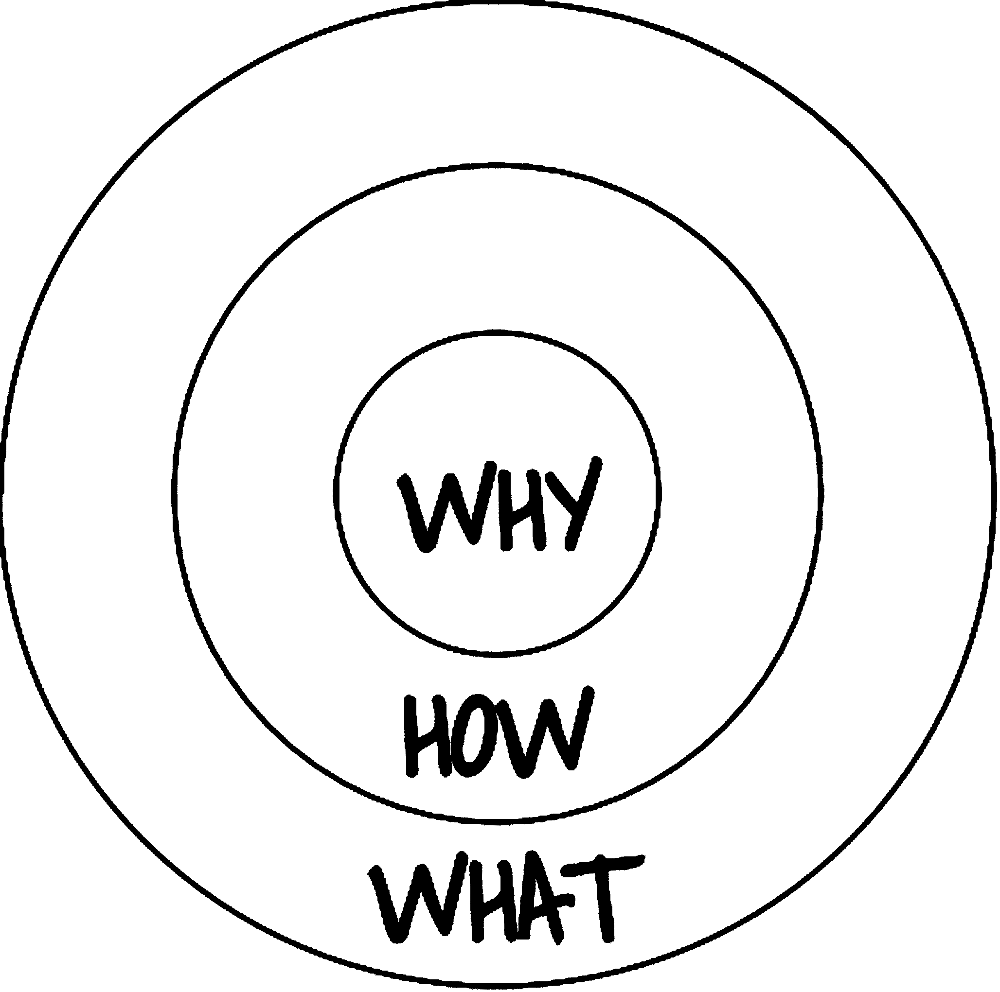

# 这种文化甲板为世界上最艰难的工作提供动力

> 原文：<https://review.firstround.com/This-Culture-Deck-Powers-the-Worlds-Toughest-Work>

**[可能](http://possiblehealth.org/ "null")** **是一家非营利组织，在地球上最具挑战性的环境中运营。**在尼泊尔农村，它是一个拥有超过 260，000 人的社区的医疗保健提供商，这些人基本上没有电、清洁水和基本的基础设施，包括道路。人民仍在从近 10 年前结束的内战中恢复，平均收入为 150 美元，病人平均单程要走 2.5 小时才能得到治疗。面对所有这些不利因素，可能的团队已经被告知他们的工作是不可能的数百次，但他们仍然成功地在别人没有成功的地方取得了成功。

这和科技创业公司有什么关系？据可能的首席执行官马克·阿诺迪说，很多。创办一家公司需要有能力打破障碍，推动不可移动的界限，吸引合适的人加入你的事业，并在面对失败、坏消息和心碎时保持不被吓倒。他说，所有这些都与文化有关:你如何实施它，以及你如何传达它。

今年早些时候，Possible 创建了它所谓的“ [For-Impact 文化代码](http://possiblehealth.org/wp-content/uploads/2015/10/Possible-Culture-Code.pdf "null")”，这是一份由 10 条原则组成的清单，这些原则决定了该组织的工作方式。从那以后，这个平台吸引了捐助者、非政府组织和企业合作伙伴的大量关注。它也为任何努力创造推动行动和协调的文化的组织树立了榜样。

# 一个好的文化平台能实现什么

阿诺迪说:“无论你是非营利组织还是营利组织，每个组织都应该寻求优化三件事:**速度、透明度和问责制**。"这份文件不仅规定了你如何操作，还规定了为什么要同时要求这三者."

阿诺迪说，对于那些正以极快的速度发展产品的初创公司来说，定义好的文化听起来似乎是一种“很好的东西”，但当你认真对待它时，“文化是一套惯例和日常承诺，不仅能加快你的工作，还能确保它反映你的价值观”。([网飞也以强调其文化底蕴而闻名。)](http://firstround.com/article/the-woman-behind-the-netflix-culture-doc "null")

例如，他称 Possible 的晨会为“文化进步”。这是一个 10 到 15 分钟的电话，即使是最偏远的团队成员也能联系到，每个人都分享他们当天将完成的事情，这些事情“大到足以重要，小到足以运输”在这么短的时间内，Arnoldy 能够提高速度，确保每个人都知道其他人在做什么，并让整个团队负责优化他们的一天，以完成设定的目标。

“文化应该给你快速扩展的结构，以及让你的方法独一无二的极度清晰。”

“我们坚持不懈地追求为我们的患者带来显著的效果，这是大多数人认为不可能的；我们有足够的机会放弃、失败和投降，”阿诺迪说。“创业公司面临着同样的现实:除非你有一套原则，人们确实希望回到这些原则上来，因为他们觉得这些原则日复一日地准确描述了他们，并赋予了他们力量，否则他们很容易失败。”

除了激励员工，Possible 的文化准则还通过向外部世界展示强大的身份，以及打造最具生产力的合作伙伴关系，帮助它克服了一些最大的障碍。

“在我们工作的地方，似乎没有转诊护理的解决方案。他说:“患有复杂心脏问题或肺部问题的人没有办法去当地的医院，也没有办法找到可以帮助他们的专家。”。“通过与七家国家转诊医院和健康人群资助组织 Watsi 合作，我们现在不仅能够让患者找到合适的医生，而且还能有人陪伴他们，成为他们的代言人。”

当 Arnoldy 和他的团队着手创建他们的文化甲板时，正是出于这个原因，他们在它的清晰性和展示方面投入了大量的时间和精力。“我们可以只发送一个单词 Doc，但我们希望能够将它分发给人们，并说，这就是你想要与之合作的团队。”

同时，一个强大的文化平台给你机会说出你不是什么。“至关重要的是，你要划清界限，完全透明地表达你是谁，你不是谁。否则，你最终会遇到一群被迷惑的合作伙伴或员工，他们浪费你的时间，而不是那些会帮助你发展的人。”

**Possible 的整个文化准则，列出了它的所有十个指导原则，可以在这里找到:**

**黄金圈演习**

因此，当涉及到建立一个封装你公司文化的平台时，你从哪里开始呢？

为了回答这个问题，Arnoldy 引用了 Simon Sinek 的 [TED 演讲(TED 有史以来第三受欢迎的演讲)，他将历史上的伟大领袖进行了比较，并提出了一个共同的区别:他们都是从“为什么”他们正在做的事情开始的。听起来很简单，但是在这个世界上，人们正在设计增量功能，或者只是希望获得一份受人尊敬的工作，这是一个很容易被遗忘的原则。](http://www.ted.com/talks/simon_sinek_how_great_leaders_inspire_action "null")

Sinek 用“为什么？”来描述他所谓的黄金圈在中间，被“如何？”被“什么”包围着 Arnoldy 在开始构建 Possible 的文化时使用了这个框架，并向其他从头开始构建文化文档的创始人推荐这个框架。为了说明它的价值，他引用了 Sinek 的相关例子:苹果。

“你看着苹果，你会看到一家激发员工和全球数百万人激情的公司，”他说。“但他们不会说，‘我们制造了很棒的电脑，买下它们吧。’他们说，‘无论我们做什么，我们都相信挑战现状。我们相信不同的思维方式。这就是他们的“为什么”,他们在交流中非常一致。"

正如 Sinek 所说:

“人们买的不是你做什么，而是你为什么做。”

对于非营利组织来说，有一个清晰的目标感可以吸引捐赠者，帮助他们扩大自己的足迹。对公司来说，它可以帮助减少噪音，发出清晰的信号，为你赢得客户和品牌大使，让他们与他人分享你的价值。

一旦你把“为什么”放在了黄金圈的核心位置，你就可以考虑如何实现这个目标，以及“是什么”——你将向世界展示的实际行动和计划。对苹果来说，它制造的电脑可以让购买它们的人以不同的方式思考、工作和与世界互动。可能的话，这些圈子充实了其文化层面的其余部分:

**如何做:**有助于实现提供高质量医疗保健承诺的品质。

**What:** 产品和程序应该是什么样子，应该如何构建来满足这个标准。

阿诺迪说:“黄金圈练习的一个最好的特点是它天生就有抱负。”“我们一直在努力学习什么是有效的，我们希望如何行动，我们如何才能为更多的人提供最好的护理。只要“为什么”保持不变,“如何”和“是什么”可能会改变。这就是工作文化保持灵活性的方式。”

Arnoldy 特别强调了几个与任何组织相关的属性，这些组织不仅想要成功，而且要为其客户、行业和员工做出真正的改变。

# 勇气

Arnoldy 说:“毅力可能是你的组织所能拥有的最重要的品质。“失败是经常发生的，它对你打击很大。在一天结束时，你的团队，尤其是你的领导需要提醒自己，他们所做的工作与自我或自我满足或认可无关。”

“坚韧不拔的人如果没有真正完成工作，他们不会在乎自己的简历上写了什么。”

“不管结果如何，你都希望人们献身于战斗。他说:“我们总是分享《博伽梵歌》中的一句话，‘你有义务参与这场战斗，但无权分享它的果实。’”“不管有什么阻碍他们，他们都会继续执行。**最重要的是，这是我见过的任何组织的最佳秘方。”**

谈到招聘勇气，阿诺迪承认这是一门不精确的科学。在大多数情况下，你需要尽最大努力在面试过程中发现这些品质，然后大胆尝试。“我们试图让人们尽快开始工作，这是真正的关键时刻。”

面试时，他推荐了两个关键问题。首先，问问求职者，他们是否觉得自己在职业生涯中处于目前的位置是幸运的。肯定的答案指向乐观和感恩。然后让考生给你讲一个他们冒险失败的时候，和一个他们冒险成功的时候。询问他们的方法有何不同，他们的感受如何，他们后来做了什么。“这真的向你展示了一个人有多么愿意勇敢，敢于失败，当他们失败时，他们有多么坚韧，即使成功了，他们仍然保持多么谦逊和专注于执行。勇气与谦逊密切相关。”

在任何面试过程中，表现出一个候选人是否有勇气都是最重要的目标。阿诺迪说:“面试的其余部分实际上取决于他们如何回答这些问题。”。“如果我们对他们在这方面的能力感到满意，我们会努力让他们尽快投入工作，看看这种情况是否会延续到现实世界中。”

大多数初创公司的员工不是在恶劣的环境中工作，也不是缺乏基本的必需品，但毅力对他们公司的成功仍然至关重要。创办一家公司非常困难，失败总是显而易见的现实。让勇气成为文化的支柱，成为招聘过程中的决定性因素，可以确保你建立一个无论如何都能把事情做好的团队。

# 效率是一种道德要求

“我们这一代人面临的一大挑战是证明目的可以战胜利润。”

每一个创业公司都是为了服务客户而建立的，无论他们是消费者还是企业。获胜的唯一方法是为这个群体提供更好的服务——比你的竞争对手做得更好。Arnoldy 说，当你将这一概念作为日常运营的核心时，你就开始将效率视为一种必须。如果你能向你的员工灌输一种对利益相关者的道德责任感，他们会激励自己把工作做到最好。

“我认为有一些东西比金钱更能产生影响，”他说。“创建一个影响人们生活的企业，即使是在很小的方面，也是极其强大的。你可以把这一点作为你管理模式的一部分。对我们来说，我们告诉员工想象一个病人就坐在他们旁边。对于其他公司，想象一个有需求的客户，他没有你能够提供给他们的解决方案。当你这样做时，你就创建了一家不断自我完善的公司。”

# 培养伟大

阿诺迪说:“要运营一个真正伟大的组织，你的领导层需要知道，他们生产的每样东西，离开他们手中的每件工作，都是为了建立信任。”。“当你通过这个镜头看待事物时，即使是像错别字这样的小事也很重要。突然之间，从不发送有错别字的文档变得非常重要。”

人们对新公司的关注时间越来越短。他们通过网络或手机与他们进行短暂的互动，在这短暂的时间里，一件产品要么赢得他们的信任，要么可能永远不会再被使用。鉴于这一现实，你必须不断努力在你所做的事情上做到最好——如果你只盯着配额或竞争对手，你是不会做到这一点的。

阿诺迪说:“我们不会把所有的时间和注意力都花在好的设计和交付上，只是为了从我们的资助者那里筹集更多的钱——这不是我们这么做的原因。”。“我认为，如果是这样的话，我们会不断做出妥协，比如说，‘这比 80%的非政府组织做的都好，所以已经够好了。’我们必须继续努力。"

“你可以是 JV，也可以是校队。这是动力和不断追求更好的动力。”

该团队在发布前会不断评估自己的工作，并使用初级代表队(JV)和代表队这两个类别来确定哪些需要更多的工作，哪些已经准备好了。“我们看到许多公司和组织运送合资企业的优质产品。我们的目标是只运送大学代表队。”

# 做一个消息灵通的反向投资者

挑战不可能的事情是高尚的。这是人类进步的唯一途径。无论你是在重新定义一个行业，还是针对一个普遍问题提出一个违反直觉的解决方案，你都有机会做出巨大的改变——但前提是你已经做了功课。

在可能的情况下，Arnoldy 和他的团队不断挑战反对者，尝试新事物。但是他们不是在真空中制定战略。Arnoldy 说:“我们深入研究了尼泊尔的国家卫生保健预算，在那里我们观察了所谓的政府‘吸收能力’——基本上，政府能够在卫生保健部门花费多少。“事实证明，在任何一年，他们都只花费了分配预算的 70%，所以我们推广了他们可以投资更多的想法。”

不出所料，他遭到了很多质疑。人们反复告诉他，政府太穷、太腐败、太官僚，无法改变它的方式。他的回答是，向他们展示了 Possible 的解决方案人均成本仅为 3.48 美元，而政府非常愿意花费 6 到 7 美元来做同样的事情。“我们能够向他们展示这一领域的发展空间。”

阿诺迪说，当你挑战现状时，你需要不断问“为什么”事情是这样，直到你得到满意的答案，而“我们没有足够的数据”不算数。“优秀的企业家会找到创建数据集的方法——即使你必须深入挖掘无关的数据，或者与足够多的人交谈，以使轶事证据变得有意义。”你想要一种强调教育破坏的文化。

“有时候你不得不做一些不合时宜的事情来表明你的观点。”

当你没有大量的用户、顾客或病人可以利用时，尤其如此。在这种情况下，你能做的最好的事情就是花更多的时间和你拥有的人在一起。弄清楚是什么让他们产生兴趣，你的产品或服务如何更好地满足他们的需求，你如何投入资源解决他们的问题。在这个过程中，你创建了自己的数据集，了解了如何接触到更多的人，并创建了品牌倡导者，他们觉得自己与你的长期成功有利害关系。

Arnoldy 说:“我们这次接触的病人回到他们的家乡，告诉每个人他们对我们系统的体验——口碑急剧增长。“我认为这对技术领域也很有意义，因为当你投入时间和精力去了解一个或几个用户的需求时，他们可以帮助你创造更多的需求。

# 为尊严而设计

阿诺迪说:“在科技和非营利领域，都存在巨大的权力和知识失衡，我们往往会低估用户对优秀设计的欣赏——无论是视觉设计、产品设计还是交互设计。我们一直看到的是，无论人们是富有还是贫穷，无论他们来自哪里，他们都对什么是好产品有着根深蒂固的认识。"

因此，Possible 建立了一种文化，无论做什么都将设计放在首位。“为了削减成本，有一点经常被忽视，那就是漂亮、设计良好的医院更有可能产生影响。这听起来可能很肤浅，但有证据表明人们有更好的体验。临床工作人员的行为更加专业。从基础设施一直到医生的名片，一个有尊严的机构将吸引更多的人，并做得更好。"

同样，对于科技初创公司来说，设计可以影响人们对待工作的认真程度，用户愿意参与的程度，他们愿意自愿提供多少个人数据。例如，像薄荷这样的公司需要人们让他们了解自己的财务状况——而鼓励这种做法的最佳方式就是通过可靠、值得信赖的设计。

“最好的设计弥合差距，创造相似之处，产生共鸣。”

虽然科技企业家可能不会像 Arnoldy 那样考虑为用户创造尊严，但他们可能应该这样做。“你希望创造一种文化，让每个人都明白，用户应该得到漂亮、直观的设计——这成为尊重的标志——仅仅因为你比他们更了解技术，并不意味着你可以忽略演示。”

# 运动队对家庭

听到创业公司称自己为“一个大家庭”并不罕见。许多其他人赞同这样的观点，他们应该把个人生活放在一边，表现得更像是获胜的运动队。Arnoldy 认为，你需要两者的结合来优化绩效，确保高昂的士气，并保持事情顺利进行。

他说:“我们希望我们的团队成员感觉他们在为这个领域最好的公司工作，而实现这一点的唯一途径是他们感觉到作为人类受到了全面的关注。”。“你不能在职业强度和个人支持之间进行权衡——这是我希望早点学到的一课。我过去认为它们处于同一光谱的相反两端，但现在我发现它们完全处于不同的光谱上。”

“只有当你的员工想为你做最好的工作时，你才能表现出职业热情。”

这并不一定意味着钻研员工的个人问题，原谅巨大的错误，或者允许他们偷懒。你还是想参加全明星队。相反，你应该努力创造一种基于个人成长的领导文化，鼓励员工幸福的结构，以及谦逊地承认没有人是完美的，只要每个人都真正尽了最大努力，那就没问题。"

首先，找到正确的平衡也是雇佣正确的人的问题。这是 Arnoldy 喜欢让新员工尽快进入工作的另一个原因——如果他们不喜欢或不能胜任工作，他们最好早点分手。

他表示:“从根本上说，你希望雇佣具有成长思维的人。”。“研究表明，大多数人要么有固定心态，要么有增长心态——他们在充满挑战和不确定的环境中生存和发展的唯一方式是拥有后者。”

创造成长文化的一部分是将有前途的员工与合适的导师配对，以帮助他们发现和发挥自己的才能。“我们希望尽我们所能给人们所有的工具和机会来引导他们自己的成长。这就是我们最终会得到能够领导整个业务领域的人的原因。**在他们入职的第一天，我们会特别问:“你希望和谁联系成为潜在的导师？”然后我们会尽一切努力让它发生**。"

# 履行

一旦你记录了你的文化，你需要用一种重要的方式来部署它。阿诺迪说:“当我们创建我们的[文化代码](http://possiblehealth.org/wp-content/uploads/2014/02/Possible-Culture-Code-1.pdf "null")时，我们清楚地表明，它与整个组织的品牌重塑、网站的重新启动以及一切都具有同等的重要性。”。

“我们与美国和尼泊尔的领导团队坐下来，提出了最终的文化价值观清单，但这些会议的目的是详细讨论未来会有什么不同，”他说。“当我们这么说的时候，甲板突然变成了人们真正想做的改变的催化剂。我们讨论了它对提高速度、透明度和问责制的影响，我们得到了很多关于我们用于患者监测和绩效评估的工具、管理结构以及工作实际完成情况的反馈。它让每个人都团结一致。”

这些讨论促使 Arnoldy 和他的团队与涉及组织这些部分的合作伙伴分享这些资料。他们把它发给了 [Asana](https://asana.com/start "null") 、 [BambooHR](http://www.bamboohr.com/ "null") 和[Small Improvements](https://www.small-improvements.com/ "null")——他们已经与之合作的公司，以跟踪他们的工作、候选人和员工表现。这三个人回来后都很受鼓舞，带着新的想法去改善现有的系统。

Arnoldy 说:“你的文化不仅仅是关于你的公司或组织如何在内部运作，它还定义了你所有的互动。”“用言语表达。让它成为你自豪地分享的东西。让它成为你所有能做和将要做的伟大工作的名片。”

*在假日季节，请查看**[Possible ' s campaign](http://hospital.possiblehealth.org/ "null")**，了解如何建造尼泊尔第一所乡村教学医院。*