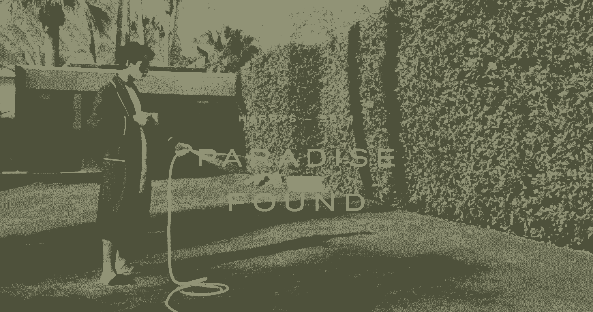
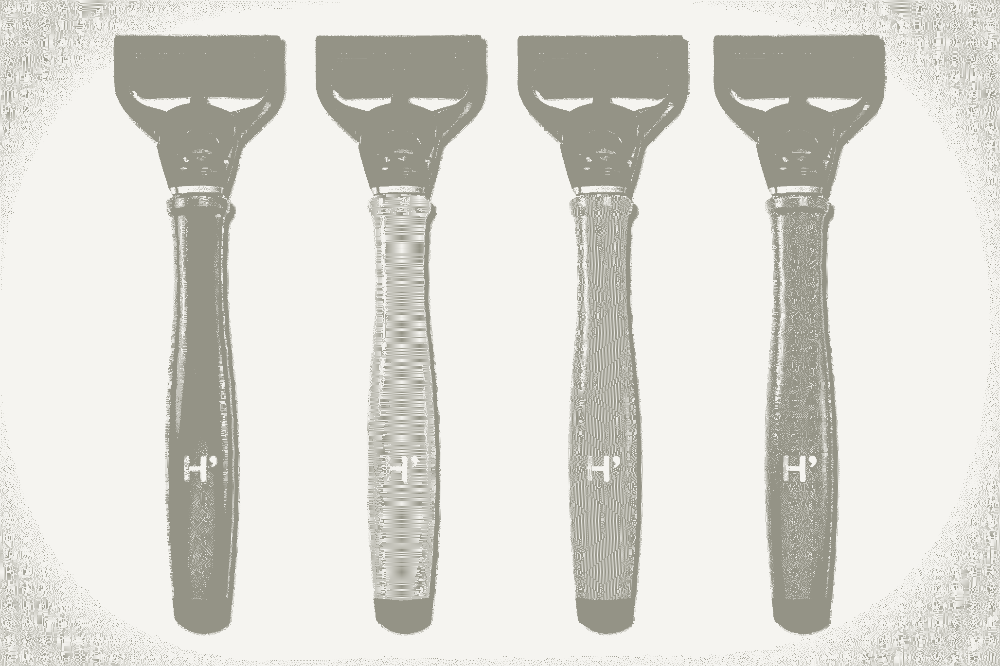
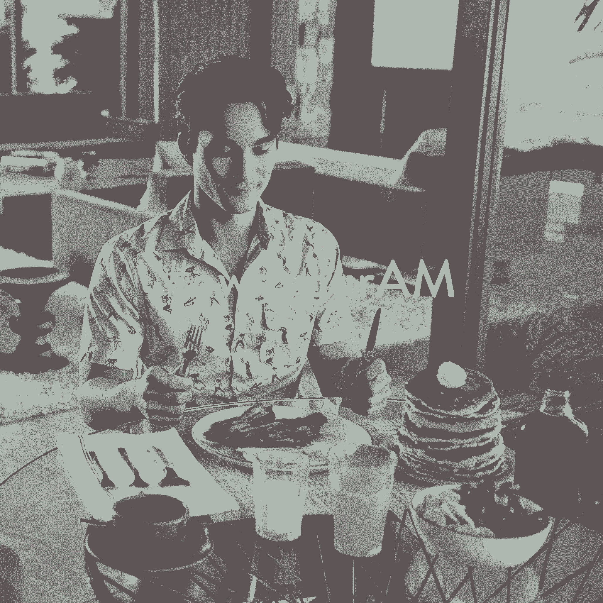

# 这家初创公司凭借品牌效应打开了一个价值 24 亿美元的市场——这是他们的公式

> 原文：<https://review.firstround.com/This-Startup-Cracked-a-24-Billion-Market-with-Branding-Heres-Their-Formula>

乍一看，自从电动剃须刀问世以来，男性刮胡子的方式并没有太大变化。但是有一家公司正在改变现状:一家名为 [Harry's](https://www.harrys.com/ "null") 的网络初创公司将自己标榜为一种简单、优质且更实惠的剃须解决方案，并且正在与吉列和希克等巨头竞争 24 亿美元的市场。

听起来像是天方夜谭，除了哈里已经从技术风险社区筹集了 1.365 亿美元。最重要的是，它的联合创始人之一是[杰弗里·拉德尔](https://www.linkedin.com/pub/jeffrey-raider/6/40/2b3 "null")，他在 Warby Parker 担任过同样的角色，拥有用酷品牌打开市场的经验。

如今，这个品牌由设计总监加勒特·莫林和数字产品总监马修·塔利负责。他们一起讲述了引人入胜的故事，这是哈利价值和身份的核心。对于其他消费品公司如何利用网络和故事来做同样的事情，他们有一个公式。他们在纽约第一轮的最新设计+启动活动中透露了他们的秘密。

**为什么用讲故事的方式销售**

首先，为什么要刮胡子？

哈利的大多数员工都不止一次被问到这个问题。答案是一个故事:联合创始人安迪·卡茨·梅菲尔德(Andy Katz-Mayfield)去当地药店买了一把剃须刀，发现自己为一种不起眼的产品支付了太多钱，而且只有几个备用刀片。当他告诉他的朋友杰夫时，他们决定必须有一种更好的方式来给剃须注入负担得起的、有个性的和创造性的感觉。这些原则已经成为公司的北极星。

莫林和塔利说，在销售商品时，即使是这么简单的情节也很有力量。当你的目标是推销一种体验时，故事必须是你战略的核心。这种策略让他们完成了对任何品牌的成功都至关重要的三件事:

**1)把客户变成拥护者。**

“我们希望为顾客提供他们需要的所有工具和信息，让他们能够用自己的声音谈论哈利波特，”塔利说。“如果我们能够包装我们希望我们的产品创造的体验、情绪和感觉，并将其放到客户手中，那么他们就会成为我们信息的传声筒。"

当该公司推出限量版剃须刀手柄系列时，塔利和莫林冒险前往纽约北部，拍摄一个男人独自在湖上度过周末的短片。“我们想捕捉这一瞬间，来描述产品带给你的感受。”展示一个与消费者日常生活如此不同的形象使它令人难忘。值得纪念的成为了谈资。

参与对话。

去年，哈里在 12 月 1 日大张旗鼓地发起了[全国剃须日](https://www.harrys.com/national-shave-day "null")——借助另一种文化面部毛发现象:[十一月](http://us.movember.com/ "null")。这样做，他们吸引了他们的目标市场，不仅显得及时，而且有先见之明。一个月没刮胡子后，各地的男人都急需一把好剃须刀。

“节日创造了更多关于品牌的故事。莫兰说:“我们在理发店举办了一场活动，把它放在网上，在社交媒体上推广，我们看到了转化的爆发。“当我们讲述与人相关的故事时，这是显而易见的。在全国剃须日，我们看到网站流量上升了 360%。

强调专业知识。

Harry's 采取了两项行动，提高了他们作为剃须专家的可信度:他们在曼哈顿开设了自己的街角理发店，并投资 1 亿美元在德国(一个著名的精细工艺之乡)购买了自己的剃须刀工厂。虽然这些都是具体的行动，但围绕它们的品牌却产生了影响。两家公司在公司网站和社交媒体上都有大量的不动产——包括他们理发师的简介和直接来自工厂车间的粗糙视频。没有模特。不装腔作势。

“宣传我们现在与刀片垂直集成的事实产生了惊人的副作用，”Tully 说。“当我们发布工厂的故事时，它启动了与客户的反馈循环，我们立即将其投入生产。现在我们可以讲一个更好的故事，我们一直在改进，我们的客户是其中的一部分。”

当涉及到将这些故事整合在一起的具体细节时，莫林和塔利依赖于一个屡试不爽的公式，这个公式帮助他们完成了上述每个故事——吸引了成千上万的新客户和粉丝。事情是这样的:

构建您的故事

设计你的产品

勾画你的执行

传递灵感

每一步都建立在前一步的基础上，创造一种在产品和促销中保持一致的品牌语言。这是该公司传达一种端到端体验的方式:如果你使用我们的产品，这就是你的感受。

**故事建筑**

作为品牌化过程的第一步，这也是最乱的。也许是最有趣的。

“我们的目标是尽快营造一种氛围，”塔利说。“我们快速行动，收集我们能找到的所有符合我们要求的外观和感觉的东西。走出去，找到那些体现你想要创造的感觉的纹理、颜色、照片、电影、音乐。”

其中一些灵感是抽象的——一个颜色样本，一首当你和朋友在后院闲逛时出现的歌曲。其他人会超级字面:“这张照片是我们的运动应该看起来几乎完全一样。”你想在一个有限的时间内抓住这一切，并把它放在一起，注意到共性，对比，弦外之音。

设计师经常将这些拼贴画称为“情绪板”，但正如莫兰所说，“这个过程的伟大之处在于，它可以与非设计师沟通。”

我们不断提醒自己，我们不仅仅是一个品牌，我们是整个公司。

这意味着与许多想法不同的人一起工作并听取他们的意见——从街角商店的理发师到金融工程师。莫兰说:“我们需要能够用一些我们能够容易解释的东西来接近所有这些人，这将清楚地表明我们试图实现的目标和原因。”“当我们展示所有这些图像时，我们可以说‘70 年代冲浪者文化’或‘东海岸海滩’，人们马上就会明白。命名和说出这些灵感是这个过程的一部分。”

对于今年的春夏系列，哈利的团队发现自己在令人瞠目的橙色和蓝绿色的影响下，在棕榈泉建筑的照片上层层叠叠。然后，莫兰展示了一部电影片段，展示了意大利设计师兼建筑师埃托雷·索特萨斯的住宅。“几何图形很美，心情很平静。我们马上就知道这就是我们想要的，”他说。

所有这一切在一次活动中达到高潮:**发现天堂**。这是一个看起来相当普通的人的形象，脸颊上涂着剃须膏，一只手拿着咖啡杯，正在用平房给他的草坪浇水，背景是棕榈泉标志性的山脉。“这是一张周末的照片。一个男人。他没有超模女朋友。他不想要镀钻石的浴室。他只是想好好刮刮胡子，”莫林说。当这一切汇集在一起时，它不仅仅是一系列照片或视频，而是一种与客户联系的体验。

**产品设计**

当你看到那些通过展示一种新型“酷”而成功击败主要竞争对手的消费品公司时——比如 Warby Parker、TOM's Shoes 或 Patagonia——很明显，品牌延伸到并塑造了产品本身。Harry's 将这一点提升到了一个新的水平，将剃须刀的颜色、纹理和材料设计成与促销活动相同的风格。

“当我们开始设计春夏系列的手柄时，我们仔细研究了收集到的所有不同颜色的样品，最终选择了几种颜色，”Morin 说。值得注意的是，如果你把四个不同的把手举到上面的照片上，你可以看到一个抓住了花园软管的颜色，另一个抓住了咖啡杯的颜色，还有一个抓住了背景中建筑的土灰色。几乎天衣无缝。

但莫林和塔利并没有就此止步。“问题是，这些独特的颜色是否足以让顾客离开我们的网站，去他们的浴室拿剃须刀——我们做了足够的工作来传达棕榈泉的寒冷吗？”

回顾他们的情绪板和电影剪辑，他们注意到有多少木材纹理不断出现。它代表了他们生产的宝石色剃须刀所缺少的阳刚之气和庄重，他们知道他们必须包括这一点。

莫兰说:“实际上，为了让这种塑料剃须刀的底部有木头，我们做了大量的工作。“但当你在讲述一个故事时，尤其是在网络环境下，你需要以同样的方式设计你的产品。”

你想把产品推多远就推多远。抓住机会把事情做好。

**餐巾草图**

莫兰说:“餐巾纸草图很快，是一次性的，它们可以说是把想法从你的头脑中拿出来并写在纸上的最好工具，这样你就可以知道它们是否可行。”

从产品回到围绕产品的宣传，哈利的品牌团队表示，他们几乎所有的营销宣传材料——特别是照片和视频拍摄——都是在草图的指导下进行的，直到它们到达拍摄现场。

“有一种误解认为摄影师不需要太多的指导，但事实是你需要一些东西来让你前进，”莫林说。“餐巾纸草图是一种很好的方式，可以告诉你，让我们先处理这个镜头，然后你可以看看灵感会带你去哪里。”

这种策略最大的好处是:高投资回报率。

“草图的效果惊人，”塔利说。“创建它们只需几秒钟，但却为您节省了大量时间、金钱和资源，而且只需轻轻一推就能开始执行。如果是摄影、电影、动画或数字设计，你会想要一些能让你接近的东西，但不是所有的东西。”

你想提前计划，但有自由去做一些完全不同的事情。

精心制作的故事板和脚本将你锁定在某个特定的东西上，即使当你亲自看到它时，它显然不是正确的方向。

“这都是关于可视化你的执行，”塔利说。“如果你快速粗略地勾勒出事情的轮廓，你就能越快地扼杀坏主意，而不会觉得自己在扼杀神圣的奶牛。在任何事情还没有完全烤熟的时候，很容易就离开事情，接受批评。通常情况下，这些快速蓝图会融入到您最终交付的产品中。”

**战略交付**

一旦你拥有了一项活动或讲述一个特定故事所需的所有资产，你就需要小心使用它们。策划它们的发行需要和创作一样多的努力和技巧。

“作为沉浸在所有这些图像和故事中的人，很容易忘记你的客户还没有看到任何东西，”Morin 说。"你如何与你的听众分享它们将决定它们最终的效果."

对于春夏系列，发现天堂的形象成为展示剃刀手柄本身所投射的生活方式和氛围的外观书的锚。这本书被设计成和新的把手一起被分发到媒体渠道。此外，他们创作了大量照片、适合社交分享的快速视频，以及将所有这些联系在一起的语言。Twitter 和脸书上的标签 **#ownyourAM** 就是一个例子，这也是为了让顾客记住宁静、天堂般的早晨。

塔利强调，另一个关键是确保你的内容不会妨碍你更高的目标:销售。

“我们试图让人们希望我们的剃须刀成为他们生活的一部分，所以我们的目标是以同样平稳的速度发布内容——而不是在产品发布之前或期间，”莫林说。“将我们引以为豪的所有内容拼凑在一起，会违背最终目的。关键是以创造性的方式使用它。”

你讲述的故事需要补充购物和购买体验。

在实践中，这意味着将你的大部分资产放在网站之外:在社交媒体、广告、传统媒体点击中，在真实世界中，人们会有机地遇到它们。塔利说，最大化可见性是关键。对于创业公司来说，可见性就是分享能力。这就是为什么像 Harry's 这样的品牌如此重视照片，因为它们是跨渠道共享最多的内容。

“你的内容能接触到的人越多，越多的人会对你创造的体验产生共鸣，越多的人会购买并向他们的朋友谈论它，”他说。“当他们降落在我们的网站上时，我们不想浪费他们的时间。便利是我们讲述的故事的一部分。”

这并不意味着哈利的网站不做任何讲故事。整个版面都在讲述最能定义他们试图传达的形象的故事点:[街角小店](https://www.harrys.com/cornershop "null")，[工厂](https://www.harrys.com/our-factory "null")，这个起源故事将他们整齐地归入重视可实现质量的普通、努力工作的人的类别。这种信息嵌套在网站中的方式让用户可以更深入地挖掘哈利的品牌，如果他们想，或者简单地进入和退出他们想要的产品。

“如果你喜欢我们的品牌，你会买绿松石木手柄。莫兰说:“如果你喜欢我们的品牌，你会看着那个家伙给草坪浇水，看更多的照片，与我们创造的东西产生共鸣。

我们的目标是让您喜欢我们，并离开热爱我们的网站。

他说，这种情况是否会发生，取决于用户和顾客在哈利故事中的投入程度。你围绕品牌所做的一切都应该让这种投资变得像你所有的品牌看起来一样容易和不费力。