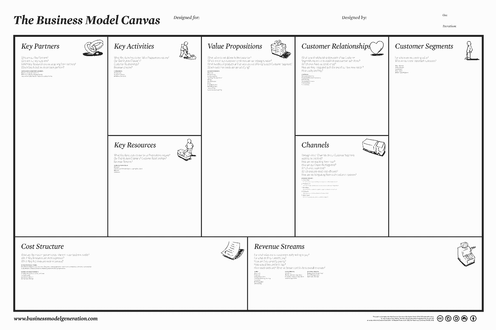
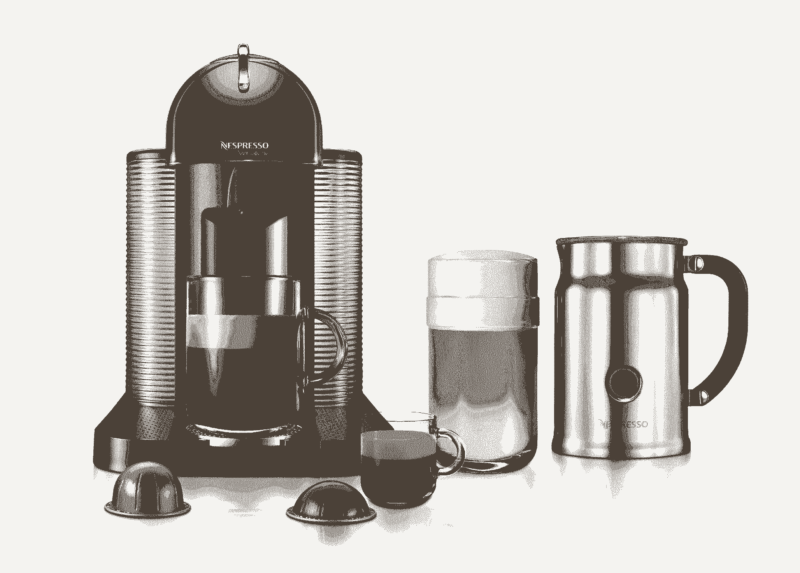
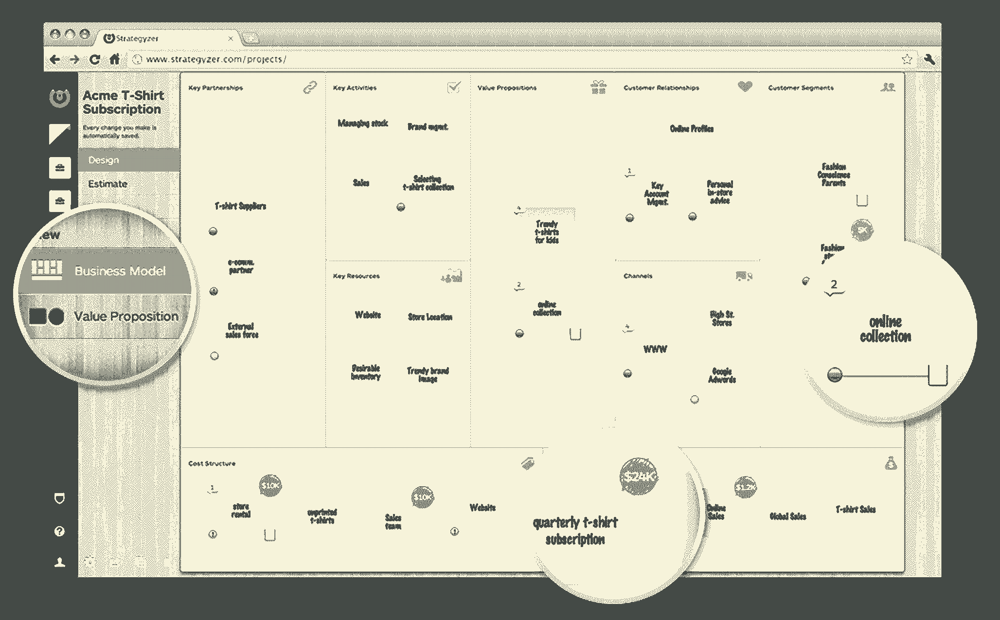

# 创业公司需要集思广益、测试并赢得胜利的一个工具

> 原文：<https://review.firstround.com/To-Go-Lean-Master-the-Business-Model-Canvas>

如今“精益”这个词无处不在。精益流程，精益创业。虽然《精益创业》的作者 Eric Ries 可能已经成为这场运动的代言人，但它的理念很大程度上是基于一种叫做[的商业模式画布](http://en.wikipedia.org/wiki/Business_Model_Canvas "null")的东西——一种由作家兼企业家 [Alexander Osterwalder](http://alexosterwalder.com/ "null") 和瑞士学者 [Yves Pigneur](http://www2.hec.unil.ch/wpmu/ypigneur/bio/ "null") 开发的工具。

商业模式画布的设计极其简单，它使企业家能够创建、可视化和测试商业模式，而不会浪费资本或使他们的方法过于复杂。今天，它被初创公司用来开拓新的领域，也被通用电气、P&G 和 3M 这样的大公司用来探索新模式和跟上竞争。这也是《商业模式的产生》一书的核心(由奥斯特瓦尔德和皮涅尔合著)，该书已经以 30 种语言售出了 100 多万册。

在斯坦福大学的创业角，奥斯特瓦尔德和精益传播者史蒂夫·布兰克展示了商业模式画布对初创公司的价值:他们如何利用它来产生想法，消除猜测风险，并确保他们为正确的人解决正确的问题。下面，学习一张纸如何帮助你的公司找到并保持产品/市场的契合度。

# 基本画布

奥斯特瓦尔德说:“据说没有一个商业计划能在与客户的第一次接触中存活下来。”。“它一出来，你想做的第一件事就是烧掉它，你会觉得自己浪费了这么多时间。”业务模型画布部分源于创建更灵活的计划的需求，这些计划可以快速测试和更改以满足客户需求。最重要的是，**它将商业模型的元素标准化，并将它们转化为可预测地相互作用和影响的模块。**

“当我问‘什么是商业模式？’“无论我去哪里，都会得到不同的答案，”奥斯特瓦尔德说。尽管这是一个我们都经常使用的词，但答案和房间里的人一样多——有些人认为是利润，有些人认为是产品、技术、流程、战略、销售渠道。如果我们都同意什么是商业模式，我们会有更好的讨论。“画布创造了这种共享的语言，并使其可视化，以达到清晰明了的效果。

商业模式画布由**九块积木**构成——这九块积木让你思考成千上万种可能性和选择(并找到最好的):

客户群(您的受众)

价值主张(你提供的产品或服务)

接触客户的渠道(分销、商店)

您希望与客户建立的关系类型

你创造的收入流你必须使用的关键资源(资本、人才)

可以用来创造价值的关键活动(营销、工程)

您的主要合作伙伴(谁可以帮助您利用您的模型)

商业模式的成本结构(你必须投资什么)

排列这九个元素是为了显示它们是如何相互影响的。奥斯特瓦尔德帮助开发的画布——现在被广泛使用——看起来像这样:

建议 Canvas 用户从他们希望服务的客户群开始(你认为你的产品或服务可能会迎合多个受众)，并通过图表确定他们需要什么(你的价值主张)，你将如何接触他们(渠道)，你计划如何赚钱(收入流)，你必须与谁合作(关键资源和活动)，谁可以帮助你(合作伙伴)，最后，考虑到你的所有成本，你应该如何为你的产品定价。此处可以看到该工具的演示:

[你可以在这里免费阅读这本书的前 70 页，那里详细描述了画布。](http://businessmodelgeneration.com/book "null")

史蒂夫·布兰克认为，商业模式画布就是将你的业务分解成未经测试的假设。在每一个街区，你可以问自己——我相信是真的东西真的会被证明吗？我应该为这些顾客服务吗？这是他们真正想要的产品吗？这是向他们提供产品的最佳方式吗？他们会支付这个数目来访问它吗？**画布给你一个系统化的方法来组织猜测，以便研究和测试。**

奥斯特瓦尔德建议把画布画得大一些，最好是在一面大墙或白板上，这样你就有很多空间去思考和实验。一旦你有了这些，你应该借鉴设计思维，用便利贴来填充各个模块。为什么要贴便利贴？因为画布就是四处移动东西，看看什么最合适。

“对于画布上的每一块积木，你都想开始填充想法，”他说。例如，您希望为您可能服务的每个客户群提供一张便利贴，并为您可能为价值主张块中的每个客户群创造的每种价值类型提供便利贴在渠道板块，你可能有从应用商店到卡车路线的任何东西的便利贴。对于关键资源，你可能有工程师、品牌认知度、库存等。目标是大致勾勒出你想做什么，以及你有什么武器来完成它。

使用便利贴的好处在于，你可以快速、轻松地看到任何变化将如何波及你的整个商业模式。“如果你已经想好了所有的想法，你可以问自己，‘如果我取消一个客户群，会发生什么？整个模型会怎么样？我能拿走一个频道吗？奥斯特瓦尔德说。我能拿走资源吗？这就像一个气球——当你推一边时，它会影响另一边。你可以看到各部分之间的关系。"

为了说明商业模式画布的用途，他引用了著名的雀巢品牌 Nespresso 的选择。该公司以生产面向普通消费者的时尚便携式咖啡机而闻名，也生产调味咖啡“胶囊”，你可以把它放在机器里快速、干净地冲泡。Osterwalder 解释说，虽然出售机器是公司的一个收入来源，但大部分都流向了机器制造商。相反，Nespresso 的大部分利润来自高利润的胶囊，它已经申请了专利并自己生产。一旦你有了机器，你必须一次又一次地回到 Nespresso 购买胶囊。这就是他们想要的客户关系类型:消费者愉快地锁定品牌。

在这种情况下，专利胶囊是代表企业经常性收入流的关键资源(Nespresso 去年 11 月失去了专利，但仍然是市场的主导者)。如果该公司没有认识到胶囊是收入的主要驱动力，它可能不会如此重视让它们成为专利，其他公司可能会更快开始制造它们。Nespresso 也不会意识到其面向消费者的业务有多大价值。该公司习惯于向零售商提供产品托盘，因此不得不考虑为个体购物者和家庭包装和分发胶囊的成本。画布证明了它是值得的。

奥斯特瓦尔德说:“一旦你确定了将小盒子送进家庭所需的物流，你就能很快算出盈利所需的成本结构。”成本结构块应该包含你的活动成本，这样你就知道如何建立一个健康的企业。

在实施这种商业模式之前，Nespresso 专注于销售机器所创造的价值。特别是，他们想把它们卖给办公室——这是他们最想要的客户群。但是有几件事没有成功。首先，办公室对购买机器不感兴趣，所以这部分是失败的。第二，他们认为最有效的销售渠道没有获得牵引力。他们所拥有的是一个关键资源:一堆他们已经制造出来的机器。这种资源迫使他们转向更积极地向家庭消费者推销胶囊。

“当你看着画布时，把右手边想象成与顾客完全相关。然后在左手边你有后端，使您能够接触到这个客户。这是一个二元性。他们必须相互参照，”奥斯特瓦尔德说。

# 将画布带到下一个层次

正如企业家兼教师史蒂夫·布兰克(Steve Blank)所认为的——从最基本的角度来看——商业模式画布就是一张清单。它确保你已经考虑了对你的企业成功运作至关重要的一切。当您填充它时，很容易发现您的逻辑中的明显漏洞，或者阐明为什么某些东西不能工作。“在等式的尽头，你想要填满盒子，这样你的收入就能大于你的成本。”那是第一关。但布兰克认为，商业模式有几个层面必须考虑。

“第二个层次是当你真正理解不同盒子之间的联系时，”他说。

“如果创业公司想要与现有的公司竞争，他们必须在更高的水平上竞争。”

“第一步是让产品适应市场。但如果你能看到如何利用画布的其他部分来推动你的业务，你每次都会击败他们，即使他们在技术上有更好的产品。”

布兰克最喜欢的例子是微软。“当市场上的其他人都在玩跳棋的时候，微软却在玩渠道游戏，就像下棋一样，”布兰克说。“比尔·盖茨对商业最大的贡献不是技术。这是一种以其他人看不到的方式使用渠道分销和定价的能力，因为他们太专注于自己的价值主张和功能。"

布兰克说，让人们利用商业模式画布发展自己想法的最佳方式是让他们把它作为一个故事来讲述。“我总是很困惑，人们会把他们的便利贴扔在黑板上就完事了。”

“要解释你的商业模式，你能做的最糟糕的事情就是马上把所有东西都放在同一张幻灯片上。这是认知谋杀。信息过载。”

如果你的画布上贴满了便利贴，你可能会明白发生了什么，但你的利益相关者和其他观众不会明白。布兰克说，你对这一切是如何组合在一起的理解也可能是有限的。

“我让人们从一张空白的画布开始，然后一次贴一张便利贴，走过每一张，看看它们是如何通向另一张的。即使你独自一人，这也是很重要的。这听起来像是:‘我正在处理这个客户群，这是我想完成的工作。今天在市场上，没有人做这份工作，所以我给他们提供这个。他们愿意支付这么高的价格，但如果我想按这个价格收费，我就需要关键资源。如果制作一份清单是第一级，那么像这样让别人了解你的策略是第二级。"

**Blank 建议初创公司不仅要使用画布工具制定自己的战略，还要勾画出其他成功公司过去的做法。**

他说:“只要描绘出 Skype、谷歌、Nespresso 等公司的商业模式，你就能捕捉到许多智慧。”“你开始理解这样的事情，‘嘿，他们做了什么如此强大？’一旦你理解了这些模式，你就可以像从图书馆借书一样使用它们——如果你知道模式和动态，你可以测试双边市场或免费增值模式或任何其他模式。"

引入时间元素进一步提升了画布模型。商业在发展。不同的时间需要不同的资源和活动。曾经强劲的客户群可能开始萎缩。你可能会失去专利。你的模型必须同样柔韧。使用画布，您可以创建一系列在不同时间有效的替代动作和想法。空白是指这些快照中的每一个作为记分卡。

布兰克说:“你可以给你的企业生活中的一周拍一张快照——这是你当时认为最好的计划，并且假设你已经测试过了。”“然后，您可以拍摄另一张快照，清楚地看到自上次以来发生了什么变化。如果你在测试你的模型时不断这样做，你实际上可以记录一段时间内的创业过程。”

“随着时间的推移，你作为一名企业家学到了多少，你最终会得到一部电影。”

“你脖子后面的头发会竖起来，因为你从未如此清晰地捕捉到你学到了什么以及你是如何学到的，”他说。“人们总是声称，他们从第一天起就在做他们现在正在做的事情，但如果你这样做，你就不能重新创造过去。你看，‘这是我的想法，这是我从这里搬到这里的原因。’"

Alex Osterwalder spends his time speaking, writing and advising. Today, he is also the co-founder of Strategyzer, a company that produces digital tools to help entrepreneurs define their business models. He earned his PhD in management information systems from the University of Lausanne in Switzerland. He tweets at @AlexOsterwalder.

# 总结一下:

奥斯特瓦尔德说，用便利贴在画布上，用你的最佳猜测勾勒出你的基本商业模式——你对什么可行的最佳假设。

2)为了更深入地挖掘，问:“画布上每一个盒子的潜在假设是什么？选择哪些是最重要的，以使其他一切工作。”让收入超过成本的关键是什么？

3)随着时间的推移，思考下一步你必须做什么，以保持这些优先化的盒子朝着正确的方向发展。

4)为你的假设设计测试。奥斯特瓦尔德说:“大多数初创公司都会从一系列未经测试的猜测中构建出一个商业模式，所以你需要实验来实际测试它们。”最好的方法是估计每个模块的数字，包括你的客户群有多大，他们愿意支付多少，你的管理费用有多少，以及随着时间的推移你可以获得多少收入(研究或初步的用户测试可以提供很多这种信息)。

虽然这些步骤与刚刚开始阐明他们想要做什么以及他们计划如何将它变成一项业务的初创公司极其相关，但 Canvas 工具也可以指导公司战略。

奥斯特瓦尔德说:“在大公司，现有的商业模式更像是一个连续体，但你可以用画布来改进它。”“创新可能更具渐进性，但每家大公司都需要提出新的模式，并能够尝试这些模式。”商业模式画布应该被用来激发新的想法和实现，不管是大企业还是小企业。

也就是说，规模带来了一个问题。随着流程和协议在您的公司变得越来越根深蒂固，有一种趋势越来越关注成本结构。最终，你会发现很多人试图锁定计划和预算。他们的眼睛盯着成功，他们变得非常抗拒失败。

奥斯特瓦尔德说，这是一个危险信号。尤其是一旦你开始挑选高级管理人员加入你的团队，你必须时刻注意“过程蠕变”他表示:“高管们习惯于执行现有的商业模式，他们被雇来做已知的可重复的事情。”。“如果他们失败了，那就是能力的失败。但是，当你在寻找新的商业模式时，规则是不同的。你不想要已知的处决。失败不应该受到惩罚。失败实际上只是假设检验。

所有这些实验听起来可能很昂贵，但如果你在画布上添加大概的数字，并利用新的原型技术，你就可以测试模型以及它们在不实际部署的情况下有多可行。

# 酷工具

为了帮助公司使用商业模式画布并评估他们的想法，奥斯特瓦尔德创建了一个名为 [Strategyzer](https://strategyzer.com/ "null") 的应用程序。使用上面的画布格式，它可以让你勾画出你的商业模式，并添加估计数字来计算结果。“你可以在 10 到 15 分钟内制作一个商业模型原型，而不用打开 Excel，它让你可以尝试不同的选择，”他说。基本上，你几乎可以立即看到某件事是否可行。

**奥斯特瓦尔德甚至填写了一张画布来思考他的应用程序的商业模式:**

1)他的两个客户群是寻找自己模型的企业家和不断尝试为其他公司设计可行模型的顾问。

2)企业的主要渠道是应用商店，因为它是为 iOS 设计的。

3)使用评估功能，他可以提供数字。例如，他估计企业家和顾问的潜在市场总数是一样的——大约 3 万个。他决定首先尝试企业家部分。

4)成本结构包括需要向苹果支付所有收入的 30%，以将其列入 App Store。

5)收入流来自销售应用程序，减去 30%。因为企业家可能只会购买一次应用程序，他相信他们愿意支付 29 美元。

6)加上时间因素，他假设他可以在第一年达到 15%的潜在企业家客户群。

7)考虑到所有这些事实和数据，包括开发成本，很明显，以企业家为目标是不值得开始的。

8)从头开始，他决定专注于顾问细分市场，并将网络作为主要销售渠道，而不是应用商店，以节省成本。

9)因为顾问不断地帮助客户，所以经常性收入流变得现实了。这使得选择订阅模式变得顺理成章。这样，他可以收取更少的费用——每月 9 美元——即使他在第一年只获得同样的 15%的市场渗透率，估计显示业务将会繁荣。

在这种情况下，他可以得出结论，通过订阅获得经常性收入是比一次性应用销售更好的选择(至少是推出)，他甚至可以在开发应用本身之前就看到整个事情的布局。

“Canvas 应用程序的伟大之处在于，你可以在半小时到一小时内规划出两个、三个、四个备选方案。”

“你如何成功是你的产品加上你的商业模式。”

在这种情况下，在你把太多的关键资源花在错误的关键活动上之前，找到正确的商业模式是至关重要的。Strategyzer 只是使用画布格式提供类似功能的几个应用程序之一。还有[画布模型设计](https://itunes.apple.com/us/app/canvas-model-design-build/id568186908?mt=8 "null")、[商业模型画布创业](https://play.google.com/store/apps/details?id=com.thirdmobile.modelcanvas&hl=en "null")、[精益画布](http://leanstack.com/ "null")。他们都有能力进行实验，看看不同模块中的不同想法是如何相互融合的。

“原型制作是你与你的想法的对话，”奥斯特瓦尔德说。“当你开始尝试新事物时，你会有新的想法。你自然会去尝试别的。”不一样的东西。更好的东西。

[点击此处](http://ecorner.stanford.edu/authorMaterialInfo.html?mid=2875 "null")观看 Osterwalder 的斯坦福创业角演讲视频，其中 Steve Blank 客串了一个角色。