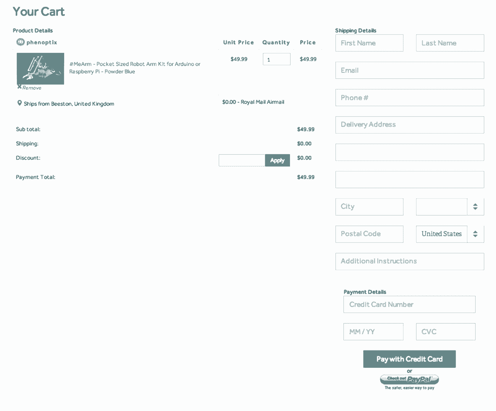

# 我从建立电子商务网站的艰难过程中学到了什么

> 原文：<https://review.firstround.com/What-I-Learned-the-Hard-Way-Building-an-E-Commerce-Site>

两年前， [Emile Petrone](http://www.crunchbase.com/person/emile-petrone "null") 向 reddit.com/r/arduino提出了一个谦逊的问题:“你会支持 Arduino 市场吗，还是我完全错了？”在观察了一段时间后，他发现有必要建立一个人们可以购买手工技术的中心。许多人同意了，彼得罗内开始建造。五个月后，[他辞去了工作，筹集了 50 万美元](http://www.reddit.com/r/IAmA/comments/1562wk/iama_founder_of_tindiecom_etsy_for_tech_that/ "null")的资金，将[Tindie.com](https://www.tindie.com/ "null")变成了*这类产品的电子商务平台。今天，该网站吸引了来自世界各地的客户，包括 SpaceX、谷歌和英特尔等在其他地方找不到他们想要的东西的公司。*

但是 Tindie 在早期有另一个重要的里程碑:Julia Grace 在 IBM 和 VigLink 等公司获得专业知识后加入了工程主管。现在，作为首席技术官，她领导着一个团队，在这个团队中，工程在最大化客户获取和销售方面发挥着巨大的作用。在这次独家采访中，她分享了她在将公司从一个小公司发展成为一个主要供应商的过程中所学到的经验，以及可以让电子商务初创公司获得巨大早期领先优势的策略。

# 通过浏览来了解你的受众

当 Tindie 最初开始销售独立硬件时，该网站允许客户简单地浏览列表。它没有搜索功能。“当你是一个小的创业公司时，你不需要急着实现搜索，”格雷斯说。“如果你的产品目录开始时很小，人们不知道明确搜索什么，那么你能做的最好的事情就是优化浏览。你能做的最糟糕的事情就是过早地构建搜索等功能。”

格雷斯说，在建立一个电子商务网站的初始阶段，你应该专注于建立一个分类法，对你不断扩大的产品进行分类。这将最终帮助你交付一个伟大的用户体验，你可以做到这一点，而不会陷入错综复杂的建设搜索。“如果你去[梅西百货的网站](http://www.macys.com/ "null")，你会看到服装或家庭用品作为大类，”格雷斯说。“然后，他们让您能够根据他们正在寻找的内容进行深入研究。这让他们更多地了解顾客的偏好，以及他们如何找到和发现产品。创业公司也可以做同样的事情。"

为了做到这一点，Tindie 专注于建立一个全面的分类，使其库存更容易找到，并了解其客户是如何找到他们想要的东西的。这需要多次迭代和重新分类产品。通过实验和观察这个过程，他们意识到引导流量的最好方法是基于人物角色。“我们尝试根据买家资料对网站进行细分，”Grace 说。“例如:‘我是一名电子爱好者’，或者‘我是一名专业的电气工程师’，或者‘我是一名超级 DJ，对我的设备了如指掌。’基于我们的客户群，这是有意义的。"

在采用这种解决方案之前，该公司曾尝试过分层分类，允许人们区分为初级、中级或高级——但效果并不理想。“我们很快意识到，人们不会以这种方式认同自己，”Grace 说。“人们在网站上的行为方式，我们知道我们做得不对。”原来中级和高级的界限模糊了。这是一个关键的学习:**你如何识别用户往往不是他们如何看待自己。**有一段时间，答案似乎是只提供一个高级类别和一个初级类别，但这使得找到后一类别的产品变得非常困难，因为有太多产品符合这一描述。

Tindie 还非常重视客户的反馈，密切关注人们如何选择参与或评论网站的导航。“当你给你的客户更多的选择来让他们与你互动时，你可以衡量他们对你的产品的投入程度——你可以对他们为成为你的社区的一部分所付出的努力程度进行分类，”她说。“例如，如果有人喜欢一种产品，那就是低努力。写评论显示中等努力。但是如果他们多走一步给你发一封短信或者推荐新的产品类别，你就知道他们是忠诚的。当有人来信抱怨我们当前的细分市场时，我会询问他们想看的类别。我们希望他们有参与感。”

让你的用户能够修改你的导航——但对你所听的内容设置了很高的准入门槛。

尽管高级浏览功能非常有效，但最终你会发现你的网站上有成千上万的产品，你需要在搜索中多下功夫，让你的客户找到他们想要的东西。

# 部署搜索应该以效率为重

说到整合搜索，你有两个选择。一个是快速和肮脏的——你可以添加“搜索即服务”，基本上使用第三方的 API 来处理搜索和索引你的产品。根据你的目标，这可以节省你的时间和金钱。“有几家公司会为你的网站提供搜索服务，”格雷斯说。“当您没有能力、员工或带宽来从头构建后端、分析和控制面板时，这是正确的选择。”

你的第二个选择是建立你自己的搜索工具。这是 Tindie 选择的路线，根据产品标题或描述中的关键字创建非常简单的基于文本的搜索。“早期，我们使用谷歌分析，并在每个搜索结果中添加 UTM 变量，这样我们就可以跟踪流量来自哪里，但这很快就变得复杂了——尤其是当人们与朋友分享链接时。我们不知道它们是否来自我们的搜索框，”Grace 说。

她说，最重要的是，你需要注意你的搜索系统会如何影响你的搜索引擎优化——尤其是当你试图建立品牌形象的时候。起初，Tindie 会根据客户选择的参数(如价格范围等)为搜索结果和产品生成唯一的 URL。).这导致了不准确的结果，损害了该公司的谷歌排名。“当你开始考虑搜索时，你必须考虑功能，但你也需要长期考虑 URL 结构，以及你是否在用所有这些对客户无用的额外页面‘污染’你的谷歌搜索结果。这些都会对你的 SEO 产生非常负面的影响，直接影响到你的品牌。”

做到这一点的最好方法需要付出很多努力，但这是值得的——你需要仔细跟踪你网站上的每个 URL。“当你改变一些事情时，确保你处理得当。如果你移动一个网址，马上发布 301 永久移动。使用正确的 HTTP 响应代码向 Google 的爬虫发出信号。你需要记住重定向流量，尽可能避免 404 页面。你不能不准确。”

知道人们搜索后点击了什么是关键，但你的首要任务应该始终是确保结果是相关的。

“他们看到的是 100 件还是 50 件类似的商品？他们是想找些别的东西吗？他们是在尝试搜索更广泛的内容，并获得大量的具体结果吗？”格蕾丝说。“这些是你需要理解的微妙问题，所以除非你有足够的内部资源来做这件事，否则你应该外包搜索。”

为了提高准确性，Grace 建议实施分面搜索——一种检索根据分类系统组织的信息的技术。这允许用户通过多种特性来探索结果的集合。“你经常会在航空旅行网站或零售网站上看到基于性别、年龄或价格区间的分面搜索。”

也就是说，谨慎行事。“虽然分面搜索可以为您提供关于什么对客户重要的良好初步见解，但很容易走极端并添加太多方面。我们尝试了这一点，我们添加了更多的方面(例如，硬件销售商来自哪个国家，等等。)，用的人就越少。他们很快就被淹没了。所以要慎重选择。”

一旦你做出选择，你能做的最重要的事情就是注意人们使用的过滤器。“如果你在经营一个像 Etsy 这样的电子商务网站，在那里你会看到很多类似的产品，很可能用户会对价格等东西更加歧视，”Grace 说。“另一方面，如果你有一个专门销售产品的网站，比如 Tindie，观众可能对价格不太敏感。专业化的客户群都是为了找到他们想要的东西，他们不关心为此需要付出什么。”

Julia Grace, ‎CTO at Tindie

# 仔细考虑你如何安排人员

当谈到优化转换时，你要确保你引导流量的方式能让人们留在你的网站上，即使他们没有找到他们真正想要的。这听起来很耗时——尤其是当你在亚马逊这样的网站上看到复杂的推荐引擎时。但是你不必马上全力以赴，格蕾丝说。

有一段时间，Tindie 没有足够大的数据集来知道他们应该向买家推荐哪些其他产品。如果人们找不到他们想要的产品，或者碰巧缺货，这就成了一个大问题。除非你聪明地指导他们，否则他们会离开，而且可能永远不会回来。

“根据您的网站，在这种情况下，您可能无法提供定制的推荐。在 Tindie，大多数产品都是独一无二的，所以我们经常遇到这种情况。”为了留住更多的购物者，他们想出了一个不太需要具体用户数据的解决方案:

如果你拿不出一个缺货产品的替代方案，建议补充一些东西。

Tindie 使用它在构建浏览功能时制作的人物角色来确定客户可能想要的其他产品。例如，某个制作 DJ 设备的人可能在寻找音频部件和其他相关设备。一个制造自己的机器人的爱好者可能对马达或传感器感兴趣。“我们会问自己:‘我们会向这类人推荐什么？’这最终变得非常强大。"

该公司还使用谷歌分析热图来密切跟踪人们在搜索后点击的位置。如果你注意到为什么顾客选择一种产品而不是另一种，你可以对他们是谁(一般来说)形成一个假设，你可以使用这些数据来设计一个更好的体验。“例如，我们将我们的核心用户划分为业余爱好者，并将他们与我们的企业买家分开，”Grace 说，并补充说，一种方法是通过 cookies 来跟踪用户购买的内容，然后相应地向他们显示不同版本的主页。“你希望你的用户强烈认同你主页上的产品，因此根据需求和兴趣进行细分非常重要。”

**当考虑如何引导网站流量时，Grace 建议如下:**

**1)在用户购买之前，不要强迫他们创建账户。**对于大多数电子商务公司来说，让客户在下单前通过注册流程是没有意义的。“像亚马逊和 Etsy 这样的大型电子商务网站有能力做到这一点。“它们已经达到临界质量，可以让人们创建账户，”格雷斯说。“但作为这个领域中一家规模较小的初创公司，我认为你永远不应该这么做。**当我们取消强制登录选项**时，我们的转化率跃升了 50%以上

**2)避免使用提取客户信息的花招。她说:“当你试图吸引精明的观众时，你首先需要确保他们信任你。”。“在我们的情况下，如果我们在您创建帐户后推出 50%的折扣，我们的流失率将会非常高。他们不会是长期有价值的用户，而这正是你想要在早期培养的受众。”**

除非你的网站是关于交易或讨价还价的，否则要小心优惠券和折扣。如果你的与众不同之处在于你提供稀有的产品，那么不仅买家会减少价格歧视，而且你的品牌价值应该围绕这种独特性(而不是折扣)展开。虽然 Tindie 的一些卖家提供优惠券，但它们对转化没有显著贡献，优惠券也不是人们继续回到 Tindie 的原因。

**3)让你的结账体验变得不那么愚蠢**。当你让人们在没有开户的情况下购买时，你没有办法捕捉他们的信息或偏好。此外，买家不能回头看他们过去的购买。但是有办法绕过这些障碍。“Tindie 建立了一个系统，我们给买家一个长的、散列的、唯一的 URL，他们可以用它来检查订单的状态，即使他们没有注册任何东西，”Grace 说。“如果他们最终决定使用相同的电子邮件地址创建一个帐户，我们会无缝地将一切联系在一起，以便他们可以登录并查看他们的购买历史。在吸引和留住认证用户方面，这对我们非常有效。”

**4)尽量减少公司的“关于”部分。**登陆电子商务网站的人希望购买，而不是阅读你的信息。“初创公司倾向于以一种不把最终消费者放在心上的方式谈论自己，”Grace 说。“因此，我们选择更加关注功能，即购买和销售体验。我们知道，客户不在乎我们从谁那里筹集了资金，也不在乎我们的工程团队中有谁。”

对此的一个警告是招聘。当你处于成长阶段并积极招聘时，介绍你的团队、背景和文化的页面是很重要的，但它不应该是人们访问网站时看到的第一件事，也不应该在你的导航中占据显著位置。

顾客想要一种鲜明的体验。他们想找到自己想要的东西，买了就走。尊重这一点。

找出是什么让你的买家心动您的一些客户可能对价格敏感，而其他客户则更关心质量。这当然取决于你卖的是什么，但不管怎样，你需要能够根据这些属性对人们进行分组。“就我们而言，我们提供一套独特的硬件产品，所以价格对我们的客户来说并不重要，”她说。“但各种各样的事情对他们来说可能都很重要。例如，如果产品的照片似乎能促进销售，那么你就应该更加关注提供更好、更吸引人的照片。”

**6)了解你的受众对隐私的容忍度。**虽然有些顾客可能会喜欢根据他们的购买历史定制的推荐，但这可能会让其他人感到被监视和不舒服。为了消除这种担忧，格雷斯建议网站“非常坦率地透露，你正在匿名跟踪他们为改善网站和你的服务所做的事情，而不是侵犯他们的隐私。”这比许多电子商务公司认为的更令人担忧。每当他们决定收集一种新类型的数据时，这是他们应该牢记在心的。

“了解你的买家的核心使命。然后将这一点传达给他们，让他们开始认同你的品牌和他们的需求。

# 发明最好的购物车

虽然购物车在很大程度上已经过时，但这并不意味着你不应该创新。“大多数人最终会模仿亚马逊和其他大型电子商务网站，因为他们认为人们已经习惯了这种结构，”格雷斯说。“但你需要意识到，这些公司有一个竞争优势:它们可以迫使人们向任何方向前进，因为它们足够大——它们不一定会考虑客户的最佳利益。作为一家初创公司，你没有奢侈的经历，所以做大公司做的事情并不总是最好的。”

为了跟随大型在线零售商的脚步，Tindie 过早地优化了它的购物车。“有一次，我们甚至禁用了在结账流程中点击离开的选项，这让人们非常不高兴，”Grace 说。“当我们回滚这些更改时，我们不再收到愤怒的电子邮件。”

结账流程中的步骤数量也对转化率有很大影响。Tindie 开始时有一个 5 步购物车流程，但落差太大，他们最终将其压缩为两步。这对已完成的采购数量产生了相当大的影响。

What Tindie's simplified shopping cart looks like today.

不要错过接受付款

格雷斯认为，如果你的客户生活在世界各地，集成 PayPal 不仅是一个好主意，而且势在必行。在其他国家，数百万人没有信用卡。Tindie 是一家全球零售商，其客户群中有很大一部分使用 PayPal，因为他们担心身份盗窃——甚至在美国也是如此。

明智的做法是整合三种支付方式，并根据网站的关键人口统计数据进行选择。“也许包括亚马逊支付、 [Stripe](https://stripe.com/ "null") ，甚至通过像[比特币基地](https://www.coinbase.com/ "null")这样的服务提供比特币，如果这对购买者有意义的话，”她说。“关键是要确保你不会过早地优化，增加少数人要求的支付方式，或者在硅谷似乎很受欢迎但在外面没有渗透的方式。”

举个具体的例子，Tindie 尝试提供直接银行账户支付，没有人使用这个功能。结果证明这是对时间和精力的极大浪费。“我们应该在实施之前询问我们的客户，尤其是我们认为最感兴趣的人群。”

你选择的支付系统可以决定你电子商务创业的成败。“如果你正在建立一项国际业务，买家订购了价值数十万美元的产品，而且这些产品必须在全球范围内运输，那么你需要敏锐地意识到欺诈。她说:“在某个时候，你很有可能成为它的受害者。“这就是为什么与 PayPal 或 Stripe 等成熟的支付处理器整合可能是一个好的举措。他们非常擅长欺诈检测。这是他们产品的核心部分。”

Tindie 一度在亚洲蓬勃发展，向新加坡、台湾和越南运送了数吨产品。“我们看到很多不寻常的交易，人们使用美国信用卡，但订单是在国际上运送的，”Grace 说。“由于该地区的欺诈行为，我们承受了大量损失，我们必须采取措施。”该公司最终与 Stripe 密切合作，以阻止此类交易。“与这样的公司合作，在幕后打击欺诈，可以阻止网站上 90%的不良购买。”值得注意的是，尽管整合 it 存在不小的工程挑战，但 Tindie 从未见过任何通过 PayPal 进行的欺诈。

当涉及到你的购物车和支付选项时，**最大的挑战是抵制过度优化和保持事情简单**。[在你的网站上，这两个过程都伴随着巨大的复杂性成本，](http://firstround.com/article/the-one-cost-engineers-and-product-managers-dont-consider "null")如果你试图用一些有创造性但不必要的东西赶上或超过它们，你就会偏离轨道。而且，作为一个早期的电子商务游戏，你不能浪费时间和资源。

例如，礼品卡尤其适合复杂和不成熟的花哨工程(这些东西用在别处会更好)。

“提供某种礼品卡功能可以激励人们在假期购买更多，但在你追求它之前，你需要考虑后端的一切，”Grace 说。买的卡什么时候到期？当他们这么做的时候，那些钱会怎么样？有没有一些商品是不应该用购物卡买的？如果有人试图同时打开两个标签页，并使用礼品卡或促销代码两次，该怎么办？“你基本上是在创造自己的货币形式。听起来很重，对吧？确实是。你需要考虑所有的用例以及与之相关的场景。”

看到他们年收入的很大一部分来自万圣节和新年之间，Tindie 很早就开始使用礼品卡系统。但是，回过头来看，Grace 说她希望他们可以等待，这样他们就可以更多地观察他们的用户，更积极地设计一些涵盖所有边缘情况的东西，而不是在事情不顺利时发出大量的投诉。

“无论何时你对人们如何购物做出改变，整合都需要时间——工程时间、测试时间、用户调整时间，”她说。“如果你是一家小型初创公司，你需要对你添加的每一个额外功能或层三思而行，因为这将导致人们的行为和支出不同。”