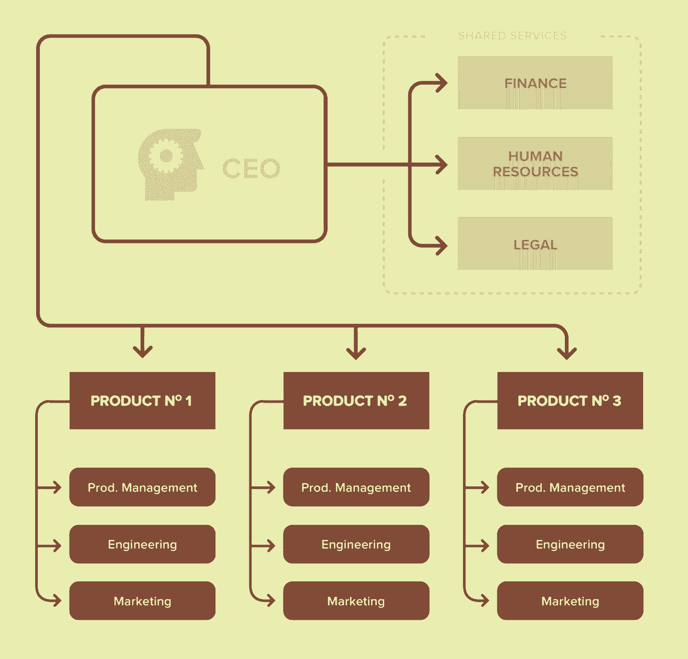
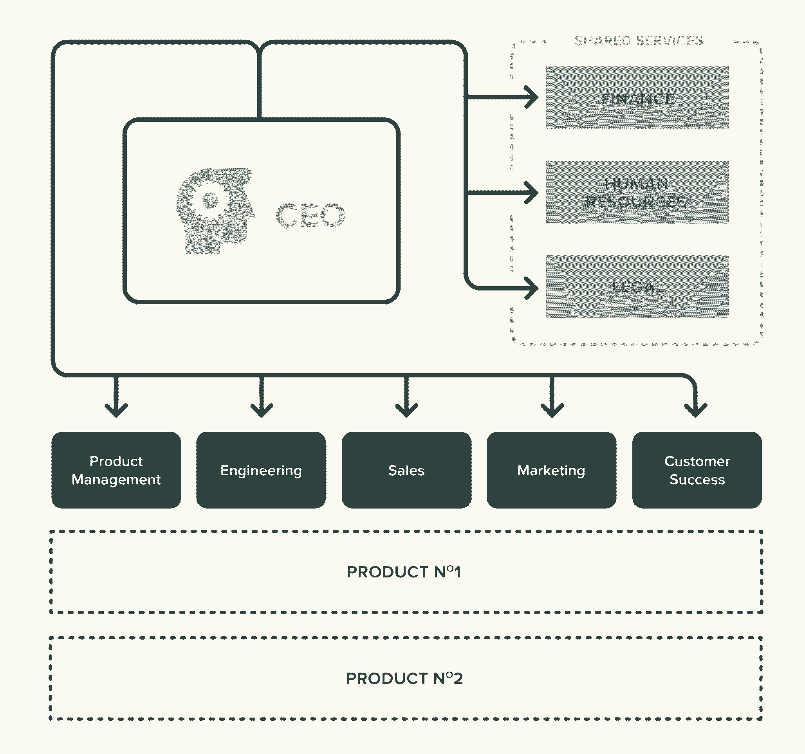
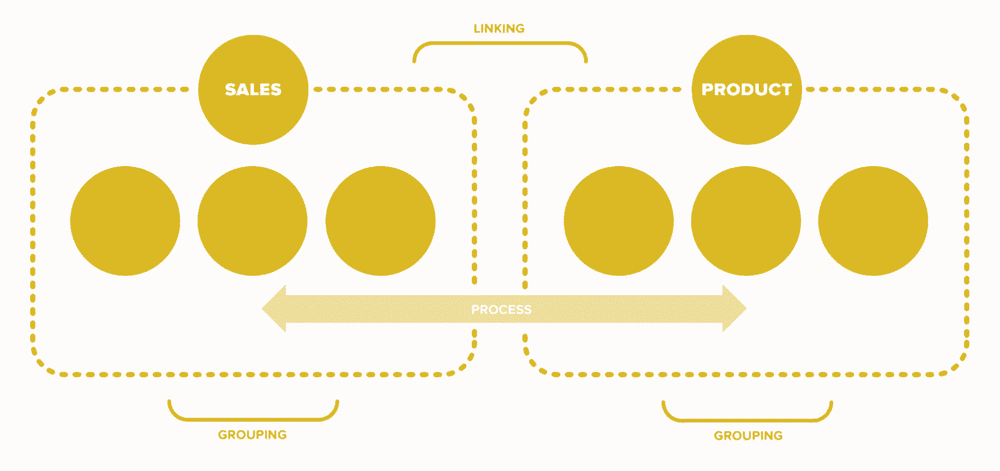
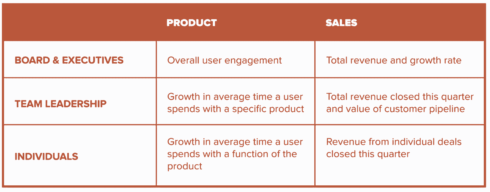

# 如何让你的初创公司在几个月内成长 500% |

> 原文：<https://review.firstround.com/What-It-Takes-to-Grow-Your-Startup-500-in-Less-Than-a-Year>

*本文作者* *[保罗阿诺德](https://www.linkedin.com/in/paularnold "null")* *，天使投资人兼顾问，曾帮助多家创业公司实现超高速增长。*

现在是凌晨 3 点，我的手机震动了。“这可不好，”我想，翻过身来读了一条我从来不想看到的短信:AppDirect 平台宕机了。没有人能够使用我们合作伙伴的应用程序。如果我们现在不解决这个问题，明天早上还会有成千上万的人被关在外面。

疯狂的，我开始打电话给工程领导。“总得有人知道发生了什么，”我想。“但是谁呢？”最后，我召集了一个特别的团队来恢复网站，但是在此之前，我浪费了宝贵的时间，吵醒了十几个同事，并使团队的血压飙升。

一年后，我们制定了应对这些挑战的方案。但这不是一朝一夕的事。我们必须脚踏实地地学习，因为我们在那段时间增长了 500%以上。最终，出现了几个非常实际的教训。我的目标是为你节省时间和麻烦。

当你的人数超过 10 或 20 人时，有一个事实你可能不愿意接受:你需要组织结构。不断有新面孔出现，想知道他们在哪里。人们需要被授权去领导。在 AppDirect，我们不得不多次重新发明我们的方法才奏效。

我们开始用一个简单的功能结构来建立我们的团队:产品经理作为一个产品团队工作，客户经理作为一个客户团队工作，等等，用于工程、销售、市场、客户支持、QA 和合作伙伴关系。

但是我们很快就碰了壁——新的功能在团队之间的合作方式上造成了差距。如果你不能从营销、工程或公司其他任何你可能需要的地方获得专业知识，就很难达成交易。我们最终转向围绕大客户的更加多样化的团队结构。但是为了让这成为可能，我们必须在地上树立标杆。

**如何建立组织结构图**

说我们对推出我们的第一个组织结构图感到紧张是一种保守的说法。在早期创业公司工作的人不容易局限于盒子和线条。他们中的大多数都是多面手，在这里，我们试图将他们分成更专业的角色，随着我们带来更多的人，缩小了一些早期员工的范围。我们还在以前没有经理的地方任命了经理。我们并不指望轻松入伙。

在两年的时间里，Paul Arnold 帮助云服务市场 AppDirectfrom 从 20 名员工发展到 120 名员工，同时领导最终用户获取、营销和业务运营。他还为许多超高速增长的初创企业提供过建议。在@paul_arnold 找到他。

我们的发现让一些人感到惊讶:团队实际上接受了更多的组织结构。明确的角色解放了人们，使他们能够更好地工作，明确项目的所有权并推动结果。随着我们的成长，我们推出了第二版和第三版的组织结构图，每次我们都收到了积极的回应。回过头来看，这一过程如此顺利有几个原因:

**大多数人其实喜欢结构**。在某种程度上，这是人之常情，但即使是企业家员工也喜欢导轨来指引他们的注意力。稍后将详细介绍。

**我们团结了我们的利益相关者。**我们提前与重要且有影响力的团队成员讨论了这些变化，因此他们理解了我们的理念并成为了内部倡导者。

**我们交流了改进意见。**每次我们改变团队结构时，我们都会明确他们是如何从现状中改进的。我们不断强化变革，直到它们成为我们文化的一部分。

在初创公司，框框式的组织可能会有违初衷。企业家精神通常被定义为其灵活性——一种“每个人都投入”的能量，使最初的动力成为可能。但是当你增加更多的人时，这种情况就不复存在了。

通过尽早引入结构——甚至比你想的还要早——你为优秀的团队搭建了脚手架:由有才华的人组成的小组一起解决共同的问题。组织设计成为你成功的核心。如果你做得对，团队能够完成的不仅仅是他们各个部分的总和。

如果创建有效的团队是问题的一半，那么学会授权就是另一半。

组织可以把创始人惹毛，但只有那些能冒充权威的人才能生存下来。

它始于信任你的员工，也始于招聘。你应该只雇佣你信任的人，让他们在没有你的情况下做决定。那是酒吧。尤其是对领导来说。

当你准备好创建组织结构时，理想情况下，当你有 20 多岁的员工时，你可以采取一些战术步骤来实现一个强大的组织结构:

决定你是什么样的公司。从实际写下你需要为你的公司赢得什么开始。什么是真正重要的？需要钉钉产品设计吗？需要分配更多资源给销售吗？你需要国际化来保持竞争力吗？

大多数公司需要在几个领域取得成功。例如，企业软件初创公司不仅必须提供世界级的销售额，还必须提供满足客户期望的定制产品集成。但是有些能力比其他能力更重要。你不可能什么都擅长，所以要知道你绝对要擅长什么。

创建有意义的小组。牢记以上几点，开始组建团队。团队中的某些角色应该被授权，以符合你想要成为的公司类型。例如，如果你是一家产品至上的公司，项目经理应该扮演领导角色，团结团队。如果营销推动了你的大部分业务，营销人员应该被安排在关键的决策岗位上。

记住在做选择时要考虑到未来的员工。他们将融入哪里？为了让大家明白这一点，实际上要画出一个组织结构图——甚至是几个变体——填写现有员工并留下空白，以告知你的招聘计划。当然，在首次展示后，你需要重新审视和完善你的组织结构图，但这将让你保持超前思维。

**产品组织示例**

**职能组织示例**

当你绘制这些图表时，角色将不可避免地变得更加专业化。例如，当我们在 AppDirect 增加客户经理时，我们创建了两个组:擅长建立关系的人和擅长产品实现的人。同样，随着我们销售团队的壮大，我们决定引进销售工程师，让其他工程师可以专注于改进产品。

**3)** 获取关键人物的意见。对于任何要扎根的组织结构图，你需要它被你公司最重要的人所接受。你知道他们是谁——至少他们包括你的联合创始人、活跃的董事会成员、值得信赖的外部顾问和高管(如果你有的话)。根据你公司的规模，这可能包括人力资源主管。将这些对话集中在完善你已经草拟好的内容上，而不是每次都从头开始。

清晰地(大声地)传达你的计划。这可能是最重要也是最微妙的一步。组织变革需要员工的认同才能取得成功。对于许多员工，尤其是那些受影响最大的员工，组织变革非常敏感。他们不仅影响每个人的日常活动，还经常影响他们对自己作为团队重要成员的看法。

人们可能第一次向创始人之外的人汇报工作——这可能感觉像是降职，或者他们的贡献无关紧要。其他人可能会发现他们的责任大大缩小了。特别是对于这些人，你需要在更广泛的声明之前投入一对一的时间来解释你的推理并进行公开对话。否则你会以不必要的摩擦告终。

出人意料地让人产生摩擦和敌意。

**处理中的层**

在我进入 AppDirect 不久后，我发现我们的一位高管对来自我们最重要的合作伙伴之一的一封电子邮件感到恐慌。“这不是合作的方式，”邮件开头写道。合伙人生气了。有充分的理由。我们刚刚在没有通知合作伙伴的情况下推出了一个重大的界面更改，破坏了他们正在进行的一个重大推广活动。显而易见的是:我们还没有(在那时)建立一个好的流程来与合作伙伴交流重大的变化。

快速增长需要认真关注过程。一旦您开始添加新的人员、角色、部门，您就添加了更多的移交、更多的故障以及关于谁做什么、何时、何地以及如何做的更多模糊性。困难的部分是引入没有沉重官僚作风的过程，官僚作风会减缓创业的速度。

在 AppDirect，我们最复杂的流程是我们设计、确定范围和交付新产品的方式。在早期，从最初的讨论到完成，带来一个大的新客户通常需要几周甚至几个月的时间。并且需要跨职能部门的几十个人(加上律师)来推动一个产品。人们经常不知道他们应该参与什么，导致瓶颈和故障，浪费时间，不一致的标准，和许多挫折。

我们知道一定有更好的方法。但是我们也知道我们的产品整合总是需要很多人。那是没有出路的。这就是我们所做的:

我们将所有权和责任整合到尽可能少的人手里。

**2)** 我们确定了哪些常规、需求和行为是经常发生的，并将其标准化。这允许我们将大的努力分成更容易理解的步骤，并分配它们。

**3)** 我们将客户经理和技术项目经理定位为交易的两个端到端所有者。他们开始负责监督其他所有相关人员，实质上将几十个移交减少到一个。这极大地减少了沟通失误和失误。一般来说，你希望拥有者越少越好。

我们小心翼翼地记录了完成工作所需的每一步。然后，我们返回并删除了无数的步骤，直到我们到达最简单的流程。

目标始终是在问题出现之前预测和实施流程。随着您的成长，几个最高优先级的流程包括:

产品冲刺、代码审查和质量保证

A/B 测试、产品变更请求、产品路线图规划

财务规划、预算、费用审批

招聘、绩效考核、奖金、股权奖励、晋升

客户支持流程和升级

销售合同和定价

大多数流程只不过是列出某人完成工作需要采取的步骤。很少有人花时间写下谁，什么和什么时候。

有许多方法可以让人看中工艺。不要。

首先专注于创建可重复步骤的列表，以完成常见的工作流，并尽可能使它们简短。在 AppDirect，我们的季度产品路线图流程基本上由三个步骤和一系列截止日期组成。即使是我们最复杂的流程——为新产品集成确定范围和谈判合同——最终也只有 20 个步骤。它开始时要长得多，但经过几十次调整后，我们把它简化了。

最重要的是，依靠最接近工作的员工来帮助你制作这些清单。他们最能洞察日常的挑战和如何把事情做得更好。倾听他们也会创造一个反馈回路，让你不断调整和改进。良好沟通的一个标志是，当东西坏了的时候，员工会过来告诉你。

**使用对你有利的指标**

在 AppDirect，我与我们的客户支持团队密切合作，构建了一个定制的月度指标仪表板。我们认为来自客户支持软件的现成报告并没有真正反映我们需要知道的内容。构建自定义指标是值得的:我记得洞察力是如何跳出第一个仪表板的页面的——有一大堆技术问题被发送给工程师，而这些问题本可以由我们的支持和 QA 团队更早地处理。有了这些数据，我们能够在第二天彻底检查机票的发送方式，从而节省了数小时的工程时间。

你的规模越大，领导者就越有必要拥有能让他们快速了解每个人在做什么以及需要在哪里做出决策的工具。要构建这些工具，您必须 1)确定对执行您的业务最关键的指标(不要太多)，2)建立系统来有效地收集和跟踪这些数据。

设计更好指标的几个关键考虑因素:

确保它们相对容易收集。

只使用与你的目标和价值观直接相关的指标。

最重要的是，保持你的指标可操作。

数字的价值取决于它们推动决策和变革的能力。

为了最大限度地利用你的指标，从上到下级联它们。从公司的首要目标开始(例如，用户参与度或收入)。然后，确保您的职能和团队拥有直接推动这些目标的指标。之后再看组成这些团队的个体。他们每个人都应该有自己的衡量标准，并与他们的团队和组织保持一致。用这种方法，你可以确保每个人都有动力，都向着正北。

**级联指标示例**

**实验和驱动改变**

在所有这些领域中，有一条通向成功的共同线索:永远做实验。创建新的角色、流程、仪表板和沟通渠道。要有创意。但是记得回去无情的修剪。重新思考如何更好、更快、更简单地工作。

无论你第一次或第五次多么努力想把事情做对，你都不会。相反，专注于产生新的想法，杀死坏的想法，重新开始。增长需要不断创新。如果你能把每个人都带上，你就会成功。在两年的时间里，Paul Arnold 帮助云服务市场从 20 名员工发展到 120 名员工，同时领导最终用户获取、营销和业务运营。他还为许多超高速增长的初创企业提供过建议。在*[@ Paul _ Arnold](https://twitter.com/paul_arnold "null")**找到他。*