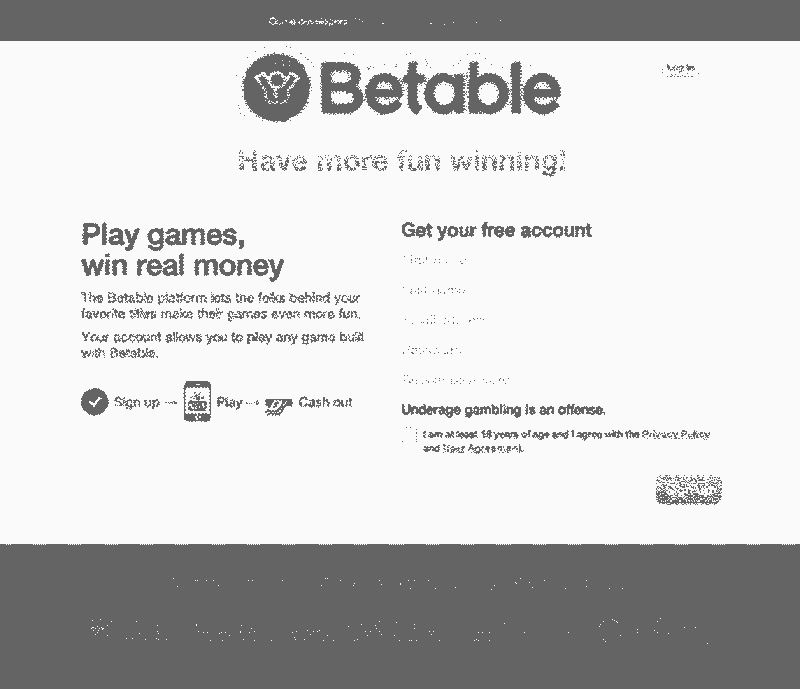

# 当你是他们唯一的设计师时该怎么做

> 原文：<https://review.firstround.com/What-to-Do-When-Youre-the-Only-Designer-Theyve-Got>

设计师 Jeffrey Kalmikoff(T1)加入了 T2 测试台(T3)，因为这让他害怕。“我知道有很多东西我不明白，我必须学习，”他说。“但我所有的其他提议都是针对简单的消费者网络。我选择 Betable 是因为我没有理由承担这么大的工作，但我想尝试一下。”

很难想象卡尔米科夫会被什么吓倒。在 Betable 之前，他既是位置初创公司 SimpleGeo 的技术副总裁，也是唯一的设计师，在 [Digg](http://digg.com/ "null") 单枪匹马地经营设计和 UX，在 [Threadless](https://www.threadless.com/ "null") 担任首席创意官七年。这个人已经成为自主创新方面的专家——他在 Betable 担任首席体验官的新职位上运用了所有的经验教训。在 First Round 的最后一次设计+创业中，他分享了作为一家创业公司的唯一设计师，他学到了什么。

# #1:不要成为房间里最聪明的人。

“这是我能给出的最重要的建议，”卡尔米科夫说。"不要自欺欺人地认为所有最好的主意都是你的。"不管你有多优秀，如果你在真空中设计，你会 a)立刻筋疲力尽，b)最终得到一个非常糟糕的产品。“你不可能在这么多学科中提出好的想法。不可能的。”走出你的小天地，接触你周围的人。

设计师面临的最大挑战之一是上下文切换——这也是你损失最多时间的地方。卡尔米科夫说:“我们都愿意认为自己是多重任务者，但事实是，结束一个项目，转到其他项目，放松下来，然后跳回其他项目，都需要时间。”“你回头看看你的一周，看看你浪费了多少时间试图变得有效率。挺难过的。”通过分配集思广益的力量，你可以让你的想法引擎一直运转，减少损失。

卡尔米科夫很幸运，很早就开始练习了。“在 Threadless，这只是因为我们是一群朋友，分享一切是有意义的。但是不管你在哪里，不要给谁能给你提供想法设置界限，这真的很重要——这不应该是让你的名字出现在产品上或获得荣耀。如果你能够激励与你一起工作、接触产品的人提出想法，你的工作就会容易得多。”

永远不要停止将你的同事视为用户，并听取他们的意见，找出可以做得更好的地方。他们和你一样关心。

让不一定有设计经验的团队成员参与进来尤其重要。“你只需要知道如何处理他们的反馈，”他说。“给我找一个对设计没有主见的工程师。这真的只是你如何对待它，然后你可以用它做什么。”

对 Kalmikoff 个人而言，将他的同事视为产品的第一批用户非常重要。“永远不要停止将你的同事视为用户，并听取他们的意见，找出可以做得更好的地方。他们比任何人都更是你的超级用户。他们和你一样关心。他们和你一样想赢——他们可能离你不到五英尺，这比设置用户测试要容易得多。”

# #2:从一开始就设定正确的基调。

“如果你在一家专注于设计的公司工作，这就是你的球。卡尔米科夫说:“你应该坚持下去。如果你想创造一个合作的环境，那么你有责任去实现它。“你要以身作则。如果你开始询问人们的意见，他们也会开始询问你的意见。如果你能尽早促成一个协作的环境，会有很多好处——它会影响早期员工的习惯，甚至公司的整个文化。”

卡尔米科夫说，尽早设定这些标准至关重要。持球的力量有好有坏。他见过早上 11 点就来上班、在办公室开派对的创始人，等等。这就是该公司的现状，即使它可能已经老得不适合那个场景了。它的发生是因为它一直都是这样的。“在任何职能领域，无论是工程还是设计，如果你希望公司以最适合你的方式运营，并希望你能完成任务，现在就付诸实践。让三个人做一件事比 300 个人做要容易得多。”

当你是一个为公司定调的设计师时，你的目标应该是建立强大的、可持续的反馈渠道。这呼应了对想法多样性的需求，但围绕它设置了一个系统，因此它将长期持续下去。“你也不能只是建立它，”卡尔米科夫说。“你必须坚持到底。如果你说你要做某件事，却从不跟进，那你永远也不会创造出这样的文化。”

同样的道理也适用于为自己设定优先事项。基本上，你需要创建一个系统，在任何时候都能最大化你对公司的价值。“为开发人员设计一个用户界面，这样他们就可以非常简单地构建非常复杂的赌博游戏——这将让你的大脑彻底颠覆。你可能会在这上面花费大量时间，然后不得不立即转向为移动设备设计新的用户体验。”他的其他规则是每天花时间与 Betable 的产品负责人在一起，看看他的日程表上有什么。他还打算尽早查看收件箱，这样他就可以建立一个议程，限制上下文切换，专注于他可以取得最大进展的领域。

# #3:让好足够好。

卡尔米科夫说:“记住，‘现在好’会为以后的‘伟大’赢得机会。”“如果你是一名设计师，并且对‘足够好’这个词感到舒服，请举手。”“不用说，Design+Startup 没有人自愿，卡尔米科夫对此并不感到意外。“我知道，这完全违背了设计师的自我意识。我们是设计师的事实表明，我们看着这个世界，憎恨我们所看到的，我们足够自私地认为我们可以把它变得更好。这是我们的一部分。”

做得比完美还要好。不存在没有产品比产品更好的时候。

但卡尔米科夫认为，在太多的时候，这种态度会碍事。尤其是为了单干，设计师需要承担他所说的“设计债务”。这是工程师和产品团队再熟悉不过的事情了——可以让现有功能变得更好的一系列调整和待办事项。重要的是要有这些特性。“完成比完美更好，”卡尔米科夫说。"不存在没有产品比产品更好的时候."更多的设计师需要将此作为他们的座右铭，以跟上创业的速度。

Betable homepage at the time this article was published.

“你不需要每次都拿出有史以来最好的作品。你只需要暂时满足需求，这样你就有机会以后再去做。否则，你可能根本没有产品，”他说。“我并不是说失去你的自我——如果你失去了自我，你就会失去让你想要做得更好的优势——我是说学会如何检查它。如果你不像工程师承担技术债务那样承担设计债务，你就无法以同样的速度取得进展。”你能做的最糟糕的事情就是成为设计者，支撑起关键的功能。

在这里，卡尔米科夫提供了一个非常个人化的例子:“以 Betable 的主页为例。我设计的。我讨厌它。”如果你不相信他，他继续说，“上面可能会给你一个线索，我在 15 年前开始了我的职业生涯，设计锐舞传单。这很可怕，但它完成了自己的工作。”

问题是，就目前而言，Betable 并不是漂亮的面向用户的设计。这是为了让开发者可以使用工具，并向目光锐利的监管者保证，该公司确实获得了完全和适当的许可，可以做它所做的事情:即经纪投注和赌博服务。

“在网站的顶部，它基本上说‘嘿，如果你是开发者，请点击这里’，因为我们现在只处理开发者收购，我们还没有把我们的注意力集中在玩家身上。”因此，主页只为开发者转化而设置，指导潜在玩家注册以最终了解更多——并清楚地显示许可和负责任的赌博要求。“克里斯，创始人，花费了所有的时间、金钱、精力、汗水和眼泪才拿到我们的许可证，”卡尔米科夫说。“我至少可以在页面底部找到[许可证]号码。”

简而言之，“让你短期内不满意的设计产生出来是可以的，”他总结道，只要你对它所融入的想法充满热情。“作为一家初创公司的唯一设计师，你怎么能真正做到这一切呢？首先，学会忽略你的自我。同时知道会更好。”和贝塔布尔一样，“我向你保证。这会好得多，”他说。

考虑到独狼设计师需要做的大量工作，对未来潜力的感觉不仅是激励，而且是必不可少的。“我知道当我 60 岁的时候，Threadless 有希望还在，我会看到有人穿着那件[呕吐小丑 t 恤](http://www.threadless.com/submission/44125/The_Morning_After "null")，我可以把它指给我的孙辈们看，说，‘嘿，那是我设计的印刷品，’”他说。“这是一份了不起的遗产，也是我选择项目时一直在寻找的东西。”