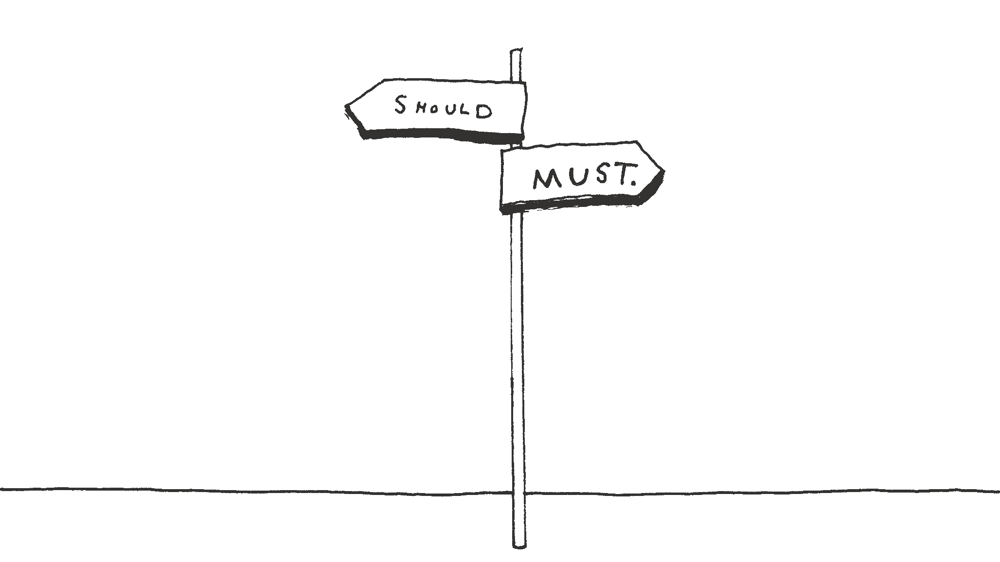
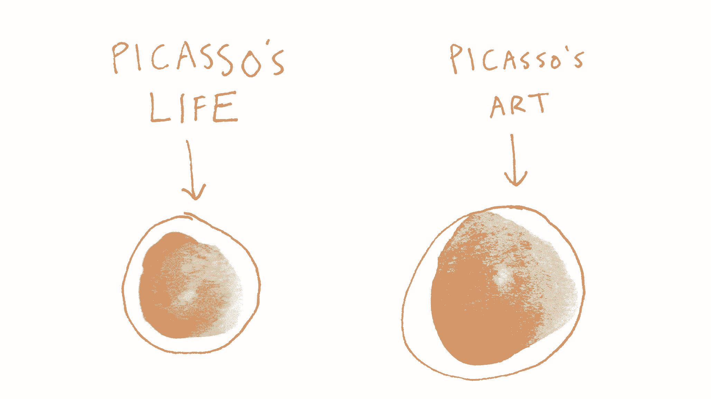
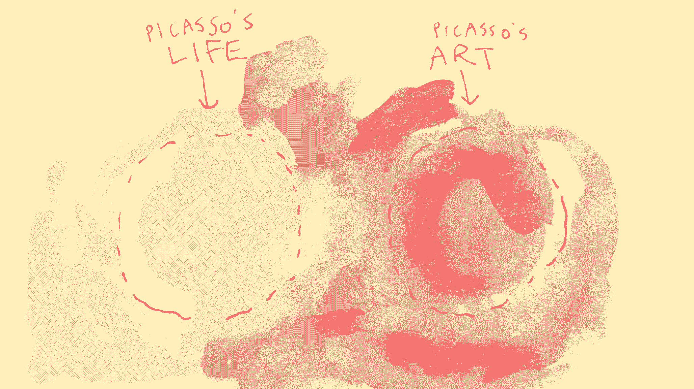
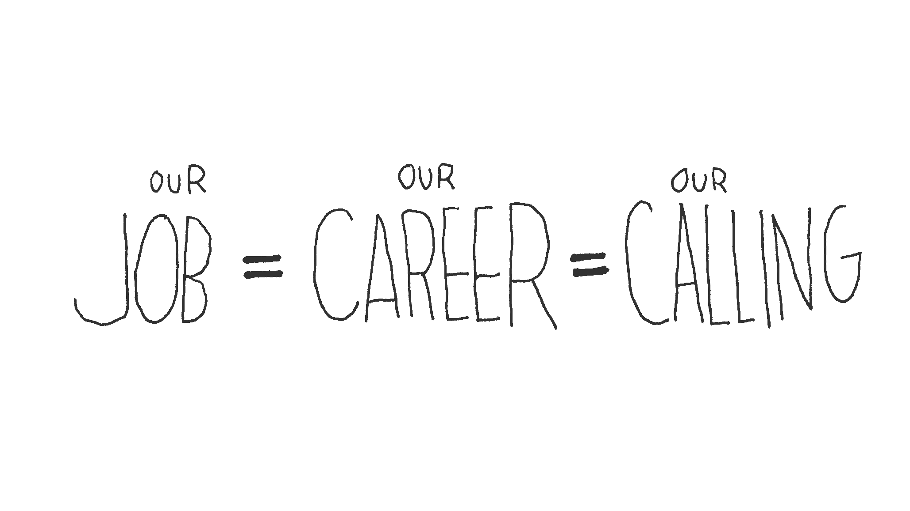
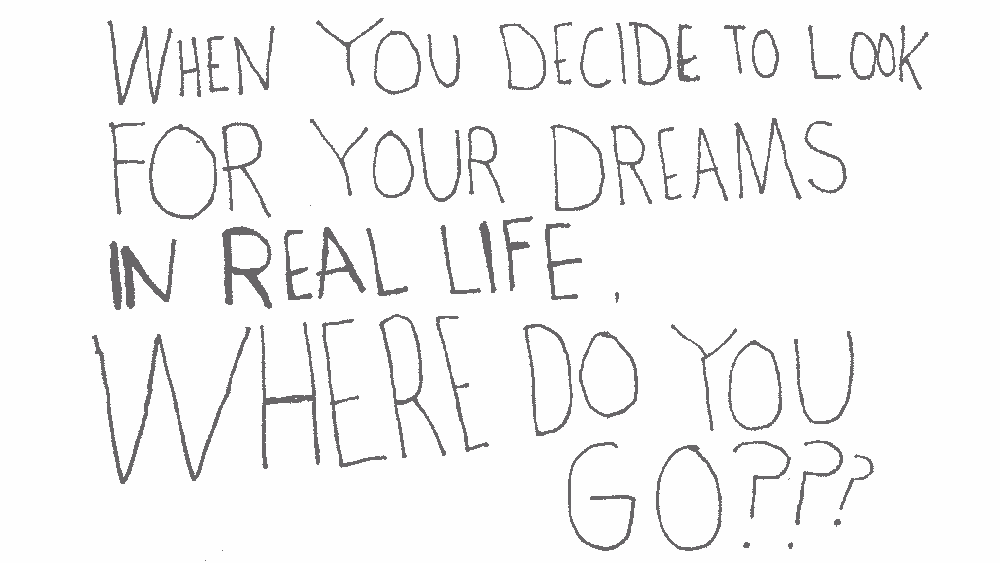
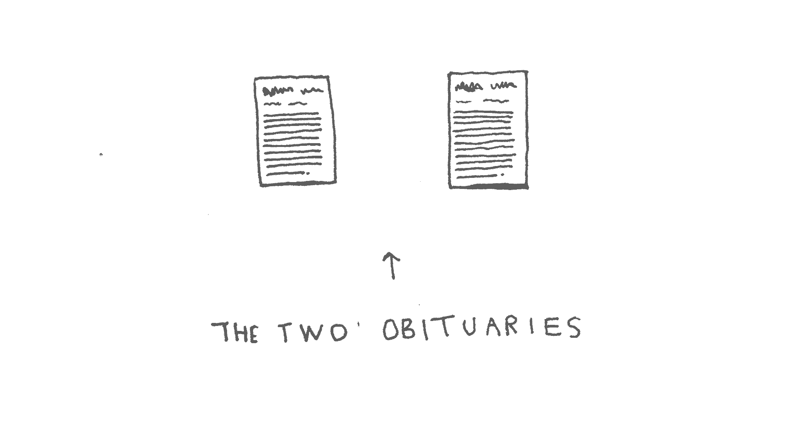
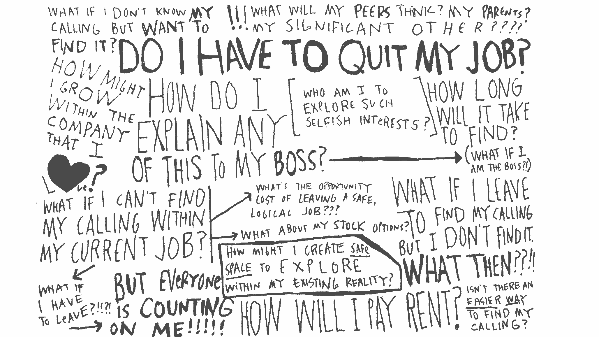
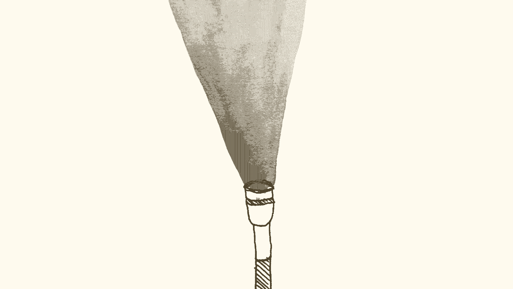
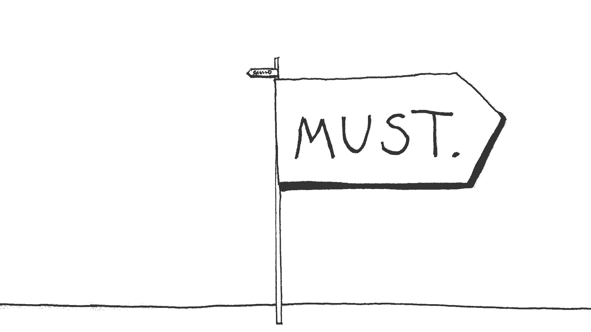

# 当你处于应该和必须的十字路口时

> 原文：<https://review.firstround.com/What-to-Do-at-the-Crossroads-of-Should-and-Must>

*[艾丽·卢娜](https://twitter.com/elleluna "null")* *是一位生活和工作在三藩市的艺术家和设计师。她与团队合作设计并打造了* *[邮箱](http://www.mailboxapp.com/ "null")* *，重新设计了* *[优步](https://www.uber.com/ "null")* *的 iPhone app，并规模化了评书平台* *[中](https://medium.com/ "null")* *。在创业之前，Elle 在 IDEO 公司工作了五年，从事各种行业，积累了多渠道、全方位的经验，产生了巨大的影响。当她不在* *[画](http://elleluna.com/ "null")* *的时候，你可以找到她去巴厘岛旅行，为她新的纺织事业、* *[布兰计划](http://shop.bulanproject.com/ "null")* *，并激励人们追随他们的激情。露娜证明了找到你的使命是一件值得追求的事情，她就是这样做的。*

这是一个关于两条道路的故事——应该和必须。对于那些选择了太长时间——几个月，几年，也许一辈子——的人来说，这是一句鼓舞士气的话，他们觉得是时候给自己一次机会了。

人生有两条路:**应该和必须**。我们一次又一次来到这个十字路口。每一次，我们都可以选择。

应该是别人希望我们如何在这个世界上出现——我们应该怎么想，我们应该怎么说，我们应该怎么做。当我们选择应该一帆风顺时，风险就小了。

**必须与众不同。**

“必须”是我们是谁，我们相信什么，当我们与最真实的自我独处时，我们做什么。它是我们的本能，我们的渴望和憧憬，我们渴望的事物、地方和想法，从我们内心深处的某个地方膨胀起来的直觉。当我们不再遵从他人的理想，而开始与自己的理想相联系时，必然会发生这种情况。因为当我们选择“必须”时，我们不再从外面寻找灵感。相反，我们在倾听来自内心的呼唤，来自某个明亮、神秘的地方。

这就是为什么梵高一生都在绘画，却从未得到公众的认可。这就是为什么莫扎特演奏了《唐·吉奥瓦尼》,而柯川演奏了他的新音乐，尽管批评家们认为它很难听。这就是为什么那个三十多岁的律师花了三年时间写了他的第一部小说，却被三十几家出版商拒绝。他尊重自己的召唤，最终得到了“是”，这就是为什么约翰·格里森姆今天是一个家喻户晓的名字。然而，Must 不仅仅是作家、画家和作曲家的专利。这就是为什么在早期，Airbnb 出售成箱的麦片来维持生计，因为没有人会给他们钱，所有能想到的指标都表明他们应该退出。

在 Mailbox 工作时，我偶然看到了 Stefan Sagmeister 关于工作、职业和职业的 TED 演讲。

他谈到了他们的差异，我开始想知道我有哪一个。与此同时，我还在读一本关于毕加索的[传记。](http://www.amazon.com/Picasso-Creator-Destroyer-Arianna-Huffington/dp/1574530925 "null")

在书中，阿里安娜·赫芬顿描述了她得知毕加索选择了怎样的生活方式时的喜悦之情:

*我对他的生活了解得越多，对他的艺术研究得越深入，两者就越接近。“重要的不是一个艺术家做了什么，而是他是什么，”毕加索说。但是他的艺术完全是自传性的，他所做的就是他自己。*

毕加索的生活与他的工作融为一体。这完全是斗牛、海滩和美酒的巨大混合。我们可以看出来。因为看到毕加索的一幅油画就相当于看到了他的灵魂。这正是当我们的生活，我们的本质，与我们的工作融为一体时所发生的事情。当工作描述和头衔不再有意义时，因为我们不去工作——我们就是工作。

这让我想到了一个大假设。如果…会怎样

如果我们是谁和我们做什么成为一个整体呢？如果我们的作品完全是自传性的，以至于我们无法从人物身上解析产品，那该怎么办？如果我们的工作就是我们的职业和使命呢？

就在那时，我的头爆炸了。

选择必须听起来很棒，对吗？充分发挥我们的天赋，并以我们工作的形式奉献给这个世界。但是如果必须这么伟大，为什么我们不每天都选择它呢？

事实证明，选择必须是可怕的、艰难的，就像从一个高得吓人的悬崖上跳下来，在那里你看不到下面的任何东西。

一年前，我从许多悬崖中的第一个跳下，离开了在 Mailbox 的一份梦想工作，去做艺术。

——

# 选择必须创造出能在宇宙中激起涟漪的作品。

但它始于一声低语，一声来自远方的呼唤。

通往我的必经之路始于一个反复出现的关于白色房间的梦。

水泥地板，白墙，地板上还有床垫。就这样。我几乎每天晚上都会去这个房间。一天，一个朋友问了一个将永远改变我人生轨迹的问题:“你有没有想过在现实生活中寻找你的梦想？”我没有，但后来，我开始怀疑…

Craigslist，我想。

当我浏览出租公寓的小照片时，我觉得很可笑。但是后来，我看到了。白色房间。它就在那里，就在电脑屏幕上——我的梦想——在一个只有 72×72 像素大的小图像中。

就这样，我的旅程开始了。

我在德克萨斯州长大，对“被称为”的含义有一个模糊的概念——从这个词的宏大意义上来说——尽管我从未亲身经历过。摩西是我最喜欢的故事，因为摩西是地球上最后一个我们会选择带领成千上万的人到应许之地的人。他很安静；他口吃；然而，摩西被称为。

现代哲学家坎贝尔·约瑟夫写道:“追随你的幸福，以前没有门的地方将会敞开大门。”。但是最近有人问我一个问题“但是如果我听不到召唤呢？”他问。“如果我想听却听不到怎么办？那我该怎么办？”

我想到了两个想法。

**撰写你未来的新闻稿**

在 Mailbox，我们采用了亚马逊的一个众所周知的做法来撰写我们未来的新闻稿。没错，我们写了一份真实的新闻稿，关于一个不存在的产品——我们希望存在于世界上的产品。我们预见了头条新闻。我们梦想着如果我们所有最疯狂的梦想成真会发生什么。我们甚至把它贴在杂志里，放在咖啡桌上。我们大多数人都会对我们的产品或公司做这种可怕的大梦，但很少有人会在生活中这样做。

**第二个想法...**

罗兹·萨维奇，一位在伦敦过着“大生活”的管理顾问，在她 33 岁的时候坐下来写了两个版本的讣告:

第一个是我想要的生活。我想到了我喜欢阅读的讣告，我钦佩的人……那些真正知道如何生活的人。第二个版本是我想要的讣告——传统的、普通的、愉快的生活。两者之间的差异令人吃惊。很明显，有些事情必须要改变了…我觉得我正在弄清楚一些事情。但我就像一个木匠，有一套全新的工具，却没有木头可做。我需要一个项目。所以我决定横渡大西洋。

回到邮箱，2013 年 2 月 7 日星期四早上 8 点，我们开了第一瓶香槟。我们有 13 个人，我们都睁大了眼睛，盯着我们的显示器，看着 iPhone 应用程序 9 个月的工作成果发布到世界上。当我环顾房间里那些不可思议的人们，看着现场直播的心脏跳动越来越快，我知道这一刻是我一生中最精彩的时刻之一。但是，在我内心深处，我不禁想知道这和我的白色房间梦有什么关系。

——

# 选择必须常常需要信念的飞跃。

如果你曾经在悬崖边上凝视过，你会感受到恐惧。

选择必然会引出一些可怕的、重大的问题，而且往往看不到简单的答案。以下是我听到的三个最大的恐惧，以及如何应对它们。

**钱**

金钱可以成为通向探索自由的桥梁。而且往往要求不高。但这确实需要决心。钱可以用来为你买一天、一周、一个月的时间去做一件必须做的事情，但这可能什么都不是。或者可以用来买一件毛衣、一套西装、一辆车——其价值显而易见，风险较低。

当然，最好的赚钱方法是搞清楚自己热爱什么，然后把自己交给它。因为一贯选择“必须”的人应该找到一种方法让它发挥作用，而且，一旦他们迈出这一步，他们会发现做他们喜欢的事情比他们想象的更容易赚钱。

**时间**

找到我们的使命并不意味着我们需要辞掉工作。这也不意味着我们需要预订一张单程票去一个没有手机服务的遥远神奇的地方。作为做过这两件事的人，我第一手地知道，收拾一个小包，挥手告别，然后按一会儿弹出按钮是很容易的。但是返回，重新进入阶段，可能是绝对残酷的。

更艰难、更棘手、也更可持续的道路是每天在我们现有的现实中做出改变。融入，而不是抹杀。对雪莉·桑德伯格来说,《向前一步》多年来一直是她心中一个微小但不断成长的部分，直到它向全世界爆发——与此同时，她仍在经营着世界上最大的公司之一，养育着两个孩子。将我们的必须编织到我们现有的现实中，就是与我们的团队共同设计小的机会。这是关于留出安静的时间和我们的想法独处，然后真正贯彻到底。它是关于做一件小事，任何事，来尊重我们个人的真理——今天。

但是，尽管金钱和时间表是人们最常引用的不进行这一飞跃的原因，我相信真正的原因是更深层、更可怕的东西。

**废弃**

虽然“必须”来自我们内心深处的某个地方，但一个从内部召唤我们的美丽真理“应该”来自外部的某个地方，一个同样重要和强大的地方。应该来自我们称之为家的地方，我们爱的人，我们创造的世界——那些定义我们的人、地方和事物。

正是在这里，站在悬崖边，俯视下面，听到警笛的召唤，我们感受到了被遗弃、失败和屈辱的可怕前景。这正是人们决定不采取行动的时候——为了避开那个巨大的未知，那个什么都不写、什么都不保证、什么都有可能的变革之地。

**你在害怕什么练习**

拿一张纸，在纸的左边写下一到十的数字。在顶部，标题是:“我到底在害怕什么？”这是你最坏的情况列表。这是你列出的让你觉得“他们都会嘲笑我”的事情。这些是你最大的恐惧，你有十分钟的时间把它们写下来。

**去吧。**

一行一行地，自己走过每一行。他们真的会嘲笑你吗？他们会吗？你对此有何感想？一行一行地，谈论你所有的恐惧。你真的会无家可归吗？你真的会孤独吗？你真的需要那么多钱吗？这是你的权衡清单。它们是你前进道路上最大的障碍。

人生中最重要的两天是你出生的那一天和你找到原因的那一天。

马克·吐温说。

——

# 选择必须是每天的练习，一个重复的选择。

仅仅因为我们昨天选择了“应该”,并不意味着我们今天会选择“必须”。仅仅因为我们今天选择了“必须”,并不意味着我们明天就不会回到“应该”。

当我从梦中回到白色房间时，夜幕已经降临。这是赤裸裸的，绝对的，白色的，象征着新的东西，开始。我环顾四周，心想:“我到底做了什么？我为什么会在这里？”像白天一样清晰，我听到一个声音说，“该画画了。”

随着时间的推移，我发现自己选择“必须”的次数多于“应该”的次数。随着时间的推移，继续选择必然会打开我从未想象过的世界的大门。以下是我在日常实践中融入的三个品质，它们帮助我实现了可持续的必须。

**孤独**

最好的思考是在独处中完成的。最糟糕的事情发生在混乱中。

托马斯·爱迪生说。

很多时候，重新连接“必须之路”并不意味着到处跑。

这种独自的内在旅程在历史上被称为许多事物——神话称之为迷宫、深渊、森林和夜晚之旅。在文化上，它被称为“徒步旅行”，视觉探索和朝圣。在技术领域，本·霍洛维茨最近称之为“[斗争](http://www.bhorowitz.com/the_struggle "null")”。

寻找孤独是我最终发现自己独自在巴厘岛的 Airbnb 待了六个星期的原因，在米饼中间，没有电话，没有电子邮件，房子的三面都没有墙。

我把我的新家叫做“没有墙的房子”它被棕榈树包裹着，散发着茉莉花的味道，在接下来的几个星期里，壁虎、青蛙和人会随心所欲地来来去去，因为没有规则和墙壁来阻止它们。我长久以来一直梦想着能在一个内外合一的地方。六个星期以来，在《没有墙的房子》中，我放慢了脚步，抑制了声音，放松到内心深处一个安静的地方。我梦见了棕榈树下，夜空，和月亮的不同阶段。

**焦点**

平静生活的单调和孤独刺激了创造性思维。

阿尔伯特·爱因斯坦说。

正是在《没有墙的房子》中，我爱上了月亮。有一天，我的一个巴厘岛朋友决定把我的两幅画变成纺织品——为了好玩。快进几个月:我回到旧金山，试图弄清楚如何处理这些精美的纺织品。手工绘制每块布料的蜡染工艺是如此美丽，如此接近我自己的绘画实践，以至于我想找到一种在更大范围内结合这些技术的方法。所以我决定去纽约，躲在 Airbnb 里，在两周内解决这个问题。

我的一个朋友曾经把聚焦比作一束强光——如果你让光不聚焦，它就会照亮每一个地方。很亮，但是很刺眼。如果你把光聚焦并收紧，光就变成了激光束。专注又坚强。

**带别人进来**

作为一个相信以人为中心的设计力量的前 IDEO-er，我开始想知道，甚至担心，这种内在的旅程如何与外部世界联系起来。这是我的发现:

选择你必须做的事情，然后开始追随所有与此相关的渴望、憧憬和欲望(一开始可能会觉得奇怪)。

做大量的工作，但不要批评它——活在当下，而不是尽善尽美。

如果卡住了，修改。如果仍然卡住，销毁。如果还是卡住了，那就到此为止，洗个长长的热水澡。

当看似不同的活动之间开始出现联系时，请注意。

当新想法开始形成时，抓住它们。当机遇开始从混乱中出现时，把它们放在一边。然后将它们原型化。向你认识的每个人推销。真实地模仿他们。

每天花一些时间独自思考你的工作。

在纽约的两周时间里，我给十几位我认识的最有才华、最出色的女性发了电子邮件，邀请她们集体评估我的工作，并在冲刺阶段结束时给我反馈。我突然意识到，我当然需要让其他人参与进来，但这是在我大致了解我在做什么以及为什么做之后。

这些女性给出了宝贵的反馈，带来了重要的见解。这就是为什么，就在下一周，我发现自己又去了巴厘岛。只是这次用了 200 码的布料。我们与蜡染大师合作，手绘了 100 件限量版艺术品，灵感来自月亮的圆缺。我们推出了布兰项目的首款系列纺织品，并在两周内销售一空。

——

# 第 04 节:选择的人必须。

当我们是谁，我们做什么是同一件事时，我们走在必须的道路上。当我们因为必须而不仅仅是因为我们能够而制造某种东西时，这是持续几年的一次性产品和维持几代人的肯定生命的运动之间的区别。当我们选择必须时，我们创造的是我们自己。这是一项庞大的工程。

选择 Must 是工业设计师大卫·皮尔斯(David Pierce)的一个直尺纹身，因为他的工艺和他的身体是一体的。

选择必须是查尔斯和雷·伊姆斯，他们一起设计了他们的一生，并使他们的一生都与设计有关。

选择必须是史蒂夫·乔布斯把乔尼·艾夫称为“精神伙伴”，而不是同事，也不是创意伙伴。

如果你相信你内心有一些特别的东西，你觉得是时候尝试一下了，今天就用一些小的方式来尊重这种召唤。

如果你因为看到梦想和日常现实之间的巨大差距而感到心如止水，那么今天就做一件事，紧紧抓住你想要的东西。

如果你一直在悬崖边上观望，但却无法跨越，那就再深入一点，找出是什么阻止了你——就在今天。

因为人生有一个循环往复的选择，而且是发生在两条路的交叉口。我们一次又一次地来到这个地方。今天，你可以选择。

*照片由**迈克尔乔治* *拍摄。Elle Luna 的插图。*