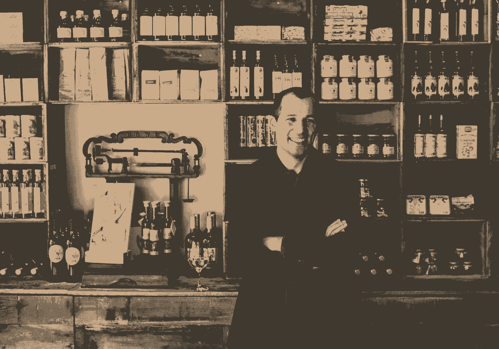
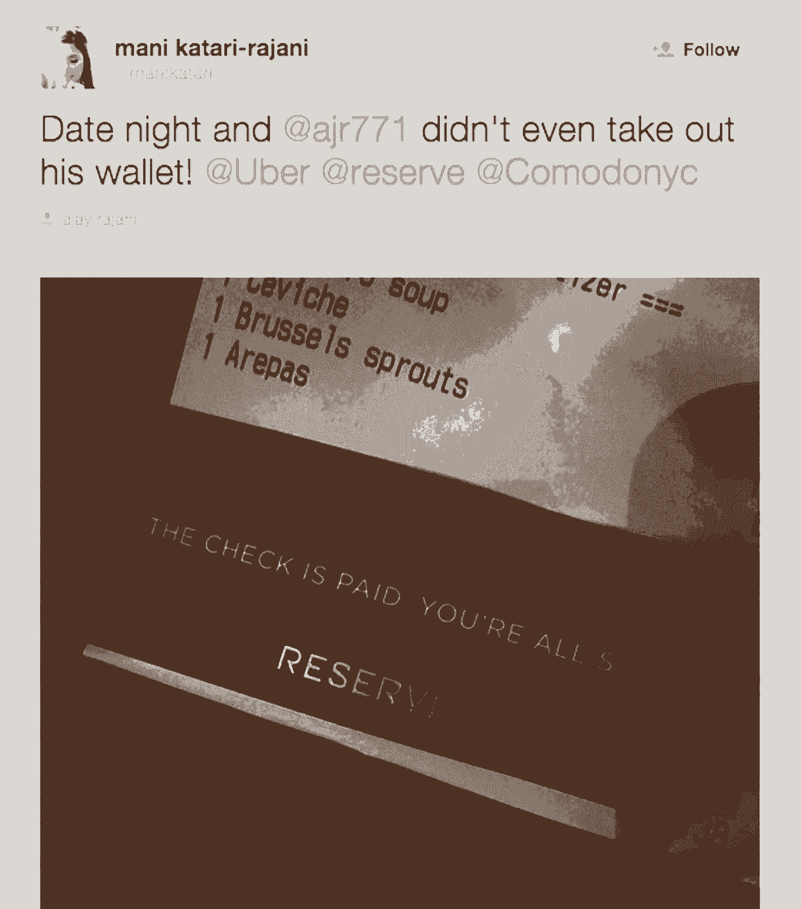

# 这就是你如何建立合作关系，让你的创业更好、更快、更强

> 原文：<https://review.firstround.com/What-to-Learn-from-This-Restaurant-Startup-That-Turned-Strong-Partnerships-into-a-Better-Product>

肖尔·格雷戈里先生对此表示怀疑。作为波斯顿 [Island Creek Oyster](http://islandcreekoysterbar.com/ "null") 酒吧和 [Row 34](http://row34.com/ "null") 的老板，他得到了许多哈佛学生的推介，他们声称要为餐馆老板开发下一个“破坏性”应用。不出所料，这种情况很少发生，结果是巨大的时间浪费。因此，当联合创始人兼首席执行官格雷戈里·洪(Gregory Hong)带领的储备公司(Reserve)与他接触时，他提高了警惕。这是另一个团队，他们的应用程序旨在改善用餐体验——只是有些不同。该产品实际上似乎满足了真正的需求。

“马上，我想很明显，我们有了更多的想法——我们能够和他谈论功能，并向他展示他可以与之互动的东西，”Hong 说。“更重要的是，我认为我们让他相信，我们的业务依赖于我们与餐厅的合作关系，我们真的很有兴趣为他们创造令人难以置信的体验，而不仅仅是使用这款应用的消费者。”

经过多次对话后，Island Creek 牡蛎店被卖掉了，从此它成了这家初创公司最坚定的支持者之一。“他意识到，我们正在全力以赴开发工具，帮助餐馆更好地经营业务，”Hong 说。到目前为止，情况就是这样。在该应用程序正式推出前的八个月里，Reserve 努力收集了数百家餐厅的反馈意见，并一直持续到现在，以制作一款能够吸引更多优秀餐厅的产品，从而吸引更多顾客。

平衡所有这些关系，尤其是通过快速扩展，是一个巨大的挑战。但 Reserve 是一家年轻的公司，有很多需要证明，它正把它视为一个机会，以获得成为市场领导者所需的反馈和影响。在这次独家采访中，洪分享了他对创业公司的建议，这些公司需要建立强大、健康的合作关系才能生存。

在创办 Reserve 之前，洪是一家小型企业的顾问。他们最大的担忧之一是，初创公司不断推出，据说是为了帮助他们，但从未让他们参与开发过程。“在 Reserve 开始的时候，我意识到这是一个巨大的机会，不仅要倾听餐厅的声音，还要让他们参与到我们的创作中来。”

从那时起，公司开始认真执行餐厅合作伙伴的反馈。洪说:“我们从来不希望向人们征求反馈，然后让他们觉得没有结果。”。“我认为彻底改变这种方式已经成为整个储备经验的核心。”建立这种强大的反馈回路对这家初创公司有两个目的:不仅加快了产品开发的正确方向，还拉近了公司与支持其平台的合作伙伴的距离。

# 打造令人敬畏的债券

“我们的首要任务是找出与合作伙伴合作的最佳方式，因为我们希望这种关系能够真正长久，”Hong 说。“我认为在大多数初创公司，有很多情况下，他们与人、供应商和其他组织合作，但他们没有这种长远的观点。”

在 Reserve 的案例中，从一开始就纳入大量合作伙伴的反馈是如此重要，以至于他们推迟了该应用的发布日期。他们在 3 月至 10 月期间进行了一次测试，在此期间，他们与数百家餐厅讨论了他们希望在应用程序中看到的功能，他们对现有功能的看法，他们将改变什么以及为什么。他们收集的许多信息都体现在今天 App Store 中可用的产品中。但是储备并没有停止敲鼓。每天，在公司的所有代表之间，他们几乎与 100 多个餐厅合作伙伴中的每一个人交谈。

不用说，这需要投入大量的时间、精力和人力。但在这个阶段，这已经非常值得了。该公司打来的电话从简单的入住登记到更深入的产品讨论，不断展示餐厅和顾客对产品的体验以及下一步应该做什么。在每次谈话中，餐馆都被鼓励尽可能的开放和坦诚。

除了拜访之外，Reserve 的总经理和餐厅运营经理(通常是创始人)还会定期拜访餐厅老板、经理、厨师、服务员和主人。“我们希望与所有这些人建立关系，亲自去那里是其中很大的一部分，”洪说。“当我们顺道拜访时，我们会收集关于产品的反馈，但这不是主要关心的问题。大多数情况下，我们希望了解每个人，最好是知道他们的名字——每个可能接触到产品的人。我们希望他们觉得可以随时给我们打电话，我们会知道他们是谁，并给予他们全力关注。”

如果你有深厚的人际关系，那么当事情不是 100%顺利的时候，他们会给你一个机会来解决问题，并从中吸取教训。

为了尽可能多地了解合作餐厅的员工，洪和他的团队决定何时召开前厅部或厨房员工会议。当每个人都在一个地方时，他们会过来；他们会在应用程序上提供面对面的培训，这样任何人都可以提出问题并立即得到答案；他们将安排与东道主和总经理的一对一会谈，这样人们可以坦率地谈论事情的进展。洪说:“毫无疑问，你和伴侣接触的点越多，这种关系就越牢不可破。

他说，为了保持这种轻松互利的关系，他们试图在 Reserve 提出的问题和他们回答的问题之间达成 50/50 的平衡。“如果我们正在开发某个特定的功能，我们可能会有一个问题列表，但我们不希望它持续太久，我们希望为他们提供足够的时间来谈论他们遇到的任何棘手问题，并根据他们对应用程序的体验来真正引导对话，”他说。“我们非常高兴地看到，我们的许多合作伙伴对如何帮助他们的工作有着强烈的看法和想法，我们现在开始看到在产品中听到这些内容的结果。”

# 接受他们的观点

如果你的公司确实依赖合作伙伴为消费者提供供应——就像餐馆为储备供应一样——你必须做出一点牺牲。你最终建立的东西不能仅仅基于你的愿景或最初的计划。**你必须将你的产品如何开发的股份让给合作伙伴自己**。如今，Reserve 应用程序的大部分功能已经由合作伙伴的需求和要求决定。洪和他的团队在刚开始的时候不可能预料到他们的结局。他们通过购买合伙人对公司的愿景来对他们做出承诺。

这些愿景涵盖了从宏大、大胆到看似平凡的所有领域。在这个过程中，洪学到了对你所在的行业里里外外都了如指掌并注意细微差别的重要性。例如，通过与餐厅服务员交谈，预备队得到了一个速成班，知道如何快速和疯狂地为每张桌子提供令人惊叹的体验。一旦一个表完成了，它就跳到下一个表上，中间没有时间间隔。因此，需要为这种速度设计特征。

为了更好地了解合作伙伴的期望，该公司正在启动一个名为“下班后储备”的项目，让所有员工都有机会在餐厅员工工作时跟踪他们。这个想法是为了更好地了解人们，增加双方的接触点，并直接了解餐厅员工需要该应用程序为他们做什么。通过全天跟踪他们的角色，可以更容易地看到他们在哪里遇到了障碍，应用程序在哪里需要简化等等。而且，一般来说，人们更有可能在出现想法时就随意提供，而不是通过未经请求的电子邮件发送。

“每次我看到服务器工作时，我都会惊讶地发现，在一周或一个晚上的时间里，它们与销售点系统进行了多少次交互，”Hong 说。“每一次互动，有多简单，花了多长时间都很重要。如果我们 Reserve 的所有人都能理解他们需要多快行动，需要完成多少工作，那么我们就能打造出对他们来说更有意义的产品。”

# 改进产品以满足他们的需求

尽管每一个功能和产品变化都需要收集数据，但洪和他的团队并不满足于只发布新产品，然后等着听人们的想法。他们希望他们的伴侣在每一步都提供意见。作为生产周期的一部分，他们逐步向餐厅展示从早期设计到中间模型的一切。**“我们甚至在开始建造之前就询问合作伙伴的想法，以确保我们走在正确的轨道上**，”他说。“我们不想把资源投入到我们的合作伙伴不需要或不相信的东西上。”

例如，Reserve 在建立会计系统的过程中与几个合作伙伴密切合作。按照最初设想的运作方式，该公司将几天的收入加在一起，几天后向餐馆提供一笔总额。但这与他们的合作伙伴不一致，他们解释说，餐馆看到单日总额是多么重要。Reserve 能够快速适应并改变其会计结构来进行日常存款。“在这种情况下，我们可能更容易以另一种方式做到这一点，但让我们的合作伙伴开心更重要。”

如果你能相对快速地解决问题，向伴侣表明你有多在乎，那就每次都这么做。不要犹豫。

洪表示，所有与合作伙伴合作的创业公司都应该考虑成为他们的端到端解决方案。许多公司都是如此，尤其是小企业，餐馆每天都使用一堆支离破碎、互不关联的工具来开展业务。没有一个无缝的解决方案可以满足他们的所有需求，但 Reserve 渴望解决这个问题。

“如果你能找到一种方法，最终从头到尾照顾到你伴侣的所有需求，你就赢了，”他说。“能够与我们社区的餐厅谈论我们成为这种解决方案的愿景，真的让更多人对我们的工作感兴趣。”

**这里的教训是**:即使你还没有一个全面的或整体的产品，谈论一下你希望有一天如何实现它，以及你现在正在做的事情如何适应这个宏伟的计划也是很好的。这就是激励人们的东西，洪说。如果他们不能让餐馆相信这个更大的目标，那么 Reserve 就像是另一个增量解决方案，只会让事情变得复杂。创业公司应该直言不讳地说出他们的发展计划，这样他们就不会落入这个陷阱。

洪将该公司与总部位于洛杉矶的玫瑰公司的互动作为理想合作的一个典型例子。“我们立刻意识到，厨师兼老板安德鲁·基尔希纳(上图，右，洪在中间)将是一个非常好的合作伙伴。从我们第一次见面开始，他的整个团队就给了我们很好的反馈，告诉我们他们喜欢 Reserve 的什么，并希望看到更多。Andrew 非常坦率地向我们介绍了经营一家快节奏餐厅的挑战，在几周的时间里，我们能够证明我们的技术不会让他的员工分心，而且实际上有助于简化事情。现在，当我们走进去的时候，他的员工会告诉我们他们是如何使用产品的。”

Greg Hong, Co-Founder and CEO of Reserve

从一开始，Reserve 就确定了一个核心餐厅群体——那些已经存在了几十年的餐厅——它们可以为业务以及如何改善业务提供宝贵的见解。“从第一天起，我们就竭尽所能，通过积极响应、倾听他们的反馈、向他们展示它如何改变了产品，来赢得这些合作伙伴的支持，”Hong 说。“在餐饮领域，他们真的是我们的口味制造者。其他人听他们的。我们知道，如果我们对他们好，当我们开始与全国各地的餐馆交谈时，他们将是我们最有力的支持者。这也是我们花了这么长时间推出并最终确定产品的原因之一，因为我们与这些餐厅进行了多次会谈。”

为了让这些核心影响者更进一步，Reserve 向他们提供了新功能集的早期演示，并派其总经理和餐厅运营经理向员工清楚地传达变化。该公司列举了用户体验的每一个差异，并提供面对面的培训。之后，他们会定期联系以确保一切顺利进行。如果一切顺利，他们将为其他合作伙伴推出这些功能。

当一家餐厅提供的反馈以一种有意义的方式塑造了应用程序时，Reserve 会让它为人所知。“我们不只是发送一个便条说，‘嘿，这个功能是因为你，’”洪说。“我们有一个完整的后续对话，讨论他们如何改变了我们思考问题的方式，以及他们为像他们一样的其他人做了多少更好的产品。他们非常欣赏这一点，觉得自己真的是更大事业的一部分。”

与有影响力的伙伴共度这段美好时光有它的好处。

“当你的合作伙伴不仅向其他合作伙伴，也向使用你产品的消费者传播你的信息时，你知道你在做正确的事情。“我们现在看到的是，服务员将卡片放在人们的桌子上，鼓励他们使用 Reserve 再次光临，这对我们来说非常令人惊讶，”Hong 说。

如果你生产的产品让合作伙伴感觉他们真的在做出贡献，他们会成为你最好的大使。

“获得合作伙伴的认可不仅能打造更好的产品，还能极大地拓展您的业务。在这一点上，我们的合作伙伴正在帮助我们建立更好的品牌和更好的体验。”

# 不要让反馈下降，解释它

初创公司可能犯的最大错误之一是征求毫无结果的反馈。你可能不记得丢了球，但是合伙人会记得，而且会影响他们对你的看法。这并不意味着你总是要做出他们推荐的改变。以洪的经验来看，你希望在执行每件事情和“让他们感到被倾听”之间找到平衡点。但是后者，尤其是，已经成为一个在科技领域被过度使用的短语，并且可能会给人一种居高临下的感觉。洪说:“让别人感到被倾听和被重视是有很大区别的。”。

第一步是确保你以负责任、有条不紊的方式获取反馈。你不希望事情从缝隙中溜走，所以你最好设计一个系统，让所有事情都被记录下来并传递下去。

例如，Reserve 每周召开一次会议，会上所有能够从合作伙伴那里获得反馈的人都会聚在一起，传达他们所学到的东西。他们收集的所有意见和建议都被实时记录在功能报告工具中(他们使用[路线图工具 Aha](http://www.aha.io/ "null") ！)这样就可以在每个周末复习了。“我们使用它来查看是否出现一致的问题，或者一致的共识，即我们应该建立特定的东西。无论是哪种情况，我们都要仔细观察。”

如果强大的模式确实出现了，公司将重新安排其路线图的优先次序，以确保合作伙伴的请求和错误修复被推到前线。“这样对待事情真的很有帮助，因为它帮助我们推动生产，这无疑会对我们的业务产生最大的影响，”洪说。

但也许这个过程中最重要的阶段是管理没有得到实施的反馈。Reserve 不会忽略它或将其归入某个遥远的文件，而是会跟进提供它的人或餐厅，并详细解释他们为什么决定走不同的方向。

“在每一种情况下，我们都看到这种类型的对话非常有影响力，”洪说。“我们会直截了当地说，‘嘿，我们知道我们没有做你希望我们做的事情，但是有更多的人强烈希望用另一种方式来做这件事。’关键是要传达这样一种信息，即我们真的认同了他们的观点，并且我们根据反馈得出了合理的结论。**当人们觉得你支持他们提出的某件事时，不管这件事有没有完成，你都在培养忠诚度。”**

# 为合作伙伴重新定义客户服务

“鉴于我们与餐厅合作伙伴的关系非常密切，顾客服务做出不同的回应非常重要。”洪说。“他们在实时处理问题，而不是像我们大多数用餐者那样在事后处理。他们的服务器需要让人们立即检查，如果技术没有按照他们预期的方式工作，或者 wifi 连接中断或其他情况，他们需要立即与人通话。”

Reserve 向其合作伙伴提供餐厅运营经理和总经理的手机号码，以便他们可以立即与某人联系，并即时解决问题。“这本身就代表了我们希望他们拥有的安全感和重要感。”

合作伙伴的客户服务也需要有所不同，因为他们的许多直接问题可能可以追溯到需要对产品进行的更改。**与忘记密码等消费者客户服务查询不同，合作伙伴的问题直接触及功能的核心。**“您需要建立一种机制，将合作伙伴报告的所有紧迫问题打包成一个更大的包，以便您能够满足他们的长期需求。”

为了给消费者打造出神奇的东西，你需要和你的合作伙伴紧密结合。

考虑到 Reserve 的合作伙伴关系的深度和他们联系的频率，每位客户服务和运营经理都需要将每一次查询视为一次联系机会，这是留下深刻印象和强化 Reserve 对其业务价值的又一次机会。

随着公司向新城市扩张，保持这些互动有意义和个性化的关键是内部沟通，洪说。该公司已经为其总经理和整个团队举办了多次峰会，以确保合作伙伴体验的连续性，无论他们身在何处。

洪有时会召集每周甚至每天的会议，这取决于是否会有影响合作伙伴的重大变化，或者他们是否已经听到了许多相同问题的实例。每位运营经理都有许多合作餐厅，他们的首要任务是在他们和 Reserve 之间建立个人联系。峰会和会议用他们需要的数据和语言武装了他们，让他们能够提供充分知情的答案。

# 扩展合作伙伴关系

Reserve 希望有一天成为一个平台，让世界各地成千上万的餐馆都能注册自助套餐，为食客提供优质体验。因此，洪和他的团队希望看到他们的产品在不同市场上的分层和细分。然而，保持高质量的体验不会随着公司的发展而改变。这对于保留的任务来说太重要了。

为了保持快速有效的反馈循环，Reserve 将选择使用该服务时间最长、过去曾担任过值得信赖的顾问的较小规模的轮流合作餐厅。“这些餐厅将更深入地了解我们正在努力建设的东西，以及我们未来的工作重点，”洪说。“当我们的平台真的发展到如此之大时，我们将无法像现在一样听取所有人的意见。根据细分市场，我们需要不同的听众群体。”

保持高标准，因为你的规模就是要建立一个从一开始就与质量相关的品牌。

Reserve 保持高标准的最大举措集中在合作伙伴教育上。如今，每当一家新餐厅加入，它都会收到描述该应用程序附带的理想餐厅体验的简短指南。

指导方针的例子包括当客人到达时，用名字问候他们(他们的照片会事先出现在餐厅的应用程序上)，以及在晚上结束时放下卡片，让食客知道账单已经支付。这些简单地说，“支票已付。你已经准备好了。”

像这样的小触动实际上引起了如此大的共鸣，以至于食客们拍下了储备卡的照片，并发布在 Twitter 和 Instagram 上。“这种现象创造了一个全新的指导方针，”洪说。“我们在社交媒体上看到所有这些爱，我们可以指着我们的伴侣说，‘嘿，让我们都努力工作，确保这种情况继续发生。’"

Reserve 在这一领域做的最重要的事情之一是提醒其餐厅合作伙伴，他们的利益非常接近。Reserve 和与之合作的餐厅都希望用餐者在用餐后带着从上到下的体验完全兴奋地离开。“随着我们的发展壮大，我们将一遍又一遍地传递主要信息，即我们正在提供工具，让餐厅更容易实现这一目标。如果我们得到反馈，认为用餐者的情况不理想，我们会与餐厅分享，这样他们就知道下次可以做得更好。”

随着 Reserve 汇集来自就餐者和餐馆的所有经验、观察和数据，它计划创建更详细的指导方针、最佳实践和手册，分发给每个市场的每个合作伙伴。

“与此同时，我们希望他们能够独立做事，因此在标准化和为他们提供一个可以表达自己风格和身份的沙盒之间有一个平衡。标准化是关键，因为我们不希望在四个不同城市的餐厅里进行相同的基本对话。”

洪知道，这种深思熟虑、小心翼翼的发展需要深思熟虑，在他们停止管理并向所有人开放平台之前，他们需要有一种非常强烈的品牌完整性意识。

他说:“如果人们在成为合伙人之前就了解了预备队的经历应该是怎样的，我认为我们正朝着正确的方向前进。”“体验永远是我们提供服务的重中之重。我们了解自己，这也是我们不断向合作伙伴传达的主要内容之一。”

拥有强大的伙伴关系比我们想象的要有影响力得多。

“我认为，如果你的合作伙伴战略运行正确，他们应该成为你业务的延伸，成为你团队的成员，共同努力完成工作。”