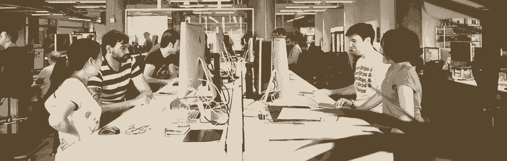

# 为什么每个创业公司都应该结对计划

> 原文：<https://review.firstround.com/Why-Every-Startup-Should-Pair-Program>

如果有一家公司知道“软件开发”，那就是 Pivotal Labs。 [Edward Hieatt](http://pivotallabs.com/author/edward/ "null") 和他在 Pivotal 的同事来自敏捷开发学院，在他们的客户工作中，他们注意到许多初创公司随着规模的增长，他们的开发文化开始受到侵蚀。

Pivotal works 每年联系的 100 多家公司中的大多数都来找他们，因为他们认为他们只是需要更多的开发支持来加快出货速度或管理他们的增长。但通常情况下，Hieatt 认为这个问题实际上与更广泛的发展文化问题有关。特别是，对于早期风投支持的创始人来说，成长的烦恼会影响软件开发的文化，以至于出货时间表和创新受到重大影响——几乎让公司陷入停顿。

**HIE att 在** **[首轮资本 CTO 峰会](http://firstround.com/about "null")** **上提出的解决方案很大胆:**一种完全围绕结对编程构建的文化。

通常，当工程师谈到结对的好处时，他们通常会想到更快或更好地编写代码，但 Hieatt 实际上认为这是伟大文化的关键之一。此外，结对的概念引发了一系列的情绪，并反驳了关于当今团队如何形成和工作的传统智慧。

例如，今天早期团队中的文化经常允许开发人员在自治的筒仓中工作，或者在 sprints 中工作，做出他们自己的时间，以及许多其他规范，这扼杀了软件开发文化。此外，工程负责人担心结对实际上会降低团队的速度，减少开发人员的产出，或者至少会打扰他们习惯于整天独自坐着自己编码的工程师。

# 定义强大的软件文化

问大多数创始人和工程师什么是强大的工程文化，他们的回答总是围绕着工具、招聘流程、技术选择、强大的编码和审查标准、卓越的团队领导等等。然而，在 Hieatt 看来，这些都不是定义强势文化的要素。

软件开发文化实际上是关于一组行为和交互的——决策是如何制定的，谁参与其中，以及哪些决策在操作的业务方面加强了责任。

它是一个公司日常文化和团队合作的最终体现。

# 在我们这个行业，团队合作是没有定义的

对于建立和维护持久的软件开发文化的公司来说，我们必须首先定义“团队合作”的含义。在 Hieatt 看来，“团队合作”作为软件开发中的一个概念已经落后了几十年，尽管围绕着团队文化有很多陈词滥调。

现实是，在软件和初创公司的世界里，摇滚明星的心态仍然受到奖励和鼓励——人们通宵工作，团队之间的贡献并不均衡。此外，技术创业公司通常害怕管理，害怕过早地将结构强加给团队，即使团队没有很好地合作以按时完成任务。为了考虑结对编程，人们需要首先重新思考团队合作对他们的公司意味着什么。

# 为什么要考虑配对？

软件开发实际上是关于人的，是一种社会活动。正因为如此，结对的概念成为团队合作的核心单元，以此来建立软件开发文化，并且在团队开始快速扩展时提供无限的好处。例如，在 Pivotal Labs，工程师们整天都在进行结对编程。

**结对编程的好处越来越多:**

工程师利用代码库的共享知识，并具有更好的纪律、沟通和绩效，因为他们对同事负责。

它使新员工入职变得非常容易，使反馈循环变得更快，并允许拥有不同团队的大型组织内部的交叉授粉。

在这里，结对是关键的文化建设者。

**如何实现配对**

通常，工程领导者认为当转移到结对编程时，他们的组织中会有巨大的阻力——但是大多数时候，如果它被正确地实现，它实际上是被接受的。

那些抗拒的人通常是因为害怕被人看到，或者害怕每天都要和别人说话。但是，如果你让工程师们意识到这实际上只是一起极客，他们通常会很快开始理解它。

当您的公司准备好进行结对编程时，Hieatt 提供了一些关于实施的战术提示:

团队应该在一起，并保持共同的时间。

机器应该是公用的，而不是分配给个人。

结对应该每天轮换(混合结对可以平衡团队)。

公司应该在“对的层面”给予自主权，而不是个人层面，这样随着时间的推移，团队整体上会有更大的权力。

获得管理层对结对编程方法的认可。

建立反馈循环的定期检查，以确保这种方法是可行的。

在团队不确定是否结对的情况下，先从一个较小的团队开始，然后如果感觉合适就全押。

前一天晚上安排好第二天的团队，这样团队就能准时出现。

# 配对的可能结果

Hieatt 指出，一旦结对编程在一家公司实施，反馈通常会得到显著改善，而且反馈会变得更加准确，因为所有团队成员之间更频繁的互动导致数据点的数量增加。承诺结对当然不是一个微不足道的决定。调整需要时间，但 Hieatt 相信这种改变是值得的，并且可能是团队合作的真正工程文化的关键。