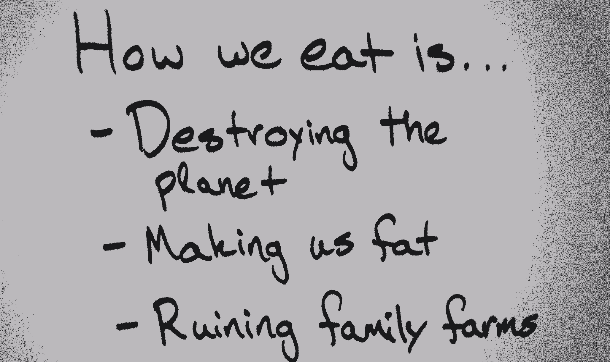
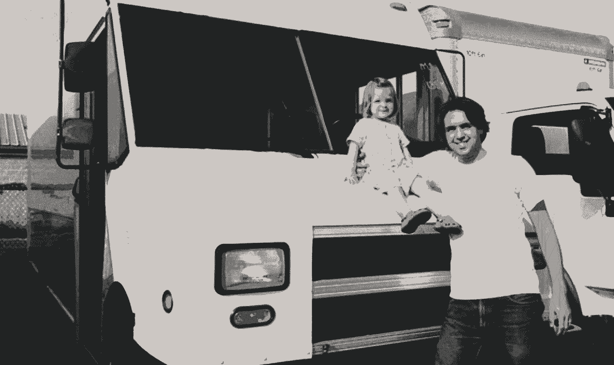

# 为什么这位企业家离开麦肯锡去找一份卖汉堡的工作

> 原文：<https://review.firstround.com/Why-this-entrepreneur-left-McKinsey-to-get-a-job-flipping-burgers>

在职业生涯的每一步，艾尔·穆尔都做出了“正确”的选择:麻省理工学院、哈佛商学院和麦肯锡——还有比这更理想的职业道路吗？后来，艾尔决定辞去高薪的咨询工作，开始卖汉堡包。

穆尔没有告诉大多数人的是他的秘密野心——建立一个注重健康和环境友好的快餐连锁店，有一天它的规模会超过麦当劳。为了实现这一点，艾尔很早就意识到他的假设几乎总是错误的，而成功的唯一途径就是将自我从等式中剔除。

在我们最后一次[首轮资本设计+创业讲座](http://designplusstartup.com/ "null")中，Ayr 分享了他的公司 [Clover](http://www.cloverfoodlab.com/ "null") 如何创建一种全新的连锁餐厅，并通过像设计师一样思考来实现这一崇高目标。

# 从“为什么”开始

在他著名的 Ted 演讲中，[西蒙·西内克](http://www.ted.com/talks/simon_sinek_how_great_leaders_inspire_action "null")解释了苹果如何从“为什么”开始激励员工和顾客大多数公司以“什么”开头:“我们卖电脑。”苹果以“为什么”开头:“我们所做的一切都在挑战现状。我们相信以不同的方式思考。我们只是碰巧制造了很棒的电脑。”

正是这种对核心理想的承诺让一家公司鼓舞人心。为此，艾尔在《三叶草》杂志上列出了他的公司将致力于解决的一系列问题。

尽管购买混合动力车、攻击大型石油公司和购买荧光灯泡在对抗二氧化碳排放方面风靡一时，但对于这些气体最明显的来源:奶牛放屁，几乎没有采取任何措施。但是说真的，牛的胀气比世界上火车、飞机和汽车排放的温室气体加起来还多 18%。

我们吃的东西也与美国的肥胖流行病密切相关。三十年前，美国肥胖率最高的州约为 14%。今天，最好的州超过了这个比例，最差的州超过了 30%。此外，麦当劳及其同类已经改变了公司农业，摧毁了家庭农场和可持续农业。

这些问题是 Clover 背后的灵感，这是一种全新的素食餐厅，专为非素食者建造。穆尔了解到，最具影响力的公司几乎总是从试图解决一个大问题开始。

# 向最优秀的人学习——即使拿着最低工资

你听说过麦当劳不雇佣资历过高的人，因为害怕他们自大吗？艾尔验证了这个流言。他在麦肯锡攒下了五周的休假时间，所以他申请去麦当劳工作。被拒绝了八次。

直到他在汉堡王的第四次面试，他才得到这份工作。他得到这份工作的唯一原因是，他的老板认为简历上的“咨询”是“失业”的委婉说法。从那里，艾尔又去了帕内拉面包。在这两份工作中，艾尔学到了一些业内精英是如何在底层运作的。大多数高管愿意为这种内部消息支付高薪，但很少有人愿意拿最低工资。

# 廉价和学习

艾尔着手开始了一项他几乎一无所知的事业。当然，素食餐馆以前就存在，但没有一家想解决他所面临的问题，也没有一家是为食肉动物建造的。所以他开始最大化他的学习速度。他认识到:

失败是你学习的地方。我们喜欢失败。我们每天都希望失败。我只希望我不会犯前一天犯的同样的错误。

他的口号“廉价和学习”体现了这一思想。你只有在犯了错误之后才能真正学到东西。公司经常说他们希望他们的员工承担风险，但他们并不这样做。这一理念需要融入公司的组织结构。对这句咒语的一个警告是“便宜”是广义的。虽然这显然意味着经济上的廉价，但廉价的实验也不应该过多地扰乱你的员工或破坏与客户的关系。

Ayr in front of his very first truck with his daughter, Clementine.

带着这个想法，艾尔避开了外包三叶草的菜单或者把他所有的钱都花在焦点小组上。相反，他受到了他最喜欢的大学快餐车经营者的启发，开了一辆自己的快餐车。这个想法是，Clover 将能够通过在食品卡车上而不是在商店里操作来进行实验和迭代——更快，风险更小。在三叶草开发了它的不可抗拒的菜单后，它关闭了它的食品卡车实验，开始了餐馆游戏。然而，三叶草食品车并没有离开很久。顾客要求退货，今天，三叶草是美国最大的快餐车运营商。

但要真正最大限度地学习，公司应该鼓励所有员工不要害怕失败。一次，一名员工来到 Ayr，分享说他想尝试销售肉桂柠檬水。考虑到这是一个令人厌恶的想法，艾尔只给出了一条反馈，“只是不要不要赚很多。”事实证明，这是一个巨大的成功。之前，Clover 每天早上都会从头开始做柠檬汽水，但是用了更明显的成分，比如覆盆子和蓝莓。“突然间，这成了我们冬季柠檬水的答案。当我们没有那些浆果时，我们可以用香料。这是一个切实的例子，如果我们不愿意失败，我们就无法学习。”

# 在门口检查你的自我

罗恩·约翰逊将作为发生在 JC·彭尼身上最糟糕的事情而被载入史册。他轻率的全国推广疏远了它的核心客户。当被问及这些看似傲慢的技术时，约翰逊给出了完美的回答:“我们没有在苹果进行测试。”

对他和 JC Penney 的利益相关者来说不幸的是，苹果是一个例外，而不是普遍现象。苹果有一个令人难以置信的产品，它会以一百种不同的方式销售。他们所要做的就是发生在其中一个人身上。任何非苹果零售商都知道，测试是零售创新的核心租户:在一家商店尝试一些东西，然后慢慢推广到全国。

连顾客都不知道自己想要什么，所以零售商怎么可能知道呢？没人那么聪明。关键是要认识到这个事实，把自我从等式中去掉，去实验——一次又一次。

# 透明度

每个成功的创业公司最终都会达到“尴尬的规模，他们需要一些好的培训项目。不幸的是，一旦你需要它们，你昨天就需要它们了，”穆尔说。

Clover 用它的培训材料和员工手册尝试了一些新的东西。首先，它从来没有完成它们。每一个新版本都是在前一个版本的基础上扩展，不断迭代和改进。其次，它在网上发布了它的[教师指南](http://www.cloverfoodlab.com/wp-content/uploads//2013/02/Clover-Teachers-Guide-2-20-13.pdf "null")，任何人都可以看到。“实际上，我们所有的客户都可以阅读。我的员工可以阅读。因此，如果你是一名员工，你可以去阅读你的教练的小抄。你可以去阅读下一次培训的教师指南。但是为什么不呢？我的意思是，如果他们想花额外的时间来学习，那太棒了...最酷的是，我们从客户那里得到反馈，有时会说“你在第五页拼错了什么。”我没开玩笑。我们从客户那里得到这些疯狂的、详细的评论——有时是很长的、多页的东西。"

“我们能够参与其中，因为我们对此非常透明和开放，我们不害怕分享正在进行的工作。因此，就像食物一样，它会经历许多快速的反复。当你接受这种方法，便宜又学习，便宜又学习，你的进化时间表会发生巨大的变化。在过去的六个月里，我们的训练计划发生了巨大的变化。它变得越来越好，越来越好，真的很快。”

# 不要只听顾客的，也要推动他们

“人们来吃早餐，看到我们为以后做汤，他们会问，‘哦，今天有什么新汤？’帕特，一个很早就喜欢我们的顾客，有一天问我们，我说，‘这是萝卜汤。帕特说，“啊，上帝，我讨厌芜菁。我甚至不允许他们在我家过感恩节。任何人带芜菁来，我告诉他们把它们放在外面。'

我说，‘你知道，尝尝吧。’

不不不。

你会喜欢的。

不不不。

在这一点上我们了解帕特。那天她回来吃午饭，她拿了一些其他的东西，我就说，‘这是一个样品。’她拒绝了，我说，‘尝一点就好。它不会杀了你的，帕特。她很喜欢。从那以后她买了很多汤。但是，你知道，有时倾听客户需要互动和参与。有时候你必须给人们一点压力，而我们在这方面已经取得了很多有趣的成功。"