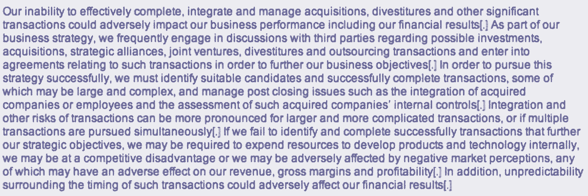
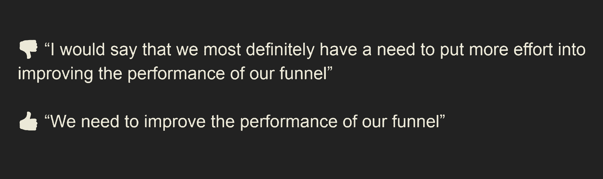

# 创始人写作指南

> 原文：<https://review.firstround.com/a-founders-guide-to-writing-well>

*本文由* ***[戴夫·吉鲁阿德](https://www.linkedin.com/in/davegirouard/ "null")*** *，AI 借贷平台* ***[新贵](https://www.upstart.com/ "null")****CEO，前 Google Apps 总裁。他因领导现在名为谷歌云的企业实现第一个 10 亿美元的收入而闻名。Girouard 之前为评论写了为什么最好的创业公司* *[让速度成为一种习惯](https://firstround.com/review/speed-as-a-habit/ "null")**——在这里他分享了他关于如何将有效写作添加到你的创始人工具箱中的建议。*

“笔比剑更有力量”，爱德华·布尔沃-利顿，1839 年。

在成功企业家的诸多技能中——远见、执行力、说服力、毅力、勇气、适应力——有效的写作不可避免地未能上榜。但我认为，你写作的质量有助于你作为创始人和高管日复一日的经历。此外，在整个组织中模拟和强调有效写作的重要性可以在更大范围内有意义地提高业务执行和成果。

言语很重要。至少，它们塑造了你给别人的印象——通常是第一印象。糟糕的写作会在很多方面伤害你:逻辑被隐藏，要点丢失，新闻被埋没，意图被误读，感情被伤害，可信度受损。假设有人真的读过你写的东西。

但是也有好的一面。任何一个二战历史学家都知道，温斯顿·丘吉尔在 1940 年最黑暗的日子里，完全通过文字的力量，支持了英国人民的抵抗。如果一些精心制作的演讲决定了历史上最大的军事冲突的结果，人们可能会认为有效的写作可以改变我们每个人。

在离家更近的地方，我目睹了精心选择的词语是如何改变高管们发现自己所处的困境的。我在谷歌的早期，雪莉·桑德伯格领导着一个快速发展的运营团队，从工程的角度来看，这个团队长期处于非优先地位，导致她的团队的人工工作呈指数级增长。意识到拉里和谢尔盖重视以工程为导向的效率，并保持谷歌的“精简和吝啬”，她写了一篇名为《如何不雇佣 10，000 人》(How not to employee 10，000 people)的著名文章，为在她的运营中投资工程资源提供了理由。果不其然，拉里和谢尔盖很快就让谢丽尔雇佣她想要的那么多工程师。

撰写丘吉尔式的散文超出了大多数人的能力范围，也不太可能让你拿到红杉投资意向书。然而，写作可能是各行各业的领导者最有效的工具。从逻辑上讲，你的公司越大，写作就越是值得拥有的技能。即使在一个充斥着每周 TGIF 会议的世界里，一些精心制作的段落也能赢得胜利。

文字和软件有一个共同的奇妙属性:写一次就可以让无限的受众受益，而不需要额外的费用。

# 我的写作史

1984 年秋天，作为达特茅斯学院的一名新生，我参加了英语五年级的学习，这门课程旨在教授写作的基础知识，同时让你头朝下、双手反绑地阅读约翰·弥尔顿的《失乐园》。我没有选择这门课——这门课是必修的，除非你能通过 SAT 的英语部分证明写作能力。我没有。

Dave Girouard, lacing up before a 400M race at Dartmouth.

斯宾格曼教授要求他的学生每周写一篇关于《失乐园》的文章，同时要遵守一套军事精度的结构规则。我们的希望是，被迫在令人窒息的语法框框中写作，我们将发展终生的写作纪律，即使这些约束已经放松。英语 5 变成了达特茅斯版的穿着军靴在沙滩上奔跑。

写一些关于《失乐园》的文章足以让大多数 18 岁的人达到不负责任的饮酒水平，包括这个人。然而几十年后，斯宾格曼教授的《英语 5》仍然是我一生中最难忘的课堂经历。如果我能清晰地回忆起 35 年前的写作经验，或许它们能为那些希望为自己的工具箱增加一些有用东西的创始人和高管提供一些有价值的东西。以下是在桑伯恩大厅那些狭小的房间里学到的一些更令人难忘的经验，并结合了一些我后来继承的实用写作建议。

# 照我说的做，不要照我做的做

我不得不先说明两点:

**首先，我并不自称是一个伟大的作家**。你听到的嗖嗖声是这个工程专业的学生在躲避更多有资格的语言学家对我的散文的评价。在这篇文章中，我预计会违反我自己的许多规则——毕竟，它们实际上是指导方针而不是规则。

**其次，并非所有的作品都值得同样的关注**。短信、直接信息、Snapchat 等已经有了自己的生命，产生了英语的一个蹩脚的衍生物，如果不是功能性的话。即使是好的时尚电子邮件也不总是值得你花时间去拿编辑的单片眼镜。把你的午餐订单送过来？随意颠倒几个字母或缺少标点符号。更新到董事会？让我们用拼写检查器检查一下那个。但总的来说，我认为我们大多数人在书面交流上投入的时间严重不足。

因此，我给你以下八条建议来提高你的写作水平:

# 1.使用简短的词语。

无论是谁让世界相信华丽的词藻有助于高质量的写作，都是对我们的严重伤害。特别是在商务交流中，越简单越好。

[喷雾指数](http://gunning-fog-index.com/ "null") **通过计算每个句子的字数和每个单词的音节来衡量文本的可读性。GFI 的产出可以被解释为你的读者可能已经离开正规教育但仍然理解你的作品的年龄。

我经常想起丘吉尔的这段话，几年前我读过的一篇博文中强调了这一点(三个或三个以上音节的单词用蓝色表示。)GFI 是 9.8 岁——这意味着你的普通五年级学生可以理解温斯顿爵士的演讲。

现在，如果可以的话，请接受这份柯达 SEC 文件中扣人心弦的散文。GFI 是 25.7 岁，这表明硕士学位可能是理解这种混乱的先决条件:

当你传达的信息真的很重要时，要像温斯顿爵士的演讲那样得到“睁着眼睛，半张着嘴”的回应，而不是像柯达那样懒散地扫描和打盹。

但是怎么做呢？对商业行话的搜索和摧毁任务是一个很好的起点。能“卖”的时候为什么要“撤资”？当“目标”可以让你到达那个承诺的地方时，为什么还要追求“商业目标”呢？

如果你每天除了写作之外什么都不做，就好像你的读者是一个博览群书的中学生一样，那么你已经领先众人好几步了。

# 2.让你的动词来完成这项工作。

有效的写作主要依靠动词，较少依靠形容词和副词。再看一遍丘吉尔的演讲。

众所周知，丘吉尔总是把严酷的事实和顽强的乐观主义放在一起，他对动词的选择让人们对形势的严峻性毫无疑问:悲伤、倒下、捍卫、战斗、崩溃、失去、失败、沉没、振作、承受。

选择这些词无疑需要仔细的思考和严格的编辑(作者很可能在浴缸里口述)。然而，我们大多数人会选择脑海中闪现的第一个动词，然后用垃圾填充词来充实我们的句子，直到我们对自己的观点感到满意。

在动词上投入时间和精力，你的写作会提高。

在斯宾格曼教授的课上，我们不允许使用动词“to be”(是，am，are，was，was)——永远不允许。这些最懒惰的动词为作者提供了一个逃生出口，而传达的信息只不过是等号而已。虽然语法正确而且非常有用，但动词“to be”在 1984 年 9 月的桑伯恩大厅是被禁止的。

五年半以来，我一直虔诚地为 Upstart 的董事会撰写每月的电子邮件更新。在我的脑海中回响着斯宾格曼教授的话，我经常把诸如“上个月很艰难”之类的轻描淡写的回答换成像“上个月生意惨淡”之类的狙击手般的直接回答。幸运的是，这个消息很少令人失望，但当它令人失望时，我的董事会成员可以期待收到无糖的。

# 3.消除 a̶l̶l̶不必要的话。

"如果我有更多的时间，我会写一封更短的信。"

这句话很好地总结了这一点。可悲的是，写简洁的句子需要时间和精力。首先，考虑以下建议:

过分的填充词:非常，相当，很少，确实，有点，真的，有点。头脑中这些无营养的卡路里要么缓冲你脆弱的信念，要么假装量化你未能量化的东西。

**一般来说**，如果你不能识别一个单词是什么词性，最好不要使用它。

**你可以省去“我认为”**——你的读者会感激你在打字之前必然想到了这个宝石。

A sample slide from Dave Girouard's presentation on writing to the Upstart team.

混乱不仅发生在单词层面，也发生在句子和段落层面——你可以称之为想法层面。如果无关的词语分散了读者的注意力，无关的想法会让他们在你的意识中进行一次“爱丽丝梦游仙境”之旅。在娱乐的同时，这些旁门左道可能会阻止你的读者在精神上跟踪你的预期路径。

文字为你的读者争取稀缺的注意力。因此，每一个不必要的词都会减损重要的词。

两个简单的策略可以训练你消除不必要的想法。首先，知道人类擅长阅读，除非绝对必要，考虑一下你的读者会跳过你文章的哪些部分。然后删除它们。

第二，远离你的写作。如果时间允许，做些别的事情——做些运动，享受一顿饭，或者小睡一会儿。当你回到你的文字时，你将会从你作为作家的偏见中走出一小步，而从读者的角度看你的作品则是一个巨大的飞跃。当我完成最终版本时，我通常会减少至少 30%的字数。

# 4.使用简单的动词时态。

英语被赋予了丰富的动词时态，同时也受到了诅咒。具体来说:现在简单，现在进行时，现在完成时简单，现在完成时连续，过去简单，过去连续，过去完成时简单，过去完成时连续，将来简单，将来连续，将来完成时简单，将来完成时连续。

也许斯宾格曼教授知道他们都做什么，但我不知道。然而，我可以毫不含糊地说，当简单的形式完成任务时，作家往往选择复杂的形式。

A sample slide from Dave Girouard's presentation on writing to the Upstart team.

我相信十二种动词时态中的每一种都有令人信服的理由，我也相信有才华的作家能够很好地利用每一种时态。如果你不是他们中的一员，小心行事。

# 5.避免被动语态。

如果你在想“哦，又是动词”，记住它们是值得做对的。没有动词，我们的语言失去了许多活力。

无论如何，如果禁止动词“是”还不够，另一个绑在我们脚上的陆军新兵教授 Spengemann 是对主动时态的坚定承诺。对于那些不熟悉的人来说，主动时态意味着你句子开头的名词正在做某事。在被动语态中，名词不做任何事情——事实上事情已经发生了。

这么多年后，我现在明白了为什么这位优秀的教授如此鄙视被动语态。在我听来，这听起来，嗯...被动。间接且水。围绕手头的事情悠闲地散步。

阴谋论者可能会认为被动语态经常试图隐藏到底是谁干的(“有人发表声明质疑比尔的判断”)。无论如何，尽可能选择主动时态。

# 6.结构很重要。

在斯宾格曼教授要求严格的世界里，用可接受的动词形式创造简洁高效的句子仅仅是一种赌注。避免红笔的愤怒需要在多个层面上严格坚持结构化写作。没有给予例外。

一旦我们能够构建一个严密的句子，接下来就是段落了。第一句话应该概括整个段落。剩下的句子应该支持第一个。如此构建，每一段都清晰地表达和捍卫一个想法。

**论文:**从那以后，斯宾格曼教授要求论文在整体上保持这种严谨的结构。论文的第一段应该总结整个工作。接下来的每一段都应该为第一段辩护，而不是偏离到一些想象的和无关紧要的次要情节。

我们这些大一新生局促不安，努力写出线性的、简洁的、有条理的文章——从头到脚的结构。想必弥尔顿本人从未上过英语 5 级，因为他在《失乐园》中运用的宏大风格没有提供这样的训练。严谨的结构并不适合每一个人，也不可能产生丘吉尔演讲的宝藏，更不用说 E.E .卡明斯了。但是对于我们这些仅仅希望我们的文字被阅读和理解的人来说，对结构的一些关注就能使指针移动。

# 7.说重点。

现在是 2020 年，我满怀渴望地读了另一篇博文，一家科技公司宣布裁员。谢天谢地，指引我到这个公司博客的推文直截了当地介绍了这个消息，因为这位首席执行官的帖子直到第五段才提到它。(更糟糕的是，他实际上从来没有说过，而是吐出模糊的商业术语，直到我明白他是在宣布裁员。我知道这消息不好，但看在上帝的份上，就说吧！

记者称之为焚尸灭迹。我称之为浪费读者的时间。

我明白了——需要考虑上下文，需要提供某种缓冲以避免可怜的读者心脏停止跳动。但是，假设你的 GFI 至少 18 岁，我们都是成年人，你真的应该说出来。

**我曾多次起草电子邮件、博客帖子或新闻稿，让读者陷入合理化或背景设定的泥沼，只是为了在找不到进一步的分散注意力的途径时，温顺地陈述需要陈述的内容。**举个例子，2018 年，我接到了一个不值得羡慕的任务:告诉公司，Upstart 备受爱戴的第一任工程主管乔纳森(Jonathan)要离开公司了。在起草这封邮件时，我一开始就像往常一样喋喋不休地说，我们如何在 Upstart 雇佣出色的企业家，并自然而然地希望他们在某个时候继续创业。我试图说服自己乔纳森的离开是公司强大的信号，这让我冒着失去员工对我的信任的风险。

但多亏了斯宾格曼教授，我们的员工实际上读到的第一句话是:“我很悲伤地告诉你，在作为我们领导团队的一部分进行了 6 年多令人难以置信的工作之后，乔纳森很快就要离开 Upstart 了。”

你最好直接说出来。你的读者可以接受——事实上也会欣赏你的直率。

# 8.打破所有的规则。

伟大的作家对英语以及如何驾驭它的力量有一种直觉。这样做，他们可以打破所有的规则。最终，写作有一条法则来统治一切——对读者感同身受。

如果你能以你的读者将会体验到的方式而不是以你写的方式来阅读你的文字，你就能成为一名伟大的作家。

随着秋天变成冬天，学期即将结束，斯宾格曼教授告诉我们，尽管我们已经学到了很多，他的规则是要被打破的——只是不是在他的课上。当学期结束时，军靴会脱下来，但健康状况会保持。我们会打破英语 5 的规则，但在这样做的同时会本能地甚至下意识地理解为什么。我带着内心的声音离开了他的课堂，35 年后，这种声音仍然让我对被动语态或过于巧妙的动词形式感到畏缩。

写作带来的最后一个好处是思路清晰。通常，构建简洁高效的散文这一令人沮丧的过程揭示了我们思维的局限性和逻辑的漏洞。最终我们到达了那里——真相被揭露，观点被提出。 [Quod erat 示威游行](https://en.wikipedia.org/wiki/Q.E.D. "null")。我们在写作上的投入让我们找到了答案。

Dave Girouard 提供图片。