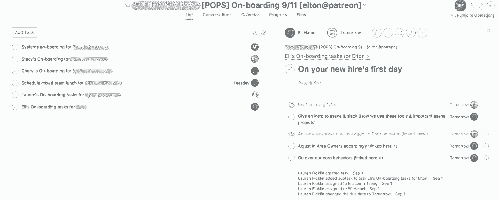

# 将员工体验放在首位的人力运营新方法

> 原文：<https://review.firstround.com/a-new-approach-to-people-ops-that-puts-employee-experience-first>

露西娅·吉洛莉 质疑一切——这是一个很难打破的习惯，她花了数年时间获得组织行为学博士学位。现在，作为帮助创作者获得报酬的会员平台 **[Patreon](http://www.patreon.com "null")** 的人事主管，她正以同样的打破传统的精神建立一个快速增长的团队，测试她所能测试的一切，试用下一代反馈工具，并重新思考为员工创造卓越体验到底意味着什么。

这就是她最终执掌一个明显非传统的人力资源组织的原因。它是一把伞，包括你可能会想到的招聘人员和人力资源专员，还有一些你可能想不到的团队:It、设施和管理。对 Guillory 来说，有一条清晰的主线——“所有这些职能都有一个基本的动机:关心我们的员工。”到目前为止，这种做法得到了回报，97%的 Patreon 员工明确表示，他们为在该公司工作感到自豪，91%的员工表示他们会告诉他们的朋友加入。

在这篇文章中，我们将称 Guillory 的方法为“整体人员运营”**，“她的部门的非典型结构只是一个开始。下面，她描述了创业公司可以用来最大化其人员和文化导向努力的三个关键策略:**

扩大人民行动的范围。

从雇佣到离职，为员工整个生命周期的需求进行规划。

创造数据驱动的决策文化。

一路上，她分享了她在斯坦福大学商学院的学术生涯中以及在雅虎担任人力资源主管期间学到的经验。。她敦促那些尚未关注人力资源运营的创业者(尤其是早期创业者)开始行动起来。现在。

# 创建一个全面的人员运营组织

Guillory 说:“我的目标是协调 Patreon 所有与员工体验相关的职能，以便我们能够支持和培养每一位员工，让他们尽可能地快乐和高效。”。“我管理的所有团队都对员工的日常体验产生影响，简化他们之间的交接和信息共享是有意义的。”

例如，一旦招聘部门聘用了新员工，他们就会被转到人力资源部门进行入职培训，包括由 IT 部门为他们配备合适的技术，以及将他们安置在最适合工厂生产效率的环境中。**在大多数公司，这些团队每天要互动很多次，但没有正式的关系**。在 Patreon，Guillory 想要改变这种情况。

当您监督人力资源、IT、设施等部门之间的交接时，协调是一项不小的任务。让每个人都呆在同一个房间里是很有挑战性的——但是 Guillory 确保她每周都这样做一次。"我们见面 30 分钟，所以这是一个很短的会议。"

尽管如此，她还是会在这半个小时里抽出时间做一些重要的事情。“我们总是关注每周的胜率。我会突出强调真正推动我们前进的东西——从事这项工作的人——以及它为什么重要。”

每隔一次会议，还会就团队为该季度选择的主题进行循环讨论。“现在我们的重点是**速度和校准**，因为我们希望迅速扩大我们的团队。我希望所有不同的功能都考虑速度，也就是说，你如何能把你现在正在做的事情提高 10 倍？以及协调，即职能之间的接触点在哪里，以及我们如何尽可能平稳地合作？”

创建一个清晰的目标感是她所在组织不同寻常的结构的主要好处之一。“我在其他公司看到过孤立的部门，例如，IT 团队对其职能的最终交付缺乏明确性，”Guillory 说。“是为了改进企业使用的技术，为企业节省最多的资金，还是为了让员工的生活更轻松？“在她权限范围内的每个以员工为中心的部门，她可以广泛地传达公司的首要目标——然后在情况需要时快速转变。

例如，两个季度前，她的组织的一个重点领域是节约成本。“工厂和 IT 部门共同努力，确定我们在哪些方面产生了最大的成本和节约机会。她说:“我们研究了如何更好地将我们的食物支出与出勤挂钩，以及当多个部门为自己购买类似资源时，重复软件实例对技术成本的影响。“现在我们觉得我们已经解决了大部分成本和冗余问题。因此，我们将注意力转向速度和一致性，为即将到来的招聘和入职热潮做准备。”

通过一前一后地实施这些计划，Guillory 的跨学科团队具备了独特的优势，能够帮助快速成长的初创企业走向成功。“我们为简化职能之间的交接所做的工作是为定制入职打下基础，”她说。“我们在某些类别中有大量需求，如网络工程、后端，所以提供一些定制服务是值得的。”

任何初创公司的领导者都知道，让一名工程师快速工作，甚至缩短一两周的加速期，都会对路线图产生巨大影响。

# 映射到员工生命周期

培养全面的员工体验意味着不仅要考虑你与员工的日常接触点，还要预见他们整个任期内不断变化的需求。

想想员工的整个生命周期，然后问自己，“这个人今天、六个月后、一年后需要具备哪些条件才能更加成功？”

Guillory 分享了她的团队在员工生命周期的每个阶段协调工作的一些策略:

*入职*

首先，记住入职并不是你与新成员的第一次接触。几周甚至几个月以来，他们一直在和招聘人员建立关系。“我们希望招聘人员在这个人转变为公司正式成员的整个过程中都在场。甚至在入职阶段之后，**我们的招聘人员会在几周之后进行检查，以了解新员工的表现**，并确保事情进展顺利。”

在那里，人事运营部负责监督每位新员工的一系列日常工作:创建电子邮件、决定他们的座位、订购合适的设备、处理文书工作、建立工资单。这是 Guillory 的跨学科团队证明特别有价值的一个领域。通过与人力资源和设施部门的密切合作，该团队的 IT 工程师 Steven Pringle 看到这些任务实现自动化的时机已经成熟

Guillory 说:“我们正在开发一个单一的表单，让所有这些任务都运转起来。”

随着她和她的团队不断优化他们用来让员工快速持续提升的工具，这看起来像是在演变。最初，人力资源主管会进入项目管理工具 [Asana](http://www.asana.com "null") 为需要发生的所有事情创建一个任务。“这是一个模板，但仍然很耗时。你必须找出所有这些信息，而不是把它们放在一个地方。”**现在，Pringle 已经简化了流程，创建了一个谷歌表单，使用后端脚本自动填充这些字段。**

当人力资源负责人完成被聘用候选人的初始表格时，Asana 会自动生成一个任务列表，其中包含 Google 日历中的所有入职活动。它为团队必须购买的技术和物资创建 [Zendesk](http://www.zendesk.com "null") 票。这也会触发给新员工和需要采取行动的内部人员的电子邮件。这通常包括该人员的招聘经理、IT、设施以及负责入职和培训的人员。这些事件告诉他们需要订购和准备什么。

你可以感觉到这在体式中是什么样子，每个相关的团队成员在右边，他们的任务在左边:

有了一开始就做出的明确决定，参与入职的每个人都可以完成他们的任务，只需要很少的电子邮件和空闲时间。“过去，我们需要等待澄清，所有这些电子邮件会在他们和人力资源部门甚至新员工之间传递，然后再决定电脑的设置。现在，这些选择是在表单阶段从明确的规格选择中做出的，因此我们可以立即着手获得合适的设备。”

此外，这种单源自动化瞄准了 Guillory 的首要目标之一:**消除信息丢失**。“当不同方面将员工的信息输入到工资单服务(在本例中为 ADP)或与招聘经理沟通时，我们会在整个团队中听到很多人说，‘这个人的经理是谁？‘这个人什么水平？’现在，我们从一个真实的单一来源——谷歌表单——获得所有这些信息，并自动填充到任何地方。"

这种入职程序本身就非常有价值，但它也对 Patreon 更广泛的文化产生了意想不到的影响，表现为更大的透明度。“我们以前的报价包括一个人的头衔，但不包括他们的工作级别。因此，当我们试图将他们放入我们的系统时，我们知道他们是软件工程师，但我们不知道他们是一级还是二级软件工程师。”结果要么是因为人力资源部门对招聘经理进行了审查，要么是基于招聘者薪资水平的猜测。

由于这个瓶颈，Patreon 的 offer letters 现在同时包含薪资和级别。“这对员工来说也很棒。Guillory 说:“他们将这种透明度带入组织，所以他们知道自己的立场。“这是开发对话的关键:‘好吧，我是 IC3 的工程师。我怎样才能成为 IC4？与“我是工程师”相反。我不知道相对于我的队友我站在哪里。"

当人们被鼓励从整体上思考问题，而不是专注于一个狭窄的部分时，你将会收获这种一致性的好处。

我们从自动化破碎的人力资源流程中获得的理解实际上有助于招聘流程，而这反过来又为员工带来了更全面、更受支持的体验。

*正在进行的约定*

除了入职，Guillory 和她的团队还不断与每个部门的核心人员(或业务合作伙伴)接触，以了解和优化员工体验。例如，在集团人力资源业务合作伙伴 [Lauren Ficklin](https://www.linkedin.com/in/lficklin/ "null") 的领导下，他们管理着一个强大的参与度、多样性和包容性计划。为了让它尽可能有影响力，他们需要数据。

去年的调查结果将 D&I 列为重中之重，这促使 Guillory 的团队创建了季度学习和培训课程以及关于该主题的沉浸式活动。从那以后，他们看到 D&I 的得分在调查中上升了 17 分，93%的组织强烈同意帕特里翁重视多元化。

为了收集尽可能多的信息，并尊重不同人对反馈的容忍度，Guillory 和她的团队利用了几种主要的反馈工具:

**年度敬业度调查:**每年，员工都会被要求完成一项调查，内容涵盖从员工对人际关系的感受到更广泛的公司目标，再到他们对日常工作的支持程度。Patreon 使用 [Culture Amp](http://www.cultureamp.com "null") 来管理调查，但是有几个服务提供这种功能。有一个为期两周的响应窗口，因此 Guillory 的团队可以快速整理这些数据，并在全体会议上向员工展示，以提供更大的透明度。

**通过****[Officevibe](https://www.officevibe.com/ "null")****:**每周一次，与 Slack 互动的 office vibe 功能 [Leo bot](https://www.officevibe.com/slack "null") 向员工发送一个快速、开放式的敬业度问题。这些签到问题来自 Officevibe 的敬业度问题库，比如“你多久收到一次工作反馈？”以及“你如何评价你与同事的关系？”**响应是匿名的，但支持回复。“我真的很喜欢阅读反馈。Guillory 说:“我经常去那里，直接回应员工。这些回复会被发送回最初的回复者，使得交换(甚至是冗长的来回交换)在员工一方完全匿名。如果觉得太多，员工可以选择不回答问题。“我们也试验了不同的节奏，似乎对那些使用它的人来说没问题，”她说。**

**脉冲调查:**介于其他两种反馈收集工具之间，这些调查(也由 Officevibes 提供支持)比全面参与度研究更短，但比每周检查更有针对性。与 Leo bot 等第三方工具不同，这种类型的调查还让公司对问题和时间有更多的控制权。Guillory 说:“**脉搏调查之所以有益，部分是因为它能够衡量组织对最近发生的重要事件或决策的反应。“大多数调查产品会问一些关于你的经理的问题，或者你对领导能力或公司发展方向的看法。但如果你想衡量更具体的目标——比如一项新推出的举措是否提高了员工士气——你就需要在内部处理这件事。”**

然而，收集反馈只是工作的一半——用有意义的行动回应它是另一半。

“如果我们发现有什么东西阻碍了某个特定部门的人取得成功，我们有责任将这一点传达给领导层，并努力解决这个问题，”她说。

对于本地化的问题，直接与有问题的团队展开对话。“例如，我们可能会对产品团队说，‘嘿，我们收到了很多反馈，说团队对 X 或 Y 可交付性感到紧张。车队对此的总体感觉如何？"

有了这些额外的信息，Guillory 和管理团队可以讨论最佳的解决方案。“我们将决定是否应该对路线图进行一些修改，或者我们是否可以做一些其他事情来支持感受到这种压力的人们。”

**要发现更广泛的组织问题，请留意数据中的任何波峰和波谷。**“特别是当我看到下跌时，我会对这是否是由可操作的事情引起的非常感兴趣，”她说。除了绝对分数之外，趋势的变化尤其能说明问题。

例如，几个月前，Patreon 的 Leo bot 调查在一个领域出现下滑:健康。“谈到健康，我们关注人们在家和在工作中的表现，”Guillory 说。“人们在调查中留下的许多评论表明，他们感到压力很大，无法锻炼身体、健康饮食，也无法专注于自己想要的自我保健。”

人民行动小组立即行动起来。“首先我在全队会议上提出了这个问题。嘿，我看到了我们整体参与度的下降。我把这归因于健康，因为尽管在其他因素上得分较高，但我们在那里的表现尤其糟糕。"那次会议之后很快就举行了小型的头脑风暴会议。"我们写下了每个人对有助于健康的资源的建议，然后我们挑选了几个来实施。"

其中最主要的是让公司的每个人都成为健身房会员(或者为那些选择加入不同健身机构的人提供补贴)。“我们还将健康检查作为每位经理角色和目标设定的一部分。“你不仅需要监督你的队友的表现和项目，你还需要定期检查他们的健康状况，”Guillory 说。做出这些改变后，我们的总体健康评分有了显著提高。"

*下车*

一名员工的离职标志着另一个收集数据的宝贵时刻，这些数据可用于优化他们和未来员工的体验。所以 Guillory 不会满足于粗略的聊天。她的采访触及了一个人在公司经历的方方面面，要求员工描述:

他们的日常工作和职责。

他们在履行职责时获得的支持和资源。

他们与经理的关系。

他们对领导力的感受。

他们对公司使命的理解。

他们对公司的体验，以及是什么促使他们做出离开的决定。

他们即将离开或正在考虑的机会，以及这一点为何如此引人注目。

Patreon 为离职员工提供了两种分享反馈的方式:更传统的面对面采访或他们可以私下完成的调查。(不管怎样，这个过程总是包括坐下来讨论一些琐碎的细节:福利、COBRA、归还办公用品。)

不过，数据分析还得等一等。“由于我们的重点是保持退出者的匿名性，我们汇总了这些数据。Guillory 说:“我们一直等到人数达到临界量，通常超过 5 人，才开始寻找人员流失的趋势。对于像 Patreon 这样流失率低的年轻公司来说，很难根据离职数据迅速采取行动；较大的公司通常有更多的东西需要分析。但保持现有员工的信任和信心是团队的重中之重。知道他们离开时不会被单独挑出来，这传递了一个重要的文化信息。

# 在全公司范围内公开人力资源运营

最后，人员运营的整体方法不仅意味着从您的团队获取数据，还意味着与所有人公开分享这些数据。你不应该只是用数据来支持你想做的事情，你需要关注数据实际讲述的故事。

人 Ops 是一门艺术，也是一门科学，科学要告知艺术

虽然许多初创公司吞噬 dau 和流失指标，但太多的公司根据突发奇想或传统做法管理员工体验。“观察，实验，测量。Guillory 说:“了解某件事是否真的有效，不要因为之前有人做过这件事而分心。"用数据来证实关键的人的政策和选择有助于组织理解和调整他们的方法."

毫无疑问，人力资源主管需要对个人感兴趣，但是全面管理员工体验也意味着理解和传播总体情况。有时，这意味着确定必要的改变，并将其传达给领导层，比如引入 Patreon 的健身房会员资格。其他时候，这意味着让员工有机会了解影响他们工作生活的数据驱动型决策。

例如，该公司最近完成了对薪酬的评估，这可能是人力资源专业人员最担心的领域。然而，当这个过程完成时，团队成员并不是简单地凭空得到一个新号码。他们还了解到该组织是如何以及为什么得出这些数字的。

“我喜欢对测试的方式和定量数据的产生非常透明，”Guillory 说。“我可以说，‘我们看了所有这些数据。我们查看了这些目标统计数据。我们让人们朝着这个方向前进，这部分人在分布中处于这个位置。采取的每一个行动都有一个量化的理由，所以队友们不能简单地接受基于我个人观点的事情。"

有效的人员管理意味着展开有意义的对话，而一个成功的人员运营领导者需要展示这种对话是什么样子的。对 Guillory 来说，学术界为如何做到这一点提供了一个模型。“因为我的背景，我更倾向于说，‘嘿，这是我的视角。这就是为什么我相信这样做是正确的。但我非常乐意听取任何人对我们应该使用的另一种方法的看法，或者你想看到的其他信息。"

# 不要把人员运营留到成长阶段

在 Patreon 目前 85 名员工的规模下，Guillory 仍然知道每个人的名字，并通过日常对话获得许多可操作的信号。但她知道情况不会永远如此。

“如果我们的规模是它的两倍，那就很难掌握所有的事情。我们将不得不更加依赖收集反馈的资源。正在构建人员功能的组织应该从使用科学方法和理解数据在其功能中的作用开始。

随着每增加一名队友，对鸟瞰图、对杠杆数据的需要，就变得更大了。

现在她已经有了自己的组织，各种团队都已成形，根据需要扩展每个领域的资源就容易多了。IT、设施、人力资源、招聘和管理团队都将不可避免地增长，但这些人去哪里、他们如何互动以及他们如何融入公司以产生最大影响将是显而易见的。现在，每个领域的小团队本质上是干细胞，可以很容易地以有组织和清晰的方式扩展。

“初创公司经常推迟将人力资源纳入其组织结构，而且推迟得太久了，”Guillory 说。有一种观念认为，当你认识十几个或两个和你一起工作的人，并且在同一个地方长时间呆在一起时，就根本不需要更正式的人力资源流程。

归根结底，依靠支持你的员工基础的职能来运行，会有参与成本、绩效成本和流失成本。一旦组织经历了这种损害，就很难再找到出路。

“我倾向于对我组织中特定团队的规模持不可知论的态度，”她说。“我认为这一功能是有机增长的，因为它与特定需求相关。因此，如果我们遇到了广泛的技术挑战，那么我会扩展它。如果我们搬进一个更大的空间，我会考虑我们是否需要扩大设施。”

整体人力运营是敏捷的，因为它不是为了跟上公司的发展而填写公开的请求，也不是不假思索地在待办事项列表上打勾。它是关于如何让一个人的工作生活富有成效和健康的最广泛的观点。正如 Guillory 所说:“这是关于环境的。将多个团队归入人力运营部门，或者在运营时考虑员工生命周期——这一切都是为了获得做出以员工为先的选择所必需的背景。”