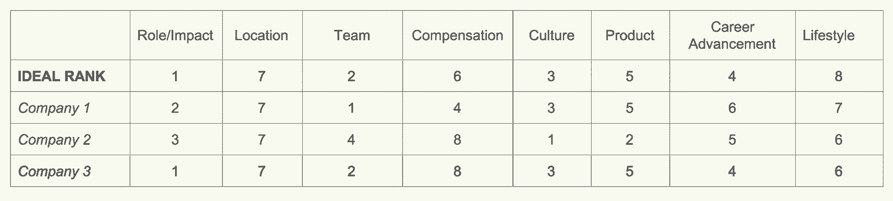

# 创业公司和求职者赢得人才大战的入门指南

> 原文：<https://review.firstround.com/a-primer-for-startups-and-job-seekers-to-both-win-the-talent-war>

Tammy Han 从一个非常独特的视角来看待科技生态系统。她几乎把醒着的每一个小时(包括她真正应该睡觉的时间)都花在了与希望招聘的初创公司创始人和希望——或者在大多数情况下实际上没有——被聘用的候选人打交道上。她在[第一轮](http://careers.firstround.com/ "null")人才团队中的角色是在一个只能用火热来形容的市场中为优秀人才和合适的公司牵线搭桥。她还观察到了更广泛的行业趋势，以及这种狂热心态在过去几年中造成的许多错误。

塔米说:“第一轮公司最近的[创业状态](http://stateofstartups.firstround.com "null")报告中的一个发现是，雇佣合适的人是创始人最关心的事情。招聘，尤其是早期招聘，可以成就一家创业公司，也可以毁掉它。但是，随着过去几年获得资金变得越来越容易，获得顶级人才的能力只会越来越难。竞争非常激烈，硅谷越来越奢侈的文化在创始人和候选人之间培养了过高的期望。

在这次独家采访中，Tammy 讲述了塑造招聘格局的三个不明显但影响巨大的挑战。凭借对招聘等式两边的洞察，她分享了一些建议，帮助求职者和公司着眼于奖励:做好工作。

# 挑战 1:从资金激增的连锁反应中幸存下来

塔米说:“泡沫式的融资环境并不局限于那些提供资本或接受资本的人——它的症状也蔓延到了普通大众。”。“在膨胀的估值(尽管有些已经被调低)、筹集了巨额资金的初创公司，以及对惊人的巨额融资公告的选择性记忆之间，候选人正在以错误的价值评估公司，并以错误的理由被某些公司吸引。”

候选人经常会问她一家公司的最新估值是多少，它是否有成为独角兽的潜力，它是否在 TechCrunch 上获得了大量报道，它的下一轮融资前景如何，它的大牌投资者是谁，等等。

塔米说，虽然一家公司筹集资金的能力和其中一些因素是决策的良好支持证据，但它们不是你开始找工作时关注的正确指标。它们很大程度上是一个投资过程的表面装饰，促进了不应有的炒作。结果，求职者选择公司的理由是错误的——这些理由对于雇佣他们的人来说是适得其反的。

# 求职者应该做些什么

现在，求职者比以往任何时候都更需要清楚地知道自己想要什么。闪亮的物体比比皆是，分散注意力。在这里，Tammy 分享了几个要点，可以帮助他们找到正确的角色，从长远来看，这将有助于他们的职业生涯。

**1。当心品牌偏见。**

绝大多数求职者都想在众所周知的火箭船上谋得一个职位——塔米估计，70%的人都在寻找像优步、沃比·帕克、斯莱克、斯特雷特等明星。毕竟，告诉你的家人你在一家他们听说过的公司找到了一份工作，这似乎特别有吸引力。

但在评估创业公司时，这种策略往往适得其反。“我们发现，大多数拥有最有成就感的职业的人都是那些出于正确的原因在未经证实的初创企业中冒险的人。塔米说:“他们加入该公司是为了获得快速成长、学习和拓展经验的机会，尽管它没有十亿美元的独角兽估值，也没有七位数的薪水。”。

当然，这并不总是一个容易的选择。押注一家新兴公司会有一定的风险。"**加入赢家比挑选他们容易**。但是为最优秀的人保留的机会是那些让他们挑选他们最关心的东西的机会——这通常是[机会、技能和激情的某种结合](https://www.linkedin.com/pulse/optimize-passionskillopportunity-fit-sachin-rekhi "null")

当然，创业公司并不适合所有人，加入大公司还有其他优势。无论你走哪条路，一定要权衡初创公司和成熟公司的利弊:你可能的任期、剩余股权、你将合作的团队以及潜在的发展机会。“人们忘记了优步曾经是一个家喻户晓的名字，”她补充道。

**2。现实地扩展你的搜索。**

或许最重要的建议是，一开始就不要过分关注任何一家公司。“很多求职者会想，‘我想成为一名创始工程师，或者成为隐形的面向消费者的初创公司的前 10 名员工，做一些使命驱动的事情，’”塔米说。然而，如果你的搜索范围太窄太快，你可能会错过你甚至不知道存在的机会。

“永远不要拒绝没有给你的工作。”

根据你已经接触过的东西来偏向你的求职是一种自然的趋势。相反，把它当作一个机会，去了解更多你觉得最满意的事情。你对最佳机会的理解会随着你参加的每一次会议而发展。“这是一个累积的过程，当你采取探索性的方法时，你会学到很多东西。”

不过，这并不是说你应该参加所有的会议。包括太多潜在客户的求职——比如说 20 家公司——可能会特别低效和累人。为了确保你已经充分探索了所有的选择，Tammy 建议从 5 到 10 家公司开始，并真正专注于你最感兴趣的三家公司。正如她鼓励创始人为每一次招聘创建理想的候选人档案一样，她建议求职者创建理想的机会档案来指导他们的求职。同样，这个想法不是要创建一个具体公司或确切名称的清单。

Tammy 建议问自己以下问题

我想加入什么样的公司？

那家公司今天是什么样子的(舞台、创始、领导团队)？

那家公司有什么合适的机会适合我目前的技能和经验？

我能立即给公司带来什么价值？

什么能让我以某种方式成长？

“这会让你在谈话中更有条理，更有策略，”她说。“不要只是为了参加会议和面试而参加会议和面试——那是在浪费每个人的时间。”

最重要的是，她建议求职者关注自己的技能，并找到发展这些技能的最佳环境。例如，如果有人真的需要成为公司的一部分，那么他可能希望加入一家早期公司，接触从种子阶段到首轮融资以及更高阶段的成长所带来的各种挑战。最好的情况是利用候选人以前的经验，让他们帮助新公司加速成功，同时提供应对正确挑战的实践机会。

**3。永远不要吝啬你的研究。**

一旦你确定了你的优先事项，是时候做你的研究了。这不仅仅意味着搜索 AngelList 和 TechCrunch，这可能导致候选人错误地将最大、最耀眼的数字与“最好”的公司等同起来。

“一个资本过剩的公司不会成为一个有前途的公司，除非它在银行里有 6 个月的现金。”

塔米说:“从现有早期创业公司的招聘角度来看，这种误解是不幸的，这些公司为他们的阶段筹集了传统规模的融资，估值也是‘正常’的，因为候选人在不了解实际情况的情况下盲目地努力。”“他们往往会被那些在没有真正考虑烧钱速度或手头现金的情况下就筹集了大量资金的公司所吸引。”

谈到研究秘密创业公司的机会，她建议首先追踪与公司有关系的人——可以是现任员工、顾问，或者有关系的天使投资人或风险投资人。

“某些风投以企业投资闻名，其他的以电子商务闻名，还有一些以生命科学闻名，”她说。“如果那些顶级风投已经投资了一家在他们特定领域有专长的公司，这是一个很好的信号，表明它的长期轨迹或成功的可能性——当然，这并不能保证。即使是最好的投资者，通常也至少有 50%的时候是错误的。”

最后，假设你已经做了调查，不要害怕在面试过程中提问。保持他们的开放性。如果你打算报名参加一个为期四年的项目，你的面试官应该能轻松回答一些棘手的问题。以下是塔米鼓励问的一些问题:

在这里工作你最喜欢的是什么？(一瞥公司文化)

你打算如何发展这个团队/角色？

你能告诉我更多关于我将共事的团队的信息吗？

是什么让领导团队如此与众不同？

你能告诉我你在 2016 年的成长计划吗(对公司，对这个角色，对这个团队)？

你回复候选人后续步骤的时间表是什么？

# 试图招聘的公司应该做的是

对于创始人来说，挑战在于剔除那些寻找你无法(或不愿)提供的东西的候选人——并且在你浪费大量时间之前就这么做。塔米给那些在这种环境下招聘的人的建议可以归结为一条关键的指导方针:直接，宜早不宜迟。

**1。对你正在面试的候选人要勤奋。**

打造你想要的团队，没有捷径可走。你需要投入至少 50%(如果不是更多的话)的时间进行面试和招聘，或者如果不可能的话，雇佣一些全职工作的人，直到你有了合适的核心团队。从挖掘你的一级和二级人际网络开始。一旦你挖到了那口井，在你的网站上放一个工作页面来吸引人们的兴趣，或者创建一个关于工作的 AngelList 档案。

抽出时间为你的每一位关键路径雇员建立目标档案，并通过深思熟虑的电子邮件发出去。理想的个人资料会随着你遇到更多的候选人而发展，但是从一些必备的东西开始。确保你现在就能最大限度地利用与你需求相关的候选人的时间，而不是以后。不要随便见任何表示有兴趣在你的公司工作的人，或者想“进入一家初创公司”的人。对一杯有抱负的人才的咖啡的每一个“是”，都是对一次与潜在雇员的会面的一个“不”。

“让招聘成为一种合格的行为，而不是不合格的行为。”

创始人在对候选人进行资格审查时，也应该避免品牌偏见。无意冒犯任何在顶级计算机科学机构获得 CS 学位的人，或者是大公司的工程师，但是血统并不意味着他们是优秀的候选人。[还有其他一些特质被证明是优秀员工的标志](http://firstround.com/review/hire-a-top-performer-every-time-with-these-interview-questions/ "null")。如果你与更可能适合你的团队的候选人接触，你会看到更多的机会被接受。

**2。想知道候选人的动机吗？直接问。**

有时最普通的问题可能最能揭示问题，她支持简单地要求候选人描述他们理想的机会。

“你希望进入初创公司的人会说，‘哦，我正在寻找一个机会，作为一家公司的早期工程雇员，在那里我可以与一位伟大的首席技术官一起学习和成长，然后帮助建立一个我引以为豪的工程团队。’你不会想听到，“哦，是的。我可以进来担任工程副总裁，因为我在以前的职位中担任过工程副总裁/总监，任何低于这个职位的职位都是一种退步。那就是 ***只有*** 类型的题目我才会拿。这些人不适合早期阶段，因为他们不够灵活。他们不是团队成员。"

你只想雇佣那些出于正当理由愿意为你工作的人。当然，会有拒绝。但是不要被前五个或前十个说不的人所困扰——他们可能不适合你的公司。她回忆起一家名为 Pinterest 的小公司的早期招聘，这家公司的第一批工作机会被拒绝了。“你知道那些人现在很后悔，但他们可能太专注于金钱和头衔，而没有利用好这个大好机会。”耐心总是要付出代价的。

**3。不要害怕提前谈钱。**

只要你直截了当，塔米建议在招聘过程中尽早进行薪酬对话。如果有人的动机主要是金钱，你会尽早发现这一点，为自己节省时间。“事实上，很多创业公司都在说，他们不再谈判了。因为如果有人在谈判中非常强势，你就知道他们的动机不适合你，”她说。

在今天的市场上，早期创业公司面试来自谷歌和脸书这样的大公司的人并不罕见——这些候选人可能收入不菲，享受着丰厚的头衔和工作场所的便利设施。塔米说:“你不应该仅凭简历就做出草率的判断和取消资格，也不应该让自己被他们最近在大公司的经历吓倒。”“如果你退后一步，不再竞争，那是你需要解决的另一个问题。”

你也要清楚地了解候选人的风险状况，明确提问，不要做任何假设。候选人是否有抵押贷款和私立学校的孩子，这表明他想要更多的现金而不是股权？没办法知道。也许他之前的退出给了他更多的空间来承受风险？“不要以貌取人，要非常小心。明确表示:“嘿，在我们进入首轮之前，我们给每个人支付的薪水都低于市场水平。你同意吗？”塔米说:“如果这是一个失败的开始，我们就不应该前进。

Tammy Han at First Round in San Francisco.

# 挑战 2:太多的人收到了太多的邀请

随着越来越多的创业公司出现在舞台上，候选人不缺工作机会。“现在的招聘市场非常混乱。随着人们争夺人才，所有这些增加的融资轮次和估值都导致了薪酬方案的膨胀。每个人都试图用奇怪的策略和古怪的薪水招募最优秀的人。塔米说:“这正变成一场恶性竞价战。

这有很大的潜在负面影响:候选人可能会偏离他们开始寻找的角色，缺乏资金的早期初创公司可能会担心自己根本无法竞争。

# 求职者的解决方案

潮水般的工作机会让头脑冷静地选择合适的职位变得更加困难。“这是选择的悖论。塔米说:“你基本上是在让自己被冷冻。”。她对求职者的建议？试着过滤掉噪音，回到基础。

**1。忽略额外津贴。**

首先，塔米建议求职者(和初创公司)不要与硅谷的福利死亡竞赛同流合污。仅仅因为你的同事在提供办公室狗美容和无限量康普茶的地方工作，并不意味着你也应该这样做。它不仅会让你远离最令人满意的技能培养机会——当市场自我修正时(它会的),那些好的拥有者很可能是第一个被砧板上的肉。

额外津贴也掩盖了创业公司中非常真实的——而且往往是令人筋疲力尽的——工作。那个上午 11 点上班的工程师？她熬夜到凌晨 4 点发布代码，将你的应用升级到新的 Rails 4.2.5 版本！产品经理在啤酒店聊天？他们正从准备推出新功能的状态中放松下来。

塔米说:“由于流行文化对创业‘现实’的浪漫主义，一些新人有这样一种误解，认为创业都是娱乐和游戏，不需要努力。”。“事实并非如此。最终，困难的问题正在得到解决。”额外津贴可以很好地反映一家公司的文化，也是创始人争夺人才的一种方式。但它们不会影响你在那家公司的职业经历。

同样，寻求招聘的创始人也不应该刻意去炫耀额外津贴。相反，相信合适的人会因为合适的原因找到你。“我最近和一位候选人共事过，他是一位 10 倍经验的工程师和创业老手，收到了 9 份工作邀请，”Tammy 说。“他的最高出价是 20 万美元左右，有高级职称，在一家老牌初创公司工作。他最终获得了 9 万美元的首席工程师职位和 8 号工程师的重要股权，因为他对空间的热情、领导团队的力量、文化以及对更多股权的兴趣。”

**2。关注你的决策矩阵。**

相反，当求职者面临多重邀请时，Tammy 鼓励他们使用决策矩阵(见下图)。首先，在八栏中列出所有对你的新工作重要的属性，并遵循以下步骤:

1.在你开始寻找工作之前，想想这些特质在你的理想工作中会有怎样的体现。对你来说什么最重要？也许是产品，也许是团队，也许是领导，也许是优势。不管是什么，给这些属性分配 1-8 的等级。现在你知道你最想要什么了。

2.当你开始更多地了解不同公司的角色时，为每个公司创建行。这些机会让你兴奋的是什么？用数字 1-8 为你所定义的每个属性排列每个公司或职位的最佳方面。也许这种补偿是最好的事情，或者是它能让你拥有的生活方式。十有八九，你对某项工作感兴趣的地方会与你理想工作中的配置不同。

3.现在你可以清楚地看到每个机会与你的期望被篡改之前的理想角色相比如何，以及你在哪里真正抓住了你的个人价值。你在哪里看到最多的比赛？当你在一个决定中权衡许多不同的因素时，这是一个清楚的方法来看看现实世界的角色与你理想工作中的优先事项有多接近。

权衡报价是情绪化的，你得到的越多，它们就越模糊。“这就像在糖果店，所有的糖果看起来都一样。塔米说:“他们都在旧金山担任相同的角色，致力于解决大规模的难题。“在面试过程中形成的纽带，甚至是提供工作的方式，都会分散求职者对她最初想要寻找的东西的注意力。”

在将候选人重新定向到他们最初的标准后，她发现大多数人最终接受了与他们最初的优先考虑密切相关的工作。这个过程的开始是你可能最诚实地说出你在下一次机会中想要什么的时候。

陷入决策瘫痪的候选人往往害怕做出糟糕的选择。但是她敦促他们仔细地重新定义这个词，因为根据她的经验，“坏”并不总是“错误的”

“大多数创业公司都会失败。但你会从大多数在早期公司工作过的人那里听到的信息是，他们在那里学到的东西和获得的机会，远远超过他们在后期公司获得的经验，”塔米说。因此，尽管候选人可能会认为，加入一家后来失败的初创公司是一个错误的举动，但事实上，这对他们职业生涯的那个阶段非常重要。

**3。记住，诚实实际上是最好的策略。**

你正在积极找工作。你在和很多人说话。没关系——事实上，这是假设。所以，当公司问你在面试谁，或者你在面试过程中处于什么阶段时，要坦诚。

“山谷虽小。人们议论纷纷。招聘人员说。创始人说话。”

“如果你不接受这份工作，你很可能会在路上遇到你面试过的创始人，”她说。如果你接受了这份工作，你已经处于一段长期关系的早期阶段。所以，和所有的关系一样，保持透明。**“作为候选人，如果一位创始人在向你介绍他们的公司时撒了谎，你会作何感想？”**

对你的期望也要坦诚。你可能会发现，你不想提起的尴尬话题实际上促成了富有成效的对话。“你可能会说，‘嘿，你把我当成了一名资深个人撰稿人。我认为作为一名工程经理，我增加了更多的价值。“我有很好的人员管理技能，”塔米说。“他们可能不知道这一点，而你现在给了公司一个将这一点融入角色的机会。”无论你在你的过程中处于什么位置，坦诚是你建立稳固关系的最佳选择——无论是和你加入的公司还是不加入的公司。

# 公司招聘的解决方案

如果你是负责招聘的人，至少可以说，一想到最优秀的候选人收到了五份或十份工作邀请，你就很紧张。尽管如此，一点冷静——以及一套清晰的招聘和薪酬框架——将大大有助于你做好准备，应对任何大卫和歌利亚的招聘对决。

**1。不要放弃你的过程。永远不会。**

没有必要对受限的人才市场感到恐慌——事实上，那会适得其反。塔米说:“首先，因为这是一个人才竞争非常激烈的领域，你应该反应迅速，并运行一个真正的过程。”

通过纯粹的速度击败人群是很有诱惑力的，但塔米告诫人们不要“雇得快，炒得快”的心态。“这有损你公司的士气，因为现在的员工会想，‘为什么你不通过其他人都通过的严格筛选就聘用这个人？’她说:“不要放弃你的过程。请记住，一个强大的 10 倍工程师也在寻找一个严格的面试过程。忽略这些可能意味着你的公司不合适。用面试其他人的方式来评估他们。他们会更加欣赏和尊重你，而且他们也会通过这个过程对公司有更多的了解。"

在面试过程中，[注重培养积极的求职经历](http://firstround.com/review/this-is-how-coursera-competes-against-google-and-facebook-for-the-best-talent/ "null")。那不能被高估。如果你发现你在这个过程中失去了很多候选人，花时间评估一下为什么，以及他们在这个过程中失去了什么。“面试过程中的每一个时刻——从你给候选人发电子邮件的那一刻，到第一次现场面试，再到提供服务——如果你想赢，就需要高度协调和高度有意。”

**2。关注报价的交付和时机。**

要约交付绝不是这个过程的一次性结论，也不应该被忽视。当谈到这最后一步时，即使是最有条理的求职者也会情绪激动。“他们会永远记得你给他们的感觉，”塔米说。“我们看到很多创始人在这个过程中拖拖拉拉，这让他们付出了代价。”

她回忆起最近的一个例子，一位高管接受了较低的薪水，去了一家自己觉得合适的公司。“他很欣赏这个提议。这位创始人实际上带他出去吃了顿饭，解释了公司和机会，股权部分，真的让他觉得自己是某个东西的一部分。”

成功引导候选人做出最终决定时的情绪的一部分是理解是否/何时发出邀请。**在招聘和销售行业，“时间会扼杀所有交易”是众所周知的事实如果你 99%确定候选人会接受，不要犹豫，成为第一个被录用的人。但是，如果你不是，如果候选人仍然处于他的过程的开始，一个小策略是关键。**

工程师尤其倾向于有条不紊，他们不太可能在第一周就放弃精心计划的搜索。当你面试的时候，试着从候选人那里获得尽可能多的信息，比如他们在面试谁，他们在面试过程中处于什么位置——然后保持联系，这样你就不会失去动力。“按照候选人的速度前进。不要强迫一个工程师，或者任何人，放弃他们自己的过程。塔米说:“不要强迫人们接受爆炸式的报价，因为那通常会导致失败。”

# 挑战 3:非常不切实际的期望

随着公司获得更多的钱，不可避免地会有很多钱流向人才招聘战。结果呢？

“简单来说，很多候选人期望一百万美元和一匹小马。”

硅谷媒体，甚至最近的一系列电影和电视节目，都倾向于描绘创业公司值得庆祝的一面。他们不一定表现出来的是背后所有的辛苦。

# 候选人如何控制它

薪水和职位无疑是求职时要考虑的重要因素。但更重要的是找到一个能让你获得长期职业成功的角色。在这里，Tammy 分享了她的建议，让你在寻找的过程中保持理智。

**1。不要假设任何事情。去找事实。**

“任何有创业经验的人——尤其是工程师，尤其是任何在品牌初创公司工作的人——都会被招聘人员四处搜罗。这可能会让人们对自己的市场价值有一种夸大的感觉，”她说。她的建议是不要放弃所有的薪水期望，而只是更现实一点。“市场现在很疯狂，但当它自我修正时，人们会意识到，‘嘿，那个离开开发训练营一年的工程师可能不值 14 万美元。’说到底，那还是个初级工程师。"

要设定更现实的期望，首先要诚实地看待你在财务上能接受的东西。你实际上需要什么？然后花些时间来确定你的真实市场价值。

塔米说:“要明确的是:候选人永远不应该满足于远远低于他们的价值，但他们应该满足于他们的价值。没有单一的研究市场薪酬的好资源，但是尽你所能了解你所在行业的平均水平:AngelList 是一个很好的起点，事实上 [Glassdoor](http://www.glassdoor.com "null") 可以提供帮助。(只要记住这些资源都不确切，都是靠自报数据。)[在这个开源项目](https://github.com/jlevy/og-equity-compensation#basic-equity-concepts "null")中还有其他有益的补偿资源推荐。

调查朋友也很自然，但要小心:“许多人没有意识到，当有人说‘我赚了 20 万’时，这是 12 万美元的现金基础，其余的是 rsu，不会立即支付。这是既定的，有一定的悬崖日期，这一切都取决于公司的实际表现。人们没有意识到这些薪酬方案中有很多可变因素。”在你的市场调查中包括这种轶事报道之前，一定要获得并理解所有的细节。

当然，人们很容易会想，“如果公司抛出丰厚的薪酬，为什么*我不会*最大化工资和股权？”塔米指出，问题在于，远高于市场水平的薪酬反映了公司内部更深层次的问题。

“如果一家公司给你的薪水过高，这是一个危险信号，因为这反映了他们的商业头脑。”

“你可能有很好的背景，你可能会增加很多价值，但这不是一个以精益方式深思熟虑地发展公司的可扩展解决方案，”她说。

此外，要在早期环境中取得成功，薪酬不能成为你寻找的重点。你必须在其中寻找无形的东西:即影响力、成长和所有权。“这些初创公司都是预盈利、预上市的。她说:“如果你要求过高的薪水，你可能对一家初创公司抱有错误的想法。“如果是这样的话，肯定会有处于后期阶段的公司等着你。如果头衔和薪酬对你来说很重要，你或许应该去脸书或谷歌。”

**2。避免成为这些原型之一。**

Tammy 发现不切实际的期望在创业招聘中经常发生，她确定了三种类型的候选人——招聘经理希望避免的类型，求职者希望避免成为的类型:

**头衔夸张的初级工程师:**作为之前初创公司的首批工程师之一，这位工程师一开始就获得了“工程主管”的头衔。几年后，除了“工程主管”之外，没有别的地方可去。现在，只有五年经验的候选人正在寻找副总裁甚至首席技术官的头衔(以及相应的股权)，但实际上，应该是高级/首席工程师。“一个五人公司的副总裁与管理和领导一个两百人的工程团队是不一样的，”塔米说。

**新进的 MBA:** 这位候选人之前在投资银行或咨询公司担任副总裁，薪水非常高。现在，他希望从学校一毕业就能成为“业务发展副总裁”或“业务运营副总裁”——尽管他不具备创业所需的技能。“非技术型 MBA 通常没有从零开始建立业务发展职能的直接操作经验。或者，他们想成为产品负责人，尽管他们以前从未在科技公司制造过产品，”她说。“这就是为什么初创企业的创始人看到 MBA 时往往会退避三舍。当然这并不适用于所有人。我已经租了我应得的一份。尽管一般来说，对于一名新 MBA 来说，最好的做法是瞄准那些真正需要它们、并能给它们带来一些可信度的老牌科技公司。无论如何，确保你知道如何正确传达你的经历。”

与 MBA 一样，这位候选人来自顶级银行或四大公司的高薪职位。在那里成功运营后，她认为向创业公司的转移会很容易，因为她已经看到其他正在恢复的金融专业人士迈出了这一步。但她没有意识到的是，是的，她将不得不关闭账簿，处理可以外包给更大组织的会计细节。与对新 MBA 的建议类似，我会鼓励这位候选人加入一家处于后期阶段的科技公司，在那里他们可以向一位久经考验的金融领袖学习，学习工具和流程，几年后，再去一家处于早期阶段的公司。

**各行各业的精英:**这些候选人是拥有丰富经验的多面手，但在某个特定的职能领域缺乏深度。他们在短期内是有效的，因为他们有很好的解决问题的技能，当资本有限时，早期创业公司可以从中获得很多。但公司很少对它们有长期规划。他们最终会被雇佣或提前离职。一个领域的深度很重要，所以选择一个并建立一个记录。

如果你有任何可能落入其中的一个桶，准备一个在面试中有机运作的叙述来解决这个假设。如果你知道人们可能有的先入为主的观念，你可以更好地塑造你的形象。

**3。不要去购物。**

一旦你有了一个或几个工作机会，小心行事。这不是一个试图利用要约 A 来提高要约 b 的机会。塔米回到了现在应该很熟悉的一句话:“人们会说话。”

这一举措可能会让你考虑的公司受到影响，不值得冒这个险。更不用说，不管你选择哪个雇主，它都可能让你出师不利。“如果你在另一边，一家公司在想，‘哦，让我看看我能给你的最便宜的价格’，你会有什么感觉？”

# 试图招聘的公司应该做什么

面对猖獗的薪资上涨，以及招聘经理叫嚣着简单地获得职位，创始人可能会禁不住诱惑，屈服于候选人不切实际的期望。但这最终对任何参与者都没有好处，塔米解释了如何以及为什么要成功地反击。

**1。支付有竞争力的市场价格，但不要感到有压力去做更多。**

她建议，做到这一点的最好方法是，在你开始谈判之前，为自己制定明确的薪酬规则。她喜欢莫莉·格雷厄姆的[反直觉薪酬框架](http://firstround.com/review/A-Counterintuitive-System-for-Startup-Compensation/ "null")，但最重要的是你有一个。“作为一名商业领袖，你需要把它变成你可以自信地谈论的话题。确保在考虑运营费用时，一切都是匹配的。”

虽然你不想支付高得离谱的薪水，但你也不想压低任何人的工资。员工们议论纷纷，现在制定武断、不一致的薪酬会让你以后头疼。种子期的工资数据可能特别难以获得，但你的风投可以成为最新市场信息的重要来源。塔米说:“如果你要向一位候选人出价，就要让你的投资者加入进来，以确保你在合适的范围内。”

如果你根本无法满足你渴望得到的候选人的期望，你也可以考虑一些创造性的薪酬策略(不要承诺你付不起的薪水)。“我见过这样的情况，一家公司只能向一名候选人支付 10 万美元，而他的竞争报价为 15 万美元，他们做了两件事之一:一是他们将支付他们能够支付的 10 万美元，外加签约奖金，这是一次性的事情，但会让他们更接近竞争报价。或者他们会说，‘这是原则。作为一家公司，我们都拿着低于市场水平的薪水。我们的投资组合中有一家公司付给每个人 10 万美元。一旦他们提高他们的 A 轮或达到某个里程碑，每个人都将得到纠正回到市场利率。"

**2。教育候选人他们将得到什么。**

股权往往是早期公司提供的特别有意义的元素，但许多人仍然不理解初创公司的薪酬。“对于加入一家初创公司来说，股权是非常重要的一部分。塔米说:“这是一个应该深入解释的问题。"[马克斯·希雷森论股权授予](http://maxschireson.com/2011/08/23/startup-stock-options-explained/ "null")和安迪·拉赫勒夫的[授予股权的正确方式](http://firstround.com/review/The-Right-Way-to-Grant-Equity-to-Your-Employees/ "null")都是这方面的好读物。"不要仅仅告诉候选人你会给他们多少股份，还要告诉他们代表了多大份额；解释未清总额。这种清晰性可能会决定是否成为最佳候选人。

**3。拒绝降低你的标准。**

人才争夺战中出现的另一个现象是，人们倾向于故意雇佣不太合格的候选人，只是为了获得机会。如果你是一家初创企业，事情可能会以极快的速度发展。要成长，你需要人——而在这个市场上，雇佣合适的人可能需要太长时间。“这对任何人都没有好处，”塔米说。“现有的高质量人才会非常沮丧，并质疑为什么他们周围有表现不佳或质量较低的人。”

这种危险的趋势还表现为，原本优秀的雇员获得了极度膨胀的头衔。“例如，我们看到基本上是初级招聘人员的人成为人才职位的负责人，很大程度上是因为他们有一个工程师会回应的头衔。对于真正获得头衔的人来说，这种通胀会让头衔的价值最小化。”

当然，在整个精心设计的过程中，最好的情况是让公司和候选人都觉得他们得到了他们应得的和值得的。上面列举的所有这些趋势都阻碍了这一最终崇高目标的实现。塔米的工作就是打破这些障碍，回到这个更鼓舞人心的目标上来。有了这个建议，无论你发现自己在等式的哪一边，你都可以这样做。

# 总结一下:

在招聘方面，应聘者和公司都面临着三大挑战。但是这个等式两边的解是不一样的。以下是雇主和求职者在寻找最适合自己的职位时应该考虑的问题:

# 求职者:

**当心名牌偏见:**不要被眼花缭乱的工作搞砸了。

**现实地衡量你的搜索:**寻找足够多的机会，找到合适的机会。

不要在研究上吝啬:不要从你需要做决定的数据中欺骗自己。

忽略额外津贴:避免分心，坚持你在一个角色中真正想要的。

**依靠你的决策矩阵:**看看机会与你的价值观有多匹配。

**诚实:**你只会从坦诚地讲述你的过程中获得尊重。

**去事实调查:**了解自己真正的市场价值。不要猜测。

避免负面原型:不要被贴上不切实际的期望的标签。

**不要去要约购物:**人家说闲话。这件事会传开的。

# 希望招聘的创始人:

勤奋:投入时间和精力去获得最好的结果。没有捷径可走。

直接询问候选人的动机:不要害羞。他们应该有答案。

提前谈钱:这将是你最有用的过滤器之一。

永远不要放弃你的过程:例外会导致错误。

关注报价的交付和时机:牢记时间会扼杀所有交易。

**薪酬有竞争力，顶住压力:**这才是你真正找到合适雇员的方法。

**教育考生:**不要让他们盲目地接受或拒绝一个包裹。

拒绝降低你的标准:你会很高兴你没有这么做。