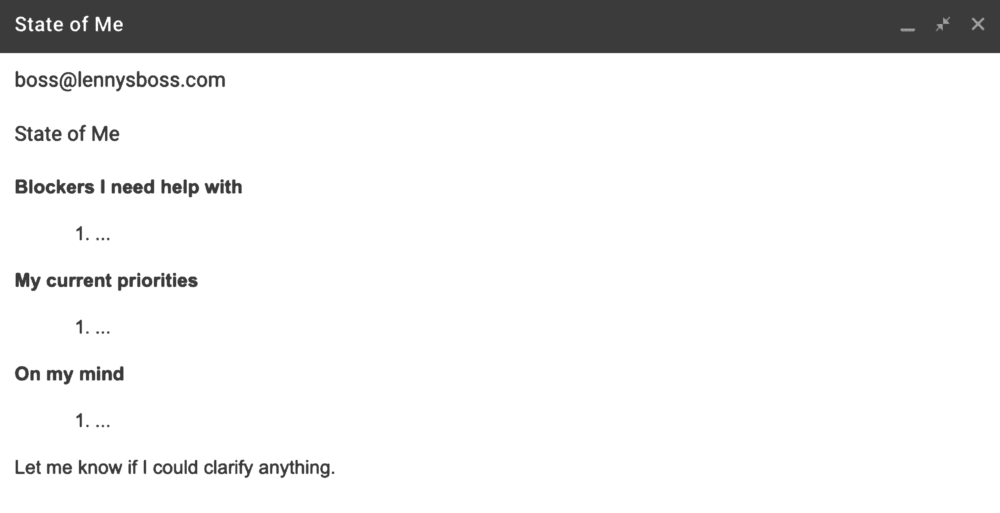
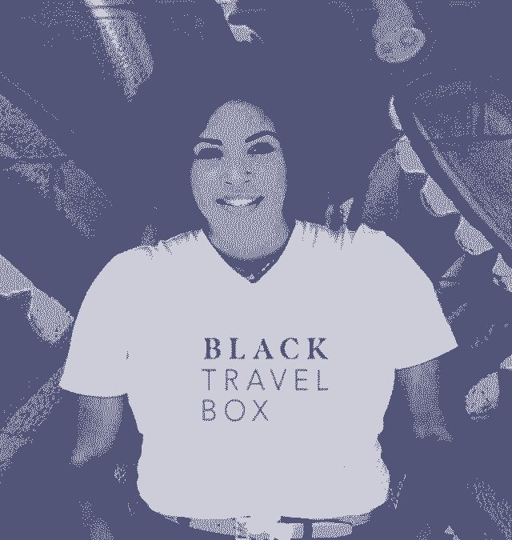

# 向上管理的战术指南:来自我们认识的最聪明的人的 30 个建议

> 原文：<https://review.firstround.com/a-tactical-guide-to-managing-up-30-tips-from-the-smartest-people-we-know>

有一句经常被重复的话:“人们不会辞掉一份工作，而是辞掉一个老板。”当然，如果你想走经理这条路，关键是要成为一个值得信任的船长，以留住顶级船员。但是，当这些配对出现问题时，把所有责任都推给糟糕的老板也是一种过于简单化的做法——这种做法剥夺了员工的能动性。

就像任何关系一样，经理和他们的下属之间的关系是双向的，在创业过程中导航这条崎岖不平的道路的任务落在了双方身上。有些经理会让你一见如故，进入一种轻松的节奏，就好像你们已经共事多年。其他双人组合可能看起来像是你试图将两块排斥的磁铁合在一起。但更有可能的是，你和老板的关系介于这两个极端之间。

无论[是你的第一个直接下属](https://firstround.com/review/our-6-must-reads-for-first-time-managers-to-hit-the-ground-running/ "https://firstround.com/review/our-6-must-reads-for-first-time-managers-to-hit-the-ground-running/")还是你是一名[经验丰富的领导者，希望提高自己的技能](https://firstround.com/review/6-counterintuitive-rules-for-being-a-better-manager-advice-from-lambda-school-quip-and-facebook/ "https://firstround.com/review/6-counterintuitive-rules-for-being-a-better-manager-advice-from-lambda-school-quip-and-facebook/")，对于管理者来说，有很多建议可供参考。但是当焦点转移到那些被管理的人身上时，许多具体的战术和策略就变得不那么详细了。虽然众所周知，与你的经理建立良好的关系需要努力——即使你们彼此之间如鱼得水——但如何做到这一点的方法往往并不奏效。

这在一定程度上是因为向上管理是一个相当模糊的类别，包括从发展融洽关系和信任、决策、沟通风格、冲突管理和与上级设定目标在内的一切。为了进一步勾勒出向上管理的注意事项，我们在过去几周联系了一些我们认识的最敏锐的人，询问他们对这个重要问题的看法:

## 你最好的向上管理技巧是什么？

我们特别关注可以立即应用的借贷策略。我们从这些经验丰富的初创企业领导者那里得到的反馈，开启了一个鲜有开启的知识宝库。有些建议侧重于最有效、最一致地沟通的模板，而另一些则来自经验丰富的经理，他们有大量的例子来说明他们希望更多的直接下属会做些什么。你可能不同意每一条建议，但我们保证你会发现至少有几条是你乐意尝试的。

无论你是加入一个全新的团队，希望与新经理建立良好的合作关系，还是希望与老板建立更好的工作关系，前面都有很多低层次的策略来有效管理。我们将这个庞大的列表分为七个类别，点击下面的链接浏览每个部分。

[把你的假设留在门口](#leave-your-assumptions-at-the-door "null")

[磨练你的表达能力，让你的交流清晰响亮。](#hone-your-delivery-for-communication-that-comes-through-loud-and-clear "null")

[提高你的问题被回答“是”的几率](#boost-your-chances-of-hearing-yes-to-your-ask "null")

[对反馈感到满意(在桌子两边)](#get-comfortable-with-feedback-on-both-sides-of-the-table "null")

[为你的 1:1](#set-the-tone-in-your-11s "null")定下基调

[以正确的方式分享你的影响力](#share-your-impact-the-right-way "null")

[建立持久的融洽关系和信任](#build-lasting-rapport-and-trust "null")

我们希望这能为你整理自己的管理行动手册提供一个详细的路线图。让我们开始吧。

# 把你的假设留在门口。

前平台高级总监 **[瓦伦·斯里尼瓦桑](https://www.linkedin.com/in/varunsrinivasan/ "https://www.linkedin.com/in/varunsrinivasan/")** 说:“人们管理不善的最大原因是因为他们实际上并不了解他们老板的工作——但几乎总是认为他们了解。“建立背景很难，因为你只能看到你的经理所做工作的一小部分，管理层级的每一步都会带来不同的问题，”他说。

承认这种不可避免的分歧是你积极弥补经理和下属之间存在的差距的第一步。这里有一些策略可以做到这一点:

## 1.在这两个问题上始终保持一致。

Julie Zhuo, Co-Founder, Inspirit

两次评审主题 **[Julie Zhuo](https://www.linkedin.com/in/julie-zhuo/ "https://www.linkedin.com/in/julie-zhuo/")** 是一位产品设计专家(之前来自脸书)，我们之前曾就[招聘设计师](https://firstround.com/review/An-Inside-Look-at-Facebooks-Method-for-Hiring-Designers/ "https://firstround.com/review/An-Inside-Look-at-Facebooks-Method-for-Hiring-Designers/")和[新经理必备问题](https://firstround.com/review/the-essential-questions-that-have-powered-this-top-silicon-valley-managers-career/ "https://firstround.com/review/the-essential-questions-that-have-powered-this-top-silicon-valley-managers-career/")咨询过她。毫不奇怪， **[Inspirit](https://www.inspiritvr.com/ "https://www.inspiritvr.com/")** 的联合创始人有一个简洁的方法来简化模糊的管理概念。

“确保你和你的经理对这两个关键问题有相同的答案: **1)对我个人来说，什么是成功？2)什么是我的经理团队的成功？**她说:“如果你不确定你的经理是否知道你关心什么，或者你不知道你的经理关心什么，那就在下一次 1:1 会谈中询问。

你的成功和你的经理的成功的交汇点是奇迹发生的地方，也是你实现影响力的机会所在。

但是，在你与新经理的早期会议中，这并不是一劳永逸的谈话。你的经理如何定义成功将随着公司目标的转变而改变——这是在初创公司工作的一个保证。为了保持一致，不断提出这些问题。

## 2.用最重要的东西展示你的作品。

“为了有效地管理，你必须了解你的老板想要什么，需要什么。**这是一次彻底的移情和激励**， **[Jan Chong](https://www.linkedin.com/in/janchong/ "https://www.linkedin.com/in/janchong/")** ， **[Tally](https://www.meettally.com/ "https://www.meettally.com/")** 工程副总裁说。“你的经理用什么信号来决定他们是否信任你的工作——是同行验证吗？度量标准？找出机制并加以利用。她说:“做好这一点会让你工作的几乎所有方面都变得轻松。”

**[Omada Health](https://www.omadahealth.com/ "https://www.omadahealth.com/")**的产品副总裁兰迪尔·维埃拉(rand hir Vieira)也认同这一点——这不仅仅是辨别你的老板想要什么，而是他们如何最好地回应你的证据。“努力理解对你的经理来说什么是重要的，为什么。他说:“当你进行这项投资时，你可以为他们提供他们关心的事情的稳定鼓点——无论是指标、里程碑、进度报告、来自跨职能合作伙伴的证明，等等。

向上管理不是一个事件——它是一个持续的过程，如果做得好，会很有收获。把它当成投资，而不是开销。

## 3.打破你狭隘的视野。

Matt Wallaert, former Chief Behavioral Officer at Clover Health

让《评论》杂志最喜欢的行为科学家、**、[马特·沃勒特](https://www.linkedin.com/in/mattwallaert/ "https://www.linkedin.com/in/mattwallaert/")、**来仔细研究经理和直接下属之间的动态变化。当你为某人工作时，你经常会对你们的关系产生聚光灯效应:你很自然地认为你和这个人的关系是他们最重要的(由此引申，你的项目也是他们最重要的项目)。他说:“事实上，作为一名经理，团队成员之间要相互竞争优先权。

"**向上管理的一个重要部分是了解哪些** ***实际上*** **是你的经理最紧急的优先事项，然后做出相应的调整。如果你是高层，那就多沟通。如果你现在不是最紧迫的事情，你必须学会后退，做真正伟大的工作。这样，当你成为顶尖高手时，是出于正确的原因，而不是因为一切都着火了。”**

**[tech ustle](https://aficards.com/ "https://aficards.com/")**的创始人兼首席执行官艾薇塔·格兰特(Evita Grant )也认为，对经理待办事项清单上堆积如山的事情感同身受——即使这意味着你自己的项目不在首要位置——有助于建立持久的融洽关系。“经理和其他人一样，一次要处理一百万件事情。许多经理承受着难以置信的压力，不知道如何管理他们的压力。她说:“寻找那些你能够感同身受、建立联系、帮助缓解压力的时刻。

## 4.关注那些让你的经理夜不能寐的事情。

“人们常常太专注于解决他们自己的问题，他们不会考虑他们提出的解决方案如何在更高的层次上制造更多的问题。你老板的问题是什么，你怎么解决？”Tally 的 Jan Chong 说。

解决你的问题和你老板的问题的建议是金子。

要想真正引起经理的注意，就要留意他们似乎会一次又一次地碰壁。“预测他们的需求，确定你可以从他们的盘子里拿走的东西。YouTube 的产品负责人朱尔斯·沃尔特说:“这样，他们可以做更多他们认为有价值的事情。

# 磨练你的表达方式，让你的交流清晰响亮。

毫不奇怪，我们采用的大部分策略都集中在沟通上。毕竟，你无法预测你的经理在各种情况下的反应或他们优先考虑的事情，但你可以控制你的表现。根据经理的风格调整你的信息，这是一个双赢的局面。

## 5.敞开你的“工作爱情语言”

概述*谁、什么*和*如何*对立即投入运营至关重要，从而开始新的角色。但是经常被遗忘的——同样重要的——是为什么。**[Opendoor](https://www.opendoor.com/ "https://www.opendoor.com/")**的首席人事官 Erica Galos Alioto 说:“早些时候，与你的经理分享是什么激励你并驱使你做好工作——包括工作之外对你来说重要的事情以及你的长期目标是什么。

“这将有助于你保持高昂的士气和工作效率，并确保你的长期快乐和忠诚度。她说:“如果经理不知道他们的‘工作爱语’，优秀的人很容易动摇或筋疲力尽。

Nels Gilbreth, former Head of Global Commercial Strategy, Eventbrite

不确定从哪里开始？“有一些工具可以帮助你理解一个人如何思考和行动——使用它们。更好的办法是，安排一次与你的经理的会面，在会面中，你们互相介绍一下你的迈尔斯-布里格斯评估。这是免费的，而且几乎可以保证让你对你的经理有更好的了解(反之亦然)， **[内尔斯·吉尔布雷斯](https://www.linkedin.com/in/nels-gilbreth-36a9821/ "https://www.linkedin.com/in/nels-gilbreth-36a9821/")** ，Eventbrite 的前商业战略主管说。

我们在第一轮中采用的另一个策略是让经理和下属都[创建一个用户指南](https://firstround.com/review/the-indispensable-document-for-the-modern-manager/ "https://firstround.com/review/the-indispensable-document-for-the-modern-manager/")，包括首选的沟通渠道、工作时间表——任何有价值的信息都要马上知道。即使你已经和一位经理一起工作了一段时间，浏览用户指南练习也是一个很有价值的复习，或者阐明你一直以来所做的一些假设。

## 6.观察你的经理如何倾听。

你可以花几个小时来构思完美的信息，但是如果你的经理没有按照你的意图去听，那么所有的努力都白费了。这是一个教训**[Julia Banks](https://www.linkedin.com/in/juliabanks/ "https://www.linkedin.com/in/juliabanks/")****[Zen drive](https://zendrive.com/ "https://zendrive.com/")**全球人力资源运营总监，学到了惨痛的教训。“通过长时间的观察，你可以了解你的领导是如何处理信息的。她说:“例如，我的一位老板在听完我的第一句话后就倾向于不再听，因为他的大脑会飞快地寻找我所谈论的问题的解决方案。

“一旦我观察到这一点，我就颠倒了我说话的顺序，这使我们的关系发生了巨大的变化。我不会说，“问题就在这里，这是我建议我们做的，”而是说，“这是我建议我们做的来解决这个问题。她说:“凭借这个简单的策略，我的职位直线上升。”。

## 7.根据经理的参与程度进行调整。

Ting-Ting Zhou, Product Manager, Facebook

**【脸书】**的产品经理廷-周婷，有过从微观管理到完全放手不管的所有经理。对于前者，她依赖简洁但完整的更新，详细说明她正在做的一切(以及一些)以确保他们总是在循环中。“我想通了他们可能会问我的问题，并总是保持领先几步，这样他们就会开始建立更多的信任，我也可以为自己创造更多的自主权，”她说。

但对于那些她很难引起他们注意的经理，周采用了一种特殊的方法。“当我的经理不再插手时，我会与他们分享我团队的成功和挑战，当我需要他们支持时，我会特别关注后者。我发现这些类型的经理大多想确保在我需要他们的时候，他们能随时为我提供支持，所以我把大部分时间都花在分享最近的一个挑战上，并寻求他们的反馈。她说:“我依靠的是 15%的时间花在胜利上，85%的时间花在挑战上。”。

## 8.尽早沟通，经常沟通，以避免意外。

Pedro Álvarez-Tabío Togores, Engineering Manager, Stride

“这是我看到的许多初级员工在职业生涯开始时都在纠结的事情。他们认为他们在用持续的、及时的交流打扰别人，但这根本不是真的。**当你主动沟通时，你是在给你的上级领导一份选择的礼物:根据信息采取行动，将信息存储为笔记，或者什么都不用做，”**[PedroÁ·阿尔瓦雷斯-塔比奥·托戈雷斯](https://www.linkedin.com/in/peteratt/ "https://www.linkedin.com/in/peteratt/")** ，Stride**[的工程经理](https://www.stridehealth.com/ "https://www.stridehealth.com/")** 说。**

“这是一个比其他选择好得多的位置:当事情不对劲时，领导会直接问你，这几乎总是发生在他们脱离你的内部工作时。没有人是完美的——截止日期错过了，意想不到的事情发生了。但他们拥有的数据点越多越好，”他说。

没有什么比惊喜更让管理者讨厌的了。在事情没有按计划进行的第一个迹象，只是要坦率和清楚地沟通。我经历了惨痛的教训。

## 9.不要固步自封，忽视你的听众。

虽然与建立与老板的信任最直接相关，但当你增强管理能力时，它将在你所有的跨职能伙伴关系中产生回报——问问埃维塔·格兰特就知道了。金融科技的领导者有大量的合作伙伴需要管理，他们每个人都有一套不同的该做和不该做的事情。

Evita Grant, CEO and Founder, TecHustle

“每个人都有自己喜欢的交流方式。一旦你学会了这一点，你就可以围绕它发展一种工作关系和融洽。对于我的一个合作伙伴来说，简洁是关键。我避免了任何不必要的电子邮件、会议或电话，因为我知道对方希望我处理这些事情。相反，我每周安排一次 30 分钟或 1 小时的会议，讨论需要伴侣关注的问题，”她说。“另一个伴侣喜欢社交，喜欢参与其中。我给客户的每封电子邮件都抄送给了那位合伙人，并经常去办公室当面讨论客户的问题。

## 10.依靠 OKRs 来确保信息坚持。

“我会第一个承认我在向上管理方面还有很多工作要做，但我学会使用的最成功的策略之一——当我的直接下属对我使用它时，我真的很感激——是确保我和我的经理说的是同一种语言。我所说的语言是指理解对经理和企业整体来说什么是重要的，然后在这种背景下框定我正在做或想要做的任何事情，” **[横梁](https://www.crossbeam.com/ "https://www.crossbeam.com/")** 的增长主管 **[马特·尼科西亚](https://www.linkedin.com/in/mattnicosia/ "https://www.linkedin.com/in/mattnicosia/")** 说。

“在这里，关注公司和 OKRs 团队真的很有帮助，因为它们已经是你可以将工作与它们联系起来的商定目标。但有时你知道有一些更具体的事情让你的经理夜不能寐。他说:“强调你想做的事情将如何推动经理的目标，或者具体的衡量标准可以给你更多的自由来制定自己的战略，并减轻你上司的压力。”

## 11.区分交流和发声(有区别)。

“沟通是一切的基础。这包括传达你的职业发展目标，以努力使你的工作与这些目标保持一致，或者表达你对任务、战略或流程的看法，你认为这些任务、战略或流程可以通过调整变得更好。但是更多的直言并不一定意味着你更擅长沟通。你需要对你传达的信息深思熟虑，否则结果将与你的意图不符。他说:“指出需要改进的地方，却没有解决方案的想法，是没有多大价值的。

# 增加你的请求被接受的机会。

当你有了一个想法或者一个项目，你想着手去做的时候，向上管理的水域可能会变得波涛汹涌。在错综复杂的批准中穿行——从接受一个想法的小核心，到投入资源，再到吸引其他利益相关者——往往会让最牢固的经理-下属关系如履薄冰。以下是如何为更顺利的谈判打下基础。

## 12.开始留下痕迹。

Margie Mathewson, VP of Business Operations, Ossium Health

当提出一个大的要求时，在你精心设计出完美的计划之前，你可能会很想把所有的信息都藏起来。这是一个错误， **[拉尔夫·娄艺潇](https://www.linkedin.com/in/ralphloura/ "https://www.linkedin.com/in/ralphloura/")**,**[Lumentum](https://www.lumentum.com/en "https://www.lumentum.com/en")**的 SVP 首席信息官和拉顿+ Fields 的前首席技术官说。“不要把一个大话题留到你觉得已经有了所有答案的时候——任何有价值的事情都需要时间去构建。他说:“我的一位老经理有一个‘七次理解规则’，这基本上意味着任何足够复杂或抽象的东西都需要多次理解(在他的例子中是七次)，才能让某人将这个概念内在化。

**[ossi um Health](https://www.ossiumhealth.com/ "https://www.ossiumhealth.com/")**业务运营副总裁玛吉·马修森(Margie Mathewson )也发现，即使是最好的想法也需要时间来处理。“当我向领导提出一个我真正关心的想法时，我会试着一点一点地做，开始时不经意地放弃这个想法，然后进行更彻底的谈话或演示。”

尤其是对于大的变化，你不能指望有人马上就能按你的方式看待事情。给他们时间吸收这个想法。

## 13.对问题达成共识。

****[vision](https://www.invisionapp.com/ "https://www.invisionapp.com/")**产品管理高级总监贝蒂·廖** 说:“向上管理就是与你的经理建立一种关系，在这种关系中，你们两人是解决问题的伙伴。首先，她建议你问问自己:

你有哪些你的经理还不知道的信息？

你在什么样的约束下运营？

你现在的未知是什么？你打算如何获得更大的清晰度？

接下来，一起考虑可能的策略:

你认为应该挑战哪些限制？

你考虑过哪些可供选择的道路？有哪些权衡？

你的经理怎样才能最好地支持你？

“这种方法有助于形成一种富有成效的动态，使向上管理成为一种持续的伙伴关系。廖说，你提出的解决方案不一定总能得到明确的肯定，但它培养了信任和协作，因此困难的对话在未来会更容易进行。

## 14.不要隐瞒你的要求。

Andrew Bonventre, Staff Product Engineer, Stripe

**[安德鲁·邦文特尔](https://www.linkedin.com/in/andrewbonventre/ "https://www.linkedin.com/in/andrewbonventre/")****[Stripe](https://stripe.com/ "https://stripe.com/")**的产品工程师是电子邮件的忠实粉丝——只要你明智地使用它。

“定期写邮件更新是迄今为止最有效的管理方式之一。这些可能是项目更新、团队胜利或个人进步。他说:“电子邮件不需要过于正式——事实上，许多收件人通常喜欢更熟悉的语气，只要它不会妨碍内容。”

但是他发现很多人犯了一个错误，那就是把这些普通的更新当成垃圾场——结果，接收者可能会错过一些关键点。他说:“**不要把请求混在一起——这些请求应该分开发送，并且采用完全不同的格式，也就是说，要简短，而且要非常清楚地说明你到底需要对方做什么。**

## 15.总是做你的功课(和额外的学分)。

****[熨斗健康](https://flatiron.com/ "https://flatiron.com/")** 的战略运营助理 Jimena Sanchez Gallego** 说:“当我向我的经理或高级利益相关者征求他们对一个想法的反馈时，我会提出两到三个选项，并创建一个表格，列出提升和所需资源、利弊以及需要引入的其他利益相关者。她说:“这是一个有效的提问，因为你已经为这个人做了准备工作，他们可以专注于下一步，或者问一些你可能没有想到的问题。”

她的最终建议？根据对方的优先事项和偏好的风格定制你分享的信息。如果他们最关心收入，那么在顶部突出这种影响。如果他们更喜欢几张幻灯片而不是一个长文档，那么创建一些视觉效果。“这个额外的定制步骤大有帮助，”她说。

## 16.保持沟通渠道畅通。

Brittney Gwynn, Product Management Leader, Artsy

如果你已经得到了肯定，并且正在全力推进你的项目，这仅仅是个开始。“有时我们陷入自己的世界和头脑中，忘记了我们的经理和领导会支持我们，帮助我们实现共同的公司目标。Artsy的产品管理负责人 **[Brittney Gwynn](https://www.linkedin.com/in/bgwynn/ "https://www.linkedin.com/in/bgwynn/")** 说。“如果你需要更多的时间进行战略思考，帮助畅通无阻，或者只是一个棘手问题上的思想伙伴——提出要求。她说:“你的经理很忙，不会读心术，所以除非你明确表达，否则他们可能不知道你需要什么。”

# 对反馈感到满意(在桌子的两边)。

我们坚信[反馈是一个持续的过程](https://firstround.com/review/23-Tools-to-Make-Feedback-Meaningful/ "https://firstround.com/review/23-Tools-to-Make-Feedback-Meaningful/")——而不仅仅是绩效评估期间一年一次或两次的正式讨论。建立一个稳固的节奏，为经理和直接下属提供反馈的空间，这是向上管理难题的关键部分。

## 17.让积极的反馈比你自己的怀疑更响亮。

“当你的经理给你反馈时，倾听他们的意见。当反馈良好时，相信他们，让他们的声音比背景中出现的冒名顶替综合症更响亮，”[Persona](https://withpersona.com/ "https://withpersona.com/")的业务运营经理香农·麦克奈尔说。

你的经理给你虚假的表扬不会有任何收获，所以倾听他们的话，感受他们，消化他们，继续做你做得好的事情。

但是当涉及到建设性的批评时，试着接受它——尤其是如果一开始听起来是错误的。“有时这感觉像是人身攻击，因为我们的身份与我们所做的工作紧密相连。尽最大努力让自己与工作脱钩，并努力理解你的经理在纠结什么。听听他们想要什么与众不同，并有意识地采取措施纠正这种行为。麦克奈尔说:“第一次认真倾听有助于确保建设性的反馈在下一次变成表扬。

Adam Grant 推广了通过思考第二个分数来回应反馈的概念。别人给你的反馈是你无法控制的。但是你*可以*控制你如何回应他们告诉你的事情——这是另一个被良好评价的机会。

## 18.不要只是想讨好你的老板。

拉尔夫·娄艺潇看到许多善意的人误入歧途，因为他们认为好的直接下属永远不会与他们的经理意见相左。“你已经得到了这份工作，别再面试了。他说:“如果你试图给你的老板或高管团队的其他人留下深刻印象，那你就是在浪费所有的时间。

Rosa Hamalainen, Co-Founder and Head of Product, Rupa Health

**[罗莎·哈迈莱宁](https://www.linkedin.com/in/rosa-hamalainen/ "https://www.linkedin.com/in/rosa-hamalainen/")****[茹帕健康](https://www.rupahealth.com/ "https://www.rupahealth.com/")** 联合创始人兼产品负责人对此深表赞同，并借用雷德·哈斯汀斯的著作《[无规则规则](https://www.amazon.com/No-Rules-Netflix-Culture-Reinvention/dp/1984877860 "https://www.amazon.com/No-Rules-Netflix-Culture-Reinvention/dp/1984877860")》中的这一授权“网飞有一个非常简单的规则:不要去讨好你的老板。她表示:“这对向上管理至关重要——如果你认为某件事最符合公司利益，你必须能够反击你的经理。”她说:“如果你发现自己想和别人‘谈论’你的经理，你应该以一种富有成效的方式向你的经理提出这件事。

我们一起工作是为了推动公司前进，而不是为了让我们的老板高兴。

但是哈迈莱宁并没有用一个坚定的“不”来拒绝一个请求，而是用了一个简单的短语。“如果经理给我一项任务，我喜欢说，‘这是我盘子里所有其他的优先事项——这项新任务属于哪一类？"

内尔斯·吉尔布雷斯使用了同样的策略。“有很多次，我有很多事情要做，但我的经理似乎并不知道。他说:“在他们的工作描述中，帮助你确定优先顺序几乎是肯定的。

另一个潜在的棘手情况？当你的经理把一个新项目扔给你，或者提倡用一种特殊的方式处理一个问题——一个你并不完全赞同的方式。“有时候经理们‘只知道’一个方向就是正确的方向。吉尔布雷斯说:“我发现，与他们逐点相左通常是个糟糕的主意。“通过提问来帮助他们探索自己的想法要好得多，比如，‘什么信息会告诉我们这实际上是一个错误的想法？’换句话说，和他们一起工作，让想法变得可证伪。"

## 19.培训你的经理如何对待你。

TecHustle 的 Evita Grant 还说:“如果你不相信你的经理对你很好，你就不能给你的经理增加价值。因此，从一开始就“培训你的经理”是很重要的。例如，我不在工作日晚上和周末晚上 7 点以后回复合作伙伴的邮件(紧急情况除外)，因为我不想让他们认为我是全天候可用的。我从来没有明确地告诉他们这一点——我只是用我的行动来影响他们的期望，”她说。

“再举一个例子，一位负责一笔交易的高级助理在没有确认我是否有空的情况下安排了与客户的会面。格兰特说:“我很有礼貌地要求他在安排会议前先向我汇报，以避免冲突。

# 为您的 1:1 会议定下基调。

在日历上，你可能已经和你的经理进行了每周或每两周一次的一对一会谈。但是，尽管这些同步会议是任何经理-报告关系的预期部分，但它们仍然很难得到正确的处理。从在满满当当的日程表中挤出时间，到琢磨要涵盖的内容，这些会议可能开始变得更有义务而非关键。但是如果运用得当，它们是建立信任和提升影响力的有力工具。

## 20.创建一个文档来击中最重要的点。

“在我与我的经理的一对一会谈中，我确保我们的共享议程和笔记提前填充了我要讨论的主题，并提供了任何必要的背景信息，如相关文档的链接。**[Edwin Chau](https://www.linkedin.com/in/edwinchau/ "https://www.linkedin.com/in/edwinchau/")****[Brex](https://www.brex.com/ "https://www.brex.com/")**的工程总监说:“一些最有成效和最有效的一对一会议是在我们的议程和笔记在会议之前组织得很好的时候。

Samet Gray, Manager, Product & UX Research

以下是他建议在共享文档中列出的具体部分:

仅供参考，不需要讨论

报告的最新情况

经理的更新

对前几周行动项目的跟进

讨论主题

**[Samet Gray](https://www.linkedin.com/in/samet-gray-b8683022/ "https://www.linkedin.com/in/samet-gray-b8683022/")****[fair shake](https://fairshake.com/ "https://fairshake.com/")**的产品和 UX 研究经理也发现，在共享文档的支持下，会议进行得更加顺畅。“我发现，当我需要向上管理(或被向上管理)时，最简单的方法是放弃已经产生的想法或文件，而不是要求经理(或被要求)从头开始。对经理来说，编辑或评论要容易得多，”她说。

## 21.用这五个问题为新经理定下基调。

Dare Olonoh, VP of Sales, Salesforce

当与新经理一起规划你的路线时， **[Salesforce](https://www.salesforce.com/ "https://www.salesforce.com/")** 的销售副总裁 **[Dare Olonoh](https://www.linkedin.com/in/dareolonoh/ "https://www.linkedin.com/in/dareolonoh/")** 建议你在就职 1:1 中依靠这些问题——即使你认为你已经知道答案:

在你的角色中，你最关心并试图完成的事情是什么？

你最大的挑战是什么？

你如何描述我的角色和职责？

我应该避免的你最讨厌的事情是什么？

谁是与你有良好工作关系并向你汇报的人？为什么工作关系这么好？

这种一致不仅为你和你的经理的关系提前定下了基调，也为你在整个链条中获得认可铺平了道路。“在高层领导如何看待你的问题上，你的直接经理将是你最大的支持者或反对者。他说:“确保这段关系尽可能健康。

## 22.放大之前先鸟瞰一下。

“在每次与我的经理进行一对一会谈之前，我会列出最重要的项目、截止日期或主题。在会议开始时，我们先浏览所有内容，然后再深入讨论任何一个主题。这使我的经理能够了解正在发生的一切，尤其是“重要但不紧急”的项目。Pinterest**全球销售战略&运营部**[Justin Monti bello](https://www.linkedin.com/in/justinmontibello/ "https://www.linkedin.com/in/justinmontibello/")**表示:“我们还会寻找需要协调的项目，并建立单独的评估。**

除了 1:1 之外，他还依赖一种众所周知但经常未被充分利用的策略。“我非常相信‘仅供参考，不要采取行动’的邮件。我在 tl 上向我的经理提供线索；为什么让他们知道并安排电子邮件发送时间对他们来说最方便阅读是很重要的信息。他说:“这有助于建立团队掌控全局的信任，并减少任何意外。

## 23.根据对齐程度给自己打分。

**【脸书】**的产品副总裁尼克希尔·辛哈尔(Nikhyl sing Hal)因其塑造产品组织的超战术方法而在评论中备受青睐。所以毫不奇怪，他有一个同样经过深思熟虑的一对一会议方法。每次与经理会面后，Singhal 都会对即将发生的事情进行快速检查。“花一分钟时间了解你的经理最关心的是什么，并在会前与你的笔记进行比较。他说:“如果你一直感到惊讶，而这两者又不一致，那么你需要在一周内从你的经理和周围环境中获得更多的信号。

**[Rafael Balbi](https://www.linkedin.com/in/rafaelbalbi/ "https://www.linkedin.com/in/rafaelbalbi/")****[Vimeo](https://vimeo.com/ "https://vimeo.com/")**首席产品经理也恳请你不要听天由命。

明确询问你的经理你是否已经达成一致非常重要。问这个问题有助于在沙地上画出正式的线，给你和你的团队执行的信心。

## 24.凝视你的水晶球。

Marc Lombardo, VP of Business Development, Nomad Health

“当你接受一个项目或可交付成果的任务时，赌注就是完成项目并尽力而为。 **[Nomad Health](https://nomadhealth.com/ "https://nomadhealth.com/")** 的业务发展副总裁马克·伦巴多[马克·伦巴多说:“要真正留下深刻印象，仔细考虑你可能会收到的关于上述工作的问题，并在与你的经理分享之前构建答案。”。](https://www.linkedin.com/in/marcalombardo/ "https://www.linkedin.com/in/marcalombardo/")

在这一点上，大厅的运营主管 Tomika Anderson 深表赞同:“做好与经理相处的充分准备。准备好议程、问题清单或解决方案，这样你就能充分利用他们的时间。根据会议情况，甚至可以考虑提前将它们发送过来。她说:“如果你的经理在等着你整理思路，那会从一开始就让会议变得糟糕。”

## 25.把你的全部带到桌子上。

“我大约每两周与我的经理进行一次长达一小时的一对一会谈，这让我们有足够的时间不仅回顾工作队列和状态更新，还可以谈论我学到了什么以及我面临了什么挑战。Rupa Health 的运营主管 Nicholas Moryl 说:“不仅仅是在办公室里，而是在我更广泛的生活中。

“我们讨论重要的内部关系和我可以培养的技能或能力，以及工作如何融入我的余生。他说:“我们为讨论我的工作和非工作生活如何相互影响、相互支持(或不支持)创造空间，这真的很重要。”。

我的经理越是将我视为一个完整的人，我们的关系就越好，我在这个职位上也越成功。

# 以正确的方式分享你的影响。

除了一对一的会议之外，一周内仍有很多东西可以交流——但在一系列电子邮件、会议和松散的信息中吸引注意力似乎就像你在一座无止境的山上跋涉。随着向虚拟工作的转变，不再有快速的电梯追赶或在厨房喝咖啡时面对面的同步。这里有一些可以依靠的想法。

## 26.想想自助服务。

Edwin Chau, Engineering Director, Brex

Edwin Chau 说:“[书面异步通信](https://firstround.com/review/how-this-5x-founder-creates-an-internal-culture-with-a-crazy-focus-on-storytelling/ "https://firstround.com/review/how-this-5x-founder-creates-an-internal-culture-with-a-crazy-focus-on-storytelling/")在当今我们大多数人所处的遥远世界中尤为重要。“在 Brex，我们转变为一家远程优先的公司，我们已经完全融入了备忘录驱动的文化。管理者可以在闲暇时阅读并异步评论，而不需要一直进行现场讨论。这使得我们的 1:1 变焦更加有效，”他说。无论项目是什么，就像即将到来的产品发布会一样，Chau 确保有集中的状态更新，可以以自助方式访问，并有单一的真实来源。

****[大琼斯](https://www.greatjones.co/ "https://www.greatjones.co/")** 的分析总监贾斯汀·贝尔卡** 对此表示同意，但有一点需要注意。“我建议为经理们提供一种轻松的方式来了解你和你的团队最关心的是什么，这是一种‘拉’的方法，而不是需要写大量的电子邮件和松散的信息来让他们了解情况(“推”的方法)，”他说。“但在更具挑战性的时期，重要的是要更加积极主动，更加倾向于‘推动’，经常更新状态和下一步行动、所有者和时间表的细节。

Rupa Health 的 Nicholas Moryl 是异步方法的另一个狂热爱好者——尽管他将它用于自己的所有事情，而不仅仅是特定于项目的文档。“我清楚而简明地列出了我的优先事项、每个优先事项的状态以及任何潜在的当前或即将到来的障碍——它在一个共享工具中，如[concept](https://www.notion.so/ "https://www.notion.so/")，因此可以随时参考。它还包括任何积压的项目，这些项目不是当前的优先事项，但我想一步一步解决，”他说。

## 27.创建一份国情咨文。

“过度沟通几乎是不可能的，”前 Airbnb 产品主管和消费者供应增长主管 Lenny Rachitsky 说，他有一份狂热的[时事通讯](https://www.lennyrachitsky.com/ "https://www.lennyrachitsky.com/")和之后的[推特。他之前已经多次放弃了关于评估的知识——从](https://twitter.com/lennysan "https://twitter.com/lennysan")[他的秘密到平稳的规划过程](https://firstround.com/review/the-secret-to-a-great-planning-process-lessons-from-airbnb-and-eventbrite/ "https://firstround.com/review/the-secret-to-a-great-planning-process-lessons-from-airbnb-and-eventbrite/")和[绩效评估的力量](https://firstround.com/review/the-power-of-performance-reviews-use-this-system-to-become-a-better-manager/ "https://firstround.com/review/the-power-of-performance-reviews-use-this-system-to-become-a-better-manager/")，到[创业公司的客户获取行动手册](https://firstround.com/review/drive-growth-by-picking-the-right-lane-a-customer-acquisition-playbook-for-consumer-startups/ "https://firstround.com/review/drive-growth-by-picking-the-right-lane-a-customer-acquisition-playbook-for-consumer-startups/")。

为了简化管理并让自己负起责任，他建议每周给你的老板发一封“我的状态”电子邮件。“定期与你的经理分享你正在做的事情、你计划做的事情以及你已经做的事情。这封每周邮件应该包括你当前的优先事项、你的想法和你需要帮助的障碍。他说:“你还可以强调上周你的工作重点发生的实质性变化。Rachitsky 提供了一个简单的模板，您可以借用:

Image courtesy of Lenny Rachitsky

“尝试两个星期，它会创造奇迹，”他承诺。

Tushar Makhija, VP of Revenue, Airbase

空军基地的收入副总裁图沙尔·马基雅也发现，模板化的方法不仅更容易培养习惯，还能让你的观众每周轻松消化。“我发现创建一个与创始人分享结果和数据的模板非常有帮助。通过逐月报告相同的指标，它使得跟踪进度变得一致和容易。无论结果是好是坏，它们都不会让人感到意外，我们可以挖掘单个指标来了解哪些是有效的，哪些是无效的。”

避免意外和责备的游戏。数据永远是赢家。

# 建立持久的融洽和信任。

最终，你和经理之间的信任会让创业生活中不可避免的坎坷变得更加顺利。从错过截止日期和搁置项目，到紧张的跨职能合作伙伴关系，强大的融洽关系和工作基础往往比任何塞满衡量标准的仪表板都更有价值。

## 28.从基础开始。

“你不一定要成为最好的朋友才能和你的经理建立融洽的关系。关键是要表现出兴趣——选择几个你觉得有共同点的话题。也许是关于孩子、家庭和周末计划的泛泛之谈，或者你发现了一个共同的爱好。不管是什么情况，表现出你对谈话对象的兴趣是你可以增加‘建立融洽关系’武器库的一个最大的技巧，”**[Sai v . cherra](https://www.linkedin.com/in/sai-v-cherla/ "https://www.linkedin.com/in/sai-v-cherla/")****[Kindred](https://www.kindred.ai/ "https://www.kindred.ai/")**的产品经理说。

拉尔夫·娄艺潇在这里签名:

如果你想变得有趣，那么首先要有兴趣。

## 29.获得建立同理心的策略。

Liz Kosinsky, VP of People Operations, Sift

**[Sift](https://sift.com/ "https://sift.com/")** 的人力运营副总裁 Liz Kosinski 说:“同情真的很难做到。为了使它更具战术性，她依靠这个粗糙的剧本。

**假设积极的意图:**如果你不同意一个决定或计划，尽量不要跳到一个领导者怀有恶意或缺乏关怀的地方。

**保持好奇:**检查假设并提问，以更清楚地了解他们是如何看待这个世界的。(加分点:问好问题可以建立融洽关系，促进合作。)

**回放你听到的内容:**总结你正在学习的内容，确保你真正理解了他们的观点。(加分:当你能很好地总结时，人们通常不仅会对你积极的倾听技巧印象深刻，还会对你传达他人话语精髓的能力印象深刻。这也有助于他们在出现问题时理清思路。)

**是的，还有:**找到你们的共同点，也就是你们达成一致的东西，然后用你能提供的背景来充实它，让计划或想法变得更好。

## 30.知道导师和赞助商的区别。

Orion Brown, Founder and CEO, BlackTravelBox

“你的直接经理更可能是一位导师，而不是赞助人。这意味着他们足够接近工作，能够看到好的、坏的和丑陋的，并提供指导和方向，”BlackTravelBox 的创始人兼首席执行官 **[猎户布朗](https://www.linkedin.com/in/orionbrown/ "https://www.linkedin.com/in/orionbrown/")** 说。

“也就是说，当你(还)没有和你的经理建立积极的关系时，公司里有一个能看到你的潜力并跟踪你的成功的赞助人可能是间接管理的好方法。她说:“在影响你职业生涯的决策室里的赞助商，可能会影响一位不太关心你的经理。

# **总结:公司如何设定基调**

根据定义，向上管理的过程主要是由报告来采取主动，但领导层可以在公司文化中做很多事情来鼓励建立这种力量。的销售与市场运营经理 Christina Zhou，分享几个例子你可以试试。“通过为新员工创建一个关于如何有效管理和如何全方位提供反馈的培训模块，让员工有一个良好的开端。她说:“继续强化这种行为，公开表扬善于管理的人，尤其是在困难的情况下。

*PM Images/Getty Images 的封面照片*