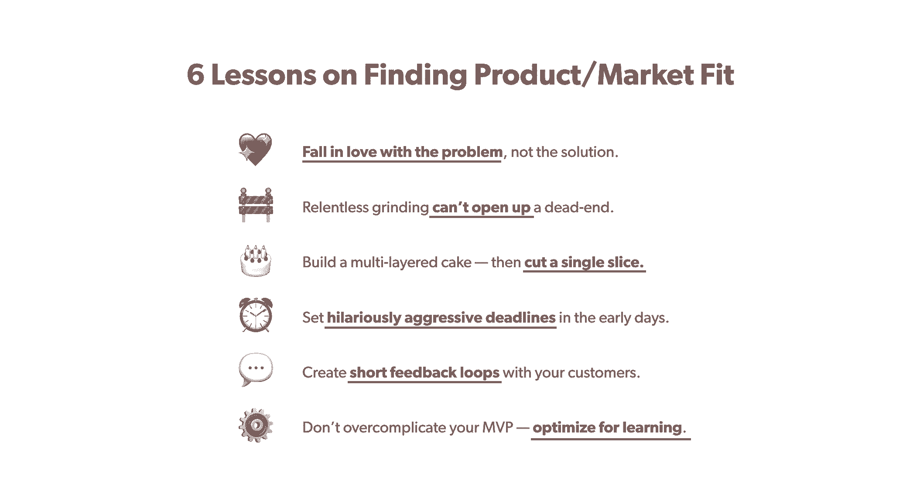

# 产品上市前/市场适应期的建议——这是创始人有目的地转向的剧本

> 原文：<https://review.firstround.com/advice-for-the-pre-product-market-fit-days-this-founder>

## 介绍

**[塔拉·维斯瓦纳坦](https://www.linkedin.com/in/taraviswanathan/ "null")******[鲁帕健康](https://www.rupahealth.com/ "null")** 说:“在幕后，几乎每个创始人的故事都是一样的:孜孜不倦地致力于一个想法，做各种不具规模的疯狂事情，努力寻找牵引力，迭代和转向，最终找到产品/市场契合的东西。”。“这些是你在新闻稿中找不到的内幕，新闻稿通常会砍掉最初几年的混乱。但当你与创始人交谈时，我们都经历过最初的动荡岁月，然后才会发现有用的东西。”**

**在我们看来，当你在战壕中，从零到一，从更混乱的时刻可以学到更多。但随着创业公司的成长，创始人离早期的动荡越远，来之不易的教训就变得越模糊。这就是为什么我们很高兴能和维斯瓦纳坦坐在一起——作为一个参与过许多早期团队的创始人，她向我们展示了在那些混乱的早期生存下来的关键。Viswanathan 分享了她在建立 Rupa Health 时应用的经验，以及她是如何在最初几年内将她的想法[转变为一家拥有 40 多名员工的快速发展的公司。](https://www.forbes.com/sites/jairhilburn/2021/08/27/this-startup-just-raised-58-million-to-make-it-easier-to-diagnose-disease/?sh=6ca65bcb3277 "null")作为 Rupa Health 的 seed 支持者，我们对让医生能够在一个平台上订购 2，000 多项专业实验室测试的想法很感兴趣，这是在一系列错误的开始和转变之后实现的。**

**她给其他创始人的第一个建议？在拿起任何人的剧本之前，确定你在公司旅程中的位置。“通常创业建议会被广泛分享，而不会在相关阶段保持一致——但背景决定一切。她说:“在早期创业公司中，有两个截然不同的阶段:产品/市场前的契合和产品/市场后的契合。**

**大多数传统的创业建议都是后产品/市场契合，但当你还处于前产品/市场契合时，采纳这些建议是危险的。**

**在这次独家采访中，维斯瓦纳坦特别关注初创公司创始人在早期最关键的领域——找到产品/市场契合度，组建早期团队。她向我们介绍了 RUP 的支点，以及每一个支点是如何让她更接近一个粘性产品的。她还解释了她召集非官方客户咨询委员会的建议，以及为什么这些建议对缩短你的反馈循环以尽快到达 PMF 至关重要。接下来，她概述了她在产品/市场适应前后的招聘建议，包括保持精益和重新思考你的工作描述。**

**如果你正处于创业的早期阶段，感觉被最初混乱和不确定的几年折腾得够呛(坦白地说，没有足够的专栏文章)，这篇文章适合你。让我们开始吧。**

# ****寻找产品/市场契合度的 6 课:如何以目标为中心。****

****

## **第一课:爱上问题，而不是解决方案。**

**创业社区经常赞美那些确切知道要建造什么的梦想家——史蒂夫·乔布斯和亨利·福特，他们将未来变成现实。“如果我问人们想要什么，他们会说一匹更快的马，”这是创始人圈子里经常重复的一句话。**

**这里的错误教训是，要成为“伟大的创始人”，人们应该看看他们的水晶球，提前推断出世界想要什么——因为如果创始人不能预测未来，失败就在眼前。但是维斯瓦纳坦解释说，对于创始人来说，这很容易变成流沙。**

**我见过的创始人最常犯的错误是爱上某个特定的产品或解决方案，从而在一些不起作用的东西上花费太多周期。**

**相反，她敦促创始人[关注问题](https://review.firstround.com/the-startup-happiness-formula-this-3x-founder-shares-his-approach-to-figuring-out-what-to-build-next "null")。“事实上，即使是远见卓识者也关注问题，而不是他们规定的解决方案。她说，亨利·福特希望创造一种每个人都能负担得起的更快捷的交通方式，而不是简单地“制造 T 型车”。**

**“在开始 Rupa 的时候，我对问题和市场走向有信心。我看到我们对健康、福利和医学的思考方式正在改变。我开始构建的第一个解决方案是面向整体医疗服务提供商的“Zocdoc 式市场”。Viswanthan 说:“来自第一个产品的洞察力和反馈帮助我们到达了今天的位置，但是如果我一直坚持那个解决方案，我们将永远不会让 RUP 起步。”。**

**为了专注于问题而不是执着于解决方案，维斯瓦纳坦给创业者们提了一些建议。“当你谈论这家公司时，要从你正在解决的问题的角度来描述它，而不是你正在构建的解决方案。我们没有将 RUP 描述为一个寻找整体医疗提供者或整体电子病历的市场，而是采取了问题优先的方法。她说，在 Rupa，我们让世界上的每个人都能获得根源药物，而不是简单地治疗症状。**

**另一个提示？“把问题写在一张大纸上，贴在墙上(或你的缩放背景上)，让每个人都能看到，”她说。她还建议在你的阅读清单中增加“[妈妈测试](https://www.amazon.com/Mom-Test-customers-business-everyone/dp/1492180742 "null")”。“这是所有 Rupa 新员工的必读书目。这是学习[用户访谈](https://review.firstround.com/a-ux-research-crash-course-for-founders-customer-discovery-tips-from-zoom-zapier-and-dropbox "null") &战术技巧的最佳书籍，保持以问题为中心的心态。”**

## ****第二课:无情的打磨不会打开死胡同，所以把你的直觉和逻辑结合起来。****

**在为 Rupa(整体医生的市场)确定了最初的产品想法之后，是时候把它放到客户面前了。维斯瓦纳森很快就用自己的积蓄和一个外包开发团队一起用 800 美元建立了一个原型。这个原型让她能够筹集种子前期资金，并雇佣一个由三名员工组成的团队。**

**然而，在一年的碰壁尝试后，市场并没有起飞。“我们尝试了一切方法来实现这一点，从门房，帮助人们找到医生的一对一文本对话，举办名为 Rupa Circles 的面对面会议，与斯坦福大学、Sutter Health 和 One Medical 的知名医生合作，以及许多其他产品迭代，”她说。“更令人困惑的是，自从我们开始以来，大约有 10 个其他整体健康市场涌入了市场，所以似乎有重要的市场验证。我只是一直在想，‘我们*应该*能够做到这一点——为什么它没有做到？’"**

**那么，你怎么知道什么时候该转向，什么时候该推进呢？回顾自己的经历，维斯瓦纳坦说这是直觉和逻辑的结合。“我的直觉知道我们正在碰壁，这不是正确的方向，我只是需要我的大脑跟上并理解为什么市场不起作用。这在一个多事之秋的 7 月 4 日达到了高潮——我去了办公室，连续阅读了 20 篇关于市场动态的文章。她说:“那 10 个小时是我在 RUP**、**投资中最有价值的时间。“那时我突然意识到，从基本原则的角度来看，市场不会为我们正在构建的东西服务。”**

**她指出了几个关键原因。“当你试图寻找一名全科医生或专科医生时，通常是通过口口相传，因为这是一种高度信任的情况。这也是一种一夫一妻制的关系——不像 Airbnb 或 OpenTable 那样，你会一次又一次地回到平台上寻找变化。她说:“使用整体医学，你要找的是一个特殊的人。这种逻辑推理加上我的直觉让我自信地放弃了市场产品。这给了我退一步重新考虑我们的客户真正需要什么的自由。”**

**在创业公司中，会有你需要坚持的时候，也会有你需要转向的时候——这就是创始人的困境。为了在正确的道路上获得信念，用逻辑和研究来验证你的直觉。**

## **第三课:烤一个多层蛋糕——然后切一片。**

**在《倪星市场》之后，维斯瓦纳坦和她的联合创始人罗莎·哈迈莱宁从头开始。在构建 Rupa 的第一次迭代的工作中，两人意识到医生希望建立他们自己的内聚虚拟实践(请注意，这是在 2019 年——COVID 之前)。但是没有一个优雅的解决方案，医生们笨拙地通过电子病历 Zoom 和 Calendly 将业务的碎片拼凑在一起。创始人意识到他们可以提供一个全面的虚拟平台。**

**Viswanathan 本能地知道这个平台不会成为成功的产品——那么她为什么要继续开发呢？“通过我们的整体市场产品，我们了解了每位医生的个性化需求。她说:“建立一个庞大的诊所系统无法满足每个医生的大规模需求。"**我们知道这个虚拟练习平台最终不会成功。但它可能会让我们想到** ***将*** **工作**。”**

**她把这种方法比作烘烤多层蛋糕，知道你只会切下一片。“通过创建虚拟诊所的完整体验，我们将在医生执业的各个方面与他们深入合作。最终目标是建立虚拟诊所，指出最大的痛点，缩小我们的关注范围，”Viswanathan 说。**

**寻找产品/市场契合度就是要找到回想起来看起来如此简单明了的小问题。**

## ****第四课:为你的 MVP 设定积极的截止日期。****

**维斯瓦纳坦将目光放在了虚拟诊所的支点上，将团队缩减到只有她自己和她的联合创始人罗莎·哈迈莱宁(稍后将详细介绍这个艰难的决定)，这样 Rupa 就可以尽快行动。“我们发现，我们推出的每一个产品迭代都让我们更接近正确的答案。因此，我们越快将产品推向市场，我们就能越快找到有用的东西，”她说。**

**这两位联合创始人挑战自己，在短短一个月内推出虚拟诊所——维斯瓦纳坦承认这是一个荒谬的雄心勃勃的时间表。但是他们坚持这个目标，在三个州与医生合作并支付病人费用。“我们做了各种各样的事情来满足这一期限，从给医生发邮件加入平台，到在 Instagram 上寻找病人，再到众包一名合同工程师。她说:“当你给自己施加极端的约束时，你就会变得富有创造力。“没有人相信在团队中没有全职工程师的情况下，有可能在一个月内创建并启动一个功能齐全的医疗诊所，但我们做到了！”**

**你必须为自己设定一个充满挑战性的截止日期，否则，你会被无关紧要的不必要的细节冲昏头脑。如果你在考虑配色方案和按钮宽度，你的时间线太长了。**

**维斯瓦纳坦强调了在早期设定不可思议的短期限的三个重要原因:**

****1。只建立必要的东西:**积极的截止日期有助于区分必须拥有的东西和值得拥有的东西。你的 MVP 应该抓住你正在解决的问题的核心，[而不是设计出最终的工作流程](https://review.firstround.com/The-5-Early-Mistakes-That-Almost-Killed-This-Founders-Startup-and-How-He-Survived "null")。**

****2。尽快开始学习:**在这个阶段，是关于学习，而不是扩展。写下*为什么*你要做这个实验——你希望从这个问题中学到什么？**

****3。保护自己不要爱上这个想法或产品:**产品和想法在这个阶段应该是一次性的。不要因为你的想法太珍贵而陷入沉没成本谬误。**

**回到她的问题焦点，Viswanathan 将速度的[重要性讲得很清楚，这样就不会执着于某个特定的解决方案。“就像任何关系一样。你和它在一起的时间越长，即使它不起作用，你也越难放下它。她说:“如果我们花了六个月或一年的时间来建立诊所，这是一个非常合理的时间表，那么就很难扔掉它，并自信地走向接下来的洞察力。”](https://review.firstround.com/speed-as-a-habit "null")**

## ****第五课:召集非正式的客户顾问委员会，并提供简短的反馈。****

**在启动诊所后，这两位联合创始人作为诊所工作人员亲自操作-准备就诊记录，订购专业实验室工作，跟踪患者等。这种亲身实践的方法让他们完全了解医生在运营自己的虚拟诊所时面临的问题。**

**工作流程中的一个特殊步骤就是消耗掉几个小时的时间。Viswanathan 说:“在看了几个病人之后，很明显实验室工作是最大的问题。“我们花费了大量时间来确定在哪里进行测试，与不同实验室的医生签约，确定价格，并向患者解释说明。如果没有我们的帮助，医生们将不得不自己花费数小时在这上面。有一天，我和我的联合创始人看着对方说，‘这个*有* 要做它。’"**

**Viswanathan 立即向 RUP 网络中的一些医生发送了一系列的文本，询问处理所有实验室工作的门户是否有价值。“那时，我们甚至不知道解决方案会是什么样子，所以我们没有费心推销具体的产品。我们专注于推销这个问题。她说:“我们在虚拟诊所平台或市场上从未见过的反应立刻就出现了。“对于我们制造的所有其他产品，我们都是向医生推销的。现在突然有了一条短信，是医生说服我们去建造，并告诉我们到底需要什么。几分钟后，我们意识到我们正在做一些事情。”**

**

Tara Viswanathan, co-founder and CEO, Rupa Health** 

### ****利用短信建立真实、有影响力的关系。****

**维斯瓦纳坦指出，这个故事只是更多创始人应该更多地依赖非正式沟通形式的一个原因。“我非常相信通过发短信来建立关系，无论是招募你的团队还是建立你的客户顾问委员会。预定的用户反馈会议很好，电子邮件反馈也可以，电话交谈更好。但与你的客户保持短信联系绝对是最好的选择，”她说。“这是增长最快的反馈循环，你越快建立反馈循环，[你就会越快找到适合的产品/市场](https://review.firstround.com/how-superhuman-built-an-engine-to-find-product-market-fit "null")。”**

**这就是为什么她认为发短信应该是默认设置:“它让人感觉更加个性化和轻便。所以每当我遇到可以帮助指导 RUP 的人时，我会花时间去了解他们，并尽快与他们建立短信关系。虽然听起来很傻，但在 Instagram 上发短信甚至联系已经让我们很容易获得客户的即时反馈。她说:“这向他们表明，我们不仅仅是在寻求一种交易交换，比如征求对礼品卡的反馈。“我们对我们所做的事情充满热情，我们希望将我们的客户带到这个旅程中来。许多人想成为其中的一部分，但金钱买不到这种关系。简单地成为一个人(这成为了 RUP 的核心价值)可以走很长的路。”**

**说服人们帮助你的是人际关系和共同的激情——而不是 50 美元的亚马逊礼品卡。**

**这是该队今天仍在使用的战术。如果 RUP 团队需要快速的反馈，维斯瓦纳坦或者她的联合创始人哈迈莱宁将会跳上他们的手机，发送一个快速的文本，然后在几分钟内得到答复。“这对建立企业非常重要。我们把几周浓缩成几分钟。她说:“如果每次我们有问题时都必须发送电子邮件安排反馈会议，我无法想象我们会进展得有多慢。”。**

## **第六课:不要让你的 MVP 过于复杂——为学习而优化。**

**甚至在原型出现之前，消息就已经传开了，实验室门户也越来越受欢迎。“我们联系了一位医生，他误以为我们已经建立了实验室门户。她说，‘我将在一月份开始实习，我需要加入你们的实验室门户网站。没有它，我无法开始我的诊所，”维斯瓦纳坦回忆道。离一月还有一个月。RUP 团队现在有了另一个非常积极的截止日期来执行第二个支点——并且已经开始了比赛。**

**在一个月内启动实验室测试的最后期限到来之际，Rupa Health 的联合创始人开始将各个部分准备就绪。早期的实验室解决方案是杂乱无章的——仅仅由电子邮件、PayPal 和谷歌文档拼凑而成。“我们会等待医生的命令，检查请求是为了什么实验室，然后联系 sales@labcompany.com 的[与客户经理交谈，说服他们让我们开设一个账户。她说:“然后，我们会给病人发一张 PayPal 发票。(当然，患者必须同意信息共享和利用这一过程。)“把产品剥得只剩骨架，拿出来给人们看，让他们做出反应，这很关键。**很少有产品因为**](mailto:sales@labcompany.com "null") **[太微不足道而不能发挥作用——这是因为这个想法在](https://review.firstround.com/dont-serve-burnt-pizza-and-other-lessons-in-building-minimum-lovable-products "null")**开始时不够强大。”**

**直到推出几个月后，该团队才构建了一个自动向患者发送发票的后端。但是尽管体验有些笨拙(并且缺乏营销)，该产品还是通过口口相传而爆炸式增长。“在三个月内，我们从支持湾区的两名医生发展到为全国几乎每个州的数百家诊所供电，”Viswanathan 说。在多年努力实现产品/市场匹配后，齿轮已经到位。**

**如果你非要问你是否恋爱了，你很可能没有恋爱。产品/市场契合度也是如此——如果你必须问你是否有，你可能没有。**

# ****组建早期团队的 3 条经验:让你的团队与你所处的产品/市场阶段相匹配。****

## **第一课:在建立你的全职团队之前，先依靠 PMF 时代的承包商。**

**在从最初的 marketplace 创意中筹集种子前期资金时，除了她的联合创始人之外，维斯瓦纳坦还带来了几名全职员工。“这是我最早犯的错误之一，也是让我们慢下来的最大的一件事。她说:“即使只有一个四人团队，快速移动和调整也要困难得多，而只有我和我的联合创始人罗莎时则不然。”。**

**这是很多初次创业者都会犯的错误:一旦你筹集到一点资金，你就开始遵循你在其他创业公司看到的“应该”，而不是对你的公司有意义的东西。**

**回到 7 月 4 日，当维斯瓦纳坦意识到市场产品无法扩大规模时，她需要解雇她在筹集种子前资金后雇佣的两名全职员工，并回到共同创立的二人组。“为我们工作的人想要比我们当时能提供的更多的结构。这非常痛苦，但我坚信这对每个人来说都是正确的决定，”她说。**

**作为权宜之计，她带来了一些兼职承包商，他们帮助公司从市场转向虚拟诊所平台，并最终再次转向创建实验室测试产品的第一个原型。在这样做的时候，Viswanthan 忽略了一个经常被重复的创业智慧:永远不要外包。“你需要让你的团队与你的舞台相匹配。她说:“如果你在早期的混乱中导航，你会希望为快速迭代而优化。**

**对于其他可能对在公司创建初期走承包商路线感兴趣的创始人，维斯瓦纳坦提供了一些她关于消除一些障碍的建议。**

**把他们带进圈里。“我们想让每个承包商感觉他们实际上是团队的一部分，而不仅仅是在用时间换取金钱。她说:“不管他们花了多少时间，你仍然可以与承包商保持密切的关系。”她建立了每周一早上的 RUP 联盟会议，在会上她提出了策略和当前的计划。**

****在任务上保持一致:**“与承包商合作的艰难之处在于他们没有投资你正在建造的东西。但你可以找到和你想做的完全一样的人，那就是学习并成为更大事业的一部分，”她说。为此，面试过程与全职工作并没有太大的不同。“我只是走进去，把我的心放在桌子上，并希望他们也这样做。如果匹配，我们就开始吧。”**

****设定明确的评估时间表:**“一些承包商是我们认识的人推荐给我们的，其他人是在我们在 AngelList 上列出一个名为‘一般创业公司皮条客’的职位后找到我们的，这让我们有了很多申请人。她说:“然后，我们有一个严格的一个月时间表，在此期间，我们将评估员工是否适合继续前进。**

**最终，一旦 RUP 团队发现了产品/市场的适合性，并且筹集了他们的下一轮资金，这些承包商中的许多人就转变成了全职角色。**

## **第二课:在你的工作描述中要人性化，不要美化日常工作。**

**在她的招聘过程中，维斯瓦纳坦指出了另一个她经常忽略的创业“应该”。“我不使用传统的职位描述——我觉得它们对评估一个人没什么用，”她说。**

**相反，当她开始一个新的角色时，她需要两样东西:北极星和 30 天计划。原因如下:“在我们目前所处的阶段，我可以试着为你的角色写一份季度计划，但实际上，我无法预测你在 90 天内会做什么。事情每天都在变化，”维斯瓦纳坦说。“但我知道你现在要做什么，也就是你的 30 天计划，以及我们将如何评估你的前进，这就是你的北极星。”**

**她列举了最近的一个例子:“我正在招聘一名办公室主任，开始查看一些职位描述的例子，发现其中充满了招聘术语，比如‘首席执行官的战略助手’。我不知道这意味着什么，也不知道我应该如何根据这个标准来评估任何人，”她说。**

**相反，她很有策略地写下了新幕僚长在头 30 天会做什么。“这包括列席我的所有会议，以特定的方式帮助优化我的一对一会议，以及接管某些会议。维斯万坦说:“当你与候选人谈论他们是否能够履行这些职责时，这一点就会变得更加清晰。北极星是一个表明角色成功的声明。“对于幕僚长的角色，这位北极星说:‘让塔拉保持成功，腾出她的时间，这样她就可以专注于指导公司。"**

*****如果你想在这里更深入地了解一下，*** ***[查看一下这个想法 doc](https://www.notion.so/rupahealth/Chief-of-Staff-d2c4735df5f346a2895a8f32ab44285f "null")*** ***维斯瓦纳坦把这个想法放在一起，作为她幕僚长角色的工作描述的替代方案，同时还有一个文件，详细说明了*** ***[30 天计划和北极星](https://docs.google.com/document/d/1DoeXaDVb7_6EOnuzHGEuxz1OTr-ZL9YZCKa6lmQ3fRM/edit#heading=h.p3daqh3w97f5 "null")*** ***。*****

**在面试过程中，北极星和 30 天计划都会与候选人分享。在这里，维斯瓦纳坦指出了另一个关键区别。“工作描述可能听起来很好，很有意思，但事实是大多数工作都有些乏味。她说:“有了 30 天计划，我们对这个职位的具体任务非常明确——我们不会试图对候选人隐瞒任何事情。”。**

**她还建议创始人留出时间来训练自己的直觉。“我有产品背景，对于招聘产品经理以及优秀的产品应该是什么样子，我有直觉。但是在招聘幕僚长的时候，我的直觉基本为零。她说:“如果你让五个参谋长站在我面前，肯定会有很多误报和漏报。为了避开这个困境，她在开始面试前，在自己的社交网络中寻找至少 3-5 个人来谈论这个职位。**

## **第三课:诚实地看待谁会成功，并写下来。**

**在创建公司的早期，Viswanathan 为任何登上 Rupa 的全职候选人勾勒出了她的标准——她坚持至今。“我看了看我最尊敬的人和我一起工作得最好的人，并对照自己来看看这些标准对我是否适用，”她说。**

**对于其他创业者来说，这是一个很好的起点，他们可以建立自己的[基于价值观的招聘名单](https://review.firstround.com/20-underrated-qualities-to-look-for-in-candidates-and-50+-interview-questions-to-suss-them-out "null")。“如果我创办另一家公司，这些都还是一样的。维斯瓦纳坦说:“对我们来说，找到在所有这些领域都有突出表现的人对于初创企业来说至关重要。她还打开了几个[面试问题](https://review.firstround.com/40-favorite-interview-questions-from-some-of-the-sharpest-folks-we-know "null")，这是她根据这个标准评估候选人时所依赖的。**

****高标准:**他们不仅对自己、工作和队友保持高标准，而且*享受*高标准。**

****要问的问题:**你最自豪的成就是什么？**

****寻找什么:**这种成就是达到了别人为他们设定的目标，还是基于他们自己的内在动机？**

****红旗:**从来没有给自己定过目标的人。**

****往深里跳:**他们有一种“请求原谅，而不是允许”的心态。他们会弄脏自己的手，是一个主动解决问题的人，而不是由职位来定义的。**

****要问的问题:**说说你最近解决的一个问题，以及你是如何解决的。你怎么知道这是一个需要解决的问题？**

**寻找什么:他们是等待别人告诉他们问题是什么，还是自己主动去解决？他们是主动的还是被动的？**

****红旗:**“那不是我的工作”的态度。责怪以前团队的其他人。**

**好奇:他们对问题的潜在解决方案持开放态度。他们带着好奇心接触新的话题和想法。**

****要问的问题:**说一些激进的东西，看看他们会有什么反应。用一个 RUP 例子，“我有一个朋友接受了针灸而不是肩部手术。你对此有什么看法？”**

****寻找什么:**他们是带着好奇心和求知欲去解决问题，还是对如何解决问题有严格的信念？当他们听到新的事情时，他们会兴奋吗？当你说一些不符合他们信仰的话时，他们会有什么反应？**

**危险信号:对其他团队、人员或工作做出假设。对不同的存在或运作方式持否定态度。**

**在他们的过去，有明显的例子表明他们不得不自己解决问题并抓住机会。他们已经证明，他们可以扔出一个弧线球，仍然让它发生。**

****要问的问题:**说说你最斗志昂扬的时刻。你冒了多大的风险得到了回报？**

****找什么:**独立思考者。这是一个为了达到目的会穿墙跑的人吗？**

****红旗:**一直走安全路线。**

**有人情味:带着你的整个自我去工作。待人和善。为友好而优化。**

****要问的问题:**生活中什么对你来说很重要？为什么这很重要？在接下来的 2 年里，你打算如何发展？**

**寻找什么:我们能在人的层面上交流吗？我们的动机一致吗？你对这家公司和我们正在做的事情有激情吗？**

****红旗:**无力突破“玻璃”墙。非常僵硬和正式的面试。对我们的病人或医生的同情心有限。**

# **总结:创始人——寻找机会创造动力。**

**“当我刚刚开始使用 Rupa 时，一位顾问告诉我，早期的日子是创业旅程中最艰难的日子。现在回想起来，她完全正确，”维斯瓦纳坦说**

**她把自己的创业高潮和低谷归结为一个词。**在这场比赛中，气势决定一切。有动力和增长，就有能量。当没有的时候，它是令人麻痹的。”她说。“在早期，你不会被任何特定的时间表、交付成果或客户需求所束缚。你几乎是在太空中漫无目的地漂浮。”****

**我发现，精疲力尽不仅仅是因为开得太快。它走得很快，看不到尽头。**

**为了感觉更踏实，维斯万森专注于为自己设计动力，并建议其他创始人也这样做。“创业旅程越早，你需要创造动力的时间就越短。她说:“这一切都是为了创造微小的进步。”。“我会有意识地制定每小时、每天和每周的计划来帮助我感受动力，不管任何外力。”**

**举个例子？Viswanathan 开始制作一份每周时事通讯，记录她自己的健康之旅，汇编她在该领域看到的有趣研究和与功能医学相关的其他主题。“每周我发那份简讯，我都觉得自己完成了一些事情。如果你能在每天、每周、每月的例行工作中创造这些成功，你就能开始微小的动力推动，最终引领你走向下一步。”**

***这篇文章是对我们的新播客《深度》中塔拉·维斯瓦纳坦的出场* *的简要编辑如果你还没有听过我们的节目，* *[一定要来这里看看](https://review.firstround.com/podcast "null")* *。***

***盖蒂图片社封面图片/格兰特晕***