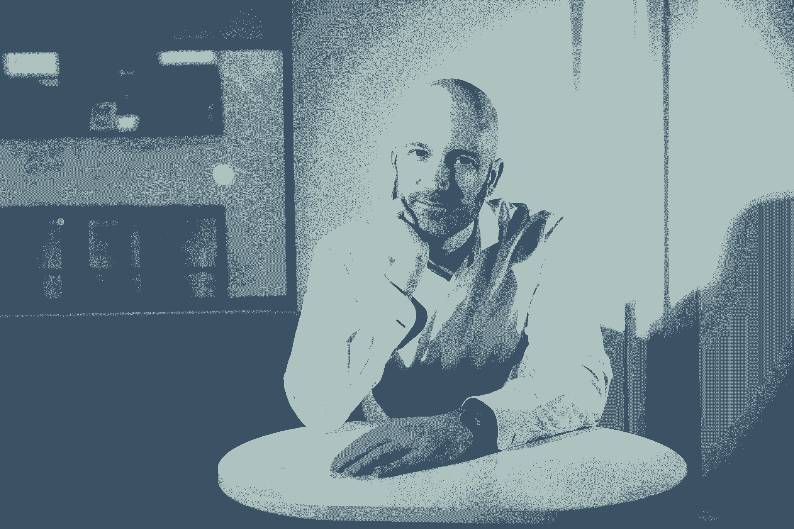

# 建议比以往任何时候都更加重要，也更加势不可挡。以下是创始人如何消除噪音

> 原文：<https://review.firstround.com/advice-is-more-important-and-overwhelming-than-ever-heres-how-founders-can-cut-through-the-noise>

创始人总是面临着拥有一切的巨大压力——对新产品的独特、改变世界的愿景，打动潜在投资者和团结员工的独特魅力，以及贯穿公司成长所有阶段的商业头脑。

在新冠肺炎危机和随后的经济动荡中，这些动力只会加剧，颠覆精心制定的计划，增加创始人肩上的负担。面对危机，创始人天生倾向于退缩和内向，这让这一负担变得更加沉重。无论一家初创公司所处的行业是由于超预期的需求而加速发展，还是由于严重的危机而停滞不前，这种由创始人“搞清楚”并制定获胜计划的感觉正在迅速加剧。

但是，当我们上个月为度过这场危机而整理我们的[创始人实地指南时——借鉴了与首轮获得支持的企业家进行的无数小时的工作会议，以及我们对十几位衰退时期的创始人和首席执行官进行的采访——一个主题反复出现:创始人不应该觉得他们必须单干。在这种时候，大量的支持和高质量的建议可以带来很大的不同，这意味着**从你现有的顾问和投资者网络中获得最大的收益从未像现在这样重要。**](https://firstround.com/review/the-founders-field-guide-for-navigating-this-crisis-advice-from-recession-era-leaders-investors-and-ceos-currently-at-the-helm/ "null")

当然，所有常见的免责声明在这里都适用**。**即使是经历过以往衰退的创始人也会很快指出，我们目前正生活在特殊的环境中。对于创始人目前面临的[在此插入你的首选形容词]情况，没有经过实践检验的剧本。建议绝不是灵丹妙药。正如[我们之前提到的](https://firstround.com/review/the-founders-field-guide-for-navigating-this-crisis-advice-from-recession-era-leaders-investors-and-ceos-currently-at-the-helm/ "null")，我们坚定地相信，最好的建议通常并不总是来自通常的怀疑，而是来自企业家伙伴的自下而上的智慧。

但即使有这些警告，仍然真实的是，没有一个人——创始人、投资者、顾问或其他人——现在有所有的答案。**有效地*****换句话说，仅仅是收集和评估建议的行为，即使最终被丢弃，也可以成为指引创始人度过这场风暴的指南针。***

*但这并不容易。现在，我们听到一些创始人说，他们感觉自己淹没在一片善意但势不可挡且往往相互矛盾的指导海洋中:要么大幅裁员，要么根本不裁员，要么迅速转向，要么坚持到底，等待时机。一群同行首席执行官或经营者出身的顾问可能会建议一条道路，而传统投资者或董事会成员可能会推动更大的战略转变。*

*这就引出了我们今天要讨论的话题:如何获得建议的建议。这可能看起来有点像元主题，但尽管如此，我们认为这是一个特别有用的话题。为了组装今天的作品，我们回顾了我们广泛的档案，以展示支撑你的共鸣板的最佳策略，使它比以往任何时候都更加坚实。重要的是，这不是关于挑选顾问的建议——而是关于创始人如何最大限度地利用他们已经召集的顾问的专业知识，作为受建议者履行他们的承诺，并通过他们收到的所有建议来磨练最重要的洞察力。*

*以下是关于如何充分利用你的顾问的关键经验，这些经验是我们在过去几年的评论中公布的。我们希望它们能为你所用，尤其是现在，互相依靠的需要变得前所未有的重要。*

*在如此多的不确定性和不断变化的优先事项中，你的顾问(尤其是投资者)可能会比以往任何时候都更多地参与你作为创始人所做的决策。但是如果没有合适的结构，这个善意的建议只会带来更多的噪音，使你的决策过程变得复杂。第一轮合伙人 Phin Barnes 一直认为，在这些创始人兼顾问的关系中，机会还是存在的。在之前的评论中，他分享了一系列关于如何从你的顾问那里获得更多信息的策略——我们将在这里重点介绍他关于如何缩小关注范围和提取最佳见解的一些技巧。*

***见见你的新陪练。***

*当你第一次与你的投资者或顾问建立关系时，也许你已经正式讨论过对双方的期望。更有可能的是，这是一次更加非正式的谈话。现在你可能比以往任何时候都更依赖他们，这是一个定义或者重新定义这种关系的机会，即使是和你多年的顾问，作为受建议者，你有责任这么做。*

*以下是巴恩斯认为最有效的方法:“**这样定义你们的关系:你告诉他们你在想什么或计划做什么，他们的工作就是把你逼入绝境，让你杀出一条血路**，”他说。他把这个角色定义为一个陪练，迫使你作为创始人来捍卫和解释你的立场。*

*企业家往往已经有了解决问题的最佳答案。一个好的顾问会通过强迫他们一遍又一遍地解决问题来引出问题。*

*有了这种辩论的动力，你能够练习捍卫你的立场，磨练和加强你自己的论点，而顾问以一种更互补的方式将他们的历史和经验带到桌面上。作为创始人，你可以决定什么问题与你的公司有关，什么时候该听，什么时候不该听。“当创始人不得不捍卫或解释他们的立场时，发生的边际变化就是真正的价值被创造的地方，”巴恩斯说。*

*那么，你如何确定你可以最大限度地利用你的陪练的那些有影响力的领域呢？“如果你是一名创始人，想想你领导公司的日常工作。你可能正在相当迅速或毫不费力地做出一系列决定，但你在哪里犹豫了？”巴恩斯说。“当我在经营自己的初创公司时，我知道什么时候我有盲点，什么时候我不确定，因为我只是感觉不一样了——更不自信了，甚至更有耐心了。我会发现自己在等待，试图收集更多的信息。”*

*无论你在哪里发现自己犹豫不决，那就是你应该向你的顾问求助的地方。即使你还不知道，也意味着你需要帮助。*

*顺便说一句，巴恩斯关于犹豫的危险的观点让我们想起了最近我们从他的第一轮合伙人约什·科佩尔曼那里听到的一些事情[，**，**](https://firstround.com/review/the-founders-field-guide-for-navigating-this-crisis-advice-from-recession-era-leaders-investors-and-ceos-currently-at-the-helm/#text_b4e98570bcb44b8584ea104bc67cad30 "null")**[，](https://www.linkedin.com/in/jkopelman/ "null")** ，当时我们正在努力为面临危机的创始人们整理众包建议的现场指南:*

**“当你需要采取的行动令人痛苦时，比如紧缩措施，人们会有一种认知偏差，倾向于拖延，直到你非常确定这些行动是必要的。问题是，在最坏结果实现的可能性随着时间的推移而增加的情况下，当你确定需要采取行动时，可能已经太晚了。* ***无为是一种决定。和主动选择留在同一条路上是一样的。大多数创始人都没有意识到这一点。如果风向改变，聪明的水手会调整船帆。****

**因此，如果你发现自己有这种在重大决定上犹豫不决的本能，认识到自己不采取行动的潜在偏见，并提醒自己这是一个你可能会让一个陪练工作的领域。**

**把自己定位为一名受指导者，避免师生互动。**

**巴恩斯说，最大化顾问贡献的另一个策略是把自己作为一个受咨询者。一位创始人曾经问我:'**在所有和你一起工作的人中，我从你那里得到的帮助是多于还是少于平均水平？**‘他们基本上是在评估我们参与的质量。当我说他们一般时，他们的下一个问题是，“我怎样才能得到更多？”"**

**巴恩斯对这种战术印象深刻。他不知道这位特别的创始人有多想接触更有规律的节奏，但一旦他知道，他很乐意提供更多。现在，这比以往任何时候都更是向你的顾问提出的一个关键问题。这将有助于你评估你是否真的最大化了这些关系，或者他们是否有更多你尚未挖掘的东西。**

**另一个要点是，作为创始人，你需要负责你所有的咨询关系。即使这些人在某些领域更有知识，也不应该有师生互动。巴恩斯说:“你不仅仅是出现在课堂上，和创业公司的顾问们坐在一起。“这需要 100%的自主学习。管理好这种关系。拥有它。”**

**你的顾问的工作是把他们最好的东西交给你，但你的工作是推动事情发展，让你从他们身上得到最大的收获。**

**阅读首轮合伙人 Phin Barnes 关于充分利用创业公司顾问的更多内容。**

**“我不常征求意见。我要求坦诚的反馈、额外的信息、更多的数据——这是一个完全不同的故事。在我寻求建议的罕见时刻，我会寻找一个能帮我以一种我未曾考虑过的方式思考问题的人。只有当我真正想要改变时，我才会考虑征求建议。”**

**作为包括 KISSmetrics、Crazy Egg 和最近的 **[FYI](https://usefyi.com/ "null")** 、 **[Hiten Shah](https://twitter.com/hnshah?ref_src=twsrc%5Egoogle%7Ctwcamp%5Eserp%7Ctwgr%5Eauthor "null")** 在内的多个 SaaS 创业公司的联合创始人，在他的创业生涯中无数次处于寻求指导的位置。他还是数十家公司的天使投资人和顾问，能够提供大量建议。一路上，他观察到许多常见的陷阱，这些陷阱导致善意的建议用处有限，或者被建议者如何错过进一步挖掘他们顾问智慧的关键机会。**

****

**沙阿相信，强有力的改变公司的建议和之前的问题一样好。“我所知道的是:**在大多数情况下，建议产生最大影响的地方，工作是从寻求建议者开始的。如果是你，在请求帮助之前，花点时间调查一下你的企业中哪里需要帮助。不要安定下来马上问别人过去的经历。深入了解你下一步需要发展的领域。从你的商业基础开始。这听起来很基本，但我一直很惊讶有多少人忘记了这一点。”****

**在求教的时候，你应该是在演戏的边缘，但可能不知道如何。在这一点上，你采取行动的动机不重要，重要的是你采取行动的方法。**

**沙阿发现大多数人向他寻求建议的方式都是先问他过去做了什么。但这些问题的价值有限，因为没有哪两家公司是完全一样的。相反，从分享你的情况开始。你的顾问自然会把他们的个人经历带进答案中，但通过这种方式提出问题，你可以避免完全谈论什么对其他公司有效，什么最适合你的特殊情况*。***

**这里有一些实践中的例子。**

**这些是沙阿从那些寻求他建议的人那里得到的常见问题:**

**当你开始 KISSmetrics 的时候，你是如何开始你的博客的？**

**当你雇佣第一个销售人员时，你是在哪里找到他们的？**

**当你筹集第一轮资金时，你是怎么做到的？**

**这本来是一个更好的**调查线索:****

**我正在想如何为我的生意做营销。我应该考虑什么？**

**我正在组建一个销售团队，并试图雇佣第一个人。我应该如何接近它？**

**我在考虑筹钱。我应该从哪里开始？**

**这将是他们开始调查的最佳线索:**

**我正在想如何为我的生意做营销。以下是我们尝试过的，这些是我们发现对我们有用的少数测试。接下来我应该考虑什么？**

**我正在组建一个销售团队，并试图雇佣第一个人。这是我们的目标客户，我们每个客户的平均收入以及我们的销售流程。接下来我该怎么接近它？**

**我在考虑筹钱。六个月前，我在这家公司的带领下筹集了我的种子资金，看起来这个合作伙伴是最合适的，这就是我们现在筹集资金的原因。下一步该怎么办？**

**沙阿收到的第一组问题和重写后的版本有一些关键的不同。最重要的几点是:**

**喜欢用现在分词而不是过去时态的动词提问。使用“ing”动词让建议者和接受者植根于当前正在发生的事情——并且可以采取行动。询问任何一方的所作所为都应该简单明了，次要的，如果有必要的话可以在谈话中梳理出来。**

****以数据为问题根源。**好的和最好的建议寻求线之间的区别是简洁地提供一系列数据点，建议者可以在这些数据点之间画线。这些数据会迅速向最佳建议者传达你在这个过程中所处的位置、你可能问过或没问过的问题，以及你对自己所处位置的理解。它还通过减少伪装，快速将双方放在同一页上来加速对话。**

**问问你下一步该做什么。任何好的建议都应该直接导致行动，而不是专注于过去。就你下一步该做什么征求建议，会向建议者传达你准备立即采取具体行动的信息。**

***[阅读更多沙阿给建议寻求者和建议给予者的提示。](https://firstround.com/review/advice-is-cheap-context-is-priceless/ "null")***

**作为一名创始人，你习惯于用量化的数字来衡量你的企业的成功，从收入到客户保持率再到渠道。然而，咨询关系只有有限的指标来定义成功，而反馈往往是定性的。 **[Amy Chang](https://www.linkedin.com/in/changamy/ "null")** **，****陪伴**(一家被思科收购的网络初创公司)的创始人，现任[思科协作](https://www.cisco.com/c/en/us/solutions/cisco-on-cisco/collaboration.html "null")的执行副总裁兼总经理，多年来积累了数十名顾问，同样也在努力衡量这些关系的有效性。**

****

**随着时间的推移，她开发了一个简单的公式来检验她的顾问网络的影响。她使用两个关键指标来评估顾问关系是否运转良好:**

**1.顾问是否定期对公司的需求做出反应。**

**2.无论何时你和那个人说话，你是否觉得你在某个话题上的知识有了“飞跃”。**

**这里有一个伟大顾问的好迹象:每次你走开或挂断电话，你都觉得你需要花更多的时间和他们在一起。**

**你的一些顾问还没到吗？利用这个框架，Chang 提供了一些建议来加速你的输出。**

# **知道跟进意味着什么。**

**这是你能做的最重要的事情。无论别人给你什么建议，告诉他们这些建议是如何被考虑、执行或应用的，以及结果如何。您的顾问非常关心提供建议或建立联系，以对您的业务产生影响，并希望知道他们的时间是否得到了充分利用。提醒他们他们的指导对你和你的企业产生了影响是一个关键的最佳实践。然而，后续工作的一个挑战是保持组织性，并跟踪顾问在哪些方面提供了帮助——尤其是当你将这种帮助分散给多个顾问、投资者和导师时。**

****Chang 已经解决了这个问题，她保存了一份由顾问提供的一行想法的运行文档，并强调每六个月重新访问一次，以便她可以跟进该想法如何产生影响**。(编者注:考虑到我们当前的环境发生了很大的变化，你可能希望缩短跟进的时间。)这可能意味着对影响产品的一条反馈、证明卓有成效的客户关系或管理创始人压力的策略进行跟进。开始保存你自己的文件，列出你所有顾问的建议，并设置一个日历提醒，定期重新查看这个列表，这样你就可以确定哪些领域需要跟进这条反馈的关键结果。**

# **把他们带进团队。**

**作为创始人，你可能是公司投资者和顾问的主要联系人。让你的顾问有机会去了解更大的团队，这是一个进一步充实他们对业务的了解的机会。不要保持单方面的关系——邀请一位顾问与你的团队进行非正式交谈，并把他们介绍给每个人。和团队一起为他们举办一次(虚拟)晚宴，围绕公司正在努力解决的一个大问题设定一个话题。它会省去闲聊。如果一个顾问看起来适合，你也可以请他们指导你的明星球员。这会让他们觉得对你的公司的成功更有帮助，更有必要，并且让他们对公司面临的挑战有不同的看法。**

# **不要退缩。**

**如果你在你最亲密的顾问面前不是 100%的脆弱和透明，你只会伤害你自己。虽然这当然意味着要诚实面对业务现状和你看到的数字，但这也包括诚实面对你的情绪。经验丰富的专业人士是最好的顾问，因为像治疗师一样，他们(几乎)什么都见过。他们见过沮丧、愤怒、悲伤、害怕的创始人，他们有能力帮助你处理这些事情。“给你的亲密顾问一个机会，不仅帮助你解决公司面临的问题，也帮助你解决你的心理问题，”常说。“这是一种难以置信的解脱。”**

**阅读更多常的建议，与你的顾问建立牢固的关系。**

**像所有成功的关系一样，建议是双向的。作为一名向你的导师、投资者和顾问寻求建议的创始人，确保你对那些帮助你应对创业曲折的人表示感谢是至关重要的。然而，现在事情是如此混乱，以至于花点时间抬起头对那些提供改变游戏规则的建议的人说“谢谢”可能会被其他待办事项淹没。**

**LinkedIn 早期董事、人际关系建设专家 Patrick Ewers 同意这个概念听起来非常简单，但他很少看到人们利用它。几年前，当我们为《评论》采访 Ewers 时，他向我们介绍了“价值有效载荷”的概念。**

**“我喜欢‘价值有效载荷’这个术语，因为它听起来很实在，”Ewers 说。“价值负载是你提供给人们的任何可以帮助他们的东西。它们可以是对他们想见的人的介绍，关于他们正在试图解决的问题的文章，一张说明你看到了他们的作品并发给了其他人的便条。大多数时候，它需要发送一封电子邮件，这很容易成为一种习惯。”**

**最简单的价值有效载荷——字面上不花你一分钱——是基于情感的价值有效载荷。**

**“一个基于情感的价值有效载荷所需要的就是在那一刻给人们积极的反馈。许多人都有这种奇怪的倾向，在给予赞美或积极反馈时会过于小心。有多少次有人在会议上发言，你会想，哇，这真的很聪明，但你从来没有大声说出来？”他说。这些小而有力的调整可以对你和你的顾问的关系产生巨大的影响——无论是在新冠肺炎，当你比以往任何时候都更依赖他们的建议的时候，还是在更远的地方。**

**他继续说，尽管这些任务都很细，但他很少看到它们付诸行动。从养成习惯开始。在[促进你与你的顾问和导师网络的关系](https://firstround.com/review/how-to-make-connections-that-count-advice-from-a-silicon-valley-veteran-and-introvert/ "null")的背景下，这看起来像什么？一开始，你可能要强迫自己去做。Ewers 建议每天至少发送一封短信给你网络中的某个人。**无论是给你的一位导师发送一封你感兴趣的文章的快速电子邮件，还是给你的一位投资者发送一条信息，感谢他们对一个特别棘手的问题提出的建议，培养这种感恩的习惯对于确保这些微小但强大的关系建立策略不会从缝隙中溜走是非常重要的**。**

**尤尔斯明白，对我们几乎所有人来说，寻求帮助可能具有挑战性，甚至令人生畏。通常，你可能会担心自己会给人留下一个消极的印象，认为自己很软弱或者在利用这种关系。尤其是创始人可能会担心投资者会对创始人的领导能力失去信心。但是 Ewers 认为寻求帮助可以追溯到价值有效载荷的概念——这是你通过寻求他人的帮助而给予他人的东西。“人们喜欢被人求助。很容易忘记这一点，”他说。当你寻求帮助时，你是在告诉别人他们是专家。你是在告诉他们，他们在一个对你很重要的领域很有知识或影响力。**

***[阅读更多关于 Ewer 对价值有效载荷力量的信念。](https://firstround.com/review/6-Friction-Free-Ways-to-Leverage-Your-Network-to-Maximize-Your-Potential/ "null")***

**Whitnie Low Narcisse 自 2016 年以来一直领导第一轮的导师计划，并观察了近千场导师-学员比赛。在与最成功的导师交谈的过程中，她[列出了导师和学员如何从这种至关重要的关系中获得最大收益的一系列戒律](https://firstround.com/review/we-studied-100-mentor-mentee-matches-heres-what-makes-mentorship-work/ "null")，这与我们最大限度发挥你的导师的力量的主题非常相关。**

****

**无论你是希望利用非正式导师的知识，还是最大化你与投资者和股票顾问的关系，这些建议都是保持每个接触点结构化和高效的路标。**

****带着问题出现。****

**Narcisse 交谈过的每一位导师都表示，他们喜欢学员提前发送他们想要在会议中讨论的内容。通过提前分享问题、难题或讨论主题，顾问可以在会议开始前准备并准备好他们想要贡献的内容或提出澄清性问题。成功的顾问高度鼓励被建议者像与老板一对一那样对待会议，在那里你设置议程并掌控会议内容。**

**当你可能面临一系列需要扑灭的火灾时，这个建议感觉特别实用。依靠结构和专注的力量可以帮助你在每次会议中提出更有力的建议。**

**一个很好的经验法则是，带一个你肯定想要解决的话题，以及一个三到五个问题的简短列表，这将让他们对该话题有所了解。这种计划练习可以确保时间得到合理利用。当与顾问沟通此事时，考虑将你的问题框定为:“这是我们上次见面以来我一直在努力解决的问题，你能想想你过去是如何处理这种事情的吗？”这样，顾问们就有时间回顾他们的历史，找出最有启发性的例子和策略。**

**尤其是在与你的正式顾问——投资者和董事会成员——合作时，提前发送材料至关重要。纳西斯采访的一位导师表示:“如果出现了更相关或更紧迫的事情，你可以随时偏离已经设定的议程，但事实是，它的设立让每个人都思考并意识到什么是重大问题。”。**

**一般来说，那些投入很多的人能够得到很多。**

****不要每次开会都把海洋烧开。****

**其中一个危险是，可能有太多的事情要和你的顾问讨论，尤其是在这样的时刻，每天都有如此多的变化发生。很少有创业者只面临一个重大挑战或问题。打开最近发生的所有事情会很有诱惑力。这只会限制你们在最重要的问题上的对话深度。在一个小时内选择两到三个你真正想解决的问题。**

**Narcisse 说:“尽量不要转向大的、概念性的思考或对话。“如果你着手一件大事，比如如何有效地管理你的团队，你的时间很容易就用完了，而没有真正处理接下来一周或一个月的实际工作。努力让事情真正与需要做出的决策或需要找到的解决方案联系起来。”**

**一个可以尝试的预防措施是:如果会议议程太拥挤，或者如果事情开始时任何一方列出了太多的关注点，就叫暂停并重写议程。顾问和被顾问应该花五分钟时间共同创建一份更现实、更有针对性的遗留问题清单。不要做太多，要无情地减少话题。你可以随时安排一次后续会议，与你的顾问或投资者讨论你无法解决的话题，但通过一次专注于一件事，你可以避免只涉足每个议程项目，而不是深入挖掘并提出具体的解决方案。**

***[阅读 Narcisse 的 10 篇完整评论文章中关于其他七条戒律的内容。](https://firstround.com/review/we-studied-100-mentor-mentee-matches-heres-what-makes-mentorship-work/ "null")***

**创始人的栖木可能会很孤独，尤其是在波涛汹涌的水域。你肩负着无数改变公司的决策。你感觉到你的员工、投资者和顾问信任你做出正确的决定，通常是在信息不完善的情况下。向你的顾问或投资者寻求帮助会让人觉得你承认你不知道一些你应该知道的事情。然而，在这些与你的顾问和投资者建立更深层次关系的建议中，一个共同的主题就是变得坦诚和脆弱。那么，你如何克服“冒名顶替综合症”的困难，这样你就可以*真正地*寻求帮助——并感觉准备好接受帮助了？**

**三次创始人、投资者和顾问的杰夫·沃尔德在谈论脆弱性和失败时变得更加自如，但这是一条漫长的道路。他第一个承认，他避免了在职业生涯的所有起伏中变得脆弱，包括公司倒闭、与联合创始人的法律纠纷以及收购过程的曲折。([在这里阅读更多关于他的旅程](https://firstround.com/review/founder-exposed-opening-up-about-startup-failures-and-vulnerability/ "null"))。)**

****

**随着时间的推移，他越来越习惯于讨论失败，也越来越习惯于处理这样一种观点，即作为一名创始人，你需要直面所有问题的答案。现在，作为一名投资者和顾问，他与和他一起工作的创始人有着同样的心态。**

**在他的公司 Spinback 陷入困境的时候，Wald 知道他不是唯一一个面临失败的创始人。但在失去第一个同伴的绝望中，他感到孤立无援。“回想起来，我需要听到的是:‘你认为你是唯一一个走上这条路的人吗？你不是。对不起，你并不特别，”他说。“我会把这句话告诉我现在提供建议和投资的创始人。你失败了。你又要失败了。糟透了。我没有假装没有。但是一旦你有时间沉溺其中，拿起你的肿块，掸掉身上的灰尘，回到那里。沃尔德说:“你的投资者、顾问、导师和朋友会在那里帮助你。**

**一旦你诚实地面对自己，过去的失败并不是一种控诉，你就能够与你的投资者和顾问就你现在需要帮助的地方进行更诚实的对话。这是关于足够脆弱，以摆脱拥有所有答案的外表——并认识到你的投资者不会期望你这样做——特别是考虑到我们目前都在罕见的情况下运营。尤其是现在，你的顾问们明白你正面临着许多不可预见的挑战，但他们无法帮助你在没有全面认识的情况下驾驭这些波涛汹涌的水域。同样重要的是要记住，你的顾问也可能感受到同样的骗子综合症的挑战。即使是那些带领公司度过多次经济衰退的投资者，也从未面临过像新冠肺炎这样规模的全球疫情。**

**为了开始对透明度感到更舒服，与其他创业领导者——你的同事——交谈会有所帮助，他们可以讨论他们自己的失败和不太符合标准的感觉。管理冒名顶替综合症是一个不断变化的目标，你需要继续评估。没有人比你的企业家同事更了解这种感觉。**

**不要只是阅读关于行业神祇的书籍——从你周围的创始人那里获取灵感。你需要听听战壕里的故事，这会帮助你坚持下去。**

***[阅读更多关于沃尔德关于真正脆弱的力量的课程。](https://firstround.com/review/founder-exposed-opening-up-about-startup-failures-and-vulnerability/ "null")***