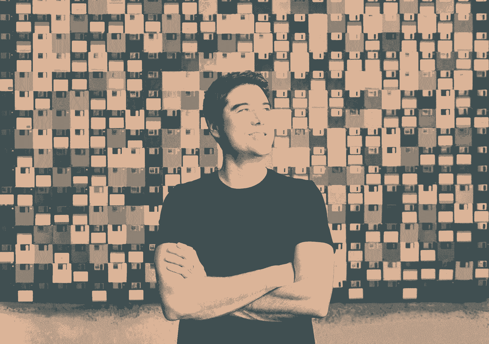

# 在做了 15 年的产品负责人、首席执行官和风投之后，以下是我一直与未来创始人分享的建议

> 原文：<https://review.firstround.com/after-15-years-as-a-product-leader-ceo-and-now-vc-heres-the-advice-i-always-share-with-future-founders>

## 介绍

Gmail 的用户界面。脸书的新闻源。Twitter 的时间线。Dropbox 自下而上的收入引擎。在他 15 年的职业生涯中， **[托德·杰克逊](https://www.linkedin.com/in/toddj0/ "null")** 帮助打造了数亿人每天都在使用的一些最大的科技产品。他是 hypergrowth 的关键项目经理，是负责重新设计关键功能的经验丰富的主管，也是带领团队走向 IPO 的稳健高管。但他也扮演过其他角色。在他的初创公司[封面](https://www.wired.com/2014/04/twitter-cover-buy/ "null")中，杰克森是斗志昂扬的联合创始人兼首席执行官，应对筹资、产品/市场匹配和收购等挑战。他还是天使投资人、资深顾问，也是数十家早期消费者和 SaaS 初创公司的第一联系人。

正如我们刚刚宣布的，杰克逊将承担另一个角色。他将正式戴上投资者的帽子，在第一轮作为合伙人加入我们。鉴于新的一年和新的工作标志着反思杰出时刻的最佳时机，我们与杰克逊坐下来梳理外卖，并从这一恒星轨迹中挖掘一些故事。虽然他之前在评论中分享了一些关于[审查项目经理](https://firstround.com/review/find-vet-and-close-the-best-product-managers-heres-how/ "null")和[打造热门产品](https://firstround.com/review/Top-Hacks-from-a-PM-Behind-Two-of-Techs-Hottest-Products/ "null")的经典阅读，但这一次我们想放大一点，因为他正在转型为全职投资者。

这并不是说这将是风投纸上谈兵式的建议，或者有时是半心半意的(当然也是老生常谈的)“让我知道我能帮上什么忙”的口号。如果你在过去的七年里经常阅读这篇评论，希望你会知道这不是我们的风格。[从一开始](https://firstround.com/review/Not-another-VC-blog-First-Round-Review/ "null")，我们就一直专注于分享来自最佳实践者的切实可行的创业建议——这些人实际上已经参与了战壕建设。

杰克逊当然符合这个条件，这也是第一轮合作伙伴急于让他入伙的关键原因。无论你是一个寻找创业想法的有抱负的企业家，一个追求产品/市场契合度的斗志旺盛的团队，还是一个着眼于未来 IPO 推动超增长的更有经验的高管，他最近都在你的位置上。在这次独家采访中，杰克逊分享了他在应对每个创业阶段的挑战时获得的最关键的经验、框架和流程。他对现在和未来的创始人的建议被组织成一个包含四个战术要点的清单，而且仍然是新鲜的。让我们开始吧。

*想了解更多关于第一轮增加合伙人的方法，以及为什么杰克逊认为这是正确的职业选择？一定要看看他最近在 20 分钟 VC 播客* *上与* *[哈利·斯特宾斯](https://twitter.com/HarryStebbings "null")* *(以及第一轮搭档 Phin Barnes)的访谈。*

# 要点 1:生产简单、强大产品的幕后流程

杰克逊的硅谷职业生涯始于 2004 年的谷歌，在那里，他加入了如今广为人知的助理产品经理项目[的第二期。尽管他后来担任了五年 Gmail 的项目经理(带领 Gmail 从测试版发展到超过 2 亿用户)，但他在这家科技巨头的长期工作中最突出的是早期他所围绕的产品建设火力。](https://www.businessinsider.com/what-apm-graduates-are-doing-now-2014-10 "null")

杰克森说:“我和我的老板玛丽莎·梅耶尔(T1)共用一间办公室，我坐在大厅里像 T2、布雷特·泰勒(T3)和 T4·贾斯汀·罗森斯坦(T5)这样的人旁边。”。“那只是加入公司的一个特殊时期。谷歌地图、GSuite 和云平台当时还不存在，甚至大多数谷歌员工也不在工作中使用 Gmail 每个人都还在使用 Outlook。因此，从一开始，我就对谷歌最优秀的领导者如何进行产品开发有了难以置信的深入了解。”

如果他必须将这种经验提炼为创始人和产品负责人的一个要点，那就是:**打造真正高质量的产品需要大量的幕后训练，尤其是在你的团队成长的时候。**

“大多数创始人一开始都非常关注产品的卓越。但随着产品和功能集的扩展，策略开始偏移，臃肿慢慢出现，用户体验显著下降，”杰克逊说。“在实践中，我发现你可以**通过识别并专注于你的产品的两到三个最重要的品质，来确保纪律保持在前沿和中心。在谷歌，这些品质是速度、简单和强大。**

为了说明对这些品质的关注是如何在实践中发挥作用的，杰克逊分享了他在谷歌工作期间的战术实例:

# 简单点，把分数加起来。

“玛丽莎·梅耶尔的 UI 审查会议仍然是我参加过的最严格的内部流程之一，”杰克逊说。“每周，你会把新产品模型放在她和一个高级设计师委员会面前，她会检查每一页和每一个像素。反馈可能会令人沮丧，但它奏效了。”

杰克逊记得有一次，他带了一个原型来检查，梅耶尔告诉他太忙了。“玛丽莎告诉我，每当我使用一种新的字体、字体大小或颜色时，都要回去加一分——整个页面需要保持在五分以下才能发货，”他说。“她在制作简单产品时非常严谨，我忍不住从她身上学到了这一点。”

# 不要牺牲质量，即使这意味着在最后一刻放弃你的工作。

他在 Gmail 上的工作经历与此相似。“Gmail 工程团队是坏蛋，他们不会容忍一个愚蠢的项目经理试图推出半生不熟的功能。杰克逊说:“在担任 Gmail 项目经理的五年多时间里，我学会了如何设计功能，并一遍又一遍地对它们进行改进，以保持轻便快捷的体验。

“推出新产品或新功能的门槛非常高。任何不简单、不强大、不具性能的东西都不会出现。当我说我们在第 11 个小时暂停项目是因为我们无意中让一个动作慢了 30 到 40 毫秒，或者让体验稍微复杂了一些，我不是在开玩笑。”

我合作过的最好的产品领导都非常注重质量，并且有坚定的意愿确保事情不会倒退。每一个新功能的推出都需要一个坚定的用户体验保护者。你的团队里没有吗？你刚找到一份新工作。

# 对速度保持警惕，即使你不得不停止一切。

但产品负责人和创始人也需要养成习惯，退后一步，从更高的高度评估这些属性。“大约在 2009 年或 2010 年的某个时候，拉里·佩奇受够了所有 GSuite 属性的加载时间。杰克逊说:“许多基于网络的产品在成长过程中都会经历这一过程。“大量新用户使服务器不堪重负，而越来越多的工程师、项目经理和设计师团队正忙于为产品添加功能和代码，这两个因素加在一起，可能会开始产生负面影响。这是公地的悲剧。如果你不时刻关注性能，你的应用就会陷入困境。”

许多人试图挤出时间进行维护和偿还技术债务，同时继续推进正在进行的创新工作，但佩奇采取了更激进的方法。“他基本上说他已经受够了，并把每一个谷歌应用程序，从 Gmail 到 Docs 到电子表格，放在**上，完全冻结功能，直到所有应用程序在一秒钟内加载完毕**。不管你有什么大胆的新想法，你现在的工作是提高性能。整个季度的路线图都被搁置了，”杰克逊说。“因此，即使作为项目经理和设计师，我们也开始帮助开发以性能为导向的功能。这就是后台附件上传程序和首次打开 Gmail 时看到的加载页面等功能的起源。出于调试的目的，我们最初实际上只是为自己添加了加载页面，所以我们可以看到加载序列中哪里变慢了。但后来用户似乎很喜欢它，所以我们就把它留了下来，今天还是一样，”他说。

“当时，Larry 的要求让我感到有些不安，也许看起来有些极端，但回过头来看，我对他愿意说‘速度是我们最重要的特性，我们所有的内部开发流程实际上都在侵蚀它，所以如果需要的话，我会用锤子解决问题’的程度印象深刻。”"

那么，这是否意味着停止、放弃并专注于速度(或任何其他产品特性)总是好的建议呢？“你不能太频繁地踩紧急刹车。杰克逊说:“这是一种需要谨慎使用的领导技巧。“但一旦被启用，它可以成为一种强有力的方式，让所有人迅速朝着同一个方向前进。任务的简单性是关键——组织中的数百人可以立即看到需要做什么。”

# 要点 2:释放产品/市场契合度的框架

作为天使投资人和许多初创公司的顾问，杰克逊喜欢每隔几周与创始人和他们的产品负责人会面的节奏。他们的会议通常涵盖他所说的产品的两个关键部分:

产品战略和[产品/市场契合度](https://firstround.com/review/how-superhuman-built-an-engine-to-find-product-market-fit/ "null")

随着团队的成长，产品开发和[管理有效的内部团队](https://firstround.com/review/how-to-craft-your-product-team-at-every-stage-from-pre-product-market-fit-to-hypergrowth/ "null")(深入目标、路线图、里程碑和指标)。

“我被问到的第一个问题可能是如何找到产品/市场契合度。但是在我们深入研究框架或具体策略之前，我总是要求初露头角的创始人支持。因为在寻找产品/市场时，你所做的最重要的选择是在你开始之前——当你确定要去的正确市场时。杰克森说:“除了[选择你的联合创始人](https://firstround.com/review/the-founder-dating-playbook-heres-the-process-i-used-to-find-my-co-founder/ "null")，这是一个创始人做出的最重要的决定，也是一个容易出错的决定。

他经常看到的一个更具体的陷阱是，许多产品经理出身的创始人直接进入了执行模式。“他们想到一个想法，很快就开始建造一个原型，然后有时动力和建造的兴奋会占据上风。他说:“虽然作为项目经理，你获得的运营重点和纯粹的执行力是巨大的优势，但你最好先退一步，想想你选择的市场和你要解决的问题是否足够大。”

这就引出了一个明显的后续问题:**创始团队如何判断一个创业想法是否值得追求？当杰克森于 2012 年离开脸书，开始从大到小的创业飞跃时，他正面临着同样的困境。“我的联合创始人埃德·何和我知道我们想要创业。我们知道，从在谷歌的时候起，我们就合作得很好，我们对相同的消费者领域非常感兴趣。但我们最终追求的——后来成为 Android 的封面——实际上是我们的第三个想法，”杰克逊说。**

“我们的第一个想法是在体育领域。我们设计了一些东西，与一群从事体育相关工作的企业家交谈，我们意识到这是一个很难竞争的市场。我们的第二个想法是一个照片分享应用程序。当时，Instagram 很流行但并不占主导地位，Snap 几乎不存在。我认为那里还有很多有趣的事情要做，但最终我们被投资者说服了，他们说，“即使这是下一个伟大的照片应用，你如何说服任何人呢？”不仅仅是用户，还有你需要招聘的工程师等等。"

为了对这些想法(以及最终被淘汰的想法)进行压力测试，杰克逊和他的联合创始人依赖于以下框架——直到今天，他仍在指导未来的创始人。

# 如果你是一个有抱负的创始人(或者只是一个在你的 Notes 应用程序中有一系列公司想法的人)，根据以下标准评估创业想法:

功能需求:它是否解决了用户明确的功能需求？这通常是他们尝试的原因。

**情感需求:**它解决了用户的情感需求吗？这通常是他们会告诉别人这件事的原因，这开启了至关重要的病毒式口碑增长循环。

**十几亿美元的市场:**这是一个规模庞大、服务水平低下的市场吗？还是在一个可以变大的市场？这影响到方方面面，从你的融资能力到谁有兴趣收购你。

突破 UX:用户体验有什么新奇或独特的地方吗？用的时候是不是感觉有点像魔法？最后一个不是绝对必要的，但它非常有用，许多成功的产品在发布时都有它。

“我接触过的大多数创始人都没有如此深入地思考过他们的想法。他们有一个想要解决的高层次问题，但尚未将其映射到客户的功能和情感需求**。如果你不进行这样的练习，你就有可能开发出一个很好的产品，而不是一个必须的产品——这将使产品/市场更加遥不可及。杰克逊说:“这项练习迫使你说出需求的名称，然后压力测试这些需求是迫切的，还是仅仅是有求必应。“功能部分通常更明显，但情感部分可能会很棘手。你的客户一般不会或者不会自己命名。你必须探究他们的感受，并将他们所说的转化为产品。”**

如果你在坐在一个大市场上，利用突破性的用户界面，想出同时满足人们功能需求和情感需求的点子，那才是真正好公司的秘诀。

下面，Jackson 向我们展示了这个框架的几个应用实例:

Instagram :“这很容易忘记，但在很早的时候，大约在 2010 年或 2011 年，许多人喜欢能够轻松地将手机中的照片立即上传到脸书、Twitter、Tumblr 和其他网络的功能。从情感上来说，滤镜让你的照片看起来很酷(所以你*发布它们会觉得*酷)——尤其是在 iPhone 相机不如今天这么好的早期。随着手机变得无处不在，相机质量稳步提高，显然还有一个非常大的市场。最后，一键式滤镜用户界面使 Photoshop 风格的编辑变得简单易用。”

**[滑翔](https://www.glideapps.com/ "null")** **:** “去年第一轮投资这个团队。Glide 可以让你在几分钟内从谷歌表单创建一个应用程序。更容易地创建优秀的应用程序和移动体验是一种功能需求。情感上的需要是，它把一些感觉是禁区的东西转化成一种创造性授权的感觉，你可以*在没有超级技术背景的情况下*建造东西。我认为我们已经从像 Webflow 这样的例子中看到了无代码产品背后潜在的巨大市场。最后，突破性的 UX 是从电子表格到应用程序的流程——真的感觉像是魔法在起作用。

**封面**:最后，他自己的创业公司:“在功能上，我们给了 Android 用户一种简单的方法来组织他们的应用程序，并取代了笨重的姜饼股票 UI，使他们的锁屏更时尚，更智能。通过专门为 Android 用户打造，我们挖掘了他们的情感需求。他们常常觉得自己是二等公民。“只在安卓上可用”成为铁杆用户分享应用程序并感到自豪的战斗口号，”杰克逊说。“此外，Android 是一个巨大的市场，但它也严重缺乏服务——几乎没有硅谷公司关注它。大多数创业公司将其视为 iPhone 的补充。最后在 UX 前线，很多[封面的特色](https://www.youtube.com/watch?v=chUtv1kWIg8 "null")和设计理念在当时都相当新颖。”

当然，在你构建产品的时候，专注于那些功能和情感需求需要很大的努力。“即使论文在望，你也需要做些跑腿的工作，以确保你深入了解你的客户。杰克逊说:“我和数百名 Android 用户交谈过，使用的策略包括在 Craigslist 上招聘人员，以及在星巴克里设立用户研究桌。

“我听到的很多情况是，他们希望自己的手机能升级到更好的东西，而不用花更多钱买新手机。一旦我们确定了这些核心需求，我们就设计应用程序的每一个功能来满足它们。我们用一个核心测试社区迭代了一堆，当我们公开发布应用程序时，它增长得非常快。口碑真的很好，因为那种情感联系。在最初的几个月里，我们的用户增长到了 200 多万，而付费购买的费用为零。”

# 外卖#3:被收购——运行一个严密的流程并思考来世

导航收购要约是创始人可能面临的另一个棘手挑战。有几个不确定因素在徘徊。你应该卖掉还是继续前进，期待未来会有更大的收获？你应该卖给谁？收购后的生活会是什么样子？

杰克逊公开了他出售自己的初创公司的经历，以示启发:“在掩护下，大约有十几家公司与我们接触，他们都认为自己知道 Android 有多重要，但并不具备这方面的内部专业知识。我们得到的故事是‘我们知道 Android 很大，但我们不理解它。“你为什么不加入我们，让*成为我们的安卓战略呢？”他说:“这就是重点。*

他们在 2014 年选择向 Twitter 出售封面，加入领导社交媒体平台的 Android 工作。“事后看来，这似乎是一个万全之策。我们在市场火爆的时候卖出了，我们在 Twitter 找到了一个好位置。对于团队和我们的投资者来说，这是一个很好的结果。在我们内心深处，我们对我们作为一家初创公司的做法的长期可行性有些担忧，因为我们太依赖于另一家公司拥有的单一平台，”杰克逊说。

“但我们发展很快，而且我们的大部分种子资金还在银行里，所以我们肯定有能力继续前进。当然，仍有一丝遗憾，那就是我们没有真正做大。加入 Twitter 极大地改变了我们的个人梦想和计划。这就是为什么创始人们一开始没有一致决定出售。作为我们的投资者和董事会成员，乔希·科佩尔曼确实帮助我们度过了难关，最终我们都认为收购是有意义的。我想今天我还是会做出同样的决定。”

在这里，杰克逊从自己的收购经历中总结了两点，他经常与面临类似选择的创始人分享:

**流程**。“我们控制了时机，并在不同的潜在收购者之间制造了竞争。我们让他们都保持大致相同的时间表。我们告诉他们，我们不打算出售公司，但为了我们的员工、投资者和我们自己，我们有义务公开讨论。但为了不让它分散我们的注意力，我们想把所有的讨论都限制在三周的时间内，在这一阶段结束时，我们将决定是否出售，”杰克逊说。“所以我们用几乎相同的方式运行它[你会想作为一个企业家运行一个筹资过程](https://firstround.com/review/the-fundraising-wisdom-that-helped-our-founders-raise-18b-in-follow-on-capital/ "null")。”

**善后**。“我试图向考虑被收购的创始人传达的主要信息是，收购发生时听起来很迷人，但一旦你被收购，你的角色就是为你现在所在的更大公司服务。如果组织的需求发生变化，那么您所了解的情况和收购策略也会发生变化。这就是发生在我们身上的事情，”杰克逊说。“作为收购的一部分，我们被请来领导 Twitter 的 Android 战略和执行，我们花了最初几个月的时间来做这件事。但不久之后，我和我的联合创始人都被内部拉向了不同的方向。我被要求领导 Twitter 内容发现团队的产品，而我的联合创始人 ed 被要求领导客户端平台团队的工程。因此，虽然我们最终产生了巨大的影响，但并不是以我们最初设想的方式。这就是你需要期待的，”他说。“除了这些不断变化的优先事项之外，Twitter 的发展确实有点艰难。但最终，我很高兴我的历史中有它，这样我就有了一些第一手的知识来指导创始人。”

# 要点 4:向 IPO 扩展所需的纪律和策略

2015 年，杰克逊开始了另一段具有挑战性的经历，他在 Dropbox 上市前夕签约加入该公司，担任该公司首位产品和设计副总裁。“Dropbox 可能是我做过的最紧张的工作。这甚至比成为一名创始人还要紧张，这真让我吃惊，”他说。

“在成为创始人的早期，你完全可以掌控自己的时间。什么都没用，你拼命地想造一个产品，招人，让所有的球都悬在空中，但至少感觉你在驾驶座上。但是，如果你幸运的话，当火箭飞船开始起飞的时候，你就会从控制事物变成控制你的事物(T3)。IPO 前的两到三年是一家公司最紧张的时候。当你沿着这条道路前进时，董事会和投资者的期望是如此之高。你被誉为下一个十岁男孩，尽管感觉公司内部还没有达到那个水平。”

从这次经历中走出来后，杰克逊渴望帮助创始人做些必要的跑腿工作，让他们有更好的立足点。他说:“在帮助一家数千人的公司准备 IPO 的过程中，我最大的收获是，**你需要深入理解、提炼和阐明你的产品战略和收入增长模式，** ***年*****”。**

**“确保你的产品策略不仅考虑到你将如何扩展现有业务，还考虑到你将如何在新市场中竞争。它还需要非常明确地与您的走向市场剧本相结合，以便您的增长变得可预测。这才是公开市场真正看重的——也是你了解你的业务杠杆在哪里的方式。**仅仅有商业模式是不够的。你实际上需要能够预测** ***预测*** **那笔生意****

**试图为首次公开募股做好准备是不可能的。尽可能快地开始，清楚地阐明你的战略，并用它来推动你的内部能力和系统。**

**“Dropbox 是最早定义如今被称为自下而上的 SaaS 的公司之一。但当我在 2015 年加入时，这还没有完全到位。我们的大部分收入来自个人消费者，而不是企业。杰克逊说:“我们知道这可能无法维持我们需要的收入增长率，我们需要做出一些艰难的内部权衡。”**

**他以自己作为产品副总裁的第一项正式任务为例。“2015 年，我们在关闭这款名为 Carousel 的产品的决定中挣扎，这是一款漂亮的消费者照片分享应用程序。它在一些圈子里非常受欢迎，我们有很多人在研究它，但它并没有以一种可以推动公司发展的方式发展。对我们内部来说，这是一个关键时刻——我们是否有能力支持和投资公司这一面向消费者的部门，或者我们真的需要扭转局面，100%专注于我们的 SaaS 业务？”杰克逊说。**

**“我们选择了后者，回想起来这是一个明智的决定。在 2016 年和 2017 年，我们非常专注于了解我们的整个漏斗，从收购和激活到保留和扩张。我们能够建立一个非常高效的自助服务企业。这使我们能够获得对我们 2018 年 IPO 至关重要的收入可预测性。”**

**为了深入了解该团队如何在短短几年内实现这一目标的更多细节，Jackson 分享了他们依靠的一个有用的工具:“我们受到 AG Lafley 和罗杰·马丁在 *[中阐述的框架的启发，为赢得](https://www.amazon.com/Playing-Win-Strategy-Really-Works/dp/1491528796 "null")* 而战。它认为，你的战略不是什么神秘的概念，而是一组简单的关键选择，这些选择在五个主要方面相互加强:**

****你的获奖愿望是什么？**你企业的目的，是激励人心的抱负。**

**你会去哪里玩？一个你可以实现抱负的竞技场。**

****你将如何获胜？**你在选择的游戏场上获胜的方式。**

****必须具备哪些能力？**以选定的方式取胜所需的能力集和配置。**

****需要哪些管理体系？**实现能力和支持选择的系统和措施。**

**“我们需要认真审视我们目前的业务，它横跨消费者和企业两个领域，并决定朝哪个方向前进，”他表示。“这个框架确实将这些辩论带到了前台和中心。我们在消费者照片领域有传统，但一旦我们通过[设计一种更开明的工作方式](https://www.dropbox.com/about "null")实现了成为价值数十亿美元的 SaaS 上市公司的成功愿望，我们就需要做出不同的选择，特别是围绕“在哪里玩”和“如何赢”"**

**这意味着更加专注于围绕文件共享和内容管理的企业用例。“我们在像 [Smart Sync 和公司 Dropbox](https://www.dropbox.com/smart-sync "null") 这样的项目上进行了大量投资，以使大型团队能够在 Dropbox 中存储万亿字节的公司数据。杰克逊说:“这远远超出了我们消费者产品的复杂性，因此需要数年的大量工程投资。”。“我们还决定扩展到我们在组织文档方面的优势领域。对 [HelloSign](https://blog.dropbox.com/topics/company/dropbox-is-acquiring-hellosign-to-improve-document-workflows-for "null") 的收购，以及最近围绕 [Dropbox Spaces](https://blog.dropbox.com/topics/product/introducing-dropbox-spaces "null") 的公告和跨 SaaS 其他工具的集成都源于此。”**

**这也需要团队改进和完善自助式走向市场活动。“我们的整个‘如何取胜’剧本都围绕着一个关键观点，即我们的核心产品和共享功能使我们在公司中脱颖而出，但产品内追加销售和我们的销售团队使我们得以扩张，”杰克逊说。“我们构建了产品功能，使人们可以轻松地开始在团队中使用该产品，并将他们的帐户升级到 Dropbox Business。我们所有的销售努力，无论是对内还是对外，都是为了激活我们已经看到有机使用的公司。”**

**为了实现这些选择，正如框架所建议的，领导团队必须专注于建立一套内部能力和管理系统。“我们围绕该战略的关键部分组织了我们的 EPD 团队。例如，我们组建了一个大约 100 人的大型‘支柱’，专注于大型团队用例的 Smart Sync 和公司 Dropbox，”Jackson 说。“我们还将我们的增长营销团队与 EPD 联合起来，组建了一个由工程师、营销人员和分析师组成的跨职能团队，以寻找机会追加销售我们的业务计划。这个团队变得非常擅长预测每个季度的增长。”**

**清晰地阐述你的关键选择，确定你的产品战略和收入增长战略，并确保这些选择相互补充。**

**“当涉及到一个新的想法或战略时，很容易专注于执行和实验。但是，没有充分考虑战略重点是很危险的。我建议你尽早做这项工作。杰克逊说:“这样一来，当你考虑首次公开募股时，你已经锻炼好了内部肌肉，可以像钟表一样正常运转了。”。“当你是一家 B 轮创业公司时，这可能看起来太麻烦，过程太繁重——坦率地说，即使在 Dropbox 也有这种感觉。但是当你越来越大，你将需要一个宽阔的泊位来使船转向。战略支点在千人公司中不容易实现。**

# **展望下一章的课程**

**当杰克逊从球场上的球员转变为角落里的教练时，像这样的教训将会得到很好的利用。“过去一年半的时间里，我一直在为创始人和天使投资提供建议，以此来了解担任教练角色而非运营角色是什么样的，”他表示。“作为一名投资者，在过去的五年里，我偶尔会成为一名投资者，但在过去的 18 个月里，我变得更加投入——很明显，你需要进行一些非常戏剧性的思维转变。”**

**然而，即使在杰克逊获得了一些初步的知识并决定全职投资之后，决策树上还长出了其他几个分支。“我应该尝试筹集自己的基金，继续做天使还是加入现有的基金？这个十字路口把我带回了我作为一名创始人进行筹资的日子。他说:“在我们为 Cover 筹集种子资金的过程中，我们与 50 多位投资者进行了交谈——天使投资人、种子基金和大型沙丘路公司。**

**“在这个过程的最后，我们遇到了第一轮和 Josh Kopelman，所以我们对所有其他风投公司的情况有了很好的了解，并立即觉得第一轮对我们来说是正确的。他们对种子基金的高度关注从其他多阶段基金中脱颖而出。我认为，创始人有时会忽略这一点——种子期公司帮助你准备并运行一个真正的首轮融资过程，而不是让你觉得亏欠于一只基金。**

**运营团队的实力也脱颖而出。他们帮助我们进行营销、定位和发布，社区活动让我们与和我们经历完全相同旅程的其他创始人直接、频繁地接触。最后，他们作为一群以服务为导向的、善良的人类脱颖而出。当涉及到价值观时，我们从来没有感到不一致。"**

**快进到他今天关于如何追求投资者职业生涯的决定，杰克逊知道他正在寻找这种一致性，以及一种缩短新投资者学习周期的方法。在我职业生涯的每一个阶段，当我身边有伟大的导师和队友时，我发展得更快，学到的也更多。杰克逊说:“加入在投资生涯上领先我 5 到 10 年的合伙人，让我可以向他们学习，这似乎是一个难以置信的机会，我想不出比第一轮更好的地方了。”。**

**“我最喜欢乔希·科佩尔曼的一句话是，‘我会一直给你我的直言不讳的意见，但最终你会得到我坚定不移的支持。’这是我作为一名创始人处理与投资者关系时觉得最有帮助的地方，也是我最乐意向第一轮合作的斗志昂扬的创始团队传达的东西。"**

***摄影由* *[邦妮雷伊米尔斯](http://www.bonnieraemillsphoto.com/ "null")* *。***