# 一位首席执行官如何度过公司建设的前两年的详细分析

> 原文：<https://review.firstround.com/an-exact-breakdown-of-how-one-ceo-spent-his-first-two-years-of-company-building>

## 介绍

*[山姆·科尔科斯](http://twitter.com/samcorcos "null")* *是* *[Levels](http://levelshealth.com "null")* *的联合创始人兼首席执行官，这是一家利用实时生物数据向你展示食物如何影响你的健康的生物可穿戴公司。在创建关卡之前，他是 CarDash (YC'17)的创始人。*

人们经常想知道初创公司的首席执行官是如何打发时间的。嗯，我有一点强迫症，我会记录每 15 分钟我是如何度过我的时间的，多年来我一直虔诚地这样做。一点背景知识——作为一个四次创业的人，我一直在公司的技术方面，或者作为个人贡献者或者领导工程团队。我担任 Levels 首席执行官的角色是我的第一个非技术性角色。

在我安装了一个应用程序后，我开始更认真地记录我的时间，令我震惊的是，我发现我每天花在社交媒体上的时间超过三个小时，还有几个小时花在看新闻上。这尤其令人惊讶，因为如果你问我在这些事情上花了多少时间，我会猜大概一天 20 分钟。它促使我在如何度过时间方面做出一些重大改变。

有意识地管理时间也迫使我对自己在给定的时间内能完成多少事情持现实态度。作为一名创始人兼首席执行官，你似乎要花费无穷无尽的时间。我发现，通过严格跟踪我的时间，如果我在对业务最重要的领域花费了适当的时间，我就能不断地把握脉搏。

因此，本着 Levels 成立两周年的精神，我想我应该分享一下我头两年是如何度过的，并有数据为证。我的目标？对于那些希望成为初创公司首席执行官的人来说，你可以深入了解在创建公司的道路上，你可能会如何度过自己的时间。**这篇文章对我想如何度过我的时间并不乐观，也没有经过净化；这是对过去两年我实际上是如何度过时间的一个真实的观察。例如，这是我写这篇文章时的日历。**

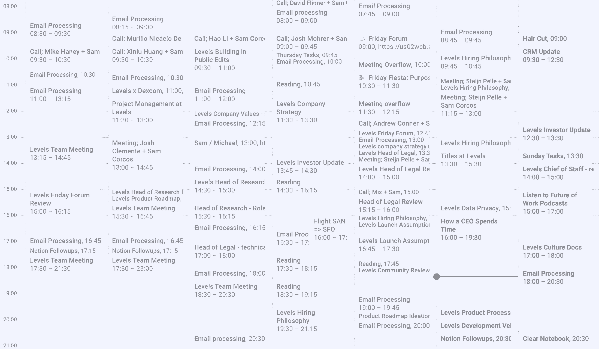

当你申请一家初创公司的首席执行官职位时，你应该知道自己将面临什么。大多数时候，这是一项耗费精力的工作，尽管有些人能够在保持工作与生活平衡的同时做到这一点。这篇文章的目的不是美化工作到筋疲力尽的地步——但也不要指望这是一份普通的案头工作。

在这篇文章中，我通过深入分析这些数据，揭示了我最大的一些惊喜——以及这些数据对创业公司首席执行官不断变化的角色有何影响。我走过一些常见的陷阱，我看到其他首席执行官陷入其中，这些陷阱抑制了他们的影响力和公司的发展。我还将深入介绍我是如何在业务的每个领域花费时间的，以及这是如何在构建级别的每个阶段发生变化的。在这个过程中，我将提供大量经过测试的策略来实现你自己的系统，以优化你作为 CEO 的时间。让我们开始吧。

# 作为首席执行官身兼数职的艺术

在我们深入研究数据之前，先来看一些观察。回顾我最初两年的生活，我最大的惊讶可能是，在公司历史的不同时期，首席执行官的角色是如此多变。从数据中可以清楚地看出一点:首席执行官身兼数职。

我所花的时间随着公司需求的变化而波动，我必须随时做好准备。有几个月，我承担了有意义的工程责任，还有几个月，我主要是做销售，还有几个月，我负责筹集资金。这些不断变化的优先级和可交付成果会让你很难知道你是否正确地分配了时间。

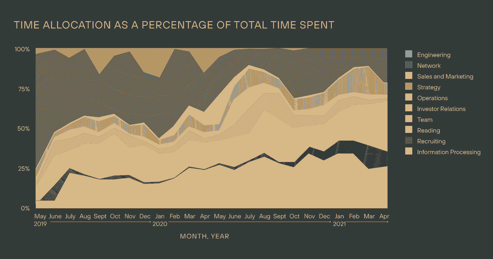

## **解除别人的封锁是你的首要任务**

但是不管你关注的是筹资、销售还是产品，作为首席执行官，你要对整个组织的产出负责。在我目前在公司的角色中，我认为自己是一个信息路由器，所以我的主要工作是疏通团队中的其他人，使他们以最高效率运行。

如果公司是一台蒸汽机，我的工作就是充当润滑剂——除了确保所有其他部分运转顺畅，我没有任何真正的可交付成果。

如果我发现工程团队因数据完整性问题而受阻，或者增长团队因缺乏明确的公司战略而困惑，或者产品团队因缺乏流程而放缓，我的工作就是介入并在需要的地方提供支持。

我经常会在谈话中发现一些让公司慢下来的事情(例如，运营团队花太多时间手动协调订单)，这导致我在接下来的一周中留出大量时间来解决问题。

**外卖#1** :你应该主要是一个信息路由器，你需要把沟通作为重中之重。每天划出重复的时间段来处理电子邮件。我知道我每天需要处理 3-4 个小时的电子邮件，以便保持沟通，所以在我的日历上添加这些块迫使我对在给定的一周内我实际上可以做多少其他工作保持现实(见下面五周后我的日历截图)。不要把沟通当成事后的想法。这是你的主要工作。

要点 2:确保你的带宽是开放的，并且总是设法让自己变得多余。只有在你有可用能力的时候，你才能看到公司的差距在哪里。如果你太专注于自己的成果，你就有只见树木不见森林的风险。一个具体的战术建议是，如果你发现你经常有分配给你的行动项目和可交付成果，你应该设法找到一种方法把它们交给其他人。这要么意味着你不够信任你的团队，不能将项目委托给他们，要么意味着你需要雇佣一个具备所需技能的人来执行那些可交付成果。

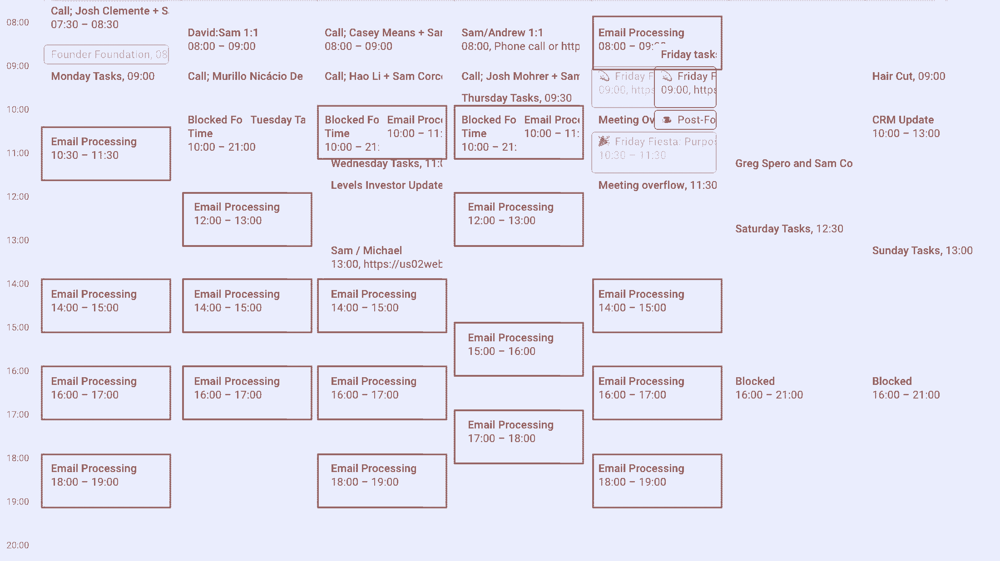

## **丢掉你的待办事项清单**

[成为时间管理大师](https://review.firstround.com/our-6-must-reads-for-honing-focus-and-managing-your-time "null")应该是你的核心能力之一。你将会有很多球悬在空中，你需要确保你不会让它们掉落——或者至少，确保它们不会无声无息地掉落*。以下是我学到的一些时间管理原则。*

*我管理时间的能力最大的提高来自于用我的日历作为我的待办事项清单(并随后杀死我的待办事项清单)。取消我的待办事项清单还带来了意想不到的结果，大大减少了我的个人压力和焦虑——这是我有史以来最大的心理健康胜利之一。*

*待办事项清单的问题在于，它们会导致对你能完成多少事情的不切实际的乐观，因为待办事项清单上的项目不受现实的约束:时间。*

*我过去有过度承诺自己的习惯，这成了我生活中焦虑的主要来源，因为我到处丢球，这导致我在最后期限到来时让很多人失望。从战术上来说，现在的工作方式是，如果有人让我做某件事，或者如果我有一项任务需要完成，我会在日历上划出完成这项任务的时间。*

*当人们现在问我，“你能在周五之前完成吗？”我可以很容易地看着我的日历，然后回答，“我这周正好有两个小时空闲，所以如果要花两个多小时，我们就必须改变我的优先事项，否则我要到下周才能完成。”对我的时间有如此清晰的认识是一个巨大的胜利。*

*我还发现，以这种方式使用日历有助于突出我的优先事项。我的日程表经常提前一两周排满，能够退一步看看下周我要做什么让我问自己，“这些事情真的是对我时间的最高最好的利用吗？”答案通常是否定的，这导致我将事情交给团队中更适合解决问题或完全终止项目的其他人。这是一个有用的强制函数。*

*另一个好处是，将你的日历作为待办事项列表，可以更容易地完成循环，并向人们提供状态更新。例如，假设你已经承诺在周二之前完成某件事(并将其添加到你的日历中)，但是事情发生了，你无法在到期日之前完成它。用日历作为你的待办事项列表，你不得不将该行动项目移到不同的日子，这是一个提醒，提醒你去联系那些希望在周二完成的利益相关者，让他们知道你已经落后了。*

***外卖**:杀死你的待办事项清单，用你的日历代替你的待办事项清单。如果你从这个作品中选一个行动项目，应该是这个。*

## ***不要让近期决定优先***

*我为许多初创公司提供建议，其中许多是由第一次创业的人经营的[。我看到的与时间管理相关的最常见的问题之一是，他们有一系列重要的任务，这些任务经常被收件箱里看似紧急的任务打断。重要的是要保持一个清晰的焦点，让你的公司向前发展，不要让闪亮的物体分散你的注意力。](https://review.firstround.com/the-first-time-founders-guide-to-learning-everything-the-hard-way "null")*

*作为 CEO，你的工作是建立消防部门，而不是灭火。如果你经常自己灭火，那你就做错了。把你的时间集中在如何让你团队中的其他人自己灭火上。*

*如果你发现自己不断被拉向不同的方向，你应该反思为什么会这样，并做出一些改变。如果是因为你的团队中没有你可以信任的人来独立解决这些问题([比如运营总监](https://review.firstround.com/make-operations-your-secret-weapon-heres-how "null"))，那么你需要立即招聘这个职位。如果是因为你很难区分紧急和非紧急的问题，我发现问自己下面的问题可以澄清一些事情:**如果一年后我们回顾这个决定，这个决定会毁掉公司吗？***

*答案通常是否定的。创业公司都是死路一条，所以你必须无情地优先考虑那些让你活下来的事情。那是首席执行官的工作。*

***要点**:你正在使用的沟通工具可能是造成这个问题的原因。短信，尤其是 Slack 可能会造成很大的破坏，因为如果你没有在收到信息后立即采取行动，它很可能会消失在信息消防水管中(不像电子邮件，它更容易分类)。我建议使用像电子邮件这样的异步工具作为您的主要沟通方式，并关闭 Slack 和其他破坏性工具的通知。如果有人*真的*需要联系你，他们可以给你打电话。根据经验，我可以告诉你，这在实践中很少发生——大多数事情实际上并不紧急。Mailman 是解决电子邮件这个问题的一个很好的工具，它可以让你批量设置电子邮件的发送时间，也就是说，我一天只接收两次批量邮件(下午 2 点和 6 点)。这个工具帮助我保持注意力集中，它治愈了我像老虎机一样强制检查电子邮件的习惯。*

*

Sam Corcos, Co-Founder and CEO, Levels* 

# ***我用来记录时间的准确类别***

*为了进行这种分析，我将我采取的每一项行动进行分类。我将类别的数量限制在 10 个，为了清楚起见，我在下面列出了每个类别的定义。任何不适合现有类别的东西都被归入操作类。*

*根据你在公司的职责，很有可能你会得到一份与我不同的清单。我唯一的建议是将类别的数量限制在 10 个以内——否则，事情会很快失控。*

***信息处理**:包括邮件处理、短信处理、Slack 以及其他形式的沟通。但主要是电子邮件。*

***招聘**:团队建设、面试或其他旨在增加团队成员的事情。*

***读书**:读书的时间。我的目标是每年读 100 本书——正如俾斯麦所说，“傻瓜从经验中学习。我更喜欢借鉴别人的经验。”*

***团队**:和其他人一起工作的时间。这主要包括 1 对 1 和与级别相关人员的通话。*

***投资者关系**:花在与现有投资者互动、准备与筹资相关的事情或与有筹资意向的人交谈上的时间。*

***战略**:思考公司的长期目标，写下公司的理念和原则。*

***销售和营销**:直接向人们销售等级，并出于营销目的进行用户研究。*

***关系网**:与同事或潜在同事联系，这些人打电话的目的不适合招聘或投资者关系。*

***工程**:花在建造东西上的时间。也包括花在产品上的时间，但对我来说，主要是工程时间。*

***运营**:与运营团队一起工作的时间，处理法律文书、税务、人力资源和其他不属于其他类别的任务。*

*考虑到这一点，下面是两年内花在工作相关任务上的总时间的分类:*

**

# ***担任首席执行官的时间:期望与现实***

*从这个练习中得出的最有趣的事情之一是我实际花费的时间与我的预期有多么不同。为了直接比较，这是我的期望与现实的对比:*

*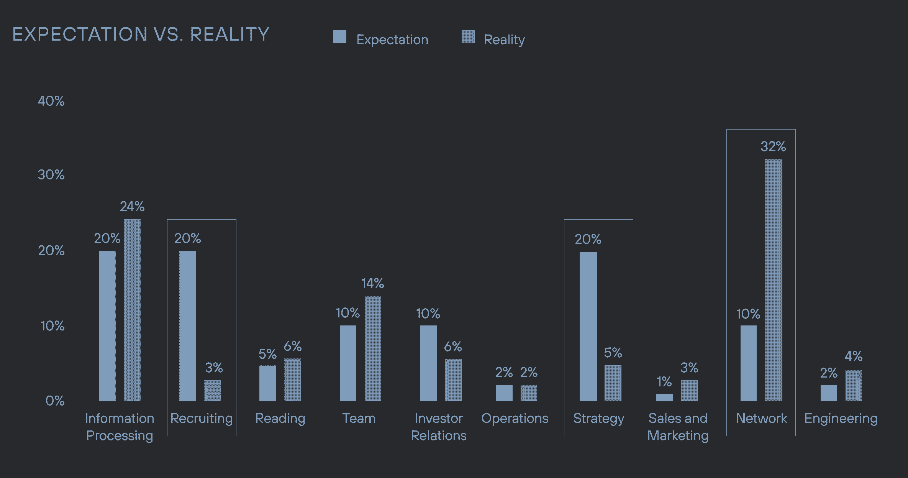*

*具体来说，我花在招聘和战略上的时间比我预期的少了很多，花在网络上的时间比我预期的多了很多。*

*我不得不思考了一段时间。任何内部人士都知道，我们花了很多时间写文档和策略。我个人写了几百页的公司内部战略，然而，这只占我总时间分配的 5%。我认为由此得出的教训是，并不是所有的工作都有同样的情感影响。*

*有趣、轻松或充满活力的工作感觉上占用的时间更少，而要求高或情绪紧张的工作感觉上占用的时间比实际更多。*

*当谈到写(概括了大部分策略类别)时，我发现我必须处于正确的精神状态才能有效地完成它，虽然写一份备忘录可能只需要 30-60 分钟，但通常*会觉得*花了更长的时间。*

*与大多数事情相比，招聘更让我焦虑。找人，不断被拒绝，笨拙地试图获得潜在候选人的介绍并不好玩。我预计我会花大约 20%的时间在招聘上，但事实是我只花了大约 3%的时间。*

***建议 1** :注意你实际花费时间的方式可能与你的预期不同。你可能需要重新确定优先顺序。在我们的例子中，我经常担心我们花了太多时间考虑策略和写文档。任何看过我们战略文件的人都会告诉你，它们非常全面。但是当意识到这只是我 5%的时间时，我意识到我们可能真的是在下*——投资策略。**

*要点 2:有时感觉一项特殊的任务——比如写一份战略备忘录——会花去我几个小时，甚至几天，所以我经常会把它推迟，并对完成它感到焦虑。**知道(通过数据)花在这项任务上的实际时间会相对较少，这有助于我以更好的心态对待工作，换句话说，就是减少情感成本。***

# ***对花费时间的简单观察***

*在过去的两年里，我花了大量的时间进行分级——准确地说是 7922 个小时——这些时间分布在各种不断变化的职责上。不仅如此，随着公司需求的变化，花费的时间和主要职责也在逐月变化。也许不出所料，花在关卡上的时间在 2020 年夏末我们的[种子资金筹集期间达到了顶峰。作为一家风投支持的初创公司的首席执行官，你必须知道你签约的是什么。时间很长，没有太多时间做其他事情。期望你公司的其他人都过着同样的生活方式是不合理的。](https://techcrunch.com/2020/11/17/levels-raises-12m-from-a16z-and-others-to-bring-its-biowearable-to-market/?guccounter=1&guce_referrer=aHR0cHM6Ly93d3cuZ29vZ2xlLmNvbS8&guce_referrer_sig=AQAAALJX36C327AaaudorYIOMMxcQOLhBIDkD2gXJ51eFtgA1M5EiPypTrHqYKhsBXKErp8h1GPiLbIuB_3hka5M0qKsOQ0ZLVW74JWBo8O5BA_KAUzW5ldN4-jaYJSwLQst-5bUSg_0eS9L3m2SFU8RNq8I_bgAxszjAC9DqnRonJNH "null")*

*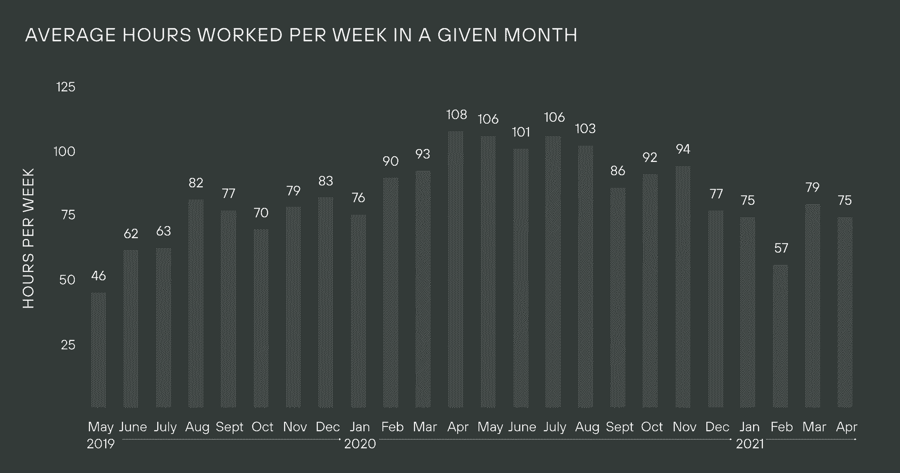*

*现在，让我们更深入地了解每个类别。*

## ***工程***

*在公司的头两年，我有三个不同的时期深入研究工程。在最初的两个阶段，对工程的贡献是我时间的最高和最好的利用，因为我们需要尽快把东西运出去。在第三阶段，很大程度上是因为我没有更好的事情可做(下面会有更多关于这方面的内容)。*

*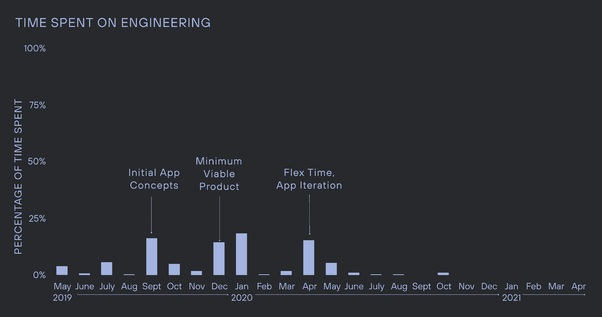*

*第一个阶段是在公司历史的早期，主要是与团队的其他成员一起做概念性的工作和思考基本的架构决策。我们的目标是建立一个我们内部使用的概念证明。*

*工程工作的第二部分是我们推动在年底前为客户提供一些产品:[我们的第一个最小可行产品(MVP)](https://review.firstround.com/dont-serve-burnt-pizza-and-other-lessons-in-building-minimum-lovable-products "null") 。我这段时间做的是个人投稿，拉票，发货代码。*

*我最后一次作为个人贡献者写代码是在 2020 年 4 月。这是 COVID 的高峰期，筹款环境实际上已经停止。因此，我们作为一个团队进行了讨论，看看如果我有额外的能力，我可以在哪里增加最大的价值，我们决定我的时间最好花在工程上。*

***要点**:根据你的公司所处的生命周期，你可能会发现自己在做个体贡献者(IC)的工作。没关系。谦虚一点，认识到有时候这是你能增加价值最多的地方。*

## ***销售和市场***

*一旦我们确信我们有了人们感兴趣的产品，我们就需要获得更多的客户，并更多地了解他们是谁，他们的动机是什么。*

**

*我们与一家营销承包商合作，将一些基本的广告放在一起，以获得我们的第一批入境等候名单注册，并开始进行消息测试。在几个月的时间里，我们花了大约 5000 美元让第一批人接受采访。*

*每次有人注册了候补名单，他们都会收到我的私人邮件，询问他们是否有空打电话。每次有人注册时，我都会收到一封电子邮件通知，我会手动给每个潜在客户发送一封电子邮件。没有什么是自动化的，在早期，几乎每个人都接到我的私人电话——大约 600 个，加上团队其他人的 1000 多个电话。我在 2020 年 2 月开始这些努力，但真正加速是在 5 月。在五月的几个星期里，我每天打 15-20 个电话，每次 30 分钟。*

*这里没有捷径。要了解谁是你的客户，并深刻理解你能为他们解决什么问题，唯一的方法就是直接听到他们的故事。*

*这是一个巨大的时间承诺，但从这段时间中得到的[经验对我们战略的每个方面都至关重要](https://review.firstround.com/why-qualitative-market-research-belongs-in-your-startup-toolkit-and-how-to-wield-it-effectively "null")。正是这些对话形成了我们最初的增长战略、产品路线图和公司内部的所有其他优先事项。*

*例如，正是在这些对话中，我们了解到我们的大多数早期成员花了有意义的时间来听健康和健康播客，并且他们经常使用谷歌搜索与健康相关的信息。这就是我们倾向于播客的原因——在过去的 12 个月里，我们已经做了 200 次播客展示——以及通过搜索引擎优化的内容，因为我们知道我们能够通过这些渠道接触到合适的客户。*

***要点**:对于任何一位首席执行官来说，深刻理解和同情他们的客户都是至关重要的。唯一的办法就是投入工作，和他们交谈。尽管我们已经加入两年了，但我仍然每月与我们的会员通话，以获得他们的第一手经验。我们称之为“社区电话”,通常是我和我们社区的 6-8 名成员打至少一个小时的电话。我倾听他们的经历，他们的痛点，并以此为契机提出新的想法，看看他们如何与我们的成员产生共鸣。不要低估了解人们如何体验你的产品的重要性！*

## ***操作***

*作为一家早期公司(尤其是在非常早期)，我们归类为运营的基本上是“任何不是产品或工程的东西。”*

*在我们经历了 2020 年 5 月销售推动的订单量增加后，我们开始看到我们实施的手动、基于电子表格的系统出现裂缝。我们在几个互不相连的系统之间进行航位推算，我们没有数据的真实来源。我们明知故犯地做出这个选择，让我们度过那个阶段(见[做不可扩展的事情](http://paulgraham.com/ds.html "null"))，但它开始引起真正的问题，所以我们必须修复它。*

*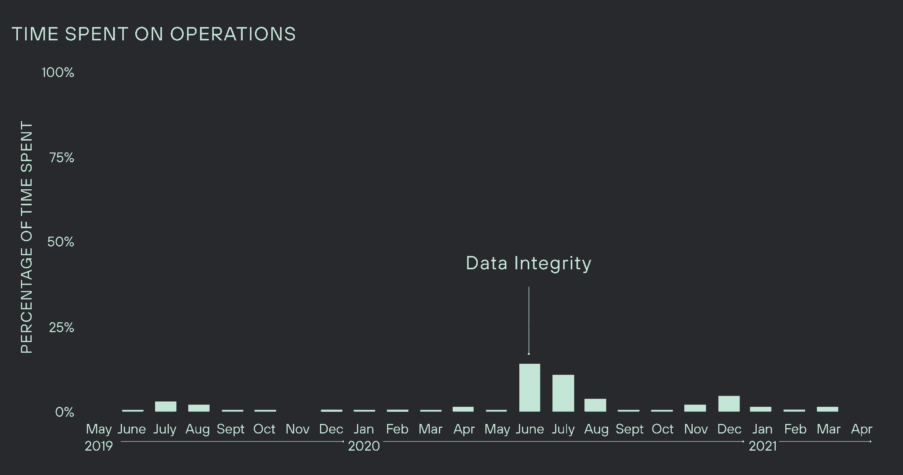*

*团队中没有其他人有足够的带宽和背景来承担这项工作，所以我加入了进来。我在所有平台上手动处理、更新和核对每一条客户记录，一次一条——此时大约有 1，000 条。我建立了仪表板，将我们的真实来源转移到我们的主数据库，而不是 Google Sheets 和其他不同的来源。*

***要点 1** :在早期构建不可扩展的系统是可以的。目标是了解什么可行，什么不可行。电子表格和谷歌表单是很好的起点。直到公司成立一年后，我们才建立起一个合适的数据库。*

***秘诀之二**:作为一名初创公司的首席执行官，你必须擅长(但不一定很棒)每件事。能够投身其中，为公司的每一部分做出贡献，对公司来说是一笔巨大的财富。*

## ***策略***

*我们是一种[备忘录文化，而不是会议文化](https://www.notion.so/levelshealth/How-Levels-Does-Meetings-7494df9281bf4bb8ac16b97a291e4cb6 "null")，我们在长格式文档上投入了大量时间。为什么？**我的信念是** **内容尺度；你的时间不**。我个人已经写了数百页的战略和文档来调整团队。记住内容取代了什么:一遍又一遍地开会解释相同的材料，给人发电子邮件，开会，打电话，看似没完没了的会议…*

*编写好的文档通常会比你预期的花费更少的时间，而且你不需要成为一个大公司就能看到它所带来的信息可伸缩性的好处——以及它为你腾出的处理更有创造性的问题的时间。*

*考虑到这是我们文化的核心，以及我们的文档和知识管理系统是多么强大，我惊讶地发现我实际上花在战略上的时间是如此之少。这是一个有趣的例子，我对所花时间的感知与实际花费的时间非常不同，因为做这种类型的写作需要大量的情感能量。与团队成员的 30 分钟通话感觉起来像 30 分钟，但是花一个小时写一份战略文件*感觉起来像花了一整天。**

*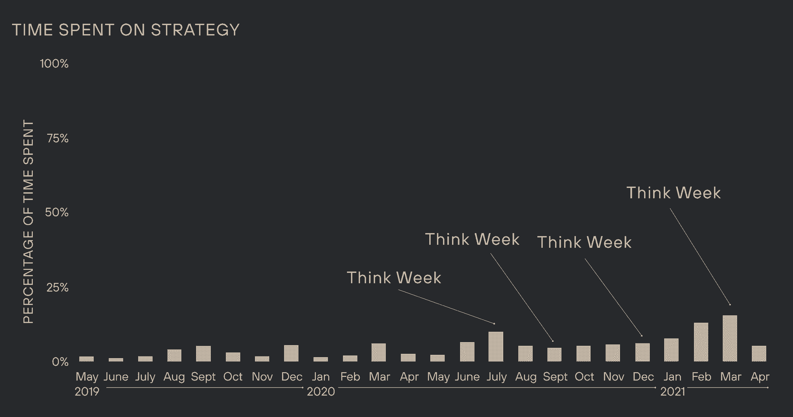*

*我从 2020 年开始做的一件事非常有帮助，那就是和我的兄弟切特一起举办的季度“思考周”。对于思考周，我不参加任何会议或电话，只是花时间思考和写作。我发现，思考周是迫使我从日常事务中抽身出来，更全面地思考公司战略的一个好方法。*

*做了这些之后，这里有一些关于我如何有效地做它们的提示:*

*提前在你的日历上划出时间。我经常提前 2-3 个月在日历上划出整个星期。*

*带其他人一起去。当我试图独自思考几周的时候，我很难保持动力。*

***对与你一起度过思考周的人设定期望，让他们知道没有固定的时间表，集体聚餐等等。，都是可选的。如果你处于心流状态，不要因为社会责任感而打破它。***

*****为邮件设置 OOO 回复，将手机设置为飞行模式，使用[网站拦截器](https://blocksite.co/ "null")来拦截邮件、Slack、Twitter 或任何你认为可能让你分心的东西。这一周没有电话、会议或预期的交流。我通常每天早上查看邮件一个小时，以防我需要解除封锁，但之后我会在一天的剩余时间里关闭邮件。*****

*******打开谷歌文档*开始写*。克服写作瓶颈最简单的方法就是开始写作。通常，我的初稿是一堆杂乱无章的句子片段。但是我发现，如果我坚持下去，想法本身几乎总是会变成有用的东西。*******

*******当你在建立一家公司时，很容易只见树木不见森林。休息一段时间是获得新观点的好方法。*******

*********要点 1** :你花在战略上的时间可能比你想象的要少。如果战略对你很重要(作为首席执行官应该如此)，你可能要考虑重新分配你的时间，让战略更重要。*******

*******要点 2** :用长篇幅写出你的战略不仅有助于迫使你深入思考你的公司，还有助于获得你的团队的认同。套用最近与我们一位新员工的对话，“我觉得在这里工作了两周之后，我比在我上一家公司工作了五年之后，更加了解级别和团队。”*****

*******要点 3** :花一周时间离线思考是一个很好的强迫功能，可以让你深入思考战略并写出大量书面内容。*****

## *******投资者关系*******

*****我们有五位联合创始人，但我们一致认为，鉴于我作为一名多次创始人的经验以及团队的时间效率，我将是唯一一个在筹资过程中花费有意义时间的人。让我们所有的联合创始人都参与进来并不节省时间——他们有工作要做！*****

*****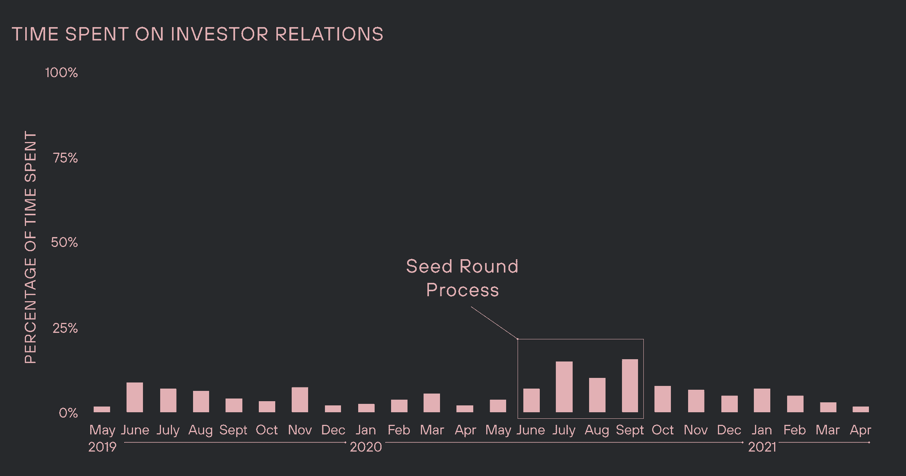*****

*****我最终花在筹款上的时间比我预期的要少——尤其是在我们种子期筹款过程的高峰期——这比我见过的其他首席执行官在时间管理内容中投入筹款的时间要少得多。我的理论是，大多数首席执行官花在筹资上的时间比他们想象的要少，但因为这是一次充满压力的经历，情感成本很高，所以感觉上花了更多的时间。*****

*****这也可能是因为我们花了更多的精力来写下我们的想法，并让我们的投资者(和潜在投资者)了解最新情况。我们每月向特定人群发送投资者更新信息，让他们了解我们一段时间以来的表现，并减少同步“签到”电话的需求。例如，我们已经公开了我们的[内容战略](https://levelshealth.notion.site/Levels-Content-Strategy-January-2021-43003c0ac98f412e82801c985ecc6a17 "null")文档，让你感受一下我们在与投资者分享的文档中的思想深度。*****

*******要点:**用内容来衡量你的时间。除非你喜欢接电话重复回答类似“TAM 是什么？”“什么是客户角色？”以及“你的上市策略是什么？”你应该试着通过写下这些想法并分享书面内容来解决这个问题。我保证这会节省你在筹款过程中的时间——而且它还有一个额外的好处，那就是与你团队中的每个人分享背景知识！*****

## *******招聘*******

*****花时间招募新的团队成员是另一个让我头疼的问题。如果让我猜测我在招聘上花了多少时间，我会说至少 20%，但数据告诉了我一个不同的故事。在一个典型的月中，我会花不到 10 个小时来招募新的团队成员(或者每周 2 个小时)。*****

*****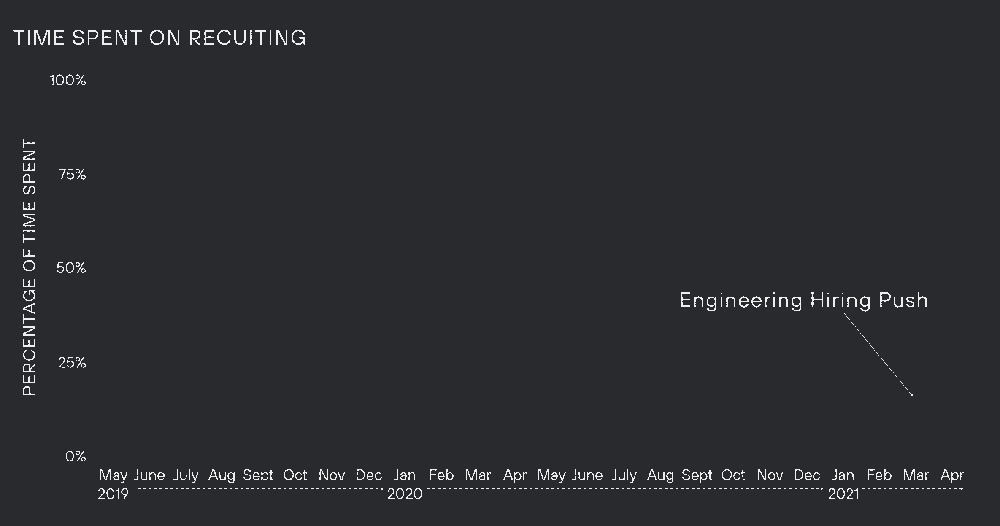*****

*****当我看到其他首席执行官如何花费时间的图表时，花在招聘上的时间百分比通常比这高得多，这要么意味着我花在招聘上的时间比典型的初创公司首席执行官少(我认为情况并非如此)，要么意味着其他首席执行官高估了他们花在招聘上的时间。*****

*****即使在感觉我所做的一切都是招聘的时候——就像我们在 2021 年 3 月的工程招聘——它也从未超过我那个月时间的 14%，很少超过 10%。*****

*****我从二月份开始做这份分析，招聘时间的缺乏确实让我印象深刻。因此，我在 2 月和 3 月加倍招聘，以确保我们能招到最优秀的人才。接下来的几个月是这样的:*****

*******1 月 38 日来电，49 日外联*******

*********2 月- 34 日来电，423 外联*********

*********三月——六十日来电，六二三日复命*********

*******即使在三月份有了巨大的推动，它仍然只占我时间的 14%。招聘很难！*******

*********要点:**你花在招聘上的时间可能比你想象的要少。[如果招聘对你来说是头等大事](https://review.firstround.com/turbocharge-your-recruiting-machine-heres-how "null")，那就有必要检查一下你的时间，确保你在招聘上花的时间和你认为的一样多。*******

## *******团队*******

*****这一类别包括我参加的所有会议，其中至少有一个团队成员参加:例如 1:1、公司全体会议和团队协作。这个数据有意思的是*有多一致*。2019 年 6 月，公司只有两个人:我和我的联合创始人乔希。然而，我花在团队相关任务上的时间和两年后差不多，尽管我们的团队比以前大了 10 倍，而且我有更多的直接下属。*****

*****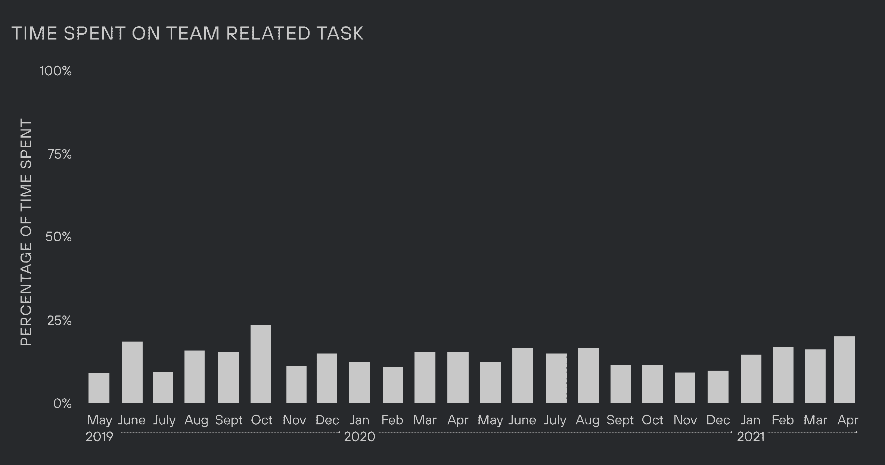*****

*****我认为这可能的原因之一是我们努力消除不必要的会议，而且作为一种公司文化，我们高度怀疑重复会议。我们[不断地重新评估一个给定的会议是否增加了价值](https://review.firstround.com/better-meetings-make-for-better-days-20-tactical-ideas-to-try-out-with-your-team "null")，并且我们一直根据谁在哪个项目上工作来改变事情。在许多公司，人们期望你需要与你一起工作的每个人进行 1 对 1，并且需要每周进行一次，但在这里情况并非如此——例如，我的联合创始人乔希和我每月最多进行两次 1 对 1。*****

*******要点 1** :设定这样一个预期，即 1:1 这样的会议节奏会随着职责的变化而变化。我建议每个季度至少重新召开一次定期会议。我发现把变化框定为减少情感成本的实验是有帮助的。例如，“让我们试着在一个月内将我们的 1:1 节奏从每周一次改为每隔一周一次，看看我们是否注意到任何不同。”*****

*******秘诀之二**:永远不要在会议上更新——永远倾向于异步。这可以通过书面形式(通过电子邮件)或更好的视频形式(我们使用[织机](http://loom.com "null")进行屏幕录制)。您可能会惊讶地发现，通过记录的内容异步更新要好得多。将更新记录为内容的一个意想不到的好处是，您可以将它们提供给整个团队，或者在相关的情况下与外部各方共享，这样可以节省每个人的时间。*****

## *******信息处理*******

*****这个类别包括很多东西，但主要是电子邮件。这还包括回复 Slack 消息(尽管[我们并不像大多数公司那样使用 Slack](https://www.notion.so/levelshealth/How-to-Use-Slack-Effectively-17263c7291ea40e984e2856b29d0bfd5 "null"))，回复 Twitter DMs，以及处理来自许多其他渠道的信息。但是大概 90%的时间都是邮件。*****

*****我强烈建议发展你与电子邮件相关的技能。对于首席执行官来说，擅长电子邮件(以及广泛的交流)是一项至关重要的技能。在花了无数时间处理电子邮件后，我学到了一些东西:*****

*******做一个“收件箱 0”的人。使用像 [Superhuman](http://superhuman.com "null") 这样的工具来增强你处理电子邮件的能力。我试着一周至少打开一次收件箱。*******

*********一切使用热键。当你处理大量邮件时，在每封邮件上节省几秒钟会很快累积起来。如果你用光标点击东西，你应该试着找到做同样事情的热键。*********

*********使用片段。如果你发现自己不止一次地发送相同的信息，把它移到一个片段中。您还可以创建更小的片段，并用多个片段撰写更长的电子邮件。*********

*******下图显示了一个月内每周花费在信息处理(主要是电子邮件)上的平均小时数。例如，在 2020 年 8 月，我平均每周花 34 个小时处理信息。*******

*******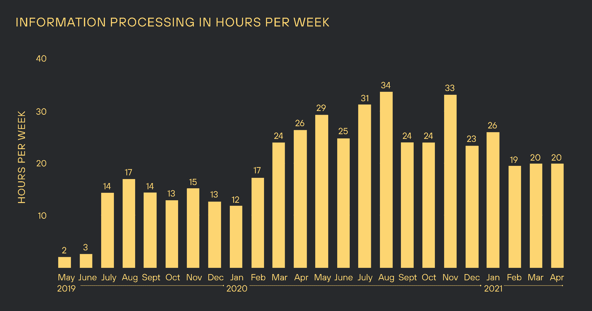*******

*******许多首席执行官像对待二等公民一样对待电子邮件，把它挤入其他任务之间的时间，却没有意识到它给团队的其他成员带来了多大的痛苦。专门为交流留出时间。*******

## *********网络*********

*****最后一类是花在管理个人网络上的时间。这包括与工作相邻的朋友聊天，认识相似或不同行业的其他人，以及尽可能多地从创业社区中学习。*****

*****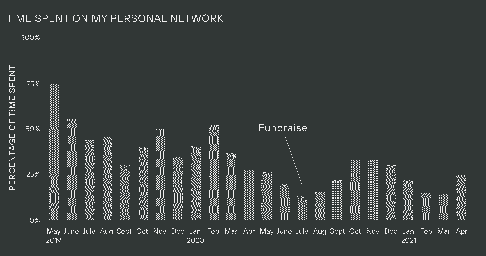*****

*****在我们筹资期间，花在网络维护上的时间有所下降，但这通常是我花很多时间做的事情，因为它[为公司提供了很多价值](https://review.firstround.com/how-to-become-insanely-well-connected "null")，也因为它是个人成就感的主要来源。我的季度目标是与 1000 人保持联系。如果你想更好地培养你的人际网络，最好的开始就是列一个清单。我自己使用的系统与 [Peter Boyce 在 Airtable 中使用的](https://every.to/superorganizers/peter-boyce-is-a-people-person-18168087 "null")非常相似——不要把它过于复杂。*****

*****这些电话、活动和会议通常会覆盖很多领域，并会过渡到投资者关系、团队、招聘等方面。久而久之。7 月份被归类为投资者关系的许多电话一开始都是建立关系网。*****

*******要点 1** :拥有强大的人脉是成为初创公司首席执行官的关键，善于跟进并向合适的人寻求合适的东西是一种超能力。尊重他人的时间，有条理。我会跟进几乎 100%与我交谈过的人，我会给做介绍的人发电子邮件，感谢他们建立联系。腾出时间跟进——很少有人这样做，但这很重要。*****

*******外卖#2** :随时准备好一份“需求”清单。在很多会议结束时，人们会问你，“我能帮上什么忙吗？”他们中的大多数都真心想帮忙。就我个人而言，我很不擅长当场想出这些事情，所以在我的后口袋里放一份问题清单会有很大的不同。公司历史上一些最重要、最偶然的事件来自于准备好回答这个问题:“我能帮上什么忙？”*****

# *******总结:入门提示*******

*****如果你已经做到了这一步，你可能是那种想知道如何自己做到这一点的人。这里有一些你可以采取的战术步骤。你需要做的第一件事是创建对你和你的企业有意义的类别(但是记住——不要超过 10 个！)，保持一个严格的日历，并填写你在某一天是如何利用时间的。如果你想用你现有的日历数据填充，你可以进入谷歌日历[下载你所有的历史日历](https://support.google.com/calendar/answer/37111?hl=en "null")数据为 CSV 格式，然后上传到谷歌工作表。如果到目前为止你还没有保持一个严格的日历，你最好从头开始，保持电子表格的更新。*****

*******[我创建了一个自己用的电子表格](https://docs.google.com/spreadsheets/d/1f_J947KtxmdRTMZVvIJZtomWtons2aZZxEqsV2DBgbE/edit#gid=1676078135 "null")** **的(简化)版本，你可以复制一份给自己用。*******

*****乍一看，这似乎是一项大工程——但是预先投资建立这个系统(并定期维护它)将会在未来几年提高你作为首席执行官的效率和影响力。*****

******图片来自 Getty Images / MirageC******

******图表插图由* *[陈九思](http://jeffreydesigns.com/index.html "null")* 组成*****