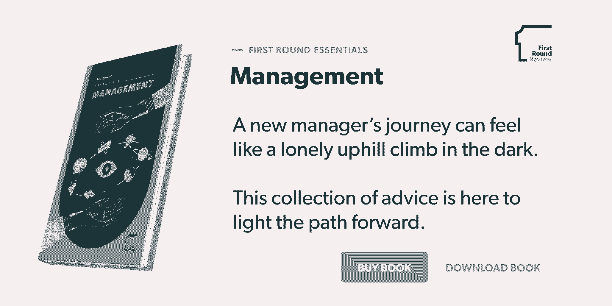

# 发布第一轮要点——在发表了 180 多篇关于管理的文章后，我们将发布我们的第一本书

> 原文：<https://review.firstround.com/announcing-first-round-essentials-after-publishing-180-articles-on-management-were-releasing-our-first-book>

在第一轮，我们坚持不懈地致力于帮助小公司变大。多年来，我们发现有强大的、未开发的知识可以帮助初创公司做到这一点——但它被困在其他人的大脑中。

为了解决这个问题，我们在六年多前就开始了这项调查，打赌如果我们采访那些在各自领域处于领先地位的人，他们将更容易与更广泛的技术社区分享他们所学到的东西。通过我们关于经验丰富的领导者和有思想的创始人的长篇简介，我们让一线专家直接向你讲述可能让你夜不能寐的创业挑战，无论是[产品/市场适应](https://firstround.com/review/how-superhuman-built-an-engine-to-find-product-market-fit/ "null")、[决定增长战略](https://firstround.com/review/from-zero-to-ipo-how-growth-needs-to-evolve-at-every-startup-stage/ "null")，还是[快速招聘](https://firstround.com/review/our-6-must-reads-for-hiring-tactics-that-break-the-mold/ "null")。

但是随着我们的档案已经扩展到 400 多篇文章，我们还推进了另一个目标:**让我们的读者更容易理解公司建设的智慧**。从[整理我们的必读系列](https://firstround.com/review/must-reads/ "null")到[编辑我们的年度最佳 30 条建议清单](https://firstround.com/review/the-30-best-pieces-of-advice-for-entrepreneurs-in-2018/ "null")到[发起第一次搜索](https://search.firstround.com/ "null")，我们一直在尝试新的方法来展现特定主题上的最佳见解，并用更锋利的刀切断噪音。

在过去的几个月里，我们一直在默默致力于另一个项目以实现这一使命，今天，我们很高兴能够更正式地分享它，并介绍**首轮要点系列**，从我们关于**管理**的新书开始。

在过去的六年里，我们在我们的管理杂志上发表了很多文章——确切地说是 180 篇。我们筛选出了 10 本我们最喜欢的书，将它们收集到我们的第一本书中，可以下载 PDF 格式，也可以添加到你的书架上。

# 背景故事:

今年夏天，我们试行了经理跟踪，这是一个帮助我们社区公司的新经理提升为领导者的大师班。在该计划中，我们在多个会议中涵盖了广泛的主题，如反馈、沟通和团队绩效，并且我们总是提前发送一些评论文章作为讨论的准备。

但是我们发现这种经历缺少了拼图的一个关键部分。人们不能回顾他们读过的内容，在空白处做笔记，或者轻易地与公司的其他人分享这些阅读材料。

我们开始从回顾档案中创建一个更有策划性的采访汇编，为经理们建立一个剧本。经过几次设计和排版的修订，我们印刷了一小批平装本，并开始作为手册发行。随着消息开始传播，我们社区的经理们向我们索要越来越多的副本。

所以我们决定更广泛地分享我们的成果。无论它是放在你的书桌上还是你的桌面上，我们都想创建一个总是方便的、包装精美的建议卷——这就是为什么对于这本书的数字和印刷版本，我们花费时间和精力来确保读者的体验是愉快的。

# 里面有什么:

在适应了经理的角色或承担了建立越来越大的团队的工作后，大多数人很快发现管理不仅仅是做某人的老板。不仅仅是绩效考核和聘用(或解雇)。它包括做决策、扩展团队、设定文化基调、开发人才，以及让团队一起工作并快速前进。

[正如我们之前说过的](https://firstround.com/review/our-6-must-reads-for-first-time-managers-to-hit-the-ground-running/ "null")，一个经理的旅程常常感觉像是黑暗中孤独的上山之旅。无论你是第一次从 IC 转型为经理，步入经理经理的角色，还是作为创始人努力从生产产品转向建立公司，管理都需要一套独特的技能。这很可能是全新的，不同于你之前擅长的领域。至少可以说，这种转变可能会令人迷惑和畏惧。

一个管理者的旅程常常会感觉像是一次黑暗中孤独的上坡攀登。那些站在你立场上的人的建议是照亮前进道路的灯笼。

从帮助你有动力地执行并给予你的团队自主权的框架，到引导有影响力的职业对话并帮助他人在快速增长的创业公司快速变化的文化水域中导航的策略，这一系列文章将帮助你完成这一转变。

我们选择了一些有见地的采访，这些采访强调了最好的管理者用来成长为领导者的习惯、过程和行动。我们希望他们也能为你做同样的事情。

在五个部分中，本书涵盖了:

**晋升为领导:**

如何通过保持沉默和缩小自己的影响力来增加团队的成功机会。

为什么领导技能能产生重要的影响是讲好故事的能力。

**做决策:**

如何方得困难的决定和团结每个人，即使他们最初不同意。

当你每天做出并执行重大决策时，保持事情快速进展的秘密。

**缩放公司:**

对于初创公司的员工来说，快速扩张实际上是什么感觉(提示:很多焦虑)，以及如何减轻负担。

如何让新人具备他们需要的习惯和原则，以便在面临挑战时像创始人一样行事。

**打造文化:**

五个方面采取行动，首先要消除派性，甚至防止派性的形成。

实践公司价值观是什么样子，以及加速采纳和处理误解的技巧。

**培养人才:**

为什么你需要进行职业对话，而不是绩效评估。

有才能的人会离开的原因以及如何干预。

# 接下来是什么:

我们希望在这第一轮要点系列中增加更多的内容，所以请告诉我们您想要哪些其他主题的硬拷贝。(精准的招聘策略？久经考验的筹款建议？)还有哪些形式会让你的生活更轻松？(有声读物？)在推特上让我们知道。