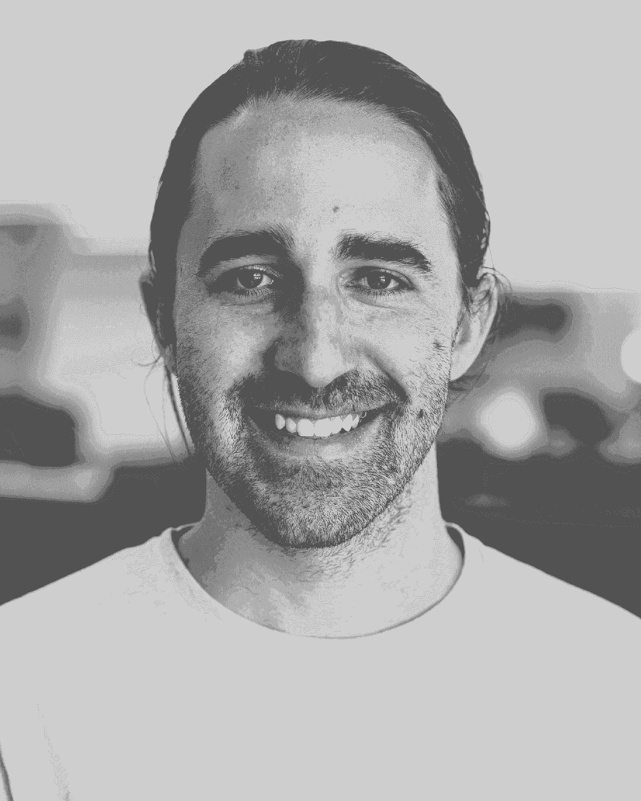

# Box 工程副总裁谈生物黑客为更好的职业生涯

> 原文：<https://review.firstround.com/boxs-vp-engineering-on-biohacks-for-a-better-career>

**[托马斯·巴雷托](https://www.linkedin.com/in/tomasrb "null")****[Box](https://www.box.com/home "null")**工程副总裁，认真对待生物黑客技术。就像测序他的基因组，让电流流过他的身体。

但不要称之为爱好或副业。巴雷托在他所做的生物黑客工作和更有思想、更健康的生活以及他的职业轨迹之间画了一条直线。这给他带来了长寿，也增加了他在 Box 的责任，他在 Box 已经被提升了五次，从一名软件工程师到现在的工程副总裁。他认为生物黑客给了他适应力和能力，这两者正是他将工程团队从 5 人增加到 130 人所需要的，从早期到高调的 IPO。

LinkedIn 上还没有关于生物黑客诚信的部分，但如果有的话，Barreto 的会很大。据他自己估计，他已经从事这项工作十多年了，阅读了 100 多本关于这个主题的书籍和 100 个播客，参加了六次生物黑客会议，并轻而易举地投入了六位数的资金。他并没有止步于此，也不孤单:Box 联合创始人兼首席财务官迪伦·史密斯是他最频繁的生物黑客合作者和边界推动者。

好消息是你不必走到巴雷托那么远。他查阅了大量文献，尝试了从补充剂到日常抽血再到破解肠道生物群落的各种方法，对哪些有效(哪些无效)了如指掌。

在这次独家采访中，他分享了一些原则，任何人都可以从今天开始实施，成为一个更快乐、更健康的人，并最终成为一名更有效的专业人士。如果生物黑客听起来有点令人生畏，那就把这个建议当作一个起点。这不是寻求成为 *[无限](https://en.wikipedia.org/wiki/Limitless_(film) "null")* 中的主角；这是一种日常考虑，可以支持和拓宽持久的职业生涯。

# 提高生产率的最大动力是所有权。

生物黑客不仅仅是关于补充剂和生物节律——它也是关于加速思维转变的工具。为了提供帮助，巴雷托贪婪地消耗着行为心理学家和社会科学家的工作。谈到生产力，他特别受到记者查尔斯·杜希格的研究的启发。为了他的书 *[更聪明更快](http://charlesduhigg.com/books/smarter-faster-better/ "null")* *[更好](http://charlesduhigg.com/books/smarter-faster-better/ "null")* ，杜希格花了两年时间采访专业人士，询问他们的生产力策略。

“出现的一个主题是杜希格所说的'**内部控制点**。”巴雷托说:“这是一种想法，如果你觉得自己处于控制之中，你的动力就会上升。我在自己的职业生涯中注意到了这一点，尤其是在拳击界的十多年里。我的一些最有成效的时间不一定与我的资历相关。"

例如，有一次 Barreto 问他的经理，他是否可以带点运行一个场外，在之前的离开后，团队对格式感到有点悲观。“过去，当我参加不完全属于我的直接团队的场外活动时，我感觉自己更像一个旁观者或被动的参与者。但是在自愿参加并运行一个之后，我意识到感觉完全拥有并不需要运行每一个会话。这意味着*感觉*好像我能控制自己的参与——而且当事情偏离轨道时，我可以加快步伐，走向正确的方向。”

对 Barreto 来说，具有讽刺意味的是，他不需要正式运行异地来复制这种感觉，并通过扩展，帮助他的团队有同样的感觉。“鼓励你的下属假装他们是你的角色。Barreto 说:“在我的团队中，我要求他们思考一下他们会有哪些不同的做法——无论是提供反馈还是确定项目优先级。“另一个有用的工具是会议评分。想象一下，你将不得不分享一个关于会议进展的 1-5 分，以及可操作的反馈以使会议变得更好。现在进入下一个阶段，在会议期间给出可操作的实时反馈*，目标是以 5 分结束。它产生影响力*和*的即时性。”*

*所有权并不总是处于权力的位置，而是感觉你有重新平衡权力的途径和能力。*

***角色扮演，摒弃受害者心态。***

*然而，当问题出现时，Barreto 经常看到同事放弃——而不是夺取——控制权。“这更容易，而且通过放弃一些地盘，你会感觉好像你会让人们同情你。但你最终会感觉自己没有那么强大，也没有那么积极，就像你对同样的问题持主人翁态度时那样。”*

*你不仅会觉得自己没那么强大，还会显得没那么有效率。和你的团队一起做一个简单的练习，看看这个原则是如何运用的:两人一组，然后让每组中的一名成员作为受害者讲述一个情景。让另一名成员描述他们如何看待自己的搭档。然后重复练习，让说话者以主人的身份讲述同样的情况。*

*“毫不奇怪，人们认为受害者的角色较弱，”巴雷托说。另一方面，拥有者角色显得自信。即使他们说，‘我搞砸了’或‘这是因为我没有做 X、Y 或 Z 的事情’，人们还是会把那个人视为他们想一起工作的人。”*

*如果你在工作中无法完全掌控自己，先从日常生活中常见的事情开始练习这种心态转变:例如，当另一个司机超车时，或者你的室友拿走了你的东西。“当你讲述这些情况时，你是在描述发生在你身上的事情，还是在确定你本可以采取不同的行动，不管是不是你发起的？”*

*用一句话掌控一切。*

*空白备忘录。空荡荡的甲板。每个人都知道有时候最难做的事情就是开始。这一点在收件箱爆满的情况下尤为明显。这就是为什么 Barreto 推荐在响应中存放一句话的做法，以快速重新获得对请求及其所有者的控制。*

*“杜希格谈到回应他不想参加的会议的邀请。巴雷托说:“他开始回答‘我只能坚持 15 分钟’。"很快，他又控制住了自己."当然，他最终会充实或解释他的反应。但他会有一个立足点。这一页将不再是空白的，在他的收件箱中移动将感觉不那么繁重。"*

*在特别繁忙的日子里，当他的收件箱爆满时，Barreto 有时会为 20 封电子邮件起草开场白，而不是一次在一封电子邮件中写 20 行。为了鼓励快速行动，他会设定一个五分钟的计时器，并努力完成设定。当警报响起时，他会决定是继续还是继续另一项任务。五分钟一个检查点通过给予更多时间的选项给予他控制。*

*“在那些日子里，我对每封邮件的回复都不是首要任务。巴雷托说:“这是我个人回复收件箱的方式。“因此，为几十封电子邮件写一行字——我希望收件人理解的要点——在心理上增强了我的力量。我会坐下来，打开部分草稿一分钟，重新获得那种控制感。然后，如果需要的话，我会回到第一个问题并详细说明。令人震惊的是，有多少人可以重读这一行，然后照原样发送。”*

*[固定的回复或电子邮件模板对于重复请求来说是无价的](http://firstround.com/review/70-of-Time-Could-Be-Used-Better-How-the-Best-CEOs-Get-the-Most-Out-of-Every-Day/ "null")——尤其是那些你说“不”的请求。但是这个一句话的行为不仅仅是回答一个请求，而是回收一种资源——无论是你现在还是未来的时间——以一种*你*登记所有权转移的方式。所以，这不仅仅是把模板化的笔记从你的盘子里拿走——这可能会导致无休止的电子邮件乒乓。取而代之的是将流程分段，让你在内部记录任务和任务的所有权转移。*

*

Tomas Barreto* 

# *压力的解药不是快乐。是韧性。*

*根据 Barreto 的说法，处理压力直接触及许多生活黑客话题的核心。如果任其发展，它会导致精疲力竭，并很快抹去你从新的提高生产力的习惯中获得的任何收益。*

*然而，压力是工作和生活的一部分，如果你试图完全摆脱它，你是在打一场必败的仗。但是 Barreto 推荐了一些做法来减轻它的影响，并区分急性压力和更危险的慢性压力，急性压力实际上是建立复原力的一个有价值的工具。*

*早餐前出汗。每天冥想。浮动周刊。*

*如果你正在使用锻炼、冥想、漂浮或任何其他缓解压力的技巧，你必须在精疲力竭之前开始*。对巴雷托来说，大部分压力管理都涉及到对你有利的牛顿第一运动定律。**

*他说:“通过锻炼缓解急性压力或通过冥想放松都有相同的神经化学促进作用，推动你的心理朝着积极的心理动力前进，这是心流状态之前的状态——或者感觉你在那个区域。”“我喜欢每天在查看第一封邮件之前，通过锻炼、桑拿和冥想等行动来建立强大、积极的心理动力。这听起来像是在你的收件箱前有很多事情要做，但事实并非如此。当然，你可以跑得更久，但我发现只需要 5 分钟的冲刺——5 次 30 秒的短暂休息，10 分钟的调解或 15 分钟的 180 度桑拿浴就能启动动力。”*

*但是当谈到*的时候，一天中并不是所有的时间都是平等的。“当然，人类是复杂的系统，有不同的需求，但我发现了一个对大多数人来说的经验法则:早餐前锻炼，”托马斯说。“就产生内啡肽而言，这是影响你心理的直接方式。以体育活动开始新的一天，对于建立抵御慢性压力的能力至关重要。”**

*对于许多人来说，锻炼可能是一个更熟悉的习惯，但当谈到减压时，冥想越来越成为日常用语的一部分。对于那些找不到入门方法的人，有工具可以帮助。“像[冷静](https://www.calm.com/ "null")和[顶空](https://www.headspace.com/ "null")这样的应用都不错。巴雷托说:“我发现，当我在会议间隙占用会议室 15 分钟时，我能从冥想中获得最大收益。“就像冥想一样，漂浮或隔离罐是一种非常有效的定期管理压力的方法。环境的彻底改变只是开始。尝试在[重新启动 Float Spa](http://rebootfloatspa.com/ "null") 一个小时以开始。”*

*并非所有这些习惯都必须在工作场所之外独自努力完成。“有一些做法会在会议开始时产生动力。我们在 Box 有一位领导，他会在每次团队会议开始时做一个简短的放松呼吸练习。另一个人带来一个 Jambox，播放几分钟音乐。巴雷托说:“还有一个人会邀请每个人去分享他们一周的高潮和低谷。“这些我都亲自尝试过，还有带早餐，利用会议的前几分钟进行社交。这里的模式是，你正在寻找一种方法，让你的神经化学物质变得更有弹性，并产生集体心理动力。”*

***让自己走极端。***

*还有一种身体锻炼已经成为巴雷托压力管理养生法的基石:体验极端的高温和低温。*

*“许多人，当他们试图管理自己的情绪和压力时，试图由内而外地工作——从内部影响他们的状态。但是托尼·罗宾斯说得对，**如果你能改变你的身体状况，那是改变你状态的最快和最有力的方法——在**中从外部改变*

*巴雷托将这一原则融入了日常实践中。“我早上用桑拿浴，开始一天的生活。他说:“如果我在锻炼，我会在锻炼后马上使用它，因为这是一种互补效应。”。“这是一种新的汗水，感觉很有成效。”(为了获得生活黑客的奖励，把其他习惯和这段时间联系起来:比如，在那里冥想。)*

*冷水淋浴更容易实现——不需要特殊的设备。如果你有时间和兴趣，数据显示冷热结合可以增加两者的影响。“你可以从桑拿房跳到寒冷的地方，从这个组合中获得双倍的提升。在那个时候，你已经在至少 160 度的高温下洗了冷水澡——现在还是早上 8 点。你已经为今天创造了动力。首先加上锻炼，到那时你会觉得势不可挡。”*

*改变你内心的天气从外在的天气开始。用热和冷作为杠杆来减少压力。*

*但是这些策略不仅仅是为了极端而极端——它背后有科学依据。“你的去甲肾上腺素，基本上是你一天的激素平衡，瞬间发生变化。巴雷托说:“去甲肾上腺素与注意力密切相关。“你也变得对内啡肽更加敏感。所以，如果你在蒸完桑拿后锻炼，你会感觉更好。或者，当你从一天的工作中获得内啡肽时，它会更有力量。”*

*在很多方面，它就像是药物的对立面。也就是说，虽然身体对药物产生了耐受性，但对冷热却没有这种适应性。“如果你正在研究像可卡因这样的成瘾药物如何影响多巴胺通路，受体变得不敏感——或者，从技术上讲，下调。在这里，你实际上是在敏化——或者创造新的受体——所以你达到了与药物相反的效果。”*

*冷水淋浴和热桑拿有其自身的好处，但还有一个更广泛的教训，一个可以推广到工作场所的教训。如果被迫的极端行为可以改变人体，那么如何利用它们来提高你或你的团队的职业适应能力？*

*以广受欢迎的创业实践[为例，创建“作战室”](http://firstround.com/review/my-launch-lessons-from-37-minutes-in-an-amazon-war-room/ "null")来解决关键问题。“当然，还有器质性的急性压力，比如一波自然减员。但是作战室是一种诱发压力的方式。你这么做是出于特定的原因，从这两种情况中都可以学到很多东西。”*

*Box 最近策划了一个自己的作战室来支持一个关键项目，Barreto 观察到该团队的心理发生了一些有趣的变化。“我们把他们搬到了大楼的另一层，在那里他们基本上有自己的空间。他们可能会觉得，'我们在一个作战室，这是一个糟糕的状态。'但是我看到这个团队基本上围绕着它的目标和使命团结在一起。想法源源不断。团队的反馈不是‘嘿，你为什么让我在不同的地方工作或者工作更长时间？’这是，'嘿，感觉我们有更多的动力'"*

*不管是你得到的还是实际产生的，短期的剧烈压力都会产生所谓的荷尔蒙反应。“在生活中以不同的方式定期获得这种荷尔蒙效应——通过在不同的领域让自己暴露在某种极端的环境中——往往比慢性轻度压力更强大。”*

***练习感恩。***

*人类的大脑有一种天生的消极偏见，会对问题和失望有更强烈的反应和记忆。虽然从进化的角度来看，这种偏见是有用的，但它会给今天的人类带来问题。*

*“有种东西叫做[峰尾法则](https://en.wikipedia.org/wiki/Peak%E2%80%93end_rule "null")。巴雷托说:“该理论认为，人们评估一段经历的主要依据是他们在巅峰——最激烈的时刻——和结束时的感受，而不是这段经历每一部分的总和或平均值。“利用峰-端规则学习，虽然你无法控制任何一天的峰值，但你通常可以控制终点。例如，我会在一天结束时写感恩日记，强迫自己反思那些进展顺利的事情，以此来抵消人类思考那些进展不顺利的事情的正常倾向。”*

*Barreto 花了大约 14 天才把感恩日记坚持下来，并成为一种习惯。尝试你能坚持做的任何练习，因为它们会给你一个切入点，让你在实时互动中编织感激之情。“当我写日记成为习惯时——我每天结束时都会写 5-7 行——我发现每天都有比我原先预想的更多值得欣赏的东西。巴雷托说:“试着在你谈论问题和表达感激之情的栏目中做一个连续记录。“以前，我花很多时间与朋友、家人和其他重要的人交谈，而不是解决或处理问题。我正在减少，虽然它仍然是一个诱惑。但是现在我听到自己和其他人谈论他们感激的事情。这是肯定的，增强信心的，有感染力的。”*

*从心理学上讲，感恩是良药。这是对抗恐惧、愤怒和悲伤的预防针。*

*当考虑压力时，Barreto 的基本原则是如何在生活中建立适应力。“我曾经认为幸福是最终目标。他说:“我意识到，没有人会一直 100%快乐。"在适当的时候，你应该能够拥抱悲伤和其他情绪."归根结底，这就是 Barreto 压力训练的目标:不让悲伤、项目失败或寒冷的气温成为与世界接触的障碍。*

# *能量不是有限供应的。*

*随着你减少和控制压力在你生活中的作用，能量水平自然会上升。但是不要止步于此。在一天、一周、一年的过程中，你可以采取具体的步骤来继续增强你的能量。Barreto 认为有两个原则特别能给他耐力和能量，让他工作得更好，让自己走得更远。*

***用力量姿势增加能量。***

*巴雷托最喜欢的生物黑客之一是使用力量姿势。在这方面，他从社会心理学家艾米·卡迪那里获得了灵感，她在 TED 演讲中讨论了简单的肢体语言如何直接影响你的心理。巴雷托说:“‘装腔作势’在商界名声很差——我们经常把它说成是故意误导或试图给别人留下印象的行为方式。”。“但卡迪建议，通过采取某些姿势——比如双手放在臀部，双脚与臀部同宽——可以增强自信和活力。”*

*Barreto 使用这些力量姿势不仅是为了给自己更多的活力，也是为了提升房间的能量。“这些运动可以通过增加睾丸激素和降低皮质醇来影响你的心理和神经化学。因此，当我要发表演讲或主持会议时，我会用几分钟时间摆出充满力量的姿势，”他说。“对于一个小组，我有一个习惯，就是要求整个小组做一分钟的力量姿势，以提升我们小组的能量水平。在我们开始议程之前，这将改变人们与我以及彼此的互动方式。这可能看起来很滑稽，但我甚至在开始处理一封特别棘手的电子邮件之前摆出了一个强有力的姿势。*

*认真对待睡眠。*

*在一天结束时，Barreto 的许多方法——从早上的桑拿到隔离罐——都旨在模仿睡了一个好觉的感觉。另一种实现方式？睡个好觉！*

*他说:“如果你可以每天重现理想的睡眠，想象一下这会如何影响这些类别中的每一个——生产力、压力、决策”。“已经有无数关于睡眠的研究，然而我们还没有完全理解它。直到今天，我仍然花很多精力在睡眠黑客上。”*

*首先，一些数字。“我倾向于花大约 25%的时间深度睡眠，大约两个小时。巴雷托说:“深度睡眠占总睡眠时间的比例从 0%到 35%不等，有些人根本睡不着，也没有意识到这一点。”。这一点尤其重要，因为正是在深度睡眠期间，你晚上的大部分恢复和再生工作都在进行。“就快速眼动睡眠而言，普通成年人只睡了 20-25%左右。我倾向于更高一点，大约 30%。这些都是好目标。你要确保你的数字在这些范围内。”*

*如果你不知道你的睡眠状况如何，有一些工具可以帮助你。“我有[URA](https://ouraring.com/ "null")，这是目前市场上最精确的设备，”Barreto 说。但是如果太贵的话，你不需要使用高科技或者购买追踪器。简单地记录你的睡眠和清醒经历可以产生强大的洞察力。*

*说到睡眠，主要的衡量标准是你醒来时的感觉。“开始量化它。你甚至可以在 0 到 10 的范围内给它排名。巴雷托说:“把这些答案记录下来——记在记事本、电子表格或任何有用的东西上——开始观察任何出现的趋势。“我注意到的一个模式是，我周末睡得比工作日更差。我注意到自己做的事情与众不同。我把范围缩小到我的咖啡因摄入量。周末，我喝咖啡的时间比平时晚了几个小时，咖啡因戒断会引发头痛。这一直影响着我那晚的睡眠质量。”*

*然后，你可以开始调整和处理关键变量:你吃饭或锻炼的时间，你房间的黑暗或温度，你的床。“你应该避免在离床太近的地方锻炼，因为你的身体需要时间来降温，心率也需要时间来降低。巴雷托说:“吃东西会影响你的新陈代谢和心率，这也很重要。“黑暗和蓝光会影响褪黑激素的产生，褪黑激素是诱导睡眠的关键激素。作为入睡的一部分，你的体温会自然下降，如果你在一个太热或太冷的地方，体温会下降。这些变量中的每一个都会以不同的方式影响你的神经化学和荷尔蒙。随着时间的推移调整这些变量是让你达到最佳睡眠质量的好方法。”*

*投入时间来研究和优化你的睡眠是非常值得的，但巴雷托确实有一个对许多人都有帮助的最喜欢的技巧:“如果我必须给出一个能引起许多人共鸣的开始技巧——人们可能还没有尝试过——那就是不要在睡觉前让自己暴露在蓝光下，这是从你的电视、电脑或智能手机发出的。这阻碍或减缓了调节睡眠的褪黑激素的产生。让眼镜挡住蓝光真的很便宜，或者你可以在家里把灯的颜色改成红色。”*

# *将这一切结合在一起*

*如果你的早晨或晚上的例行公事听起来和你的工作生活相去甚远，请再考虑一下。所有这些技巧和工具，从蓝光阻挡眼镜到桑拿浴，都是为了让你更好地导航，不仅仅是一份工作，而是一个漫长而富有成效的职业生涯。为了更有效率，短路情况要求-或模拟-所有权。为了减轻压力，要养成习惯，让自己对快乐有弹性。从让自己暴露在极端环境中(比如热和冷)开始，或者在你的养生法中引入更聪明的感恩实践。最后，恢复能量的生物黑客是关于模拟睡眠效果的方法。能量和你做的姿势有很大关系，就像跟踪睡眠本身一样。但是这些生物黑客的美妙之处在于它们是如何交织和复合的。*

*“这不需要势不可挡。从小处着手。最有效的生活窍门是伪装成新习惯——通常是相对较小的习惯。诀窍是给你已经在做的事情加上新的习惯，比如早上喝咖啡。巴雷托说:“将新习惯与现有习惯结合起来——而不是让它成为一个孤岛——最有可能让你成功。”“十多年后，我仍在将新旧生物黑客习惯联系在一起。因为它们加起来。如果我能改善和支持我的能量和健康，那就是我生命金字塔的基础层。它支持我的工作和生产力。很多人从错误的方向建造金字塔。如果你不把下面的事情做好，它就会倒塌。”*

*摄影由拍摄者提供。唐纳德伊恩·史密斯的艺术。*