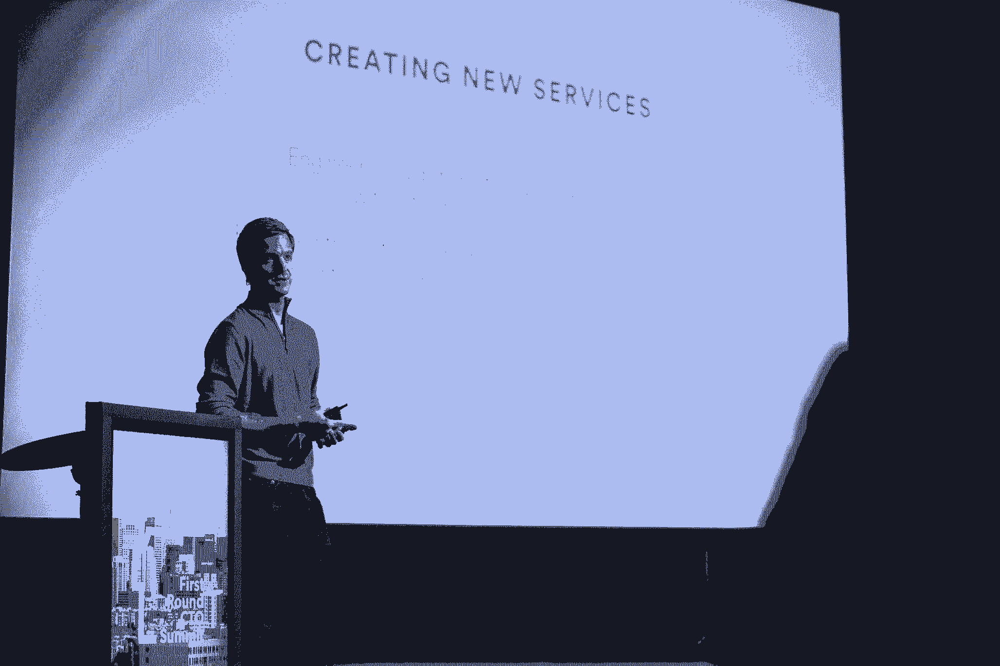

# 官僚主义并非不可避免——以下是 Airbnb 如何战胜官僚主义的方法

> 原文：<https://review.firstround.com/bureaucracy-isnt-inevitable-heres-how-airbnb-beat-it>

**[麦克柯蒂斯](https://www.linkedin.com/in/curtismike "null")** 可能没有某个人专门致力于战胜官僚主义的典型背景。AltaVista、美国在线、雅虎、脸书——他是硅谷一些传奇巨擘的元老。现在是 Airbnb**T5的工程副总裁，他掌管着一个规模虽小但发展迅速的团队。凭借在科技巨头公司近 20 年的创新，他已经成为了一名突破繁文缛节的专家。**

事实证明，一个简单的教训指导着柯蒂斯建立高效团队的方法:无效官僚主义的解药是良好的老式判断——拥有它，雇佣它，并创造条件让人们行使它。有了这个事实，他已经解决了在 Airbnb 扩大世界级工程团队的挑战，从驯服费用报告的野兽到显著提高网站的稳定性。他通过消除规则而不是制定规则做到了这一点。

在 First Round 最近的 CTO 峰会上，Curtis 分享了他所谓的**“用原则取代政策”**的可行策略，这些策略可以引导快速、灵活的增长和进步。每一个希望避开不断增加的结构和流程所决定的命运的初创公司都可以从这些建议中受益。

首先，柯蒂斯对官僚主义(当涉及到初创公司时)的定义在字典里是找不到的:

bu reauc ra cy n . 1。妨碍你的事。妨碍你的工程师的东西

关于组织的一件奇怪的事情是，拥有更多的人并不等于更多的产出。“随着一个组织的规模和复杂性的增加，在该组织工作的个人的生产率往往会下降，”他说。随着人数的增加，阻碍快速迭代和规模的政策和文书工作*也在增加。*

为什么会这样呢？“我认为这归结于人性和我们对问题的反应方式，”柯蒂斯说。我们对任何问题的自然反应——从服务器故障到社交失态——是努力确保这种事情不再发生。在公司中，这些解决方案通常采取新政策的形式。“当然，当你创建一个新策略时，你必须让它符合你现有的所有规则。”于是就开始了一个越来越复杂的关于预防的网络。很快，无论你想做什么，你都开始触及安全措施。

为了从公司一开始就避免这种官僚主义，你应该采取两种特殊的策略:“首先，你必须建立具有良好判断力的团队，因为你需要能够信任他人，”柯蒂斯说。"然后你用强有力的原则来塑造好的判断."

# 通过雇佣值得信赖的人来建立一个值得信赖的团队

只有当你建立了一个团队，能够在没有僵化结构的情况下做出好的决策时，将成为你组织中障碍的规则最小化才会奏效。在你的招聘过程中，你可以在防止官僚主义方面迈出最大的步伐。

当你雇佣某人时，你必须回答的最重要的问题是‘这个人会被未知的事物激励吗？’

没有一家公司会做到完美，永远不会。所以，当事情发生时，你需要那些有解决问题的动力的人——那些不会停下来责备的人，而责备是浪费。即使你已经有了筛选和面试候选人的成熟流程，也有必要重新审视一下你是如何测试文化契合度的，以确保这是其中的一部分。

太多的公司和工程领导者愿意妥协以最大化技术悟性。不要这样做。柯蒂斯建议，至少分配 45 分钟给完全关于文化和性格的面试。Airbnb 提倡背景和观点的多样性，因此“文化契合”就是寻找那些分享高绩效职业道德和公司使命信念的人。如果人们不认同你对公司成功的信念，他们就不合适。

**在 Airbnb，柯蒂斯发现这四个步骤真正从这类面试中提取出了最大的价值:**

**让他们先发光。**在文化面试的前 15 分钟，让候选人描述一个他们特别自豪的项目。这里的想法是了解什么让他们兴奋——例如，是技术挑战，还是个人互动？“试着找出是什么给了这个人能量，”柯蒂斯说。

**然后让他们不舒服。**硬币的另一面是，你想知道候选人不兴奋时的反应。询问他们困难的经历，或者他们不知何故无法控制的时刻。柯蒂斯的一些关键问题是:“描述一次你在某些事情上与管理层意见相左的时候。怎么回事？”“想一想你不得不在一个项目上偷工减料，以一种你并不引以为豪的方式在截止日期前完成的时候。你是怎么处理的？”这个练习是关于反应的。“候选人会不会开始指指点点，说‘这就是我无法完成工作的原因，这就是这家公司如此糟糕的原因’？或者他们开始谈论他们是如何理解另一个人的观点并合作解决问题的？”

**校准您的结果。很容易看出是否有人提出了编码挑战。当你和一群不同的面试官一起工作时，你很难获得对候选人的可比解读。达成共识需要时间，但是你可以帮助这个过程。柯蒂斯说:“我们把所有的面试官召集到一个房间，让他们同时查看几个包，以帮助加快对我们重要的东西进行某种校准的过程。”从本质上说，尽可能让主观变得客观。**

注意教练的迹象。如果一个候选人似乎对你的内在语言有着不可思议的掌握，请注意。公共领域充斥着过去的受访者和记者提供的技巧和窍门。“尤其是当你的公司开始变得越来越受欢迎或知名时，互联网上会有很多关于你的东西。如果人们开始向你引用他们显然在文章中读到的东西，或者是你自己的内部语言，他们可能受到了指导。柯蒂斯说:“他们要么读过一些东西，要么和公司的工作人员聊过天。这并不是说你应该立即拒绝他们，只是不要让自己动摇。

# 充分利用第一印象

理想情况下，你的文化面试可以确保你雇佣了一群多元化的人，他们分享你的信仰和职业道德，同时引入新的想法和观点。一旦他们进门，你就有了下一个建立共同优先事项的关键机会。“**第一周是你和新工程师**设定期望的机会，”柯蒂斯说。他发现，在入职流程中加入一些关键元素会带来巨大的回报:

**1。提醒新员工他们在和最优秀的人一起工作。柯蒂斯说:“我会谈到有多少人申请了他们的职位，这样他们就会明白进入这家公司的竞争有多激烈，他们会和优秀的人一起工作。”。除了鼓舞士气和令人兴奋的价值之外，这也是建立紧迫感和确保新员工以积极的势头投入工作的有效方式。**

**2。强调快速行动的价值。**在 Airbnb，柯蒂斯给新工程师的方向是先运小东西。对于习惯于在最后一份工作中从事大型系统工作的人来说，这可能是一种调整，但事实证明，这是建立至关重要的共同判断的一种有价值的方式。“拿到一堆代码，了解事情是如何运作的，然后你会运送更大的东西，”他谈到新员工时说。

**3。让不完美成为资产，而不是负债。**分享你一直在寻找的东西:*从未知中汲取能量的人*。“我说的是这样一个事实，即将成功的人是那些看到不完美事物并从中汲取能量的人，”柯蒂斯说。另一方面，要明确，愤世嫉俗和抱怨不会得到回报。

**4。回顾你的工程价值观。**当你第一次开始建立你的工程组织时，最好将指导你行动的价值观整理成文。这些可以用你觉得合适的任何方式来表达。例子可能包括，“偏向于行动”或“有强烈的意见，但持有微弱。”无论你想出了什么，仔细检查每一个，阐明它们对你的意义以及它们为什么被列在清单上。“价值观可以有多种解释，所以有画外音是件好事，”柯蒂斯说。

**5。欢迎新员工加入招聘团队。**刚刚完成面试程序的人不久将会为新的候选人进行面试，所以要确保你团队的新成员明白招聘是他们现在工作的主要和关键部分。“你希望他们像对待编写一段代码一样认真对待它。柯蒂斯说:“他们需要真正参与招聘。

**6。建立直接的沟通渠道。**公开沟通是消除不必要官僚作风的有效方法——没有什么比告诉你的团队他们可以向高层管理人员表达担忧更有效的了。“有时人们觉得他们需要通过他们的直接管理人员进行所有的沟通。柯蒂斯说:“当你说他们可以来找你，找更高层的领导时，他们知道他们可以在整个组织中开诚布公地沟通。

**7。进行一系列初步检查。好习惯是很早就养成的，所以当新工程师来到他们的办公桌前时，不要放松你的努力。柯蒂斯发现，一个月和三个月是非正式检查的最佳时机。“这是超级轻量级的。他说:“我们所做的只是从新工程师周围的人那里收集几句同行反馈。**

您向这些团队成员提出的问题可能非常直接。柯蒂斯建议道:“他们如何在一个不熟悉的代码库中加速？”以及“他们遇到了什么问题，他们的反应如何？”

以书面形式与对方分享你收到的反馈。对于工程师来说，这将是一个有价值的参考点。如果您听到任何令人担忧的原因，请立即解决。和那个人坐下来，明确你的期望。

在一个人刚进入公司时，塑造他的工作方式要比一年后定型容易得多。

# 培养你需要的经理

然而，当谈到招聘和入职经理时，还有另一层需要考虑。这些人每天都将积极塑造你公司的文化、个性和进步。在 Airbnb，帮助经理做出正确决策的承诺体现在一项不同寻常的政策中:

"**我们的理念是，所有经理都从个人贡献者做起。Curtis 说:“我们相信，如果一个经理没有在代码库上花足够多的时间，他们就不会对什么能让工程师走得更快以及什么会妨碍他们有一个直观的感觉。**

不出所料，这可能会加大招聘经理的难度。但他设计了一个四步流程，工程领导者可以用它来寻找最适合他们公司长期发展的经理:

**设定期望值。告诉候选人他们不会在中途继承一个团队是没有意义的。柯蒂斯说:“当我第一次与一位有丰富管理经验并希望与我们合作的经理交谈时，我会直截了当地告诉他们，他们将从个人贡献者开始。”。**

**进行编码面试。**在管理多年后，突然回到算法领域可能会令人震惊。“对工程学科不再适应的经理很可能在这个阶段被淘汰，”他说。“但这意味着最终通过的人将能够对代码库做出有意义的贡献，并理解他们的工程师。”

**尝试配对**。对编码面试保持现实的期望。柯蒂斯说:“如果有人在过去五年中没有接触过代码库，他们可能会相当生疏，他们不会像新毕业生那样在你的算法白板编码问题上钉钉子。”结对可能是一个有用的解决方法。柯蒂斯说:“如果你没有从他们那里得到很好的技术信号，但你作为一名经理对他们有很好的感觉，那就进行配对练习。”给候选人一个机会，让他在与现有员工合作的环境中展现自己。这通常会使潜在的知识浮出水面，并让你感觉到他们与其他工程师一起浏览代码时的动态。

**给它比你想象的更多的时间。**我们的目标是给经理们一个真正接触代码库的机会，所以不要操之过急——在你的公司做六个月的个人贡献者通常是合适的。“这里的要点是给他们一个机会，在他们接受管理之前，在代码中发布一些真实的东西并建立一些遗产，”柯蒂斯说。

# 用原则代替政策意味着什么

在这一点上，通过仔细的招聘和培训，你已经建立了一个具有良好判断力的团队。那么，您如何利用这一点来简化组织的运营方式呢？柯蒂斯说:“现在你可以开始采取一种更有原则的方法来管理公司了。”为了说明这一点，他列举了几个在 Airbnb 取得成功的例子:

**旧政策:**所有费用都需要预先批准。

新原则:如果你想从自己的账户上花这么多钱，要三思而后行，和你的经理核实一下。

“我无法告诉你支出报告给我的生活带来了多大的痛苦，”柯蒂斯说。Airbnb 的旧政策很麻烦:费用无论大小都需要得到批准才能提交。因此，柯蒂斯试图用一个简单的良好判断原则来代替它，用 500 美元作为何时进行肠道检查的经验法则。结果呢？可自由支配的支出没有增加(但节省了大量时间)。

旧政策:没有经理的批准，工程师不能创建新的后端服务。

**新原则:**在一组新阐述的架构原则(由一组高级技术领导者构想)内工作时，工程师可以自由开发后端服务。

这是另一个政策造成大量开销的例子。“你必须向你的经理解释你想做什么，解释理由，让他们理解，然后让他们同意并继续前进，”柯蒂斯说。所以他尝试了一些新的东西:一群高级工程师召开会议来决定对组织最重要的架构过程，然后用一系列架构原则来阐述它们。在该文档的指导下，工程师们现在可以自由地创建新的后端服务。“只要你和团队一起仔细检查，超越那些架构原则可能是没问题的，”柯蒂斯说。

这里使用的过程比结果更重要。“不是我发邮件说，‘这是你必须创造新服务的规则。’相反，这是一群同龄人聚在一起，”柯蒂斯说。这在我们的团队中产生了巨大的社会压力，这让我们难以置信地保持在我们认为应该开发来解决技术问题的范围内。"

# 保持变化

我有一个理论，你可以影响一个组织的文化变革的唯一方式是通过积极的强化和社会压力。

几年前，在 Airbnb，几乎所有投入生产的代码都没有经过同行评审。团队进展很快，但是站点稳定性受到了影响。柯蒂斯知道是时候优先考虑同行评议了——但是怎么做呢？“对我来说，这是一个决定点。我本可以写一封很长的电子邮件发给团队，并说，‘在投入生产之前，你必须对你的代码进行审查。’但是我们采取了不同的方法。"

你的团队的目标可能不同，但是柯蒂斯用来实现这种原则性改变的步骤可以作为任何范式转变的模板:

使成为可能。在建立新的优先级之前，确保它在您当前的系统中是可行的。“事实证明，我们的许多代码评审工具极其麻烦和痛苦，所以人们即使想要一个代码评审，也要花太长时间，”Curtis 说。因此，他确保在推出这一计划之前改进了工具。人们不能做你没有使之成为可能的事。如果你不考虑这一点，他们会感到困惑和不满。

**创造正面的例子。**召集一群备受尊敬的工程师以身作则。在 Airbnb 的案例中，柯蒂斯让少数高级工程师开始请求审查。“它创造了一大堆优秀代码评审的例子，我们可以从中吸取经验，为团队树立榜样。”

**施加社会压力。**全体会议是推进文化转变议程的宝贵工具。在一起的时间已经被预定了，所以为什么不让它为你工作呢？“我们开始强调一两个前一周最好的代码评审，”柯蒂斯说。“我们会让收到评估的人谈谈为什么它对他们有帮助，为什么它有用。”你的新原则的最佳代言人，一个已经认同的团队成员。

**寻址掉队者。如果你第一次没有让所有人都参与进来，不要太在意。事实上，柯蒂斯认为转变这些人是这个过程中重要的最后一步。在 Airbnb 的代码审查中，他和他的高级工程师与每一个拒绝接受审查的人交谈，了解他们的担忧。“通常谈话的结尾只是‘试几个星期，看看效果如何，看看是否可行。’他们中的大多数人都有非常积极的经历，然后被带了过来。"**

在大约两个月的时间里，Curtis 使同行代码评审成为压倒性的规范，而没有建立一个单一的政策。“这是积极强化和社会压力的力量，可以在一个组织中带来文化变革。他说:“我没有下任何命令，我没有说‘从现在开始必须这样做’，我没有制定任何正式的政策。”。事实上，代码审查仍然没有以任何方式实施；工程师仍然可以在任何时候直接投入生产——但是没有人这样做。

不过，归根结底，柯蒂斯并不主张单方面取消所有公司政策。有时候你需要规则。“对我们来说，一个很好的例子是当你在海外旅行时，有非常具体的政策规定你可以访问什么样的数据，不能访问什么样的数据，”柯蒂斯说。当你的组织的健康依赖于一些无法解释的事情时，就去制定一个规则——但要谨慎行事。

真正的诀窍是认识到一个政策并不存在于真空中——它与之前的每一个政策相互作用——并增加集体的精神和记录开销，从而增加你得到的更大。您希望尽可能地减少这种开销，最简单的方法就是信任您的团队，并清晰地阐述您的价值观。

这实际上就是信任那些有良好判断力的人，确保你雇佣了有良好判断力的人，然后用原则来指导他们。

*如果你想听到更多来自柯蒂斯的消息，他将于 6 月 4 日在 2015 年大会上与 Pinterest 的 Michael Lopp、HomeJoy 的 Adora Cheung 以及更多其他人一起发表演讲。*