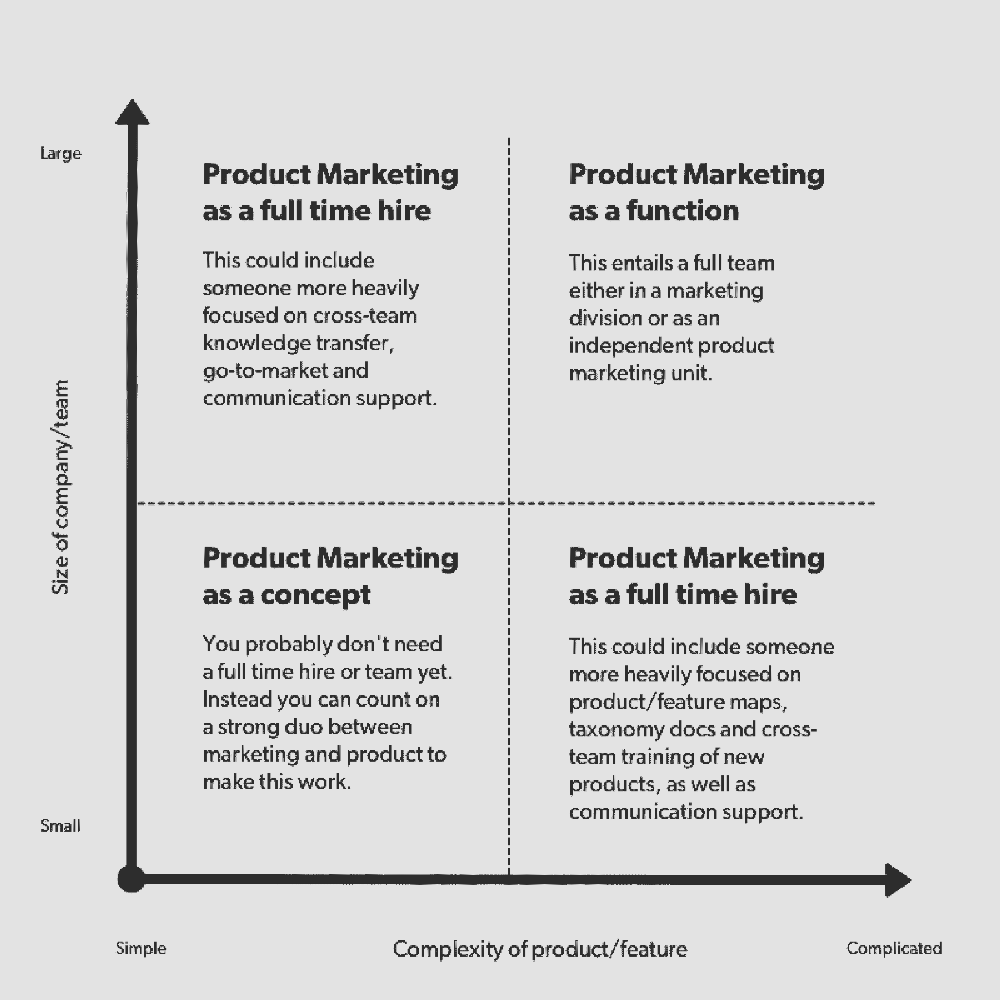

# class pass’CMO 关于如何以及何时投资产品营销

> 原文：<https://review.firstround.com/classpass-cmo-on-how-and-when-to-invest-in-product-marketing>

这是让首席营销官们夜不能寐的事情:是时候让一款心爱的产品寿终正寝了，消费者会在意的。很多。这不是会不会有媒体的问题，而是会有多艰难。社交媒体即将被这条新闻点亮。

这种情景最近在CMO**[乔安娜·洛德](https://www.linkedin.com/in/joannalord "null")** 身上上演——她感激不尽。

这家健身初创公司逐步取消了其无限会员选项，这对公司和用户来说都是一个令人失望的决定。但这给了洛德和她的团队一个机会，让他们加倍努力做好产品营销人员最擅长的事情:他们花了近一个月的时间准备每一个问题和评论，每一条推文和客服电话。在内部，他们与产品、营销、销售和 CX 一起设计新产品，以满足——甚至愉悦——受影响的用户。最终，ClassPass 不仅提供了更可持续的产品，而且对用户需求有了更深入的了解。

对洛德来说，唯一的前进之路就是爱上一个过程:了解你的客户。做到这一点，即使最公开的营销挑战也只是一个机会，让你的产品更好，你的团队更专注，你的用户更开心。这种策略曾服务于 Classpass 的 Lord，以及家庭服务平台[Porsche](https://porch.com/ "null")的营销副总裁、忠诚软件提供商 [BigDoor](http://bigdoor.com/ "null") 的 CMO 和入境分析软件公司 [Moz](https://moz.com/ "null") (前身为 SEOmoz)的增长副总裁。

在这次独家采访中，洛德阐明了什么是真正的产品营销，以及为什么创始人应该尽早考虑投资。她分享了招募、整合和建立一流产品营销团队文化的战术建议。她解释了为什么一个凡事都把顾客放在第一位的组织会有一点魔力。

# 什么是产品营销，什么不是

Lord 说:“产品营销的核心是了解你在构建什么，你为什么投资它，它将如何使用户受益，然后将这种理解传达给你的客户。”但是如果你不确定产品营销和“市场营销”有什么不同，你并不孤单。

Lord 注意到，许多人最初将产品营销定义为定位能力，但她认为远不止如此。她认为这个领域是四项关键任务的结合。它帮助一家公司确定:

**构建什么**(通常与产品重叠)

**为谁打造**(通常与 UX 或业务开发/销售重叠)

**如何定价**(通常与定价、营销、产品或销售重叠)

**以及如何销售**(与营销和销售重叠)

“传统上，营销是利用渠道来推动潜在客户或销售线索，让人们处于漏斗顶端，然后推动他们通过漏斗，而产品营销更多的是帮助现有客户了解你的产品和功能，并与他们互动。”当然，如果做得好，产品营销也会带来新用户。但这主要是一种与客户沟通的练习，帮助他们理解你为他们打造的一切的全部价值。

# 何时启动产品营销

因为产品营销从根本上来说是跨职能的，创业公司很难知道何时以及如何整合它。如果你想知道是不是时候了，考虑两个关键问题:

你的公司有多大？

你的产品组合有多复杂？

在小公司里，更容易让客户服务、产品、营销和销售在同一页上谈论你的产品的特点和为什么有价值。“如果你有一个产品，而且对公司来说还为时过早，你甚至可以让你的产品团队或营销团队中的某个人在 50%的时间里扮演这个角色，”洛德说。“非常小的早期初创企业可能不需要产品营销人员，因为他们的首席执行官就是产品营销人员。”

另一个轴是你的产品组合。如果你的产品很复杂，考虑早点投资产品营销，即使你是一家小公司。“一个产品或功能可能因为许多原因而变得复杂:它可能涉及一个新的 UX 概念，定价可能随着使用情况而变化，或者它可能需要用户在完全解锁之前做出预先承诺，”Lord 说。

“在 ClassPass，我们为移动客户推出了全新的家庭体验。它的全新导航包括个性化建议、即将到来的课程信息和他们最喜欢的课程，”洛德说。“这是我们以前‘基于时间表’的界面的一个重大转变。我们希望这种新体验能够传达我们创建无缝、个性化健身会员的承诺，但这并不容易在几个接触点中传达出来。”

因此，如果你离产品太近，不知道你的产品或即将发布的功能是否复杂，问问自己这些问题:

这感觉像是对当前体验的进化或革命吗？

你想通过这次发布传达一个更大的战略或使命转变吗？

一个客户向另一个客户解释产品或功能有多容易？

如果你在完全没有支持或产品提示的情况下推出这个产品或功能，它有多容易理解？

最后，如果您让您的内部团队向客户解释，他们会以同样的方式直观地推介吗？

“通过问这些问题，你会很快发现，最接近产品的团队觉得简单的东西，如果没有正确的产品营销战略，很容易让客户感到困惑，”Lord 说。

在评估了你的公司的规模和产品组合的复杂性之后，你会在这个矩阵中找到一个位置。

这不是你是否需要产品营销的问题，而是什么时候需要的问题。随着你公司的成熟——随着公司规模的增长或开发更复杂的产品组合——需要有人专注于信息传递和定位将变得很明显。“当然，你需要实现产品/市场的契合。洛德说:“在那之前，你仍然在碰壁，等着看你的产品是否真的有需求。"不过，除此之外，我认为应该尽早投资."

产品营销本质上介于产品管理和开发与获取和保留之间。因此，产品营销人员拥有许多重要的任务，否则就会陷入某种无人区。其中最重要的是竞争性研究；产品营销通常还负责为公司创建许多重要的定义、事实和分类文档。

如果你正在将价值陈述拼凑成一封发布邮件，那么是时候构建产品营销了。

# 如何根据合适的技能进行招聘

这是一个特殊的雇员，他可以坐在构建伟大产品和将它们传达给公众意识的交叉点上。当需要投资产品营销团队时，你需要寻找软硬技能的特定组合。

“正如你所料，我发现最好的产品营销人员是营销和产品的结合体，”洛德说。候选人需要精通不一定完全适合单一学科的主题:例如，构思、敏捷开发、发布、上市和需求挖掘。洛德最成功的雇员往往是从产品部门开始，然后发现自己被市场营销所吸引——反之亦然。“你要寻找的是对这两种学科的尊重。产品营销不是非此即彼。她说:“两者都是。

除了专业知识，在寻找优秀的产品营销人员时，有几个关键特征是不容置疑的:

**画龙点睛:**产品营销涉及很多细枝末节，候选人需要全部驾驭。当你看简历的时候，留意你的项目管理背景。根据洛德的经验，许多优秀的产品营销人员也来自那个世界。

**默认研究:**“产品营销人员必须以数据为导向，热爱研究。洛德说:“他们花了很多时间了解市场，并帮助公司了解如何定位自己。亲自或 UX 研究印章，更传统的数据经验，可以有所帮助。

**获取反馈:**你的产品营销人员是你的用户的代言人，他们需要对进入客户思维模式的挑战感到兴奋。“他们必须对 CX 怀有深深的敬意和回馈。洛德说:“他们必须想开发出真正为客户服务的东西。

**跨职能角色:**在您的组织中，很少有角色比产品营销接触更多的人。"候选人确实需要有强烈的自我意识，但也要有人际关系意识."如果一个人不能很好地跨部门和跨职能合作，他就不能胜任工作。

要寻找的东西很多，但洛德分享了一些她最喜欢的面试问题，以便更深入地挖掘候选人的资格:

**什么是产品营销？你的产品营销框架是什么？“他们需要做的第一件事就是向我展示一个伟大的上市战略，”她说。这通常应该包括跨团队的清单，以及在发布之前、期间和之后要执行的任务**

**您如何衡量走向市场的成功？**点击此处了解详情。举例来说，答案可能会集中在提高认知度或采用率，或者增加保留率。但无论框架是什么，它都应该植根于可测量的数据。“这是一个领域。这里面有很深的学问，”洛德说。“当有人说，‘我就是喜欢产品。我喜欢帮助客户了解伟大的产品，“那对我来说太软了。”

你如何处理歧义？你如何处理快速时间表？你如何通过组织传递知识？然而，产品营销也有至关重要的软技能。在面试中留有余地，以了解候选人将如何管理创业生活的压力，或者协调大量忙碌的同事所带来的不可避免的挑战。

你可能还想考虑一个家庭作业，特别是如果你面试的候选人只在产品营销领域的某一方面有“非官方”的专业知识——也就是说，他们在营销或产品方面担任过角色，但在这两方面都没有可证实的经验。

洛德分享了她的一些日常练习:

**这里有一个成品。您将如何为市场定义和定位它？**“你实际上是希望他们带着他们会问的问题回来。以下是我想问产品的问题。以下是我想问高管团队的问题。以下是我会向焦点小组的客户提出的问题。"

**我们有这种真实世界的产品。人们很快就不喜欢它了。我们如何找到原因的核心？**在这种情况下，你希望候选人展示出他们知道如何联系整个公司的所有反馈渠道。此外，你希望他们证明自己斗志昂扬。“他们应该向你表明，他们理解取消调查，或者会进行一次现场调查，以了解人们为什么会反弹。洛德说:“他们会和 CX 谈谈，看看他们认为是什么导致了这个问题，或者采访销售团队，这可能是了解销售过程中摩擦的第一来源。

# 开展产品营销的艺术

一旦你找到了适合这份工作的人，是时候让他们融入你的团队了。尤其是当涉及到让你的第一个产品营销人员入职时，要深思熟虑——这实际上比你可能意识到的要有更多的艺术。

我认为最大的错误是未能确保产品经理和营销经理对产品营销有一个共同的定义。

“你雇佣谁并不重要。洛德说:“如果产品经理觉得是别人在定义他们的产品，或者渠道营销人员觉得是别人在告诉他们如何销售，这种做法就会失败。

销售和 CX 也一样，当一个新的功能开始告诉他们如何与客户交谈时，他们会感觉自己的脚趾被踩了。不过，从一开始，Lord 就向她的营销组织明确表示，这些部门既是他们最有价值的信息来源，也是他们最脆弱的利益相关者。她说:“没有什么比 CX 团队更接近客户困惑的核心了。“我们尊重这一点，如果我们没有做好自己的工作，他们会感觉到这一点。”

建立一个产品营销组织对创业公司来说是一个巨大的福利。当面向客户的团队可以很容易地与产品分享见解时，反之亦然，整个公司都在同一页上。从很多方面来说，这是一个重新获得初创公司早期独特的协作能量的机会——只是这一次，专业知识和流程有了新的深度。“但如果人们对应该发生的事情没有相同的理解，最终就会出现大量的地盘争夺和筒仓制造。出于所有显而易见的原因，这真的很可怕。”

因此，一个成功的产品营销组织需要明确的授权和全公司的共识。像组织的许多其他元素一样，它也需要一个稳定、一致的产品路线图。

洛德说:“如果你因为有一个很棒的产品而引入一个产品营销人员，但你不知道你下一步要做什么，也不知道何时或如何做，这个人就没有立足之地。”“在这一点上，他们更像是项目经理。这是一个非常昂贵的项目经理。”

当然，产品营销人员本身也发挥着至关重要的作用，证明他们的价值，并建立一个团队，该组织的其余部分尊重和重视。根据洛德的经验，这可以归结为公开、谦逊的交流。她表示:“产品营销人员必须是提问的专家，并了解客户及其内部利益相关者。”。

另一方面，做出假设是失去内部认同的最快方式。这是一个容易犯的错误。产品营销人员处理大量的定性和定量信息；在很多方面，形成观点是很自然的。“如果它们是规定性的，而不是客观的，那就真的很危险。从来没成功过。这往往又会导致孤岛。”

伟大的产品营销的关键是保持两样东西:目标和团队精神。

# 通过实验释放产品营销

两者兼顾的最佳方式之一是交换意见，进行数据驱动的分析。除了促进跨部门合作，产品营销团队可以也应该引入一种实验文化。

“产品营销归结于你如何定位和传达一个功能或产品，”洛德说。"出色地做到这一点需要大量的测试."首先，[制定 A/B 测试标准做法](http://firstround.com/review/indispensable-growth-frameworks-from-my-years-at-facebook-twitter-and-wealthfront/ "null")；现在测试软件如此便宜，没有理由不买。“能够快速切换定位是找回信号的重要组成部分。它可以帮助你更快、更自信地行动。”

除此之外，没有一个单独的实验适合每一个创业公司，也没有如何进行测试的规则；这在很大程度上取决于你公司的路线图和相对成熟度。但是每个创业公司都需要权衡发展公司的三个关键途径:**收购、保留和货币化**。如果你像大多数创业公司一样，很有可能你对他们的评估是错误的。

“大多数初创公司过度投资于收购测试，而他们本应研究——并利用他们的大部分产品营销团队——来了解和影响保留率。”

另一个常见的测试陷阱？问一些过于宽泛的问题，以至于无法产生精确的、可操作的见解:“你希望我们构建什么？”或者“你的头号问题是什么？”在产品/市场匹配的过程中，你可能会问一些宏观的问题，但这些问题与你在扩大规模时应该问的问题不同。

以洛德在取消调查中看到的一个常见问题为例。她说:“许多方法从根本上来说是有缺陷的，因为它们允许你用‘我就是看不到价值’或‘我就是不喜欢’这样的话来回答。”。“把它带回团队，你仍然会在一个黑暗的房间里对着所有的墙壁射飞镖，不知道你在做什么。”

为了避免浪费客户宝贵的时间，在测试中一定要具体。实验的严格性可能会与初创公司对速度的需求发生冲突，但要抵制匆忙行事的诱惑。过程是至关重要的:确定你的论点和具体目标，你将测试的群体，以及你将如何执行你的测试。然后定期与参与实验的小组会面，评估测试本身。

例如，ClassPass 的团队认为，该公司在视频健身方面有独特之处。他们致力于在该领域进行产品投资，并花时间对这些投资应该是什么样的进行假设和测试。“我们还不确定我们在这一领域的贡献有多大。但我们有信心去尝试。”

# 产品营销如何引入产品反馈文化

然而，成功的产品营销不可能存在于真空中。这需要组织中的每个人都承诺分享他们的见解，并在机会出现时为客户发声。首先，这可能很简单，要求每个团队每周发送一份关键发现的报告:数据驱动团队的测试结果，或者对工作质量更高的团队总结一周的亮点和不足。“你只是想带来知识，带来一种实验至上的文化，”洛德说。

但是“分享”不仅仅意味着传播测试结果；它需要成为你公司文化的一部分。“任何人都可以带着一个想法走到我们的 CPO 面前，或者说，‘这个测试向我展示了 X 和 y。我应该与你团队中的谁联系，讨论这是否可以成为一项功能或产品？’“给这种开放设置参数是没问题的。在 ClassPass，一项测试必须证明某样东西可以产生 1000 名用户，才会被考虑用于产品开发。目标是[简单地授权任何团队成员发现并分享改进产品的机会](http://firstround.com/review/how-a-b-testing-at-linkedin-wealthfront-and-ebay-made-me-a-better-manager/ "null")。

通过鼓励对想法的公开讨论，你也(也许是反直觉地)让你的团队在他们的想法没有进入管道时更容易前进。洛德说，ClassPass 鼓励“不同意和承诺”的文化，她建议其他创业公司也这样做。

“每个季度我们都会进行规划冲刺，任何人都可以提出他们的想法和商业案例，说明为什么它值得投资，”她说。“当面临阻力时，你可以抓住最后的机会表示不同意，并说，‘我真的认为这是正确的事情。看看我做的那些测试。但如果首席采购官或产品主管看着你说，“我听到了。但现在不是合适的时候，你必须接受这一点，并支持那些向前发展的想法。"

这并不是说向前看很容易。“你每天会有大约一千件想做的事情，”洛德说。“在这成千上万件事情中，大概有 20 件是顾客眼中带着痛苦恳求你解决的。但现实是，其中一些将不得不原封不动。”

这没关系，只要你坚持顾客至上。“你必须承受更大的波动。洛德说:“合适的东西会影响销量，所以你要寻找能影响大多数人的东西。”。“这些将开始慢慢渗透。”

同时，给最接近你的用户的团队一个响亮的内部声音:客户支持。这应该采取持续和公开对话的形式，但也可以包括一次性的合作活动。“最近，我们做了一件我们称之为‘必杀日’的事情，整个公司都支持 CX，开始处理求助单，并把它们发送到零号收件箱，”洛德说。“这是我们做过的最好的事情之一。从那一天起，工程师、产品经理和营销人员都醉心于为客户解决问题。”

主持一场“必杀日”，所有队伍帮助 CX 到达收件箱零点。每个人结束一天的工作时都在为客户解决问题。

# 如何衡量产品营销的成功

但是，你怎么知道你是否真的接触到了那个客户呢？Lord 将其带回产品营销的四个关键要素，每个要素都有自己的一套衡量标准:

**构建什么:**在这里，你会想看看产品参与度指标，这是你可能会想到的:登录、使用统计、销售数字。

**为谁打造:**这通常取决于你的客户反馈循环、取消调查、漏斗转化率。并特别注意您的激活指标。“早期报道非常重要。这将告诉你，你是否引入了合适的人，你是否在为这些人制造产品。”

**如何定价:**“对于产品营销人员来说，定价可能是最难理解的，”洛德说。"[归根结底是调查和客户研究](http://firstround.com/review/the-price-is-right-essential-tips-for-nailing-your-pricing-strategy/ "null")。这是从顾客那里发现‘当你说这不是一个好的价值，或者这不是一个合适的价格，这对你意味着什么？’"

**如何销售:**这是产品营销人员最以营销为导向的任务，可以用传统的获取指标来衡量——点击率和转换率、客户获取成本、漏斗转换率——以及你与 CX 或销售的反馈回路。

“产品营销的每个方面都有不同的衡量方式，但这绝对是一门可衡量的科学。”

也就是说，你不会——坦率地说也不可能——在你成长的每个阶段对所有这些指标给予同等的关注。洛德说:“在任何时候，产品营销总有一个更重要的部分。“如果你只是过了产品/市场适应期，而专注于增长，那么你会考虑如何销售你的产品，以及你在为谁打造产品。这些指标会移动到顶部。如果你处于一个更可持续的商业阶段，你想提振 LTV 或 RPU，那么你真的要考虑如何定价。为了增加粘性，你还打算打造什么样的功能？”

在这里，分享也是关键。如果团队中的每个人都不知道你正在追求的最高目标，以及哪些指标已经上升到最高，那么你将永远达不到你的最高绩效。“人们嘲笑把仪表盘挂在墙上。但是如果你没有让这些指标始终可见，如果每个人都不知道你每天都在做什么，那么他们就不会被提醒事情的紧迫性。这是数据文化的重要组成部分。”

# 如何保持产品营销的顺利进行

一个良好整合的产品营销功能的协作、数据驱动的文化将每天都有回报。当需要经受地震般的产品转变时，它将被证明是非常宝贵的。Lord 带领她的产品营销团队经历了考验和磨难，这些信条帮助他们坚持到底:

**坚守你的使命。**“首先也是最重要的一点，你必须能够以一种非常真实、诚实和易受攻击的方式，将重大产品变更与使命联系起来。你需要解释这种变化如何帮助你兑现对顾客的承诺，”洛德说。采取 ClassPass 行动，取消无限会员资格；从根本上说，这一决定反映了产品和公司使命之间的根本错位。“我们的使命是让世界变得更加活跃。为了让这个产品在经济上可行，我们不得不寄希望于人们没有成功。”

深思熟虑地沟通——而且要彻底。一旦你发现了错位，并确定了解决错位的产品转变，产品营销人员的下一步工作就是引导客户理解你的逻辑。然后，你需要告诉他们你下一步要去哪里。“向他们展示你将要建立的东西，并帮助他们实现认知上的飞跃。有些人不会，但如果你做得好，很多人会，”洛德说。“简而言之:成功营销一项重大的产品变革是一项艰苦沟通的练习。产品营销部门负责向每个团队传达他们需要的任何信息，做到谨慎而清晰。”

对于 ClassPass 最近的变化，Lord 和她的团队花了数周时间与所有内部利益相关者进行面谈和头脑风暴。他们想象他们会收到的每一个可能的问题和异议——来自客户、合作伙伴、媒体等等——然后起草适合任何事情的回复，从 Twitter 到销售电话。“三十个人花了整整二十个工作日，”洛德说。“我们准备过度了，但当你知道客户应该得到正确的答案时，你就会这么做。你不能含糊其辞，你不能撒谎，你不能歪曲事实。你必须全力以赴，把它做好。”

否则，很容易行动迅速而不严谨地思考——这通常不是恶意的。你只是简单地想象一个重大的公告将如何公开，并且有一种本能来合理化你的决定。但这正是开放的思想共享文化——即“不同意并承诺”政策——可以帮你摆脱困境的地方。“这就是制衡如此重要的原因，”洛德说。“CX 的某个人会站出来对我说，‘绝对不行。我不能板着脸对顾客说这些。“那不是真的，”有很多来来回回。"

勤奋需要时间和大量的内部资源，所以为你的团队设定正确的期望是至关重要的。请记住，这可能也会让他们失望——花几个月甚至几年的时间来构建一些东西，却看到它被淘汰，这是很难受的。“你必须诚实地说，‘嘿，这不会是我们发送电子邮件的一个小时，这很难。这将是三个月的时间来追上 CX，处理媒体询问，并赢回一些善意"

**回归产品。**重获信任和好感的最佳方式永远是与你的产品在一起。如果你做对了第一步——如果你专注于你的使命——这也是你在艰难的过渡时期恢复团队激情和热情的地方。

“两年来，我们尝试了如此多不同的东西来制作无限的作品。在过去的几个月里，我们能够对团队说的是:“如果我们能够将正确的人转移到正确的计划中，然后对这些计划进行漂亮的投资，我们将实现我们最初设定的承诺。”现在，每个人都比以往任何时候都更加致力于提供有助于我们实现目标的产品功能。"

摄影由 ClassPass 提供。