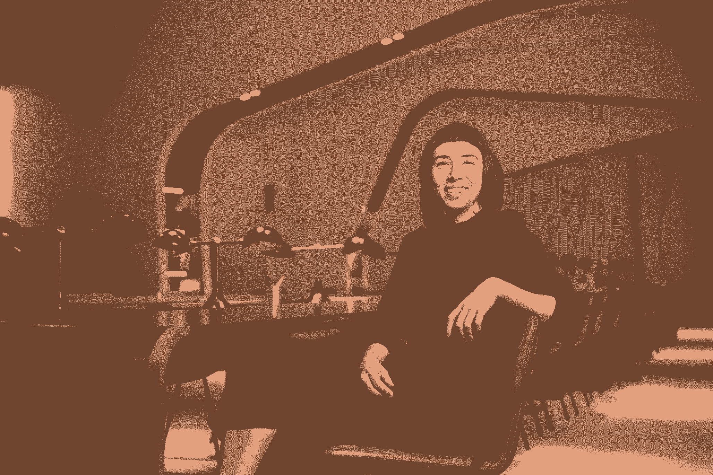

# 定义成长型设计:大多数创业公司都忽略的角色指南

> 原文：<https://review.firstround.com/defining-growth-design-the-guide-to-the-role-most-startups-are-missing>

从[投入产品设计](https://firstround.com/review/defining-product-design-a-dispatch-from-airbnbs-design-chief/ "null")和传播[设计思维](https://firstround.com/review/How-design-thinking-transformed-Airbnb-from-failing-startup-to-billion-dollar-business/ "null")的福音到分享[赢得一个席位](https://firstround.com/review/How-Designers-Can-Earn-a-Seat-at-the-Table-2/ "null")的技巧和作为[初创公司的唯一设计师](https://firstround.com/review/What-to-Do-When-Youre-the-Only-Designer-Theyve-Got/ "null")导航生活，这些年来我们在这里的回顾中收集了相当数量的[设计智慧](https://firstround.com/review/design/ "null")。

但就像所有早期创业学科一样，设计领域也在不断发展和成熟。随着最佳实践、不同方法和新工具的出现，子专业也在不断发展。最近，我们特别关注了最近的一个发展:小型而强大的成长型设计师群体的崛起。

Angel Steger 认为自己是这种新型设计师中的一员。作为 Dropbox 的增长设计总监(也是 Pinterest 的前任领导)，她经常处理快速和深思熟虑的问题，利用经常被提到的大脑左右半球来扩大业务规模，同时保持与客户需求保持一致。作为一名建筑师出身的设计师和前高级产品经理，她特别适合在这两个不同学科的交叉领域开展工作。

但就交叉路口而言，成长型设计仍然是一个没有标记的出口，是进入羽翼未丰的初创企业领域的未知领域的出口。虽然许多公司已经召集了一批工程师、产品人员和营销人员，他们在增长的旗帜下疯狂地尝试获取、保留和吸引用户，但设计的这一子集是一个新兴的角色，仍在形成中——在 Steger 看来——被忽视了。

“这还不是一个非常正式的领域，所以我认为有一定数量的神秘和误解，”Steger 说。“增长唤起了黑客的想法，运行短暂或令人不快的实验。这是有一定道理的。这是关于迅速扩大参与用户的数量，当然，也是尽快应用学习的心态。但是当创业公司做得对的时候，成长不仅仅是一时的胜利。我们有责任创造和优化可持续的体验，吸引更多长期参与的用户。这一部分没有得到足够的讨论，而这正是生长设计可以发挥主导作用的地方。”

在这次独家采访中，Steger 作为我们长途跋涉的向导，以更好地了解这一新兴专业。她涵盖了所有的要点，详细说明了为什么这是 runway for impact 的一个角色，分享了她在 Dropbox 和 Pinterest 的角色中如何处理增长设计的见解，并概述了寻找、面试和设置新增长设计师以取得成功的策略。让我们开始吧。

# 成长设计前线的故事

如今，在科技公司内部找到一个成长团队是不寻常的*而不是*。这与[早期的成长](https://firstround.com/review/indispensable-growth-frameworks-from-my-years-at-facebook-twitter-and-wealthfront/ "null")大相径庭，当时一些人想知道一个成长团队实际上做了什么，是否有必要。但是，尽管它无处不在，却没有一个组建成长团队的标准手册。有的群体是分散的，有的群体则更为集中；一些公司聘请营销人员和数据分析师与专注于增长的工程师和项目经理一起工作，而另一些公司则选择更精简的配置。

根据 Steger 的经验，不管是什么样的结构，设计都是一个典型的建筑块，很少被理解，因此也没有被充分利用。一些成长团队根据需要临时引入设计资源，而其他团队则完全跳过，试图更快地将实验推出。

“你经常听到的是‘这真的需要设计吗？这只会让我们慢下来。“几乎每个设计师都遇到过来自项目经理或工程师的阻力，”她说。当人们问我他们是否需要一名成长型设计师时，我总是说“只有当你想让你的企业成功的时候”，这无疑有点言过其实。但是，为了更快地完成某件事而跳过细节工作会伤害你的学习，使其无效。混乱的测试、定义不清的问题、缺乏数据——这些都是在发展过程的一开始就没有考虑到设计的结果。"

更清晰的体验让用户更容易快速行动，从而更快地让成长实验达到统计显著性。你可能认为通过修剪设计细节来“节省时间”,但这可能会增加几周的时间。

斯泰格对这个角色所能带来的优势的理解比大多数人都要深刻。她在 Pinterest 的时候，成长设计功能从 3 个增长到了 8 个。同样，她在 Dropbox 的团队发展迅速，从 6 人增加到 20 多人。以下是她对成长型设计师带来的五种独特优势的看法**——以及为什么早期创始人和成长型领导者应该给他们一把椅子。**

**1。不同专业的图纸**

在斯泰格看来，成长型设计师集两者之长，利用了这两个学科的优势，这两个学科正是这个角色的名字来源。

“一个优秀的成长型设计师在产品思维、交互、视觉设计和客户同理心方面都非常强。这些细节解决了客户意识和互动不同层面的问题，”她说。“设计也是一个非常以用户为中心的学科，这不一定是成长型团队的声誉。Steger 说:“增长设计师作为用户体验的守护者，将推动增长团队确保每个人都专注于业务成功——通过用户成功的镜头。”

在成长设计上，一方不压倒另一方。这是一个平均的 50/50 分割，使我们能够将两个世界的最好的东西带到创业桌上。

这个混合角色的名字的前半部分也闪耀着光芒。“Growth design 的行动非常迅速，并定期进行实验。因为成长团队的衡量标准更清晰，可能更专注于特定的目标，这使他们能够更快地行动，并交付更具体的结果。她说:“一个没有特定目标或用户目标的产品设计团队可能需要几年时间。

Angel Steger, Dropbox’s Director of Growth Design

**2。脚手架用户成功。**

在描述成长设计时，斯泰格经常引用电影[戈斯福德公园](https://en.wikipedia.org/wiki/Gosford_Park "null")中[海伦·米伦](https://en.wikipedia.org/wiki/Helen_Mirren "null")的台词。“她说，‘我是个完美的仆人。我知道他们什么时候会饿，食物也准备好了。我知道他们什么时候会累，床什么时候会被放下。在他们自己知道之前我就知道了，”“对我来说，成长型设计正是如此，”斯泰格说。 **It 在幕后为用户搭建成功的支架**。他们不一定感觉得到。这就像有一个真正伟大的舞伴带你去你需要去的地方，让你觉得你可以跳得很好。"

但这与更广泛的产品设计领域有什么不同呢？对于斯泰格来说，这是一个如何追求成功的问题。

“对许多设计师来说，在设计产品时，如果你在打造一件特定的东西，那会很性感。增长型设计和传统核心产品设计的根本区别在于，产品团队通常拥有特定的*表面*。因此，当你遇到问题时，你会用你现有的表面来解决问题，这可能会限制你的方法，”她说。

成长有机会决定你的产品在整个功能集上的基本优势，这是非常强大的——也是设计师应该参与的重要对话。

相比之下，对于负责让用户成功的成长型设计师来说，有一个更广泛的工具包，并且几乎允许他们想得更大。“增长设计更普遍地拥有*用户问题*。你不需要解决一个问题。为了确保用户的成功，你需要遍历多个产品。这类似于设计系统的角色，但是从用户体验的角度来看，“用户体验应该是什么？””斯泰格说成长型设计是一个非常有斗志和创造力的角色，即使是在初创企业的背景下。我们弄清楚用户需要什么才能成功，然后看看我们是否有现成的工具，或者我们是否需要做一些新的东西。

作为 Pinterest 增长的设计领导者——负责深化用户激活和参与——Steger 看到这种更宽的镜头和对用户成功的贡献一次又一次地派上用场。

“在 Pinterest，我们需要让用户找到他们喜欢的内容，然后付诸行动，特别是在保存流程中，新用户保存 pin 并创建他们的第一个留言板，”她说。“但我的团队发现，保存流程针对拥有很多很多板的人进行了大量优化。这个流程有很多 UI 缺陷，比如“最近的公告板”对于一个没有公告板的用户来说没有任何意义。它增加了噪音，无法匹配他们的背景或澄清手头的任务。”

然而，这并不意味着消除所有的摩擦。**一张白纸就像一系列不相关的选项一样让人不知所措。“通过研究，我们发现为自己的董事会命名非常重要。如果我们自动给你的板子命名，它会从这个过程中去掉一些东西，使它不那么粘。但是，作为一名设计师，你仍然需要减少创作时的[认知负荷](https://firstround.com/review/cognitive-overhead-is-your-products-overlord-topple-it-with-these-tips/ "null")。**

当你试图让人们理解你产品的核心机制时，你需要避开他们的方式，让路径变得异常清晰。帮助你的用户步入游泳池，不要把他们扔进深水区。

“当我是一名艺术家时，我常常只是在一张纸上做一个标记，只是为了打破页面的物理张力。与之相当的是，我们进行了一项实验来推荐董事会名称。如果你正在保存食谱，我们会建议你点击“食谱”、“吃的东西”或“食物”等选项。它显著提高了激活率。它为人们进入产品创造了一个跳板，我不确定我们是否会从特定产品团队的职位上发现这个空缺。”

**3。揭示潜在动机。**

许多成长努力中缺少的一个要素是理解情感和体验成分，这是使一个功能或整个产品工作的必要条件。“我们都访问过那些高度优化的网站，你的本能反应只是说‘这不是给人类看的，这是给网络爬虫看的。’这通常不会给你留下好的感觉或对服务的信任。斯泰格说:“这就是增长设计师等式中的设计部分:为用户辩护，以及什么会真正导致他们改变行为。”

大多数成长团队已经具备了这种商业战略能力——设计师可以翻译和推动远离用户最佳利益的钟摆。

“某些类型的策略在短期内看起来不错，但可能会灼伤人。如果你发送垃圾通知或电子邮件，你贬低了整个生态系统。如果用户关闭通知或取消订阅，你就再也没有机会了，”Steger 说。“事实上，对于世界上的每一种商业模式，你都希望与你的客户建立长久的关系。建立一个可持续的增长循环，这并不是表面上看起来很有希望，但实际上是在幕后搅动和燃烧。”

你可以哄骗用户做事，但事实是他们只会上当这么多次。相反，推动一种真正解决他们情感细微差别的体验——这是增长将推动重复行为并开始建立用户习惯的时候。

为了更可持续的增长，确保用户能够看穿他们的意图，并带着良好的感觉离开产品体验。“当我们在 Pinterest 做分享流的时候，我们意识到:发送就是你向特定的人发送内容。分享是一对多。通常，我们在 Pinterest 上看到的是，因为这关乎你的个人品味，你实际上是在发送，而不是分享。这是一个微妙而有意义的区别，”Steger 说。

随着对主要意图的更好理解，团队着手改善用户体验。“经过仔细观察，我们发现你可以在手机上进行大约 11 种不同的发送操作，这太疯狂了。她说:“你必须做出的决定越多，你就越不可能做出任何决定。

为了简化这种体验，Steger 和她的团队反复将其筛选为三种发送类别，并将原始发送速率提高了近 7 倍，展示了增长设计实验的惊人潜力。

**4。找出实验中要寻找的东西——以及真正成功的结果是什么。**

即使关注用户的成功并致力于揭示更深层次的动机，如果没有从根本上把握哪些结果是重要的以及如何观察它们，增长实验也不会真正成功。

“成长的一个关键部分是理解如何观察，这不是我传统上认为的超越传统研究方法的设计能力，”Steger 说。“你需要想清楚如何在野外观察某些东西。例如，当有人访问一个页面时，他们在页面上做什么？他们在滚动吗？他们合得来吗？他们在犹豫某些事情吗？他们在上下阅读吗？成长型设计师往往对如何观察行为有更强的理解。”

更深一层地挖掘，很明显，这些强大的观察技能让增长设计师获得了宝贵的理解，即**增长实验可能会产生对用户不利的积极结果。**

“当我在 Pinterest 从事分享工作时，我们的假设是，我们需要尽可能顺畅、快速的信息流。那个实验的结果非常积极。但是，当我们做用户研究和观察实验室里的人时，生长设计师看到了一些不同的东西，超越了数字。我把它描述为一张糟糕的脸，这种经历结束得太快了。他们什么也没说，但是有一个完整的身体“发生了什么？”斯泰格说:“这是一种反应。

“经过一番挖掘，我们发现这感觉太快了。这真的回到了理解他们的意图。你喜欢和你亲近的人分享——可以是任何事情，从未来买房的计划到一个愚蠢的内部笑话。不管它是什么，它都是有意义的，人们真的需要并想要设定背景，”她说。

Steger 的团队随后在分享流程中增加了一个额外的步骤，以允许个人信息。“从纯增长的角度来看，这是违反直觉的。它稍微降低了发送的总量，减慢了速度，但是增加了*的响应率。*最终，这就是成功所在，”她说。“回应率就是价值。没有人想分享到一个空白——当收件人回复时，你更有可能继续发送内容。思考行为动机的整个生态系统，而不仅仅是离散的行动。**如果你的成长团队中没有设计师，你可能会错过从实验中获得的真正的*****。”***

***成长设计推动你看向结果之外。我见过数据显示积极结果的实验，但回到研究实验室，用户有一张我称之为糟糕的连接脸。这不是一次让他们感觉良好的经历，也不是他们会反复做的事情。***

*****5** 。用链锯和凿子选择速度，而不是匆忙。***

***传统产品设计和成长型设计的另一个关键区别源于艺术界的一个简单事实:很难定义什么是“好的设计”。***

***“在成长的背景下，这取决于你的目标。斯泰格说:“高质量的设计可能并不意味着它完美无瑕，而是它足够完美，足以让你进入下一个阶段。”“如果你的目标只是学习，而不是运输，那么这就是你必须清除的障碍。你把东西运过去之后，标准就不一样了。然后是‘我们如何能让它变得更好？最好是什么样子？“我们怎样才能把柠檬里的果汁都挤出来，”许多传统设计团队过度工程化和过度设计，而成长型设计师知道他们可能在寻找更简单的东西。"***

***这不仅仅是掌握实验所需的设计水平的问题。“也许我根本不需要设计。“也许我需要做的只是收集数据，进行对话，向客户展示图纸草图，或者让他们画画，”斯泰格说。**因为成长型设计师跨越两个世界，我们可以感觉到我们需要从设计工具箱中拿出什么——以及何时完全关闭它**。"***

***从本质上来说，Steger 对经典智慧进行了更新，即手里拿着锤子，所有问题看起来都是钉子。“想象一下，你正试图把一块冰塑造成一只海豚。如果你开始用你最好的凿子，它会花你很长时间，在你到达那里之前冰就会融化。相反，从电锯开始。画出形状，大致了解问题到底出在哪里。然后你可以越来越精细，拔出凿子，甚至更小的凿子，精细地雕刻，添加你需要的细节，”她说。***

***对 Steger 来说， **growth 的目标是尽快学习和执行。但这不是匆忙的问题，而是速度的问题。**“这是一个非常重要的区别。她说:“这是一个成长型设计师能够为更广泛的成长型跨职能对话带来什么的概括。“通常，工程师或项目经理的诱惑是仓促行事，缩短执行时间，以便提前两周发货。有时候确实如此。但是对于实验来说，并不总是关于启动速度，而是关于干脆的执行。退一步想想什么会对统计意义有贡献。”***

***做实验，有时候需要电锯，有时候需要凿子。成长型设计师知道该使用哪种工具。***

# ***如何在野外发现成长型设计师***

***除了概述成长设计师可以为早期创业公司带来的资产，Steger 还可以从财务上证明雇佣他们:“如果你想雇佣你的第一个设计师，考虑将其塑造成一个成长设计角色。她说:“找一个人同时做这两件事会更便宜。”“你基本上得到了一个全明星球员。找到合适的人，你就有了一个关注用户体验和业务影响的人——只需一次招聘的费用。”***

***但是根据 Steger 的经验，这项任务，就像大多数创业公司的招聘工作一样，说起来容易做起来难。虽然许多领导者[面临着寻找设计师的特别激烈的竞争](https://firstround.com/review/defining-product-design-a-dispatch-from-airbnbs-design-chief/ "null")，但成长型设计师似乎更为罕见。***

***“招聘竞争异常激烈。目前处于成长设计的人的领域是如此的狭窄。**我估计 100 个候选人中有 5 个拥有实际的增长设计经验和专业知识**，”Steger 说。“在 Dropbox，我们通过查看相关能力来解决这个问题，在那里你可以找到具有相同技能的人，然后可以在度量素养等方面培训他们。瞄准技能，而不是特定的头衔，因为一旦你把目光放在了特定的背景上，就只有少数几家公司可以挖人了。”***

******

*****依靠这些档案寻找成长型设计师。*****

***当你在你的招聘漏斗中寻找一个强劲增长的设计候选人时，斯泰格建议你留意以下这些特质:***

*****独角兽。罕见的经验丰富的成长型设计师看起来像什么？“这是一个在所有设计工艺技能上都同样强大的人，但在产品思维和用户同理心方面也特别强大。他们真正理解用户在特定时刻的思维和感受方式，以及如何与用户的环境保持一致，”Steger 说。“如果你找到一位经验丰富的成长型设计师，抓住他们。但如果你不这么做(鉴于这些数字，你很可能不会这么做)，那就专注于技能和兴趣，而不是头衔。”*****

*****撞击导引头。** Steger 在寻找受影响力启发的候选人方面也取得了成功。“这可能意味着两件事。可能是天生的企业家，对商业影响感兴趣，因为他们希望有一天成为创始人。或者可能是那些深具同情心的人，当他们谈论设计项目中对他们有价值的东西时，他们会谈论它如何影响人们，以及它为他们带来了什么。”她回忆起最近的一次采访，一名候选人谈到设计一种特别棘手的产品:一种儿童用的交互式温度计。这位设计师开始钻研，甚至学习他需要什么来帮助为 Elmo 写一个剧本，Elmo 为会说话的温度计配音来安慰生病的孩子。“他描述了做研究和测试以确保让孩子们感觉更好的方式，你可以看出他真的很重视让用户成功，”她说。***

*****度量迷。**当你遇到一个热衷于衡量标准的设计师——他知道他们如何塑造产品的未来，但也了解他们的局限性——这个人具备成长型设计师的素质。“一些肤浅地理解增长的人会说，‘我们用这一个指标衡量，它是成功的。’“但他们没有注意到*的*有多成功——可能 1%的提升实际上只是噪音，但由于缺乏度量知识，他们称之为胜利，”斯泰格说一个更好的回答是‘我们获得了 20%的提升，这很好。但最佳答案是‘我们获得了 20%的提升，但我们在上次用户会议中观察到的是 x、y 和 z，因此，我有一个论点，如果我们改变这三件事，那将真正解锁一些东西。一个成功的增长型设计师明白一个事实，即数字的增加并不总是意味着更积极的用户体验。"***

*****斗志旺盛的创意。Steger 说:“如今，设计师经常使用同样的现成工具，以同样的方式解决同样的问题。但做真正的转型工作通常意味着解决新问题。如果你发现一个候选人愿意跳出框框思考，以更好地了解他们的用户，仔细看看。例如，Steger 的团队最近雇佣了一名设计卡拉 ok 工具的设计师。这是一个需要掌握的非典型用户体验，有不寻常的用户问题，但他没有被吓倒。“我看到的是，他建立了自己的工具来了解用户需要什么，如何测试，如何迭代和探索，”她说。*****

***成功的成长型设计师明白解决给定问题需要使用什么工具——如果需要的话，他们会准备好开发自己的工具。***

*****在整个面试过程中，在成长视角和设计视角之间切换。*****

***成长型设计师的面试过程通常包括一个设计演示，斯泰格建议，要弄清楚候选人是否能把战略和移情思维的基本组合带到桌面上。***

***首先，通过关注候选人如何框定他们提出的业务问题，了解他们会给等式的增长端带来什么。“当他们说话的时候，问问你自己，‘这真的是个问题吗？你的假设是真假设吗？它对导致结果的原因和原因采取立场了吗？“他们的成功指标很好吗？””斯蒂格说。***

***从这里开始，把硬币翻过来，寻找候选人也具有成长型设计师特征的迹象:用户同理心。“他们应该谈论用户，并设计用户的体验，”她说。“如果你在和一位经验丰富的成长型设计师打交道，你就不必提出这种想法。不过，对于其他候选人，不要犹豫，要直截了当。***

***例如，Steger 回忆起看到一个高级分享功能的演示:“当用户点击分享按钮时，他们得到的是一条追加销售消息，而不是分享流量。我只需要点击暂停，然后问候选人:‘你认为用户打算用这个流量做什么？“这种追加销售如何实现他们的意图？”因为，是的，表面上看，如果他们对分享感兴趣，他们是高级分享功能的很好候选人。然而，当某人正在做某事时，他们有非常明确的意图。你需要让他们先获得成功，然后再进行追加销售。你不希望你的用户像孩子一样，在 YouTube 上看视频之前先看广告。"***

***为了展示这些技能，Steger 在设计师展示他们的作品时提出了这些问题:***

***你试图解决的核心问题是什么？为什么它很重要？***

***你是如何衡量成功的？***

***谁看到这种体验？多久一次？他们是在什么背景下看到的？***

***此时用户的情绪和动机背景是什么？你的设计如何解决这个问题？***

***这一页上最重要的动作是什么？在这个层次结构中，你驱使用户采取的行动处于什么位置？***

***用户关心什么？您提供的解决方案如何强化而不是打断他们的计划？为什么用户会关心你引入的这个特性？***

# ***确定团队的范围，并为成功构建团队***

***虽然成长型设计师的多功能性对于寻求快速发展的初创公司来说无疑是一个优势，但这一角色的多用途性质可能会让他们很难决定应该坐在哪里。***

***Steger 建议创业公司将增长型设计纳入更广泛的设计团队，原因如下。“首先，在培训和指导方面，这是一种天然的契合。她说:“作为一名设计师，你希望能够向他人学习，并不断提升自己的功能技能。“但坦率地说，这也是一部关系剧。增长型设计会触及其他所有人的东西，人们会变得敏感。我在 Pinterest 上提到的发送流量？这不是我们的，是核心产品设计师的。但是我们改变了它。如果你要干预别人的经历，你需要有一点共同的纽带，某种维系这种纽带的关系，这样你才不会显得像个入侵者。”***

***这也是为什么她在向组织结构图上已经相当大的增长团队添加增长设计师之前会犹豫不决。“对于成长型设计师来说，为了有效合作，在成长型团队之外建立密切的关系非常重要。增长的潜在影响令人兴奋，但它也可能是一把双刃剑。当你解决了一个问题，人们会带给你更多。因此，随着时间的推移，成长型团队的发展速度有超过公司整体发展速度的趋势，”Steger 说。“这可能会让人们感到害怕，尤其是因为它看起来像一个孤立的群体，而大多数人并不属于这个群体。对一些人来说，看着一个成长中的团队极其迅速地扩张，会觉得它在转移。将成长型设计师放在更广泛的设计组织中有助于缓解这种情况。***

***然而，没有正式设计团队的初创公司应该将新的增长设计师放在产品组织中，营销是下一个最佳选择。无论增长设计师在哪里，他们都可能有一条增长虚线，就像 Steger 自己在 Dropbox 的团队一样。“你仍然希望被束缚在你的组织正在做的事情的战略方面。这就像有两个父母，”她说。***

***以下是斯泰格推荐的三个帮助成长型设计师走向成功的额外策略:***

*****依靠这些比率:**[将产品、设计和工程融合在一起的三位一体模式](https://firstround.com/review/defining-product-design-a-dispatch-from-airbnbs-design-chief/ "null")现在似乎成了常态。但是根据 Steger 的经验，为这个三元组找到正确的比例会对团队的权力动态产生很大的影响。“**我喜欢一个产品经理对两个设计师对三到六个工程师的比例**，这可能更取决于你所解决的问题的技术含量，”她说。“成长型设计师的健康比例意味着他们不是团队中唯一的突破点。这就是为什么我认为有多个设计师是有用的。你得到了一个伙伴系统，一个理解你试图解决的问题但也能推动你执行的人。同时，你也不会有 20 个人盯着你，盯着你的东西。”这对产品经理来说也是一个福音。“项目经理可以专注于机会，而设计则专注于如何利用工程解决这些机会，”Steger 说。***

*****为团队指明正确的方向:**有了解决用户问题的广泛授权，成长型设计师的才能可以瞄准几个不同的方向。根据 Steger 的经验，获取、入职和激活用户是成长型设计师最重要的影响领域。“最棒的地方是让人们经历从‘我可能是用户’到‘我完全投入’的关键阶段。斯特格说:“如果你的初创公司正处于公司生命周期的早期阶段，试图[寻找产品/市场契合度](https://firstround.com/review/how-superhuman-built-an-engine-to-find-product-market-fit/ "null")并建立用户群，那么入职和激活就是一个成长设计师的难题。“但如果你的公司在市场上无处不在，目标是让用户保持参与，那么增长设计师会专注于保留和扩张。他们接下来要解决的问题是‘我们如何确保我们的用户继续获得价值，并且他们继续拥有多样化的使用案例，因此产品对他们来说具有粘性？’"***

*****继续向这些成长型设计大师学习:**在一个仍在发展的领域，知道谁在冲锋陷阵、铺平道路是很有帮助的。面临陌生领域的创始人和成长领袖可以向正在实地塑造这一新学科的后起之秀学习。以下是斯泰格会大声喊出来以获取灵感的成长型设计领袖: [Scott Tong](https://www.linkedin.com/in/scott-tong/ "null") ，他最近在 Pinterest，Opendoor 的[保罗·史密斯](https://www.linkedin.com/in/paulclaytonsmith/ "null")，Instagram 的 [Maria Ioveva](https://www.linkedin.com/in/mariaioveva/ "null") ，Lyft 的 [Audrey Liu](https://www.linkedin.com/in/helloaudreyliu/ "null") ，以及脸书的[约翰·埃文斯](https://www.linkedin.com/in/johnanthonyevans/ "null")和 [Raphael Grignani](https://www.linkedin.com/in/raphaelgrignani/ "null") 。***

***“其中一些人实际上并不专门从事增长设计，但他们利用了同样的思维，问‘我们如何才能让我们的指标更加严谨？重要的是什么？“我们如何解决用户需求？”斯泰格说。“归根结底，成为一名成长型设计师不仅仅是一个头衔，而是一种思考方式，一种快速解决问题的方式，同时让客户成为你一切工作的中心。"***

****摄影由* *[布兰登·史密斯](http://www.manonstilts.com/ "null")* *完成。****