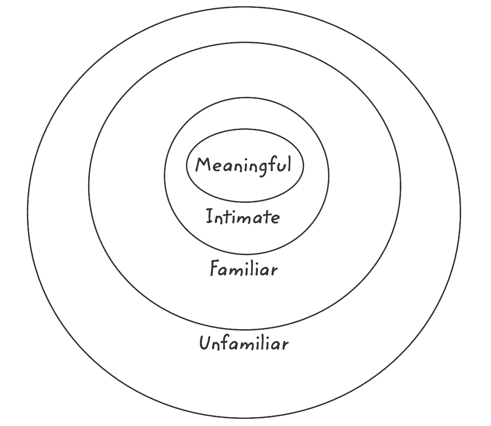

# 不要只是建立关系网——建立你的“有意义的关系网”来最大化你的影响力

> 原文：<https://review.firstround.com/dont-just-network-build-your-meaningful-network-to-maximize-your-impact>

迈克·斯泰伯 是一个超乎寻常的人物——拥有超乎寻常的社交能力，让人以为他天生就有这种能力。他努力做到了喧闹但不傲慢，专业地打磨得光彩照人，在交谈中富有磁性。**这就是为什么听到他说这一切对他来说都不容易时令人震惊。**

他是一个内向的人，很容易承认，当遇到新朋友和有意建立关系时，他会感到和我们许多人一样的尴尬、焦虑和不确定。然而，他一丝不苟地建立了一种方法，这种方法推动他在令人羡慕的年轻时代就在 NBC 和谷歌担任领导职务。如今，他是 XO 集团的首席执行官，该集团以轰动一时的里程碑式品牌而闻名，如《喜结良缘》和《凹凸不平》等。他有一本新书将于下周三出版，《职业宣言》。直接深入到任何人如何创造非凡的生活和职业生涯的本质，这是我们在这些主题上遇到的最具战术性的详细书籍——对企业家来说是理想的。

翻阅了一份样本，我们被 Steib 提供的网络建议的深度所震惊。在这里，我们很高兴地摘录了一章，对整个概念进行了独特而有启发性的阐述，解释了为什么我们大多数人都没有做好，以及如何才能建立有意义的互利关系。(如果你喜欢克里斯·弗拉里奇的作品[如何变得人脉广泛](http://firstround.com/review/how-to-become-insanely-well-connected/ "null")，这是一部值得一看的续集。)

**请继续阅读 Steib 关于如何将我们日常生活中的陌生人转化为有价值和珍贵的联系的详细观点。**

# “有意义的网络”是什么样的

你个人关心的人是谁，反过来谁又关心你？那是你的关系网。所有影响你生活的机会都来自这些关系的力量。但是，如果你像大多数适应力强的人一样，那么“网络”这个词会让人联想到尴尬的见面和问候、不请自来的邀约以及不真诚的互动。

许多人做这件事的方式很恶心。他们打着友谊的幌子，不知道从哪里开始联系，以达到某种目的或要求什么。太多的人把他们的“关系网”想象成一个名单，他们可以利用这个名单来实现最终目标。这是一个错误。**你可以用不同的方式来做——当你这样做时，你将拥有强大的优势**。

如果你想建立一个有效的网络，你必须关注你能为别人做什么，而不是他们能给你什么。T4:我认为，每个人都有四种类型的网络:陌生的、熟悉的、亲密的和有意义的。它们是嵌套的同心圆:

你的陌生和熟悉的网络足够直接——分别是你完全不认识的人和你略知一二的熟人。你的亲密关系网包括你非常熟悉的人。但是你有意义的网络是你真正的个人关系和友谊网络。你有意义的人际网络会让你有可能对你的职业和生活产生你想要的影响。

欢迎更多人加入你有意义的网络有三个步骤:

通过初次接触和建立联系，将陌生网络中的人带入熟悉的网络。

通过深入了解他们，理解你们的共同点，找到你可以帮助他们的方法，把你熟悉的网络中的人带入你的亲密网络。

通过投资以一种重要的方式让人们的生活变得更好，把他们从你的亲密关系网中带到你的有意义的关系网中。

你建立人际网络的成功建立在一个非常重要的心态上:你这样做是基于你想了解、欣赏和帮助他人的愿望。

这是建立真正持久关系的唯一途径。你对他人的帮助决定了你的影响和你的人生。当你采取这种方法时，令人着迷的事情发生了:你建立的关系在多年后发芽，并以意想不到的方式回来帮助你，往往改变你的生活。以下是开始的方法。

# 陌生→熟悉

这一部分是为像我这样发现和陌生人聊天是世界上最不自然和不舒服的行为之一的人准备的。可悲的是，我花了几年时间去结识那些拥有迷人而丰富的知识、见解和经历的人，却没能去了解他们。多年来，我一直致力于开发一套与他人联系的简单工具。

依靠以下三种方法，你就可以和某人一起从陌生网络到熟悉网络的巨大飞跃:

**1。显得热情友好。加州大学洛杉矶分校(UCLA)心理学名誉教授阿尔伯特·梅赫拉比安(Albert Mehrabian)在一项研究中发现，人类交流中超过 55%是视觉交流(外表、肢体语言)，38%是声音交流(音调、音量、声音节奏)，7%是口头交流(你实际说的话)。所以，要主动联系并欢迎陌生人加入你的社交网络，适当地问候他们:**

**使用开放的肢体语言**——不要交叉双臂，站直，加宽肩膀，不要挡住你的心。

**给你的脸带来温暖**——抬起下巴，保持目光接触，微笑。

将你的右手向前伸——要热情，不要咄咄逼人。(如果你在握手时占据了最高位置，这就下意识地传达了你在新建立的关系中的优势或支配地位。如果你这样做，你就是个混球。)

**用自信的声音说话**——“嗨！我是迈克·斯泰伯！我在公司总部的大厅里工作。”

我知道这听起来很基本，但大多数人——尤其是内向的人——会误解这一点，身体上封闭自己的身体，脸上挂着略带痛苦的微笑，眼睛四处扫视，犹豫地握手。如果你不相信我，花几分钟注意最初的问候。**大多数人都有点害怕彼此接触。**

如果所有这些都让你紧张，在镜子前练习这种恰当的问候技巧真的很有效。重复会让你感觉自然。特别是，保持眼神交流可能会不舒服，需要排练。在人行道上的陌生人身上或者在车流中停在你旁边的人身上练习。如果你与人进行眼神交流并热情地微笑，他们会本能地报以微笑。

**2。开始一次简短但愉快的谈话。如果你只是说，“嗨”，别人也会回应你。如果你说，“你好，我是迈克·斯泰伯，我住在三号公寓——我就是那个总是带着两个小孩在走廊上跑来跑去的人，”他们会回答:“你好，我是乔·卡隆。我住在六号公寓——我和我的女朋友养了一只总是叫的拳师狗。”引出更多信息，然后利用这些信息将互动变成快速对话:“很高兴见到你，乔。你一直养狗吗？”保持积极和简单。**

没有练习，结束一段对话会和开始一段对话一样尴尬。一位服务了 30 年的当地政治家曾经告诉我，政治成功的关键是用 30 秒钟向每个人问好，然后“溜之大吉”——再用 30 秒钟向另一位选民溜之大吉。因此，在交换了一两个问题和答案后，在你的新朋友说完一句话后，你可以简单地再次伸出手，微笑着说:“很高兴见到你，乔。我希望不久能在这里再见到你和你的狗。”

(关于交友艺术的更多技巧，我鼓励你阅读开创性的*[【不仅仅是我】](https://www.amazon.com/Its-Not-All-About-Techniques/dp/057809665X/ref=sr_1_1?s=books&ie=UTF8&qid=1516725458&sr=1-1&keywords=It%E2%80%99s+Not+All+About+%E2%80%98Me%E2%80%99 "null")* 以及非常有趣的 *[如何在 90 秒或更短时间内让人喜欢你](https://www.amazon.com/Make-People-Like-Seconds-Less/dp/0761149465/ref=sr_1_1?s=books&ie=UTF8&qid=1516725493&sr=1-1&keywords=How+to+Make+People+Like+You+in+90+Seconds+or+Less "null")* *。*)

**3。记住这个人的名字。我在这方面很糟糕。要做到一半需要大量的练习，所以我可以——至少——告诉你我们哪里出错了。第一，在一次新相遇的肾上腺素中，我们只是听不到名字；这个人这么说了，但是没有被记录下来。你必须养成倾听的习惯。如果你错过了，你要问——“对不起，你能再说一遍你的名字吗？”我现在用三种方法来记名字:**

**重复。在对话过程中，重复对方的名字，“很高兴认识你，乔。”"告诉我，乔，在城里养狗难吗？"只是不要过度。**

**可视化。**如果你是一名视觉学习者，想象这个人的名字写在她的额头上或想象中的姓名标签上。

**联想记忆。人类的大脑并不像档案柜一样运作。它利用联想来保留信息。所以为了纪念乔和他的狗罗斯福，你可能会想:邻居乔有一头浓密的毛发。比如约瑟夫·斯大林。乔·斯大林。算是个坏人。但是泰迪·罗斯福保护美国工人免受不公平劳动的侵害。好家伙。那会粘住。(参加记忆锦标赛的人说他们也用类似的方法。)**

有了这些技巧，你可以打破那些让你和周围的人——每天都在你生活中出现的成百上千的潜在熟人和未来的朋友——分开的不舒服的障碍。一旦某人进入了你熟悉的网络，你就可以把它变成更多。

# 熟悉→亲密

你现在有了一个策略来表现友好，克服尴尬，让人们感到舒适。你做得越多，事情就会变得越容易。接下来，你有机会真正了解一部分你想与之建立更密切联系的人。

几乎每个人都会弄错下一部分。当面对我们熟悉的网络中一个有趣的新人时，我们往往会犯两个基本错误中的一个。**首先，我们谈谈自己**。我们竭尽全力让他们相信我们也很有趣，很可爱。我们中的大多数人已经发展出将任何对话转回到自己身上的能力。经过 5-10 分钟的交谈，我们对我们的新朋友知之甚少。

**我们犯这个错误是因为感觉很好。被欣赏是人类与生俱来的欲望。当我们一直在说的时候，我们就剥夺了我们的新朋友执行这一重要行为的机会。上一次刚认识的人不停地说他有多棒多成功，你是什么感受？你很可能对这个人产生了一种低度的嫉妒和厌恶。多么可悲的错失良机。我们花费所有精力试图让某人喜欢我们，而她真正想要的是让我们喜欢她的机会。**

所以不要说自己。从现在开始，通过调查他人的工作和兴趣，把每一次互动都当作欣赏他人的机会。“你做 CrossFit 多久了？结果如何？作为一个素食者，很难获得足够的蛋白质来支持所有的举重运动吗？”

带着击球练习投手的心态在你新朋友的本垒打德比中进行个人伟大的对话。

避免谈论自己的诱惑。把他们关于你的问题发回给他们。观察这个人多么渴望抓住机会告诉你更多关于他或她的激情。正如著名广告人大卫·奥格威所说:“如果你想变得有趣，就要对自己感兴趣”

我们都会犯的第二个错误是**对话怯懦**。我们保持讨论的安全性，仅限于表面。闲聊是打破你不熟悉的人际关系网僵局的好方法，但是除非你进入实质性的对话，否则你永远不会了解一个人。考虑与同一个人的这两种互动的区别:

**展品 A**

“你喜欢这个活动吗？”“哦，是的，很好看。”“你参加很多活动吗，玛格丽特？”“一年三四个。”“真好。”“是的，很好看。”

**附件 B**

"那么你在活动中听到了什么与你的工作相关的事情吗，玛格丽特？"“关于消费无人机技术的那篇文章很有趣。”“我没记错的话，你为一家国防承包商工作？小型无人机如何融入更广泛的国家安全图景？”“哦，这是件大事。想象一个联网无人机网络……”

通过第一种方法，我们了解到我们都认为这个活动很好；在第二阶段，我们学习了所有前沿的新技术。我们经常害怕进行更深入的对话，因为我们不想对我们不知道的事情显得无知。

“托德，你说过你在一家瑞士银行工作——你在那里做什么工作？”"债务资本市场."“哦，酷。”

然后你下半辈子都不知道什么是债务资本市场，也不知道你的新朋友是干什么的，因为你不敢问。但如果托德值得去了解，他不会在意你不熟悉他的作品。他可能会认为你的沉默意味着你对他不感兴趣。所以他为什么要费心去了解你呢？将自己从这种恐惧中解放出来，将会打开成千上万次迷人对话的大门。

这里有一组问题总是适用于某人的工作，这将鼓励他们更加开放:

告诉我商业模式——谁付钱给谁，谁给谁提供价值？

与竞争对手相比，你有什么优势能让客户选择你？

是什么吸引你在这个特殊的行业工作？

你的部门在整体业务中占多大份额？

有新技术影响您的业务吗？

听起来你很成功？是什么让一个人在这个角色上不成功？

你工作中最喜欢的部分是什么，为什么？

既然你们已经进入了相互满足的对话，那么以后每次联系的时候，你都可以获得更多的细节，问更多有见地的问题:“你过得怎么样，托德？我刚刚在*金融时报*上看到债券价格一直不稳定，这对你有什么影响吗？”

这种方法还有另一个隐藏的好处:基于你从新朋友那里学到的所有有趣的东西，你变得更有知识，对其他人更有兴趣，而且你永远不知道你收集的知识在哪里会派上用场。

# 亲密→有意义

随着你越来越了解人们，你可以决定你想在哪里建立持久的关系。据我所知，只有一种方法可以将某人带入你有意义的人际网络:你要为他们做一些重要的事情。

把某人带进你有意义的网络需要努力和对那个人真正的关心。你需要对他们的成功感兴趣。我想给你三个帮助他人的方法，并在这个过程中拓展你有意义的人际网络:

**1。分享知识。**找到你们专业知识的重叠领域和机会，分享你知道另一个人会觉得有启发性的东西。它可以很简单，比如讲述一个你知道的有趣且相关的见解，通过电子邮件发送一篇文章，或者发送一本书并附上一个注释。但是只有当你认真思考过，并且你在分享对别人来说很重要的东西时，这才是有用的。这看起来是这样的:

“托德，我刚刚读了这本关于比特币和区块链的白皮书，我觉得你会从中受益匪浅……”

“朱迪思，祝贺你找到新工作。随信附上一本我读过的关于开始新工作的最好的书， *[前 90 天](https://www.amazon.com/First-90-Days-Strategies-Expanded/dp/1422188612/ref=sr_1_1?s=books&ie=UTF8&qid=1516725935&sr=1-1&keywords=The+First+90+Days "null")* 。想对比笔记就叫我。”

“Jordan，我刚刚收到一个邀请，去一家新健身房参加一个私人课程，但是我不能去。你提到你喜欢 Crossfit——想要我的票吗？”

等等。当你的知识可以帮助你认识的其他人更成功时，他们会更重视他们与你的关系。

随着时间的推移，这种分享变成了相互的，因为他们有报恩的冲动。不要过度。保持随意、偶然，并与你对他们的了解程度相称。

社交媒体也可以成为分享你知道而其他人不知道的有趣事情的宝贵工具——分析新闻中正在发生的事情；书籍推荐；激励你的事情；见解深刻的文章；等等。如果你打算在社交媒体上投入时间，那就用它来丰富你的社交生活。

**2。建立联系。帮助你关系网中的其他人的最好方法之一就是扩大他们各自的关系网。把两个做生意或成为朋友的人放在一起，你的影响力就会复合。**

在你职业生涯的早期，你的人际网络相对薄弱，需要努力才能起步。努力去了解那些坐在重要网络中心的人，并对他们有用。

招聘人员就是一个很好的例子。找出在你所在的行业中与你职位相当的猎头公司，并主动联系他们。告诉他们你认识一群很棒的人，他们总是向你寻求职业建议，当招聘人员需要帮助时，你希望能够帮助她填补空缺。每次你把招聘人员和一个好的候选人联系起来，你就帮助了你人际网中的两个人。招聘人员会再次打电话给你，创造更多的机会来帮助你。

**其他可以帮助你快速启动人际网络的关键人物:**

为你的母校经营校友网络的人；他们可以把你介绍给其他有相似兴趣和技能的毕业生。

倾向于认识整个行业关键人物的行业杂志记者。如果你有有趣的见解可以分享，他们通常很乐意私下会面。

为你的行业服务的顾问、银行家、咨询顾问。他们了解无数公司的关键决策者、趋势和机会。他们总是在寻找机会发展新业务。

经营俱乐部或吸引有影响力的人的亲和团体的社会联系者。

**3。给予支持和友谊。当你获得一份新工作、一次晋升、一次重大胜利或重大认可时，你最受欢迎。电子邮件和推特纷纷向你祝贺。有的为你高兴；其他人将你的成功视为自己的一个可能的机会。当事情朝另一个方向发展，你被忽略或遭遇失败时，你的收件箱会变得安静很多，你只能收到你真正朋友的来信。**

**现在就做出决定，成为那些真正的朋友之一。**当你人际网络中的人陷入困境时，他们需要你。示例:

“约翰尼，我听说你刚离开公司。我怀疑你是否需要它，但我会把我发现最有用的三家猎头公司的信息发给你。请随意告诉他们是我让你去的……”

“玛蒂娜，我知道你想要那份工作。你应该得到它。这周想去喝一杯吗？”

记住，你正在建立一个你真正喜欢并希望看到成功的人际网络。你在互动中贡献的越多，人们就会越期待，当他们需要建议、帮助等等的时候，他们就越有可能想到你。**这是普通二年级学生都知道的基本知识，但不知何故我们都忘记了。**

最后一个趣闻是:几年前的夏天，我和妻子参加了一个我们非常喜欢的户外高强度间歇训练课程。第一节课后，我和导师寒暄了几句。我做了自我介绍，记起了他的名字(Adam ),并向他询问了一些关于培训师的事情。他原来是一个企业家，我们在工作中有足够多的共同点，所以在接下来的课上我们又聊了起来。

经过几次交流后，我们中的一个人建议在晚餐前和我们重要的人喝一杯。原来我的新朋友刚刚成立了一家制作公司，并出售了他的新书。几周后，我发现自己需要一家制作公司来制作一个小视频项目，于是我给亚当打了电话。互惠互利。不久之后，他打电话给我，提出了一个与我们两个人的工作相关的商业想法。他的书就要出版了，我可以和对他的健身方法感兴趣的同事一起组织一次活动。

我们发现自己主动寻找互相帮助的方法，这让他进入了我的有意义的网络。如果亚当打电话来请求帮助，我会毫不犹豫地去做。最终，有一天晚上我们在一起，我给他提建议，他问我为什么没有写一本书。他提出要把我介绍给他的经纪人。现在我们到了，这本书将于下周出版。

同样的方法给了我无数的友谊、商业交易、职业机会、社交邀请，甚至总统在白宫的招待会的特权。这一切都是因为我愿意投资去了解和帮助我已经喜欢的人，没有任何明确的回报期望。想想吧。

*图片由 caai Image/Martin barra ud/Getty Images 提供。*