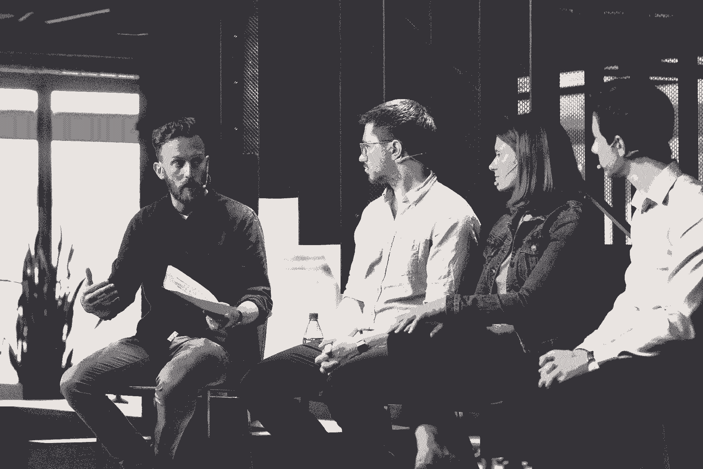

# 不要只是拼凑一个网上研讨会——你需要的虚拟活动速成班

> 原文：<https://review.firstround.com/dont-just-throw-together-a-webinar-the-virtual-events-crash-course-you-need>

大卫·斯宾克斯 正是那种许多初创公司的领导者现在可以利用的人。作为 repeat 的创始人，他创办了**[【CMX】](https://cmxhub.com/ "null")**(一个为社区专业人士提供支持和教育的网络)，直到被 [Bevy](https://bevyhq.com/ "null") (一个为 Salesforce、Atlassian 和 Duolingo 等公司提供活动项目的社区平台)收购。现在，作为软件提供商的社区副总裁，Spinks 已经为数百家组织提供了十多年的社区策略建议。他的甜蜜点？与创始人和社区建设者合作，因为他们希望扩大将群体聚集在一起的无形魔力，同时对底线产生影响。

但在这个动荡的时代，即使是职业选手也很难找到稳定的立足点。以他最大的活动——CMX 峰会为例，每年都有超过 1000 人参加。“至少可以说，2020 年的峰会仍在不断变化。斯平克斯说:“计划在 10 月份举行，但我认为没有人能告诉你现在会发生什么。像全国各地所有的创始人、营销人员、活动组织者和社区建设者一样，我们处于这种暂停状态，暂停线下工作，同时努力尽快将活动上线。"

最近几周，他和他的团队已经开始全力以赴，向面临类似任务的其他人伸出援手。他们为社区专业人士推出了一个拥有新冠肺炎信息的[指挥中心](https://cmxhub.com/command-center "null")，发布了优秀的[资源](https://cmxhub.com/a-comprehensive-list-of-tips-tools-and-examples-for-event-organizers-during-the-coronavirus-outbreak/ "null")，当然，他们也开始举办自己的虚拟聚会。“每个人，甚至社区专家，都还处于‘搞清楚’阶段，”斯平克斯说。“当然，有些已经在做虚拟活动，但这不是他们的核心战略，所以这仍然是一个重大转变。”

在他看来，现在有两个不同的群体需要帮助。有些公司已经在建立在线社区空间，有些公司现在是第一次这么做。所以第一个要问的问题是这样的:**你从什么点出发？**

“有很多公司已经建立虚拟社区很长时间了，利用在线论坛和群组作为在线聚会的场所。这些空间现在正在膨胀，随着每个人花更多的时间在网上聚集，流量越来越大。因此，这些公司面临的挑战是管理活动的涌入，同时将面对面的社区活动转移到网上，因为大多数公司没有一个强大的虚拟活动计划，”斯宾克斯说。“另一组的初创公司现在正从零开始，想着‘废话。我们典型的销售和营销渠道正在枯竭，我们的贸易展览正在被取消。我们必须尽快弄清楚网络事件。但是这不仅仅是举办一场网上研讨会那么简单。虚拟事件远不止这些。

在这次独家采访中，斯宾克斯深入探讨了这些阵营中初创企业领导者的有用策略。他还分享了使虚拟讨论形式更有价值的有针对性的策略，从使用的工具到有助于鼓励参与式对话的技巧。无论你的任务是给你现有的社区注入活力，改变你公司的活动计划，第一次争先恐后地让这一切变得精彩——或者只是试图举办一次真正伟大的虚拟欢乐时光——斯宾克斯提供了丰富的智慧，这些智慧来自于十多年来深化社区的[护城河。](https://stateofstartups2019.firstround.com/#10-community-moat "null")

# 将你现有的努力转移到网上的策略:

*对于那些已经有健全的社区战略的地方。当你从在线学习转向在线学习时，你该如何调整？*

“从社区经理的角度来看，你可能会想，‘现在参与度非常高。我们的社区正以这些非常特别的方式聚集在一起。斯宾克斯说:“我们只需要想出如何加速这一过程，继续支持我们的社区，然后提出创造性的想法和新的形式，将它们虚拟地结合在一起。”。

现有社区项目在战略或战术上的最大转变是将活动从线下转移到线上。“如果他们在很大程度上依赖于项目中的面对面部分，情况就更是如此，大多数人都是这样。例如，我们最近在 CMX 发布的行业趋势报告发现，60%的公司同时开展线上和线下活动。显然，这种组合目前正在发生变化，”他表示。“以前，很难让人在办公室里坐一整天参加虚拟活动。但现在有一场完美风暴，公司别无选择，只能转向虚拟化，每个人都被困在家里，上网，寻找保持参与和学习的方法。这使得虚拟活动现在运行得非常好。大多数人都看到了极高的参与度。不过，尘埃落定后，虚拟活动是否也能发挥作用，还没有定论。

David Spinks at CMX's 2019 Summit

这种转变是短暂的还是永久的，这种不确定性可能会让那些职业生涯围绕着让人们面对面聚在一起的价值的人感到不安。“至少，未来几个月，面对面的活动似乎会暂停。因此，至少在秋季之前，暂停会议和聚会是明智的。斯宾克斯说:“虽然对于许多社区团队和活动组织者来说，这是一个非常困难的时期，但你也可以将此视为提高虚拟活动能力的机会。“你无法完全复制亲身经历。虚拟只是不会有和现实生活中相聚一样的感觉。但你可以找到许多与面对面活动相同的价值点，并汲取虚拟聚会的一些独特优势。”

最好的社区计划从来都是线上和线下的混合体。所以，如果你到目前为止都是离线的，那就抓住机会——当尘埃落定时，你会有一个更平衡的计划。

以下是斯宾克斯本人目前采用的几种具体策略:

**尝试不同的格式。**“你不需要组织一个大规模的虚拟会议来召集人们。从一个简单的 Zoom 讨论组开始，看看效果如何。尝试主持一次破冰式的快速网络会议。斯宾克斯说:“做一次单独的谈话，问一个问题。如果你确实想做大，依靠别人带来内容。“我们现在正在 CMX 进行尝试。他说:“我们可以举办一场有 20 名演讲者参加的活动，而不是协调 20 场小型虚拟网络研讨会，并与我们的社区合作举办一场大型活动。”。

**快速移动**。“未来六个月，每个人都将组织虚拟会议。对关注的竞争将比以往任何时候都更激烈。斯宾克斯说:“组织一场在线活动不需要像组织一场面对面活动那样的筹备时间。“只要你的演讲者有足够的时间准备，你也有足够的时间去宣传，你就做得很好。

**将活动体验的所有元素集中在一个地方**。“如果你使用多个平台，人们必须找到链接并登录，你会很快失去参与度，”他说。“对于更大的会议，有一些工具，如 [Hopin](https://hopin.to/ "null") 、 [Airmeet](https://www.airmeet.com/ "null") 和 [Vfairs](https://www.vfairs.com/ "null") 等等，可以将从‘主舞台主题演讲’到分组会议和讨论组的所有内容集中在一个地方。”

**联系当地社区。“如果你有举办本地活动的本地组织者，我们看到许多本地组织者也可以转向虚拟活动。斯宾克斯说:“Bevy 的所有客户都一直在运行本地用户组程序，并正在转向虚拟程序。“然后你可以在一个页面上列出所有正在发生的虚拟事件，这样社区就可以每周加入几十个虚拟体验。”**

看看什么能引起你的听众的共鸣，如果有用，就继续做下去。现在不要害怕在虚拟活动中犯错误——门槛不是很高。

# 让你的虚拟社区和活动游戏起步的原则:

*第一次参加虚拟活动和在线社区建设的人。你应该从哪里开始？Spinks 为你提供了五条原则，让你在启动在线活动引擎时谨记在心。*

# 1.不要害怕荡秋千。

“我经常看到那些刚刚起步的人犯的一个错误是，有时他们没有下足够大的决心。他们创建了一个群，邀请了一些人，发了几次帖子——然后哀叹他们看不到任何参与。**当人们看到一种令人兴奋的参与体验时，社区就形成了，要么是因为内容很棒，要么是因为人们素质很高，要么是因为它制作得很好**。因此，如果你不能让你的社区变得令人兴奋，那就很难起步。”

斯宾克斯更具体地说明了如何获得高度:

**如果你是一家拥有很多人使用和喜爱的成熟产品**的公司，那么为这些客户创造一个聚在一起聊天的空间就相对容易。“他们对你的产品非常兴奋，以至于他们希望与其他客户交流，学习、改进他们使用产品的方式，并分享他们的经验，”斯宾克斯说。“当你花更多的时间和精力为你的社区组织高质量的体验时，你的成员会看到这一点，并感到更特别。这将使他们更有可能想要做出贡献。”

**如果你还没有很多客户**，那么你的产品可能不应该成为社区的“共同利益”，因为人们还没有被它所吸引。“将共同兴趣集中在与你想要接触的客户相关的更广泛的话题上。例如，Culture Amp 为人力运营专业人员举办了“ [Culture First](https://www.culturefirst.com/ "null") ”社区。斯宾克斯说:“Branch 为致力于发展移动应用和业务的人们开设了“[移动增长](https://events.mobilegrowth.org/ "null")”社区。“两个社区都不是主要关注产品，而是关注整个主题。现在他们也有了人们喜爱的产品，但他们是从社区开始的，当时他们的产品还处于早期阶段。”

# 2.你在种树，不是在盖房子。

Spinks 经常看到的另一个失误是过度思考程序的倾向——并让它阻止你开始。“你不需要一个大团体来创建一个社区，也不需要一个完整的社区参与计划来举办活动。斯平克斯说:“只要开始收集、学习和迭代。发展一个社区更像是种一棵树，而不是盖一栋房子。你不需要从第一天起就有蓝图来规划一切。只要开始把人们聚集在一起，随着时间的推移，你的社区将有机地找到它的形式。因此，即使你觉得还没有“准备好”，开始建立你的社区也不算早。从长远来看，它将成为你公司的无价之宝，但这需要时间来积累。现在速度很重要。所以现在就开始吧。”

如果你感到不知所措，不要着急。就开始主持吧。只要让你的销售代表加入进来，你就会有机地学会这些技巧。事实是，当你带着正确的目的，把正确的一群人聚集到一个共享的空间，魔术几乎不可能不发生。

你可以从一小步开始。“启动懈怠小组或召开一次电话会议，看看情况如何，这是一个很好的开端。无论如何，从人们已经在使用和熟悉的工具开始通常更好。如果人们喜欢它，继续成长。他说:“如果他们不同意，那就试试别的办法。”“你不需要任何花哨的东西来启动一个在线社区，但如果你想要更全面的工具，你可以看看[强大的网络](https://www.mightynetworks.com/ "null")和[话语](https://www.discourse.org/ "null")，它们都可以更快地启动。如果你确实想拥有一些更加可定制和全面的东西，你可以看看企业平台，比如 [Khoros](https://khoros.com/ "null") 、 [Higher Logic](https://www.higherlogic.com/home "null") 、 [Vanilla](https://vanillaforums.com/en/ "null") 和 [Tribe](https://tribe.so/ "null") 。[外面有太多的选择](https://cmxhub.com/a-comprehensive-list-of-tips-tools-and-examples-for-event-organizers-during-the-coronavirus-outbreak/ "null")

撇开工具不谈，斯宾克斯强调，你现在只想让人们互相交谈，并确保他们有空间这样做。这里有一些虚拟活动的想法，你可以开始:

**讨论组和圆桌会议**:10 人或更少的小组，在这里你可以促进讨论。“没有演讲者，大家都在互相学习。如果你有一个较大的群体，你可以使用突破。斯宾克斯说:“大多数虚拟活动工具都有突破功能，包括缩放功能。

**演讲人和网络研讨会**:找演讲人和专家做讲座或做采访，让人报名现场观看。“简单的网络研讨会可能会很好，或者你可以使用更全面的虚拟活动工具来提供额外的聊天和互动功能，”他说。

**快速联网**:使用[破冰者.视频](http://icebreaker.video/ "null")等工具，在社区成员之间进行大量快速的一对一通话。

**协作和集思广益**:使用虚拟白板和协作工具运行在线黑客马拉松或集思广益会议。

**分享经历**:“人们现在正在组织聚会、[舞会](https://twitter.com/JustinTinsley/status/1241566713063395335 "null")、[音乐节](https://www.stayathomefest.com/ "null")、[歌坛](https://twitter.com/caspertk/status/1238999674390024192 "null")以及各种不同的虚拟体验。斯宾克斯说:“要有创造力。

**虚拟会议**:结合多种体验，举办一场完整的活动，包括演讲者、讨论组、网络和有趣的体验。

# 3.关注首要原则，而不是输出你的线下活动策略。

在我们正在经历的这个不确定的时代，几乎可以肯定的是，大多数创业公司现在都在同一条船上——并试图以类似的方式改变他们的战略。在一个每个人都突然增加在线活动并试图培养社区的时代，你如何才能穿过噪音并保持相关性？

“现在对在线内容的需求似乎是无限的，因为人们在现实生活中是孤立的。斯宾克斯说:“最终，同样的东西将打破现在一直存在的噪音:有针对性的、高质量的内容，专注于真实的人正在经历的真实痛点。“把它带给你的客户和社区成员。他们现在在处理什么？具体来说，这场危机是如何影响他们的？他们现在需要什么内容来帮助他们保持高效和健康？”

如果你已经建立了一个受众群，那么建立一个社区就容易多了。要建立一个观众群，就要开始帮助别人。为了把它变成一个社区，开始帮助那些人互相帮助。

这意味着它不是将虚拟活动拼凑在一起，或者将你的现场活动剧本移植到数字领域。“贸易展就是一个很好的例子。你将无法在虚拟环境中复制在贸易展览大厅中行走的体验。所以不要尝试。相反，回到基本原则。商展的价值是什么？“这给了人们一个机会去认识许多供应商，观看产品演示，并认识软件产品背后的团队，”斯宾克斯说。“对于赞助商来说，价值在于传播他们的品牌意识，收集线索，并获得与潜在客户直接接触的机会。”

他提出了一些替代方案:“与其用一个页面列出赞助商，为什么不把一系列演示放在一起，让与会者注册观看呢？或者，如果与会者想了解更多信息，他们可以选择与供应商进行一对一会议或小组会议？这实际上是你无法在面对面的活动中真正做到的事情，因为舞台时间是昂贵的，并且你不想用供应商的演示来填满它。**但** **线上，舞台空间无限，出席者可自行选择冒险。斯宾克斯说:“重新思考整个经历。“不要用手提袋，而是创建一个数字版本，赞助商可以在其中包括礼物、折扣、礼品卡或对当前有需要的组织的捐款。与其把每个人都欢迎到一个大房间里，为什么不给每个与会者都配一个相关的伙伴呢？想想你可以在网上大规模做的事情，这些事情是你在线下活动中做不到的。”**

不要试图亲自临摹。你不能。相反，回到你组织面对面活动的首要原则。问问你自己:你在解决什么问题？虚拟工具如何独一无二地提供这种价值？

# 4.设定双重目标以保持真实。

在斯宾克斯的工作中，培养真实的社区和将它带回商业结果之间一直存在矛盾。“商业和社区建设必须结合起来。尽管感觉温暖而模糊，但说“我们只是要建立社区，而不担心任何商业目标”是幼稚的。如果你那样做，那很好。但你正在把自己降级到企业的‘慈善’桶里——到了裁员的时候，你将是第一个被砍的人，”他说。

“当我们与社区团队合作，在 CMX 设定他们的目标和衡量标准时，我们提醒他们**你们的项目应该有双重目标:一个关注社区健康，另一个关注业务成果**。在社区方面，问自己，‘我们是否给了人们一种社区感？’？我们在为他们创造归属感吗？结果是他们更快乐了吗？然后在商业方面，你可以把社区和你的目标联系起来。"

为了确定社区如何适应你的创业战略，请参考斯宾克斯的空间模型:

**支持&成功:**您的成员回答支持问题并教其他人如何使用您的产品，从而降低支持成本并扩大客户。

**产品**:会员为改进你的产品提供反馈和想法。

**收购**:社区推动知名度、销售线索和潜在客户。

**贡献**:社区向你的平台贡献内容、代码或产品。

**参与度**:由于参与了你的社区，客户变得更加忠诚，从而增加了客户保留率。

如果你也在衡量对业务的影响，那也不会使它少了一个“真实社区”的倡议。事实上，能够展示你的社区的价值是至关重要的，因为这将有助于你证明和增加你在服务你的成员上的投资。

不过，这种心态走得太远也有风险。“许多公司仍然将社区作为一种品牌机制，而事实上他们所做的只是推动商业价值和增长。从长远来看，这种不真实的方法是行不通的。人们看穿了这一点，”斯平克斯说。

现在，还有一个额外的问题:被视为利用时机的危险。对于每一个刚刚加入在线社区潮流的创业公司来说，这都是一个风险。如果你只是将此视为利用这场危机的短期机会，那你就大错特错了。确保你真的在努力解决问题，而不仅仅是利用一个机会。设定社区和商业目标，并对两者负责。”

# 5.测量，测量，测量。

对于那些希望明确业务影响的人来说，很难衡量你的努力是如何实现的。斯宾克斯采用双重目标设定的方法，向创始人和新成立的社区领袖展示了应该寻找什么:

**商业指标:**“如果你做一个虚拟活动，看看谁注册了，谁出现了，谁参与了内容。将其映射回您的客户数据库，并计算出其中有多少人是当前客户、潜在客户或潜在客户。他们中有多少人以前从未听说过我们，但现在听说了？”斯宾克斯说。“现在你可以看到你是否与漏斗中的所有人都有有价值的接触点。您还可以衡量对现有客户的影响。他们更快乐吗？他们更有可能续约吗？其中许多是 B2B 指标，但这种想法也适用于 B2C。他们是更忠诚的顾客吗？他们会回来吗？他们花费更多吗？他们推荐你产品的可能性有多大？”

**社区指标:**“在社区方面，你可以通过虚拟活动收集更深入的数据。想想你主持会议的时候。很难跟踪与会者如何参与你的内容。你不知道每个人参加了哪些讲座、讨论组和活动。通过您的虚拟活动，您可以更深入地跟踪每个会议的参与者。然后用调查来衡量社区健康。像这样的问题:你觉得你属于这个社区吗？你在这个社区感到受欢迎吗？你也可以使用[社区意识指数](https://storage.googleapis.com/wzukusers/user-25742853/documents/5a4d0fac6d4ad7179hah/2018_Jan_Sense_of_Community_Index-2_SCI-2.pdf "null")作为另一种衡量工具。”

# 促进有价值的虚拟讨论的关键

*适合那些希望让小组讨论尽可能有影响力(无缝)的人。你应该使用什么工具？你如何推动谈话？*

如果你想从一开始就获得最大的回报，斯宾克斯有一个最喜欢的方式，他鼓励每个人都去尝试。

“一旦你找到了自己的定位，我鼓励你不要仅仅局限于一个简单的网络研讨会，每个人都可以观看直播。讨论组已经成为我最喜欢的建立社区的形式之一。他们是真诚和亲密的。让一小群人倾听会让人们觉得他们可以更加开放和脆弱。而且人脉价值巨大。他说:“我认识了很多高素质的人，并通过讨论组建立了持久的关系。

David Spinks moderating a community panel

对于第一次涉足虚拟活动、讨论组和分组讨论的人来说，Spinks 利用他丰富的经验提供了一系列促进虚拟讨论组的实用指南:

# 10 岁以下，30 岁以上。

“当有人邀请我参加 30 分钟的讨论组时，你可以相信我不会来。我知道这是行不通的。斯宾克斯说:“每个人的介绍时间大约为两分钟，所以如果 10 个人一组，在通话即将结束之前，你很难记住每个人最喜欢的电影。”

“我也非常怀疑一个小组里八个人以上的小组讨论。10 是我建议的最大值。再高一点，就不可能每个人都觉得自己有机会做出贡献。如果你不介意更多人被动参与，你可以做得更大。您可以使用 Zoom 等工具上的 breakout 功能将它分成子组。但你可能会失去让小组讨论脱颖而出的特殊调味品。”

保持小团体讨论中的“小”。坚持 8 个人或更少，将谈话延长到 60-90 分钟，这样你就有空间深入挖掘。

# 用逐步上升，逐步后退的规则设置场景。

“这提醒参与者，当他们有话要说时，站出来用自己的声音说话，但当他们说得太多时，也要退后一步，为其他声音腾出空间，”斯平克斯说。

"**这也许是培训师执行**的最重要的规则。当一个参与者开始占用所有的空域时，你是唯一有资格介入的人，并要求他们后退。”

# 轰轰烈烈地开始。

“你可以用许多特定的形式来开始或管理整个讨论，”斯宾克斯说。以下是他成功运用的一些想法:

**以快速联网**开始:“如果你有多余的时间，你可以使用另一种工具，在加入小组会议之前，与会者可以通过简短的一对一视频聊天*相互见面，就像你在面对面的活动中一样。”*

**一轮介绍:**开始一轮介绍。用一个“有趣”的问题来增加趣味，比如“你最认同哪个卡通人物？”你可以从[靶场的破冰工具](https://icebreaker.range.co/ "null")中获得更多的想法。

**轮流提问:**每个人都要回答的初始问题，以便让每个人都尽早参与到对话中来。“他们通常很快。斯宾克斯说:“你可以从雷切尔·本·哈穆[那里找到大量关于选择正确问题的](http://www.linkedin.com/in/rbh "null")[例子和建议](https://medium.com/peoplestorming/crushing-loneliness-through-virtual-connection-bbc68dac9700 "null")。

**交通灯:**让每个人通过选择红色、黄色或绿色来分享他们当时的感受。

**高与低:**让每个人分享他们生活或工作中的高与低。这也叫做“玫瑰和荆棘”

**演示:**让一个或多个成员分享他们的屏幕，做一个简短的演示或激情演讲，然后展开讨论。

**分享挑战:**每个人都有机会分享他们希望得到反馈的挑战，然后有时间让其他参与者给他们反馈。

**带饮料或小吃:**让每位参与者带一杯热饮或他们自己选择的饮料，并在通话开始时分享他们正在喝的饮料。斯宾克斯说:“或者像奇点大学的凯特·沙宣(T21)那样，让每个人都带一份零食。”。“她指出，这是工作中的神经科学结合(以及对那些需要玩耍和/或自我安慰以集中注意力的人来说的神经多样性包容)。”

**承诺和后续步骤:**让每位参与者分享他们在讨论后将做出的一项承诺，或他们将采取的下一步行动，以此结束通话。

# 设定明确的期望，陷入尴尬的沉默。

“我们都经历过那种尴尬的沉默，有人向一群人提问，却没有人站出来回答。不知何故，它在虚拟的空气中显得更重。如果你是主持人，你会有一种想要自己填补空白的冲动。但你需要与之抗争，”斯平克斯说。“有时候，重要的是保持沉默，让你的参与者用他们的声音来填补沉默。”

也就是说，你要确保没有太多的死气。这是一个需要仔细调整你的亲身活动方式的领域。" [Nina Rong](https://www.linkedin.com/in/ninarong/ "null") ，Generalized Intelligence 的通信副总裁，最近向我指出了这一点。当我们面对面时，我们有眼神交流，肢体语言。斯宾克斯说:“在虚拟讨论中，我们需要比我们想象的更加明确。“这意味着向特定的参与者提出特定的问题。正如尼娜所说，像“你对此怎么看？”这样的开放式问题摆在整个小组面前的是一个无线电静默或更糟的配方——多个参与者试图同时发言的可怕的电话会议杂音。"

# 将所有这些联系在一起:小心，不要忘记后退一步

作为这个社区驱动、环境驱动的虚拟事件指南的顶点，Spinks 提供了一个警告和警示。"**我刚刚分享的所有建议都适用于你有足够的带宽从情感上、精神上和身体上承担这项工作的情况。他说:“社区经理、活动组织者、营销负责人、创始人——这种转变现在给我们所有人都带来了很大压力。**

“即使你是一个外向的人，整天组织和互动也会令人极度疲惫。我们现在看到的是前所未有的，”他说。“我们正在适应可能持续数月的隔离、关闭的企业以及对朋友和家人无休止的担忧。对于我们这些创业界的高材生来说，我们已经忙得不可开交了——我们还有更多的事情要担心。”

为了应对额外的负担，许多经理正确地强调了空间和自我照顾的重要性。但是对于斯宾克斯来说，还有空间走得更远，变得更具体。"**经理们只说‘照顾好自己’是不够的，还要在团队会议上谈论如何‘现在是时候真正抓紧时间解决这个问题了’**。是的，我们都需要改变，有远大的目标并适应。他说:“我们需要弄清楚哪里有新的机会，我们需要在哪里调整一切照旧的策略，这样我们才能继续经营下去。”。

“但重要的是，在你的建议中要清晰明确，让人们知道你是认真的。我是这么说的:‘现在就花你需要的时间。如果你需要一两天，或者你认为你需要多少时间来确保你在一个好地方，你的家人都好，句号，这是第一优先。你需要照顾好自己，因为如果你的杯子是空的，你将无法在接下来的几个月里完全投资于你的社区。重新设定你的生活方式以适应新的标准，并养成习惯，这样在这场危机结束后，你就可以在可预见的未来继续照顾好自己。"

至于他是如何执行自己的命令的，斯宾克斯分享了对他有效的方法:“社交媒体现在是世界上压力最大的地方。每一秒钟都有关于新的数字、悲伤的故事和政府正在做什么的更新。控制你现在如何消费信息真的很重要，因为这一切都很重要，但很容易被淹没。他说:“在大块的工作时间里，我会进行自我控制。“我也在努力进行冥想练习，比平时坐得更久，并在早上慢慢来。我每天都在锻炼，在我们仍然可以不受阻碍地外出时跑步。”

除了维持这项工作所需的自我保健，斯宾克斯还有最后一个提醒。“如果你看到我们所有人的处境，并认为‘这是社区发光发热的时候了’，这是可以原谅的。”我发现我自己和我的团队都在这么做。我们生活和呼吸着社区。你可以很容易地使用这样的语言，“这是一个机会，”或者，“我们可以在营销中利用这一点。”确实如此。**但是现在最重要的是成为一种资源并帮助人们**。不是为了借此多赚钱，或者利用机会。是为了你的社区。现在，世界各地的人们正以一种艰难的方式经历着无助、失去常态和缺乏联系。我们的企业如何成为人们的资源？当人们最需要的时候，我们怎样才能创造安全的空间让他们聚在一起？

后退一步，思考*为什么*建设社区的工作如此重要。"**没有什么比共同奋斗更能构建社区了**。如果你取消了活动，你的企业陷入困境，你必须改变策略，让你的社区参与到这个过程中来。向他们公开正在发生的事情。让他们帮忙，参与进来。当你给你的社区一个团结的机会时，你会对他们的能力感到震惊。”