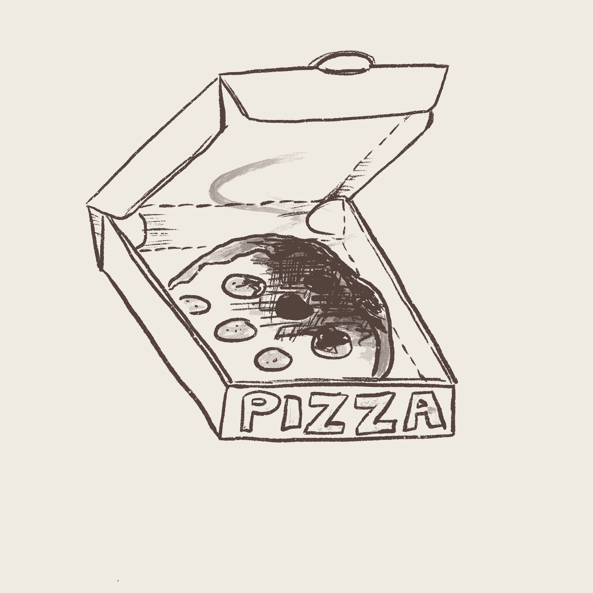
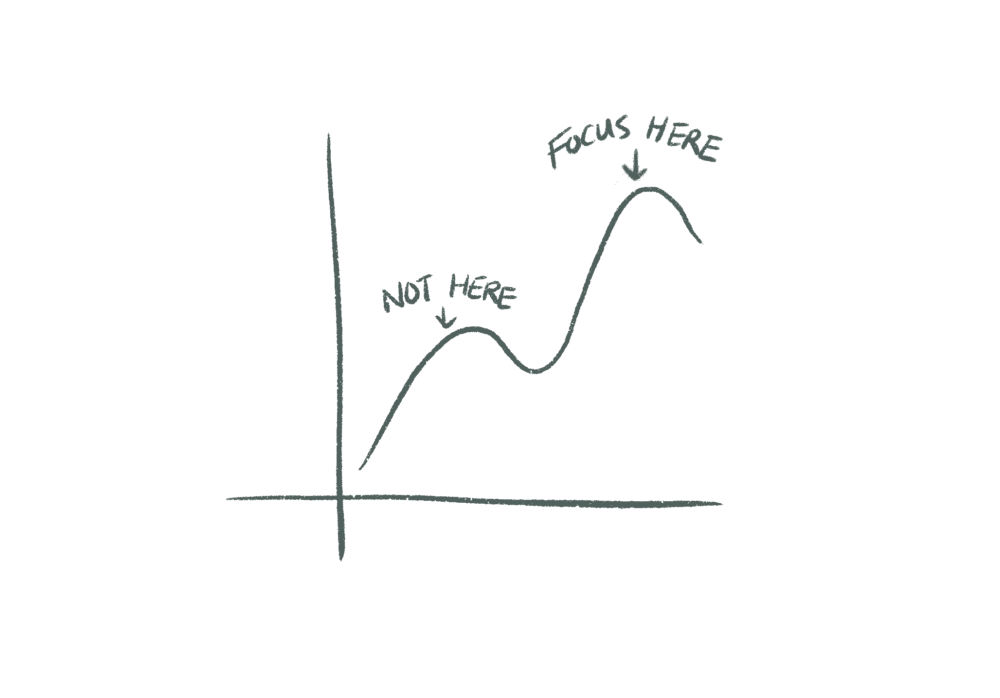
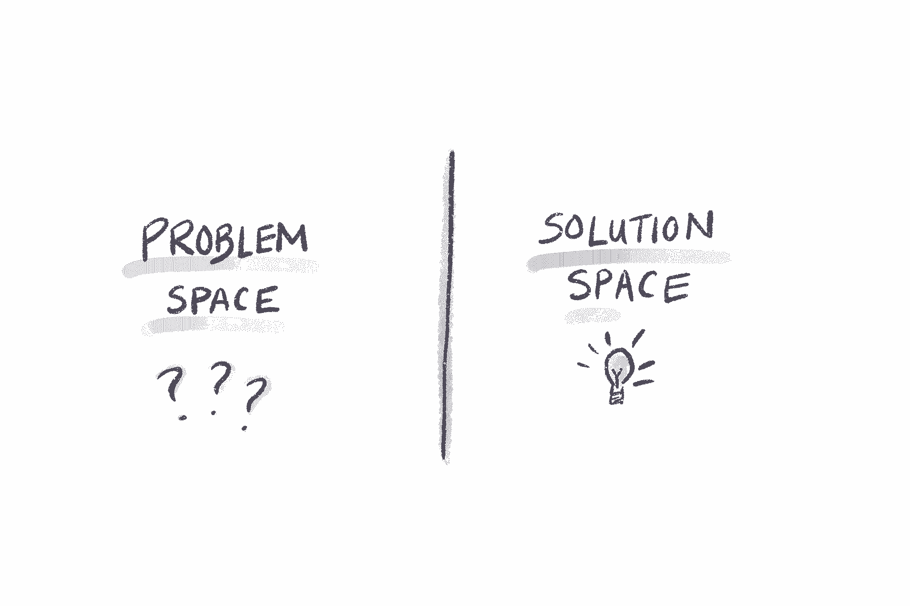
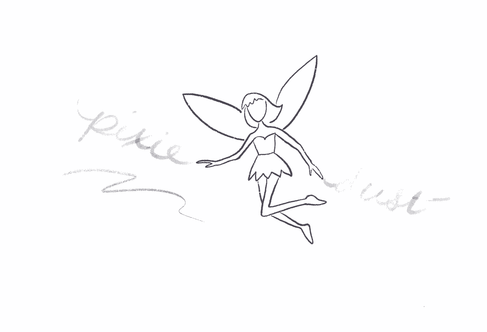
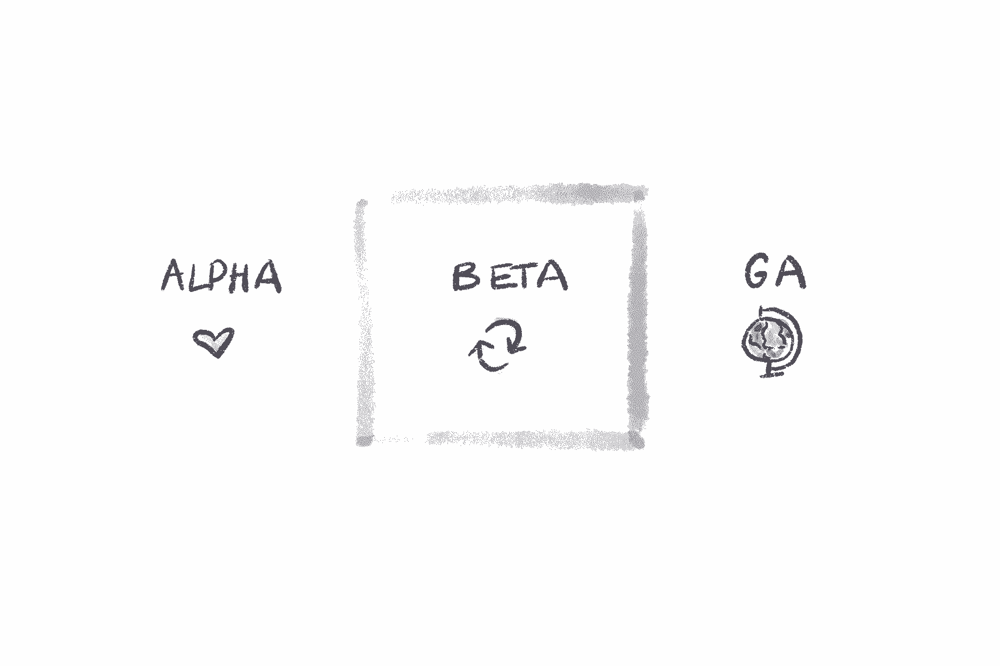

# 不要提供烤焦的披萨(以及其他关于制作最小可爱产品的教训)

> 原文：<https://review.firstround.com/dont-serve-burnt-pizza-and-other-lessons-in-building-minimum-lovable-products>

焦娜·张目前是 Webflow 的产品副总裁。

如果说爱在小事上，那么**[【JZ】张](https://www.linkedin.com/in/jiaona/ "null")** 对让用户神魂颠倒的细节有着敏锐的眼光。

从她在 [Pocket Gems](https://pocketgems.com/ "null") 的第一个项目经理角色，在那里她设计了让玩家登录更多的移动游戏功能，到她在 [Dropbox](https://www.dropbox.com "null") 的时间，在那里她专注于用户问题的本能导致了该公司一些杰出的 UI 交互的创建，张的职业生涯令人印象深刻，专注于发现吸引和激励用户的正确触摸。

她还在 pixels *和*物理空间方面发挥了自己的专长，在 Airbnb[和 Airbnb](https://www.airbnb.com/ "null") 都是如此——在那里她担任了 [Plus 发布会的产品负责人](https://www.theverge.com/2018/2/22/17040684/airbnb-plus-hotels-standard-amenities-service-loyalty-program "null")和 Homes 平台团队的产品负责人——现在在 [WeWork](https://www.wework.com "null") 担任产品管理总监。(作为天使投资人和斯坦福大学()的讲师，张还设法挤出时间将她的产品知识运用到其他领域，在斯坦福大学，她教学生踏上早期产品制造的旅程。)

回顾所有这些经历，很明显，爱是张产品设计理念的核心，也是她推出用户喜爱的产品的成功秘诀。她认为，如果公司想要保持竞争力，产品人员需要更加努力地适应一个新兴产品的可爱之处——而不仅仅是生存能力。“最小可行产品很有吸引力，因为它很便宜，而且你可以更快地把它推向市场。但我们已经超越了产品是“X 的第一”的世界，”她说。“更激烈的竞争意味着 MVP 将不再起作用。如果创业公司真的想脱颖而出，他们需要努力创造一个最不讨喜的产品。

考虑一下张和她在斯坦福大学的学生所做的类比:“假设你想测试人们是否喜欢比萨饼。如果你给他们吃烤焦的披萨，你不会得到他们是否喜欢披萨的反馈。你只知道他们不喜欢烤焦的披萨。类似地，**当你只依赖 MVP，最快最便宜的功能原型时，你可能并没有真正测试你的产品，而是一个很差或有缺陷的版本**

最小可爱产品(MLP)的概念听起来很容易理解:如果你的学习是基于更接近用户可能喜欢的早期产品，你可以获得更有价值的见解。虽然 MLP 是一种常见的哲学，经常在产品设计宣言中流传，但为了打造真正可爱的产品，创始人和产品设计师需要将这一概念从理论变为具体。

“在很高的层面上，很难不同意我们应该制造人们喜爱的产品这一理念。**但实际上在** ***中寻人的意图*** **建造那些产品和** ***理解*** **那些人完全是另一回事。张说:“这不是在你的测试版中添加一些闪亮的功能，然后就此结束。“作为产品构建者，我们需要钻得更深一层。爱到底意味着什么？你如何确定是什么让你的产品变得可爱？如何快速高效地完成这项工作？”**

在这次独家采访中，张深入探讨了为什么对 MLPs 的深刻理解有利于创始人和产品负责人。她分解了创始人和产品经理如何集中精力解决正确问题的四个原则。然后，她介绍了如何将 MLP 付诸实施——所需要的只是对用户需求的仔细关注和一点点仙粉。

# 在所有错误的地方寻找可爱:一个警示故事

运输 MLPs 可以为各种规模的公司带来强大的优势。“如果你处于初创阶段，你需要能够让你的用户留下来，同时你[建立-测量-学习](http://theleanstartup.com/principles "null")产品/市场的强大契合度，”她说。“对于较大的公司来说，创建 MLP 表明你足够关心用户，愿意继续投资于产品和新的产品线，提醒他们最初为什么喜欢你的产品。”

构建一个最基本的可爱产品应该从一个强大的理解基础开始。“如果你没有牢牢掌握如何将 MLP 付诸实践，你可能会浪费大量时间来打造一个你认为可爱，但最终并不可爱的产品，”张说。

她分享了从 Dropbox 学到的惨痛教训，以说明当团队无法理解是什么让早期产品变得可爱时会发生什么。当时，张是项目“和谐 T3”的负责人，该项目包括开发一个功能，当其他人打开同一文档时，它会向用户发出信号。

查看其他协作者的能力解决了一个独特的难题:以前，如果两个用户不知不觉地同时编辑了同一个文档，这将创建文档的两个冲突副本。新功能背后的想法是，如果用户可以在同一文档上看到彼此，他们可能会更有效地协作。

“当我们第一次开始构建时，我们对创建查看另一个合作者是否在文档中的能力感到满意。她说:“我们认为这已经足够出货了。虽然和谐计划推出后得到了的积极响应，但回过头来看，张认为这个产品并不讨喜。

“事后看来，我们错过了最有价值的洞察力，”张说。“能够在文档中看到某人是务实的——大概，你会跳出文档并避免冲突的副本。但只是解决了一个很基本的痛点。它实际上并没有提供用户会喜欢的东西。

可爱的产品不仅仅是功能性的或有用的——它们展示了对用户认为有价值的东西的敏锐理解。

“如果你深究是什么让谷歌文档成为如此令人愉快的产品，你不仅可以看到文档中有另一个合作者，还可以绝对实时地看到每个用户的编辑，一个光标接一个光标，”她说。“有了 Project Harmony，能够在文档上看到另一个人虽然有用，但最终并不令人满意。事实上，这凸显了 Dropbox 产品的一个根本缺陷:它还不支持基于云的实时协作编辑。如果我们事先花时间去了解用户最看重什么，我们就不会做同样的投资，”张说。

# 你的爱有多深？放大问题的四个原则

无论你是一家斗志昂扬的初创公司，还是一家老牌公司，将 MLP 方法付诸实践的第一步都是一样的:“**从你的用户的高价值问题开始，然后深入了解你的用户的需求和动机**，”张说。

张强调了她用来指导创始人和产品经理解决这个问题的四条原则:

1.从用户的为什么开始，而不是业务的为什么。

2.将问题空间与解决方案空间分开。

3.倾听你的用户——但不要把他们的话当作真理。

4.进入解决方案空间，选择你的游戏。

下面，她分解了每一个原则，用她自己的教学和产品管理经验中的大量例子来说明它们。

# 1.从用户的为什么开始，而不是业务的为什么。

张说:“**如果说公司陷入了一个陷阱，那就是他们关注的是‘为什么为业务’而不是‘为什么为用户’**。“公司自然会从业务的“为什么”开始，仅仅是因为它们的运营方式。但作为一名产品负责人，如果你不给用户一个‘为什么’，你就无法为你的团队建立一个有效的问题陈述。”

如果产品经理致力于创造一种产品，为企业解决“为什么”，而不是为客户解决“为什么”，他们将会错失良机。

回到和谐项目的例子，张的团队忽略了用户的“为什么”。“用户‘为什么’不仅仅是因为他们不喜欢有冲突的副本。他们希望多个协作者能够处理同一个文档并进行实时更改。因此，当我们试图继续迭代和谐项目时，我们只是在优化一个局部最大值，”张说。“另一方面，如果我们更快地将这些资源投入到构建一个更可爱的产品上，比如后来成为 [Dropbox Paper](https://www.theverge.com/2017/1/30/14435582/dropbox-paper-business-app-launch-date-ios-android-web "null") 或 [Spaces](https://techcrunch.com/2019/09/25/dropbox-will-start-rolling-out-the-new-dropbox-app-to-everyone-today/ "null") 的技术，我们就会努力实现全球最大化。”

为了进一步说明这两个“为什么”之间的差异，张分享了她在 Airbnb 时的一个例子，当时她领导了几个供应团队。“Airbnb 的一个关键业务‘为什么’是增加房屋供应。她说:“这显然是我们最关心的问题，因为供应增长是总预订量的领先指标。”。

但是增加住房供应却没有解决以用户为中心的“为什么”。“当然，你可以说增加住房供应给了客人更多的选择。但是拥有更多的房子是我们的客户真正想要的吗？”张说。

对用户更深刻的理解会导致更精确的“为什么”陈述，以及更可爱的解决方案。“并非所有的供给都是平等的。顾客不想在他们不想去的地方看到更多的住宿。她说:“他们希望在滑雪场或海滩附近，或者正在举行重大活动的地方，有更多的房源。“Airbnb 需要增加其在顶级市场的供应，让用户在*理想的*目的地有更多选择。*这就是*以用户为中心的原因。”

她说:“**将我们的重点从简单的‘增加供应’转移到‘在某些市场优化高质量的供应’上，这是走向可爱的第一步**”。这帮助她更清楚地为 Airbnb 的供应团队定义了最不可爱的产品和正确的衡量标准。

张有一个简便的试金石，可以让你知道你的目标是否朝着正确的方向。

**“从陈述开始，** ***如果这款产品能够...？*** **她说。“你的陈述应该以对用户有价值为结尾。** It 应该将问题组织起来，对用户的需求进行优先排序。”张分享了她在推出 Airbnb Plus 时如何专注于“为什么”, Airbnb Plus 是 Airbnb 更高端的住宿层:

**别问:** *如果这款产品能帮助 Airbnb 与豪华酒店抗衡，岂不是很神奇？*

相反，你可以问: *如果用户有各种高质量的选择，让他们宝贵的假期变得更加特别，这不是很神奇吗？*

# 2.将问题空间与解决方案空间分开

当斯坦福的学生在学期开始时走进张的[产品管理班](http://scpd.stanford.edu/search/publicCourseSearchDetails.do?method=load&courseId=96273440 "null")时，他们已经对期末项目充满了想法，在那里他们创造了一个新产品，并在整个产品生命周期中为之工作。学生们经常开始喋喋不休地谈论为 X 建立下一个市场，为 Y 和优步建立一个新平台...

张就在那里拦住了他们。第一天，她阐明了课堂的第一条规则:在学期的前三分之一不要考虑你的想法。

**“能够把自己从你** ***认为*** **你的用户需要和他们实际经历的事情中分离出来，这通常是项目经理最难学习的一课——但却是打造可爱产品的基石，”**张说。“这在早期创业公司中最具挑战性，因为创始人对一个想法非常有热情。但如果你不放松对提议的解决方案的控制，你就无法获得关于问题的有价值的反馈。”

永远不要从解决方案开始。仅仅因为你喜欢锤子或螺丝刀，并不意味着它就是你需要用来修理坏掉的东西的工具。

# 3.倾听你的用户——但不要把他们的话当作真理。

“为了对他们的高价值问题和痛点有细致入微的了解，**你需要在仔细倾听你的用户*****而不是** ***字面上的*** 之间取得平衡，”张说。*

*在这里，她指出了团队在进行用户访谈时容易犯的常见错误:*

*询问顾客想要什么。“当你问你的用户他们想要什么时，他们倾向于谈论他们认为你可以为他们构建的解决方案。把你的客户看得太重会限制你的思维范围。”*

*把自己定位为权威的代言人。用户经常把你，产品经理，看作是问题的专家。你不是。*他们*是。从一开始就让这种动态变得清晰，否则你将无法挖掘出用户真正关心的是什么。”*

*初创公司需要对用户访谈特别有条理，因为他们一开始只有一小部分用户，而且用于研究的资源也很少。*

*“尤其是如果你是一家初创公司，首先要明确你的目标用户是什么。**很难打造一款几个不同用户类型都*****喜爱的产品，尤其是在起步阶段。她说:**专注于与足够多的人交谈，以了解那种用户类型，并确保你[提出开放式问题，以确保你获得正确的数据](https://firstround.com/review/why-qualitative-market-research-belongs-in-your-startup-toolkit-and-how-to-wield-it-effectively/ "null")。**

**为了从你的用户那里获得最有成效的见解，张建议问以下问题:**你觉得什么是乏味的、有压力的或痛苦的？****

**“从问题开始。如果用户说类似于，*这个东西让我好沮丧。她说:“我不敢相信我每天花这么多时间做这件事，那么你很可能找到了一个干预的好机会。”。***

**如果你不能倾听用户的意见，你甚至可能无法构建出可行的东西。你当然也不会造出可爱的东西。**

# **4.进入解决方案空间，选择你的游戏**

**最后，一旦你收集了数据，把你的团队从问题空间带到解决方案空间。下面是张和她的学生一起做的一个练习:**

**画一条垂直线。在左侧，只写下*可能要解决的问题*。“如果你在头脑风暴中听到什么感觉像是解决方案的话，在右边记下来。承认这个想法，但不要讨论任何正确的事情，”张说。将问题和解决方案分开，可以让讨论专注于用户原因，而不是业务原因。**

****

**她说:“一旦所有的问题都摆出来了，就把注意力集中在你认为你能解决的价值最高的问题上。”“当我和我的学生这样做时，我会让他们决定这是否是他们本季度真正想玩的游戏。”**

**张也向创业者提出了“选择游戏”的挑战。问问你自己:你有能力解决这个问题吗？你愿意花 5-10 年去解决它吗？真正有意识地选择你的游戏能让你定义问题空间，并对你的解决方案空间加以限制。”**

**最后，一旦学生把注意力集中在问题空间，确定了价值最高的问题，并选择了他们的游戏，他们就可以打开张所说的解决方案空间构思。“整个方法，从开始到结束，类似于[的设计思维](https://firstround.com/review/How-design-thinking-transformed-Airbnb-from-failing-startup-to-billion-dollar-business/ "null")，”她说。**先发散理解问题空间。集中在最重要的问题上。再次分歧，想出解决办法。汇聚于既可用** ***又*** **可爱**的解决方案。”**

**“一旦你理解了问题，那么你就可以考虑可能的解决方案。把这些解决方案带给用户，”张说。“然后你可以问他们:在这些事物中，你希望哪一个存在？"**

**为了区分*可行的*解决方案和*可爱的*解决方案，请倾听用户的反应。“在大多数情况下，人们会看着原型说，‘这太酷了。我可以想象自己用这个，”那很好。“但这不是你的目标，”张说。**你希望你的用户说，‘天哪，** ***什么时候*** **我可以开始用了吗？这时你知道你已经引起了共鸣。如果没有，要么你没有让产品变得足够可爱，要么——更有可能的是——你没有解决一个高价值的问题。"****

**当你的用户试用你的原型时，他们应该会喜形于色。如果用户不是热恋中，你可能没有解决高价值的问题——人们不会愿意为你的解决方案付费。**

# **把一点爱放在你的心里:传递可爱价值的细节**

**一旦你加深了对问题的理解，是时候将你的 MLP 付诸行动了。在这一节中，张展示了如何将从提案变成产品——从在速度和易用性之间找到平衡，一直到用户测试的最后阶段。**

# **在最小和可爱之间取得平衡**

**创造最不可爱的产品最难的部分就在于它的名字本身:你如何用最少的努力创造出最可爱的产品？**

**“这就是为什么事先培养深刻的理解*如此重要:它让你洞察你的用户的核心问题。当你开始构建时，专注于一两个真正给用户带来价值和乐趣的功能。这就是为什么 MLP“最小”，但仍然可爱。”***

***如果你试图用你的产品解决每一个问题，你会做得很差。我称之为花生酱原则:涂得太薄，就不再美味了。***

***当一个团队忽略了*最小值*并且过度设计*可爱的*时，时间和资源就会受到影响。当张推出 Airbnb Plus 时，她的团队需要找出什么样的特征才能将 Plus 住宿定义为高于 Airbnb 预算选项的价格。“我们问自己，‘什么样的细节能让空间更像酒店？’”她说。***

**起初，她的团队朝着*可爱的*方向使劲摇摆。“我们列出了一张 200 点的清单，列出了我们认为除此之外的家庭需要的所有酒店级设施:房间暗色调、每张床上放四个枕头等等。但当我们真正看到这个庞大的清单时，我们想，*如果我们要求所有这些，我们将没有合格的房屋*，”张说。**

**为了纠正错误，她专注于 Airbnb 与众不同的品质。“人们不喜欢 Airbnb，因为它就像一家酒店。她说:“他们喜欢和家人一起做饭，或者一窥主人独特的设计风格。她的团队没有用酒店级别的清单来定义 Plus 类别，而是加倍努力让 Airbnb 有家的感觉。**

**

Jiaona Zhang ("JZ"), Director of Product Management at WeWork.** 

**“为此，我们将注意力转向提升在线预订体验，”张说。“对于 Plus homes，我们创建了一个家庭游览功能，允许人们通过摄影‘移动’每个房间。这种流动感觉就像一个数字开放的房子——就像用户走进门，被欢迎进入某人的家。这是一种可爱的、独特的 Airbnb 体验。”**

**不要太专注于细枝末节，以至于忽略了人们真正喜欢你产品的地方。**

**此外，投资于一个数字功能最终成为一种更有效的资源利用。“投资于一个精心策划的数字功能，比试图将实体物品塞进这些房子要便宜得多，”张说。她的团队已经在*最小*和*可爱*之间取得了完美的平衡。**

**这种平衡行为不仅有助于思考如何解决问题，也有助于思考优先解决哪些问题。张和她的团队在为 Airbnb 的主机改造移动应用程序时遇到了这个问题。在项目开始时，她和她的团队遵循了深入研究问题的四个原则:他们将自己的角色进行细分，以找出客户“为什么”，通过调查和用户组征求反馈，并在深入研究解决方案之前确定最严重的问题。**

**首先，他们让收件箱更容易访问。“在与人们交谈并检查了该应用程序上一次迭代的数据后，我们意识到收件箱是最常用的功能，但它被隐藏在侧菜单下。所以我们把收件箱移到了登陆页面，”她说。**

**其次，他们更新了日历功能，这样主机可以一次看到多个列表。“我们可以做很多事情来改进日历功能，比如高级价格切换或数据阻止。但最终，对用户来说，最重要的事情是他们可以一次看到所有内容，并更有效地安排时间。”**

**最后，他们推出了一项新功能，简化了主机繁琐、重复的流程:允许用户保存他们重复发送的消息模板，如签到说明。“老实说，这个功能是我们用户研究的意外副产品；以前，我的团队很乐意花时间解决一些问题，比如提高收件箱搜索的速度或粒度，”张说。“但我们了解到，主机搜索收件箱的一个重要原因实际上是复制粘贴邮件。这是一项单调乏味、重复的任务。因此，能够发送消息模板成了主持人最喜欢的功能之一。”**

**由于团队的激光聚焦于最有害问题的最可爱的解决方案，整个重新设计花了不到六个月的时间。“我们在 Airbnb Open 上发布了重新设计的应用程序，主持人给了我们起立鼓掌。他们对这些变化非常满意，”她说。**

**你已经知道你可以做无数的事情来改进你的产品。但是要关注对用户来说最重要的东西，以及你能及时交付的东西。这种优先顺序在创建一个可爱的应用程序时非常重要，”她说。**

**同样的优先原则也适用于从起点起步的初创公司。“如果你在问题空间做了功课，那么你就会知道什么对用户最有用、最有价值。她说:“从围绕最基本的功能设计你的产品开始。“想想 Dropbox: [它最初是作为替代闪存盘和 u 盘的解决方案而出现的](https://firstround.com/review/how-dropbox-sources-scales-and-ships-its-best-product-ideas/ "null")。现在，它提供了一整套跨越消费者和企业市场的协作产品。”**

**从一个能让你的产品不可或缺的特性开始。从那里开始。**

**最后，在上下文中理解你的用户。当你决定如何建立一个 MLP 时，媒介很重要。“你需要了解你的用户对媒体的期望，”张说。“人们需要什么样的台式机？如果你在开发一款手机应用，人们现在需要什么？”**

**张指出，这是 Airbnb 最初的主机应用程序的不足之处。“最初，桌面网站上的所有功能都被移植到了移动应用程序上。她说:“这款应用基本上是桌面版的手机克隆。“但当你真正看到用户如何使用每个平台时，这就没有意义了。主持人用他们的手机抓拍照片和发送信息。她说:“他们不会用它来做更密集的工作，比如建立一个清单和研究当地法规。“由于这个疏忽，最初的应用程序试图做太多事情，却没有做好任何事情。”**

# **拥抱你的用户不当行为**

**张说:“有时候，观察用户做的与你产品的预期功能相违背的事情可以让你了解什么是可爱的。**

**她分享了她在手机游戏公司[口袋宝石](https://pocketgems.com/ "null") **时的一个故事。2011 年，她的团队正在开发一款名为 [Tap Paradise Cove](https://www.adweek.com/digital/pocket-gems-breaks-new-grounds-with-tap-paradise-cove/ "null") 的游戏，当时像 Farmville 这样的游戏正处于最流行的时期。“天堂湾的主要指令是让玩家点击一块土地，以便‘耕种’庄稼，”她说。****

**但是张注意到用户的注意力被吸引到了别处。游戏的开场图像是一个被薄雾笼罩的岛屿的鸟瞰图，薄雾的密度足够大，玩家可以看到从雾中出现的房屋顶部和模板，但不能完全说出它们是什么。最初，这是一个纯粹的审美选择。“但我们注意到，玩家不断敲击从雾中伸出的物体，即使它们不一定在游戏中有所用途，”她说。**

**为了激发玩家对迷雾的兴趣，张和她的团队围绕被迷雾笼罩的物体设计了几个叙事任务——并有效地使用户的行为成为产品的一个关键部分。**

**观察用户如何与你的产品互动。当用户的行为与你的期望相反时，他们可能只是把你引向他们认为最可爱的地方。**

# **召唤仙尘**

**此外，创造一个 MLP 不仅仅是知道什么细节重要，而是能够和它们一起享受乐趣。“我喜欢称之为仙尘。这是用户旅程中的一个神奇时刻，用户意识到这个产品与他们体验过的任何产品都不同，”张说。**

****

**她强调，在你的产品功能中加入精灵粉并不需要花费太多精力。在这里，张提供了一些问题来问你自己，以确保你的仙尘产品飞行:**

**当用户注册你的产品时，他们感受到的第一个情绪应该是什么？**

**什么能给用户带来微笑？**

**什么会让用户对你的产品赞不绝口？**

**“最后一个是关键。尤其是在开始的时候，你的产品应该激发人们想要告诉他们的朋友。张说:“口碑创造了一个强大的飞轮，而惊喜则提供了一个绝佳的话题。”。**

**张在 Airbnb 建立的一个功能表明，给用户一个难忘的体验并不需要复杂的功能。“当旅行者接近他们的目的地时，他们会打开 GPS，屏幕上会弹出登记指南。她说:“只需轻轻一点，用户就可以获得钥匙藏在哪里、密码箱组合、WiFi 密码等所有重要的入住信息。**

**这个动作虽然很小，但却非常有影响力，因为它预见到了一个关键的痛点:当你在一个不熟悉的地方时，争夺登记信息的压力。她说:“**创造有效的仙尘并不仅仅意味着知道*****要做什么，而是*****什么时候对用户来说最重要，”**。****

***张特别注意到一家使用仙粉帮助其产品飞行的公司。[作为天使投资人](https://angeltrack.firstround.com/meet-the-angels/jiaona-zhang "null")，她资助了移动订餐公司 **[Snackpass](https://www.snackpass.co/ "null")** 。Snackpass 在耶鲁大学校园推出，目前涵盖了几个主要的大学校园。“从我开始玩他们的产品的那一刻起，我就被散落在整个体验中的仙尘所震惊，”她说。“从文案中精心挑选的表情符号，到带有‘我爱你一杯拿铁’等双关语的礼物功能，该产品对学生观众表现出了难以置信的关注。”***

***Snackpass 强调了关于 pixie dust 的一个关键观点:它很强大，因为它成功地解决了特定用户的问题。“没有人想要普通的仙尘。**具体说说什么最能引起** ***贵*** **用户**”张说。(事实上，在她投资之前，张与她朋友的弟弟妹妹在校园里使用 Snackpass 验证了仙尘。“年轻人证实了这一点，”她笑着说。)***

**这是 Snackpass 的一个强项。“那种随意的、戏谑的交流是对他们的观众说的。但如果你把同样的方法复制粘贴到另一个人群中，它就不会成功，”她说。**

# **可爱是一个战场:考验 MLP**

**最后，仔细测试你的产品是否真正可爱。“如果你把它一次发布给所有人，你会得到混杂的反馈，很难做任何事情，”张说。**

**她推荐了一个渐进的、结构化的框架来测试精灵尘是否登陆:在匆忙发布 GA 之前，从你的测试版中挖掘见解。“人们没有充分利用他们的贝塔系数，”她说。“重新设计的 Gmail 永远处于测试阶段，对吗？你可以收集你最有见地的反馈，更不用说实现大量增长了，只要有你的测试版。”**

**当谈到测试你的 MLP 时，不要太看重你的 alpha 的反馈。“你的阿尔法团队已经爱上了你，他们甚至会爱上你的 MVP。你妈妈会喜欢你做的任何东西，”张说。**

**在光谱的另一端，你的 GA 更加怀疑。“在 Airbnb 的案例中，GA 包括那些不敢使用 Airbnb 的人，因为住在别人家里似乎是一个非常荒谬的概念，”张说。“你家嘎就难讨好多了。他们的信任很难获得，一旦失去就更难重新获得。”**

**推出不可爱的功能就像是那个喊狼来了的男孩。你可以推出另一个功能，但你不能保证第二次还能得到用户的信任。**

**你的测试版是你测试的最佳点。“就像你的阿尔法团队一样，你的贝塔团队也支持你。但他们也愿意给你建设性的批评，”她说。“Airbnb 的 beta 用户是使用过 Airbnb 至少 10 次并感到满意的人。然而，他们也记得一些入住不顺利或被锁在门外的时刻，他们会让别人知道。”**

**在你的测试版上测试你的精灵粉是关键，因为你已经和那些会给你有价值的、坦率的反馈的用户建立了一定程度的信任。她表示:“这为承担风险留出了空间，同时又不会损害你的可信度。”。**

****

# **你需要的只是爱:MLP 和创业的未来**

**如果初创公司想要打造用户喜爱的产品，并从竞争中脱颖而出，那么对他们来说，更重要的是将门槛从*可行*提高到*可爱*。建立一个 MVP 从解决用户最头疼的问题开始。选择一个或两个最能解决问题的功能，然后努力平衡有趣和熟悉的元素，用有限的资源创造最可爱的体验。最后，想办法加入仙粉，和那些准备好向你展示严厉的爱的小组一起测试。**

**回顾她的经历，在游戏的虚拟世界中加入阴谋，在 Dropbox 解决生产力挑战，在斯坦福大学教学生，以及为 Snackpass 等公司提供咨询，张对 MLP 的未来充满希望。在 Airbnb 和现在的 WeWork 工作期间，她一直在尝试新的方法，在软件与物理空间相遇的混合世界中构建 MLP。**

**“未来 10 年，制造像素之外的仙尘还有很大空间。她说:“未来十年，许多产品都将是数字和物理领域的某种结合。”“我们只会看到更多施展魔法的空间。”**

***插图由张提供。摄影由* *[邦妮雷伊米尔斯](http://www.bonnieraemillsphoto.com/ "null")* *。***