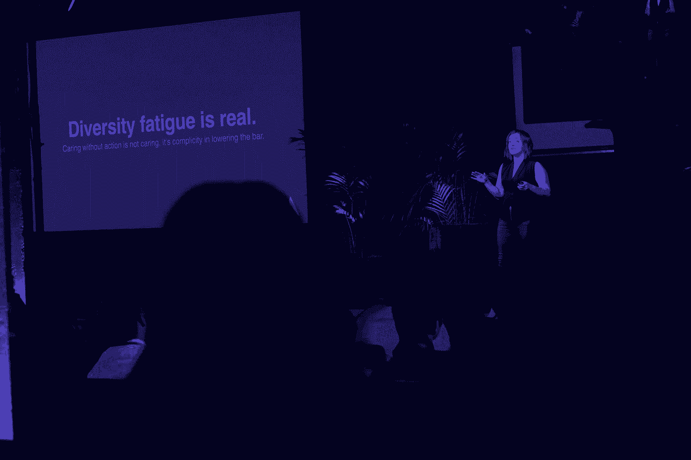

# 让你的 D&I 努力少说话多走路的八种方法

> 原文：<https://review.firstround.com/eight-ways-to-make-your-dandi-efforts-less-talk-and-more-walk>

“我们关心多样性，但我们希望确保我们不会降低标准，对吗？”

“如果我每次听到反对多元化和招聘的各种声音都能得到 5 分钱，我想我会成为亿万富翁。撇开这个不谈，这只是一个垃圾问题，”隶属于 **[大西洋](https://www.atlassian.com/ "null")** 的全球多元化负责人&奥布里·布兰奇 说。布兰奇不是一个直言不讳的人，她分享了她对如何应对这种常见重复的看法:“我的回答总是不，我实际上是在请你提高标准。缺乏多样性是一家公司不是精英管理的第一个迹象。所以，事实上，这个笑话是在你身上，因为你已经在没有意识到的情况下降低了门槛。”

说到提高标准，布兰奇知道她在说什么。在她的领导下，Atlassian 能够将女性技术人员增加 80%——而且他们还没有止步于此。2017 年，Atlassian 三分之一的技术实习生是黑人或拉丁裔。过去两年，该公司 40 岁以上的员工增加了 25%。现在，Atlassian 的技术员工中有整整 13.1%的人认为自己属于代表性不足的种族和族裔群体。随着公司规模扩大近两倍，该公司一直能够保持有色人种在整个组织中的代表性。

但布兰奇的使命是不仅在 Atlassian，而且在整个科技行业提高 D&I 的标准，挑战各地的领导者和团队，提高他们的游戏水平。受到她在第一轮创始人峰会上的演讲的启发，她在这里分享了 Atlassian 在 D&I 取得有意义进展的剧本，强调了这个不断发展的领域的挑战，并介绍了希望加入她的创业公司的八个具体战略。

# 关爱堆积如山，却缺少行动

过去几年，D&I 一直是科技界的热门话题。从#FoundersForChange 和#MeToo 运动到围绕[薪酬平等的讨论](http://firstround.com/review/heres-how-women-and-startups-can-accelerate-pay-equity-in-tech/ "null")以及一系列即将出炉的企业多元化报告，它都是行业关注的焦点。

“D&I 现在有点时髦。布兰奇说:“我认为人们过去认为整个专业是 kumbaya 和鼓圈，但现在它赢得了更多的信任，变得更加广泛。”“事实上，Atlassian 最近的 [2018 年美国科技多样性状况](https://www.atlassian.com/diversity/survey/2018 "null")报告显示，约 80%的人表示他们关心 D & I。但更多人关心的另一面是，当进展令人沮丧地缓慢时，更多人会注意到并感到沮丧。”

同一份大西洋报告发现，D&I 的努力已经停滞。与去年同期相比，参与多元化计划的个人减少了近 50%。与此同时，美国公司范围内的计划采用率保持平稳，而硅谷公司实际上比去年注册了更少的正式 D&I 项目。与此同时，不到 30%的代表性不足的群体报告说，他们对各自的公司有归属感、代表性和高留任率。

根据布兰奇的说法，D&I 周围意识的上升和采取行动时的停滞的奇怪组合背后有几个原因:

**疲惫不堪。布兰奇说:“[多样性疲劳](https://www.newyorker.com/culture/2017-in-review/the-year-in-diversity-fatigue "null")是真实的。“这个话题无处不在，人们已经厌倦了谈论它。就像同情疲劳症一样，关爱会带来伤害。所有这些讨论都没有转化为有意义的行动，这让你感到沮丧。这是一场耗费资源和精力的战斗，当你几乎看不到结果时，很难保持投入。这时，你会看到兴趣和热情的倡导慢慢转化为被动和漠视。”**

被复杂性淹没。需要解决的问题之多令人望而生畏。从性别歧视和种族歧视到能力歧视和年龄歧视，争取 D & I 是一场多方面的战斗。对于应该关注什么的内部分歧可能会使事情变得更加复杂。“试图一次解决所有这些问题显然不是成功的秘诀，但人们不知道从哪里开始。她说:“如果你觉得一个人或一家公司无法产生影响，你可能会完全停止采取行动。”

参与错误的对话。根据布兰奇的说法，当讨论 D & I 时，我们会让自己失望。“我们担心代表权，忽视分配。**我们在让未被充分代表的个人进入公司方面做得过多，而在他们进入公司后又做得不够。她说:“但最重要的是，我们对“D”甚至是“T5”的含义并没有真正与“T4”达成共识。“人们对这些话的反应非常强烈，通常是负面的。我们最近做了一项匿名调查，我们的一名员工说:‘我是一名白人，我总觉得自己站在了多元化的错误一边。’但是没有对错之分。我认为这个评论是对我们的发展方向和我们使用的定义的根本性误解。如果 Atlassian 没有白人，我们会有同样的问题。他们需要留在这里，我只是想让更多的人加入进来。"**

鉴于这些障碍，人们很容易对接受 D&I 倡议感到有些气馁或犹豫。虽然对行业解决这些棘手的系统性问题的能力的信心可能不高，但对布兰奇来说，这更是创业公司加倍努力 D&I 的原因。“优秀的投资者知道，在下跌市场投资是你想要的玩法，”她说。“但是严肃地说，重要的是公司要意识到仅仅关心 D & I 是不够的。如果不投入时间和精力，你只会强化这个行业的平庸模式。你可以被动地顺从不平等，也可以采取行动。”

没有行动的关爱不是关爱。这是降低标准的共谋。

对于那些希望超越单纯谈论 D&I 的初创公司来说，布兰奇在 Atlassian 的经历提供了八个策略，有助于确保深切关怀与快速行动相结合。

# 1.不要随大流，要找出你的原因

在创业公司在 D&I 前线做任何事情之前，需要对动机和目标进行更深入的研究。“您需要知道为什么 D&I 计划对您的业务至关重要。如果你的回答是“我不希望我的公司因丑闻而崩溃”，那就不够好。她说:“你需要找到一些有抱负的事情。“如果你不知道为什么，你就不会开始开发一个产品。多样性不是一个可以选择的选项。”

对于不知道从哪里开始的团队来说，有一个更明显的、有研究支持的事实，即多样性推动价值。布兰奇说:“从在安全气囊测试中使用男性尺寸的碰撞假人到谷歌面部识别软件中针对有色人种的 T2 问题，有大量证据表明，如果你的团队不多元化，你将会错过一些东西。”。“这是因为平衡的团队更善于识别问题。他们看到了更多的问题，他们让彼此更加负责，他们也更加不舒服和具有挑战性，但这正是推动我们变得伟大的原因。”

但是，除了对社会公正的普遍热情或提升股东价值的机会，寻找更具体原因的团队可以将 D&I 的努力与公司使命联系起来。“在 Atlassian，我们的使命是释放每个团队的潜力。显而易见，我们在世界各地服务的团队非常多样化。因此，如果我们不能首先从内部弄清楚这一点，我们就无法为客户服务并向他们销售令人惊叹的解决方案，”Blanche 说。“我们需要看起来像我们服务的团队。如果我们真的想实现公司的使命，就必须把事情做好。”

下一步是将这种驱动力注入 D&I 目标。“国际多元化在 Atlassian 非常重要。“我们是一家澳大利亚公司，总部设在悉尼，”布兰奇说。“因此，我们的长期目标是让我们的每个办公室都反映出我们所在社区的多样性。在不同的地方看起来是不同的。例如，当我第一次加入并开始谈论支持 Latinx 社区时，我有许多困惑的澳大利亚人盯着我，因为这不是一个社区，甚至不是一个他们超级熟悉的术语。所以对我们来说，它需要全球翻译。另一个例子是，英特尔的目标是在市场允许的情况下雇佣、保留和提升代表性不足的群体。从表面上看，公司有不同的 D&I 目标似乎令人困惑，就好像这是一场混乱的运动，我们在努力实现的目标上没有达成一致。但我认为，所有公司都是不同的，所以它们的目标*应该*不同。”

你不能有一个千篇一律的办法来 D &我，这不是一个放之四海而皆准的情况。

# 2.扔意大利面做小调整

布兰奇为 D&I 解决问题的方法的核心是，该行业中的排斥、歧视和骚扰是一个系统性问题，这意味着需要一种基于数据的系统方法来中断它。“没有一种培训或一个项目，没有灵丹妙药。布兰奇说:“这是一个 10 到 20 年的问题，你不能通过将一个为期一年的项目和几个目标拼凑在一起来解决结构性种族主义。”“这是后退一步，重新思考如何与员工互动，以及如何回应他们的经历。”

三年前，布兰奇第一次加入 Atlassian 时，她的直觉是，一个基于利用研究对公司正在做的事情进行细微调整的系统，可能会在很大程度上改变结果。作为一名前政治学研究者，这种本能根深蒂固。“没有谷歌学术，我不知道如何解决问题，”她笑着说。“记住，虽然最佳实践和研究是起点，但它们可能不适合你。当我在 Atlassian 面试时，他们问我是否知道所有的最佳实践。我说，‘我知道它们应该是什么。但我会把经过经验验证的意大利面扔向墙壁，看看有什么能坚持下来。他们还是雇佣了我。"

Blanche 采用这种方法来消除年终评估过程中有偏见的结果。“当我加入时，每个人都会写自己的评估，交给他们的经理，然后经理会进行评估。但是我们看到女性的评分稍微低了一点。布兰奇说:“这是因为这个过程存在一些问题。研究指出了女性的信心差距，以及经理们潜在的 T2 锚定偏见。因此，依靠这项研究，我们压缩了这个周期，改变了它，这样个人和经理必须同时写他们的评论。这实际上改变了 Atlassian 的收视率分布，所以我们能够纠正这个问题。”

# 3.检查并映射您的权限

为了进一步扩大 D&I 工作的影响，请花时间探索当前团队成员所拥有的、其他人可能没有的优势。“要成为一个好的盟友，你需要明白是什么让你来到这里，你得到了什么，你没有得到什么。她说:“想想你有什么，你能为其他人部署什么。“或者至少，想想你是如何无意识地假设“有资格”担任一个角色意味着什么，以及它们是否真的映射到能力上。”

作为如何进行这种脑力锻炼的例子，布兰奇推荐了杰森·福特(Jason Ford)的一篇[有见地的中期文章](https://medium.com/tech-diversity-files/the-real-reason-my-startup-was-successful-privilege-3859b14f4560 "null")，这位奥斯汀的企业家非常详细地描绘了他的特权。但她也分享了自己的故事:“我是一名墨西哥裔美国女性，但你不会从我的脸上看出这一点——我不会对工作中的清洁工感到困惑，”她说。“此外，我三岁时被一个中产阶级白人家庭收养。这意味着我有钱去西北大学，这让我进了斯坦福大学，这让我进入了高科技行业。所以我并没有获得所有的成就，尽管我非常努力。”

映射你的特权意味着认识到天赋和潜力是平均分配的，但机会不是。

但对布兰奇来说，这并不是对那些没有立即参与 D&I 工作的特权同事感到不安的原因。“这是一个非常情绪化的问题。布兰奇说:“如果你已经在硅谷，你的整个职业生涯都建立在这样一种信念之上，即你所取得的一切都是因为你自己的努力和才华，那么接受你拥有一些与你自己的能力无关的优势这种想法几乎是对你自己的攻击。”“虽然很容易将这一点最小化，但对这些人产生同理心是非常重要的。这种感觉一定有点可怕。描绘你的特权是一项情绪劳动，经历它就像经历悲伤的阶段。但是说‘我努力工作，我很聪明，但是我也知道我从这些相当混乱的系统中受益’是可以的所有这些事情都有可能立刻成为现实——你只需要在你自己的头脑中调和它们。"

Atlassian's Global Head of Diversity & Belonging, Aubrey Blanche

# 4.深入到团队层面

报道在 D&I 领域变得越来越重要。但是对于布兰奇来说，这个行业需要改变处理数据的方式，要着眼于团队的多样性，而不仅仅是整个公司。以下是她在公司层面的报告中发现的问题:

**没有分配的表示。**“公司层面的综合报告实际上并不衡量多样性，而是衡量代表性。布兰奇说:“如果你公司 30%的员工都是女性，而男性都在工程部门，那也没关系。”“重要的是，每个团队都是多样化的，代表不足的群体分布在整个公司，而不是局限在刻板的小圈子里。**这是因为团队层面是你真正感受到多元化影响的地方。**你需要在日常工作中体验不同的视角，以便做出更好的决策，获得更好的结果。”

**不够敏感，看不到指针的移动。**企业层面的总量也不够敏感，不足以衡量同比变化。布兰奇说:“如果你是一家像 Salesforce 这样更成熟的公司，根据员工规模和他们在任何时候公开职位的数量，你实际上不得不做一些相当非法的事情，在一年内将黑人员工的比例提高一个百分点。”“因此，当你看到那些‘谷歌在多样性上几乎没有任何进展’的标题时，你需要记住，数字正在朝着正确的方向发展，但在公司层面上，这将是非常缓慢的。这部分数据不够复杂，不足以捕捉表面下发生的事情。例如，如果你看一下我们在 Atlassian 的最新报告，你会发现我们在各个级别和职能上增加了对女性的聘用，我们保持了有色人种在整个组织中的代表性，而我们的规模几乎增加了两倍。没有人会站起来为维持目前的水平而欢呼。但是，因为我们看得更深，你还会看到，在一般的工程团队中，有色人种比一年前多了。所以这意味着更多的人有了和与自己不同的同事一起工作的经历。很难让人觉得这是一种进步，但确实如此。”

公司之间的比较是混乱的。当只关注公司范围的指标时，很难看出一家初创公司是如何跟踪其他公司的。“那里没有苹果对苹果。布兰奇说:“在谷歌和在 Slack 上升一个百分点完全是两码事，因为我们谈论的是非常不同的人数。“或者，如果你看看 Yelp 或 LinkedIn 等公司，它们大约 70%的员工从事销售。因此，他们将在一个与 Atlassian 截然不同的人才市场上竞争，Atlassian 主要是悉尼以外的研发和工程公司。这是一系列非常不同的挑战，所以公司与公司之间的比较对我来说并没有太多的信息。相反，我想看看一个亚特兰蒂斯的工程团队，看看类似规模的工程团队在 Twitter 或脸书做得如何。这一切都是为了能够比较相同大小的单位。团队的规模在各个组织中相当一致，平均为 6 到 12 人，因此更容易收集见解。”

下一步是利用这些团队层面的见解，以有意义的方式影响变革。“在公司层面，我们看到 2017 年 14.6%的技术员工是女性。但是当我查看团队数据时，我发现在我们所有开发软件的小团队中，三分之二的团队只有一名女性。从这一认识中，我们意识到，他们可能因为被如此广泛地分发而感到相当孤立，”布兰奇说。“所以我们为女性创建了团体和项目，让她们在团队中与*建立联系。例如，我们启动了一个**咖啡约会项目**，每隔几周你就会被分配到办公室和另一个女人一起喝咖啡。没有议程，没有期望，这只是你创造有机联系和社区意识的一种方式，这在你的日常工作中可能不会发生。我们还启动了这些**指导环**，这是 8 至 12 人的同伴指导计划，持续 6 至 12 周。这是一种更加结构化的方法，其核心是让女性获得她们需要的洞察力。”*

然而，无论你在看哪种数据集，即使是布兰奇这样自称正在恢复的社会科学家也认为，认识到数据是一把双刃剑是很重要的。“当我们如此关注数字时，它可能会阻碍进步。布兰奇说:“专注于招聘只是治标不治本。“我在某个地方听到了一个让我产生共鸣的比喻:**如果煤矿里的金丝雀停止歌唱，矿工们的反应不会是再扔 50 只金丝雀下去。那就是意识到环境并不安全。通过只关注数字，我们并没有要求公司做艰苦的工作来改变他们的文化以变得更加包容。"**

大多数公司范围内的综合统计数据实际上并不衡量多样性——它们衡量的是代表性。如果你的公司有 30%是女性，如果她们都在人力资源部门，而男性都在工程部门，这没关系。

# 5.解开交叉性

对布兰奇来说，避免认为多样性等同于女性也很重要。“我想我们都看到了这一点。一个领导团队说‘哦，妈的，我们不是很多元化’，所以他们急于让一名女性进入董事会。我明白，从那里开始听起来真的很容易，”她说。“但事实是，当你以多样性等于女性的概念开始时，你实际上的意思是多样性等于异性恋、白人、异性恋和经济上有特权的女性，因为这就是最终发生的事情。很明显，不是我们所有人都是这些东西中的全部或任何一个。”

相反，开始谈论超越性别的多元化轴心。这是一个很好的方法，可以把“我们对他们”的对话变成关于“我们”的讨论，每个人都感到被包含在内。这就是为什么布兰奇花了很多时间谈论交叉性以及突出无形或分层身份的重要性。

“交叉性听起来像是一个花哨的大词，但它真正的意思是我们都有层次。布兰奇解释道:“我们都包含人群，所以我们需要接受这一点。“女人不是一些毯子团体。它的多样性令人难以置信。当你只关注性别平等时，就会导致同性恋女性、有色人种、残疾人、退伍军人等等被抹去。”布兰奇对此有切身体会。“你可能看着我，只看到一个女人，”她说。“但我也是拉丁人和混血儿。我在大学里是双性恋。我有长期残疾。因此，我明白了拥有一个看不见的劣势或我的身份被忽视意味着什么。”

因此，布兰奇正齐心协力将聚光灯对准 Atlassian 的其他团体。“实际上可能是患有自闭症的人，他们在与队友合作的方式上有不同的需求。也可能是看年龄。她说:“我们看到加入我们的 40 岁以上的亚特兰蒂斯人数量显著增加，这是另一个并不总能获得在我们行业取得成功所需资源的群体。”。“如果你不确定在这方面该怎么做，我的建议是雇佣一名黑人女性。我是认真的。一名黑人女性在贵公司的经历是检验贵公司文化的最佳试金石。”

# 6.让你的招聘工作更加精确

缺乏多样性通常源于创业公司招聘过程中潜藏的固有偏见。通过改进识别和缓解危机的工具，领导人可以在根除危机的探索中取得更大进展。

在 Atlassian，Blanche 和她的同事们努力使面试和评估候选人的方式标准化，确保每个人都按照同样的技术标准进行评估。他们还摆脱了寻找“文化契合度”的做法，转而关注价值观。“我对这种文化契合的概念完全过敏。布兰奇说:“这实际上只是一个无意识偏见的棘手困境。“每当你听到有人适合某种文化时，只要稍微回想一下，找出原因。因为通常你会得到某种形式的“嗯，他划船吗？”作为回应。而且喜欢同样的啤酒或者上同一所学校，跟文化不是一回事，当然跟工作资历也没关系。"

为了更进一步，Atlassian 使用了另外三种策略:

**认识到无意识偏见需要缓解，而不仅仅是培训。**

评估过程中的一个巨大问题是无意识偏见，布兰奇将其描述为人类决策的一系列模式，这些模式来自于我们神经处理信息的方式。“那非常无聊，”她承认道。“但它真正的意思是，当我们遇到来自意想不到或非典型背景的人时，我们不太擅长评价他们。”

作为补救措施，布兰奇建议进行以行动为导向的培训，以帮助面试官打断自己的偏见。“我们向我们的招聘社区推出了可操作的特定无意识偏见培训，旨在为他们提供行为策略，使他们能够成为更客观的评估者，”她说。“我们的目标是让他们明白，任何评估都是主观的，但在整个过程中要更加意识到这一点。”

但这并不像举行一次单独的培训会议那么容易，目前许多公司似乎都在这样做。“如果你认为单靠训练就能解决这个问题，请不要推出来。布兰奇说:“你需要一个全面的偏见缓解计划来真正帮助你。“如果你不确定从哪里开始， [Project Include](http://projectinclude.org "null") 有非常棒的资源。”

不要花钱请一些花里胡哨的顾问来做无意识的偏见训练，如果你认为这样会修复人的大脑。神经科学不是这样工作的。

抓紧时间，不要走捷径。

布兰奇经常听到另一种反对 D&I 努力的声音:“我们发展得太快了，我们没有时间去寻找代表性不足的候选人。如果一个白人男性工程师进来，我们会抓住他，因为我们只是想要一个擅长编码的人。”

但对布兰奇来说，这是一个非常糟糕的招聘方式，尤其是对初创公司而言。“如果你只在短期内考虑填补技术技能空缺，那么你实际上是在给你的公司帮倒忙。她说:“一个人的边际增加会从根本上改变企业文化，当你在高风险、高回报的情况下工作时，雇佣一个糟糕的员工既昂贵又危险——这可能会毁掉你的公司。”“你需要看看这个人能否以你公司发展的速度成长。因为如果答案是否定的，那么你就雇了一个非常昂贵的累赘。随着时间的推移，你会付出代价，因为裁员的代价很高。有重新雇用的成本，但也有导致其他人离开或降低参与度的二阶效应。你可以找到拥有合适技能的未被充分代表的人。这确实需要时间，但很值得。”

**非线性体验中的现货技巧。**

“当你看着候选人，认为你不能雇用一个人担任产品经理的角色，因为他们没有任何产品管理经验，这是一个问题，”布兰奇说。人们没有职业道路，他们有成长道路。我们需要更好地为他人考虑他们从不寻常的非线性经历中获得了什么有用的技能。因此，在 Atlassian，我们试图以一种与你的背景无关的方式来了解面试过程中的那些行为。也许你从以前的工作中获得了项目管理技能，或者你从指导和组织孩子的足球队中获得了这种技能。”

# 7.改造 JDS 和采购，以获得漏斗中的申请人范围

但是，即使有合适的招聘工具和面试系统，如果代表性不足的候选人没有首先申请空缺职位，这一切都是毫无意义的。这是布兰奇在亚特兰蒂斯遇到的事情。

“2015 年，我们将所有这些工作投入到重新设计我们研究生项目的招聘流程中，当我们开放工作申请时，在申请开始的前几周，我们收到了*零*名女性申请人。布兰奇说:“对我们来说，这是一个‘哦，不’的时刻，因为很难雇用不申请的人。”意识到 Atlassian 最初没有吸引到平衡的候选人，他们的招聘团队努力[更新他们的外部品牌](http://firstround.com/review/atlassian-boosted-its-female-technical-hires-by-80-percent-heres-how/ "null")，并依靠他们与当地团体和社区建立的网络来平衡他们的候选人库。但除此之外，她还使用了三种更先进的技巧来帮助扩大申请人范围:

阐明你对公平招聘实践的承诺。

布兰奇是 Textio 的福音传播者，这是一个增强的写作平台，提供关于性别平衡和招聘广告整体影响的实时反馈。该工具的数据显示，在所有人口统计群体中，机会均等语言强的职位列表平均填充速度快 10%。

“我们在 Atlassian 发现，在我们的招聘广告中加入平等就业机会(EEO)声明既改善了候选人渠道的平衡，也提高了候选人的实际质量，”Blanche 说。更有趣的是我们在全球范围内的发现。我们倾向于认为平等机会语言是美国的东西，因为它源于民权法案。但 Textio 的数据和我们的经验表明，EEO 声明在美国之外的效果甚至比在美国国内更好。”

但是敷衍的声明是不够的。布兰奇指出:“Textio 发现，使用最低 EEO 声明的招聘结果比没有这种声明的工作更糟糕。”。“你必须定制它，并用你的品牌语言强调它的重要性。它可以简单到在你的招聘广告上写“我们鼓励来自代表名额不足的群体的人申请”。这真的有用。”

避免像瘟疫一样的陈词滥调。

某些词汇和老掉牙的短语已经深深地嵌入了技术行话中，以至于它们已经失去了所有的意义。但是他们也可以发出危险信号。

“像‘摇滚明星’和‘忍者’这样的陈词滥调是男性主导文化的象征。布兰奇说:“使用高度公司化的语言通常是给有色人种的一个信号，表明他们不会成功，因为这种语言是在白人占主导地位的男性空间里发展起来的。“去掉它，说出你的意思，具体一点。”

以下是创业公司需要注意的一些陈词滥调:

*带动成绩*。什么样的结果？激进的，华而不实的还是深思熟虑的，有意义的改变？

*利益相关者*或*买入*。如果有人向他们的利益相关者汇报，那些利益相关者是谁？为什么不是“协议”？

*努力工作，尽情玩乐。如果一个出色的申请人承担着外部责任，或者正在你的公司寻求工作与生活的平衡和可持续的影响，该怎么办？*

“这很大程度上是因为你在选择用词时更加深思熟虑。存在难以置信的细微语言差异。例如，当你把一个职位描述为*管理*一个团队时，你就增加了男性申请者的数量。对于*发展团队*，它增加了女性申请人的数量。但是领导一个团队在性别上更加中立，这有助于你为你的空缺职位找到最多、最平衡、最合格的申请人。布兰奇说:“当然，你实际上做到了这三点，但你传达信息的方式会改变你得到的结果。”。“我看到的另一个好处是，我们招聘团队的成员越来越意识到自己语言的影响力。因此，这不仅仅是解决短期招聘的问题，而是让人们更加注意他们每天使用的词汇。”

发挥创造力(做一些温和的跟踪)。

除了选择正确的词语，布兰奇还将她自我描述的“怪异”寻人策略归功于某种秘密武器。在 Atlassian 任职期间，她积极寻找代表性不足的群体，并鼓励他们申请。

“我在 Twitter 上关注了与科技领域代表性不足的人相关的标签，我在 Twitter 上向那些参与者发布了招聘广告。听起来很奇怪，但我是认真的。我说‘嗨，你看起来像一个伟大的 UX 设计师，我们有三个空缺职位，你应该看看。’”她说。“我也去了亚马逊，看了科技书籍，读了评论，试图找出是谁写的，因为女性写的评论往往比男性多。除非知道自己在说什么，否则没人会写 Node.js 的书评。”

# 8.记住“我”代表什么

“我总是提醒人们，我的头衔里有一个&符号，”布兰奇说。“科技公司发布多元化报告，而不是包容性或归属报告。这是因为像归属感这样的主观感受似乎更难衡量。人们喜欢关注多样性，因为这里有数字和电子表格——人们觉得舒服的东西。她说:“他们不太适应那些关于归属感的模糊概念。

布兰奇提供了三个小贴士让我们重新关注归属感:

**反过来解释。布兰奇说:“我发现,[人实际上更理解排斥的概念。“每个人在生活中都会有一段时间觉得自己不属于某个空间，无论是没有被选去踢球还是被性骚扰。所以，当你带人们踏上那段旅程，当你解释说你只是想让人们不再有那种*和*的感觉时，每个人都会明白。”](http://firstround.com/review/ebays-first-chief-diversity-officer-on-humanizing-diversity-and-inclusion/ "null")**

**衡量归属。** Blanche 指出，来自 [Culture Amp](https://www.cultureamp.com/ "null") 和 [Paradigm](https://www.paradigmiq.com/ "null") 的[调查](https://academy.cultureamp.com/hc/en-us/articles/115000603109-Inclusion-Survey "null")是目前最好的例子，创业公司可以围绕包容性提出一系列潜在的问题。“第一预测因素是对这个问题的回答:‘我觉得我属于我的公司，’”她说。“在 Atlassian，我们发现对团队的归属感才是最重要的。通过询问这个问题以及其他有关求职行为的问题，我们能够更好地了解我们 6 个月和 12 个月的流失率，这样我们就可以防患于未然。”

**专注于留住人才。**留住现有的代表性不足的员工的重要性怎么强调都不为过。“公司在 D & I 的外部品牌方面投资很多，但这需要确保已经在你的组织中的人是品牌倡导者。“耳语网络是真实的，它有着巨大的影响力，”布兰奇说。“创造一个良好的环境是一个不可思议的招聘工具，但往往没有得到充分利用。让所有人都想留下来，渴望招到别人。当你建立了一种人们想去的文化，你就能让那些被低估的人才得到更多的分享。”

# 展望未来，准备迎接冲击

在 Blanche 的领导和公司团队的大力投入下，Atlassian 战胜了疲劳，并采取行动将善意转化为实际成果，从而提高了 D&I 的标准。对于希望跟随他们脚步的初创公司，首先要确定推动你自己 D&I 努力的独特而有抱负的“为什么”。接下来，开始尝试一些小的调整，比如调整年终评审流程。鼓励团队中的每个人承担映射他们的权限的艰苦工作，并开始在团队级别上分割数据以获得更深入的见解。一定要通过强调隐藏的身份来拥抱交叉性。考虑重新设计你的招聘，以减少无意识的偏见，优化经验，而不仅仅是技能或快速填补角色。微调您的信息，删除陈词滥调，强调平等机会，并创造性地拓展到代表性不足的社区。最后，确保你不会忘记归属感。寻找新的方法来衡量它，并专注于保留你已经拥有的代表性不足的个人。

对于布兰奇来说，关键的学习就更简单了。她说:“**归根结底，多元化就是雇佣和留住优秀人才。“我最喜欢我们所做的事情是，我们非常清楚我们的招聘社区，我们只是希望他们雇佣正确的人。我们不需要配额，但是他们能够雇佣一群更加平衡的亚特兰蒂斯人。最终，我们的工作是帮助设计一个尽可能高效和客观的招聘流程。如果我们在这方面取得成功，我们将在另一方面获得多样性。有一种神话认为你必须降低标准，而事实上，多元化是将自己保持在最高标准的来之不易的结果。”**

虽然前进的道路上并不缺少障碍，但布兰奇乐观地认为未来是光明的。“已经发生了根本性的变化。公司现在比以往任何时候都更早开始。她说:“Asana 雇佣了一名 D & I 的负责人，当时他们只有几百人，但十年前，在人数达到 10，000 人之前引进一个人几乎是闻所未闻的。“但最重要的是，潜在的影响是巨大的。创造一个更能反映世界其他地方的行业是一个不可思议的机会，这很重要，因为我们是谁会深深影响我们制造的产品，全世界都在使用这些产品。尽管我们才刚刚开始我们的旅程，也很容易希望我们走得更远，但我们致力于尽我们的一份力量推动行业向前发展。有这么多的空间可以在这个空间上留下印记，这很令人兴奋。”