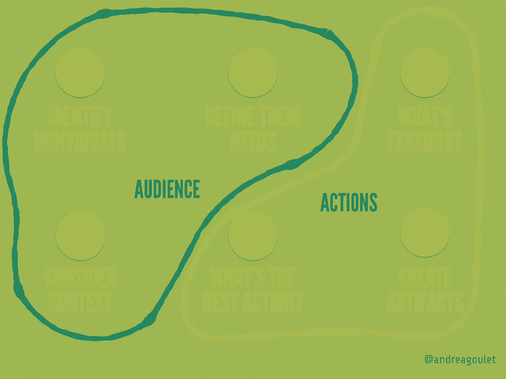
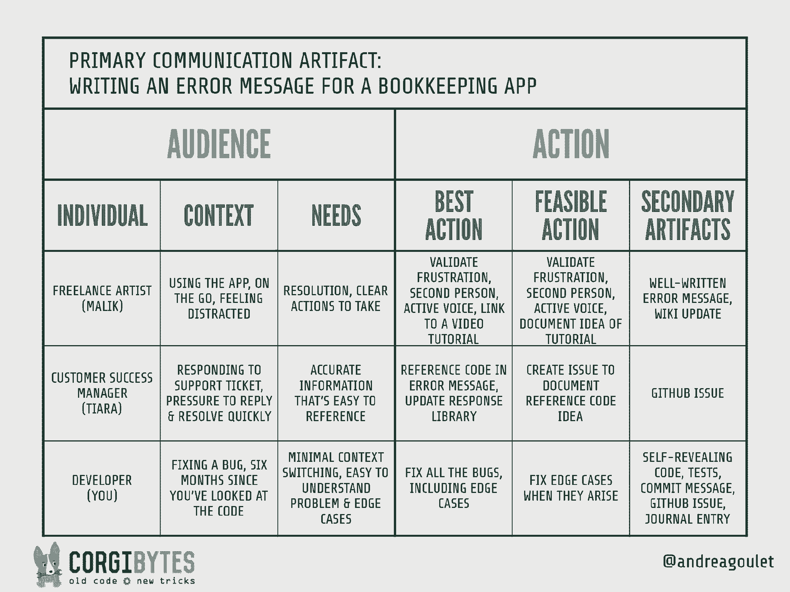

# 移情驱动的开发:工程师如何利用这一关键技能

> 原文：<https://review.firstround.com/empathy-driven-development-how-engineers-can-tap-into-this-critical-skill>

“在软件公司，你不能说‘感同身受’这个词。没人会把你当回事。”

**[安德里亚·古莱特](https://www.linkedin.com/in/andreamgoulet/ "null")** 简直不敢相信她所听到的。早在 2009 年，她在 **[Corgibytes](https://corgibytes.com/ "null")** 发展自己的团队时，就聘请了一位好心的顾问给她提了这个建议。她曾想将同理心作为一种核心价值观，但却面临着全行业的误解，即同理心和技术技能是不可调和的。

一晃十年过去了，人们的态度似乎已经发生了转变。“从人们把感同身受视为一个肮脏的词语开始，我们已经走过了漫长的道路。“实际上，我现在已经就这个话题做了一些主题演讲，工程师们对我要说的越来越感兴趣，”Goulet 说。

但是在她看来，对话才刚刚开始，仍然有所欠缺。“很高兴我们能在这个时刻庆祝同理心，并谈论它在工作中的重要性。但我们必须小心，不要过于抽象，也不要局限于表面层面的讨论，”她说。“我看到的情况是，对话往往止于‘多点同情心吧！’我们需要向前迈进一步，认识到同理心是一种可以学习和应用的技能。"

对于那些认为同理心属于模糊的感性领域的人来说，这种观点似乎有悖直觉。但是考虑到她的背景，Goulet 是独一无二的。她的职业生涯始于文案，这个角色依赖于理解和培养与读者的联系。当她转向工程并出于通过重塑技术债务来创造技术财富的奉献精神而创建 Corgibytes 时，她惊讶地发现了文案和编写代码这两种看似完全不同的技能之间惊人的相似之处。

“编码和文案比你想象的更相似。她说:“有一种误解，认为我们使用的编程语言只是为机器编写的。“但是我们不用 1 和 0 来写代码，对吗？我们用编译语言编写代码，以便其他人可以阅读，无论是我们的团队还是未来的自己。**编码是交流的一种形式。沟通根植于同理心。因此，软件工程师可以从将移情作为一种战术技能中获益良多。”**

今天，这位联合创始人兼首席执行官自豪地说，事实上，她确实[将同理心具体化为 Corgibytes 的核心价值观](https://corgibytes.com/about/ "null")。现在，凭借她在自己公司实施共情的见解，她决心改变科技行业谈论这一关键技能的方式。

在这次独家采访中，Goulet 打破了阻碍工程师磨练其移情专业技能的三个神话。她解释了为什么将交流工件留在代码中是一种移情练习，她还介绍了移情驱动的开发，这是一种将这种关键技能嵌入工程团队的高度程序化的框架。无论你是刚刚踏上同理心之路，还是想让你的实践更上一层楼，Goulet 都提供了初学者技巧和高级策略的组合。最后，她向企业家提出挑战，不要把同理心视为一种抽象或天生的才能，而是一种强大的、可操作的工具，属于每个工程师的工具箱。

# 首先，破除这些移情神话

虽然共识可能正在形成，即移情很重要，但 Goulet 担心，围绕工程界这一关键技能的对话正在将我们引入歧途。“如果人们对同理心没有坚定的、技术性的理解，就很容易忽视它，”她说。“他们可能会对它的含义做出假设，这最终会强化对它的刻板印象，甚至让我们倒退。”

在这里，Goulet 破除了关于共情的三个常见神话，以帮助创始人和技术领导理解和发展团队中的共情。

# 误解 1:移情只是一种感觉。

软件行业长期以来不愿意接受共情，这是因为对共情到底是什么有着根本性的误解。“大多数人认为移情只是一种感觉，”她说。“而且这件事肯定*涉及到*的感情。然而，移情的概念化真的有局限性。”

在她寻求建立共情案例的过程中，Goulet 无意中发现了 [Indi Young 的](https://www.linkedin.com/in/indiyoung/ "null") *[实用共情](https://rosenfeldmedia.com/books/practical-empathy/ "null")* ，作者是一名程序员出身的研究人员，在书中她描述了不是一种而是六种共情类型。“这种细分真的让我震惊。我想，如果某样东西可以分成六个子集，那么它一定非常密集，非常专业，”古利特说。

“Indi 写道，同理心是一个名词——它是你在倾听他人并真正理解他们的观点后获得的东西。她还深入研究了一种叫做**认知移情**的亚型，这是一种*理性*过程，用于揭示另一个人的信仰、价值观、偏好和观点。古利特说:“这个过程已经在营销人员、UX 研究人员、作家、设计师，甚至许多前端工程师的工作中根深蒂固。“我的目标是真正研究 Indi 的工作，它在 UX 社区已经非常成熟，然后找到一种方法来扩展它，让更多的人在后端操作。”

从杨的学术研究以及[的布琳·布朗](https://www.linkedin.com/in/brenebrown/ "null")博士的研究中获得灵感，古利特开发了一个面向工程师的认知共情的工作定义:**“共情是主动的观点和解决问题。”**

Goulet 清晰的定义使工程师们能够投入到实施中，并抛开他们对没有能力完成任务的担心。“如果你从事软件行业，你很可能是一个优秀的问题解决者。她说:“你已经成功了一半。“一旦你理解了认知同理心，它就是理解其他亚型的丰富世界的关键。”

移情不是这种抽象的、形而上学的谜。这是一项我们需要尊重的技能，也是我们需要锻炼的肌肉。

# 误解 2:移情与构建软件无关。

当大多数人考虑成为一名有效的工程师所需的技能时，换位思考可能不是第一个想到的。“我们需要消除对工程师和专业技能的错误认识，”古利特说。“例如，我讨厌‘你是技术人员还是非技术人员？’问题。不是二进制的。你可以是技术型的，知道如何成为一个有技巧的、有同情心的沟通者。我认为，如果你想成为一名优秀的工程师，除了知道如何让机器按照你期望的方式工作之外，你还应该知道如何沟通。"

虽然事实证明移情有助于[建立多元化和包容性的团队](https://firstround.com/review/heres-how-to-wield-empathy-and-data-to-build-an-inclusive-team/ "null")和[为设计师赢得一席之地](https://firstround.com/review/How-Designers-Can-Earn-a-Seat-at-the-Table-2/ "null")，但 Goulet 认为移情是工程师越来越必要的技能。

她说:“提交消息、拉取请求、命名、测试、错误消息，从根本上来说都是关于同理心的交流。”“如果说[使用遗留代码](https://firstround.com/review/forget-technical-debt-heres-how-to-build-technical-wealth/ "null")教会了我什么，那就是**代码不是在真空中编写的；它不断地被回顾和重温。你未来的读者可能是你的同事。六个月后，可能就是你自己，”她说。**

“如果你不清楚地传达你的推理，把未来的读者考虑进去，你就在创造有问题的遗留代码，”Goulet 说。“一旦这种情况根深蒂固，代码库就很难改造。没有同理心的操作与困扰工程团队的最大问题之一直接相关。所以不要告诉我这与你的日常工作无关。”

当然，工程师是优秀的问题解决者。但我认为被忽视的是，工程师也是天生的沟通者。编码就是向人和机器传递信息。

此外，Goulet 认为同理心可以帮助工程师避免另一个未来的问题:直接在他们构建的软件中加入偏见。“我们已经过了假装人类编写的代码不受人类偏见影响的阶段，”她说，指的是一些引人注目的事件，其中[面部识别算法显示了种族偏见](https://www.nytimes.com/2018/02/09/technology/facial-recognition-race-artificial-intelligence.html "null")，或者机器学习软件再现了对女性的偏见。

"[多元化和包容性不仅仅是团队构成的问题](https://firstround.com/review/eight-ways-to-make-your-dandi-efforts-less-talk-and-more-walk/ "null")。Goulet 说:“我是制造更好的产品的关键因素，这是所有工程师都应该努力去做的事情。“培训开发人员更深入地理解同理心是实现最终目标的关键第一步。”

# 误区三:同理心是教不来的。

“人们发现说‘学习如何编码，下面是你可以采取的步骤’很容易。”但是有一种误解，认为同理心要么是你有的，要么是你没有的，而且是无法培养的。

承认同理心是一种可以训练的技能是提高它的第一步。很难将成长思维应用到你认为是固有的、固定的特质上。她说:“但是，通过对什么是共情、如何运用共情以及如何培养共情的实际分析，我们找到了前进的道路。”。

“虽然我们当然需要对那些可能难以表达同情的人保持敏感和包容，但我认为我们需要挑战工程领域，以做得更好，”Goulet 说。“我们需要摒弃‘社交无能的工程师’这种极具破坏性和局限性的刻板印象。”这表明，仅仅因为某人碰巧擅长使用机器，他们就不需要或没有能力学习对公司和产品建设至关重要的其他技能。事实是，你有能力成为所有这些东西。"

技术技能的差距很可能是真实的，但请考虑硬币的另一面:大多数计算机科学专业的学生没有发展他们需要的沟通和移情技能，以进行合作并成功地构建适合所有人的产品。

Andrea Goulet, CEO of Corgibytes

# 将同理心融入工程实践的入门工具包

就像学习编程语言或运动训练一样，建立同理心应该是持续练习的一部分。Goulet 分享了三个指导原则，当你开始提高自己的移情能力时，你可以依靠它们:

# 1.用责备换取荣誉。

工程师可能对这种情况很熟悉:你重新访问完全不可理解的旧代码，找不到任何理由。暗示挫败感的爆发。“通常的反应是，*我的天，是哪个白痴决定这样做的*？Goulet 说:“责备实际上已经融入了我们的工作中。“如果您想查看代码更改的历史记录，默认命令是命令行上的‘git kill’。这种微小的认知启动让开发人员看不起前人的贡献。”

但是羞辱原始开发者浪费了宝贵的时间和精力。“我们需要超越指责和羞耻。古利特说:“他们没有生产力，与移情的对立面[。相反，**当你接近代码时，尊重你的前辈的工作。好吧，我认为人们已经尽力了。他们为什么选择这种解决方案？那时候你会得到更有启发性的答案。”**](https://www.huffpost.com/entry/brene-brown-shame_n_3807115 "null")

Goulet 建议考虑约束，以帮助你对过去的开发者有更多的同理心。没有人会在早上醒来后决定写最糟糕的代码。她说:“这根本说不通。“人们面临着影响代码质量的现实约束——时间、预算、技术限制和不切实际的期望。遵循约束，你会发现代码库达不到你的期望的更深层次的原因。”

如果没有同理心，你无法开始解决问题，更不用说更新整个代码库了。从另一个工程师的角度来分析问题是一项艰难而复杂的工作，它植根于理解为什么有人会做出这样的选择。

# 2.把你的项目想象成一次考古挖掘。

当谈到构建移情编码实践时，Goulet 鼓励工程师将旧代码库想象成考古遗址。

“当考古学家研究一个古代遗址时，他们并不了解当时生活的全部情况。他们必须寻找手工艺品:陶器、硬币，有时还有文字，”她说。“类似地，如果你现在在你的代码中留下**通信工件**，它会让未来的开发者更容易解释你的代码。”

虽然她长期以来一直认为，当你[重新架构遗留代码并从一堆技术债务中抽身出来的时候，通信工件会给你带来操作上的优势](https://firstround.com/review/forget-technical-debt-heres-how-to-build-technical-wealth/ "null")，但 Goulet 已经意识到，生产它们的行为在本质上也是一种移情的练习。

“是的，如果我留下通讯神器，那会节省下一个人的时间。但是我的这些想法也有双重目的，深深植根于同理心。这实际上又回到了同理心的定义，那种积极的观点和解决问题的能力。她说:“当我试图思考我能做些什么来帮上忙时，我是在对那些后来人进行换位思考。“最终，这种同理心在我自己、团队成员和未来的读者之间创造了信任，因为这几乎就像我们都在互相照顾。”

许多软件大师都引用了古老的搜索规则:“留下比你发现时更好的代码。”当你练习移情时，你是在强化这句格言。

她指出了三个接触点，工程师可以在这些接触点上留下对代码产生影响的通信工件，并留下信任的遗产。

**在你的代码评审中:**在代码投入生产之前，合并请求和其他类似的评审代码的邀请是工程师练习留下沟通工件的理想场所。“记住，你的对话不仅仅是针对你的代码审查员的，”Goulet 说。“想得更大。你在为未来的自己保留理性。对于开发人员来说，当他们修复一个 bug 时，他们必须与这段代码进行交互。对于一个客户成功经理来说。接受他们的观点:什么对他们有用？什么将有助于为他们提供背景？”

**在你的提交消息中:**“提交消息绝对是最好的文档形式，因为它们与代码库紧密相连，”她说。人们经常忘记提交是由两部分组成的:标题和信息。正如我的朋友[戴夫·博克](https://twitter.com/bokmann "null")所说，如果有必要，标题应该是一条短推的长度，描述应该是一篇博文的长度

在你的电子邮件和公司信息系统中:“每当你和别人互动时，都有机会留下一个交流的神器，”古利特说。“这可能是一封简短的电子邮件或松散的信息，告知、询问问题或征求反馈。不要只是删除一个没有上下文的链接，或者说，“这是我做的事情”，而是添加一些上下文，表明你已经倾听并愿意接受反馈。一个简单的句子，比如“这是我根据自己的理解想出来的”。你的观点是什么？对建立信任和协作大有帮助。"

# 3.像文案一样思考。

鉴于写作可能是在工作场所表达共鸣最常用的工具，工程师们可以从文案世界中受益匪浅。“作家需要尽早磨练同理心，因为他们写作是为了与观众建立联系，”古利特说。无论你是在制作提交信息还是电子邮件，Goulet 为工程师们提供了她最好的写作技巧:

保持你的语气随意和对话。许多人感到在专业环境中用过多的行话或复杂的语法来“装饰”他们的语言的压力。忍住那种冲动。“最有效的语言是清晰、简洁和自然的，”古利特说。“好的写作是简单的写作。”

永远不要低估第二人称主动语态的力量。她说:“作为一名文案，这是我得到的最重要的建议之一。快速语法复习:在第二人称中，作者直接称呼读者，用“你”主动语态表明读者正在进行动作。“第二人称主动语态的区别在于被动的“*发现了一个错误”*和主动的、更感同身受的“*对不起，你遇到了一个错误，*””古莱特*说。*

**不要做假设。古利特说:“不要假设每个阅读你作品的人都知道你所写的一切。“如果你在写一个深奥的概念，花点时间解释一下。如果你用的是首字母缩略词，在第一次使用的时候把每个单词都拼出来。这样，你的作品就更容易被那些与你拥有不同技能和优势的读者所理解。”**

为了帮助她将移情作为实践的核心，古利特在她的文案生涯早期听取了她的一位导师萨姆·霍恩的建议。“山姆是一个优秀的沟通者，他教会了我很多关于同理心和思维能力的东西，”古利特说。“她总是告诉我，‘短铅笔胜过长记性。’当你工作时，不要忽视出现的想法，而是把它们写下来。然后，通过利用和分享你在日常工作中已经创建的沟通工具，找到将你的想法转化为行动的方法。"

太多时候，关于如何改进一个过程，或者如何为下一个人清理代码的感同身受的想法，在日常需求的挤压中迷失了。当你工作的时候，保持一个连续的想法日志可以最小化上下文切换，同时养成创造你的想法的习惯。“随着时间的推移，想法产生和分享之间的联系将变得更加直观，因为你会发现模式并了解什么最有效，”Goulet 说。

为了帮助你的想法记录和运行，利用你已经在使用的工具，这样就有最少的摩擦和上下文切换来记录一个想法。“如果你对命令行很熟悉，快速搜索‘命令行日志’会给你很多可以尝试的工具，”她说。“或者，基于 Git 的 wiki，如 [GitHub](https://github.com/ "null") 的 wiki 和 [GitBook](https://www.gitbook.com/ "null") 允许开发者使用文本编辑器和 Git 客户端记录想法和笔记。"

# 提升你的同理心:同理心驱动开发的高级框架

对于那些喜欢好框架的工程师来说，Goulet 打破了认知同理心的程序模型，创建了一种团队可以集成到他们工作流程中的算法。她称之为移情驱动的发展。

[测试驱动开发](https://www.codecademy.com/articles/tdd-red-green-refactor "null")可以描述为 red，green，refactor。同样，同理心驱动的发展可以被提炼为**观众**和**行动**。“首先，考虑你的受众，那些将要与你的内容互动的人，包括你的代码和你留下的交流工件。然后，采取行动。想想如何主动预测他们的需求。”

The Empathy-Driven Development framework

为了说明移情驱动的开发在工作中的作用，Goulet 举了一个你作为一个小型创业公司的开发人员可能会遇到的问题的例子:“假设你的任务是为一个记账应用程序编写一个错误消息。在这种情况下，你如何利用同理心？”在这种情况下，您将为您的受众留下一个主要的沟通工件(错误消息)。

首先，考虑观众:

**识别个人。除了最终用户之外，列出你预期会遇到你的工作产品的个人。“很可能，你的受众包括各种各样的用户，”古利特说。“在这个例子中，你的观众可能包括一个自由艺术家、你公司的客户成功经理和你未来的自己。”**

**考虑上下文。Goulet 说:“一旦你确定了这些人，想想他们从哪里来，现在在哪里。“艺术家使用手机上的应用程序；客户成功经理在压力下响应支持请求；六个月后，你未来的自己正在一边修正一个错误，一边阅读你自己的代码。”**

**明确他们的需求。**最后，考虑每个人的挑战和需求。“痛点并不总是很明显。她说:“提问，阅读文章——尽你所能去了解它们。“使用这款应用的人和时间紧迫的客户成功经理需要你做什么？你未来的自己需要什么？”

然后，采取行动:

**采取什么行动最好？所以你已经收集了关于你的听众的有价值的信息。她说:“用这种新的理解来思考我们能做些什么来提供帮助。“您希望验证用户对错误消息的失望。对于客户成功经理，您希望在错误消息中创建一个简单的参考代码。对于未来的自己，你可能想现在就修复所有的错误。”**

**什么可行？**“你不会总是能够做*最好的*事情来帮忙，所以考虑一下你实际上*能做什么*。你有时间和资源去执行什么，让他们的生活好一点？几乎总是有你可以做的事情。想想微小的原子。即使是最小的动作也会累积起来，”Goulet 说。

**创造次级神器。一旦你创建了你的主要沟通工具——一条清晰的错误信息——你的工作还没有结束。Goulet 说:“在你对‘完成’的定义中包括次要物品。“次要工件是您在处理主要工件时产生的想法、基本原理和约束的持久证据，可以采取多种形式。”她建议看看上面的沟通人工制品图来寻找灵感，甚至为你的项目创建一个象限来产生更多的想法。“自然语言存在于软件系统的很多地方。这与繁琐的文档无关。而是更有目的地做你已经在做的事情。”**

Example of Empathy-Driven Development in action

随着时间的推移，通过足够的练习，这些步骤开始变得直观。Goulet 认识到这个过程开始时通常感觉缓慢和繁重，但鼓励开发人员坚持下去。“和 TDD 一样，同理心驱动的开发一开始会觉得很慢。在当下，很容易觉得留个通讯神器不重要，或者没时间。但是许多人工制品需要额外的三十秒，最多几分钟，来为未来的读者完成一个想法。Goulet 说:**你通过定期离开沟通工具获得的边际收益最终会远远超过短期的时间投资。**

“这就像你第一次学开车时的清单，”她说。“一旦你有了足够的驾驶经验，检查所有的后视镜就成了你的第二天性。同理心驱动的开发也是如此。一旦养成习惯，它就变成了一种健康的本能。”

另一方面，疏忽的影响是复合的，因为缺乏沟通的人工制品会给未来的读者带来不愉快的遗产。“老实说，这使得软件更难维护，因为未来的开发人员不得不回去重新发明轮子，”Goulet 说。“你已经在努力发展你的基本原理。现在，在您继续下一步之前，请花点时间记录下来。”

运用同理心不会给你现有的工作流程增加太多时间，而且好处是深远的:今天一个明确的提交信息会节省每个人的时间，并减少未来的挫折。

# 超越代码扩展同理心

你的代码库并不是唯一受益于同情心的东西——工程团队和整个公司也是如此。从团队实践到文化范式转变，Goulet 分享了她提升同理心 IRL 的先进实践。

# 让你的团队看你的日记。

在代码中留下交流工件并不是你在软件团队中运用同理心的唯一方式。除了 Slack 上的一个# shou toothing 频道，Goulet 的团队还采用了保持[每日日志](https://corgibytes.com/blog/2016/08/02/how-we-use-daily-journals/ "null")的做法。“每个人都有一个 Wiki 页面，团队中的任何人都可以看到，我们整天都在做笔记和思考，”她说。“每个人都有自己的方式来记录这些微观决策。有些人使用项目列表，有些人使用句子——只要对每个作家最合适就行。

就像代码中的交流工件一样，花在每日日志上的时间最终会得到回报。“通常在一天结束时，打字不到 15 分钟，”古利特说。“我的同事告诉我，他们之所以能够节省如此多的时间，是因为他们能够回顾自己六个月前的想法，或者与一位正面临你已经遇到的挑战的同事分享。我在我的团队中经常看到这种情况。有人会寻求帮助，队友会给出一个链接，并说‘几个月前我也有同样的事情。这是我的日记。从 3 月 7 日开始。创建一个日志条目并不需要投入太多的时间，但结果却是革命性的。"

# 把每个人都变成客服代表。

Goulet 认为，学习移情这一技能的最快途径是通过客户服务的[，这时你必须真正理解和预测使用你软件的人的需求。“我真的受到了 Zappos 文化的启发，”Goulet 引用了 Zappos 首席执行官 Tony Hseih 的书](https://firstround.com/review/Eventbrites-VP-on-How-to-Build-an-Amazing-Customer-Service-Team-from-Scratch/ "null")*[传递快乐](https://www.amazon.com/Delivering-Happiness-Profits-Passion-Purpose/dp/0446576220 "null")* 。“客户支持的价值灌输给了公司的每个人——我指的是律师、开发人员、*每个人*。”

早期创业公司处于一个特别有利的位置，可以开始整合一种同理心的、以用户为中心的风气。“在初创公司的生命周期早期，是开始将同理心融入你的文化的最佳时机。随着公司的发展，你可以建立每个人都可以采用的规范:我们将重视用户的反馈。我们会不断地问问题来理解它们。这是 *[精益创业](https://www.amazon.com/Lean-Startup-Entrepreneurs-Continuous-Innovation/dp/0307887898 "null")* 运动的重要组成部分——走出去，倾听你的客户想要什么。不要把它归到一个人或一个部门。让所有人都加入进来。”

换位思考和寻求理解客户是面向用户角色通常具备的技能。但是当同理心成为从开发者到设计师的使命和文化的一部分时，它真的让公司与众不同。

对于大公司，古利特建议进行全公司范围的同理心培训，比如布琳·布朗的项目[敢于领导](https://daretolead.brenebrown.com/ "null")。“我有几个参加布朗博士培训的工程师感到怀疑，”她说。“但培训结束后，怀疑论者经常向我表示，这些培训真的值得。因为我们为脆弱的对话创造了空间，所以我真的相信我的整个团队因为那次经历而变得更加信任他人，并交付了更好的工作。”

# 倾听他人的心声。

为了采取积极的视角——更进一步，Goulet 建议举办**倾听会议**，这是从 [Indi Young 的作品](https://indiyoung.com/how-to-build-trust-in-a-listening-session/ "null")中借用的另一个概念。“与随意的交谈不同，倾听与理解另一个人的推理、反应和指导原则有着明确的联系，”Goulet 说。“它们旨在帮助你摆脱对另一个人想要什么做出假设的危险习惯，而是使用定性数据来为你的决策提供信息。”

如果你是一名编写函数的后端工程师，很容易将人从你的工作中抽象出来。你越想理解他人，在你编码时就越容易考虑他们的观点。

“首先，拿一本 Indi 的[书](https://rosenfeldmedia.com/books/practical-empathy/ "null")或 [take her training](https://indiyoung.com/learn-2/ "null") ，该书详细说明了如何进行听力训练。然后，让一个同事、朋友或伙伴面试你。古莱特说:“这将有助于你对面试的感受产生共鸣。“随着你越来越适应，扩大范围，采访不同职位的人，或者对你试图解决的问题有所了解的人。”

带着深深的敬意接近你的主题。“时间是别人能给你的最宝贵的东西。她说:“如果有人决定借给你时间，要感激他。

一旦倾听环节开始，把你的判断留在门口。“记住，你是来收集数据的，不是来改变主意的。只是倾听，不要感到羞愧，不要期待，也不要批评，”古利特说。“我们的目标是赢得说话者的信任，并触及他们表面之下的情感和推理。”

开发人员可以使用听力会话来增强他们的工程实践。“假设你是一名从事人工智能的开发人员。你阅读了一份[行业报告](https://www.technologyreview.com/s/612876/this-is-how-ai-bias-really-happensand-why-its-so-hard-to-fix/ "null"),称算法经常受到人类偏见的影响，这可能会对某些人群产生巨大的负面影响。她说:“换位思考可以帮助你掌控这个问题。

“与其把它当成别人的责任而无所事事，不如主动换位思考。变得好奇。听着。思想要开放。然后，有了定性数据，你就可以采取行动，好好利用你解决问题的超能力，”她说。“这可能会停下来考虑你是否在真正有代表性的数据样本上训练你的深度学习算法，或者向你的产品负责人提出一个问题，即通过一个新功能解决可访问性问题。”

# 外卖和信任裂变:共情如何融入公司的未来

虽然科技已经在将同理心作为一种价值观方面取得了长足的进步，但 Goulet 挑战初创公司采取下一步措施，将它视为一种技术技能。

对于那些想要展现同情心的工程师来说，首先要打破长期以来的神话。投入时间创建沟通工件，为未来的代码读者指明道路。使用同理心驱动的开发来主动了解你的受众，然后解决他们的需求。最后，通过与你的团队分享日志来提升你的工作，并建立你自己对你的产品运作的更广阔的生态系统的认识。

一旦团队和公司将同理心视为一种技能和习惯，他们就可以开始体验难以置信的文化和技术收益的滚雪球效应。Goulet 将这种效应称为**信任裂变**:团队和谐运作带来的复合、加速、指数增长的收益。

“人们总是说最重要的事情是[建立并加速对我们团队的信任](https://firstround.com/review/our-6-must-reads-for-creating-and-accelerating-trust-on-teams/ "null")。信任是同理心的产物。Goulet 说:**当我们试图创造一种信任的文化时，我们可以优化移情。**

信任裂变的文化为团队成员行使更多权力并成为领导者铺平了道路。“因为我们花时间通过换位思考来建立信任，所以我的团队总是走在曲线的前面，并预测我自己的行动。我会提出一个想法，我团队中的某个人会说，‘你完全正确。我已经想过了。这就是我们取得的进步，”古利特说。“这就是同理心的最终目标:培养一种文化，在这种文化中，每个人都会主动问，‘我能做些什么来让下一个出现的人感觉好一点？’"

*图片由 XtockImages / Getty Images 提供。图表由 Andrea Goulet 提供。*