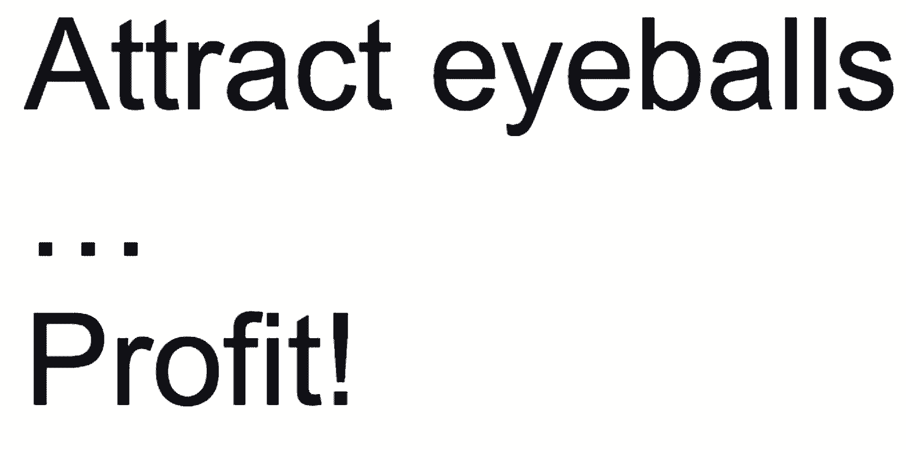
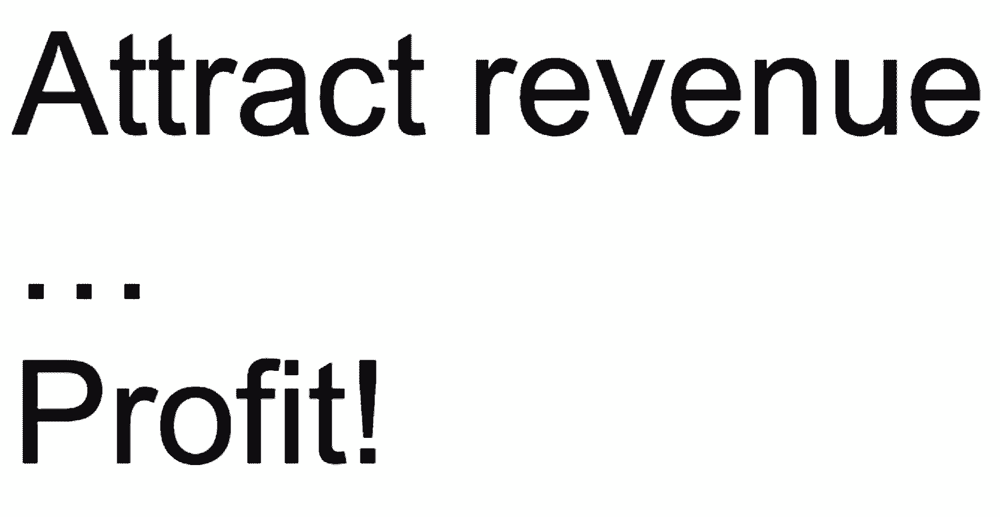
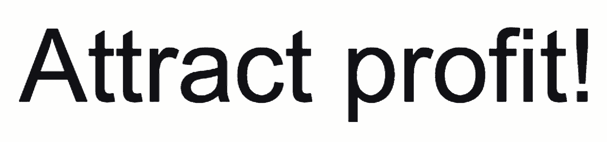
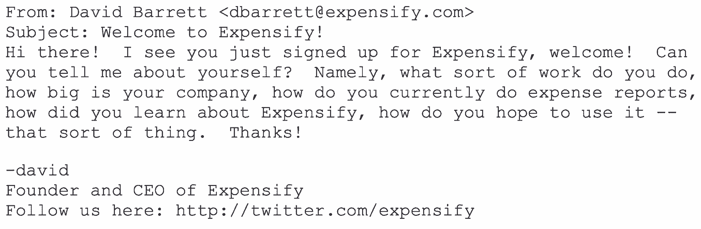

# Expensify 首席执行官谈在短短六个月内将其客户群翻倍的策略

> 原文：<https://review.firstround.com/expensifys-ceo-on-the-tactics-that-doubled-its-customer-base-in-just-six-months>

大卫·巴雷特从六岁开始编码，至今没有停止过。所以从某种程度上来说，他真的用了一生的时间来创建和领导 **[Expensify](https://www.expensify.com "null")** ，这是许多公司处理费用的默认服务。为了让你了解它的发展轨迹，[该公司是世界上同类软件中扩展最快的](http://www.prnewswire.com/news-releases/research-shows-expensify-is-the-fastest-growing-erp-software-in-the-world-based-on-2014-revenue-300089016.html "null")。2014 年，它的增长率超过 130%，比最接近的竞争对手高出近 60%。这家开支管理初创公司的增长速度超过了整体市场增长速度的 28 倍，现在它已经为 16，000 多家公司提供了帮助。

巴雷特的成功源于大胆地拥抱非传统。在 Expensify 之前，他是 Red Swoosh 的首席工程师，每年他都会将这家初创公司搬到一个新兴市场，进行为期一个月的休假。Akamai 收购了 Red Swoosh，并在不久后解雇了 Barrett，因为他公开反对其客户华纳音乐公司关于全球唱片公司赞助音乐税的言论。巴雷特和他唱歌剧的配偶一样善于表达，而且几乎总是选择人迹罕至的道路。他获取用户的方法没有什么不同。这是有回报的:仅在 2014 年下半年，Expensify 的客户数量就翻了一番。

在这次独家采访中，巴雷特破除了关于用户获取的五个神话，并分享了关于如何吸引和留住新客户的非典型真相。在这里，他提供了一种不同的——甚至是违反直觉的——方法，来说明创业公司如何实现更低的客户获取成本(CAC)，使用他们的数据，创造新的用户导向流，使新想法的来源多样化，以及量化营销支出。

**神话** : **你获得更好用户的途径取决于磨练你如何发现、购买或吸引潜在客户。**

**现实** : **成功实际上是通过将营销、销售和产品开发整合到一个单一功能中来实现更低的收购成本。**

Expensify 建立在客户获取效率是其最具战略差异化的信念之上。Barrett 说:“以获取客户为名，以与竞争对手相同的价格从相同的地方购买相同的线索，这种持续亏损的日子很快就要结束了。”。“我们所看到的大多数 SaaS 企业的市场‘修正’[特别惩罚了那些模式不盈利的企业](http://tomtunguz.com/the-correction-in-saas-company-valuations/ "null"),因为尽管大规模经常性收入的潜力没有改变，但通过大规模负投资回报率支出来实现这一点的策略正受到质疑。”

要完全理解 Barrett 的推理，需要仔细看看他是如何看待客户获取模式在过去二十年中的演变的。(他没有忘记他们与南方公园的[裤衩侏儒商业模式](https://en.wikipedia.org/wiki/Gnomes_(South_Park) "null")有多么相似。)

起初，目标是吸引眼球。“那是 90 年代末，”巴雷特说。“他们为什么访问你的网站，或者他们到那里后做了什么都不重要。”模型是:

没过多久，营销人员就知道这还不够。巴雷特说:“现在我们回过头来看，会嘲笑那是多么的愚蠢。”“显然眼球不赚钱。唯利是图。”到了 2000 年代末，这种模式转变为:

本质上，眼球被用来交换收入。“因此，正如我们在 90 年代末看到的公司有大量的流量记录但没有利润一样，我们今天看到的是 00 年代末的公司有大量的收入基础，但没有利润——也没有明显的途径来获得利润，”巴雷特说。“即使公司声称他们可以‘削减支出，随时盈利’，对我来说，这听起来就像瘾君子说他们可以在下一针后戒掉毒瘾。”

为了对比这两种流行的客户获取理念，Barrett 提出了第三种理念(Expensify 采用的简化策略):

对于 Barrett 来说，当代的客户获取应该更少地关注吸引外部因素(眼球、收入等)。)以及更多关于整合内部职能，即营销、销售和产品开发，到一个单一的权限。这完全在公司的控制之下，将有助于显著降低客户获取成本。巴雷特说:“大多数创业公司为个人使用的公司开发产品，而 Expensify 为个人开发的产品恰好在团队中工作得非常好。”。“这意味着我们有企业交易规模的消费者获取成本。这种策略与传统的自上而下的销售组织完全不兼容，只能由高度整合的营销/销售/工程组织来实施。”

“人们没有理解的是，这些职能并不是独立的组织。巴雷特说:“在一家运营良好、快速发展的公司里，每个人在做出每个决定时都会考虑所有这些方面。“我承认这不是一个奇特的计划，当然也不是一个普通的计划，”巴雷特说。“但随着 2010 年的继续，它变得越来越时尚。"

做什么:不要认为你的工程师不会营销，或者你的销售团队不会产品管理。“这些东西都不是火箭科学，没有人需要成为每件事的专家，”巴雷特说。“让有激情、有创造力的人加入进来，营造一个鼓励疯狂想法的环境，尽可能不碍事。当然，结果可能会有点奇怪，但奇怪是好事。奇怪是你的优势。如果你没有一点古怪，你就完了。”

你不需要把你的管理团队和上个十年战略的 VP 们堆在一起。积极主动、多才多艺的员工，不要碍事。

**误区:专注于提取和推断所有你能找到的数据，以指导和衡量用户获取策略。**

现实:不要等待数据，也不要假装你拥有的一点点数据比它本身更有意义。对让你兴奋的数据进行实验并果断行动。

当谈到公司如何负责任地、系统地测试新的用户获取策略时，巴雷特对 Expensify 的数据采取了不同的策略。“老实说，我们就是不知道，你可能也不应该知道，”他说。“归根结底，数据永远不会在您最需要的时候出现。在最好的情况下，数据可以帮助你做出非常小的、增量的决策。但如果你是一家初创公司，你会专注于大范围的波动，而数据在其中没有一席之地。”

在大多数早期创业公司，数据面临的困境是，你的数据不太可能具有统计相关性。“你没有足够多的用户来得出任何有意义的结论，即使你有，这些用户也不一定代表你的长期目标受众。你当然有数据。但还不足以做出真正的、由数据驱动的决策，假装不是这样只会招致灾难。”

对于巴雷特来说，初创公司对数据的痴迷本质上是保护性的，而不是主动的。“大多数人喜欢数据，因为它是终极的 CYA 工具:没有人会因为在行动前等待更多数据而被解雇，”Barrett 说。“但当你有足够的数据来完全支持你的决定时，已经太晚了:你已经行动得太慢了，更有勇气的人已经抓住了机会，现在一切都结束了。”

在实践中，最好的营销机会突然出现，出乎意料，而且没有任何重来的机会。降级数据并获得勇气。

以 Expensify 的 Concur 集成为例。“我们只打算发射一次。“Concur 只会被收购一次，”巴雷特说。“根本没有办法获得数据，以确定通过疯狂的整合来利用它是否是对我们周末的最佳利用，即使是这样，也没有时间获得数据。一旦完成，就没有 A/B 测试多个消息。我们只有一次机会来利用这个机会并处理后果。另一种选择是我们通过了，并一直在想。”

一旦完成，无论发生什么，都会发生。“它要么去执行——男孩，它曾经！“或者不是，但不管怎样，花费大量时间将结果量化到 n 级是没有意义的，因为没有确切的重复场景，因此这些数据没有实际应用，”巴雷特说。

**怎么办**:不要等数据。不要假装你仅有的一点点数据比它本身更有意义。不要为了做一个漂亮的图表而浪费时间去分析它。当你转到下一张幻灯片时，观众会忘记它，但是制作它所花费的时间却永远失去了。巴雷特说:“只要保持开放的心态，考虑所有的机会，对那些让你兴奋的机会采取果断行动，然后继续前进。”

每一个决定都不需要惊艳。你只需要比你的竞争对手稍微快一点，做出稍微好一点的决定。剩下的会自己解决。

神话:当涉及到新的面向用户的流程时，只使用简洁有力的语言，突出行动号召。

现实:清晰、直接的语言很有帮助，但不是灵丹妙药。真实性和相关性是三维变量，因此时间安排和响应工作流程最为关键。

当谈到新用户入职或定向时，每个人都会告诉你一长串营销沟通的最佳实践:交付好的设计。使用简洁有力的语言。做一个突出的行动号召，最好是以一个简单的链接点击的形式。将调查放在另一端，使结果标准化，使数据更清晰、更有价值。

**Expensify 设计了不同的欢迎定向流。Barrett 说:“我可以说，我们在新用户欢迎体验方面做得最好的事情是偶然发生的。“作为背景，我们总是‘推出我们自己的’电子邮件营销工具。这些现成的工具很炫，对于任何非工程师来说都是一个很好的开始方式。但作为一名工程师，我不禁觉得它们很昂贵，有局限性，而且似乎只是简化了活动中容易的部分，而让困难的部分变得不可能。”**

因此 Expensify 创建了自己的内部工具 Harpoon。“这是一个丰富的系统，允许公司对个人用户和用户活动推断的隐含分组进行深入的实时检查——这是任何现成系统都无法想象的事情，”巴雷特说。“但在一开始，它就像现在这样简单:每小时，它都会给过去一小时内注册的所有人发电子邮件。它只能发送纯文本，而且只能从我的个人邮箱发送。”

因此，没有给新客户带来令人印象深刻的设计和灵感语言。相反，新 Expensify 用户收到的电子邮件看起来像是:

Barrett 的推广和复制基本上违背了所有推荐的最佳实践。它使用了一个单一的，杂乱无章的连续句子，一个非常模糊的行动号召，并且没有链接可以点击。“但与所有的理由相反，这是令人难以置信的成功，”巴雷特说。“一封‘好’的撤回邮件会产生 1-5%的回复率，而这个模板却能在 12%的时间里得到回复。”

以下是巴雷特认为它有效的原因:

**计时**。用户完成第一次会话后，电子邮件会立即到达，看起来很可能是 CEO 直接发给新用户的真实电子邮件。“因为它每小时向过去一小时注册的每个人发送一次，这意味着它平均在用户注册后 30 分钟到达——足够长的时间让产品尝试一下，但不会长到忘记它，”巴雷特说。“这意味着当用户有她真正想分享的想法时，它就会出现，但不会多到她真的会查找一个地址来发送它。但如果公司创始人在她最想聊天的时候，直接从他的个人地址给她写信……砰，我们就成功了。”

**暂停怀疑**。当然，创始人不太可能真的在那个时候给用户发邮件。但在这种情况下，有足够的证据证明它是真实的，使它足够可信，人们可以认为它是可能的。巴雷特解释了新用户的潜在思维过程:“好的。注册 30 分钟后并不是*，但也不是整点。它足够随机，可能来自一个真人。它来自一个真实的电子邮件地址，用真实人类的随意语言写的。它不是让我填写一份非人性化的调查或点击一个明显的营销链接。这是一个真诚的求助。”*

**重申回应。并不是所有的事情都与第一条信息有关，而是如何以及何时回复。“大多数新用户的回复都是这样开头的，‘所以这可能是自动发送的，可能会被一些营销实习生看到，但只是以防万一……’”Barrett 说。“但是，当公司真正及时地做出回应，当公司的创始人和首席执行官真正阅读他们的电子邮件并感谢他们的时间时，你就不仅仅是获得了一个终身客户，而是一个福音传播者。”**

**该做什么**:尝试一个类似的简单模板，并注意围绕它建立的流程。Expensify 通过这样做获得了非常有用的输入。“这些回答不是一些简洁的广告词，为我想问的任何问题提供单一的数据点。巴雷特说:“他们一页一页地回答了许多更重要的问题，而我甚至不知道如何提问。”。“毫不夸张地说，这封邮件决定了 Expensify 的成败。不要误解我的意思:有很多事情需要走上正轨，这只是其中之一。但如果我没有这么做，我想我不会学得足够快来做些什么。”

创业初期非常非常辛苦。唯一比你收到的切实建议更有价值的是一个简单的提醒:有真正的用户对你所做的事情真正感到兴奋。有些日子，如果不是这样，我会干脆放弃。

**误区:创造力在用户获取和保留中的作用掌握在营销和销售手中，这些人最接近最终用户和数据。**

**现实:用户获取中的创造力是许多新的、小的想法的组合。它来自整个组织的各个角落。**

创造力在获取和留住用户方面的作用不仅仅局限于销售和市场营销，而是贯穿于整个组织的各个职能部门。巴雷特引用了艾萨克·阿西莫夫的一篇以前未被发现的文章:“人们如何获得新的想法？他说:“本质上，一个产生新想法的环境是一个鼓励小群体探索潜在荒谬而不担心羞耻或尴尬的环境。”。"这种环境自然会吸引一些人，尽管它最令人反感."

巴雷特也对“创造力”这个词的用法有异议。巴雷特说:“像阿西莫夫一样，让我们代之以‘新思想’，而不是模糊的、通用的‘创造力’，我觉得这太经常是通过震惊和炫耀假装出来的。”。“在我看来，公司里有‘创意人员’是很愚蠢的，因为新想法是每个人的责任。一个好的环境应该有意识地从每个人那里提取最棒的想法，而不考虑来源。如果有的话，它应该偏向于来自更不寻常的来源的想法。”

这就是为什么培育新思想的栖息地如此困难的原因。Barrett 说:“其他人都使用典型的企业销售组织，在这种组织中，销售人员受到财务激励而做出过多承诺，甚至冒着交付不足的风险。”。“这意味着总会有一个产品管理团队试图弄清楚实际上承诺了什么，然后一个工程团队争先恐后地兑现这些承诺。”

每个人都坚持传统销售模式的原因很简单。“每个人都有一份工作，你需要一个最基本的环境来完成这项工作。这意味着雇佣员工更容易，培训他们更容易，评估他们的表现更容易，如果他们表现不佳，解雇他们的破坏性更小。一切都整齐划一，集中管理。”

认识到组织的简单性是如何付出代价的非常重要。“你会不由自主地以这种方式制造出一些 sh*tty 产品。巴雷特说:“这是因为公司里几乎每个人都在专注于制造一种产品，然后卖给决策者，而决策者自己很可能永远不会真正使用这种产品，因此也不在乎它的效果如何。”。

**该做什么:**想办法从组织的各个角落，尤其是职能重叠的地方，收集新的想法。目标是让你的整个公司专注于构建最终用户使用的产品。对于 Expensify 来说，这种思维转变实际上重新调整了公司的各个方面，从销售薪酬战略到产品管理结构(他们没有产品管理结构)，到项目管理(没有截止日期)，再到营销(其品牌面向员工，而不是高管)。

一个创业公司就是一个巨大的新创意。顾名思义，“专家”认为初创企业的基本原则是荒谬的。如果他们没有，他们早就动手了。

**误区:营销可以量化，归因于用户获取努力。**

**现实:不要相信炒作。这些努力奏效了，但是没有人能确切地说哪一个杠杆产生了影响——以及影响到了什么程度。**

在试图更有效地吸引和留住新用户时，销售和营销努力肯定会失策。当心音盲邮件或过于频繁的外联活动。根据巴雷特的说法，Expensify 犯的最大错误是相信营销可以量化，尽管所有证据都清楚地表明相反的情况。

“当我们筹集种子资金时，我们的想法非常简单:我们要筹集资金，花在广告上，优化直到 CAC 低于 LTV，冲洗，重复，盈利，”Barrett 说。“每个人都表现得好像事情就是这样——没有人质疑我们在这方面的假设。即使在今天，似乎每个人都是这样做的。”

但是不可告人的秘密是，对任何公司来说都不是这样。初创公司、现有公司，应有尽有。“没有人把公式确定下来。用“你的收入中有多少可以直接归因于你的付费收购活动？”这样的问题来了解任何成功公司的表面你通常会得到 25%到 0%的答案，也就是通常所说的“我不知道”。”巴雷特说当然，也有例外。一小队 CAC 保卫者将快步走出。但是名单很短，而且没有一个是昂贵。"

巴雷特所指的是付费获取的有效性和相关性之间的区别。“需要说明的是，这并不是说有偿收购不起作用。巴雷特说:“它能做到，也确实做到了——尽管很少像人们想象的那样好。”。“事实上，这很难归因于:很少有企业真正了解他们的 CAC，因此几乎没有人知道他们营销支出的实际 ROI，尽管几乎每个人都声称不是这样。尤其是有投资者在的时候。”

Expensify 可以避免很多不必要的成本:从财务支出到团队士气。“我现在更清楚了，”巴雷特说。“当时，我们盲目地尝试了所有大家都说应该有效的东西:广告词、广告牌、社交、内容等等。我们对此压力很大。我们以为每个人都知道，我们只是白痴。我与我们早期的营销人员进行了一些非常困难的对话，基本上让他们遵守我现在知道是不可能客观的标准。”

**该做什么**:坚持并拒绝过度投资明显无效的营销支出。给自己时间去犯错并从错误中学习。虽然这听起来很明显，但不要忘记，绝大多数初创公司都是在遗忘中犯下了这个错误，而他们周围的所有人都在为他们欢呼。

# 外卖

当谈到用户获取时，有很多先入之见被伪装成最佳实践。事实上，初创公司应该挑战这些标准，尝试一些巴雷特更具原创性的方法来赢得和留住客户。通过将营销、销售和产品开发整合到一个单一的功能中来降低采购成本。不要让缺乏数据成为你的借口；对让你兴奋的数据进行实验并果断行动。获取用户可能是你的权限，但创造性的解决方案存放在整个组织中——我为他们准备的。最后，避免过度投资或试图量化你的营销努力的影响。

“持久的挑战是面对业内最聪明的名字的怀疑时保持信念。巴雷特说:“根据今天的统计，已经有许多针对企业初创公司的著名风险投资交易，这意味着每个投资者都对如何获得用户有自己的看法。“在一个被‘快速、付费、收入线性增长’的同行占据的世界里，我们开始建立一个‘缓慢、有机、收入指数增长’的业务。只要有毅力和耐心坚持到底，指数公司最终总是会赢。这就是为什么我们“缓慢”的非典型模式大大超过了那些更快的同行。”