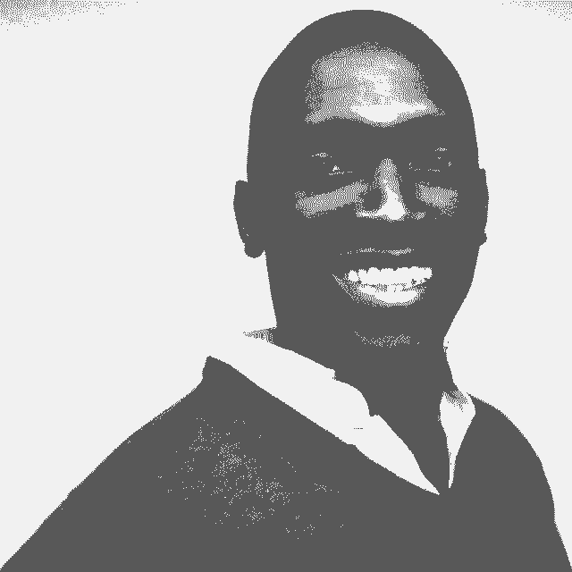

# 寻找创业想法并在严格监管的空间中进行建设 Cash App 和 Carbon Health 的经验教训

> 原文：<https://review.firstround.com/finding-startup-ideas-and-building-in-heavily-regulated-spaces-lessons-from-cash-app-and-carbon-health>

这篇文章是对 Ayo Omojola 在我们的新播客“深入”中的主要观点的编辑总结如果你还没有听过我们的节目，一定要看看这里的*。*

在 Square， [Ayo Omojola](https://www.linkedin.com/in/omojola/ "null") 从[Brian grassa donia](https://www.linkedin.com/in/brianpg/ "null")(Cash App 的联合创始人)那里学到了一句话，从那以后，这句话就一直伴随着他:在一个问题上“不合理地深入”。鉴于我们刚刚推出了一个名为“[深度](https://review.firstround.com/podcast "null")的新播客，当 Omojola 来到我们的虚拟录音室时，我们认为这是一个很好的话题。

Omojola 是我们的深海潜水向导，我们就如何将这一框架应用于寻找创业想法的问题选择阶段和塑造新生产品的艺术进行了丰富的对话。Omojola 在这两个领域都为自己开辟了一个利基市场，尤其是在监管严格的领域。

目前，他是 **[Carbon Health](https://carbonhealth.com/ "null")** 的产品副总裁，负责解决医疗保健可及性的挑战，如新冠肺炎测试。在此之前，他是 Square 现金应用银行团队的创始产品经理，在那里他共同创建了广受欢迎的[现金卡](https://cash.app/help/us/en-us/1108-cash-card "null")，并帮助建设了 Square 的技术银行基础设施。为了完善他的创业专业知识，他还是一家 YC 支持的创业公司的前创始人，也是一位活跃的天使投资人，这让他有一个独特的视角来发现和评估创业想法。无论是解开几十年来的政策决定之网，还是花无数时间在工厂学习信用卡制造的细节，奥莫霍拉都有很多经验可以利用——以及一路上学到的一堆来之不易的经验。

在这次独家采访中，Omojola 分享了一些最重要的知识，即如何才能打造一款消除噪音的产品——比如创造一张出人意料地在 Twitter 上传播开来的信用卡。我们将他堆积如山的专业知识提炼为四课，分别是寻找创业想法、问题选择和在构建产品时不合理地深入的艺术——如果你有一天想开一家公司，或者希望帮助一个新产品成型，所有这些都会让你拿出笔记本。即使这不符合你的职业目标，仍然有很多智慧可以借鉴，包括如何更好地招聘和管理有能力更深入和更快发展的人。

# 第一课:在开始打磨之前，仔细选择要打磨的东西。

为了启动产品构思过程，Omojola 借用了一个经常被重复的房地产格言:位置，位置，位置。“在我的一生中，我一直是一个有想法的人。我有一个坚持了 15 年的运行日志，记录了我的不同想法。我会说我可能已经执行了其中的 1-2%。或许事实是，它们中的大多数在某种程度上都是坏的，”他说。

当谈到一个新想法时，确定或者尽可能确定你正在回答的问题值得一开始就问是非常重要的。

这是他从艰难的道路上学到的一课——多年来，他一直在为一个毫无进展的想法挑灯夜战。“当我回想起我的上一家公司时，我是与我的兄弟和一个朋友共同创办的。我们挑选了一个我们认为在技术上非常有趣的问题来解决。他说:“我们辛苦工作了很多年，但这并不重要。“我从中得到的教训是,**我们在实际工作中投入了这么多精力，而在选择** ***什么*******上投入的精力却远远不够。这对我们的结果是一个更大的决定因素——我们没有选择一个足够大的市场。如果你选择了一个充满机遇的大领域，你的努力程度当然很重要，但你也会获得更多优势。****

****Omojola 认为，首先要忘记我们在学生时代学到的一些东西。“我们长大后被教导的是，我们的结果 100%与我们的努力相关。如果我为一次考试努力学习或者努力做一个项目，我会比不努力得到更好的成绩。所以我一直认为，当事情不顺利的时候，我只需要更加努力。它已经根深蒂固地存在于许多习惯中，我现在非常努力地试图让自己摆脱这种观念，因为这并不是对世界运行方式的准确看法，”他说。****

****选择一个重要的问题，即使你的工作很一般，一般也会比选择一个可怕的问题产生更好的结果，即使你的工作很优秀。****

****“无论你有多优秀，无论你有多努力，你都无法像自然力量一样强大。如果经济或环境中的这些更大的力量发挥作用，而你正在做的事情与这些不一致，你很可能会被击败。“你必须留意世界上正在发生的事情，以及这些事情如何影响你想要实现的目标，”Omojola 说。****

****为了找到既适合创新又值得解决的问题，Omojola 依靠这一理论。“我有一个假设，业内领先产品的年龄，或者业内增长最快的产品的年龄，是一个强有力的指标。产品越老，机会就越多，”他说。“航空航天人员和自然资源人员正在解决的问题类型是硬科学问题。但在金融服务等领域，你所做的很多事情都是商业模式创新。一般来说，你的优势很少会成为科学突破，所以你可以深入的领域是监管领域。”****

****那么，你如何找到这些关键的见解呢？就像用金属探测器搜索广阔的海滩一样，这不是一门完美的科学。你可以缩小宝藏可能埋藏的大致范围，但在某个时候，你必须开始挖掘。****

****“我现在有足够的经验，可以看到一些程序性的东西，并知道，‘嘿，这里有一个死胡同，不要去那里。’我可以确定一些广泛的兴趣领域。“我可能会从整体着眼，缩小到 40%左右，剔除那些我认为不值得花更多时间的领域，不管我有什么目标，”Omojola 说。****

****这是一种平衡。你可以深入许多事情，真正的艺术是选择深入什么。你的时间是有限的，你必须考虑好你把时间花在哪里。****

****“总会有一些尝试和错误。你走一条路，那是条死路。你必须停下来改变高度，然后走另一条路线。这都是过程的一部分，”他说。****

# ****第二课:找到容易停下来的机会——然后继续前进。****

****对于 Omojola 来说，不合理地深入监管行业让他从信用卡工厂转向辩论德宾修正案(TL；DR:它和 Square 的法律团队一起削减了顾客刷借记卡时商店支付给银行的费用。一路走来，他总结出了一条经验法则:“**重要的是，不要害怕去探索任何必要的深度，以获得你真正理解的答案。******

****永远寻找那些容易停下来的机会，那些变得乏味的机会。这通常是一个信号，表明某人或一群人以前没有深入过。****

****当你遇到一个问题和一个停滞不前的市场时，你给了自己一个巨大的开端——但这并不容易。“当你在监管复杂的领域工作时，一般来说，一旦你建立了滩头阵地，进入壁垒就会更高。这种复杂性是人们不愿意尝试的一个原因，”Omojola 说。“多年来，Cash App 的核心优势是，在美国很长一段时间里，如果你想立即将资金从 A 银行转移到 B 银行，Cash App 实际上是你唯一可以做到的方式。他表示:“其他选择要么是付费使用电汇，要么是使用 ACH，ACH 是免费的，但会缓慢地转移资金。****

****“这种洞察力来自于相当多的想象力和一个团队，他们花了数年时间在 Square 上碰壁，与卡网络合作，并意识到有一种未被利用的即时资金流动机制。他说:“碰巧没有人这样使用它，因为把它整合在一起是一件很困难的事情。”****

****但即使你没有像 Cash App 这样的全新创新，也有很多其他途径可以利用，从而脱颖而出。“专注于你能提供的效用。你怎么能做出比现有技术更有用的东西，这样它就能穿过杂乱无章，让你想为之制作的人真正注意到你？”奥莫霍拉说。****

****

Ayo Omojola, VP of Product at Carbon Health**** 

****虽然 Cash App 通过免费的即时资金流动挖掘出了一棵摇钱树，但 Omojola 的现金卡团队的任务是为另一个不太新颖的产品线——借记卡——注入活力，并发现了一个玩无形资产的机会。“当我们第一次开发现金卡时，市场上的技术水平在任何方面都没有给人留下深刻的印象。实体牌已经很久没人玩了。这就留下了一个机会——没人关心或认为美学吸引力会有影响，”他说。“当然，让东西便宜 10 倍是有吸引力的。但我认为，有时候拥有一些漂亮、酷或者感觉良好的东西确实会有所不同。”****

****但它不只是为了看起来酷而创造一些东西——美学是围绕目标客户和现金卡能为该群体解决什么问题。“我们追求的是没有银行账户和银行服务不足的人群。对他们来说，最好的产品是我称之为负面状态信号的产品。想象一下，如果你和朋友出去，你随便拿出一张在 CVS 买的预付卡。Omojola 说:“有一种感觉与此相关，这种感觉是一个人抽出 Chase Sapphire 卡时所没有的。****

****“我们的根本目标是创造一种个性化的实体卡片，人们可以自豪地从钱包中拿出来展示给朋友看。他说:“我们想把客户的品牌放在第一位，作为现成预付卡的替代品，因为品牌已经在预付卡上贴满了他们的标志。”。但在遵循不合理的深度框架时，这并不像启动 Photoshop 和制作一些线框那么简单。****

## ****预测未来收益率？该踩油门了。****

****“我们花费了大量的时间和精力来优化卡片的外观。我和产品的首席设计师一起在工厂呆了大概几个星期，”Omojola 说。“你认为一堆信用卡和借记卡看起来都差不多，形状也一样。但是在幕后，有一整个行业的人都在制造卡片。有一次，我们尝试了 200 种不同的厚度、功率设置等组合，以达到我们最终发货的目的。”****

****该团队不满足于简单地走别人以前走过的路——并最终到达同一个目的地。“最简单的方法就是给某人发一封电子邮件，说，‘把卡片做成这样。’最难的事情是真正理解所有的开关。在很多情况下，你看着那些开关，你会想，'我不是这方面的专家，我不知道。'“但对奥莫霍拉来说，这正是你需要深入研究的地方。****

****不接受现状的顽强坚持获得了巨大的回报。“我们最终推出了一款现金卡产品，成千上万的人兴奋地在推特上分享这个产品。他说:“这些是免费的展示，我们不必为推动病毒式增长而付费。****

## ****质疑一切——寻找没有“为什么”的“不”****

****Omojola 一次又一次地看到人们因为问了正确的问题而陷入困境——但却没有对答案给予足够的关注。“把别人告诉你的事情当成事实更容易。但是在很多情况下，你被告知的事情只是一系列的解释。告诉你的人只是从告诉他们的人那里得到的，但已经很久没有人真正质疑这些假设了，”他说。****

****当你在考虑一个带有沉重监管成分的问题时，你必须愿意质疑一切。****

****Omojola 建议你在结交几个关键盟友之前，先建立自己的专业知识——尤其是如果你是新手的话。“你必须愿意从监管的角度阅读这个话题的所有内容，并建立一个视角。然后，我会在法律界找到一个人或一个团体，站在你的立场来讨论这个问题。嘿，我是这样看这些东西的。以下是他们可能的结局。“你觉得怎么样，”他说，我实际上试图尽可能早地这样做，因为法律界可以给你提供捷径——“你问的问题实际上已经在这里解决了，去这里看看这个东西。”。****

****留意这条线索，你正朝着正确的方向前进。“我在 Cash App 和 Carbon Health 上见过几次的一种模式是，你会找到一个你想去的地方，然后**你问，‘嘿，我们能在这里做点别的吗？’而** **人告诉你没有，却不能告诉你为什么**。“或者他们给你的原因是如此含糊不清，”奥莫霍拉说。可能有 50%的时候你会得到一个模棱两可的答案，因为你问问题的方式不对。但另一半是因为那东西变了。还有其他方法可以解决这个问题，但是和你一起工作的人不一定遇到过，或者他们甚至不知道这个解决方案的存在。"****

****简而言之:技术发展比政府快得多。“在 Cash App 的早期，我能想到一些讨论，我们的法律团队坐在一个房间里，一些监管指南在投影仪上放大。我们只是在阅读并意识到，很多这样的内容是在今天可用的技术变得可用之前几年写的，”他说。“你离法规制定的时间越远，它们看起来就越模糊，因为很多时候，当时可用的东西真的变了。”****

# ****第三课:语境为王。****

****不合理的深入有时会让人感到孤立。但是，当你没有抽出时间在团队中分享你的学习和背景时，你在独自完成任务的感觉就会加剧。“许多领导者陷入了一个陷阱，认为人们和你有着相同的背景。我现在认为这种情况很少发生——事实上，这种情况更多时候不是真的，而是真的。Omojola 说:“大多数时候，人们的背景[与你的背景](https://firstround.com/review/advice-is-cheap-context-is-priceless/ "null")非常不同，他们对目标的看法不一定与你一致。****

****但是随着日历排满一周，留出这一关键的时间来达成一致通常会落在待办事项列表的底部。相反，[时间紧迫的领导人](https://firstround.com/review/the-founders-guide-to-discipline-lessons-from-fronts-mathilde-collin/ "null")回复到大声发出行军命令。“如果你很忙，说‘嘿，做这个任务吧’会容易得多。”但重要的是，在整个过程中的某个阶段——可能更早，而不是更晚——分享完整的画面。他说:“这是我们正在努力做的，这是我们有明确定义的领域，这是比较模糊的领域。”。****

****与你信任的人分享尽可能多的背景信息来完成某事就像一个超级大国。这就像把你的大脑下载到他们的大脑里。****

****但是当提到“上下文”这个词时，它可以有许多不同的意思，并且有大量的空白。Omojola 在陷害他的团队？“我发现向他们描述问题更好。基本上就是说，‘这是我们想要改变的事情。这里有一些我们想要围绕它的约束:我们不想在它上面花费 X 数量的时间。它必须高于或低于这个成本阈值。或者不能破坏其他东西，”他说。****

****但是就像增强肺活量以便深入研究一个问题一样，随着时间的推移，奥莫霍拉学会了如何成为一个更好的合作者而不是教官。“我总是解决问题。很多时候，至少对我来说，我的本能是去问某人要一个应该如何工作的想法。他说:“当你试图分发背景和叙述时，我认为让人们能够[为自己想出一个解决方案，然后进行辩论](https://firstround.com/review/6-counterintuitive-rules-for-being-a-better-manager-advice-from-lambda-school-quip-and-facebook/ "null")，这真的很重要。****

****你可能会在前期节省时间，而不是花时间围绕你试图实现的目标来设定背景，但当你在翻译中迷失方向时，你将不止是增加时间。****

## ****创造跨职能的魔力。****

****除了管理你的直属团队，跨职能项目还需要一种特殊的炼金术，比如创建一种新的预付费借记卡或建立移动新冠肺炎检测诊所。“经常会有需要多个专业的人参与的项目，特别是当你在一个更大的组织中工作时，你会有更多的人参与进来。一般来说，当这些事情发生时，你需要的财务团队、会计或安全部门的人并不完全是空白。他们有事情要做，通常也会很忙。因此，让他们优先考虑你正在做的事情可能会很复杂，尤其是如果你和他们没有私人关系，或者如果项目对他们来说不是至关重要的，”Omojola 说。****

****当您在一个时间表不一致的分布式团队中工作时，甚至会出现更多的问题。“如果你和东海岸的人一起工作，当你们都有空的时候，你一天只有大约四个小时的工作时间。他说:“如果你在西海岸的下午 2 点前没有解决问题，那么你会一直被困到明天。”。****

****“现在，您已经在他们执行和被阻止以及等待您的反馈或其他上下文之间添加了这一层。随着时间的推移，这种情况会越来越严重。Omojola 说:**尽早分享尽可能多的环境意味着你会减少那些停滞不前的互动。******

****为了让你的团队发挥出最佳水平，你必须敏锐地意识到最常见的雷区——比如缺乏跟进，或者一开始就没有让合适的人进入房间。“管理这些大型跨职能团队项目是一门艺术。我从领导 Cash App 战略开发工作的 Emily Chiu 那里学到了很多关于如何运行一个真正高效、无缝的流程。她会构建一个网格，并勾勒出‘这些是让这件事成真所需要发生的事情。这是我们努力实现的目标。“然后，她会让参与者插话，给他们机会，让他们说出一些还没有考虑到的事情，”他说。此外，很多时候，在房间里为一个部门说话的人并不是真正要做工作的人。你必须想出一个让他们授权或汇报他们如何管理所有后续工作的流程。"****

****永远不要低估时间表的力量——以及一点点公共责任——来推动事情向前发展。“你必须说，‘嘿，你在这条时间线上，你在这条时间线上的原因是这些其他事情依赖于你。’在检查会议上，让每个人都意识到，“你的事情不能开始的原因是因为另一件事情还没有完成。我们如何做到这一点？Omojola 说:“这种时间表的社会压力可以创造奇迹。****

# ****第四课:雇佣和管理的目标是让自己变得过时。****

****当你不合理地深入调查以前未开发的机会时，你需要一个难以置信的团队来依靠。“我非常喜欢雇佣在各方面都比我优秀的人。我想创造一种环境，让与我一起工作的人尽最大努力工作，而我让他们自己去做，”Omojola 说。****

****我一直对我在 Carbon Health 的团队说:我想让自己过时。****

****在 Cash App 的超大规模扩张中，Omojla 时间紧张，看着曾经重要的任务在他的待办事项列表中越来越靠后。“我的第一反应是相信自己效率低下，因为我变得超级忙，一堆事情都没做完。我觉得我必须提高效率，于是我开始尝试所有这些提高效率的方法。”****

****但是这个问题比电子邮件快捷方式所能解决的更复杂。“回过头来看，正确的答案应该是尽早在任何地方更换自己，”Omojola 说。****

****“我是人，确实有一些不安全感。但我认为这样做是正确的，而且组织也因此受益。你给超级聪明的人创造的环境越多，即使没有你，这个组织也能运行和执行得越好。现在，你有多余的能力去思考那些可能没有得到关注的杠杆领域，”他说。****

## ****为什么你应该雇佣前创始人****

****很多人说他们希望 T6 雇佣比他们更聪明的人，但是很少有人真的这么做。Omojola 依靠一个他认为不为人知的招聘秘密来实现这一愿景。****

****“从 YC 出来，作为一名前创始人，我有很多朋友都是初创企业的创始人。我一次又一次地注意到，你开了一家公司，筹集了一大笔钱——也许这个想法行得通，你有一个很好的退出机会，也许行不通，你就关门大吉了。但不管怎样，你已经花了很多年专注于一件事，你拥有难以置信的技能，但对于一个特定的角色来说，这些技能更难装进一个桶里，”他说。****

****他注意到一种模式，即这些人在某种程度上被视为风险较高的雇员，而不是久经考验的领导者。“我的这些朋友都是不可思议的创始人，他们会去脸书、谷歌、亚马逊等公司面试。总是被踢出去。我对这个问题的看法是，许多公司都在寻找一个非常特殊的形象。他们可能会说一大堆其他东西，但他们真正想要的是曾在谷歌担任过项目经理的人。****

****在人才大战中，他知道自己不能错过这个相对未开发的资源。“我尝试做的一件事是寻找从上一家公司转型的创始人，并弄清楚下一步该做什么，”他说。“寻找转型中的创始人的好处在于，你不必担心他们是否能成功。你有可用的证据和他们工作的公共物品，你可以独立地尝试。”****

****我认为那些没有大规模退出的创业者真的被就业市场低估了。****

****但是，不仅仅是公司害怕雇佣前创始人——创始人可能会怀疑加入一家他们没有掌控权的公司。“这些转型中的创始人在寻找一个使命，就像我一样，他们肩上有一个芯片，他们想要建立一些新的东西。他说:“我完全理解他们会对一些想法产生兴趣，我想支持这一点。****

****Omojola 在面试过程的早期就设定了期望，一旦被录用，就会给这位前创始人留下施展魔法的空间。“我会提前说明我招聘的目的，以及我们希望为这个职位做些什么，但我也会努力创造一个让他们拥有最大创造力和灵活性的环境。我只要求他们对我透明，告诉我他们是如何以及何时考虑下一步的，”他说。****

****当谈到采访前创始人时，他建议你不要把谈话的重点放在他们创造的有形的东西上，而是开始挖掘 T2 的原因。“从外部观察一个产品并对其构造做出一系列假设是非常容易的。他说:“我一直都是这样做的。“但是，您使用的大多数产品都是权衡、架构决策等的结果，这些产品可能相对复杂，而且已经过时。我喜欢引导关于他们为什么做出这样的选择的对话，这样我就可以了解他们的思维过程。”****

****对于寻求深入未开发深度的领导者来说，Omojola 的口头禅是让不可思议的人加入团队，在构建背景和叙事方面做得非常出色，然后离开。你们可以一起绘制航行路线。****