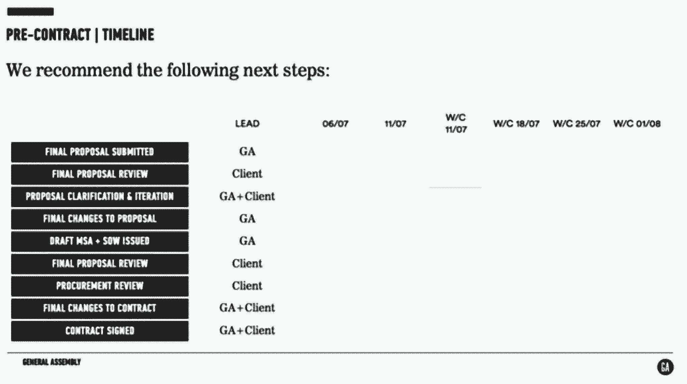
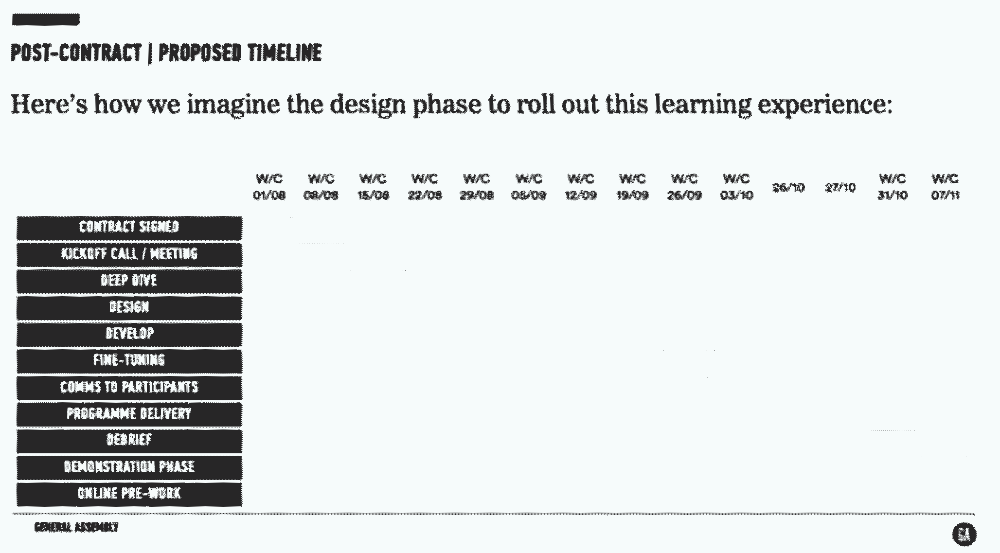
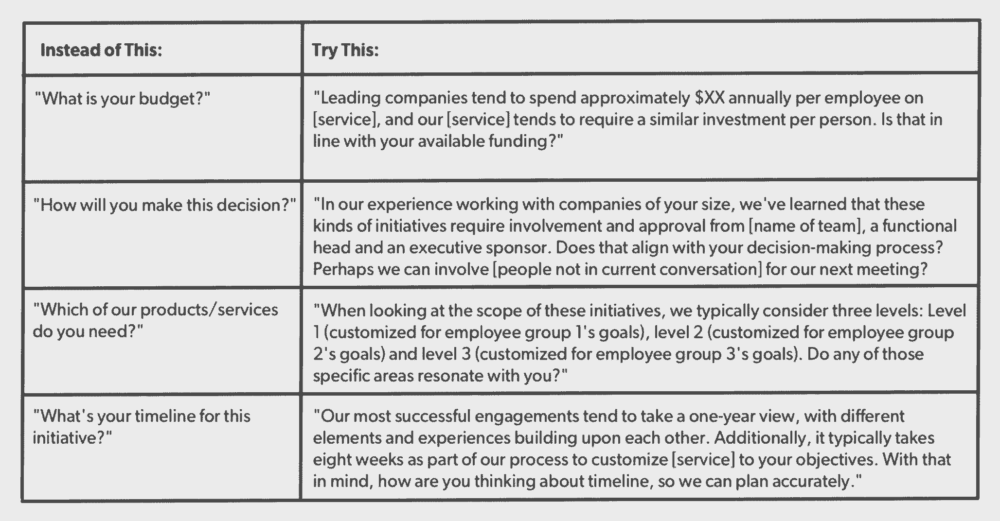

# 第一轮评审的 6 个必读内容，以召开快速、高效的会议

> 原文：<https://review.firstround.com/first-round-reviews-6-must-reads-to-run-fast-efficient-meetings>

一般来说，我们会根据与创始人的谈话来决定评估的内容——在倾听会上，在我们内部的首轮网络上，在会议上，以及在办公室周围。当他们谈论他们对建议的需求时，有几个反复出现的主题，但一个大的主题大致是这样的:**会议是我们生存的祸根。我们怎样才能做得更好？**

会议让事情变得缓慢。他们很快就会失去注意力。它们重复出现在日历上，单调乏味，没有必要的规律性——激发恐惧，削弱每个人的能量。这是因为人们觉得他们需要它们。大多数时候他们不会(对此我们有一些建议)。但有时确实如此。董事会议、全体会议和一对一会议是不可避免的(事实上，你真的不应该这么做)。**你能改变的是你如何经营它们。**

我们在这里说服并向您保证，所有这些会议都旨在增加动力、推动变革、增强透明度并保持一致。为了做到这一点，我们从我们采访过的一些最聪明、最有洞察力的领导者那里获得了最佳实践来分享，从**迈克尔·洛普**(Slack 的工程副总裁)到**金·斯科特**(激进坦率[现象的创造者)。所以继续读下去，开始主持今天不会很糟糕的会议吧。](http://firstround.com/review/radical-candor-the-surprising-secret-to-being-a-good-boss/ "null")

# 1.清理掉你不需要的会议——拥抱更加动态的时间表的短暂性。

**[Peter Deng](https://www.linkedin.com/in/peterxdeng/ "null")** 曾领导过许多著名的产品团队——以前在 Instagram，现在是优步 Rider 的负责人。他对会议有一套非常特别的方法:**有时候你必须把他们都赶走。**

过多过程的最有害和最普遍的表现之一是重复的会议。该怎么办呢？邓说，把它们全部取消。这并不一定意味着永远取消它们。那是不现实的。但是你确实需要不时地重新设置一下，这样你就可以批判性地看看什么是必要的，什么是不必要的。一旦你剥离了这些东西，你会更加清楚如何真正支持你周围的人。

当你开始增加会议时，要追根究底，确保每个会议都是为了解决一个非常具体、定义明确的问题。

**为什么一个经理真的需要一对一的汇报？两个原因:**你想知道他们在做什么，你想支持他们的成长。

为什么需要每周一次的团队会议？你希望每个人都知道正在发生的事情。

**为什么你需要定期的产品评论？**你希望所有功能都经过同一批人，这样产品才能保持一致。您还希望在开发过程中提供反馈来指导开发。

当你找到重复会议试图解决的问题的根源时，很明显有更少干扰和更积极的方法来解决它们(包括非常专注于解决问题的简短会议)。通过打破传统，你将达到一个更有效的结构，你不会仅仅因为是周一早上就简单地分享更新。

这就是无常和更动态的调度的用武之地。也就是说:创建有截止日期的会议是可以的。

看看你取消定期会议时产生的问题——它们都与状态更新有关。现在想一想，你能创造出什么样的临时解决方案来在很短的时间内解决所有这些问题，并且足够灵活，可以根据需要进行更改？

在某些情况下，一个临时的解决方案可能是一个在一定时间范围内反复出现的会议，但总是会发生变化，而且没有人会依附于它。最重要的是提前设定好期望值。

更多来自邓的关于会议效率和如何确保过多的过程不会超出你的生产力，[继续阅读这里](http://firstround.com/review/Process-is-Being-Told-What-to-Do-By-Someone-Who-Has-Less-Information-than-You/ "null")。

# 2.Rands 讲述了如何进行出色的 1:1，让人们感到团结和联系。

迈克尔·洛普是管理人类的专家。事实上，他写了一本同名的书。因此，当他谈到如何进行有效的一对一会谈时，我们都端坐着聆听。他是这么说的:

**与您见面报道。**每周同一时间(无论如何——不要移动它们或重新安排它们),每次至少 30 分钟(预定 45 分钟，这样如果超时你还有空间)。

通常，对此的第一反应是“等等，我有 20 个人。你是在建议我每周花 10 个小时和人们开会？”Lopp 有两种反应: **(1)** 是； **(2)** 你不应该有 20 个直接下属。

有效的 1:1 的目标不是让你的直接下属更新信息，也不是让你制定一些指示(这种情况经常发生)。**这是一段对话**。有很多状态更新的系统(项目管理软件、缺陷跟踪系统、谷歌文档、维基)——一对一不是其中之一。一对一是听取您的直接下属对您的产品的想法、他们的职业目标以及他们对自己表现的潜在意见的机会——这是他们的时间。

你最有可能发现的是，你的报告想要立即进入状态，或者当你问他们是否有什么想讨论的，他们会说“没有”为了解决这个问题，准备好三个潜在的讨论话题。这样，当他们在会议开始时说“不，没什么好讨论的”时，你可以直接进入你的清单，开始对话。这样做了几个星期后，从状态到对话的转换应该进行得很好了。

大多数 1:1 最终分为三类:

**更新:**这是一次很好的谈话或者正常的高质量 1:1。

**发泄:**本质上是一个治疗环节。这通常表现为你对某件事生气的报告。你只需要听，不需要做任何事情。

灾难:他们吓坏了，他们打算退出，等等。这是通风口的高级形式——点击此处获取更多建议。

关键是要知道你走进的是哪一类人，这样你就可以引入三个话题，打破僵局，给这个人带来能量和动力，不管他们带了什么进来。

关于如何举办员工会议以及他所谓的培养和加强文化的“挂毯会议”，Lopp 有更多的建议，请继续阅读这里的[。](http://firstround.com/review/Rands-on-how-to-make-meetings-suck-less/ "null")

# 3.设计董事会会议，促使投资者给你实际需要的帮助和建议。

确保董事会富有成效完全取决于你事先做的调查工作。**不要吝啬**。Xobni 创始人兼首席执行官杰夫·邦福特 表示，如果你想顺利召开董事会，你需要:

提前 30 到 45 分钟与每位董事会成员单独会面，这样你就知道他们将如何投票，他们对议程的想法，并打破任何潜在的问题或惊喜。“我甚至会说，‘我们会谈谈这件事。这是我的大问题。这就是我认为我们应该站出来的地方。“你觉得怎么样，”"

将全面的材料、数据和更新汇编成一个包，并至少提前四天分发给你的董事会成员。告诉他们做好准备。(关于准备什么的更多细节，请点击这里。)

如果你的董事会太大，把它分成几个较小的委员会，你可以提前两到四周单独开会或召开电话会议。然后他们可以来展示他们一直在做的东西。

“ [Nirav Tolia](https://www.linkedin.com/in/niravtolia "null") 【现任 Nextdoor.com 首席执行官】教我在董事会前做晚餐或午餐，并邀请我的一些主要领导参加。这让我能够按时参加随后的会议，也让我的董事会有机会在会议本身的高压环境之外结识关键人物。”

对于实际的会议，他建议预算三个小时，但只有 90 分钟的内容，包括 45 分钟深入探讨一个实际上需要董事会帮助解决的问题。不要做甲板——每个人都应该带着他们的背包——不要站在房间的前面。像其他人一样坐在餐桌旁。

关于如何开好紧凑、高效的董事会的更多有见地的建议，以及如何令人难以置信地深入挖掘你能收集到的、总能给人们留下深刻印象的材料——[在这里继续阅读](http://firstround.com/review/The-Secret-to-Making-Board-Meetings-Suck-Less/ "null")。

# 4.召开所有人都不想错过的会议。

当 **[大卫·诺尔](https://www.linkedin.com/in/davidnoel/ "null")**——杰出的内部沟通主管——第一次加入 **SoundCloud** 时，这个团队规模很小，每周五都会把所有人召集到一个会议室，进行非正式的讨论，以保持一致。但很快，增长使这种情况难以维持，会议变得庞大而没有人情味。

“我记得 2013 年底有一次真的很糟糕。没有一致性——一个演示实际上是战术性的；另一个是战略性的。叙述不连贯。”团队成员不知道会发生什么，他们并不总是确定会议主题是如何结合在一起的，或者为什么它们与他们的工作相关，所以他们不参与。

最让诺尔苦恼的是，他意识到这次会议基本上变成了单向对话。

当我们开始提问时，所有人都举手，没有人会问任何问题。我想，‘哇，这太残忍了。’

诺尔把创建一个每个人都强烈需要参加的会议作为自己的使命。相应地，他的大部分行动计划可以归结为一个词:准备。一切都围绕着这个轴旋转，下面是他和他的团队为全体会议注入活力而采取的一些具体步骤:

**找到合适的节奏。对于较小的公司来说，每周或每两周举行一次全体员工会议效果非常好，而且很容易执行。但是随着 SoundCloud 的成长，召开更少、更全面的会议是有意义的。“在每个季度开始之前，我们确切地知道我们将有多少人手——如今，在 300 多名员工的情况下，通常是每个季度 6 到 8 次，”诺尔说。您希望尽快共享这些日期，这样人们就可以划分时间并优先安排会议。**

采取强有力的主题方法。对于每一位员工，诺埃尔的团队都会挑选一个与该季度核心优先事项相一致的具体主题(由领导层在季度前路线图中标出)。从“基于议程和主题的方法”，即任何人都可以通过电子邮件提出问题，转向主题方法有助于确保会议有趣、连贯，并与所有员工相关。开发主题本质上迫使内部沟通团队考虑什么会吸引人们，什么对每个人都是最重要的。它提高了共享内容的门槛。

指派负责人，认真对待责任。在 SoundCloud，每次全体会议都有两个关键的所有者:策展人和主持人。策展人是会议主题的所有者，负责制定议程和选择合适的基调和主题的发言人。主持人(通常是诺尔或他的一名团队成员)负责安排后勤工作，并确保所有演讲者都为他们在舞台上的时刻做好了充分准备。他们还在活动期间担任司仪，主持会议的开始和结束，并介绍新员工。这很好地分配了劳动力，有助于让更多的人参与进来，并作为轮值主持人进行投资。

**确定一个有规律的生产周期。**诺尔和他的团队在约会前三周开始计划每一次会议。两天前，他们召集演讲者进行试运行，以确保他们做了功课，他们的内容将是有价值的。“这是一个机会，可以确保我们有一个连贯的叙述，并对内容、风格、格式和整体交付提供反馈。”小事情会被调整，因为每一个细节都关系到活动的可信度、水准和完美程度。也许一个人在他的演示部分超时了，而另一个演示者可能需要一些幻灯片的设计帮助。所有这些变化都很重要，因为它们让每一位员工都感觉在 SoundCloud 工作很棒，并尽了最大努力。

**优先接纳远程员工。**诺尔确保让 IT 团队参与所有的手动测试。除了柏林总部之外，SoundCloud 还有三个办公室，现场直播 All Hands 通常在这里举行。“鉴于办公室的数量，它基本上是在制作一个完整的、长达一小时的电视节目。我们想让大家感觉就像在同一个房间里一样。”对旧金山的员工来说，每一次演示都应该像对柏林的人一样吸引人。没有吹毛求疵的小事。例如，诺尔提醒演讲者不要在幻灯片中使用过多的项目符号，因为观看直播的人可能很难读懂。从房间后面的一个角度根本拍不到。低产值滋生脱离，脱离的员工更有可能做低质量的工作或离开公司。

让与会者通过他们最熟悉的渠道提问。每个会议都包括一个问答环节。“我们试图让参与会议主题的高级和低级人员都参与进来，以提供完整的可见性，”诺尔说。与会者可以当面提问，但也有主持人会提出通过公司内部网、聊天或 Slack 传来的问题。这使得其他办公室的人可以无缝地参与进来，并迎合了不同沟通风格的人。有些人可能比其他人更害羞，或者更喜欢用不同的方式表达自己。你不想无意中排斥任何人。

过去的主题和话题包括领导的行动和反思、未来的产品发布、公司战略、季度目标等等。对可能有争议、混乱或紧张的领域有一种特殊的敏感。SoundCloud 没有对这些问题避而不谈，而是将它们作为所有人聚会讨论的中心。

每次会议后，nol 和他的团队都会向所有员工发送一份简单的调查，了解他们对材料和形式的看法。这项调查只问了三个问题来保持低调:

最近的全手牌有价值吗？(多项选择是或否)

活动期间你最喜欢什么？

关于会议，我们能改进什么？

然后，他们使用这些结果来继续完善 All Hands，以满足公司不断变化的需求。为了记录他们的成功，他们的目标是保持 80%到 90%的满意度。

关于诺尔建立强大而持久的内部沟通的更多策略，[请继续阅读这里的](http://firstround.com/review/how-soundcloud-keeps-communication-flowing-across-4-offices-in-4-time-zones/ "null")。

# 5.让最初的销售会议清晰而集中，让双方都更开心，达成更多交易。

第一次销售会议往往是晴天霹雳，让人们感到无所适从，不确定自己是否感兴趣。这不太好。人们喜欢结构，如果你强有力地构建你的想法和过程，他们会对你的交付能力更有信心。大会(General Assembly)全球消费者实践主管阿南德·乔普拉-麦高恩(Anand Chopra-McGowan)说，理想情况下，你给他们的结构侧重于你计划交付的东西。

例如，GA 的销售团队表示，其核心产品是帮助公司及其员工建立新的能力。“我们尽量简短:我们将帮助你寻找、评估和培训你的人才，”他说。“当然，我们也可以参与我们提供的所有黑客马拉松、活动、社会影响计划和赞助课程，但那会使我们无法专注于我们能为他们做些什么。这完全是关于三分法——一个由三部分组成的框架很容易让你接受。”

“来源、评估和培训”模式为客户提供了具体的设想。如果你的第一次谈话太宽泛，你可能会偏离主题，承诺一些你无法实现的功能，并要求再开一次会议来讨论基本问题。从一个清晰、简单的购买模型开始，相信你以后会有机会深入了解细节。

设定强有力方向的另一个策略是:制定时间表。

如果你在创业，大多数人不会买你卖的东西。他们不知道你计划如何从推介到发布，无意中给了他们拖延和磨蹭的机会。

Chopra-McGowan 列出了详细的时间表，概述了与客户的每个步骤——通常在一张幻灯片上，用颜色编码的行项目显示谁负责什么。他的团队试图让客户明确确认他们接受该计划。即使他们最终没有完全坚持，它仍然建立了对将要发生的事情的共同理解，而且越清楚事情发展得越快。

**无情地出线。**

为了确保 GA 明智地将时间投资于正确的客户，Chopra-McGowan 和他的团队采用了相对常见的 BANT 系统，代表预算、权威、需求和时机。新创始人可能不熟悉。如果你已经在 IBM 做了 30 年的销售，那已经是旧闻了。

“像许多框架一样，它有支持者也有反对者，但老实说，如果这四个因素都符合，这笔交易可能有很大的机会，”他说。“新的是，我们更少关注框架本身，而是更关注开发一种客观的方法来确定一个新的机会是否真正符合框架试图证明的东西。”以下是 GA 团队在销售会议中经常使用的一种洞察驱动的方式来构建资格问题:

右侧的问题倾向于产生更客观可靠的答案，以此来确认新的商机。乔普拉-麦高恩说:“你要提出适当的背景，然后提出问题。“当你问别人一个完全开放式的问题，比如‘你有多少钱？’他们很难回答，而你表现得很不专业。相反，你应该说，“与我们合作的成本如此之高，这符合你的预期吗？”如果他们对你的直接感到惊讶，承认你很忙是很有力的，你知道他们很忙，你只是不想拐弯抹角。一般来说，这是值得赞赏的。"

更多关于运行更短、更好的企业销售流程的信息，[点击这里](http://firstround.com/review/the-most-surefire-way-ive-found-to-win-enterprise-deals/ "null")阅读 Chopra-McGowan 的更多内容。

# 6.通过良好的越级会议，更容易向权力说真话。

金·斯科特 最近出版了一本关于[激进坦率](http://www.radicalcandor.com/ "null")、**的书，这让她跻身管理专家名人堂。这里有一个很少被分享的花絮，但对成长中的公司来说非常重要。**

“如果你是经理中的经理，你需要确保团队中的每个人都觉得他们可以批评自己的老板，”斯科特说。但她很快指出，这并不意味着鼓励你的团队成为老板杀手。相反，她建议用一个简单的会议来实践这个建议——通常称为“越级会议”，尽管这听起来有等级之分，所以她更愿意称之为“经理指导会议”

过程很简单:首先，让你的经理知道你将和他们的直接下属安排一次会议。让他们对这个想法感到舒服，并明确表示这次会议对他们有帮助。然后向报告解释这一过程，再次明确会议的目标是帮助他们的老板成为更好的经理——会议不是为了归因。

“换句话说，我会告诉经理每个人说了什么，而不是谁说的。斯科特说:“不是因为我想保密，而是因为我想帮助把信息发布出去。”。“如果有太多事情团队不愿意直接向他们的老板说，如果随着时间的推移情况没有好转，这就成了我和经理一起努力改变的首要问题。”

谈到会议的具体细节，斯科特有两条重要建议:自己做笔记——不要把这项任务外包出去——会议一结束就把笔记发给相关经理。“自己做笔记是一种非常重要的方式，可以让人们知道你在听，并得到纠正。我会告诉人们，在这次会议结束时，我将分享这份文件。我们没有时间回去编辑，因为我们都太忙了。这是一种聚焦谈话的方式。”

为了防止会议演变成一场争吵，强迫团队对问题进行优先排序。“我会说，‘改变行为很难；你不能因为一次 45 分钟的会议就要求你的老板接受人格移植。“你希望你的老板在哪一两件事情上有所不同，””斯科特说。

然后，带着这份简短的愿望清单，和有问题的经理谈谈。现在轮到老板具体说明解决团队问题的具体方法了。确保老板不只是向团队传达行动计划，而是过度传达。然后，跟进以确保老板确实做到了他或她承诺的事情。

斯科特说:“这些会议是一种避免在你的组织中发生事情的方式，当事情曝光时，会让你起鸡皮疙瘩。”“你会奇怪，‘怎么会发生这种事？“为什么我不知道这件事，”你想以一种既支持为你工作的经理又支持为他们工作的人的方式来学习这些东西。"

如果你还没有读过斯科特关于领导力中的激进坦诚的哲学，[帮你自己一个忙，在这里查看一下](http://firstround.com/review/radical-candor-the-surprising-secret-to-being-a-good-boss/ "null")，包括在你的日常生活中实现它的建议。

*《第一轮评论》致力于为你——我们了不起的观众——提供所有你需要的工具，为你的公司雇佣最好的团队。因此，请继续关注更多关于在每个阶段运行和执行高效会议和流程的故事。我们承诺让您了解行业领导者用来让每个人朝着同一个方向前进的最佳新问题、思考和练习。*