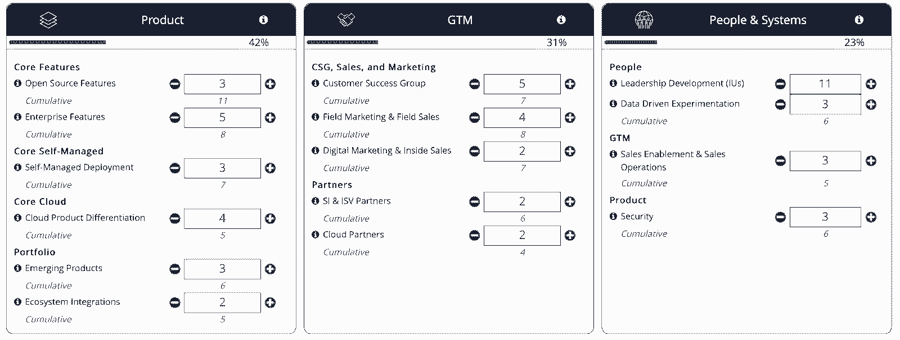

# 关注你的前 10 个系统，而不仅仅是你的前 10 个雇员——这位参谋长分享了他的剧本

> 原文：<https://review.firstround.com/focus-on-your-first-10-systems-not-just-your-first-10-hires-this-chief-of-staff-shares-his-playbook>

## 介绍

在**[任职的六年里，凯文·菲什纳](https://www.linkedin.com/in/kevinfishner/ "null")** 串起了一套独特的创业经历。他于 2014 年加入云基础设施自动化公司，成为该公司的第一名员工，随后加入了销售、解决方案工程、客户管理和营销团队。之后，他花了几年时间组建产品管理和教育团队，担任产品副总裁。但是在过去的一年半里，他有了一个不同的位置——作为幕僚长。

当然，在之前，我们已经[写过关于参谋长的角色。这种越来越常见的创业角色通常包括提高首席执行官的效率，优先考虑宝贵的时间，优化工作流程，或许还包括推动战略项目。但是菲什纳的任务有一个稍微不同的焦点。](https://review.firstround.com/why-you-need-two-chiefs-in-the-executive-office "null")

“**我的职责是像对待产品一样对待公司，**员工就是用户。像一个产品经理一样，我每天都在思考我们应该建立和改进什么，拥有使公司文化和生产力变得生动的组件，”Fishner 说。“我们通过问这个问题来做到这一点:**我们想要建立的文化的核心体系是什么？**在 HashiCorp，我们已经从几百人发展到一千多人，所以我们的目标是建立可扩展的系统，使员工能够尽最大努力工作，为公司的成果做出贡献。对我们来说，这形成了三个具体的系统:战略规划、知识管理和沟通。”

在这次独家采访中，Fishner 揭开了其中的奥秘，将 HashiCorp 的运营置于显微镜下，并公开了他的最佳实践和模板。我们发现这是一次令人着迷的谈话，我们希望你同意。首先，菲什纳拥有在哲学和实践之间转换的罕见能力——前一分钟他还在谈论决定论如何影响了他对公司建设的思考，几分钟后他就向我们展示了哈希公司在高度结构化的年度规划流程中使用的确切模板。

但更广泛地说，我们发现，公司如何运作的机制和战术细节在创业界仍是未被充分探索的话题。大多数公司系统都是有机发展的，要么随着规模的扩大而匆忙拼凑起来，要么被忽视，直到变得无人问津、相当不灵活。在这里，Fishner 提出了一个深思熟虑的案例，说明为什么公司建设的系统方面应该得到更多的关注，深入探讨了两个特定系统的本质细节 HashiCorp 团队如何设定和跟踪目标进展，以及通过写作做出决策。

无论你是想成为一名办公室主任，还是希望为自己羽翼未丰的公司打下良好基础的创始人，请继续阅读，寻找一个独特的机会，深入了解一家公司的运作方式，并为自己的创业系统收集灵感。

# 为什么你的前 10 个系统至关重要

这么多的创业建议都可以归结为一个共同点:雇佣最优秀的人。无论是关于前 50 名员工如何设定文化基调的 Twitter 帖子，还是建议创始人面试前 100 名员工的博客帖子，大多数建议都是关于坚定不移地关注推动创业的人。

“虽然我完全同意人是您最重要的资产，但我注意到大多数内容并没有过多地谈论系统。菲什纳说:“我不经常看到的是，那些第一批雇员建立的*系统*是文化的体现。

在他看来，这不是一个非此即彼的问题，而是两者兼而有之。"**虽然早期员工当然是公司文化的驱动因素，但他们只是等式的一半。他说:“另一半是基础系统**。“我喜欢做的比较是先天与后天的辩论。你的基因和迷因都对你的结果有很大影响。同样，你的人和你的系统对你公司的结果都有很大的影响，但是系统方面没有得到应有的重视。”

关心你的前 10 个系统，就像你关心你的前 10 个雇员一样。

Fishner 阐述了为什么他认为系统应该得到平等的地位。**而早期员工则帮助制定** ***隐性*** **规范，在公司生命周期的早期建立系统制定** ***显性*** **规范**。决策是如何做出的？会议是如何组织的？目标是如何设定的？他表示:“当公司规模较小时，这些系统更容易建立，但随着公司的发展，建立起来却非常困难。”。

Kevin Fishner, HashiCorp's Chief of Staff

这一点如今尤其引起共鸣。“向远程工作的转变向我们展示了这有多棘手。你日常的大部分人际互动都是通过 Slack、电子邮件、谷歌文档和 Zoom 会议进行的。因此，对于许多员工来说，他们一天中唯一面对面的人际互动很可能是通过开会。如果那个会议是好的，那么他们的一天就是好的。他说:“如果会议开得不好，那么他们的一天也会很糟糕。”。菲什纳说，作为回应，许多公司正试图鼓励多写作，少开会，但发现采取这种做法很有挑战性，因为这不是现有的明确规范。"对于一家老牌公司来说，实施新系统需要自上而下的执行权力。"

创始人:你越早明白什么实践对你来说是重要的，越好。尽快将这些实践转化为系统。

令人惊讶的是，菲什纳的信念来自于他的大学时代。“我学的是哲学。我的论文是关于潜意识广告技术的影响。经济学理论建立在个人理性、消息灵通和自主的基本信念之上。但实际上，这些都不是真的。例如，我们离自主还很远——每个人都会影响其他人，”他说。

“在我的阅读和论文研究中，我更倾向于决定论的世界观，即自由意志被高估了，我们的意志力被夸大了。我们实际上更受所处环境的影响。这几点在'[原子习惯](https://jamesclear.com/atomic-habits "null")'里确实做得很好如果你想吃得更好或者锻炼身体，不要依靠你的意志力。相反，改变一些导致这些行为的环境影响，比如在你的房子里放糖。"

这就是与创业公司联系的地方。Fishner 说:“在公司建设中也是如此——不要完全依赖所有员工的意志力和独立性，而是要考虑如何建立更好的系统，创造一个人们可以发挥最大作用的环境。

他将这种哲学延伸得更远。“埃隆·马斯克[有一句名言](https://www.businessinsider.com/elon-musk-says-theres-no-such-thing-as-a-business-2015-9 "null")一直被重复，本质上是说，公司只不过是为共同使命而努力的个人的集合。我认为这没有切中要害。菲什纳说:“这就像忒修斯思想实验的[号船](https://en.wikipedia.org/wiki/Ship_of_Theseus "null")。

“想象一下，你有一艘大型木制海盗船，100 多年后，你会更换每一块木头。在这个过程结束时，它还是同一艘船吗？没有明确的答案，但以类似的方式思考一家公司是有启发性的。员工可能会在 30 年的时间里来来去去，直到不再有相同的员工。是同一家公司吗？”他问道。“我认为是的。”

一个公司是其人员和系统的集合。随着时间的推移，人们可以来来去去，但他们建立并随着时间的推移逐渐完善的系统成为了公司的一部分——公司最终的竞争是基于这些系统是否强大。

在接下来的章节中，Fishner 向我们介绍了他公司的两个系统，以及团队如何不断改进它们。公平的警告——系统不容易复制和粘贴。“我将要讨论的一切对 HashiCorp 来说都非常重要，但我不会说它们是通用的原则。所以希望你能把它们和你自己的想法混合起来——它们不是绝对的真理。”

# 系统#1:运营节奏——为什么真理和仪式的来源是战略规划的关键

Fishner 说，哈希公司的行话称之为“运营节奏”，其他创业公司可能会称之为目标设定或 OKRs。“运营节奏是设定我们方向的安静鼓点，是推动业务的[节奏](https://review.firstround.com/what-startups-can-learn-from-general-mcchrystal-about-combining-strategy-and-execution "null")。在 HashiCorp，我们的运营节奏有三种速度——年度、季度和每周，”他说。每个速度都建立在两个组成部分上:

**真相来源:**用一种清晰的、理想的可量化的方式定义成功。

**惯例**:审查真相来源和建立问责制的一贯做法。

在我们深入研究每个要素之前，先来看看下面的快速概述，了解 HashiCorp 在年度、季度和每周级别上取得进步和保持责任感所依赖的事实和仪式的示例来源:

“如果你做对了，这个系统可以设定明确的期望，跟踪表现，并在过程中确定需要改进的地方，”Fishner 说。不幸的是，对于太多的创业公司来说，这个过程往往会偏离正轨。你可能以前遇到过这种模式:一个快速发展的创业团队遇到了优先级混乱、缺乏一致性和浪费精力的问题，因此有人建议公司实施一个目标设定框架。经过一个漫长的过程设置 OKRs，车轮慢慢开始脱落。Fishner 说:“很多时候，公司会关注真相的来源，而不是仪式——这是你可能犯的最大错误之一。

“okr 制定后，没有回顾它们的仪式，所以它们很快就过时了。然后员工开始憎恨他们，因为实际创造目标的努力是浪费时间——okr 慢慢死去，因为没有人再看他们。期望是不够的。这是一种惯例，它让人们把重点放在最重要的事情上。”

如果有一种回顾进展并让所有者对实现目标负责的仪式，okr 才会起作用。

## 年度规划:

***真相来源:*** *公司记分卡，* *围绕 3 个执行重点组织，细分为 12 个子记分卡。参见 HashiCorp 的模板* *[这里](https://works.hashicorp.com/articles/scorecard-template "null")* *或者获取我们的* *[Google Doc 版本](https://docs.google.com/document/d/1LjsVuXSE-uuapTmYxNjQE84Ceq3ab47GakFqF15arCo/edit?usp=sharing "null")* *这里。*

***仪式:*** *年度策划峰会*

***时间范围:****9 月进行头脑风暴，10 月进行资源分配，然后在 12 月的年度规划峰会前进行个人执行规划。*

“对我们来说，第一步实际上比年度计划过程更为长期。我们首先将高水平的公司成功指标定义为我们的北极星目标。寻找从多年的执行中产生的远大目标。它们通常是滞后指标，几乎没有季度跟踪的用处。对我们来说，这些是构成我们年度运营计划的固定目标，但它们的规模每年都在变化，”他说。

“在 HashiCorp，我们的第一个长期目标是赢得从业者(以月活跃用户账户衡量)。其次是帮助客户(通过 ARR 衡量)。第三是发展生态系统(以归属于我们合作伙伴的收入百分比来衡量)。然后，我们的财务团队根据这些北极星目标制定了一个长期计划，这是一个包含衍生财务指标的五年财务模型。”

有了这样的背景，让我们转向年度记分卡。“本质上，它是我们 OKRs 的化身。使用我们的记分卡模板，我们定义了目标和每个目标的一组关键结果，并按季度跟踪进度。“这些目标是公司的最高级别，为来年设定了总体优先事项，”Fishner 说。“作为一个高管团队，我们认为这些要点将对实现五年长期计划产生最积极的影响。”

### 真相来源:记分卡

下面是如何填写记分卡的:“9 月份有一次高管异地会议，我们围绕公司目标的前三位高管关注点应该是什么进行了一次结构化的头脑风暴，”Fishner 说。

HashiCorp's annual scorecard template.

但这不是一般的头脑风暴。《哈佛商业评论》有几项关于头脑风暴的研究表明，当你把人们聚集在一起，让他们把贴纸贴在墙上时，效果并不好。因此，我们给高管们两周时间，让他们写下他们认为来年的三个重点应该是什么，”他说。然后，每位高管都有五分钟的时间在会上讨论他们的建议。然后我们把所有的建议放在一个列表中——通常有很多重叠，所以我们最终有大约 15 个。然后，每位高管对五项计划进行排名，五项是最重要的，一项是最不重要的，然后我们从那里进行排序。”

Fishner 说，这个过程有一些好处。“首先，允许每个人独立思考目标意味着他们不会陷入集体思考。第二，当没有那么迫切需要当场提出想法时，人们通常会更有想法。最后，每位领导人都有[平等的广播时间和机会](https://review.firstround.com/the-managers-guide-to-inclusive-leadership-small-habits-that-make-a-big-impact "null")让别人听到他们的声音。”

以这些高层管理人员的关注为起点，团队可以更深入地研究。“我们将公司目标(100 级)分解为四个‘计划’(200 级)，即上市计划、产品计划、人员计划和财务计划。然后，上市计划按地理区域(美洲、EMEA、APJ)分解，产品计划按产品线分解，”Fishner 说。总的来说，他们最终有 12 种不同的记分卡。

有趣的是，“200 级”计划是共有的。“销售、营销和客户成功管理人员在我们的上市记分卡上协作，产品和工程管理人员在我们的产品记分卡上工作。菲什纳说:“在其他目标框架中，你不会经常看到这种共同所有权，人们的想法是，你希望有一个直接负责的人。”但是软件不是可以被分解成非常小的组成部分的东西。又不是流水线。”

但这并不是逃避细节的借口——因此要按地理位置和产品线进一步细分。“将公司目标恰当地细分为表面见解至关重要。他说:“如果目标太高，一个产品线的过度表现会掩盖另一个产品线的表现不佳——这被[辛普森悖论](https://en.wikipedia.org/wiki/Simpson%27s_paradox "null")很好地捕捉到了。

当您只关注高级汇总指标时，您的业务中真正发生的事情的细微差别就会被忽略。

但是如果目标太低，信号可能会淹没在噪音中。“重要的是，我们不会把记分卡压得比现场地理位置和产品线更低。菲什纳说:“以美洲记分卡为例。“大约有 150 名销售、客户成功、工程和现场营销人员专门负责美洲地区。他们的记分卡侧重于顶线收入、更新率、扩张率等指标，然后是管道生成和覆盖范围等领先指标。作为一个领导团队，我们不会试图将其逐级分解到纽约或德克萨斯州等个别地区，那是他们的责任。”

### 仪式:练习的时间

“这些高管记分卡草案通常从 10 月中旬到 12 月份制定，这也是年度规划峰会的时间。我们召集了公司的 70 名高层领导——过去的一年当然很遥远，但我们通常都是亲自去。“这需要两天，每天大约四到五个小时，”Fishner 说。

最独特的是，峰会聚焦于一个商业模拟。“利用一家名为 [BTS](https://www.bts.com/ "null") 的公司，我们进行了一次商业模拟，在模拟中，领导者可以‘经营’公司三年。菲什纳说:“从公司的简单角度来看，我们基本上是根据我们的五年财务模型和今年的三个高管重点领域来构建一个游戏平台。

A sample snapshot of the HashiCorp annual business simulation.

它是这样运作的:“我们将人们分成六人小组，他们在两天内成为‘首席执行官’或执行团队。每一轮，你的团队都要决定投资什么项目。但游戏中存在“摇摆不定”的情况，这些情况会让你偏离轨道，因此你必须决定如何调整。这不仅加深了我们的领导对今年优先事项的理解，也加深了他们如何在实践中发挥作用的理解。"

当然，这是一项复杂的任务，适合更大的团队，所以它可能不适合你的初创公司。”**这个练习的本质是实践的观念**。我从小玩竞技足球长大。他说:“我们每周练习四到五次，周末还有比赛——基本上 90%的时间用来练习，10%的时间用来表演。”。“但当你进入一个工作环境时，实践这个概念就会消失。所以模拟是为了创造练习和犯错的空间。”(编者注:菲什纳的这一精彩观点让我们想起了[泰勒·考恩的问题](https://marginalrevolution.com/marginalrevolution/2019/07/learn-like-an-athlete-knowledge-workers-should-train.html "null"):你所做的训练有什么比得上钢琴家练习音阶？)

为了将这种精神以一种更简单的方式带到你的公司，Fishner 建议使用更轻量级的选项。“召集一小群领导一起进行一次[异地](https://review.firstround.com/use-this-startups-playbook-for-running-impactful-virtual-offsites "null")。他说:“创造一个练习，让你站在别人的角度，经历他们的日常活动，比如回答支持问题。

一个练习、犯错和建立对他人经历的同情的环境是任何年度仪式的关键。

## 季度进度:

***真相来源:*** *记分卡和战况表。*

***礼:*** *【季度业务回顾】(QBR)*

**随着年度计划的确定，HashiCorp 团队将注意力转向他们的季度节奏。“每个季度，我们都会审查 qbr 中所有 12 个记分卡的进度。年度流程中的记分卡会更新，并在列中填入上一季度的结果。Fishner 说:“作为事实的另一个来源，有成功案例、行动项目和请求支持(WAR)表。“领导者回顾记分卡本身的进展，阅读团队的反思，然后讨论可能需要改进的领域。”**

**下面是战争表的内容:“填写更新的团队思考这些问题:胜利是什么？我们应该庆祝并继续前进的伟大成就是什么？挑战和行动项目是什么？例如，对于我们的一个产品线，激活率(月活跃用户数除以注册用户数)在最近一个季度很低，”他说。**

**

HashiCorp's WAR table template.** 

**Fishner 认为这种方法有两个好处:**

****反思**:“我们的原则之一是反思而非完美。目标设定是一个反思进步的过程，而不是试图让你的目标变得如此完美，以至于你永远不需要改变它们。他们要么在数量上有所偏差，要么完全被误导了，”他说。“qbr 创造了反思的空间。我们有望实现目标吗？这些是正确的目标吗？我们能做些什么来改善？”**

****责任**:“作为幕僚长，我没有权力也没有时间让所有者对他们的目标有效地负责。他说:“这种仪式创造了责任感——记分卡的所有者知道，每个季度他们都会向高管团队回顾他们的进展，他们也会回顾上个季度他们承诺要完成的任务。**

**一个运营节奏的目的不是教条地坚持年初设定的目标。这是一种反思和自省的仪式。**

## **每周回顾:**

*****真相来源:*** *企业举报包。***

*****仪式:*** *高管团队会议***

*****时间范围:*** *每周一小时的会议，分成四个 15 分钟的时间段***

**现在来看看 HashiCorp 最精细的运营节奏。“公司报告包是我们每季度审查的记分卡指标的超集，”Fishner 说。“它可以跟踪从我们当前季度的销售预测到我们实现招聘目标的进展等一切情况。这是试图尽可能接近公司驾驶舱，在那里我们可以看到领先和滞后指标，并知道公司是否在有效地飞行。**

**Fishner 与销售运营、财务和走向市场人员组成的跨职能团队每周都会汇编这组指标。“跨职能要素在这里很重要。以一个类似“我们的销售预测是什么？”的问题为例。“通常财务团队和销售团队对此有不同的看法，”他说。审查完指标后，我们提取出洞察力，即我们需要采取行动的红色趋势区域。"**

**现在是每周例行公事。“这是对什么对公司重要以及我们进展如何的更精细的回顾。高管团队每周一召开一小时的会议，审查公司报告包。在前 15 分钟，我们回顾对指标的见解。在另外三个 15 分钟的时段，一位嘉宾发言人将介绍我们在之前的 QBR 中确定的行动项目，这是另一个层面的责任，以确保我们跟进我们面临的挑战。”**

**这种细齿梳方法背后的思想是:**

****关注领先指标**。一个季度的调查是不够的。“很难改变当前季度的续订业绩。根据过去一年客户对我们产品和服务的体验，是否会发生续约。Fishner 说:“我们需要跟踪创造强劲续用率的领先指标，包括客户入职、客户健康状况和实施服务使用情况。“对于每一个滞后指标，我们都需要有一套领先指标，我们每周都会对其进行评估。”**

****关注重要的事情**。“it 科学是确保您的每周报告包真正代表公司最重要的指标，”Fishner 说。“这种级别的每周审查使我们能够交付高杠杆的行动，而不是被紧急、低杠杆的升级分散注意力。如果一个不同的领先指标出现问题，就会有一种采取行动的冲动。但如果它不在年度记分卡上，那么今年早些时候，我们一致认为这对公司的健康发展并不重要，因此它不需要成为我们关注的重点。”**

**你的习惯应该让你专注于今年早些时候你认为重要的事情——而不是本周那些令人分心的事情。**

# **系统#2:如何打造书写和决策文档的公司文化**

**“HashiCorp 是一家偏远的公司，员工遍布 13 个国家和 40 个州。但我喜欢后退一步，把我们描述成一家开源公司，”Fishner 说。“这是一个微妙的区别，但很有趣，尤其是在我们公司的写作文化中。当你从事开源软件项目时，GitHub 上有大量的书面协作。我们写作实践的起源来自开源精神，以及早期员工的哲学和原则，”他说。**

**“米切尔·桥本(Mitchell Hashimoto)是该公司的联合创始人，也是与他同名的人，当他上大学的时候，他会随身携带一个笔记本。每当他有软件项目的想法时，他总是先把它们写下来。因此，当他和他的联合创始人艾蒙·达德加尔开始合作时，他们会在编写一行代码之前创建全面的[设计文档和文档。“起初，它专门负责工程方面，但最初的 50 名员工中有 45 名是工程师，所以在实施之前编写设计的想法成为了公司的核心部分。”](https://review.firstround.com/how-to-build-an-invention-machine-6-lessons-that-powered-amazons-success "null")**

**对 HashiCorp 来说，他们的写作习惯是一种记录决策并在实施前获得认同的方式。下面是它在实践中的工作原理。“我们有两份核心文件。有一个 **PRD** ，它在大多数公司中是一个产品需求文档，但是我们对它做了一点调整，使之成为一个问题需求文档。它定义了问题。第二个是 **RFC** ，即征求意见。它提出了一个解决方案或设计，也就是你想在开始之前获得批准的实现，”Fishner 说。**

**下面我们将逐一探讨:**

## **定义问题**

***见 HashiCorp 的* *[PRD 模板此处](https://works.hashicorp.com/articles/prd-template "null")* *或抓取我们的* *[Google Doc 版本](https://docs.google.com/document/d/1ByJRL4jKcd5R-LgJcEGSlHUHP_Ngm__0urXEg3msAeQ/edit?usp=sharing "null")* *:***

**“大多数大型项目从珠三角开始，然后是 RFC，但不是每个 RFC 都有珠三角。“产品管理团队肯定会写很多产品研发报告，”Fishner 说。“但更普遍的是，我们发现，对于我们面临的一些更模糊的挑战，尤其是在有许多利益相关者的情况下，首先编写一份 PRD 以确保每个人都同意我们实际解决的问题是有帮助的。”**

**至于文档本身，这些是核心部分:**

****背景** **背景**。“为了让读者理解珠三角的内容，他们必须首先了解上下文。”**

**问题和人物角色。这是 PRD 的核心，因为它将用户研究简化为清晰的问题陈述。它还包括一个角色列表，以及他们如何经历这些问题的陈述。”**

****要求和阶段**。“这更像是您所期望的传统产品管理 PRD，列出了工程 RFC 应满足的一系列要求。这个问题也被分解成几个阶段，以支持迭代实现。”**

**最重要的组成部分？你的思维模式。“引言部分应该先读，然后再写。最后写概述可以让作者总结 PRD 的最终内容，而不是在不知道最终结果的情况下写介绍。”**

**写 PRD 是为了策展信息，而不是创造信息；你应该进入这个过程，不要先入为主地想你会发现什么。**

## **确定解决方案的范围**

***参见* *[HashiCorp 的 RFC 模板这里](https://works.hashicorp.com/articles/rfc-template "null")* *或者抓取我们的* *[Google Doc 版本](https://docs.google.com/document/d/16zs0SSX2EY8V2b-5lb5CFdIrp1-VTV9SeLaHj0jhZ9w/edit?usp=sharing "null")***

**“我们用来决定是否应该写一个 RFC 的指导原则是，修改所花的时间是否比写文档本身要快，”Fishner 说。**

**“RFC 本身实际上有两个核心部分:背景和提案。背景部分的指导目标是:作为这个项目的新人(新员工，团队调动)，我可以阅读背景部分并跟随任何链接以获得为什么这种改变是必要的完整上下文吗？”他说。**

**“在提案中，针对实施的不同方面有许多小节，包括对 UX 和 UI 的影响。菲什纳说:“最后一部分是批准并给出反馈的成员。“但是还有第三个可选部分叫做‘被放弃的想法’。我们发现在 RFC 中有非常好的辩论。与其只留下那些辩论的结果，不如捕捉那些另类的想法，让读者有一个更全面的了解，并帮助读者理解作者在探索什么。”**

**Fishner 向我们展示了一个工程组织之外的 RFC 实例。“财务团队撰写了许多 RFC，内容涉及我们的支出系统应该是什么，或者我们应该如何制定长期计划。背景部分可能会解释财务规划周期。然后在提案本身中，他们可能会列出一些考虑因素，例如在 5 年内达到我们的北极星指标，建立一条通往 EBITDA 盈利能力的道路，或者设置护栏，使其不违反一个神奇的数字——当年收入除以去年的销售和营销成本，”他说。**

**“在那里，他们分解了长期计划的具体组成部分:我们的损益表、现金流量表、我们的非 GAAP ARR 表，等等。然后，他们收集对该基本计划的意见或反馈，并获得批准和实施。然后，您将 RFC 发送到公司范围内的电子邮件列表。虽然大多数人只会阅读电子邮件而不是完整的 RFC，但将它发送到列表中可以让人们了解整个公司正在做出的决策。”**

**Fishner 分享了更多关于将这份文件放在一起的艺术。“有趣的是，我们确实有一个关于如何编写 RFC 的 RFC，以及一个每个人都遵循的 RFC 模板。他说:“在过去的六、七年里，我们从这些书面文件中学到了很多，有充分的理由说明为什么模板是这样的。**

**获得对 RFC 的反馈的过程也很重要。“首先，确保解决方案是适当的，并且考虑了必要的观点，这一点很重要。但第二，这是一种文化实践，”菲什纳说。“对 RFC 的反馈是我们在公司提供反馈的主要方式之一。第一条规则是确保你对文件本身而不是对人给出反馈。这意味着改变你写反馈的方式。而不是‘你为什么写这个？’说，“为什么解决方案的这一方面是正确的方式？”"**

# **参谋长联席会议的三条分手原则**

**作为压轴戏，Fishner 分享了他作为参谋长从设计这些系统中学到的三个经验。当你评估自己的创业公司的潜在系统时，利用它们。**

## **原则 1:做一个观察者，而不是实干家。**

**“这是我刚刚担任办公厅主任时学到的很好的一课。你对一家公司有了一个有趣的视角，因为你从 CEO 的角度了解了各个职能部门是如何运作和相互协作的。发现销售和营销之间，或者销售和客户成功之间的问题变得非常容易。陷阱是认为你可以去解决它们。**作为幕僚长，你可以负责提出解决方案——在我们的情况下，写一份 RFC 并构建真相之源——但你永远不会对仪式负责。仪式是改变发生的地方**。**

**他分享了一个具体的例子。“18 个月前，当我第一次担任这一职务时，我们在销售、营销和客户成功细分用户的方式上存在差异。他们都有一个稍微不同的模型。我以“实干家”的心态来对待它。我想如果我定义一个客户细分模型，他们都会使用它。虽然我们能够达成一个我们都同意的模式，但因为我不在那些座位上，不主持那些会议，也不建立仪式，所以它从未被采纳。”**

**作为幕僚长，你可以观察挑战，但你不是真正解决它们的人。**

## **原则 2:找到并实施杠杆。**

**“如果说我作为幕僚长学到了什么，那就是杠杆是你能找到的最重要的东西——我的意思是，找到你能采取的对整个公司产生最积极的连锁影响的行动，”Fishner 说。**

**杠杆的目的是用尽可能少的努力创造尽可能多的变化。“高管团队的资源有限。每个季度，我们都需要严格区分重点领域的优先级。作为幕僚长，你是执行团队的支持者。他说:“你的工作是确保高管团队在我们作为一个团队所能做出的最有影响力的决策上保持一致。**

**“当我第一次开始研究操作节奏时，我有点忘记了这个目的。随着我做得越来越多，我发现发现杠杆就是创造一个观察系统，让你可以了解公司不同部门正在发生什么。你可以看到弱点在哪里，并坚持不懈地让人们去修复那些可能对公司本身产生最大改善的地方。这就是操作 cadence 系统的真正意义所在。定义目标和跟踪进展的系统是找到高杠杆作用行动的手段。”**

**这不是关于 OKRs 或任何其他设定目标的缩写词。如果这个系统没有实现最大的改进，它就不是一个高效的系统。**

## **原则#3:样品灵感，但要确保你重新混合它。**

**“我对其他公司的做法做了大量研究，对我们影响最大的是亚马逊和微软。例如，记分卡肯定是受微软的启发。菲什纳说:“虽然我们没有完全照搬亚马逊的书面备忘录做法，但这很好地证明了这种做法是可行的，而且可以在非常大的范围内发挥作用。”。**

**“但重要的是要记住，这些系统在很大程度上是文化艺术品。这一点对我来说非常明显，因为在过去的一年里，许多公司被迫采用远程办公。每当有人问我关于远程实践的建议时，我首先想到的总是写作。他说:“我浏览了我们的一些 RFC 和整个流程，99%的情况下，人们的反应是，‘这很好，但在我们公司永远行不通。’。**

**“这就是为什么它回到了构建系统。**在公司生命周期的早期，如果你像对待早期员工一样严肃对待你的核心系统，这些系统将会构建公司文化。这就是为什么这些系统需要成为公司本身的有机组成部分。你可以从其他公司获得灵感，但这真的只是灵感。你需要把它和其他想法混合起来。放弃你正在创造新的创新的想法，而是看看你如何创造现有想法的独特组合，为你公司的特定环境服务。”****

**这篇文章是凯文·菲什纳在我们的新播客《深度》中的出场摘要如果你还没有听过我们的节目，一定要在这里 *[看看](https://review.firstround.com/podcast "null")* *。***

***封面图片由 Getty Images / Jorg Greuel 提供。* *模板由 HashiCorp 提供。***