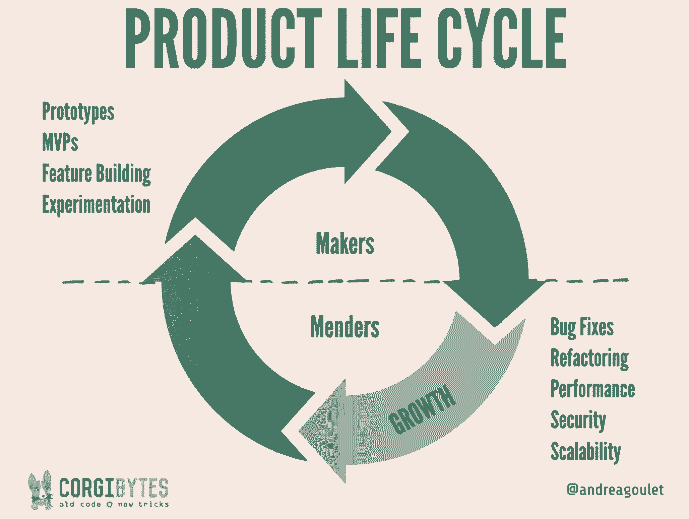

# 忘记技术债务——以下是如何积累技术财富

> 原文：<https://review.firstround.com/forget-technical-debt-heres-how-to-build-technical-wealth>

安德里亚·古莱特 和她的商业伙伴坐在她的客厅里，漫不经心地回顾他们的战略计划，这时电视上播放了一集《T4 这座老房子》。这是思想碰撞创造新事物的时刻之一。他们一直在寻找一种方式来传达他们的价值主张——为其他公司清理遗留代码和技术债务。他们就在这里，面对着完美的类比。

“我们意识到我们所做的超越了清除旧代码，我们实际上是在改造软件就像你改造房子一样，让它更耐用，运行更好，做得更多，”Goulet 说。“这让我开始思考公司如何投资修补代码以获得更高的生产率。就像你必须给房子盖个新屋顶才能让它更值钱一样。这并不性感，但却至关重要，太多人都做错了。”

今天，她是 Corgibytes 的首席执行官，这是一家重新设计和更新应用程序的咨询公司。她见过各种各样的破损系统、遗留代码，以及技术债务如此极端的案例，基本上就是数字囤积。在这里，Goulet 认为**创业公司需要将他们的思维模式从偿还债务转向建立技术财富**、**以及从拆除旧代码转向有意改造它**。她解释了这种新方法，以及如何做到不可能的事情——实际上招募优秀的工程师来完成这项工作。

# 反思遗留代码

遗留代码最流行的定义来自 Michael Feathers，他是《有效使用遗留代码[的作者:**这是没有测试覆盖的代码**。这比大多数人的假设要好——这个术语只适用于非常古老的系统。但是根据 Goulet 的说法，这两个定义都不够深入。“遗留代码与软件的年龄无关。她说:“两年前的应用程序可能已经处于遗留状态。这是关于软件有多难改进的问题。](https://www.amazon.com/Working-Effectively-Legacy-Michael-Feathers/dp/0131177052 "null")

这意味着代码写得不干净，缺乏解释，没有包含你的想法和决策过程的工件。单元测试是一种工件，但是任何用于创建代码的基本原理和推理的文档也是一种工件。如果当你去改进它的时候，没有办法知道开发者在想什么，那就是遗留代码。

遗留代码不是技术问题。是沟通问题。

如果你像 Goulet 一样徘徊在传统代码的圈子里，你会发现一个特殊的，相当晦涩的格言被称为[康威法则](https://en.wikipedia.org/wiki/Conway%27s_law "null")会出现在几乎所有的对话中。

“法律规定，你的代码库将反映整个组织的沟通结构，”Goulet 说。“如果你想修复你的遗留代码，不解决操作问题是不行的。这是很多人都忽略的一环。”

古莱特和她的团队像考古学家一样深入到一个遗产项目中。他们寻找遗留下来的工件，这些工件为他们提供了线索，让他们了解过去的开发人员在想什么。所有这些工件一起提供了制定新决策的背景。

最重要的神器？**组织良好，意图明确，代码简洁。**例如，如果你用“foo”或“bar”这样的通用术语来命名一个变量，你可能在六个月后回来，却不知道这个变量是做什么用的。

如果代码不容易阅读，一个有用的工件是源代码控制系统，因为它提供了代码更改的历史，并给开发人员一个机会来写下他们所做的更改。

“我的一个朋友说，对于提交消息，每个摘要应该有半条推文的大小，如果必要的话，描述应该和博客帖子一样长，”Goulet 说。“您有机会将您的基本原理与正在更改的代码紧密结合起来。它不需要很多额外的时间，并给后来从事该项目的人提供大量信息，但令人惊讶的是很少有人这样做。我们经常听到开发人员对处理一段代码感到非常沮丧，他们在盛怒之下运行“git debit ”,以找出是谁写了这些乱七八糟的东西，却发现是他们自己。”

自动化测试也是理性的沃土。“这么多人喜欢 Michael Feathers 对遗留代码的定义是有原因的，”Goulet 解释道。测试套件，特别是当与[行为驱动开发](https://en.wikipedia.org/wiki/Behavior-driven_development "null")实践一起使用时，比如写出场景，是理解开发者意图的非常有用的工具。"

**这里的教训很简单:**如果你想限制你的遗留代码，注意那些在将来更容易理解和处理的细节。编写并运行单元、验收、批准和集成测试。解释你的行为。让未来的你(和其他人)更容易读懂你的想法。

也就是说，遗留代码无论如何都会发生。原因既明显又出乎意料。

在初创公司的早期，通常会有一股强大的推动力来推出新功能。开发人员承受着巨大的交付压力，测试被搁置一旁。Corgibytes 团队已经遇到了许多公司，它们在成长过程中根本不愿意为测试而烦恼——已经很多年了。

当然，当你正在开发一个原型时，强制测试可能没有意义。但是一旦你有了产品和用户，你就需要开始投资维护和增量改进。“太多人说，‘不要担心维护，酷的东西才是特色！’”古莱特说**如果你这样做，你肯定会碰到一个无法扩展的点。你不能竞争。**

事实证明，热力学第二定律也适用于代码:**你总是朝着熵的方向飞奔。**你需要不断与技术债的混乱作斗争。遗留代码只是随着时间的推移而积累的一种债务。

“房子的比喻再次适用。她说:“你必须不停地收拾碗碟、吸尘、倒垃圾。“如果你不这样做，事情会变得更难，直到最终你不得不召集危险物质小组。”

Corgibytes 接到了很多像这样的首席执行官的电话，他们说:“三年前，功能通常需要两周才能推出。现在他们要休 12 周。我的开发人员效率非常低。”

技术债总是反映一个运营问题。

许多首席技术官会看到问题的到来，但很难说服他们的同事，值得花钱来修复已经存在的问题。这似乎是回溯，没有令人兴奋的或新的输出。许多公司直到技术债务开始严重影响日常工作效率时才着手解决技术债务，而到那时，偿还技术债务可能会非常昂贵。

# 忘记债务，建立技术财富

如果你[将你的技术债务](https://www.agilealliance.org/resources/initiatives/technical-debt/ "null")重新定义为积累技术财富的机会，你更有可能让你的首席执行官、投资者和其他利益相关者加入进来——这是敏捷开发教练 Declan Whelan 最近创造的一个术语。

“我们需要停止将债务视为罪恶。“当你处于设计和制造产品的早期阶段时，技术债务会非常有用，”古利特说。“当你解决了一些债务，你就给了自己动力。当你在家里安装新窗户时，是的，你花了一大笔钱，但是你每个月在电费上节省了一百美元。同样的事情也发生在代码上。只是你获得的不是效率，而是随着时间的推移而增长的生产力。”

一旦你发现你的团队效率不高，你就想找出阻碍他们的技术缺陷。

“我和很多创业公司聊过，他们正竭尽全力地获取人才——他们雇佣这么多高薪工程师，只是为了完成更多的工作，”她说。“相反，他们应该考虑如何提高现有工程师的工作效率。为了获得额外的生产力，你可以偿还多少债务？”

如果你改变你的视角，专注于财富的积累，你最终会获得生产力盈余，然后可以再投资于修复更多的债务和遗产代码，形成良性循环。你的产品将会不断进步。

停止把你的软件当成一个项目来考虑。开始把它当成一个你会长期居住的房子。

古利特说，这是一个关键的思维转变。它会让你摆脱短期思维，让你比以往任何时候都更关心保养。

就像房子一样，现代化和维护以两种方式进行:小的、表面的改变(“我买了新地毯！”)和随着时间的推移会有回报的大而昂贵的投资(“我想我们会更换管道系统……”).你必须同时考虑这两个因素，以保持你的产品最新和你的团队平稳运行。

这也需要提前做好预算——如果你不这样做，那些大额购买将会带来伤害。定期保养是房屋所有权的预期成本。令人震惊的是，许多公司并不认为维护是做生意的成本。

这就是 Goulet 如何创造了术语“**软件重塑**”当你房子里的东西坏了，你不会推平它的一部分，然后从头开始重建。同样地，当你有旧的、损坏的代码时，重写通常不是最好的选择。

**以下是 Corgibytes 在被调用来“改造”代码库时所做的一些事情:**

将单一的应用程序分解成更轻量级、更易于维护的微服务。

将特性彼此分离，使它们更具可扩展性。

更新前端的品牌和外观。

建立自动化测试，以便代码能够自我验证。

重构或编辑代码库，使它们更容易使用。

改造也进入了 DevOps 的领域。例如，Corgibytes 经常向 [Docker](https://www.docker.com/ "null") 引入新的客户端，使得建立新的开发人员环境变得更加容易和快速。当您的团队中有 30 名工程师时，将初始设置时间从 10 小时减少到 10 分钟，可以为您完成更多任务提供巨大的优势。这种类型的努力不仅仅是关于软件本身，它还必须改变它的构建方式。

如果您知道这些活动中的哪一个将使您的代码更容易处理并创造效率，您应该将它们构建到您的年度或季度路线图中。不要指望它们会自己发生。但是也不要给自己压力，让自己马上去实现它们。Goulet 认为许多初创公司从一开始就被 100%的测试覆盖率所困扰。

**更具体地说，每个公司都应该计划三种类型的改造工作:**

自动化测试

连续交货

文化升级

让我们仔细看看其中的每一项。

**自动化测试**

“我们的一个客户正准备进入 B 轮，他告诉我们他们无法尽快招聘到人才。Goulet 说:“我们帮助他们引入了自动化测试框架，在不到 3 个月的时间里，他们团队的生产力提高了一倍。“他们能够找到投资者，并说，‘我们在一个精干的团队中获得的收益，比我们将团队扩大一倍时获得的要多。’"

自动化测试基本上是单个测试的组合。你的单元测试会对单行代码进行双重检查。你有集成测试来确保系统的不同部分运行良好。并且您有验收测试来确保特性按照您的设想工作。当您将这些测试编写为自动化脚本时，您实际上可以按下一个按钮，让您的系统进行自我验证，而不必梳理和手动点击所有内容。

在产品符合市场需求之前制定这一政策可能为时过早。但是一旦你有了一个你满意的产品，以及依赖它的用户，把这个框架放在适当的位置是非常值得的。

**连续交货**

这是过去手动执行的交付相关任务的自动化。目标是能够在完成后尽快部署一个小的变更，并尽可能缩短反馈循环。这可以给公司带来巨大的竞争优势，尤其是在客户服务方面。

“比方说，每次部署时，都是一团糟。“熵失去了控制，”古利特说。“我们看到部署需要 12 个小时或更长时间，因为它是这样一个集群。当这种情况发生时，您不会经常部署。你要推迟发布功能，因为这太痛苦了。你将会落后于竞争对手。”

**持续改进过程中通常自动化的其他任务包括:**

提交时检查构建中的中断。

发生故障时回滚。

检查代码质量的自动化代码评审。

根据需求增加或减少计算资源。

使建立开发、测试和生产环境变得容易。

举个简单的例子，假设客户提交了一份错误报告。开发人员越有效率地修复并解决这个问题，效果就越好。错误修复的挑战不在于做出改变有多难，而在于系统没有设置好，开发人员浪费了大量时间去做他们最擅长的事情，而不是解决问题。

随着不断改进，你会变得冷酷无情，决定哪些任务最适合计算机，哪些最适合人类。如果计算机在这方面做得更好，你就让它自动化。这让开发人员兴高采烈地解决挑战性问题。客户更高兴了，因为他们的投诉得到了快速处理和解决。您的修复积压减少，您可以花更多时间在新的创造性方法上，以进一步改进您的应用程序。**这是一种产生技术财富的变化。因为开发人员可以在一步修复一个错误后就发布新代码，所以他们有时间和带宽来更频繁地这么做。**

“你必须不断地问，‘我如何才能为我的用户改善这一点？我怎样才能做得更好？“我怎样才能让这变得更有效率，”“但不要就此止步，”古利特说。一旦你有了这些问题的答案，你必须问自己如何才能自动提高效率。"

**文化升级**

每天，Corgibytes 都会看到同样的问题:一家初创公司建立了一个让其开发人员无法发挥影响力的环境。首席执行官站在他们的肩膀上，奇怪他们为什么不经常出货。事实是，公司的文化对他们不利。为了给你的工程师授权，你必须全面地看待他们的环境。

为了证明这一点，古莱引用了作者罗伯特·亨利的话:

目的不是为了创造艺术，而是为了达到那种让艺术成为必然的美妙状态。

“这就是你需要开始考虑你的软件的方式，”她说。“你的文化可以是那种状态。你的目标应该始终是创造一个艺术发生的环境，而艺术是干净的代码、令人敬畏的客户服务、快乐的开发人员、良好的产品市场契合度、盈利能力等等。都是有联系的。”

这是一种优先解决技术债务和遗留代码的文化。这将真正为您的开发人员扫清道路，产生影响。这将会给你剩余的钱来建造更酷的东西。如果不改造产品开发的环境，你就无法改造产品。改变对维护和现代化投资的整体态度是第一步，最好是从首席执行官开始。

以下是 Goulet 对建立流动状态文化的一些建议:

抵制奖励熬夜工作的“英雄”的冲动。赞美效果胜于努力。

对协作技术感到好奇，比如伍迪·祖伊尔的 *[乌合之众编程](http://mobprogramming.org/ "null")* 。

遵循四个[现代敏捷](https://www.industriallogic.com/blog/modern-agile/ "null")原则:让用户敬畏，快速实验和学习，以安全为前提，持续传递价值。

每周给开发人员项目之外的时间进行专业开发。

练习[每日分享日志](http://corgibytes.com/blog/2016/08/02/how-we-use-daily-journals/ "null")作为让你的团队主动解决问题的一种方式。

把同理心放在你所做的一切的中心。在 Corgibytes，Brene Brown 的勇气工程训练是无价的。

古利特说，如果高管和投资者对这种升级犹豫不决，那就从客户服务的角度来考虑。告诉他们这种变化的最终产品将如何为对他们最重要的人带来更好的体验。这是你能提出的最有说服力的论点。

# 寻找最有才华的改造者

这是一个全行业的假设，即坏蛋工程师不想从事遗留代码。他们想打造漂亮的新功能。人们说，把它们放在维修部是一种浪费。

**这些都是误解。如果你知道在哪里以及如何寻找，你可以找到非常有技能的工程师来解决你最棘手的债务——以及当你拥有他们时如何让他们开心。**

“每当我们在会议上发言时，我们都会对听众进行调查，问他们‘谁喜欢从事遗留代码的工作？’不到 10%的人会举手，这是相当一致的。”古莱特说但当我与这些人交谈时，我发现他们是喜欢最具挑战性问题的工程师。"

她有客户带着自己开发的数据库来找她，没有文档，也没有可以想象的方法来解析结构。这是她称之为“**修理工**”的一类工程师的生计现在她在 Corgibytes 有一个团队为她工作，他们最喜欢的就是深入二进制文件，看看到底发生了什么。

那么，怎么才能找到这些精锐部队呢？古利特已经尝试了很多东西——有一些创造了奇迹。

她在 legacycode.rocks 推出了一个社区网站，宣传以下宣言:“长久以来，我们这些喜欢重构遗留代码的人一直被视为二等开发人员...如果你以从事遗留代码工作为荣，欢迎你！”

“我开始收到人们发来的电子邮件，他们说，‘天哪，我也是！’”她说只要走出去，把这个关于这项工作有多么有价值的信息传播给正确的人。"

她还在招聘中使用持续交付实践来给这些类型的开发人员他们想要的东西:大量的细节和明确的指示。“开始是因为我讨厌重复自己。如果我收到不止几封询问同样问题的电子邮件，我会把它放到网站上，就像我在写文档一样。”

但随着时间的推移，她注意到她可以进一步完善申请流程，以帮助她在流程的早期确定优秀的候选人。例如，她的申请说明写道，“首席执行官将审查你的简历，所以确保你的求职信是写给首席执行官的”，但没有提供性别。所有以“亲爱的先生”或“先生”开头的信件都会被立即丢弃。而这只是她招募挑战的开始。

“这开始是因为我对人们多少次假设我是一家软件公司的首席执行官，我必须是一个男人感到恼火，”Goulet 说。“所以有一天，我想我应该把它放在网站上，作为申请人了解谁在关注它的指导。令我惊讶的是，它不只是掩盖了不太严肃的候选人。它扩大了拥有处理遗留代码的特殊技能的人的范围。”

古利特回忆起一位求职者给她发电子邮件说，“我检查了你网站上的代码(我喜欢这个网站，嘿，这是我的工作)。有一个奇怪的工件似乎是用 PHP 编写的，但看起来你运行的是用 Ruby 编写的 Jekyll。我真的很好奇这是怎么回事。”

原来，Goulet 从她的设计者那里得到的 HTML、CSS 和 JavaScript 中有一个剩余的 PHP 类名，她一直想去看看，但一直没有机会。她的回应:“你在找工作吗？”

另一位候选人注意到她在指导中使用了术语 CTO，但这个头衔在她的团队中并不存在(她的商业伙伴是首席代码密语者)。再一次，对细节的关注、好奇心和主动改进的能力吸引了她的目光。

修补者不仅仅注重细节，他们还被对细节的关注所驱使。

令人惊讶的是，Goulet 并没有受到大多数科技公司招聘挑战的困扰。“大多数人通过我们的网站直接申请，但当我们想撒更大的网时，我们使用 [PowerToFly](https://www.powertofly.com/ "null") 和[we work remote](https://weworkremotely.com/ "null")。我目前真的不需要招聘人员。他们很难理解是什么让修理工与众不同。”

如果他们通过了第一轮，Goulet 会让候选人读一篇名为“[命名是一个过程](http://arlobelshee.com/good-naming-is-a-process-not-a-single-step/ "null")”的文章，作者是 Arlo Belshee。它深入研究了处理负债代码的具体细节。她唯一的指示是:“读一读，然后告诉我你的想法。”

她在寻找对他们反应中微妙之处的理解，以及表达观点的意愿。这真的有助于将有信念的深刻思考者与只想被聘用的候选人区分开来。她强烈建议选择一篇与你的业务相关的文章，展示人们有多么热情、有主见和善于分析。

最后，她将使用[exercisem . io](http://exercism.io/ "null")与候选人进行当前团队成员配对计划。这是一个开源项目，允许开发人员通过一系列测试驱动的开发练习来学习如何用不同的语言编写代码。结对编程会话的第一部分允许候选人选择一种内置语言。在下一个练习中，面试官可以选择语言。他们可以看到这个人如何应对惊喜，他们有多灵活，以及他们是否愿意承认他们不知道一些事情。

“当一个人真正从从业者转变为大师时，他们会自由地承认他们不知道的东西，”古利特说。

让某人用他们不太熟悉的语言编写代码也可以衡量他们的坚持性。“我们希望有人会说，‘我会一直努力解决这个问题，直到它完成。’也许他们甚至会在第二天来找我们，对我们说，‘我一直坚持，直到想明白为止。’这种行为是作为一名修理工成功的标志。"

制造商在我们的行业中如此受推崇，以至于每个人都想让他们做维护。那是一个错误。最好的修补者永远不是最好的制造者。

一旦她有了有才华的修理工，Goulet 知道如何让他们成功。下面是让这种类型的开发人员开心和高效的方法:

给他们足够的自主权。当然，在你解释问题的地方给他们布置任务，但是不要命令他们应该如何解决问题。

如果他们要求升级他们的计算机和工具，照做。他们知道他们需要什么来最大化效率。

帮助他们[限制他们的上下文切换](http://corgibytes.com/blog/2016/04/15/inception-layers/ "null")。他们喜欢专注直到事情完成。

总之，这种方法已经帮助 Corgibytes 建立了一个超过 20 名对遗留代码有热情的合格开发人员的等候名单。

# 稳定不是一个肮脏的词

大多数初创公司不会认为自己已经过了成长阶段。有些人甚至认为增长永远不会停止。即使你进入下一个阶段:稳定，也不是必须的。**所有的稳定性意味着您拥有构建技术财富所需的人员和流程，并将其用在正确的优先事项上。**

“在增长和稳定之间有一个拐点，修补者必须激增，你开始平衡他们与专注于新功能的制造商，”Goulet 说。“你有你的系统。现在你需要他们更好地工作。”

这意味着将更多的组织预算分配给维护和现代化。“你不能认为维护只是另一个项目，”她说。“它必须成为你的文化中与生俱来的东西——这很重要，会在未来带来更大的成功。”

最终，您通过这些努力建立的技术财富将会在您的团队中产生一个全新的开发人员类别:有时间和资源探索新领域、客户群和机会的童子军。当你有足够的带宽去开拓新的市场，并且不断地在你已经做的事情上做得更好的时候，那就是你真正繁荣的时候。