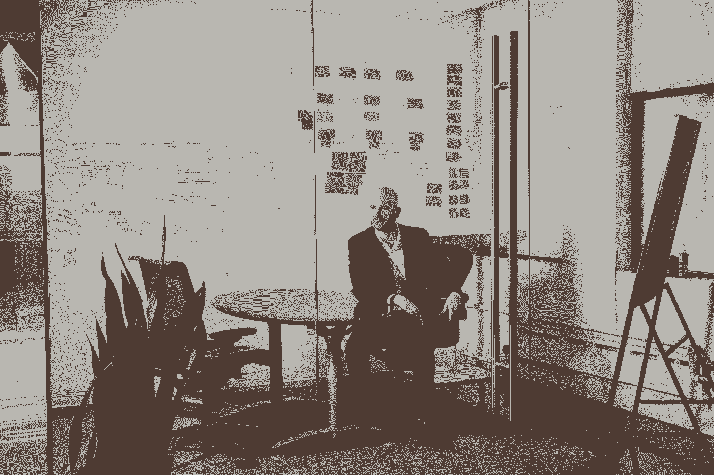

# 创始人曝光:公开创业失败和漏洞

> 原文：<https://review.firstround.com/founder-exposed-opening-up-about-startup-failures-and-vulnerability>

谈到创业公司的极端情况，三次创始人、投资者和纽约科技生态系统顾问杰夫·沃尔德 已经看到了一切。

沃尔德说:“我已经把[弗雷德·威尔森](https://en.wikipedia.org/wiki/Fred_Wilson_(financier) "null")作为投资者，筹集了超过 6000 万美元的资金，并把我的初创公司 **[WorkMarket](https://www.workmarket.com/ "null")** 卖给了 [ADP](https://www.adp.com/ "null") 。“但在这之前，在我职业生涯的早期，我有一家初创公司倒闭了，让我破产、沮丧，并濒临搬回父母家。虽然我真的为 WorkMarket 的成功感到骄傲，但它并不是一帆风顺的。有一次，董事会强迫我去找一个领导力教练。四年后，我的联合创始人离开了公司。当我们被收购时，人们公开质疑我为什么不坚持争取更大的成果。所以，在每一次退出和热情洋溢的报道背后，都有你没听说过的故事。揭开表面，你会发现每个人都遗漏了什么，还有什么没有说出口。”

许多创始人和初创企业领导人发现自己面临着类似的一堆隐藏的失败、挫折和不足的感觉，一座自我怀疑的高塔赫然耸现，尽管他们勇敢地试图支撑这个基础。但在沃尔德看来，很少有人采取下一步措施来应对这种感觉。这种忽略牺牲了关于科技失败的更广泛对话中急需的深度和广度。

并不是说题目不上来。毕竟，像“快速失败”和“庆祝失败”这样的短语在创业世界中经常被抛出，我们已经看到许多成功的领导者登上舞台谈论他们最大的错误。但很多时候，对话就此打住——很少有人继续挖掘失败的故事，这些故事没有被安全地局限在过去时，没有被陈词滥调所包裹，也没有被后续的成功所支撑。关于这些个人奋斗如何在此时此地抬头的真实脆弱性是罕见的。

在这次独家采访中，Wald 通过向我们介绍创始人在开放时面临的三个具体挑战，反思了他与失败擦肩而过时很少讨论的事实。他还分享了在脆弱的道路上走得更远的有效策略和从失败中吸取关键教训的工具，以及他在经历失败时会欢迎的建议。对于刚从失败中走出来的创业者(或者那些感觉自己岌岌可危的人)，沃尔德分享了宝贵的观点和有益的智慧，以重返游戏。

# 挑战#1:通过个人化变得脆弱

“失败变得很流行。沃尔德说:“我们生活在一个创新和挑战极限的文化中，这需要失败。“但我认为失败和脆弱是有区别的。我们混淆了将失败推向市场的想法，认为这让自己变得脆弱，而事实并非如此。谈论你的创业是如何失败的，或者你的产品是如何失败的，并不等同于探究这给你带来了什么感受，或者你作为一名领导者是如何失败的——这是有一定程度的分离的。你实际上需要把自己放在外面。

谈论失败和变得真正脆弱的区别在于:脆弱必然是个人的，而失败则不是。不要把两者混为一谈。

沃尔德是第一个承认他在职业生涯的大部分时间里避免实践这种真正的脆弱性的人。以他的第一家创业公司 Spinback 的失败为例，联合创始人的问题让位于有争议的法律纠纷，导致公司破产，并迫使沃尔德自掏腰包偿还投资者。他说:“我做的第一件事就是完全不谈这件事——不以任何方式、形式或形式承认失败、抑郁、孤立以及多年来的一切。”。

沃尔德继续隐瞒这件事——直到叙述方式改变。该公司进行了改革，有了新的领导层，并被[巴迪媒体](https://www.salesforce.com/products/marketing-cloud/social-media-marketing/?mc=buddymedia "null")收购(巴迪媒体随后又被[销售力量](https://www.salesforce.com/ "null")收购)。“突然之间，我从职业生涯中的这个巨大空白变成了‘哦，我创建了这家名为 Spinback 的公司，经过各种曲折，它被卖掉了’，这当然不是完全坦诚的。直到后来，当我在旅程中走得更远，我的新风险工作市场被证明是成功的时候，我才有信心披露更多关于实际发生的事情及其代价，”他说。

分享创业失败、市场失败和公司亏损的故事不一定是真正脆弱的表现，尤其是当有后续成功的安全网可以依靠的时候。“只有在那个故事有了一个成功的结局，对我来说没有负面影响的时候，我才会舒服地提到 Spinback，”他说。“鉴于我现在的处境，每个人都会自然而然地把失败视为通往成功的垫脚石。因此，尽管我对此更加坦率，但谈论公司破产并不会让我变得脆弱。这是一个抽象层，一个我仍然被屏蔽的讨论。谈论随之而来的沮丧和无力应对失败——这是一种更脆弱的表现。”

甚至更远的地方？谈论前方的坑坑洼洼，而不仅仅是后视镜里的坑坑洼洼。“讲述过去失败的故事虽然有所帮助，但对我来说并不像是什么勇敢的举动。我们需要把对话提升到下一个层次。更好的方法是在你挣扎的时候谈论事情，用现在时态展示弱点。沃尔德说:**当脆弱真的会伤害你的时候，它就敞开了大门。**

提起你过去是如何失败的是一回事，尤其是当你已经获得成功的时候。谈论我仍在纠结的问题，表现出任何弱点——现在时态——会让我感到更加畏缩。

# 挑战#2:围绕十粒玉米和惨败的叙事

围绕科技成功和失败的更广泛的叙述无助于沃尔德对开放和暴露自己的天生犹豫。

“有一种观念认为，真正成功的公司是那些增长率达到三位数的公司。我们不是真的庆祝成功，而是庆祝超成功。他说:“仅仅成为一只独角兽已经不够了，你还需要成为一只十玉米。”。“有一种文化，将货币结果颂扬到如此极端的程度，并将达到这种程度的人神化。如果你不在那里，如果你没有‘成功’，那么你甚至会开始质疑自己在做什么。”

当 WorkMarket 被 ADP 收购时，Wald 直接面对了这个问题。尽管他对出售感到兴奋，但他承认，超级成功的范例让他感到沉重。“人们应该说的是‘你有九位数的退场。那是千分之一或者万分之一的概率。“这太不可思议了，”沃尔德说。“相反，我的很多对话都是，‘嗯。“很抱歉，结果不太好，”或者“你为什么不坚持一个更大的结果？”我知道这是一个不可思议的机会，一个我引以为豪的机会，但这并没有阻止我的提问，以及我自己内心的独白，关于我如何才能建立一个更有价值的公司。"

对沃尔德来说，这种对收购支票上数字的痴迷没能捕捉到真正成功退出的轮廓。“ADP 是一家了不起的全球性公司。他说:“他们将我们建立的一切从安全性和合规性带到 UX，并将其提升一个档次，使其在企业规模上运营。”“这让劳动力市场变得更加强大，也让我成为了一名更好的创始人。这怎么能不成功呢？”

尽管对失败的健康恐惧可以成为增强创始人动力的竞争优势，但他发现围绕失败的讨论同样被扭曲了。“我们听到和读到的失败都是引人注目的，通常涉及欺诈、渎职或不道德行为。无论是 Fyre Festival 还是 Theranos，唯一能引起我们注意的就是哗众取宠。我们没有听到太多其他小规模的成功和失败。这些极端的终点影响了我们对成功和失败的真正含义的理解——我们慢慢地失去了对现实的掌控。”

创始人错过了围绕他们工作的至关重要的相对背景和层次设置。你可能会觉得你的失败比实际情况更加灾难性，或者你的成就没有扫清成功的障碍。别听那个声音。

为了获得足够的背景知识，让你的观点保持新鲜，并朝着正确的方向前进，请学习沃尔德的三个策略:

打开你的门。创造与其他创始人见面和交谈的空间。“不要根据你在 TechCrunch 上读到的东西来理解在这个行业中成功或失败意味着什么。依靠你的关系网和[穿过闲聊](https://firstround.com/review/cut-through-the-small-talk-and-connect-lessons-from-130-dinners-summits-and-salons/ "null")。沃尔德说:“我试图向创业社区中与我有过互动的任何人敞开大门。“无论是浏览他们的商业计划，与他们谈论在战壕中的真实感受，还是倾听他们在生活中经历的事情，这对他们来说都是一种宣泄，对我来说也是一种有益的视角。坦率地和他们谈论失败。让他们知道你会尽你所能帮助他们不失败，但是失败是有可能的。这没关系。”

**寻找** **[结构化师徒](https://fasttrack.firstround.com/ "null")** **的机会。** Wald 还建议花时间以更正式的方式回馈社会。“与刚刚起步的创业者共度时光至关重要。这有助于你记住旅程的起点，也有助于他们出发。他说:“我曾通过企业家圆桌会议加速器和创始人研究所等组织指导过一些公司。“你会希望每个季度至少与这些创始人合作一次，以了解现实。无论他们是在种子期后开始创业，还是仍在构思创意，这都在提醒我们，作为创始人，我们都在为之奋斗。”

超越销售的故事。当 Spinback 第一次失败时，Wald 感受到了挽救某种结果的巨大压力。“在我的脑海中，我一遍又一遍地想着‘如果我能把它卖一块钱，我就可以告诉人们它卖了。’钱不重要。这是一个我可以告诉自己和他人的故事，”他说。他注意到，这种心态在其他创始人身上也根深蒂固。”我投资过很多失败的公司，我从这些创始人身上看到了同样的想法，同样的痛苦。我并不是说销售不是一个更好的故事，但不要让自己被它缠住。如果成功了，那太好了。如果没有，你试了一下。沃尔德说:“你还需要几个击球手才能把事情做好。

不要只是阅读关于行业神祇的书籍——从你周围的创始人那里获取灵感。你需要听听战壕里的故事，这会帮助你坚持下去。

# 挑战 3:处理不稳定的联合创始人关系

联合创始人之间的争斗和纠纷是许多初创公司紧张关系的巨大来源，但我们没有听到太多关于这一点的细节，特别是当律师和沟通团队开始介入时。但这是沃尔德在 Spinback 和 WorkMarket 两次遇到的挑战。

“在 Spinback 事件中，两位联合创始人互相起诉，而我是旁观者。劳动力市场非常不同，”他说。“我的联合创始人是世界上最好的纯创业公司之一。他和我一起为我们的公司工作了四年，最终创造了一个伟大的成果。但我们深入到一家拥有 60 名员工、处理数千万美元收入的公司。这超出了我们俩的舒适区。我们有非常不同的风格，在以如此高的速度跑了这么长时间后，我们只是在处理事情的方式上出现了分歧。我不知道自己是否会把这视为一个深深融入公司生活的联合创始人失败，但当他离开公司时，我肯定感觉像是分手了。

尽管最初未能选择正确的联合创始人或者后来未能保持健康的工作关系是创业公司最大的杀手之一，但围绕它如何横向发展的细节进行诚实的讨论却很少。沃尔德认为，这是因为许多其他创业死亡原因在某种程度上仍然超出创始人的控制，更容易去人格化。

“共同创始人关系的破裂不是一个数学问题。沃尔德说，通常没有明确的对错，通常有“他说，她说”的成分。“但更重要的是，还有其他可能看起来更体面的失败方式。你可以研究技术，做所有你应该做的事情，但你仍然可能出错。你的竞争对手可能会胜过你，否则顾客可能不会来。但如果你全力以赴，带上所有资源，一周 7 天，一天工作 18 个小时，你会有一种感觉，当你离开时，你可以高昂着头。”

就像展示脆弱的技巧一样，糟糕的联合创始人关系属于个人范畴，而非商业范畴，因此，面对起来要痛苦得多。“承认你不能友好相处是很难的。理论上，这种失败是最容易避免的，对吗？但这需要建立信任。沃尔德说:“建立信任的一个关键因素是彼此之间的脆弱。”“如果你愿意变得脆弱并建立信任，这些关系没有理由不成功。但是很多人，包括我自己，都没能做到这一点，于是腐蚀行为就产生了。

联合创始人关系是 100%控制那些人。理论上，这种失败是最容易避免的。但这需要建立信任，而信任反过来又需要脆弱性。两者都不容易，都被忽视了。

[从一开始就建立信任](https://firstround.com/review/use-this-equation-to-determine-diagnose-and-repair-trust/ "null")并保持一致至关重要，但这需要允许冲突进入房间。如今，当联合创始人来沃尔德寻找天使投资时，他依靠一个关键问题来探查他们关系的强度以及变得脆弱的意愿。"**我喜欢问‘你们吵架了吗？’他说:“如果他们说‘不’，我会很犹豫是否要投资**。

“我们都是不同的人，我们带来不同的观点。这有助于一家更强大的公司。如果你有健康的冲突，你会得到更好的答案，因为每个人都在互相推动。沃尔德说:“如果你把一切都掩盖起来，或者被群体思维所左右，那就发出了一些严重的危险信号。“事实是，如果你们已经认识了一段时间，或者至少在这个想法上一起紧张地工作过，那么你们很有可能已经相互了解了。所以这个问题有两个层面:你是否表达了这些问题并解决了它们？你会在投资者面前表现得脆弱并分享这一点，而不是掩盖问题或假装一切都很完美吗？”

如果沃尔德决定与另一位联合创始人合作创办一家新企业，他会更好地意识到自己想要发现的品质。“我会寻找那些我认为处于成长心态的人。一个愿意变得脆弱并进行真正对话的人。沃尔德说:“如果他们能够分享他们真正失败的时候，以及他们感到不安全或羞耻的事情，那么我毫不怀疑我们能够建立信任和健康的冲突。”

Jeff Wald, co-founder and President of WorkMarket

# 创业者需要听到的关于失败的建议

“当你回首往事时，你会感激生命中的这段时光。这将是一次成长经历。”

作为一名创始人，在应对这些挑战时，沃尔德听到了无数不同的善意建议。虽然他今天同意这个建议的实质，但这不是他当时想要或需要听到的。

以下是他现在告诉创业者的关于失败的话——他希望有人告诉过他:

**1。你不是唯一一个失败的人。**

理论上，沃尔德知道他不是唯一一个面临失败的创始人。但在失去第一个同伴的绝望中，他感到孤立无援。

“回想起来，我需要听到的是:‘你认为你是唯一一个走上这条路的人吗？你不是。对不起，你并不特别，”他说。“我会把这句话告诉我现在提供建议和投资的创始人。你失败了。你又要失败了。糟透了。我没有假装没有。但是一旦你有时间沉溺其中，拿起你的肿块，掸掉身上的灰尘，回到那里。你的投资者、顾问、导师和朋友会在那里帮助你。”

这些鼓舞人心的话是基于一种认识:当时，沃尔德的失败感觉像是因为他而发生的事情——他独自承担了责任。“每个创始人都认为是他们身上的某种独特之处导致了他们的失败。在这种情况下，没有人会失败，”沃尔德说。**“但是你的失败并不能定义你是谁。”**

失败不是对你是谁的控诉。这是一个学习的过程。你经历过了。从概率的角度来看，你下次更有可能成功。

**2。你唯一欠投资者的就是尽你最大的努力。**

随着 Spinback 的联合创始人卷入法律冲突，Wald 认为他的支持者应该看到他们的钱被退回。

“我觉得我们的投资者，其中一些是我的朋友，没有接受我们不能一起在沙盒里玩得很好的风险而进行投资，”他说。“因此，我从自己的口袋里掏出钱来还了他们。我对此感到非常羞愧，以至于我不想打电话给他们说，“嘿，我真的很抱歉事情就这样发生了。”相反，我只是对他们说，'哦，不，我们只是决定把钱还给每个人，所以不要担心。我太骄傲了，正因为如此，我破产了。我今天可能也会这么做。但这种冲动背后有一个值得探究的动机——我不确定让创始人承担所有额外的重量和压力是否健康。"

那次经历的结果是，他现在在投资其他创始人时，坦率地说出了自己的理念。“我会对他们说:钱在这里，祝你们好运。如果你需要我做什么，打电话给我，我随时都可以帮忙。但我会假设你会失败。我希望你不要，我会尽我所能帮助你，但是你不欠我任何东西，除了尽你最大的努力。我做了一个决定，这是基于你很可能会失败的事实。但如果你成功了，我将获得非常可观的回报，我愿意做这笔交易，”他说。“如果他们最终失败了，但尽了最大努力，我会确保他们明白我会再次投资他们。”

如果你的公司失败了，你不用补偿你的投资人。你不欠他们任何东西——除非你真的没有尝试过。

对沃尔德来说，失败是一位无价的老师，但这仅仅是因为他花时间去挖掘失败的教训。失败可以是发生在你身上的事情，也可以是你从失败中学到的东西。但这不会通过潜移默化来实现，而是需要大量的集中努力和奉献来发掘出成功的秘诀，”他说。

对沃尔德来说，超越失败定义了他的观念最终需要专业的帮助。还有他曾经嗤之以鼻的事情——和教练一起工作。当第一次接触这个想法时，他并不太容易接受。“一个劳动力市场委员会成员带我去散步，说，‘我们认为你需要一个教练’，我说，‘我认为你需要一个教练。’”沃尔德说。不过，这位董事会成员明确表示，这个建议不是可有可无的。

“当时，我更注重证明自己是正确的，而不是有效的。我非常情绪化，反复无常。他说:“在董事会议上，我会双手交叉坐在角落里，穿上帽衫，什么也不说。“我还扔过东西——有时是桌子和椅子。我是个混蛋。我没有给人留下这样的印象，即我能够提供一家正在成长和转型的公司所需要的领导力。”

沃尔德不情愿地经历了寻找教练的过程，决心做最起码的事来满足董事会的要求，仅此而已。“我当然打算放弃，”他说。但正如沃尔德需要与其他创始人联系以获得更好的工作背景一样，需要一位有类似职业道路、因而更相关背景的教练来意识到外部视角的帮助有多大。“我遇到过有临床教练背景的人，但我从自己的经历中知道，我需要一个以前坐过我的椅子的人。我先被介绍给一个在创业界非常成功的人，然后回去成为一名教练。”

以下是他的教练的做法和经验，帮助 Wald 从挫折中吸取教训，推动个人发展:

采取一种成长的心态。

沃尔德的教练让他接触了[布琳·布朗关于脆弱性](https://www.ted.com/talks/brene_brown_on_vulnerability?language=en "null")的研究和[成长思维](https://firstround.com/review/the-adaptable-leader-is-the-new-holy-grail-become-one-hire-one/ "null")，这是由斯坦福大学的[卡罗尔·德韦克](https://en.wikipedia.org/wiki/Carol_Dweck "null")首创的。“在固定思维模式下，我们试图证明自己，在成长思维模式下，我们试图*提升*自己。他说:“我意识到，在职场上，我有太多的不安全感，我试图证明我是这个房间里最聪明的人。

这种心态也适用于重温以前的经历。有了固定的思维模式，你会把失败视为对你整个人生的控诉。但是有了成长的心态，你会把它视为一个惊人的学习机会。沃尔德说:“问题是，如果你陷入了固定的思维模式，刚刚经历了人生中最大的失败，你就听不到其他任何东西了。"我的教练消除了我对旋回的困扰，帮助我自己认识到了这一点。"

买三明治就行了。

在第一次训练中，沃尔德的教练询问了他的个人和职业目标。这是一个简单的问题，但沃尔德发现自己没有答案。“我看着他说，‘我不知道。“我没有，”沃尔德说。“他收拾好自己的东西，说，‘我下周回来。你有作业。我的工作是帮助你有效地实现你的目标。如果你不拿出来，我就没法工作。你需要考虑你的目标是什么。"

对于 Wald 来说，这个以目标为中心的框架是一个非常简单，但是清晰而有效的工具。“我现在把这种心态应用到我做的每一件事上。甚至举一个愚蠢的例子，比如当你想点午餐，而柜台后面的人没有注意的时候。你会感到沮丧，并想，“管它呢？”但是你要记住，你的目标不是修复这家公司的运营，也不是让这个人成为更好的销售代表。你的目标只是买三明治，”他说。

无论是在熟食店点三明治，还是在工作中领导一个项目，专注于你的目标——什么是重要的——是摆脱自己方式的关键。

除了为他的个人成长和领导力带来关注和方向，Wald 发现对他的团队也有溢出效应。“在我和我的教练一起工作之前，我不相信我们在 WorkMarket 的团队了解我们公司的目标是什么。他说:“如果你让团队的每个成员描述公司，我们的使命是什么，或者我们的北极星是什么，你会得到数百个不同的答案。“我们做了许多创业公司都会做的事情，那就是追逐短期机会，忽视长期目标。有些客户提供了巨大的机会，所以我们转移了我们的重点，改变了我们的路线图，竭尽全力为他们服务——但是交易失败了，我们浪费了整整一年的时间。”

在与他的教练合作后，Wald 能够提炼出 WorkMarket 的目标，并清楚地向团队阐明这些目标。这有助于将 WorkMarket 塑造成一家吸引并留住 ADP 注意力的公司。“如果我们没有那个目标导向，我毫不怀疑 ADP 会说，‘你们在这里到底是做什么的？你说的是一回事，但销售团队做的是一回事，工程团队做的是另一回事。它使我们能够建立一家公司，这是 ADP 想要购买的资产。"

如果初创公司的每个员工都不能清楚地说出你在做什么或你要去哪里，你就没有增加公司成功的可能性。

**永远不要停止学习。**

对沃尔德来说，他的学习和成长仍在进行中。“收购完成后，人们总是会问你，‘你为什么留下来？’沃尔德说。首先，ADP 投资于我和我的团队，我想确保他们看到回报。他说:“我意识到，虽然劳动力市场是一个伟大的成果，但它不是我们所有人追求的十亿美元的成果，我也意识到，我作为公司领导者的缺点是一个非常大的变数。

“ADP 通过领导力培训帮助我，它给我机会让我成为更好的经理和更好的人。**我知道我又要成为创始人了。我在这里学到的一切都将有助于我成为一个更好的人。**

许多人在公司被收购后急于跳槽，因为员工渴望继续他们的创业之旅。“不要剥夺自己从全球组织的规模中学习的机会，”沃尔德说。“那些认为大公司不能创新或创业的人需要改变他们的思维模式——从 ADP 这样的地方可以学到很多东西。”

注意你的追随者。

Wald 注意到，在与他的教练合作后，他的员工的参与度有了相当大的变化。这让他意识到，对于创始人来说，关注员工留在公司是为了机会还是为了创始人的领导力是多么重要。

如果你认为一切都很顺利，很有可能会有积极的结果，那么追随某人是很容易的。但当你不清楚自己是否会到达目的地，当事情变得糟糕时，人们还会追随你吗？”沃尔德说。“竞争对手筹集资金、大规模客户流失、技术和市场变化都会导致他们失去信心。如果他们因为你而留下来，因为他们信任你，因为他们知道你会为团队和公司尽最大努力，他们会度过这些难关。”

所有领导者的共同点是他们都有追随者。你可以有你想要的任何风格，但问题是:人们在追随你吗？当事情不顺利时，他们会追随你吗？

**迈出一大步**

创业之旅就像过山车，需要韧性和反思来度过许多曲折。尽管敞开心扉谈论失败和个人奋斗有助于减轻负担，但还是会有相当多的负担和犹豫要不要加入这些对话。不要因为围绕成功和失败的夸张叙述而气馁。相反，与理解你的背景的其他创业领导者联系，并在技术社区中寻找回报的方式。从一开始就培养信任和愿意与共同创始人建立脆弱的关系——不要害怕吵架。记住失败不是控诉，而是学习的机会。考虑和教练一起完善你的成长心态，专注于你的目标。

最重要的是，试着在失败发生时处理它——这是个人真正脆弱的标志。沃尔德准备好先走了:

“我仍然在与冒名顶替综合症作斗争，担心由于恐惧而不敢冒险。他说:“我担心自己太害怕承担真正做大所需的风险。“我不知道我是否已经完全走出了自己的舒适区。我对自己能完成的事情没有信心，这有时会阻止我真正去尝试。从逃避婚姻到没有联合创始人的情况下不能自己开公司，所有这些恐惧和不确定性都伴随着向未知领域的飞跃。所以这就是我现在正在做的，现在时态。”

*[迈克尔·乔治*摄影。*](https://www.michaelgeorgephoto.com/ "null")*