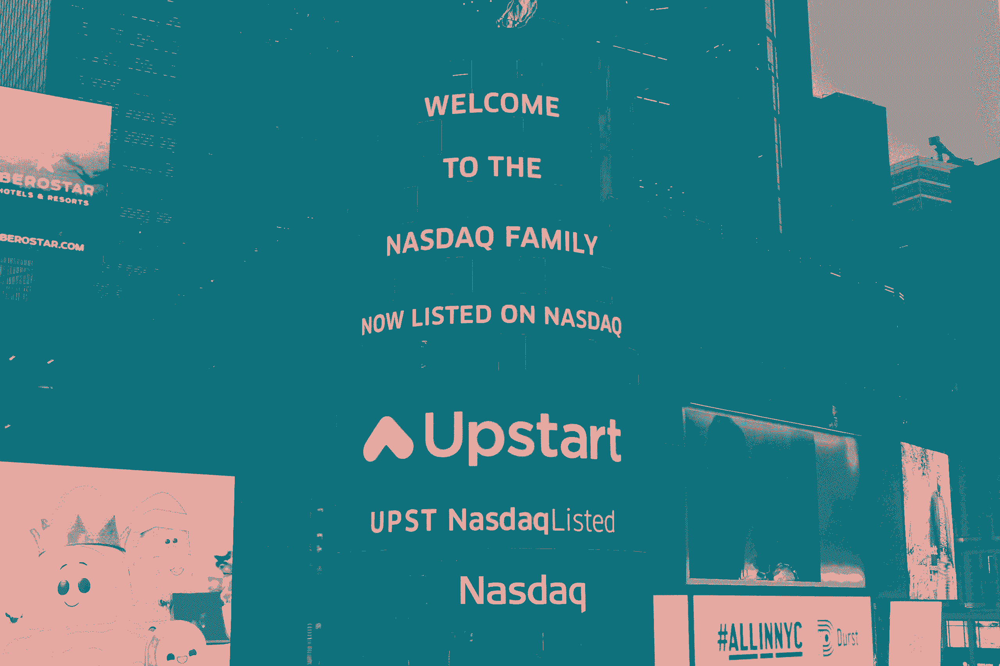
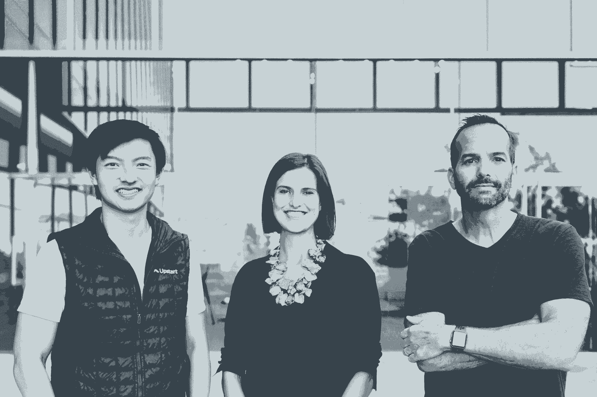
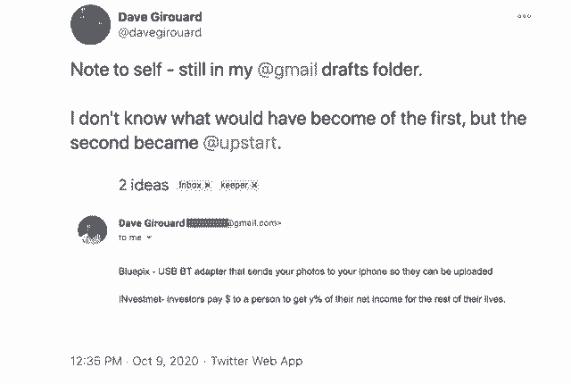
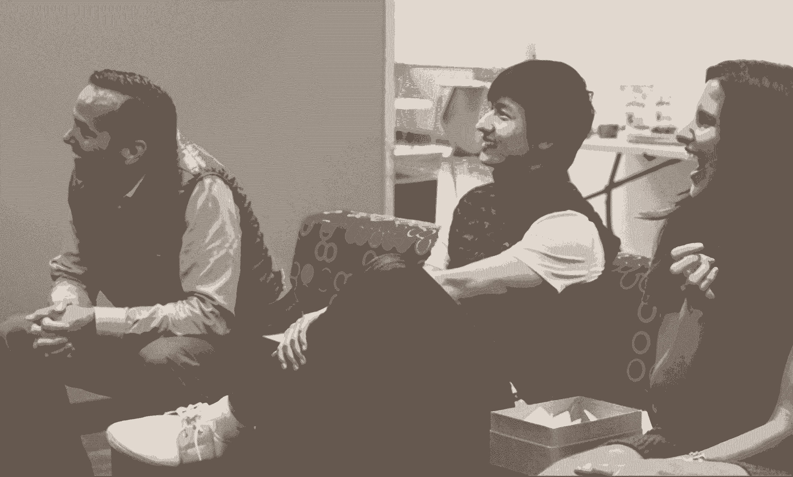
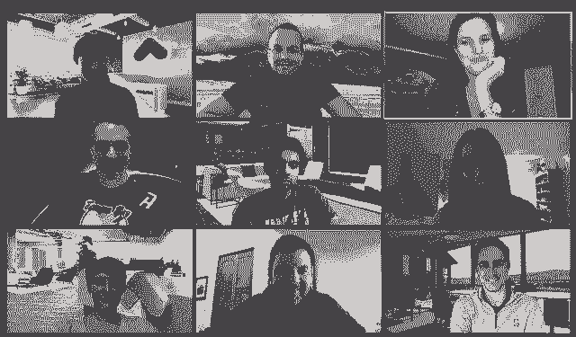
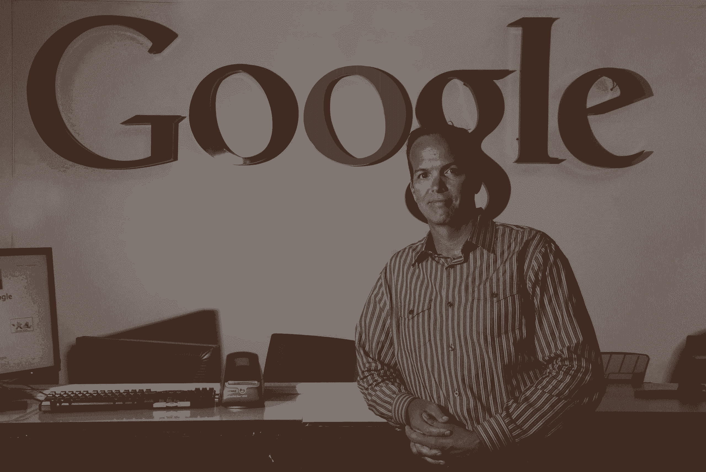

# 首次公开募股后，Upstart 的首席执行官分享了为什么这家初创公司不是一个典型的成功故事

> 原文：<https://review.firstround.com/fresh-off-ipo-upstarts-ceo-shares-why-the-startup-isnt-a-typical-success-story>

## 介绍

上周， **[新贵](https://www.upstart.com/ "https://www.upstart.com/")** 在纳斯达克首次亮相，加入了科技初创公司的行列，这些公司超越了预期寿命，战胜了困难，取得了巨大的成果，度过了成长的痛苦——我们可以继续用比喻，但我们会就此打住。

首席执行官 **[戴夫·吉鲁阿德](https://www.linkedin.com/in/davegirouard/ "https://www.linkedin.com/in/davegirouard/")** 很快指出，期待已久的首次公开募股既不是他的顶点，也不是他帽子上的羽毛，而是征途上的一个里程碑，前面还有很多路要走。“我们现在坐在这里，到目前为止还算成功，但毫无疑问，这是一项正在进行的工作，我来这里不是为了挥舞胜利的旗帜，”他说。

这是吉鲁阿德谦逊的标志。但经过八年的建设，他和他的团队有很多值得骄傲的地方——他们建立了一个人工智能平台，交易了超过 60 万笔个人贷款，扩展到汽车贷款，在 2020 年的前九个月实现了盈利，成长为一个跨越两个办公室的近 500 人的强大组织，是的，实现了很少有创业公司能够活着看到的令人垂涎的 IPO 退出。

虽然 Upstart 在硅谷的雷达下飞行了近十年(稍后会有更多)，但 Girouard 应该是书评读者熟悉的面孔。他详细讲述了如何“挑战时机”和[让速度成为你公司的基石](https://firstround.com/review/speed-as-a-habit/ "https://firstround.com/review/speed-as-a-habit/")。他权衡了评估和向高管提供反馈的困难。就在今年夏天，他写了一本指南，帮助创始人提高写作技巧。

今天，他在这里讲述一个不同的故事——暴发户如何建立的内幕。这是一个关于致力于长期比赛和年复一年保持专注的问题——在第一轮比赛中，我们一直坐在前排。在 2012 年投资了 Upstart 的种子轮之后，[后来领导了他们的首轮融资](https://twitter.com/joshk/status/1339339239545245696?s=20 "https://twitter.com/joshk/status/1339339239545245696?s=20")，我们可以充满信心地说，Girouard 是我们支持过的最顽强的创始人之一。

但在某些方面，Girouard 和公司都不符合典型的创业模式。Upstart 不是那种会抢占头条或者支撑起一个性感品牌的公司。尽管面临着最棘手的技术和筹资障碍，但该团队花了近十年时间悄悄建造了一个人们一直持怀疑态度的空间——而不是你通常在独角兽故事中看到的材料。

至于 Girouard 本人，一方面，他是一名技术老手，在谷歌和苹果等公司有着丰富的经验。另一方面，当他在 46 岁时与更年轻的联合创始人[安娜·库斯曼](https://www.linkedin.com/in/anna-mongayt-counselman-98928715/ "https://www.linkedin.com/in/anna-mongayt-counselman-98928715/")和[保罗·古](https://www.linkedin.com/in/gupaul/ "https://www.linkedin.com/in/gupaul/")(他们的父母恰好比吉鲁亚尔年轻)一起创办新贵公司时，他在硅谷脱颖而出。这三位联合创始人本身也不同寻常——在某种程度上随机配对后，他们从创立到 IPO 一直呆在一起。

我们很高兴有机会与这个团队合作，完成他们令人惊叹的旅程，尽管有时会很曲折——我们特别感谢 Girouard 在 IPO 后的一系列活动中抽出时间与我们坐下来，反思他对 Upstart 不可思议的发展轨迹的看法。

**在这次独家采访**中，Girouard 分享了 Upstart 成功的内幕，以及其他创业公司可以从早期学到的东西，从最初的想法和他们如何实现一个支点，到他所说的为什么他“不擅长融资”他还深入探讨了他对首席执行官角色的看法，包括如何组建一个高管团队，以及他在谷歌期间学到了什么和需要忘记什么。从他的“你是 Airbnb 还是 PayPal？”测试，对于他的“例外管理”哲学和他所依赖的四个心智模型，Girouard 的框架对于不同领域的创业领导者来说都是无价的。

公平的警告——这是一个很长的阅读，但我们认为它提供了一个独特的机会来挑选一个刚将其公司上市的创始人的大脑。希望早期阶段的团队能在这个关于 Upstart 如何建立的战术计算中找到足够的智慧，让我们开始吧。

# 第一步:迈出第一步，组建团队

在他成为新贵之前，Girouard 已经建立了一个令人印象深刻的职业生涯。离开咨询行业后，他成为了苹果公司的产品经理(在史蒂夫·乔布斯回归之前)，在 Virage 公司获得了创业经验(在互联网时代尝试了图像识别软件)，所有这些都发生在 2004 年进入谷歌之前。

在这家科技巨头的八年多时间里，Girouard 将企业应用部门的规模扩大到了第一个 10 亿美元，其中包括从解决谷歌搜索设备的“黄盒”到将 Gmail、谷歌文档和谷歌日历转变为一套产品的一切。

但建立自己公司的渴望依然存在。尽管所有的关键细节仍然模糊不清，但在 2012 年，Girouard 自己闯了出来。在这里，他分享了他是如何思考这一飞跃的，以及他是如何与他的两位联合创始人联系的。

## 明确你的动机，并把风景模式。

Girouard 说，离开谷歌意味着离开很多人。但在听取了他职业生涯早期得到的一些重要建议后，他决定采取行动。

“有人曾经告诉我要以风景的方式来看待你的生活。这是我真正喜欢的东西，”他说。“从左到右，你的生活有很大一部分。是一段时间，对你来说有意义，但不管是什么，在某个时候，你都要打上蝴蝶结，继续下一段。这就是谷歌对我的意义。我开始了后来成为谷歌云的项目，并在相当长的一段时间里建立了它。我认为再过 5 到 10 年可能会令人难以置信，而且肯定会有利可图。但我只活一次——这是我自己要做的最后一件大事吗？作为一个在硅谷开创事业的人，我已经 46 岁了，还从未创办过自己的公司，坦率地说，这是我想要的经历。”

生活是一场线性游戏，你只有那么多时间。

另一个个人挑战激发了这个选择。“我在谷歌干得相当不错，并在那里建立了公司相当成功的一部分，但我不太清楚是因为我还是因为谷歌的魔力太强了，”Girouard 说。

“你可能会说，我在那里做的东西，一只猴子也能做出来，因为这家公司实力雄厚。所以，当然，我自己也质疑过这个问题——如果没有谷歌精灵粉在我身边，我能创造出 10 亿美元或更多的收入吗？”

## 与你的共同创始人和谐相处。

Girouard 在谷歌的时候就开始悄悄地探索这个会成为新贵的想法。但是他很快发现寻找联合创始人的过程很艰难。“我和各种各样的朋友——有些在谷歌，有些在公司外——谈论这两个问题，‘这是我应该做的事情吗？’“如果可能的话，你会考虑和我一起做这件事吗？”伙计，说‘听起来很有趣，但是不，谢谢’的人的数量肯定让我经历了一段时间，‘哇，难道只有我一个人认为这很酷吗？’"

随着一个想法的出现和公司的成立，Girouard 选择辞职来更充分地追求他的想法——没有任何联合创始人。后来他的命运改变了。“就在我离开的时候，我被介绍给了保罗。我们通了电话，他是一个在纽约的孩子，他正在做一些和我想的差不多的东西。我知道他在彼得·泰尔的 20 岁以下青年奖学金项目中，但我记得他告诉我他的父母是如何从中国来的，我问他们多大了，我意识到，‘哦，我的上帝，我比你的父母还老，’”Girouard 说。“他用电子邮件把他的整个模型发给了我，那是一个 Excel 宏。我记得当时在想，‘哇，这家伙一定信任我。然后在一个周五，他飞过来和我一起玩了半天，想知道我们是否可以一起工作——最后他飞回了纽约，并在周一带着他的东西回来了。"

遇到他的另一位联合创始人也是类似的意外。“当我离开谷歌时，我团队中的安娜来到一间会议室，向我道别。她说，‘哦，我喜欢为你工作。这很有趣。老实说，我真的不太了解她。她说，‘你打算怎么办？’“我解释了我的想法，她说，‘太棒了’，这与我得到的其他反应不同，”吉鲁阿德说。两周后，保罗、安娜和我坐在谷歌风投的会议室里。"

Upstart co-founders Paul Gu, Anna Counselman, and Dave Girouard

将近九年过去了，这三个人仍然在一起。鉴于缺乏长期的求爱，Girouard 反思了为什么创始团队一拍即合。他说，相当大的一部分运气使这一切得以实现。“尽管我们各不相同，但我们的感激和包容足以让一切顺利进行。他说:“这并不是说我们从来没有摩擦过对方，而是说我们非常互补。”

“安娜总是会想起我会忘记做的事情。保罗将有一个真正的北方，寻求真理的方法。我是执行死刑的人。我总是问，‘为什么我们现在不这样做？’或者试探我们向前推进和重新考虑。这意味着一个平衡的公司。我们没有计划那样做，因为很明显，在我们决定一起工作之前，我们没有想太多。"

如果你是一个打赌的人，你绝不会打赌这一切都会成功。三个人当场聚在一起并决定建立一家公司通常不是成功的秘诀，但在这里，我们已经过去了将近九年。

抛开 kismet 和他们的差异不谈，Girouard 总结了使他们成为成功创始团队的其他因素:

**明确的角色。我组建了团队，并获得了公司的种子基金。很明显我是首席执行官。Paul 是数据科学专家和技术人员。安娜是一个操作能力超强的人。从最早的时候起，它就没有真正改变过，”Girouard 说。“我们现在有一位工程 SVP，他为我工作。Paul 领导着数据科学和产品团队。安娜负责所有的运营和人事运营。也许其他创始团队可能有更多类似的人，他们根据当天的感受武断地决定如何分割事情，这可能会变成一场冲突。但在我们的案例中，找出谁对什么负责是很自然的事情。”**

**定期保养。至于近十年来这种关系是如何保持的，Girouard 发誓这很简单。“首先也是最重要的是这种非常常规的签到。我们三个总是想出去走走，要么去我们在帕洛阿尔托的咖啡店，要么去散步。他说:“这些会议没有具体的议程，我们也不试图涵盖太多无关紧要的事情。”。“相反，我们试图了解每个人都在哪里——我们的感受如何，什么是重要的，什么让我们担忧。我们认为公司可能会遗漏或暴露哪些方面？这是我们至今仍在做的事情。即使在 COVID 期间，我们也戴着面具，进行社交距离的散步。保持这种仪式一直是公司保持和谐的核心。”**

我们的一位早期员工最终离开了，几年前他给我发了一张纸条，上面写道:“我想我终于找到了新贵创始人。保罗是“寻求真理”戴夫说的是“速战速决”安娜说“带上所有人”“这是对联合创始人个性的最佳概括。

# 创立理念与快速支点

随着团队的到位和旅程的进行，重点转移到充实最初的想法。今天，Upstart 的产品已经发展成为一个令人难以置信的人工智能贷款平台，他们利用这个平台与银行合作，扩大获得负担得起的信贷的机会。但吉鲁阿尔和他的联合创始人安娜·库斯曼(Anna Counselman)和保罗·古(Paul Gu)最初的赌注呈现出不同的形式。

当第一轮合作伙伴关系第一次遇到并支持这三人组时，他们正致力于一个“Kickstarter for people”的想法，人们可以用未来的收入换取众筹个人贷款——这是传统贷款的一种替代方式，传统贷款依赖于 FICO 模型，排除了那些没有良好信用评分的人。

“我们从 2012 年开始开发这种产品，后来被称为收入分享协议，这个名字已经超越了我们的业务。这是公司的创始理念，”Girouard 说。“我们感觉开始得相当快。我们正在取得进展，我们正在证明我们的假设，而且[我们上了《纽约时报》](https://www.nytimes.com/2013/06/08/your-money/upstart-matches-young-people-with-investors.html?searchResultPosition=4 "https://www.nytimes.com/2013/06/08/your-money/upstart-matches-young-people-with-investors.html?searchResultPosition=4")，所以在最初的日子里我们感到乐观。我们一直认为它将在下个月或下个月开始扩展。”

但是规模没有达到。在[找到适合的产品/市场](https://firstround.com/review/how-superhuman-built-an-engine-to-find-product-market-fit/ "https://firstround.com/review/how-superhuman-built-an-engine-to-find-product-market-fit/")之前,“这件事会有进展吗？”问题重重地悬在早期团队的头上，新贵团队在这个关键的转折点上努力寻找答案。在这里，Girouard 分享了他们是如何修正路线并最终找到了一条规模化的道路。

## 参加 Airbnb 与 PayPal 的测试，在门口寻找成群结队的人。

"**硅谷有这些故事，你不知道哪个故事适用于你**。我的意思是:有一个关于 Airbnb 的故事，他们采用了这种商业模式，但没有成功，但他们只是不停地转动旋钮，修复它，让它闪闪发光。最后，是[给纽约的公寓拍照](https://firstround.com/review/How-design-thinking-transformed-Airbnb-from-failing-startup-to-billion-dollar-business/ "https://firstround.com/review/How-design-thinking-transformed-Airbnb-from-failing-startup-to-billion-dollar-business/")让它正常工作。所以 Airbnb 的版本是，‘坚持住，伙计。Girouard 说:“只要不断地擦亮它，修复它。

“另一个是贝宝的故事，他们在一年内有八个商业模式，直到他们找到一个可行的。这里的教训是，“只要不断迭代和尝试不同的东西，直到你找到有用的东西。”所以我们不知道我们是 Airbnb 还是 PayPal，还是别的什么。我们不得不阅读茶叶。这是一件“全力以赴完成任务”的事情吗？或者是，“伙计，这是个坏主意。我们需要尝试些别的东西，什么东西？很长一段时间，我们都在 Airbnb 模式上。我们认为我们只需要修复它。这是一个伟大的想法，人们喜欢它，只是没有规模。我们会不断尝试去除这种边缘，或者在不放弃最初概念的情况下，让它感觉更主流一点。"

当然，这个难题困扰着 Upstart 的种子期董事会。“有很多关于它的谈话，但最清晰的记忆是在一次董事会会议上，Josh Kopelman 对我说，‘你知道，当第一轮投资开始时，我记得你告诉我会有很多人来买这个产品。我不认为这里是这样的——**大门口有成群结队的人吗，戴夫？**‘我说，‘不，乔希，大门口没有成群结队的人。’Girouard 笑着说。

“这是承认**当我们展示数字和进展时，我们试图谈论我们还没有完全搞清楚的事实**。我们原以为收入分成会像疯了一样迅速发展，但实际上并没有。”

对于 Girouard 来说，这是一个催化的时刻。“就在第二天，我和我的联合创始人去了帕洛阿尔托的一家咖啡店，我说，‘看，我们还有六个月的现金。我们需要采取激进的举措，因为我认为未来几个月我们不会发现任何改变我们发展轨迹的东西。"

它在一个小的水平上工作，但是没有扩大规模——而且还有六个月的现金，没有任何迹象表明它会扩大规模。最终，我们得出结论，转动接下来的两个旋钮不会突然变魔术。

“幸运的是，这是一个手套保存。效果非常好。我们当时还是一个小团队，大概有十几个人。Girouard 说:“在和我的联合创始人喝完咖啡后的几个小时内，我们就开始采取行动，让它成为现实。“有一些微妙之处需要弄清楚，我们确实在那里做了很大的对冲，但无论如何，我们行动非常迅速——几个月后，业务已经完全从这种收入分成协议转向一种简单的贷款产品。”

## 不要害怕踏入人群，烧毁船只。

说到支点，有两种类型:全面重启(想想 Twitter 上的 [Odeo](https://en.wikipedia.org/wiki/Odeo "https://en.wikipedia.org/wiki/Odeo") 和 Slack 上的[小斑点](https://en.wikipedia.org/wiki/Slack_Technologies "https://en.wikipedia.org/wiki/Slack_Technologies")，以及 20 到 30 度的旋转，在这种情况下，公司会提出一个独特的想法，并将其付诸实践。暴发户属于后一类。

“这不是‘扔掉一切，重新开始’的情况。Girouard 说:“这是从我们试图创造的东西向与之密切相关的东西迈出的一步，最终是消费贷款。”。“真正的问题是，我们不知道自己在借贷市场上是否有立足之地。虽然我们采用了一些真正不同的数据科学，但当时我们不知道这是否足以与当时一些非常成熟的公司形成可持续的差异。”

我们从试图在白板上创造一个新市场，到步入一个竞争异常激烈的市场。这是一种完全不同的动力，但对我们来说却是一种更好的动力。

又一场斗争？计算出转弯有多难。“我们必须决定如何处理我们已经造好的这个东西。我要说，我对我们经历了一段决定保留两者的时期感到有些惭愧，”Girouard 说。“我们仍然非常喜欢最初的想法，我们最初认为，当客户来找我们时，他们可以获得收入分成协议或贷款。所以我们花了几个月的时间来构建它，并投入了大量的精力试图让这两种产品共存。那是树篱。我们并没有完全烧毁船只。”

但贷款产品的推出让前进的道路变得清晰。“人们对此的兴趣和关注度如此之高，以至于三天后，我们就停止了 ISA 产品的生产。他说:“我们或许可以完全放弃它，这样可以节省一些时间。”。“有很多事情要做。就公司重组和围绕贷款产品的所有法律问题、我们必须建立的银行合作伙伴关系等等而言，这是一个高风险的行为。我只记得快速活动和强度。在一个圣诞节假期，我和 20 家不同的银行谈了与我们合作的事情，只是微笑着拨号。但幸运的是，贷款产品马上就开始起飞了，这真的拯救了公司。”

# 赌注和挑战:在雷达下飞行和从怀疑论者那里筹款

“我们有一个核心论点，即如何在我们非常非常早就开始的类别中建立更好的东西。Girouard 说:“在金融科技和借贷领域，有各种各样不同的事情在发生，有好有坏，但我们对此视而不见。在这里，Girouard 讲述了新贵团队在他们的类别、外部叙事以及他们的筹款工作中遇到的挑战。

## 类别:

从严格的监管和消费者的看法，到一些贷款机构错综复杂的过去和缺乏信誉，这是一个很难建立的行业。这个新贵团队面临着艰难的战斗，既有在他们的类别中更普遍的经营，也有他们所做的具体赌注。

“谈到贷款，我认为全世界都得出一个结论，那就是贷款是一种商品——如果你有钱并具备一些基本的分析能力，任何人都可以贷款。而且做的好的话会有一些收益，做的不好的话很可能就没收益了。但不管出于什么原因，人们似乎不相信你可以应用现代云计算和数据科学来创造一个显著更好的产品，”Girouard 说。

“人们会说，‘是啊，你的贷款模式真的会更好吗？’这几乎就像他们学到的关于计算机科学和软件潜力的一切，当他们看到一个与贷款相关的业务时，他们扔掉了窗户，并说，'不，那只是人类本能的业务。世界上所有的软件和数据都不会有什么影响。他说:“我觉得这是业内一些人至今仍在思考的方式。

## 叙述:

这一挑战使得 Upstart 很难塑造出一个脱颖而出的品牌。“**说实话，我们经历过这样的时期，无论是对媒体还是风投来说，都不值得和 Upstart 谈，因为赢家已经赢了。然后，当世界发现赢家** ***没有*** **赢的时候，它仍然不值得与新贵交谈，因为坦率地说，这个行业看起来像一场灾难。我们似乎无法让世界上的大多数人相信这真的是非常不同的东西。我认为我们这种感觉持续了*年*，”Girouard 说。**

无论是媒体、硅谷社区，还是投资者，我们从未真正得到外界对我们所做事情的有力认可。相反，公司内部有一种强烈的信念，即我们正在做一件非常好的事情，即使世界上的其他人还没有完全搞清楚。

坦率地说，我们总是在雷达下飞行。老实说，这常常让人很恼火。我觉得对于这些大品牌和名人来说，我们是某种形式的配角。但我们有一个非常强大的理论，知道什么是更好的产品，我们知道需要相当长的时间来证明这一点，所以我们准备并愿意在雷达下做这件事，对真正的北方是什么以及我们如何取得进展有一个真正敏锐的感觉。”

这种外部叙事对新贵建筑内部产生了影响。“在没有大量外部认可的情况下，要让一个团队充满动力并不断前进需要付出很多努力。Girouard 说:“特别是当你有内部闲置渠道的时候，像 X 公司这样的分享文章刚刚筹集了 Y 亿美元的资金。“不管出于什么原因，有些公司在给世界留下印象方面比我们强得多。”

有几件事我们坚持不懈，勇往直前，其他的事情我们都非常灵活。这是保持那些眼罩，不要被闪亮的明星或其他人在行业中所做的事情分散注意力，而是只相信我们的中心论点和我们正在努力实现的目标。

尽管如此，这并不容易。“坦率地说，每周在[TGIF](https://www.thinkwithgoogle.com/future-of-marketing/management-and-culture/passion-not-perks/ "https://www.thinkwithgoogle.com/future-of-marketing/management-and-culture/passion-not-perks/")上面对问题，并不断告诉团队，‘不要担心不是独角兽，这实际上并不意味着什么’，或者‘我们实际上认为我们没有筹集到那么多钱是件好事’，这是一场斗争，”Girouard 说。

The co-founding team at a TGIF meeting

## 筹款:

谈到融资，Girouard 强调融资是新贵面临的另一大挑战。乍一看，这似乎令人惊讶——该公司资本充足，在所有阶段都有许多知名公司作为投资者。

但对于幕后的 Girouard 来说，这是一个痛处。毫无疑问，筹资是建立新贵公司最困难的部分，我一点也不擅长。直到今天，如果我不得不重新来过，我可能还是会搞砸。这是我工作中最无趣的部分，”他说。“我的早期投资者之一，[大卫·魏登](https://www.linkedin.com/in/davidweiden/ "https://www.linkedin.com/in/davidweiden/")，认为**在建筑公司和筹资**之间有一种强烈的、颠倒的关系。他对我说，‘戴夫，你擅长建立公司。你可能不太擅长筹集资金。这完全是真的。这总是一场斗争，要么是因为我不喜欢它，要么是因为人们认为别人已经是赢家，要么是因为这个类别很烂，他们不想把钱投入其中。需要说明的是，上一次轻松融资是在 2012 年我离开谷歌的时候。"

为了更好地说明他奋斗的根源，Girouard 举了另一个例子。“我认为我们正在筹集我们的 b 轮融资。尽管第一轮已经是投资者了，但乔希提出我们可以在合作伙伴面前展示，作为一种练习，以获得他们所有的融资反馈，这将有助于我们，”他说。“所以保罗和我去旧金山在第一轮合伙人面前做了一场表演。我仍然记得我们得到的反馈，因为**虽然很有帮助，但也很尖锐。其中一位合伙人写道:这些人看起来很聪明，但他们不是吹笛手，所以我不知道他们是否能吸引足够多的追随者。我记得我在想，‘哦，这太他妈真实了。’”Girouard 笑着说。**

考虑到这是为什么，他提出了这个理论:

如果你在寻找一个疯狂的、有远见的创始人，我想没有人会这样形容我。我看起来像创始人出轨时你带来的 CEO。

“你可以问风险投资界——他们中的大多数人多次对我们说不——但我认为我们不像是典型的创始人。我们看起来不像是那种会创造巨大事物的人。这听起来很奇怪，但我认为我们没有任何疯狂之处，”他说。“虽然保罗才华横溢，但他非常低调。我记得我参加了这些筹款会议，并告诉保罗，“不要对自己太恭敬了。就说，‘太不可思议了。就用那个词吧。这一直延续到公司的个性中。“最终，这意味着你会找到欣赏这一点的投资者，”Girouard 说。

他还指出，如今很多关于融资的讨论都与创始人的实际经验不符。“我对那些写博客谈论处理多份投资意向书的挑战，或发推特谈论采访潜在投资者并与他们一起做练习以了解他们可能会如何表现的创始人摇头。我的反应是，“你疯了吗？”大约 0.01%的创业者都有这样的问题，他们会收到太多的投资意向书。Girouard 说:“为了帮助剩下的 99.9%，当你拿到投资意向书时，拿着那该死的钱，没问题。

# 高管团队:找到管理风格并做出正确的聘用

将品牌和筹款的挑战放在一边，从我们第一轮的角度来看，Girouard 的明星可能在他如何管理他的执行团队和设定首席执行官的基调方面最闪耀。

他关于[评估并向高管提供反馈](https://firstround.com/review/how-does-your-leadership-team-rate/ "https://firstround.com/review/how-does-your-leadership-team-rate/")的建议中的这一段值得重温:*“首席执行官们每小时都面临着大量的挑战和问题。我们经常被如何分配我们的时间、哪些领域需要更密切的关注以及是否值得花费我们的时间的决定所困扰。与许多人认为的相反，当你的公司表现良好时，这一点不会改变——每一个辉煌的时刻都是短暂的，很快就会被下一场迫在眉睫的危机和达到下一个成功水平的需要所吞噬。”*

为了更深入地了解他是如何平衡这些限制的，Girouard 解开了他的管理哲学，并详细说明了他对建立管理团队的想法。

## 观察机器，异常管理。

Girouard 对于如何扮演 CEO 的角色有自己独特的哲学。“每位首席执行官的工作方式都不一样。可能有许多风格，但我倾向于简化为两种:一种是埃隆·马斯克(Elon Musk)或史蒂夫·乔布斯(Steve Jobs)式的风格，在这种风格中，你处于所有事情的中心，你的影响体现在每个决定上。这一点也不消极——苹果和特斯拉是历史上最成功的两家公司，而拉里和谢尔盖在谷歌的表现则不同，”他说。

“第二是我的例外管理哲学。对于 Upstart，**我有这样的想法，我试图建立一个在我离开后还会存在很久的东西。所以我觉得[应该尽可能在公司最底层做出决定。我应该做只有首席执行官才能做的事情。如果我不得不为他们做别人的工作，我总是问他们为什么。“如果我不得不做出一个我认为我的员工应该能够做出的决定，我会想为什么会这样，”Girouard 说。](https://firstround.com/review/speed-as-a-habit/ "https://firstround.com/review/speed-as-a-habit/")**

“这并不意味着我只想放松一下，看看 TechCrunch 或第一轮评论。相反，我想思考公司是如何运作的。**例外管理的概念是，我试图打造一个运行良好的引擎。我想观察它的运动，我想说，‘它是不是以它应该发生的方式发生了？’？Girouard 说。**

“那台机器需要高管级别的非凡才能。它需要良好的指导和协调。它必须不断成长、成熟，并在工作中做得更好。我希望为我工作的人感到压力很大，并且在这样一个地方，他们中的许多人都可以接替我的角色，公司真的不会错过任何机会。”

作为 CEO，如果有人给我带来了问题，我当然总是急于解决它。但我总是会想，‘这个问题是怎么产生的？’？它是怎么来到我身边的？那么*我应该得到它吗？*

Girouard 举了一个例子来说明:“几周前，有人找到我说，‘嘿，我想向 X 投资一些钱。我不确定 Upstart 是否真的准备向 X 投资，但我认为我们应该这样做。戴夫，你能批准吗？我说，‘我不想批准这件事。有很多其他人会对此表示赞同。你不需要问我，”他说。

“不要误解我——如果我不喜欢我们正在做的事情，相信我，我会很难相处。我在任何意义上都不是被动的。**我的理想情况是，我有一个出色的团队，做正确的事情。我提供帮助、建议、评判，偶尔打破僵局**、**，但最终，这家公司是一台运转良好的机器，知道如何做它该做的事情。**”

## 在 UBR 和 burners 处于低位的情况下运行管理团队。

为了给机器加油，Girouard 依靠敏锐的观察力和领导团队的定期维护检查。“我一直在观察整个公司的情况。他说:“有些领域，我觉得它在嗡嗡作响，而有些领域，我觉得我们在磕磕绊绊，或许我只是对它没有足够的了解。”。

“如果公司的某些部门过度紧张，我想帮助他们摆脱这种状态。如果公司的其他部门压力不足，没有真正努力，我想更深入地探究他们在努力做什么。”

为了促进这种探索，Girouard 依靠他每周的执行人员会议。“我不喜欢和他们争吵。我们没有检查很多项目。他说:“当管理人员聚在一起时，实际上是把机器作为一个整体来讨论——哪些部分在工作，哪些部分没有工作。

The Upstart executive team on a virtual staff meeting.

“我倾向于做我的首席财务官 **[桑杰·达塔](https://www.linkedin.com/in/sanjay-datta-26813a133/ "https://www.linkedin.com/in/sanjay-datta-26813a133/")** **所说的 UBR——无组织的老板漫谈**——在每次高管人员会议开始时，分享我观察到的和担心的事情的首要想法，”吉鲁阿德说。“通常情况下，我可以介绍一两个已经在我脑子里的想法，希望能让他们中的一些人认为，‘哇，也许那会是一个问题。’我倾向于思考一些其他人都不太关注的事情——我会降低这些问题的关注度。"

作为首席执行官，通常只是观察或思考一些别人可能还没有意识到的事情——你是一个主要的担忧者，慢慢地让公司需要解决的问题成为焦点。

## 依靠推荐人而不是面试来建立管理团队。

当然，世界上所有的维护都不会让一台由故障零件制造的机器增压。在创业界，首席执行官招募、留住和激励优秀高管的能力仍然是一个未被充分探索的话题，因此我们渴望听到 Girouard 的观点。

“**我想不出一个首席执行官做的任何事情，比把团队聚集在你周围更重要****——这非常困难**。刚刚和我的联合创始人聊天，我得出了一个结论:当你招聘高管时，**如果你有 50%的机会做对，你就做得很好。这听起来很可怕，但在成长型企业中招聘高管极其困难。有时候，你真的认为自己做了所有正确的事情，但即使尽了最大努力，也没有用。坦白地说，我已经错了很多次，”Girouard 说。**

“当你建立一个强大的团队时，你总会有一些部分比其他部分更强大，这将把你带到需要增加力量的决策点。他表示:“这需要痛苦的过程，无论是将某人调离，还是经历 6 至 9 个月的招聘过程，最终都没有结果。

当被问及如何度过这个痛苦的过程时，Girouard 给出了这样的建议:“我的第一个想法是面试过程不是特别有帮助。这是有帮助的，因为当你雇佣一名高管时，你必须得出这样的结论:这是一个你想与之相处很长时间的人，一个你直觉上觉得能与之共事的人——但这并不意味着他们和你相似。所以，如果你和某人一起经历了一个过程，你准备花更多的时间和他们在一起，这是一个好迹象，”他说。

“但就他们是否会成功以及他们有多强而言，面试很难证明这一点。我相当确信有些人非常擅长面试。即使你对如何组织面试和你问的问题考虑得非常周到，以我的经验来看，他们迄今为止所做的事情和他们所看到的成功是他们在你的情况下会做什么的更好的预测。”

当然，这引发了我们的好奇，Girouard *认为*在高管招聘过程中什么是有价值的信号。“人们可能会认为这是一个落后的答案，但我觉得我能从高管候选人的推荐信中学到更多东西。”

我不认为推荐人作为招聘过程中的最后一个复选框有任何意义。坦白地说，你通常在那之前就已经做出了决定——你试图通过反复检查一些事情来让自己感觉良好。

以下是 Girouard 如何提高推荐人的效率:

找出他们的忠诚所在。“在做推荐之前，问自己一个基本问题:‘我将要推荐的这个人——他们的忠诚度在哪里？显然，如果你不知道候选人给你介绍了谁，这个问题有一个简单的答案。现在，这并不是说这已经成为一个毫无价值的参考。作为理解和记忆的起点，这很重要，”Girouard 说。

**问一些中性的问题来引出信息。你可以从几乎任何人那里获得很多有用的信息，甚至是那些给你好评如潮、似乎没什么不好说的人。Girouard 说:“我发现的诀窍是问一些中性的问题，没有一个答案能描绘出更好的画面。“例如，你可能会说，‘我们正在考虑让 Sally 担任几个不同的角色，其中一个在分析角色中需要更多的独立工作，这需要大量的脑力和创造力，而另一个则更加面向团队，她必须在跨职能部门中工作出色。’Girouard 指出，如果他们选择分析型、个人风格的角色，那么你已经学到了一些东西，可以双击。**

**直言不讳。**“大多数人都不想撒谎。Girouard 说:“我知道，当我给那些我有不同看法的人提供参考时，我总是告诉自己，‘我不会撒谎，但如果他们没有问正确的问题，那是他们的问题。’”当你是打电话给推荐人的人时，为了避免这种倾向，有时你必须更直率。“我最喜欢的一句话是，‘你会毫无疑问地再次聘用这个人吗？’如果这个人说，“是的，无论如何，我都会再次雇用这个人，”我会说，“太好了。这个回答不错。你为什么没有？如果他们有所保留地回答，那么你可以问，“在什么情况下你会这样做，在什么情况下你不会这样做？”"

说到推荐人，你不一定要找出这个人在这方面很糟糕或者擅长那方面——你只是想描绘一幅画面，看看你看不到的东西。问一些中性的问题会迫使推荐人透露一些你可以利用的线索。

# 领导者的旅程:晋升为首席执行官

但首席执行官的角色不仅仅是管理高管团队、做出决策和增加关键员工。[这需要进化](https://firstround.com/review/nerdwallets-ceo-on-navigating-the-shift-from-first-time-founder-to-seasoned-exec/ "https://firstround.com/review/nerdwallets-ceo-on-navigating-the-shift-from-first-time-founder-to-seasoned-exec/")，当你从更细微的细节退一步，专注于更大的图景，推动你的思维，支撑弱点时，这种进化就会到来。在这个故事的最后一段，Girouard 回顾了他作为一名领导者的个人成长和演变。

“当我离开谷歌的时候，我手下可能有 1000 人。突然之间，当我开始创业时，我什么都没有了，”他说。“但我发誓，当我们接触到五六个人时，令人惊讶的是，差别并没有那么大。这听起来真的很奇怪，但有一些共同的元素——在 Upstart 的早期，我们必须弄清楚下一步该做什么，我们必须做出决定，我们必须足智多谋。我在谷歌尝试开发企业应用时，情况非常相似。Girouard 说:“我觉得我不像在通用电气，我们在那里也必须有创造力和创新精神。

Dave Girouard, back in his Google days.

他举了一个例子:“你可能还记得[谷歌搜索工具](https://www.wired.com/2012/10/google-search-appliance/ "https://www.wired.com/2012/10/google-search-appliance/")。甚至在谷歌应用程序出现之前，我们就卖了这个黄色的盒子，我们决定做一个便宜又令人愉快的版本，我们最终称之为谷歌迷你。Girouard 说:“这种产品只有几千美元，所以你不能让销售人员以同样的方式销售。”“我们不知道如何在网上销售，所以我们把谷歌迷你放在了 t 恤店里。这是一个小型电子商务网站，由密苏里州某处的一家小公司主办，在那里你可以买到熔岩灯、谷歌 t 恤或谷歌迷你。这就是我们如何让产品运转起来的。”

## 学习和忘却你带来的东西。

正如 Girouard 发现的那样，在[从大到小的转变](https://firstround.com/review/navigating-the-leap-from-big-tech-to-startups-advice-from-a-former-google-and-flipkart-exec/ "https://firstround.com/review/navigating-the-leap-from-big-tech-to-startups-advice-from-a-former-google-and-flipkart-exec/")中的一些教训很好地映射出来，而其他的习惯他必须抛弃。“甚至当我去谷歌的时候，我已经存在了相当长一段时间，”他说。“但是拉里和谢尔盖在质疑和挑战你对这个世界应该如何运转的每一个假设方面是如此的突出，”吉鲁阿德说。“你所学到的关于如何制定产品路线图、如何指定需求、如何倾听客户意见的一切，你都可以直接撕掉那些行动手册。他们对自己的直觉和提问的能力充满信心，并以完全不同的方式做事。这就是谷歌之所以是谷歌的神奇之处。”

当然，Girouard 吸收了这种思维方式。“我花了一段时间，因为如果你 22 岁，你出现在谷歌，然后说，‘该死，这太棒了’，这就更容易了。”但我已经 30 多岁了，所以对我来说，这就像是，'哇，我需要忘掉一堆东西。'但我在那里的时间够早够长，以至于我开始欣赏从基本原则开始的想法，质疑事情，而不是真正接受任何事情是应该做的。"

你不必从任何人那里继承解决方案、想法或偏见。你有自由，尤其是作为一个创始人，跟着感觉走。

但当他离开去创办 Upstart 时，Girouard 注意到了一个可能阻碍他的模式。“在谷歌，整个公司，包括我自己，都非常尊重拉里和谢尔盖的想法。你很自然地会说，‘拉里和谢尔盖怎么想的？’？我这样做对吗？”吉鲁阿德说**但当我离开谷歌时，我不得不在一夜之间扭转这种局面。我需要成为拉里和谢尔盖——这并不是说我想拿自己和他们相比，而是说我不能对任何人毕恭毕敬。作为一名创始人，我需要有意志力和主见。"**

至于他如何在初创公司 whetstone 上磨砺意志的力量，Girouard 打开了他的工具包，分享了他开始依赖的四种心智模型或内部练习。

## 练习 1:想象公司两年后的样子。

然而，设想这种未来状态并不是一个过程。“还没量化。这就像看着墙上一堆柯达彩色****的老派照片。**我们正在走这条路，如果我们在这条路上成功走了两年，事情看起来会很自然，感觉也会完全不同。我们的人民感觉如何？公司是什么感觉？世界是如何感知我们的？”他说。“我甚至不把它们写下来。这只是我脑海中的一些简单的图像，你很少能看到。”**

**下面是他的意思的一个例子:“**我可以想象在一个地方，我们的品牌突然变得非常大——那会是什么感觉，会与我们今天的情况有什么不同？或者一个地方，我们在六个类别中，而不是一个或两个。或者我们是一家全球性公司，而不是美国公司。**然后每一天，都令人失望，因为我们不是那样的人，所以每一天都在试图找出如何从这里到那里。”**

**当然，如果没有水晶球的帮助，这种观点永远不会正确。“这不是很清楚；它是有方向性的。Girouard 说:“这是一种情绪，一种如果一切都按照你的梦想进行，会是什么样的感觉。“我正在努力缩小差距，但如果没有不同的人担任这一职务，或者没有我们今天没有的这种关系，我们可能无法实现这一目标。所以有时它确实会具体化，但这是一个非常模糊的概念。”**

**专注于公司几年后会是什么样子的模糊想法。**

## **练习 2:WWYRD——你的替代者会怎么做？**

**“我投资的另一个心理练习是**思考如果明天我的董事会开会并解雇我会发生什么事情**，”Girouard 说。**

**“如果他们说，‘戴夫，谢谢你的参与。你完了。我们正在为 Upstart 招聘一名新的首席执行官。他们出去找了世界上最好的 CEO，一个只会让我看起来像个傻瓜的人。如果他们把她带进来，让她在 Upstart 开始工作，她会和我做什么不同？ **我想了一会儿，然后我告诉自己，** ***你到底为什么不做那些事？“这只是我玩的一个奇怪的游戏，让我自己认识到，当我在做一些事情时，我可能会被哄骗到一个自我感觉良好的地方，而我可能在其他事情上做得不是很好。"*****

## **练习 3:点击红色的大按钮。**

**“另一个是当事情爆发，问题突然出现时，处理压力的方法。Girouard 说:“我在谷歌的时候经常遇到这种情况，现在在 Upstart 可能没那么频繁了，但是当事情堆积如山，你的应对技巧几乎到了山穷水尽的时候，我就有了一个重置按钮的心理模型。**

**“实际上就是我脑袋里的这个红色按钮，我按下了重置键。我告诉自己，‘我要重新开始。没有解决不了的问题。我们也不会建造核电站，所以没有人会死。我要一个一个的思考这些问题，认识到没有一个是要我们命的，每一个都是可解的。精神重置按钮可以清除一切，这是我奇怪地依赖了很多很多年的一个技巧。"**

**有时候你只是需要脑子里的小心智模型来管理自己作为 CEO 的心理。**

## **练习 4:融合你的老板。**

**“每当你生气、安静或沮丧时，你的真理就会出现。Girouard 说:**成为一名首席执行官的艺术在于能够在事情发生之前跳出自我，看清自己。****

**虽然说起来容易做起来难，但他分享了自己强迫接受外部观点的心理技巧。“每当我与某人进行一对一会谈时，我会对某些事情感到愤怒，**我会想起我过去的老板或导师，我会想他们会如何处理这件事**。在你的职业生涯中，你会看到不同性格类型的人都非常成功。你必须考虑什么是适合你的组合，你在哪里可以真正加强自己。”**

**例如，Girouard 分享了他经常想到的三个人:**

**Girouard 说:“ [Paul Lego](https://www.linkedin.com/in/paulglego/ "https://www.linkedin.com/in/paulglego/") 是我在谷歌之前加入的一家小公司 Virage 的首席执行官。“我和保罗一起面试苹果公司的某种产品经理职位，我记得面试开始五分钟时，我知道我可以用生命信任这个人。这个家伙让你在几分钟内感受到了那种联系和信任，这让我印象深刻。这是一种非凡的品质，一种我希望自己拥有的品质——我不敢自称。”**

**“我在谷歌的第一个老板是[奥米德·柯德斯塔尼](https://twitter.com/omidkordestani "https://twitter.com/omidkordestani")，他是谷歌第一个真正的商业人士。每当我度过最糟糕的一天，试图让他们在企业云真正成为今天的样子之前关注它，我记得每次我会见 Omid 时，我都感觉好了一千倍。他甚至没有注意到我的生意，但他知道如何让我对我所做的事情感觉更好。这种令人振奋的精神是我希望能拥有的。”**

**“我在谷歌的另一位老板是尼科什·阿罗拉，他是一个非常不同的性格类型。他不那么热情和模糊，但却是一个不可思议的高管，能够以非凡的水平完成工作和表演。他刚刚打碎了玻璃。他对人很严厉，但他几乎可以牺牲自己。值得称赞的是，他愿意不需要每分钟都被爱。我尊重这一点。我不知道这是否是我所向往的模式，但从中可以学到很多东西。”**

**Girouard 说，在他作为 Upstart 首席执行官的角色中，思考一下他在职业生涯中从其他人那里学到了什么，这正好挽救了这一时刻。“这是我所能做的最好的事情——试着总是为自己创造一些距离，这样我就可以成为一个更中立的观察者，并防止自己做一些可能不会很有帮助的事情。并不总是管用。Girouard 说:“有时候，情绪会占上风，你的本能会表现出来，你就是你。**

**但我认为每一个有思想的领导者都可以先尽力管理好自己。如果你真的试着发挥自己最好的一面，你会意识到任何情况下都有另一种方法。**

***这篇文章是对戴夫·吉鲁阿德在我们的新播客《深度》中的主要观点的编辑总结如果你还没听过我们的节目，一定要来看看这里的**。***