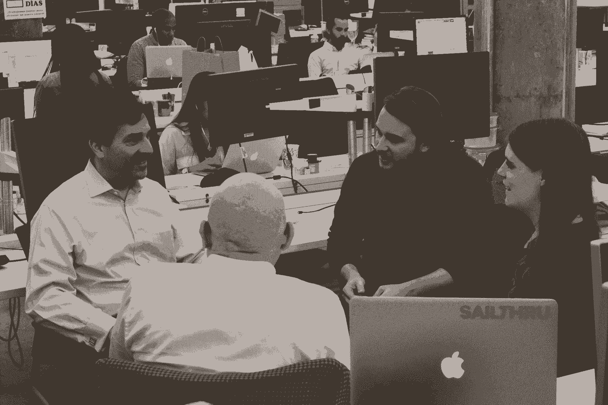

# 从 C++到 C-Suite:软件工程如何让我成为更好的执行官

> 原文：<https://review.firstround.com/from-c-to-the-c-suite-how-software-engineering-made-me-a-better-executive>

尼尔·卢斯蒂格 在职业生涯的早期，他面临着一个选择:是继续快速晋升为 IBM 卫星办公室最有前途的工程师之一，还是在纽约这个更大的城市担任初级销售职位。他的老板告诉他，此举将结束他在公司和行业内的职业生涯。但是他的导师提出了相反的观点。他说，没有接触过业务的技术和商业方面，他就遇到了天花板——如果没有经历过所有的活动部分，他永远不会领导。这位导师曾是一名工程师，当时管理着一个 7000 人的团队。

卢斯蒂格调到了纽约，并在销售方面蒸蒸日上。他发现他的工程才能使他能够以一种激励人们行动的方式来解释技术。他与花旗银行等客户达成了百万美元的交易，并在六个月内完成了年度配额。多年来，卢斯蒂格步步高升，最终在[娄·郭士纳](https://en.wikipedia.org/wiki/Louis_V._Gerstner_Jr. "null")执掌期间领导了 IBM 的电子商务解决方案部门。此后，他加入的每一个团队都让他承担了更多的责任:作为 Ariba 的总经理——在那里他帮助公司转向了云计算——到 Vendavo 的首席执行官兼总裁，到领先的跨渠道体验管理平台 Sailthru。

在这次独家采访中，Lustig 分享了他的管理代码是如何从他的编程生涯中获得的，以及如何通过汲取这些专业知识，他已经成长为一名更有效的经理。他概述了日常工程实践，这些实践不仅帮助他从战略上指导公司，还培养了领导所需的“软技能”。

# 分解以便指导

像团队和公司一样，产品是解决复杂问题的系统。当 Lustig 第一次从个人贡献者跃升为经理时，这是他的一个重要认识。为了应对他的新挑战，他依靠分解或分解，将复杂的系统分解成更易于处理、处理和解决的组件。对于 Lustig 来说，这也是强大的管理哲学。

当 Lustig 在 Ariba 开始他的第一个全球职位时，他从纽约的销售主管转变为负责整个欧洲的财务、销售、营销、专业服务和支持。“我不知道自己在做什么。他说:“带领 10 个国家的团队——他们说着不同的语言——是势不可挡的。“我回到了我作为工程师时使用的基于团队的软件开发方法:你不能在一个连续的流中编写一个新系统。你尽可能深入地把它分解成子问题，然后依次解决每一个问题。当 CEO 也是一模一样。在这种情况下，我制定了计划，并从客户满意度开始，因为产品方向和保持我们的增长率取决于对这一点的理解。这带来了挑战，也提高了我们在整个组织内集中和协调努力应对挑战的能力。”

分解不仅在系统被分解成部分时最成功，而且在这些部分是模块化的并且可以维护时也是最成功的。在领导者的情况下，这意味着每个组成部分——在这种情况下，团队领导者——都是有能力的，可以独立行动。当他为 Ariba 监管欧洲时，Lustig 在伦敦的头几周深入研究了每个团队面临的挑战并揭示了原因。“你的首要任务是全面理解这个问题。然后，开始保理。通过向您的团队提出开放式问题来深入了解问题的各个方面，例如“我们为什么会失去这笔交易？”或者‘这位顾客为什么不高兴？’因为它们鼓励并产生完整、真实的答案。我最喜欢问的问题是“你怎么知道——是什么数据或见解推动了你的决策？””他说作为一名领导者，很容易就问出一些问题，这些问题会返回你脑海中预先设定的答案。这就是为什么进入你专业知识之外的领域是至关重要的——不仅是为了回到一个[学习者的头脑](http://firstround.com/review/the-adaptable-leader-is-the-new-holy-grail-become-one-hire-one/ "null")，也是为了确定你的职能领导必须有多独立。就我而言，我了解到各国的情况各不相同，我需要财务主管能够独立指挥。分解过程中的发现有助于领导者更好地优先考虑和分配资源。"

# **通过陌生电话随机测试和交付**

在课堂上被随机选择回答一个问题的经历甚至会让最有能力的学生感到焦虑。但是如果你冷不防地打电话来提供答案，而不是问他们呢？“我从前 IBM 首席执行官郭士纳(Lou Gerstner)和他的管理团队那里学到了很多东西。卢斯蒂格说:“我至今仍在使用的一种策略是，他们亲自给全公司的个人贡献者打电话。“有一次，IBM 当时的首席财务官杰里·约克给我打电话。那是我在 IBM 工作的早期。他问是什么挡住了我的路。我告诉他，我正在努力完成全球客户项目中的一个客户。他只是简单地说了句‘好的，我会处理的’——然后挂断了电话。瓶颈是内部的，我和他之间的对话有助于阐明和解决问题。”

高层领导可能会与一线脱节，尤其是当初创公司发展成更大的组织时。对于 Lustig 来说，这种冷打电话的习惯类似于软件开发中的随机测试。“这是一种常见的[软件测试方法](https://en.wikipedia.org/wiki/Random_testing "null")，其中一个生成随机和独立的输入来测试程序。Lustig 说:“它有助于确保系统的完整性，并在‘野外’时开始防风雨。”“领导者做到这一点至关重要，因为他们很快就会脱离现实世界。事实上，仅仅是在 C-Suite 内部交流就类似于仅仅在旧金山测试你的应用程序。它缩小了你的视野。IBM 的高管们总是和军队交谈。战壕里的人有着不同而重要的视角。”

升职了，少说一半，多听两倍。你会用耳朵连接得更快更远。

在规模只有 IBM 十分之一的公司里，高层领导可以每天随机打电话，一年之内不会和所有人联系。当 Lustig 加入 Vendavo 时，他通过组织 6-10 人的跨职能团队来推广这种方法，因此他可以亲自会见所有 150 名成员。“目标是减少等级观念和摩擦。这开始于故意不和他们直接团队的人见面，而是在功能多样的小组里见面。Lustig 说:“没有一个团队会有一个经理或一个团队的经理与他们在一起，这使得他们更容易成为 Vendavo 的成员，而不是担任工程或销售方面的特定角色。”

“现在，作为一名首席执行官，我不指望一次严肃的坐下来的谈话会成为从现在开始建立开放对话渠道的灵丹妙药——但你会惊讶于这样的谈话能走多远，”Lustig 说。“关于一个小团体，随意聊天不仅让我变得更有人情味——不仅仅是董事会带来进行变革的首席执行官——而且也成为每个人都可以参考的先例。在我为公司工作的七年里，我估计团队中有 30%的人会主动联系我，或者在我们见面时真正敞开心扉。这是一家大型公司的重要组成部分。”

Neil Lustig with members of the Sailthru team

投资语言——成为通晓多种语言的人。

工程师们可能会争论要成为一名熟练的开发人员需要多少种编程语言，但是知道多种语言有其直接的好处。对于语言学家来说，了解至少两种语言可以通过比较显示每种语言的优势和局限性。即使你不能完全理解，你也能更好地欣赏其他语言。

Lustig 在 IBM 从工程部门转到销售部门后不久就了解到了这一现象。“在我做销售的第一天，我的经理给了我一个挑战:表现出你比软件更了解这个人，”Lustig 说。“作为一名工程师，这很难，因为我对软件了如指掌。他告诉我，我需要以这样一种方式交流，人们会走开说:‘这家伙懂了。我想和他一起工作。"

有共鸣才有教养。这并不意味着把它变得简单，而是先专注于拨号上网。

Lustig 在工程、销售、营销方面的每一份工作都让他成为了一名更好的高管和首席执行官。“作为一名领导者，我的流利是我最大的优势。卢斯蒂格说:“如果你能根据人们的专业知识和让他们兴奋的事情来调整你的语气、节奏和措辞，你就成功了。”“对你的客户成功团队来说，什么是重要的，什么在情感上驱动他们，与什么激励你的销售团队是根本不同的。”

以 Lustig 如何向他的工程、销售和客户成功团队宣传 Sailthru 的新 elasticsearch 功能(一种实时调整营销活动的功能)的影响为例:

**对工程师**:“这个特性是为了将索引信息所需的时间从五个小时减少到几秒钟。从产品的角度来看，这是一个不可思议的进步。这是一个应对重大挑战并投资技能的机会。我们指望这是我们的技术基础。这要靠你来实现。”

**对销售人员**:“elastic search 允许客户以前所未有的方式操纵营销活动。这是一个行业的游戏规则改变者。这不仅能提高我们的客户满意度，还能提高我们在市场竞争中的地位。”

**对客户成功团队**:“这是关于客户能力和快乐。客户一直在等待 Elasticsearch 实施他们渴望测试的策略。我们最终可以帮助他们做到这一点，并监督和分享结果。这就是技术改进对客户产生多步影响的地方。”

精通多种语言并不意味着交流只是说说而已。行动会更快引起一些团队的共鸣。例如，当 Lustig 在 Ariba 工作时，每年他们都会授予公司的顶级销售人员一辆保时捷的一年租约。“把一辆保时捷滚到地板上，然后把钥匙给获胜者，这是一个场景，”他说。“销售团队的其他人对自己说:‘那就是我。接下来我要拿到钥匙，我花了一年的时间去找它。销售是竞争和本能的，这使得一个可见的身份象征变得诱人。但是同样的奖励不会对你的工程团队起作用，当然也不会对财务团队起作用。每个档案都有它的价值。”

# 开源您的战略路线图

当大多数领导者谈论结盟时，它仍然是一种神秘的——近乎神话的状态——团队在扩展时是同步的。他们忽略了要让它运转起来需要多大的自主权。“如果调整是一个过程，你可以控制基础，而不是长期结果。例如，像许多公司一样，Sailthru 的团队定期开会——我们每月一次——审查我们的路线图，深入了解每个部门如何实现我们的目标，”Lustig 说。“我们确保为这些会议创造空间——当我们查看指标时，我们将它们框定为对话，问:‘我们是否在正轨上？我们需要调整吗？我们讨论，而不仅仅是朗读和报告。"

如今这似乎很平常，但是 Neil Lustig 记得在 90 年代后期出现的[开源倡议](https://en.wikipedia.org/wiki/Open-source_software#End_of_1990s:_Foundation_of_the_Open_Source_Initiative "null")。“不管你是支持还是反对开源软件的想法，它改变了我们对待编程的方式。任何人都可以出于任何原因学习、修改和向任何人分发软件，”Lustig 说。“对我来说，它的力量是以一种合作的公共方式发展的永恒哲学。当创业公司分享他们的路线图时，他们应该分享*所有的*路线图。这是结盟的基础:召集和交换信息的习惯。节奏和通用平台让每个人步调一致，而不是给每个人下逐客令。”

以下是 Sailthru 在每个月的路线图会议中涉及的内容:

回顾公司目标以及我们如何跟踪

审查已结束的新业务

审查密钥续订

临时演示，如内部参与度调查数据审核、上市活动或关键产品增强的更新

大声喊出来，任何人都可以认可为他们所做的工作做出贡献的个人

开放式讨论区，可以提出和讨论任何话题

Sailthru 每月召开路线图会议的做法已经产生了效果。“在最近的敬业度调查中，90%的员工表示他们了解自己的日常工作对公司目标的贡献。对我来说，从日常工作、个人工作到公司整体目标的一条主线是非常重要的。我喜欢我们从来没有超过 30 天的时间来检查它，”Lustig 说。

最后，开源您的战略路线图需要让其他人知道——并拥有——更多。“我看到很多初创公司的首席执行官和创始人都在为此挣扎。当你 20 岁的时候，你什么都接触:你认识每个顾客。你做每一个软件决策。如果你到了 50 岁还在这么做，你就成了瓶颈。你的参与会拖整个公司的后腿，”卢斯蒂格说。“当我加入 Vendavo 时，这位首席执行官兼创始人断言，我们三个是最有经验的，应该完成每一笔交易。我的目标不同:我们有 20 名销售人员。如果他们都把我们拉进来，我们的年销售额就会停留在 1500 万美元。这个转折点发生在每一个职能部门:工程师变成了工程经理，营销人员变成了营销副总裁。你必须信任你所拥有的团队——这要从开源计划开始。”

胜利对于一个领导者来说并不是每个决定的一部分。

# 保持精益和学习

几十年来，Lustig 见证了许多技术潮流的转变。这让他明白，他去年做的任何事情今年都不会奏效，尤其是明年。“我的第一个程序是写在纸带上的。我的下一个是打孔卡。最终，我爸爸把苹果 II 带回了家，”他说。“你去年做了什么不再相关。永远都不够好。只有更好的。”

下面是 Lustig 在管理中保持适应性思维的几个领域，就像他作为一名工程师和技术专家一样:

**管好你的管理债务**。就像工程师重新访问和提炼他们的代码库一样，经理应该定期重新评估他们的管理。“(前 IBM 高管)杰里约克曾经告诉我:“(T4)公司就像中年人。卢斯蒂格说:“如果任其发展，她们会在身体中部发胖。“管理中的惰性相当于代码中的技术债务。这家公司——就像产品一样——可能仍在运转，但它还在运转吗？问问你自己:如果你重新开始，你会重新雇用谁？你会如何组建团队？你会投资谁？你为去年的生意建立了你的团队。这是今年的事。”

**拓宽你的标杆。作为一名工程师，Lustig 试图与公司和行业内的其他同事一起衡量自己的成果。“我们的工程师也这么做。我们有一个基准数据库，告诉客户他们的努力与他们过去的表现相比如何。但这还不够。我们希望他们向我们的 400 名客户展示他们的数字营销成果。“我尽量有意地衡量我的管理风格和决策。目前，Lustig 在两个委员会任职:希悦尔公司和 HiQ 实验室。一家是财富 500 强的上市工业公司，年收入约 70 亿美元，另一家是旧金山的 20 人创业公司。这让我每个月都朝两个不同的方向思考——以及我衡量成功的标准。”**

**分享工作而不仅仅是信息**。卢斯蒂格在工程、销售和营销领域的工作经历让他获得了第一手的、针对具体职能的同理心，这有助于他从各种角度应对领导力挑战。“由于各种原因，不是每个员工都能像我一样在各种职能领域工作。但这不应该阻止你尝试复制这种体验，”Lustig 说。“我们有工程经理跟踪我们的客户成功团队。很快初级工程师就自愿报名了。他们开始挑选所有这些对客户有意义的小请求，但只是从技术角度来看的快速修复。他们只是需要亲眼目睹和亲耳听到。”

领导不是盯着什么船，而是更盯着船本身:组织。这是大规模的工程。

# 将这一切结合在一起

当软件工程师从拥有代码行跳到业务行时，他们应该依靠开发人员的技能来帮助指引方向。首先，组织，像软件系统一样，是复杂的——使用分解或分解将它们分解成可管理的、模块化的单元。通过打电话给员工，随机测试您系统的完整性和运行状况。这将有助于你校准对进步的理解——卷起袖子帮助应对具体的挑战，以示感谢。开发人员应该精通至少一门动态编程语言，但是当他们懂得更多的时候，他们的水平就更高了——对于那些“精通”他们组织中所有功能领域的领导者来说也是如此。开源你的路线图，清理管理债务，拓宽你衡量自己能力的标准。

“那位老板说，如果我从工程跳到销售，我的职业生涯就结束了，他的想法不够远大——我不是在说我的职业生涯。因为在这方面他是对的——我从未真正回到软件开发，”Lustig 说。“他忽略了如果我调职，其他人的职业生涯——以及整个公司——可能会发生什么。作为一名工程师，我本可以继续按顺序构建产品，或者让自己亲身体验团队如何相互配合以实现指数级增长。如果我在工程师同事的职业生涯早期给他们一些建议，那就是:真正的“全栈”包括在某个时候跳出软件开发。迈出这一步，因为事情是这样的:你已经有了实现目标的基础。"

*克里斯特斯·西迪亚斯摄影。*