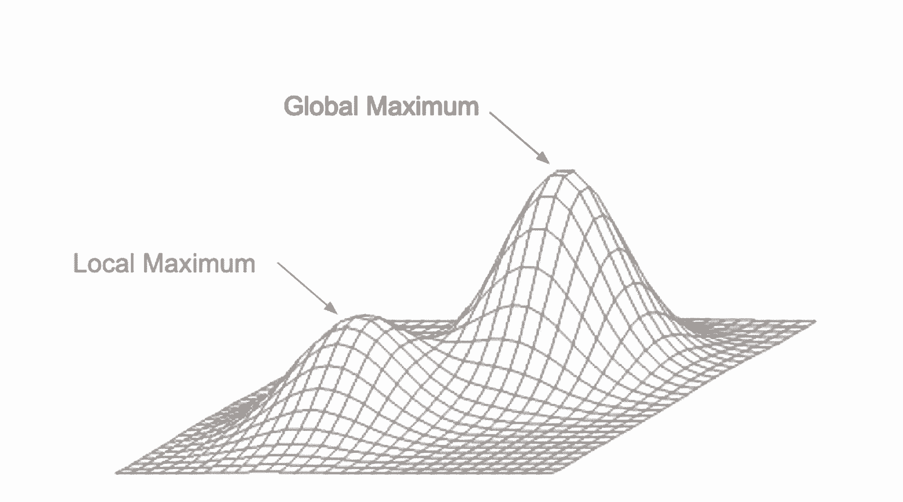
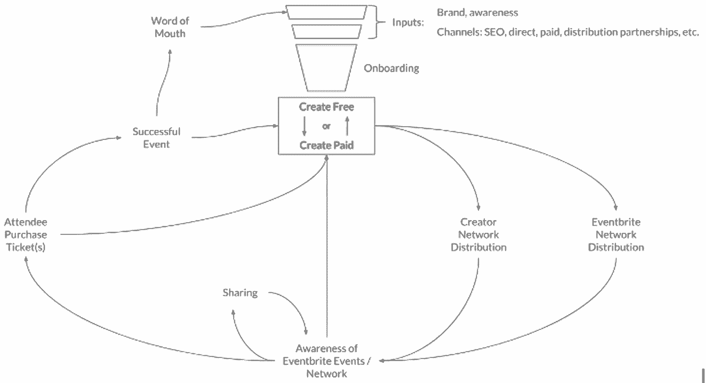

# 从零到首次公开募股:在创业的每个阶段，增长需要如何发展

> 原文：<https://review.firstround.com/from-zero-to-ipo-how-growth-needs-to-evolve-at-every-startup-stage>

布莱恩·罗森伯格 的职业生涯跨越了初创公司成长的每个阶段，从零起步到成功上市。

我们从“零”开始:这是 2009 年，罗森伯格和他的 [SkillSlate](https://en.wikipedia.org/wiki/SkillSlate "null") 联合创始人 [Bartek Ringwelski](https://www.linkedin.com/in/bartekringwelski/ "null") 坐在一辆摇摇晃晃的 Vespa 仿制品的座位上，摇摇晃晃地穿过曼哈顿的街道，前往他们的下一次会议。快进九年(加上[一次 Skillslate 收购](https://techcrunch.com/2012/01/09/taskrabbit-acquires-service-provider-directory-skillslate/ "null")和 [TaskRabbit](https://www.taskrabbit.com "null") 之后的一段时间)到“首次公开募股”:Rothenberg [将 Eventbrite 的 50 亿美元以上的增长引擎](https://firstround.com/review/answers-to-your-tough-questions-about-growth-learned-while-scaling-eventbrites-5b-growth-engine/ "null")提升为增长副总裁，他看着该公司在纽约证券交易所首次亮相时飙升至近 30 亿美元的估值。

罗滕伯格现在正把这种增长知识运用到桌子的另一边:他是第一轮[天使跟踪](https://www.angeltrack.firstround.com/ "null")新兴天使投资人大师班的校友，目前作为 **[defy.vc](https://defy.vc/ "null")** 的合伙人投资早期创业公司并为其提供咨询。

Rothenberg 合作的新创始人最关心的是增长:根据 [First Round 的 2018 年创业公司状态](http://stateofstartups.firstround.com/2018/#messaging-tools-productivity "null")报告，这是创始人说让他们晚上睡不着觉的第二大问题。对于在客户获取和保留方面翻来覆去的创始人来说，罗腾堡公开了他从规模扩张的每个阶段的超高速增长中学到的经验。

他说，保持初创企业增长的关键是知道如何随着时间的推移发展自己的战略，这一点经常被忽视。“我看到的最大增长陷阱之一是，规模较小的早期初创公司试图采用与晚期初创公司、甚至是 Facebooks 或谷歌类似的增长策略。这不会有好结果，”罗森伯格说。“没有放之四海而皆准的建议:**你的发展战略应该适合你目前所处的位置**。在每个阶段，你应该根据你的客户、你的资源和你收集的数据，专注于不同的目标。”

在这次独家采访中，Rothenberg 讨论了处于任何阶段的初创公司在制定增长战略时都应该牢记的核心原则。然后，他带领我们走过创业生命周期的三个主要阶段，从卑微的开始到大胆的赌注，确定每个阶段的目标和风险。他分享了你如何将你的战略提升到一个新的水平——他分解了公司在 IPO 过程中一直作为火箭燃料使用的增长策略。

# 创业成长的原则从一开始就要牢记在心

“五六年前，当我谈论增长时，我仍然觉得自己是在教育怀疑论者，”罗森伯格说。当然，今天，增长已经成为创业工具箱的一个重要组成部分，成为一个成熟的学科，随着设计师、营销人员、产品经理和工程师都参与进来，新的子专业[正在形成。](https://firstround.com/review/defining-growth-design-the-guide-to-the-role-most-startups-are-missing/ "null")

即使这个学科在发展和多样化，有一个广泛的原则是所有的成长团队都应该坚持的:“**成长是关于实施一个严格的、客户洞察和数据驱动的过程，并持续努力消除摩擦**，”他说。“它是关于创造一个‘哈’的价值时刻，然后在职能或公司范围内尽可能快、尽可能频繁地让客户到达那里。”

也就是说，增长函数仍然没有严格的定义。“我从来没有见过一个增长副总裁做什么的规范定义，”罗森伯格说。“在更多由产品驱动的公司中，增长可能几乎完全是产品的作用。在不太受产品驱动的公司，它可以代表营销的数量或技术方面。在其他情况下，两者都有。我甚至看到一些企业公司的增长主管实际上更像是 B2B 营销和销售的混合体。”

虽然没有一成不变的增长函数指导手册，但创业公司的创始人在任何阶段开始磨练自己的方法时，都可以遵循一些原则。

**成长战略>捷径**

“我的朋友肖恩·埃利斯创造了‘增长黑客’这个词，但我不喜欢这个词的解释。肖恩的意思是作为一个好斗和创业的术语，现在看来是一个捷径，或者一些聪明的一次性技巧。这意味着你撒上一些仙尘，然后突然成指数增长，”罗森伯格说。”**“增长黑客”普遍承诺过多，对许多初创公司而言，承诺不足，不幸的是，这一过程损害了该功能的声誉。**

不要试图“黑”你的方式来获得立竿见影的成功，而是致力于一个长期的、以客户为中心的和数据驱动的行动计划。他表示:“推动增长最可靠的方式是采取稳定的战略手段。”。

博主和兜售魔术的江湖骗子都说成长黑客是通往乐土的路，但事实是，捷径只会把你引入歧途。

创业公司也应该警惕微优化的承诺。Rothenberg 说:“大多数初创公司，尤其是处于早期阶段的初创公司，还没有达到微优化的规模，更不用说有影响力的了。”。这并不是说创业公司*不应该*优化。

“当你开始扩大规模时，大部分增长都是为了获得复利:许多中小规模的改进会复合在一起，随着时间的推移，推动大幅增长。他说:“这可能看起来像是在进行一系列实验，比如通过逐渐减小百分比来提高转化率。”。“但是只关注这些类型的优化通常会将你推向局部最大值。为了跃上更高的山峰，你需要做出战略性的步骤改变，然后朝着全球最大值或企业的总潜力进行优化。”

Image courtesy of Brian Rothenberg

谈到培育增长，创始人应该知道如何将更大规模的战略行动与更精细、持续的优化结合起来。“我喜欢 Trulia 创始人皮特·弗林特(Pete Flint)的这句话(T1):‘知道如何扩大规模和知道何时创新是我们工作的灵魂。’**随着规模的扩大，你当然需要优化。但是，你也需要采取一些更大的摆动，以推动更大的阶跃函数变化。**优化很重要，但更大的创新，尤其是早期的创新，会产生持续的客户价值，从而推动长期增长，”Rothenberg 说。

**用假设来规划旅程，而不仅仅是里程碑。**

为了引导你的创业公司走向成长，通过实验的星星导航。“拥有一套围绕提问和应用你的知识的方法在早期阶段是最有效的，此时[寻找产品/市场适合度](https://firstround.com/review/how-superhuman-built-an-engine-to-find-product-market-fit/ "null")，并保持[速度作为一种习惯](https://firstround.com/review/speed-as-a-habit/ "null")是最关键的。但是**假设驱动的实验和学习是在所有阶段扩大公司规模的关键。**

这是 Rothenberg 和他的 SkillSlate 联合创始人(Ringwelski——开着踏板车的那个)在阅读了 Eric Ries 的《精益创业公司》后受到启发而采取的方法。“当这本书刚出版的时候，我们了解到这一点，感觉就像恍然大悟。他说:“我们觉得，由客户洞察和快速迭代驱动的精益创业方法，不仅应该适用于产品开发:它也可以适用于培育增长渠道，甚至适用于我们如何管理和与公司沟通。”。

“总会有一些有影响力的、有待发现的洞见摆在面前，”他说。“你可能会偶然发现它，但最好有一个系统化的过程，利用定性的客户见解、市场数据、产品数据和其他信息来源，形成关于如何改进的假设和见解。”

把实验放在你的增长战略的中心，就像重组你的董事会一样简单。以下是 Rothenberg 和 Ringwelski 在 SkillSlate 还处于种子阶段时使用的策略:**不要只是回顾上个月的指标和里程碑的总结，而是将你的注意力转移到本月的** ***学习*** **。(第一轮合伙人和 SkillSlate 投资人 [Phin Barnes](https://firstround.com/review/Get-the-Most-Out-of-Your-Startups-Advisors-with-These-7-Tactics/ "null") 对这种做法印象深刻[他写了一篇关于它的博客](https://sneakerheadvc.com/no-more-milestones-i-mean-it-87523ef2ffa "null")。)“开始问这样的问题，‘你能从这些见解中应用什么，它们又引出了什么额外的问题？’”罗森伯格说。**

不要只问“我们做了什么？”通过询问“我们学到了什么？”来记录你的进步被问题而不是成就所驱动，开启了未来的影响和进一步的学习。

这种策略也适用于后期阶段。“当我在 2011 年第一次加入 TaskRabbit，在 2013 年加入 Eventbrite 时，像许多其他创业公司一样，我们正处于一个周期，我们会推出一些时髦的新功能，几乎希望更快的增长，”罗森伯格说。“当然，这些功能都是经过深思熟虑的、战略性的。但我们并不总是有一个明确的假设，这些功能也不总是有明确的指标来衡量它们的长期影响。”

此外，没有人专门负责衡量一个功能的长期影响。“历史上，一个团队会发布一个新功能，我们会为它的发布欢呼，然后这个团队会立即转移到一个新项目，”他说。没有足够的持续迭代来帮助该功能实现充分的采用或功能/产品匹配。人们在问诸如“我们学到了什么？”之类的问题之前，正在进行下一个项目。或者‘我们达到预期的效果了吗？’甚至是‘我们到底该不该保留这个特征？与大多数团队一样，这是下一个。"

为了纠正这种心态，Rothenberg 努力使团队的精神向生产性反思和影响发展，而不是持续生产。“早期，在 B 轮的种子阶段，我们引导团队更加假设和学习驱动，”他说。“到了后期，我们组建了团队，让[变得更加注重结果](https://firstround.com/review/mastering-the-art-of-the-outcome-how-guru-turned-customer-success-into-a-company-cornerstone/ "null")。我们没有分配团队去做什么，而是给他们一个目标:比方说，为我们的客户驱动 X 个特定的结果或 Y 个提升的指标。该团队必须确定*他们将如何*实现这一目标。”

“造好了，他们就来了”不是增长战略。在发布新功能之前，请充分了解它将如何影响您的客户。创造价值，然后顾客就会来。

在接下来的章节中，Rothenberg 勾勒出了创业生命周期的每个阶段。他指出了初创企业在每个阶段面临的特征、目标和风险，以及它们应该如何调整自己的战略以提升增长。

# 第一阶段:找到产品/市场契合度并获得牵引力

***你现在正在做的事情:*** *在你迭代产品/市场契合度时，赢得关键的第一批用户。* ***目标:*** *从你最初的目标用户开始，到你感觉要进入市场的时候。* ***潜在陷阱:*** *在没有产品/市场契合度和充足数据的情况下，过于关注增长。*

刚刚起步的创始人可能会被诱惑在增长上全力以赴，但罗森伯格建议现在不要放弃你的筹码。在这个阶段，[找到适合的产品/市场应该是你的首要任务](https://firstround.com/review/how-superhuman-built-an-engine-to-find-product-market-fit/ "null")；您的增长方法应该以收集客户见解和迭代交付客户价值为特征，同时为数据奠定坚实的基础。

为了说明第一阶段的初创公司应该如何构建他们的增长心态，罗滕伯格分享了他为 A 轮初创公司提供建议的故事:“当我开始与他们合作时，他们肯定是以正确的增长心态运营的——对于 B 轮或 C 轮初创公司来说，”他说。“他们的规模大约是每月数百名新客户，而他们的成长心态更适合每月有数万名新客户的公司。这是一个很常见的错误:他们试图将一家大公司的增长战略复制粘贴到自己的初创公司中。

该公司试图利用数据来解决潜在客户在客户旅程中离开的位置和原因。“这是一个伟大而明智的目标。但他们在执行上有些偏差，”罗森伯格说。“他们想进行 [A/B 测试，](https://firstround.com/review/the-tenets-of-a-b-testing-from-duolingos-master-growth-hacker/ "null")就像一家后期创业公司可能做的那样。但与更成熟的公司不同，这家初创公司没有大量的数据来这么做。如果你用很少的用户运行你的测试，投资回报率会更低，甚至是负数。由于损失如此之少，即使获得一个方向性的读数，也很难判断转化率是否真的有所提高。更重要的是，很难判断这些新用户是否真正理解了产品并从中获得了价值。

那么，在资源相对较少、客户基础更小的情况下，一家初创公司应该如何驾驭增长呢？Rothenberg 提供了一个方便的清单:

**通过交谈获得洞察力。** Rothenberg 回到了尝试 C 轮增长策略的 A 轮创业公司的警示故事:“这些创始人应该实际尝试[与这些客户交谈，以深入了解他们的产品](https://firstround.com/review/why-qualitative-market-research-belongs-in-your-startup-toolkit-and-how-to-wield-it-effectively/ "null")，并了解谁在转换或没有转换并看到成功，而不是在不充分的数据上浪费资源，”他说。“如果你和五个客户交谈，其中三个说他们对入职的相同部分感到困惑，你应该努力减少这种摩擦。在早期阶段，你可能还没有一个具有统计学意义的样本。因此，与其假装你知道，不如利用你真正能做的事情:尽早、经常与你的客户交谈。”

利用“哈哈”时刻吸引并留住新客户。“啊哈时刻是你展示价值的时候，客户会想，‘哦，这家公司完全了解我！’在你的产品或服务的背景下，尽可能多的把你的顾客带回到那个神奇的时刻，提醒他们为什么他们如此重视它。然后，努力让他们向新的潜在客户传播福音。一旦你做到了这一点，口碑就会成为一个强大的增长催化剂。”他说。

**通过要求早期潜在客户做一些调查来增加摩擦。**有时，要求潜在客户提前提供更多工作会带来更强烈的“啊哈”感。“在 TaskRabbit，我们发现如果用户提供更多关于他们需要完成的任务的信息，我们的任务负责人可以给出更好的评估和更好的服务。对顾客来说，说“我们需要帮助组装桌子”可能会更快。但如果用户说得更具体一些，我们就能更好地为他们服务:‘我们需要帮助打造两张定制的内置办公桌(需要木工经验)。本周星期五我们有空。这会稍微减慢入职流程，但有助于确保更好的匹配，最终为客户带来更顺畅的端到端体验。我们发现，对服务非常满意的新客户越少越好，对他们的体验“哼”的新客户越多越好。"

**奠定数据基础。Rothenberg 说:“现在是时候通过漏斗和你的关键增长回路来跟踪数据了。“您可能还不能广泛使用它，但您希望具备这些系统的基本功能，以便当数据变得足够大时，您能够透过噪声看到信号。这对最终成为数据驱动的增长团队至关重要。”**

在初创企业生命周期的早期，学习比“成功”更重要，失败的实验应该比成功的多。

不要草率行事。

最后，仔细考虑你的时机:过早开始考虑增长是有可能的。

“第一，**别无规模** **[正单位经济学](https://firstround.com/review/growth-at-all-costs-is-perilous-this-is-how-to-scale-sales-sustainably/ "null")** ，或者说一条通向它的明确道路。如果你的生意每增加一个客户或交易都会赔钱。如果你试图扩大规模而不事先修补这些漏洞，它们只会变得更大，”罗森伯格说。他在 2016 年和 2017 年为初创公司 [Shyp](https://shyp.com/ "null") 提供咨询就是这种情况。“它在大多数交付上都亏损了，而且在没有明确的积极单位经济路径的情况下，规模扩大得太快了。他说:“因此，在筹集了 6000 万美元后，它很遗憾地关闭了。

“第二，**在找到合适的产品/市场之前，不要过于依赖增长，”罗森伯格说。“这是我在 TaskRabbit 犯的一个错误，”他说。“我们实际上有一个潜在的漏桶问题:如果新客户的第一个任务没有成功完成，该客户几乎永远不会回来。我们花费了太多的时间和金钱试图通过这一基础问题强行推动我们的增长，而我们本应停止获取客户，并将重点转移到解决这一潜在的匹配问题上，这将使我们更快地实现真正的产品市场匹配。TaskRabbit 最终重新推出了其平台，该平台重新加速了增长，直到[该公司被宜家](https://techcrunch.com/2017/09/28/ikea-buys-taskrabbit/ "null")收购。**

正如罗森伯格所说，除非你“感受到市场的拉力”，否则你的创业不会走出第一阶段。除了这篇评论的[寻找产品/市场契合度的指南](https://firstround.com/review/how-superhuman-built-an-engine-to-find-product-market-fit/ "null") *[、](https://firstround.com/review/how-superhuman-built-an-engine-to-find-product-market-fit/ "null")* 之外，这里还有一些罗森堡的绿灯，提示你可能已经找到了 PMF:

**高留存率和高参与度:**与你所在类别的平均月留存率相比，人们使用你的服务的频率是合理的或高的，或者留存率高到足以让你的业务持续增长。

有机增长:你是在没有付费支出的情况下增长的，通常是通过口口相传。这是一个很好的指标，表明你很好地解决了人们的需求，他们现在与他人分享，并创造了积极的病毒效应。

Brian Rothenberg, partner at defy.vc and former VP of Growth at Eventbrite

# 第二阶段:扩展

***你现在在做的事情:*** *构建你商业模式的基础，以及你的数据和分析。*

***目标:*** *制定成长模式和成长循环，在全公司灌输成长思维。*

***潜在陷阱:*** *没有深入了解自己为什么在成长，划分成功能孤岛。*

“第二阶段是为你的业务增长打下基础，然后在最强的杠杆上加倍下注，”罗森伯格说。

在这一部分，他深入探讨了第二阶段公司的两种策略，首先是如何构建推动增长的共同循环，无论是病毒式的、付费收购还是内容。

虽然第一阶段的公司开始时可能有一个小而强大的创始团队，但第二阶段的公司可能会以更快的速度招聘新员工。对于成长中的第二阶段创业公司，Rothenberg 分享了如何让你的整个团队拥有成长的心态。

**饲料良性循环和生长循环**

“在第一阶段，你专注于奠定数据基础和获得客户洞察，以更好地了解你迄今为止的增长，”Rothenberg 说。“在这个阶段，你应该利用这些知识来进一步扩大规模:确定并利用你最关键的杠杆来建立一个增长循环。”

创始人面临的最大陷阱之一是无法理解他们成长的原因，以及如何让这种进步持续下去。罗森伯格说:“如果你对为什么你在成长没有深刻的理解，你就比你想象的更接近于不再成长了。”

在这里，Rothenberg 概述了了解你的成长和发展成长循环的步骤:

打出你的王牌。“问自己:‘企业或团队的独特优势是什么？’罗森伯格说:“不要分散你的精力，让你的团队去尝试利用每一个可用的杠杆，而是首先识别并利用内置的杠杆。当然，第一步是[建立一个有机会的市场](https://firstround.com/review/When-it-Comes-to-Market-Leadership-Be-the-Gorilla/ "null")。百分之八十的战斗是挑选具有内在优势的正确的创业公司。"

**叠加每个循环的影响。**“围绕每个循环是什么形成假设，并使用数据或客户见解来评估它们的影响程度。组建一个跨职能团队进行测试和学习，重点关注机会最高的循环。Rothenberg 说:“给团队至少几个月的时间来测试、迭代和学习。“他们应该问自己，‘如果成功了，这个循环会变得多大？’"

将你的草图变成现实。“最后，用一种易于理解的可视化格式勾勒出成长循环。罗森伯格说:“简单总是更好。“然后，尽可能量化:您能否测量每个部分，以确定您需要在哪里进行检测，以便开始收集数据？将数据结合到更广泛的业务增长模型中，显示每个循环中的变化如何帮助整体业务增长。你在哪里有或多或少的杠杆？你能靠在哪里？”

Image courtesy of Brian Rothenberg

Rothenberg 和他的队友创建了上面的图表来说明 Eventbrite 的增长和关键杠杆。它强调了 Eventbrite 最有效的早期增长循环:病毒式增长。“我们在 Eventbrite 的早期固有优势是，基于事件的用户体验天生就是社交的。他说:“我们依靠这一点来推动公司的早期发展。”。他打破了 Eventbrite 从参与者到创造者的病毒循环:

Eventbrite 致力于收购事件创建者(supply)。

这些创作者将他们的活动放在平台上，然后他们努力推广他们的活动，并促使与会者购买门票。活动创建者和作为平台的 Eventbrite 都推动参与者(需求)。

一部分与会者是通过首次使用 Eventbrite 平台参加活动来了解 Eventbrite 的。

这些与会者中的一部分成为活动的创造者(供应)。

当一个新的事件创建者有一个成功的事件时，他们在平台上创建更多的事件。

“我们的增长团队花了将近两年的时间尝试启动这个循环，”他说。“我们的努力得到了回报:我们显著提高了从活动参与者到活动创建者的转化率，推动了业务的实质性有机增长和提升。Eventbrite 大约 70%的认知度是由这种病毒循环或口碑推动的。

**在分销上创新。**

在评估初创公司时，罗森伯格经常会问一个问题:“T4，你在分销领域的独特优势是什么？

在 TaskRabbit，利用公司的分销优势需要一个不太可能的工具:亮绿色 t 恤。“我们已经有这么多员工在现场执行任务；我们认为他们也可以成为伟大的品牌大使，”他说。“因此，我们鼓励员工穿他们的品牌 t 恤，这是一种醒目的绿色。人们会在附近发现任务者，然后想，‘我应该用那个！’消费者意识最终在社区间传播，然后在城市间传播。"

创业公司需要在产品和分销上创新。不能非此即彼。

**让增长成为全公司的风气。**

“成长心态”意味着每个职能部门的人都与公司的成长休戚相关。确保公司范围内的一致不仅会在你扩大规模时避免派系问题，还会提高你的整体增长战略的有效性。Rothenberg 说:“不要制造孤岛，要着眼于[鼓励围绕实现关键成果和推动关键绩效指标的跨职能协调](https://firstround.com/review/defining-growth-design-the-guide-to-the-role-most-startups-are-missing/ "null")。

他在 Eventbrite 采取措施实现这一点。“当我加入时，该公司在最初的细分市场中拥有产品/市场契合度，拥有人们喜爱的优秀产品。在很长一段时间里，这一点——加上一些良好的营销——就足够了。但为了在我们的 C 轮融资后达到我们想要的水平，我们需要在整个公司灌输测试和分析 DNA，”他说。

一个很好的经验法则可以用来评估你是否对公司的增长进行了足够的宣传:如果你认为你沟通过度了，那就提高几个等级。

罗森伯格采取的第一步是**建立一个跨职能的增长团队**。他表示:“这包括来自产品、工程、分析、设计和营销部门的运营人员，他们真正沟通到，每项职能都与增长息息相关。”。

“我们最初的目标是避免职能孤岛，让跨职能团队以协调的方式跨越我们最大的增长杠杆，”他说。“我们组建这个团队是作为一项实验，团队最初有六个月的时间来实验改善我们的核心病毒循环。最终，增长团队将我们努力实现的关键指标提高了两倍多，在推动业务影响的同时，也证明了该方法的影响力。”

Rothenberg 提供了建立成功成长团队的建议:

**指定一名决策者**。“在一个不断前进、不断突破界限的高速团队中，意见分歧是不可避免的。指定一名加时赛选手。这可能是首席执行官，增长的负责人，或者，如果增长是通过产品等特定功能来实现的，则是产品的负责人。”

致力于长期奋斗。“如果你正在组建一个实验性的成长团队，在解散或解散它之前，给他们时间去发掘重要的洞察力。该团队应该至少有 4-6 个月的时间来证明其模型。”

请来一位专家。“我经常建议初创公司聘请一位成熟的成长专家作为顾问。对于能够帮助构建和指导你的早期成长团队的合适人选来说，授予一些顾问股份是一笔值得的交易。接下来，顾问可以帮你招聘一名全职的增长主管；最好的情况是，导师喜欢你做的事情，全职加入你的团队。”

**最后，实验团队成功背后的一个关键原因是，他们努力尽早、经常地交流他们的学习成果。**“每隔几周，团队就会召开一次公开会议，我们会在会上揭开实验过程的帷幕，”Rothenberg 说。“最有趣的部分是，在我们向人们展示真实结果之前，我们要求他们预测每个实验的结果。他们多半猜错了！这些会议不仅向人们展示了成长团队所做工作的影响，而且**还展示了我们需要测试多少——因为我们的直觉常常是错误的。**当然，仅仅传达一次成长的重要性是不够的:你必须*一遍又一遍地重复*核心原则和学习过程。”

多年来，Eventbrite 没有建立一个孤立的成长团队，而是建立了多个具有成长培训的跨职能团队，专注于客户生命周期的某些关键循环或领域。“能帮助 Eventbrite 的研究所，这是我最自豪的文化转变之一，”Rothenberg 说。

# 第三阶段:做出更大的飞跃和更大的赌注

***你现在正在做的事情:*** *缩放，挑战自我，超越优化。*

***目标:*** *承担更大的风险，收获更大的回报。*

***潜在的陷阱:*** *低估了实现大飞跃所需的工作。*

因此，你已经找到了产品/市场的契合点，并利用数据挖掘一个或多个有利可图的增长循环。当你的初创企业处于第三阶段时，可能性是巨大的:“在这里，跳跃曲线和[穿过‘混乱的中间状态】](https://firstround.com/review/how-to-shape-remarkable-products-in-the-messy-middle-of-building-startups/ "null")是区分伟大和真正的突破赢家的一部分，”罗森伯格说。“在这里，你可以冒更大的风险，获得更大的潜在回报。这是下大赌注的时候了。

Rothenberg 分享了一些公司在第三阶段可能使用的策略示例，并有可能成为 100 亿美元以上的类别赢家:

向新的大都市或国际市场扩张:[GrubHub](https://www.grubhub.com/ "null")和 [OpenTable](https://www.opentable.com/ "null") 就是很好的例子。我想说，只要有可能，让新的市场吸引你:在 Eventbrite，我们已经知道这项服务正在 100 多个国家使用。2011 年，Eventbrite 首次正式进行国际扩张时，我们借鉴了这些国家的经验。”

**跳跃平台或进入新的平台转移:“**脸书从桌面平台向移动平台转移的开始并不顺利，但现在，[其超过 90%的收入来自移动广告](https://www.statista.com/chart/2496/facebook-revenue-by-segment/ "null")”

**服务新客户细分:**“你的第一个客户和你的第 n 个客户可以是完全不同的两个人。 [Airbnb](https://airbnb.com/ "null") 在[不景气的初创时期](https://firstround.com/review/How-design-thinking-transformed-Airbnb-from-failing-startup-to-billion-dollar-business/ "null")以气垫和空房间起家，但随着时间的推移，它们逐渐发展壮大，首先是度假出租屋，然后逐渐转向高端市场，最终[收购了](https://techcrunch.com/2019/03/07/airbnb-agrees-to-acquire-last-minute-hotel-booking-app-hoteltonight/ "null")[hotel night](https://firstround.com/review/from-burning-millions-to-turning-profitable-in-seven-months-how-hoteltonight-did-it/ "null")并创造了[豪华产品](https://www.airbnb.com/luxury "null")。也有成功的自上而下转变的例子:[优步](https://www.uber.com/ "null")推出高端黑车服务，然后通过 UberX 扩张到点对点乘车市场。这可以是双向的，取决于什么对你的市场、客户和竞争态势最有意义。”

**扩大重点类别或产品种类:**“一旦你建立了稳固的核心业务，通常会有机会增加提供价值的次要产品和服务，或者增强你最初核心产品的价值。例如， [Zillow](https://www.zillow.com/ "null") 和 [Trulia](https://www.trulia.com/ "null") 在其服务中增加了租赁和抵押贷款，而 [Square](https://squareup.com/us/en "null") 有其 POS 系统

**收购公司:**“从脸书抢购 Instagram 到谷歌收购 YouTube，收购公司可能是一个可行的增长驱动力。不过要注意:大多数并购失败都是因为整合不良。太多的公司对此没有足够好的计划，并且严重低估了做好这件事所需的努力和投资。”

**创业公司内部的创业公司:“**一个公司的核心商业模式拥有无限的成长跑道是很难得的。一种策略是划分小团队进行实验，可以说是努力构建公司的第二幕和第三幕。谷歌运行 Google X 来发展新技术和潜在业务。亚马逊现在以其灵活的[“双披萨团队”](https://www.businessinsider.com/amazon-ceo-jeff-bezos-two-pizza-rule-productive-meetings-2017-6 "null")而闻名，这使得像[亚马逊网络服务](https://aws.amazon.com/ "null")这样的巨大的长期胜利成为可能。我们在 Eventbrite 有一个较小规模的运营，我们允许一些员工成为常驻企业家，有追求新商业想法的余地，以帮助将新的增长曲线融入公司的整体弧中。”

为了确定你应该把你的大赌注放在哪里，拿一个放大镜看看你迄今为止的成长。“在大多数情况下，未来潜力的迹象和萌芽已经开始，”他说。

# 零，首次公开募股，以及介于两者之间的一切

成长没有即插即用的教科书。相反，初创公司需要现实地评估每个阶段可供他们使用的资源，以及目前适合他们的增长战略。对于最早期阶段的创业公司，通过迭代交付客户价值的方法来投资增长。第二阶段是通过加倍利用你的内在优势来建立成长循环的时候，同时在各职能部门宣传成长心态。最后，在第三阶段，加大你的增长努力，大胆但明智地冒险。

当你的创业经历不同阶段时，共同的思路是回到成长的核心原则之一:最有效的成长是由不断的实验和适应性推动的。

“我非常幸运，在六年多的时间里，看到了 Eventbrite 增长功能的惊人转变，”他说。“就我而言，我已经向 CMO、我们的产品负责人、我们的首席执行官、我们的 CRO 汇报过了。在整个公司范围内，我们从以职能为导向的优先发展转变为建立跨职能的发展团队。你必须找到有效的方法，并在无效时适应。

这是一种探究和灵活的精神，渗透到所有的增长领域。“总会有一些新的发现，一些出乎意料的见解让你感到谦卑，因为它与你自以为了解的东西背道而驰，”罗森伯格说。“这是成长的关键:无论你是在成长循环中迭代，还是在公司文化的宏观层面上工作，你都必须*重复，重复，重复*这个不断学习的过程。”

*摄影由盖蒂图片社* *和[德鲁阿蒂泽摄影](https://drewaltizer.com/ "null")*