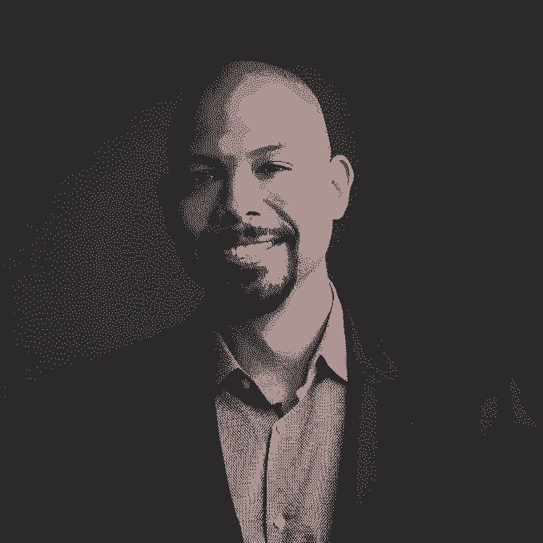

# 来自微软、Looker、Reddit & Twitter 的“离开地板”和其他职业建议

> 原文：<https://review.firstround.com/get-off-the-floor-and-other-career-advice-from-microsoft-looker-reddit-and-twitter>

## 介绍

深入研究尼克·考德威尔 的简历，你会看到一系列令人羡慕的初创公司的领导职位——Reddit、Looker 和现在的 Twitter。但是现在不太典型的是他之前在微软工作的 15 年。他在公司的任期达到顶峰，成为 Power BI 的创始成员和最终总经理，这是公司最大的成功故事之一。只是在积累了深厚的经验基础之后，他才在 Reddit 担任了他的第一个创业角色，在那里他带领工程团队经历了超增长，从 35 名工程师扩大到 150 名。

然后，他加入了 Looker，担任产品和工程主管，带领团队完成了谷歌对该公司 26 亿美元的收购。这让我们想到了他的最新角色——作为 **Twitter** 的工程副总裁，领导着一个拥有 700 名工程师的组织。

这是一个引人注目的上升，在一些最有趣和最具创新性的公司停留过。但也许他职业生涯中最突出的是，考德威尔在文化差异巨大的公司中取得了成功，从微软的保守企业到 Reddit 的快节奏。“我工作过的每个地方都有截然不同的文化，我当时并不欣赏这一点，因为当你身处其中时，很难理解这种文化，”他说。

在我的职业生涯中，我所享受的一部分快乐是了解到有许多不同的方式来发布软件和完成工作。

在我们对 Caldwell 的独家采访中，他从他职业生涯中的每一站，在不同文化、规模和职能的公司中寻找线索，并公开了他一直坚持的最大的领导力课程。他认为，微软的运营实践应该得到硅谷更多的关注——包括该公司的组织设计方法及其改进的绩效管理系统。他很容易受到他所收到的最严厉(但有保证)的反馈，以及在微软的全垒打是如何促使他离开公司并尝试创业的。Caldwell 还深入研究了他的功能专业知识，他对产品和工程如何合作而不是争斗的愿景，以及他赖以构建 Looker 工程路线图的系统。

这是一套非常广泛的框架，虽然 Caldwell 的面包和黄油是工程领导，但在整个组织结构图中，还有很多东西需要经理们去钻研。考德威尔是一位经验丰富的演讲者和作家，他擅长将复杂的话题或棘手的难题转化为清晰的教训。让我们开始吧。

# **第一课:为接下来发生的事情负责&离开地板。**

考德威尔指出，他在微软的两位前任经理给了他一些最早也是最关键的领导力课程。“在我职业生涯的早期，我是一名鲁莽、固执的工程师。考德威尔回忆道:“我当时向我的经理 Ravi Shahani 抱怨项目管理团队有多糟糕。“我当时就想，‘这些家伙不知道他们在做什么，他们让我建造所有这些东西，但没有一个是可行的。’我正要对他发火。"

接下来是一个(有些痛苦的)警钟。“他说，‘尼克，你是个了不起的工程师，但你只是个差劲的领导。’我当时就想，‘哎哟！’”考德威尔说。但沙哈尼给出了一条重要的建议。他说，领导者要为接下来发生的事情负责。所以你是要坐在我的办公室里抱怨这件事，还是要做些什么来改变它？他说:“那是我职业生涯中一个极其重要的转折点——那一刻，我决定我要做的不仅仅是做一名普通的工程师。

他的下一步行动？“我立即离开他的办公室，去找产品总经理说，‘嘿，我们需要在产品战略中改变这一点——给我一个向你证明的机会，”他说。

几年后，当考德威尔从集成电路工程师晋升到工程经理，最终成为工程总监时，另一堂领导力课就来了。“ [James Phillips](https://www.linkedin.com/in/jamesmalcolmphillips/ "null") 当时是我的总经理，他教会了我很多关于经理和董事之间的区别，”Caldwell 说。

“在我职业生涯的这一点上，我喜欢生产线级的工程管理。我把这一点贯彻到我的导演角色中，尽管我有 30 个人向我汇报。我做了你在一个小得多的团队中会做的所有事情——我逐个了解每个人，并努力在一对一的基础上激励和启发人们。考德威尔说:[我很难理解成为一名新兴市场人士的所有好处。](https://review.firstround.com/the-keys-to-scaling-yourself-as-a-technology-leader "null")

为了缩小差距，菲利普斯给了他一句口头禅，考德威尔现在把这句口头禅传给其他人，让他们从经理过渡到董事。“有一天，詹姆斯说，'**尼克，你必须学会如何离开地板【T7]。”他的意思是，如果你把工程团队想象成一个仓库生产，你有你的直线经理，然后你有你的主管。他说:“董事们必须离开现场，监督多条生产线。**

菲利普斯进一步强调了他的观点。“他让我不再和球队坐在一起，直接迫使我从日常生活中抽身出来。它确实教会了我如何更有效地授权，”考德威尔说。

当你离开会场时，你可以系统地看到你的团队是如何一起工作的，并从那个有利位置更好地发现瓶颈。

# 第二课:实际上，你应该寄出你的组织结构图。

虽然 FAANG 公司的文化实践几乎渗透到了硅谷的每一家公司——从早期创业公司到行业巨头——但微软的运营原则并没有抓住时代精神。考德威尔说，这是一个错失的机会。“谷歌的管理实践和网飞的文化平台被捧在高高的基座上。但我诚实的评估是，与微软组织设计的有效性相比，它们显得苍白无力，”他说。相对于微软，我工作过的任何其他地方在组建业务部门和理解如何将人员和资源转移到最紧迫的问题上的效率都更低。它很少被公开谈论，但它是微软的文化超级大国。”

以下是他如何分解公司基于产品的组织结构。“一般来说，Windows、云、游戏或 Office 都是价值数十亿美元的业务，拥有更大的合作伙伴网络。因此，考虑到这一点，公司需要组织其资源和人员来满足每个不同业务的需求。Caldwell 说:“每个业务部门都由一名副总裁负责，然后再细分为多个产品系列，这些产品系列中又有多个产品部门，这些产品部门又进一步细分为技术团队和功能团队。

“重组”这个词可能会引起很多人的抱怨，但是 Caldwell 指出这个过程是微软严格优先化的最有力的工具之一。“微软经常改变组织结构图，不管是人们坐在哪里，哪个产品属于某个特定的项目经理，等等，”他说。

但不仅仅是 org(和 reorg)的设计奠定了这里的基调——严密的沟通策略是关键。“你可以预期，每个季度或每隔一个季度，你的高管都会宣布某种形式的重组。它传达得非常清楚，并通过解释什么是商业战略来支持——无论是推动人们支持在特定领域的投资。考德威尔说:“修剪和塑造组织结构图有一个[规则的节奏，以匹配我们试图达到的任何目标。](https://review.firstround.com/lessons-from-coinbases-wild-ascent-four-rules-for-scaling "null")

“不要运送你的组织结构图”是一句俗语。但这是不正确的——你应该发布你的组织结构图，以确保它映射到企业试图实现的任何产品或目标。

# 第三课:代码不能解决一切。

虽然 Caldwell 主要是一名工程负责人，但他也承担了产品领导责任——包括将两者合并为 Looker 的首席产品和工程官。这给他带来了一个独特的视角，关于这两个组织如何能够避免经常不一致的“友敌”关系。

“我从工程开始，真的不知道人们应该做什么产品——我以为代码可以解决一切。Caldwell 说:“显然，在我们的业务范围内，没有代码我们什么都做不了，但我把它看得太重了，因为我不了解把软件推出去送到客户手中的每一个环节。

以下是他如何区分这两者的。“产品的工作是考虑各种各样的输入——客户、市场战略、跨越组织边界——并将其综合成一个成功的战略。然后，他们影响每个人，从工程、产品营销经理、走向市场的人，让他们认同这一战略，”他说。

他对沿途的许多坑坑洼洼更加欣赏。“这里的挑战是，每个不同的团体都有完全不同的动机。考德威尔说:“pmm 与工程师的思维方式非常不同，工程师与设计师的思维方式也非常不同，而且他们的激励方式也不同。”。“他们对如何判断自己的成功有不同的标准，产品人员必须坐在所有这些标准的中间，想出一种方法，将所有这些标准都集中到你的产品的目标上。这是一场令人抓狂的多维度、永无止境的棋局。”

在工程方面，Caldwell 发现最大的陷阱是将工程师排除在决策阶段之外。“工程师经常被要求去做一些事情，却没有解释为什么这些事情对业务很重要。比如，‘去构建这个功能吧。’或者他们被要求保持遗留代码的活力，却不知道为什么或如何做出贡献，”他说。

很多公司对工程师的看法是这样的，“把他们锁在地下室，每隔一段时间往下面扔个披萨，希望代码出来。”但是你花在向工程师解释“为什么”上的每一分钟都是值得的。

以下是他为产品和工程组织之间的幸福婚姻开出的处方:“最好的产出是当工程师们相信项目经理们对市场有很好的理解，并且知道工程如何与客户沟通时。同时，项目经理向外看，并试图收集和综合所有信息。考德威尔说:“他们的技能必须是平衡数据和直觉，以得出正确的路线图，然后以在多个职能部门产生共鸣的方式进行解释。”

它依赖于对客户的不懈关注。“当我加入 Looker 时，它是一款非常专注于工程的产品，我记得工程团队中有一句话叫‘工程师有笔’。”“这意味着团队中的工程师最了解需要建造什么，”他说。我很快改变了这种态度，“顾客有笔。”"

Nick Caldwell, VP of Engineering, Twitter

# 第四课:权衡内部创业和企业家精神的利弊和 CONS。

尽管在微软工作期间为这样一家大型企业工作，但考德威尔尝到了从零到一的滋味，尽管他承认这与真正的创业不太一样。“一般来说，任何大公司都会面临零到一项目的挑战。因为你建立的任何东西都可能影响现有的业务线，”他说。

以下是考德威尔的经历:“我是开发[微软 Power BI 产品的团队成员。](https://powerbi.microsoft.com/en-us/ "null")在早期，当我们谈论构建一个新的数据可视化工具时，我们不得不与多个团队一起去明确这个想法，这些团队甚至会受到影响，以推动这个概念，”他说。在明确了最初的概念后，它并没有完全投入到比赛中。“克服惯性不是一蹴而就的。Caldwell 说:“你必须在你的时间表和产品路线图中留出时间，与其他团队一起不断理清思路。

尽管障碍重重，Power BI 最终[成为公司](https://powerbi.microsoft.com/en-us/blog/microsoft-named-a-leader-in-2021-gartner-magic-quadrant-for-analytics-and-bi-platforms/ "null")的巨大成功——这导致考德威尔陷入僵局。“微软在构建职业生涯方面做得非常出色——有清晰的职业阶梯，允许大量员工流动，因此你可以接触到各种不同的机会。我在研究自然语言、机器学习、搜索、游戏——各种不同的东西。他们让你在那里度过整个职业生涯变得非常容易，”他说。

如果你长期只在一个地方工作，那里就成了你的世界。公司的高管成为你的英雄。你会被科技栈束缚住。你对市场的理解受到你周围产品的影响。你开始生活在泡沫中。

考德威尔意识到他一直在错误的事情上过度重视。“我在微软内部参加了所有这些不同的内部创业项目。我总是关注加入创业公司的坏处。比如，“嘿，如果这件事不成功，至少我还会在微软有一份安全轻松的工作。”但我从来没有深入考虑过，如果我们建立了一个价值数十亿美元的热门企业，加入一家初创公司会有什么好处，”他说。

以下是导致他心态转变的原因:“Power BI 最终为微软带来了巨大的成功，但对我个人来说并不惊天动地。如果我作为一个真正的企业家做到了这一点，这将是一个巨大的胜利。我意识到，只生活在这样一个生态系统中是对自己的限制，而这个生态系统长久以来一直令人欣慰。他说:“这让我开始厌恶内部创业，更加关注真正的企业家精神。这是一个转折点，导致他的下一步行动，[跃入创业领域](https://review.firstround.com/navigating-the-leap-from-big-tech-to-startups-advice-from-a-former-google-and-flipkart-exec "null")，加入 Reddit 担任工程副总裁。

# 第五课:使用绩效评估来捕捉长尾演进，而不是某个时刻。

回顾他在微软的任期，考德威尔看到了除持续重组之外的许多其他变化——包括拆除一个臭名昭著的系统。“微软曾经有一个非常糟糕的堆栈式绩效评估系统，他们在 7-8 年前就放弃了这个系统。他们用我认为最简单、最直接、最公平的绩效评估系统取而代之。他说:“我试图在我工作过的每一个地方重现这一点。

在改进后的新系统中，你首先要概述今年的 okr 和个人发展目标，以及你的经理的意见。每隔一个月，你会与你的经理进行一次[考核，了解到目前为止的进展情况](https://review.firstround.com/the-power-of-performance-reviews-use-this-system-to-become-a-better-manager "null")，此外，在第六个月的时候还会进行一次与薪酬无关的正式评估，在年底进行一次最终评估，这可能会给表现出色的员工带来额外的奖金。

以下是考德威尔认为这种方法如此有效的原因:“因为这些定期检查每隔一个月进行一次，所以你有一个随着时间推移而收集的轨迹。他说:“这不仅仅是每 12 个月回顾一份长长的目标清单，或者在某个时间点查看 OKRs，而是通过许多额外的信号来评估你的动力。”

在薪酬方面，经理们可以自行决定在他们的优秀员工身上花费额外的预算，并接受人力资源部门的深度监督。考德威尔说:“人力资源部门将他们的支票放在最上面，这样升职就能平均分配，不同的员工也不会被忽视。”。“或者，如果你的新经理对你的表现有不同的评估，人力资源部门可以利用你每两个月和每两年一次的考核轨迹的历史数据来衡量。”

他对初创企业领导人的建议是，让他们制定自己的[绩效评估流程](https://review.firstround.com/betterment-tested-three-performance-management-systems-so-you-dont-have-to "null")？考虑一下你如何实现一个有规律的反馈，而不是一劳永逸的方法。不要忘了检查和平衡，这样就没有人被忽视。

# **第六课:要想赢，就要密切关注竞争对手。**

考德威尔指出了微软的另一个优势，他认为人们经常忽视这一点。“微软坚持不懈地了解市场上的竞争对手。Caldwell 说:**当我与早期创始人(甚至是一些经验丰富的创始人)交谈时，我认为他们过于看重技术上的聪明或产品创意，而没有充分了解之前发生了什么，或者其他竞争对手在市场上的地位如何。**

“微软的整个团队除了了解竞争和制定正确的战略以脱颖而出之外，什么也不做。这种水平的投资在初创公司不一定可行，但[你对前景了解得越多，你就会变得越有效率](https://review.firstround.com/take-on-your-competition-with-these-lessons-from-google-maps "null")

我经常听到创业社区的人建议，你必须克服困难，忽视竞争。但你需要了解你的竞争对手是如何定位自己的，这样你才能开拓自己的市场。

在离开微软多年后，这种思维模式一直困扰着考德威尔。“我管理产品和工程的方式来自我在微软的时光——我喜欢赢。如果你进入我管理的任何一个组织，你会看到我们每个季度都在评估我们的战略和竞争。**我们在玩什么游戏，和谁打，赢了是什么样子？他说。**

实际情况是这样的:“为了更接近胜利，我们要做哪些战术上的事情，我们如何衡量成功？Caldwell 说:“一旦我们就所有这些达成一致，下一个问题就是我们是否有正确的组织结构，不仅仅是工程和产品，而是公司的所有职能部门，来实现我们的目标。”

# 第七课:坚持三个月的路线图。

当考德威尔在 2018 年加入 Looker 时，该公司在五年前从隐身状态中崛起后一直在蓬勃发展(关于这期间发生的大量细节，[你必须深入研究联合创始人劳埃德·塔布和本·波特菲尔德](https://review.firstround.com/the-inside-story-of-how-this-startup-turned-a-216-word-pitch-email-into-a-2-6-billion-acquisition "null")的评论文章)。“我被明确要求建立一个研发节奏，因为团队并没有真正按照清晰的路线图运作。我很快就决定，我们需要增加对路线图的理解，它有什么价值，并建立一些系统来开发和维护路线图，”他说。

他概述了他是如何开始的。“我使用的框架是，我们将从自上而下的执行层开始。我概述了我所看到的战略前景，并用一页纸描述了我认为摆在我们面前的一些机会。考德威尔说:“对于 Looker 来说，这可能已经解决了一些技术债务，转向了一个开发者平台，以及其他一些事情——但仍保持在一个超高水平的框架内。

接下来，他让组织结构图中的人往下走。“然后，在两到三周的时间里，我要求团队提出有助于实现高水平目标的想法和策略(或者反过来反对它们)。这将成为一套战略备忘录，概述我们将如何取胜，”他说。

然后，他回到了他的微软根基，专注于调整组织结构图以符合战略。“我们有合适的设置和合适的资源吗？我们是否有合适的主要领导来实现这些目标？它给人们一个机会去他们最热衷的领域。或者对于更有争议的项目，比如改变我们的可视化技术堆栈，我们需要在外面寻找对此充满热情的人吗？”考德威尔说。

战略备忘录随后被转换成路线图，其中填充了有助于实现总体目标的具体项目——考德威尔为他的路线图设定了严格的时间框架。“我喜欢管理具有可预测性的团队。他说:“如果超过三个月，就很难准确预测能实现什么，我想确保我们清楚地了解在一个季度内我们将向客户提供什么。”

然后时钟开始计时，以每周一次的节奏来追踪实现这些目标的进展。“我每周一次与这些赌注的所有驱动者坐在一起，我们查看路线图上每一项的进展，”他说。他的小费？你可能最终会转向两周一次的检查——但是随着团队习惯了路线图框架，你可以从更频繁的会议开始。“在季度末，你复古，你优化，你像时钟一样再次做，”考德威尔说。

# 第八课:爬山时带上其他人。

考德威尔在 Reddit 任职仅两年，但他与公司联合创始人[亚历克西斯·奥哈尼安](https://alexisohanian.com/ "null")的关系留下了不可磨灭的印记。“当我加入 Reddit 并在一次董事会会议上第一次见到亚历克西斯时，他告诉我，‘尼克，我在这里等你。“我会支持你的事业，”考德威尔说。

回过头来看，他承认自己一开始就忽略了这种互动。“我们刚刚认识，所以我想，‘是啊，每个人都这么说。’但亚历克西斯是一个非常支持我的人，不仅支持我在 Reddit 的职业生涯，还鼓励我成为一名投资者。我现在是一个相当有名气的[天使投资人](https://firstround.medium.com/meet-first-rounds-angel-track-cohort-fall-2019-11a04641772b "null")。他帮助我被推荐到 Looker 担任首席产品和工程官。“他帮我推荐了上市公司董事会的职位，”他说(考德威尔是 True Search 和 HubSpot 的董事)。他以各种方式关注着我，这让我经常问自己为什么。”(当奥哈尼安还在公司的时候，我们有机会采访他进行回顾，其中充满了智慧，值得重温。)

这是考德威尔试图在自己的科技生涯中体现的无私精神。“我从亚历克西斯那里学到的是**你需要在攀爬的时候找到托起他人的方法**。他说:“无论是通过参与非营利组织 DevColor，还是通过我做的教育博客和视频，我都想办法让其他人和我一起，寻找下一个人。

*这篇文章是对尼克·考德威尔在我们的新播客《深度》中出现的**的简要编辑如果你还没有听过我们的节目，* *[一定要来这里看看](https://review.firstround.com/podcast "null")* *。*

*盖蒂图片社/拉列门科的封面图片。*