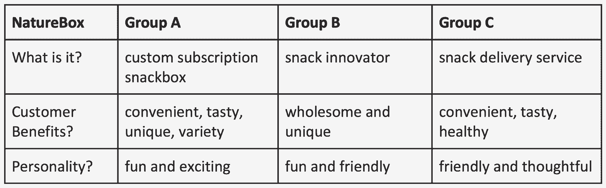

# 优秀的领导者是伟大的故事讲述者——我们讲述能引起共鸣的故事的 6 个技巧

> 原文：<https://review.firstround.com/good-leaders-are-great-storytellers-our-6-tips-for-telling-stories-that-resonate>

当《玩具总动员》在 1995 年首映时，好评如潮，票房大获成功，其中有一个主题让皮克斯团队特别自豪。

皮克斯的联合创始人艾德·卡姆尔在 *[创意公司](https://academized.com/creativity-inc-by-ed-catmull-with-amy-wallace "null")* 中回忆道:“我们感到自豪的是，评论者主要谈论的是《玩具总动员》给他们带来的感受，而不是让我们得以将它搬上屏幕的电脑魔法。”。“我们相信这是我们一直将故事作为指路明灯的直接结果。”

事实上，这个细节是如此的基础，以至于“故事为王”这句话已经成为这家位于埃默里维尔的动画工作室的座右铭。这个教训并不局限于故事板——它远远超出了真实的脚本和开创性的动画，[一直渗透到软件开发团队如何运作。](https://firstround.com/review/Lessons-from-Pixar-Why-Software-Developers-should-be-Story-Tellers/ "null")

创业公司也可以借鉴皮克斯的剧本:讲故事不仅仅是内容创作者、营销人员或公关人员的领域。**讲故事的能力，告知、说服或激励公司建设的每一个** **部分** ***。***创始人推介[下一个大的创业想法](https://firstround.com/review/90-of-feedback-is-crap-how-to-find-the-next-big-startup-idea/ "null")需要确定迫使投资者关注的故事。领导演示的销售代表必须创造赢得客户的[脚本](https://firstround.com/review/To-Build-An-Amazing-Sales-Team-Start-Here-First/ "null")，招聘人员需要调整他们的公司宣传以吸引优秀的候选人。

故事也不仅仅面向外部观众。构建全员议程需要讲述公司的发展历程。当你展示一个战略计划时，你是在展示公司的未来。从在绩效评估中提出晋升的理由，到传达项目的共同愿景，每个职能部门的每个操作人员都从能够交流将人们联系起来的想法中受益。

讲故事是一个众所周知的因素，它决定了管理者和领导者之间的区别，决定了赢得一个客户和赢得一个终身粉丝之间的区别。

这是每个人——尤其是领导者——都应该不断磨练的工具。为了帮助你讲出打破噪音的故事，我们总结了评论中讲故事的六个最佳策略。从创始人到工程领导者，从营销专家到设计总监，我们的专家都从稍微不同的角度来看待“讲故事”的概念。但综合起来看，他们强调了一个关键的共同点:**好的故事讲述不是关于奇特的语言。而是清晰简单地传达一个信息。这是关于与你的观众联系，不是作为客户、高管或投资者，而是作为人。**

毕竟，公司建设不就是一系列故事吗？每个老牌公司都有其著名的起源故事，每个初创公司都在创作其勇敢的失败者故事——如果幸运的话，所有这些都以成功故事告终。我们希望这些建议能帮助你说出你的想法。

也许在公司里，最明显的讲故事的机会来自于演示。无论你是在会议上分享状态更新，还是面对成千上万的听众发表演讲，你都需要确保你的表达更加精炼，这样你的故事才能落地。

以一家设计机构展示他们的作品为例。“我们知道，如果没有一个好的故事，我们的设计就无法为客户所接受，”****[IDEO](https://www.ideo.com/ "null")**Design for Change 工作室的前高级总监妮可·卡恩** 说。“**故事是我们的团队为同一个目标而兴奋、团结和凝聚的方式**。”

为了确保他们的所有设计师也将自己视为故事讲述者，Kahn 和她的团队在 IDEO 全国各地的办公室举办了一系列活动，分享他们给出高影响力演示的最佳实践。目标是:提供一个好的演示文稿的模型，同时也给设计师一个机会来谈论激发他们创造力的东西，并从他们的同龄人中获得可靠的反馈。

以下是其中两种经过检验的策略:

**在酒吧找到你的故事**

“当然，酒吧是友好的社交场所，但当你在酒吧时，一些真正重要的事情会发生，”卡恩说。“你用的语言真直接。你要确保你所说的是有趣的和吸引人的。你没有引用大量的数据。你不要使用过度的公司语言——除了引号。”

这些经历表明，我们对什么是好故事都有一种与生俱来的感觉，但我们在工作中往往会忘记。那么，你会如何在酒吧做演讲呢？如果你只有餐巾背面的图形会怎么样？这会如何改变你联系信息的方式？

当我们给朋友讲故事时，我们证明了我们都是天生的故事讲述者。

“**通过将律师资格考试引入工作环境，我们更有能力回答这个问题:重点是什么**？”卡恩说。“当我们在一个项目中时，我们可以讲述的故事数量就像天上的星星一样多，我们非常兴奋地分享它们，以展示我们所做的一切，但我们不能这样做。”

为了进行酒吧测试，IDEO 设计师在开始整理演示文稿之前，会和其他人——通常是陌生人——交谈。“我们告诉他们我们的故事。我们用语言表达出来。我们找一个对我们的工作完全不熟悉的同事，给他们买一杯啤酒或咖啡，花 15 分钟看看他们是否理解了演示的要点。”

卡恩说，当你和你的同事或朋友和家人一起做这件事时，要注意一些小事。“我们观察他们何时俯身，何时移开视线，何时伸手拿手机。我们寻找点头和“嗯嗯”——我们寻找惊喜和快乐。这就是我们如何弄清楚什么是有粘性和共鸣的。”

这根本不需要花太多时间——只需要 15 分钟就可以喝一杯咖啡，得到一两条反馈。“强迫它简洁。这就是描述你的故事的魔力。你什么都没投资，没有理由被套牢。可以反复重做。”

**打造你的骨架**

“在一个好的酒吧测试后，你的故事的框架应该出现:你知道你必须击中的要点，使其令人难忘，”卡恩说。

**一个伟大的故事只需要三个要素:**

你把所有事情都联系在一起的主线——你讲述故事的出发点。

“把我放在房间里”轶事提供了一种触觉体验，带你的观众踏上旅程，并创造戏剧。

反思时刻——告诉你的听众你的感受，以暗示他们有某种特定的感受。

同样，反思的时刻应该分散在你的整个演讲中，以抓住注意力，与你的听众建立亲密关系，并给他们一个了解你的过程的窗口。“我可能会说这样的话，‘**当我遇到桑迪，她说了这件事的时候，我就知道我们有所进展。”这提示客户注意**。"

告诉你的听众‘这一点对我很重要’，告诉他们‘这一点对你也应该很重要。’

“当我们与新客户会面时，我们经常会说‘嘿，我们知道很多其他客户都在这里遇到了问题’，他们总是会认真倾听这些想法。它给你一种专业的感觉，”卡恩说。

当你将所有这些元素整合在一起时——你在与他人的对话中发现的贯穿线，点燃想象力的轶事，以及将人们的注意力吸引回你如何处理作品的思考点——你就找到了你的故事。

阅读更多来自 IDEO 的 Nicole Kahn 的建议，这些建议将改变你演讲的方式。

**[泰勒·奥迪恩](https://www.linkedin.com/in/tylerodean/ "null")** 坚持他有争议的领导观点:

对于初创公司和创始人来说，有说服力比有远见更重要。

换句话说，领导力与其说是拥有一个完美设计的愿景，不如说是讲述一个令人信服的故事，说服他人加入你的行列。“事实是，像史蒂夫·乔布斯这样的远见卓识者之所以不成功，是因为他们凭空想出了一些惊人的原创的东西，”他说。更确切地说，他们擅长于不断说服许多人跟随他们踏上令人惊叹的原创之旅

作为谷歌 Chrome 的长期产品负责人、 [Reddit 的前产品总监、**T5 Pinterest**](http://reddit.com/ "null")的现任产品负责人，奥迪恩发现自己将说服作为一种工具，来引导大规模组织——工程师、设计师和高管——做出产品决策和开发。他意识到能够团结人们支持他和其他人的观点是多么强大。

为了利用有影响力的讲故事的力量，他研究了大脑如何处理信息和形成观点背后的科学。“当我们看到远见者真正成功的地方时，他们给我们一个自信、一致和连贯的计划，让我们感到安全，”Odean 说。“我们信任他们，不是因为他们的愿景是完美的，而是因为他们能够掌控一切。他们交流的很清楚，没有给我们所有的答案。大多数人认为的愿景，其实是说服。”

问题是，大多数科技运营商用复杂、微妙、事实和数字来表达自己。那是他们的默认，对人的无意识处理器没有吸引力。为了帮助人们讲述能引起共鸣的故事，Odean 分享了他关于聪明、简单地讲故事的顶级技巧:

**将你的故事浓缩成精彩片段**

在任何经历之后，人类都会创造出一个代表性的形象或者对所发生的事情的记忆——并且他们会根据这个形象进行推理。例如，如果他们和某人发生了争论，他们会拿走一张或几张有代表性的图片来描述争论是如何进行的。没人能选择坚持什么，它就这样发生了。

对于创始人和营销人员来说，这触及了重要的一点:“**人们会记住你给他们的关于你所做的事情的完全随机的信息样本**”不会是最好的样本。这不会是你希望交给他们的总结。这是一组随机的数据。

许多人，如果有机会面对重要的听众，比如投资者或行业记者，会认为他们需要把所有的话都说出来。他们必须讲述一个关于他们公司或产品的完整故事，这样才能在你想要的确切背景下被很好地理解。

人们用他们能想到的每一个卖点包装演示文稿。但这实际上是最糟糕的做法。

“他们几乎不会记得你塞进那一小时的任何东西，”奥迪恩说。“因为他们会记住随机的部分，所以你要构建一条信息，当在任何一点取样时，这条信息都会加强你的论点并保持说服力。把它放在精彩片段里，坚持一个非常简短的信息，你可以用不同的方式一遍又一遍地重复。当需要记住的东西较少时，你的听众更容易记住重要的东西。”

也只坚持你的强项。根据大脑的工作方式，即使你提出了一大堆极具说服力的论点，一个微弱的论点也会毁掉整件事。想出两组假设的商品:

第一个包括 5 部 iPhones，其中一部坏了。

第二个包括 3 部完好的 iPhones。

我们都知道第一套是最佳选择，当两个选项并排呈现时，大多数人都会选择它。然而，当他们一次只看一套时，他们倾向于对完好无损的那套要价更高。即使他们在理智上理解价值是相同的，他们仍然在情感上对受损的商品做出反应。

**讲有说服力的故事，强调可能性和潜力**

“比起喜欢收益，人们更讨厌损失，”奥迪恩说。但是他们不会相对于他们所拥有的来评估损失和收益——他们会相对于他们感觉拥有的来评估损失和收益。“如果你完全相信自己会得到晋升，但最终还是失败了，你可能会觉得这是一种损失，尽管从技术上讲，你并没有损失什么。你只是没有获得任何东西。”

当你需要说服某人时，你可以有目的地调整他们的参考点——改变他们已经锁定的感觉——让他们做你需要他们做的事情。如果你说话的方式就像某事已经是真的一样，并且你简单、持续、以一种易于想象的方式这样做，人们会开始觉得这是真的。

“你在推销中总能看到这一点，”奥迪恩说。“广告不是告诉顾客去买东西，而是告诉他们购买的时间不多了。因此，他们有机会购买，但如果不采取行动，他们将失去这个机会。这就是为什么品牌总是鼓励你试穿衣服或试驾汽车。**一旦人们开始思考他们的所有权，并看到它在行动，这就是他们的精神参考点。如果他们决定不买，他们将不得不遭受损失。”**

想象一下，与一位求职者交谈，决定是否加入你的创业公司。开始和他们说话，就好像他们已经决定加入一样。“说，‘你会有这么多的股权，这将是你的办公桌，这些人将是你的团队。’开始使用集体第一人称——“我们面前有这个机会”，“我们可以一起解决这个问题。”听起来他们已经有了一些具体的东西——他们将不得不通过拒绝你的提议来心甘情愿地放弃所有这些东西。奥迪恩说:“如果可以的话，人们不喜欢放弃东西。

*[阅读更多关于 Odean 所说的五种认知偏差的内容，创始人可以利用它们来掌握说服艺术，将其作为一种技能和习惯。](https://firstround.com/review/master-the-art-of-influence-persuasion-as-a-skill-and-habit/ "null")*

Tyler Odean, Product Lead at Pinterest

当谈到管理者的必备工具时，人们可能会想到[精明的决策](https://firstround.com/review/the-6-decision-making-frameworks-that-help-startup-leaders-tackle-tough-calls/ "null")或[激励性的报告](https://firstround.com/review/the-simple-tool-that-revives-employee-motivation/ "null")。另一方面，讲故事通常不符合标准。

唐·福尔 在这里改写了这个故事——并赋予讲故事在领导力工具箱中应有的位置。**T5、T7 的首席执行官和 [Pinterest](https://pinterest.com "null") 的前运营总监在美国海军学院开始了他的职业生涯。在他从海军陆战队到硅谷的令人印象深刻的旅程中，他注意到一项让领导者脱颖而出的技能:能够讲述好的个人故事。特别是，优秀的领导者需要能够讲述 Faul 所说的“失败故事”。**

作为一名领导者，脆弱是你能做的最有力的事情之一，因为这表明你是真诚的。真诚建立信任。Faul 说:“信任是完成任何事情的关键。“如果你愿意告诉团队中的每一个人你的错误，你的缺点，以及你目前正在努力改进的地方，你看起来会更有人情味。人们更容易与你建立联系。他们更容易相信你说的话，相信你考虑到了他们的幸福。”

这也允许人们在自己的工作中冒更大的风险。如果你的团队知道你尝试做某事失败的次数，他们也会看到你恢复并继续成功。他们不会觉得很难做到完美或者下小赌注，所以他们总是赢。当你在创业的时候，你不能冒险。

Faul 记得当他第一次开始领导海军陆战队的人时，脆弱对他来说非常困难，就像许多新的技术经理一样。“你不想表现出任何软弱的迹象，因为你想让每个人——也许主要是你自己——相信你在那里是有原因的，你不是骗子，你没有任何怀疑，”他说。

他对脆弱和分享失败的态度并没有开始改变，直到他来到硅谷，看到了与他共事的领导人树立的榜样。现在，他觉得有责任向自己团队的经理们展示这种方法。这是将这些技能传递给更多人并强化你的整个组织的最有效的方法之一。

一旦我开始谈论错误，我就亲眼看到我与人的关系发生了变化。我团队的整个环境都变了。每个人都开始更公开地分享。

Faul 分享的一个关键失败故事来自他在 Pinterest 的时光。早期，他从事与公司文化相关的主要项目。“我知道我用错误的方式处理了很多事情。他说:“我做了一些糟糕的决定，包括一个在公司内部根本没有得到我们想要的回应的决定——它就是没有着落。”。“作为高管，这是我第一次明显的重大失败，我知道这给我带来了负面影响。我必须克服这一点，承认失败，为此道歉，一遍又一遍地讨论它。我很难做到这一点。”

他不再掩盖这一事件，而是一遍又一遍地讲述这个故事。每当他的团队遇到类似的情况或犯了错误，他都会回忆起来。因为事实是，他确实挺过来了。他在 Pinterest 的团队不仅幸存下来，还取得了其他成功。知道在这个水平上恢复是可能的，会给每个相关的人带来心理上的安全感。

“我可以告诉人们，‘我经历过这些，我有理由相信你会挺过来，会变得更好，做得更多，’”他说。“现在，在我的职业生涯中，我有三四个这样的故事，我讲述这些故事是为了缓解与我一起工作的人的艰难时刻，并给他们忍受和保持兴奋的信心。”

脆弱并不会削弱你的权威。它让你周围的人变得强大。

以下是他的两个入门建议:

向一两个你信任的人敞开心扉。看看他们如何回应，以及这如何改变他们的工作方式和道德观。很有可能，你会得到积极的回应。此外，这将给你一个机会在脆弱和自信之间找到平衡。

提前仔细选择你的措辞。Faul 说:“当我感觉周围的人开始担心我，或者不去冒大风险，或者试图从错误中恢复过来时，我做的第一件事就是坐下来，写下我想告诉他们的故事。“重要的是，我要找到合适的语言，清楚地表明我了解他们的感受，并且有解决办法。我甚至会和我的妻子一起练习。我认为人们不应该指望自发地擅长这个。做正确的事是如此重要。”

*[阅读更多 Faul 的智慧，了解每个创业领导者都应该能够讲述的关键故事。](https://firstround.com/review/the-pivotal-stories-every-startup-leader-should-be-able-to-tell/ "null")* *如果你更喜欢阅读他的评论文章，你可以订购一本我们的第一本书，第一轮要点:管理* *。*

如果有人能从创业的第一线谈论讲故事，那就是莫莉·格拉汉姆**[。她在脸书管理文化和就业品牌，在自己成为创始人之前，她作为](https://www.linkedin.com/in/mograham/ "null")[的首席运营官负责销售和营销。](https://quip.com "null")**

她敏锐地发现了严重困扰初创公司的挑战，从[不“放弃双腿”的危险](https://firstround.com/review/give-away-your-legos-and-other-commandments-for-scaling-startups/ "null")到[潜伏在初创公司的可怕情绪](https://firstround.com/review/make-friends-with-the-monster-chewing-on-your-leg-and-other-tips-for-surviving-startups/ "null")。她发现了另一个创业公司经常陷入的陷阱:未能构建公司文化和独特的故事。“当你很小的时候，重点总是放在产品上，但是建立一个强大的团队和强大的文化是长期打造一个伟大产品的非常重要的一部分，”格雷厄姆说。

以亚马逊众所周知的为产品撰写新闻稿的做法为例，甚至在他们建立原型或撰写规范之前。“当他们推出产品时，他们会花时间首先考虑他们想对世界说些什么。他们打算怎么解释？”格雷厄姆说。

她挑战创始人将这种产品方法移植到他们的文化中。“花一分钟写下你的故事。你主张什么？你希望人们说你什么？”

你公司的故事是一切的基石。

格雷厄姆强调，这个故事不必很长。“可以是四句话，也可以是一段话，也可以是 3 个值。但它需要清楚地表明，作为一家公司，你是什么，你不是什么，”她说。它还需要给你一些语言，你可以在媒体、招聘、产品发布和全体会议上反复使用，以强调你的公司是什么，你想吸引谁，以及你为什么要做你现在做的事情。

这里有两个具体的技巧来润色你的公司故事。

**记住，你的故事并不适合所有人。格雷厄姆说:“大多数职位描述实际上都不太真实。“它们是这样写的，每个人读了都会想‘是的！我绝对有资格做那件事。“我想要那份工作！”“这是因为职位描述写得像推销一样，实际上是在向潜在的求职者推销这份工作的理念。”她说:“我曾经得到过一些惊人的建议，让我为一个绝对应该 100%胜任那个角色的人写你的工作描述。你想让每个不适合这份工作的人都认为，‘天哪，我绝对不想要这份工作。你公司的文化叙事也是如此:**当你有一个精心制作的、具体的、有争议的公司故事时，它可以指导一切事情，从你不应该雇用谁到你如何解决争端**。"**

避开陈词滥调。“我最初写脸书故事的许多尝试都可以描述任何公司——想想‘我们雇佣学习能力强、有团队精神的聪明人’“我会读我写的东西，需要小睡一会儿，因为太无聊了，”格雷厄姆说。不要只是重复其他公司写的东西——注意“创新”和“影响”之类的词——只有当你愿意冒险让它引起争议时，你才应该写下你的故事。"

莫莉·格雷厄姆(Molly Graham)讲述了为什么 80%的文化是你的创始人，以及创始人和领导者可以做些什么来为未来的文化打下坚实的基础。

创业公司可以讲述的最重要的故事之一是你在建造什么，你为什么这么做，为谁而做的故事——这种叙事更好地被称为品牌定位。

“很多人被品牌吓住了。他们认为，‘我不是艺术家，我不是作家。“我想不出什么东西，”一位经验丰富的创业顾问 Gibson Biddle 说，他曾与像 [NerdWallet](https://www.nerdwallet.com/ "null") 和 [Reddit](https://reddit.com/ "null") 这样的公司分享过他的产品知识。

那些人*不知道*的是，解开“品牌”的黑箱是有具体步骤的对比德尔来说， *[精益品牌](https://www.amazon.com/Lean-Branding-Creating-Generate-Conversion/dp/144937302X "null")* 作者[劳拉·布施](https://www.linkedin.com/in/laurabusche/ "null")最接近一个可行的定义:

品牌是消费者想起你时回忆起的独特故事。

“这个故事将你的产品与(你客户的)个人故事、特定的个性、你承诺要解决的问题以及你相对于竞争对手的地位联系起来，”布施写道人类所有的渴望都是品牌建立关系的机会。"

Biddle 亲自参与了一些最艰难的定位项目。当他在 2005 年加入 **[【网飞】](http://netflix.com/ "null")** 时，他面临着一项艰巨的任务，那就是定位一款在技术上完全开辟新天地的产品。产品专家仍然有焦点小组问他，“等等，我不明白。你是说*精简*？”不，*流*，他会说。没人知道那是什么意思。在早期，建立公司的品牌不仅意味着想方设法推广和定位网飞的“品牌承诺”，还意味着引入对这个令人难以置信的新业务至关重要的语言。

换句话说:他必须分解一个创新的概念，并把它变成一个用户不仅能理解，还能喜爱的故事。

与 Busche 的想法一致，Biddle 提出**一个定位模型**来帮助你定位你的品牌在消费者心目中应该占据的位置。首先，回答这三个关于贵公司的问题:

这是什么？描述一下。

对客户有什么好处？它如何改善客户的生活？

它的个性是什么？如果你的产品、公司或服务是人，你们在鸡尾酒会上相遇，你会如何描述他/她？

当然，在回答这些问题时，要考虑杠杆和陷阱。为了解决这些问题，Biddle 提供了一些建议和示例来指导您的过程。在这里，他使用了他被建议的零食订阅服务 [Naturebox](https://naturebox.com/ "null") ，来说明在网飞和他的整个职业生涯中对他有用的概念。

# 避免单独或孤立地进行定位练习。

Biddle 与初创公司合作的方式是同时利用许多人的智慧。例如，在与 Naturebox 员工的研讨会上，他将团队分成六个小组，将他的定位模型应用到业务中。所有参与者在一个小时结束时重新聚集在一起分享他们的想法。本练习的目标是捕捉并阐明他人对公司的评价，因此获得多种观点至关重要。跟踪跨团队的共享语言也很有帮助。以下是 Naturebox 三个小组的初步回答:

Selected answers from a Naturebox branding workshop with Gibson Biddle

那么，如何从这样的东西开始，并得出清晰、一致的定位语言呢？

**描述给一个六年级学生听。**

“力求简洁明了。假设你在和一个六年级学生说话。你的客户很忙，所以他们没有时间解析模糊的概念。你的目标不是让它变笨，而是让它变紧。”Biddle 挑战 A 组打开“定制订阅 snackbox”一个人主动提出:“外卖快餐。”对比德尔来说，这太“廉价”了。" Snackbox 订阅服务。"那行得通。一个对你的业务一无所知的人会马上明白什么？就这样吧。

决定拥有一个单词。

成功定位品牌的公司在消费者心中拥有一个特定的词。"你会用哪个词来形容各大汽车品牌？"比德尔问道。“本田是‘可靠’，奔驰是‘豪华’，沃尔沃是‘安全’，宝马是‘性能’，特斯拉是‘创新’。”我们都本能地将这些公司与这些词联系起来，但公司可能需要几十年才能“拥有”一个词——这就是为什么我对特斯拉作为一个年轻的品牌印象如此深刻，这种想法是他们在相对年轻的年龄就拥有汽车行业的创新。"

十年后，你想拥有什么词？

点击此处，了解网飞用来打造世界级品牌的三个简单而强大的工具。

最后，我们回到皮克斯，这家公司甚至开始与“讲故事的规则”联系在一起

在皮克斯工作了 20 年之前， **[柳文欢·雅各布](https://www.linkedin.com/in/orenjacob/ "null")** 是一个被讲故事的家庭包围的孩子。他的父母是教师，他们经常接待来自世界各地的家人、朋友、同事和路人，每个人都有自己的故事要讲。因此，他围绕令人信服的叙事建立自己的职业生涯也就不足为奇了——无论是在皮克斯开发电影宣传，还是作为 PullString 的联合创始人兼首席执行官筹集了 1600 万美元([后来被](https://techcrunch.com/2019/02/15/apple-buys-pullstring-toytalk/ "null") **[苹果](https://techcrunch.com/2019/02/15/apple-buys-pullstring-toytalk/ "null")** )收购)。

在所有这些努力中，讲故事是 Jacob 工作的一个重要部分，以使推介令人难忘并引起共鸣。无论你谈论的是你的产品还是你的公司，Jacob [都推荐了几个具体的讲故事策略](https://firstround.com/review/Tell-Stories-Like-This-to-Take-Your-Fundraising-Pitch-from-Mediocre-to-Memorable/ "null")，既能吸引初次听众，又能打造成功的长期关系。

他给创始人上的一课是:**伟大的故事是有结构的。**

一场推介会要有自然的节奏，像电影剧本一样。

“你需要带领整个房间一起踏上旅程，”雅各布说。“这意味着必须有一个有开头、中间和结尾的叙事弧线。当你掌控你的材料时，创造这种结构就在你的掌控之中。”

Oren Jacob, former co-founder and CEO of PullString

最好的会议是那些在房间里的风投们想要和你一起踏上旅程的会议——为了确保这一点，你必须达到他们预期的所有目的。“一开始就为他们铺好地图:‘我要谈订婚；我要谈谈货币化。“我将谈论我们的团队和特点以及潜在的竞争对手，”雅各布说。

你可能带着 12 张幻灯片参加会议——他推荐 12 张——并计划按顺序逐一介绍。但通常情况下，投资者会要求跳过第二张幻灯片，或者直接跳到第八张幻灯片。

“你可以控制如何讲述你的故事，但你也需要阅读房间。如果他们试图把你拉向一个话题，听他们的话，做相应的调整，但要保持故事的结构完整。你设计这个故事是为了让他们得出结论:他们必须投资于你。无论如何，你都必须立案。”

当你设计你的演讲时，你要确保强调那些能让人们相信他们应该支持你的观点的要点。如果你认为市场机会是你必须分享的最有吸引力的东西，那就花更多的时间在它上面。如果你认为你的团队是无与伦比的，花点时间深入了解他们的简历和经历。你想建立你的演示和幻灯片，这样你的论点只会越来越强，越来越有动力。

“你可能在附录中有 10 张无聊的图表幻灯片，可以用来回答问题，但你的故事应该浓缩到你根本不会看幻灯片的程度。”

从不看你的幻灯片。如果你发现自己这样做，你已经输了。

雅各布说，从战术上来说，不计划一整小时的材料也很重要。你应该能够在短短的 20 分钟内，以一种令人信服且详细的方式讲述你的整个故事。“这几乎总会膨胀到填满一个小时。你会被打断的。你要回答问题。在那一刻，你会决定让某样东西更有血有肉，或者给某样东西添加更多细节。你会感觉到房间里有人想更多地讨论产品结构或这个统计或那个统计。你不想最后耗尽时间

雅各布说，与此同时，你希望把一小时又一小时的乏味细节藏在脑子里。“通过练习，你会对省略这些细节越来越有感觉，但如果谈话是那样的话，必要时你可以把它们放在最前面。举一些众所周知的小故事作为例子——例如，一个喜欢你所做的事情的用户。这些可能是对一般问题的有用回答。当你讲述这样的故事时，你可以想办法把话题转移到你想触及的其他问题上。”

重要的是把这些话变成你自己的。”**你应该能够不用幻灯片就能进行推介。**寒冷，雅各布说。“击中你想要的每一个关键点，不超过 20 分钟。就像投影仪灯泡爆了几次一样练习，确保那时你还能做到——不要等到前一天晚上。能够在一分钟之内在白板上重现你的任何想法。给轴标上标签，并在图上标出三到四个临界点，这些临界点代表了你要表达的观点。”

**最后，记住伟大的故事是意想不到的。**

“你必须让投资者相信你有多相信它，你有多想和他们一起踏上旅程——即使你们两个都不知道它能有多大，”雅各布说。“当你在推销时，你应该让你的情况不是为了筹集资金，而是因为你对你可能完成的事情非常兴奋。”

阅读更多关于柳文欢·雅各布斯如何将筹款活动从平庸变得令人难忘的文章。

*寻找更多讲故事的智慧？* *[【认(免)七宗罪】创业评书](https://firstround.com/review/The-Seven-Deadly-Sins-of-Startup-Storytelling/ "null")* *。学会构思一个销售故事，帮助你建立一个令人惊叹的销售团队。了解* *[为什么软件工程师要做讲故事的人。](https://firstround.com/review/Lessons-from-Pixar-Why-Software-Developers-should-be-Story-Tellers/ "null")*