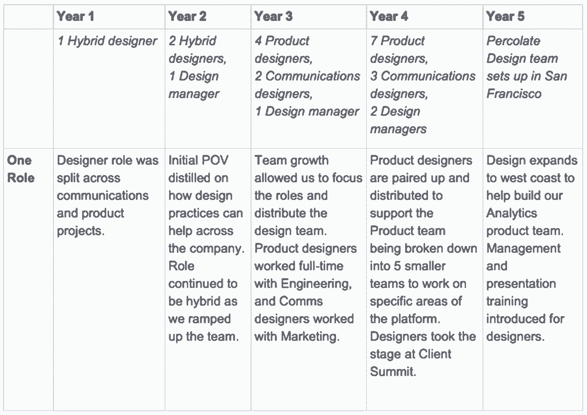
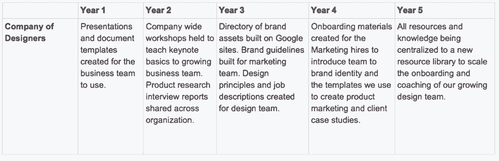
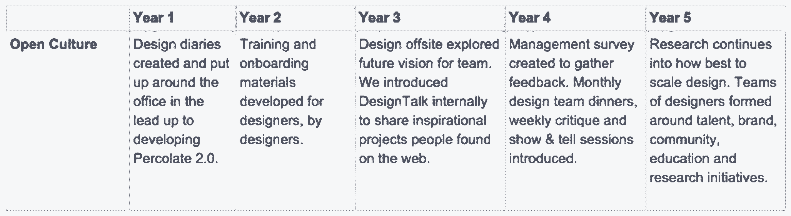
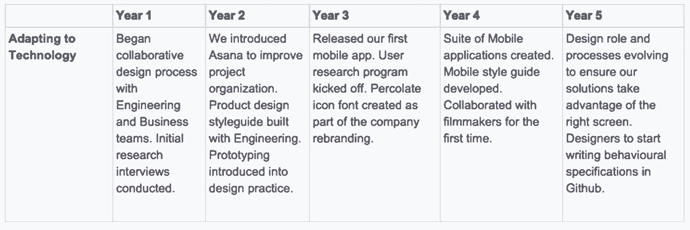
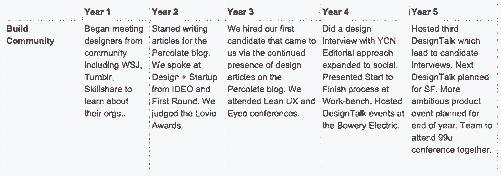
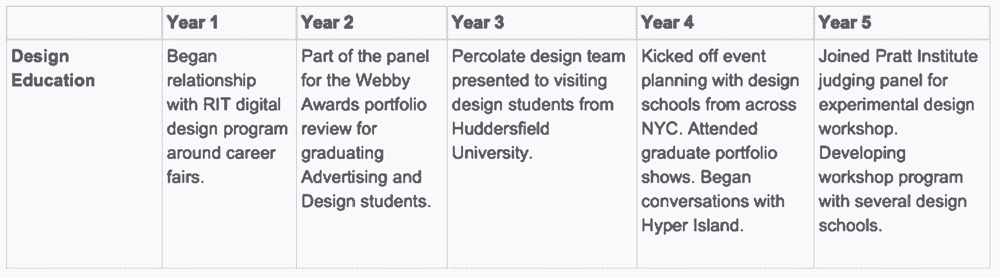

# 进行设计赌注，将模糊的东西敲入形状

> 原文：<https://review.firstround.com/great-design-leaders-make-bets-to-knock-the-blurs-into-shape>

*本文由****[Dom Goodrum](https://www.linkedin.com/in/domgoodrum "null")****，设计总监 at 营销软件负责人**。*

我要坦白一件事。四年前，当我们第一次开始组建渗滤液的设计团队时，我真的不知道自己在做什么。

只有通过实践和一头扎进实验中，里程碑才逐渐清晰。这很像我第一次决定跑半程马拉松，在开始之前我不知道会发生什么。我的设计管理方法背后也没有真正的科学。无论读多少《哈佛商业评论》或听多少深呼吸播客都没有用。我不断回到同样的三个问题:

我怎样才能建立一个高效的团队，同时自己也能做出贡献？

我如何避免花费我所有的时间来计划和协调我们团队的时间表？

如果没有我全程参与，团队将如何达到我期望的标准？

我想许多其他经理也有类似的想法。但问题是，我们不应该把时间花在回答这三个问题上。他们支离破碎，充满了恐慌。他们带领我们进入无效的圈子。打破这种模式的唯一方法是停止担心我们自己，专注于我们能为球队做什么。有了这种思维转变，我能够找到激发信任的方法，让我们的团队一起完成任务。

这篇文章是关于我到达这一点的旅程。

# 不要担心工作

当你在一个以目标为导向的组织中时，你是在建造那些被设计为持久的东西。**渗滤液**，**脸书**， **Airbnb** ，**巴塔哥尼亚**，**谷歌**——他们都是目的驱动的组织。他们的工作是有抱负的，永远不会完成。在渗滤液，我们希望创造技术，建立世界上最好的品牌。Airbnb 希望让地球上任何地方的人都有宾至如归的感觉。谷歌希望组织世界上的信息，并使其易于获取。这是激励员工每天早上起床的动力。

作为一名管理者，你需要对目的的想法感到舒服。

你需要一个镜头来帮助你每天在组织你周围团队的活动时找到清晰。重要的不仅仅是组织的目的。**作为领导者，你的目的是什么？为什么你的工作存在很重要？**

如果你的直接答案是创作出最好的作品，你需要后退一步。相反，**思考一个事实**，你可以用它来为自己打下基础，并塑造你所做的决定，以赋予他人权力。这就是对你的评判。

你团队的表现远比你个人的贡献重要。你团队的质量是你成功的真正标志。

一个好的“单点真理”是你坚信的管理价值观。这应该是一个以帮助人们成长的方式展望未来的声明。它应该激励个人超越自我，为整个团队创造成功。

在渗滤液，我们聘请设计师在其职业生涯的各个阶段，在一个高增长的环境。很多事情都在变化，我们经常发现自己在追逐移动的目标。

在这里，我唯一要说的是，我的工作是为我们的设计师树立信心。

在成为经理之前，我已经做了多年的设计师，我直接知道任何一个设计师面临的最大挑战是让团队相信你提出的解决方案。因此，作为一名经理，我能做的最好的事情就是帮助他们思考如何赢得同事的尊重，清楚地表达他们的想法，建立共识，让别人兴奋，并实现他们的愿景。

以下是我每天问自己的问题，帮助我们团队的每个人以这种方式取得成功:

***我如何帮助设计师充分利用他们的时间？***

日复一日，我们很容易在小任务上浪费时间。这让设计师感觉总是落后，无法赶上。他们开始接受他们将在第二天处理事情，不，等等，后天。这就是人们如何停止被他们的工作所激励。

为了解决这个问题，我建立了一些简单的指南来帮助我们平衡重要和紧急的任务。第一个要求人们在早上头脑清醒时处理最重要的任务，这些任务需要最深刻、最具挑战性的思考。我建议他们远离电子邮件和会议。接下来的半天可以专注于紧急的事情，如物流、管理和制作更简单的项目，如创建图标、风格指南和故事板。

我不做任何硬性的事情来执行这种工作模式。相反，我会不经意地与人们一对一或以小组形式进行交流，看看他们是如何度过自己的一天的。这种非正式的环境鼓励他们诚实，也让我有机会给他们一些轻松的建议，告诉他们如果感到停滞不前，应该如何安排时间。

以身作则比你想象的还要强大。

团队告诉我，他们看到我早早来到办公室，一开始就处理棘手的项目，下午开会。现在，当团队需要安排新的会议时，他们默认在下午找时间，因为人们普遍认为上午是留给深入思考和最有影响力的项目工作的。新加入团队的人会以他们的队友为榜样，很快养成我们的习惯。

***怎样才能让设计师不断推进自己的作品水准？***

一个设计团队拥有多种优势是很自然的。有时，这会导致工作质量参差不齐。解决这种不一致的一种方法是将您的标准定义为一个团队。这些标准最好诞生于对杰出的个人的工作和你所钦佩的过程的赞美。

我在团队会议上、在团队面前的非正式讨论中以及通过电子邮件分享这些例子。这比对开发中的项目提供一次性反馈要积极有效得多。作为副产品，高绩效者会觉得得到了回报，我能够为整个团队设定一个隐含的期望。

同时，重要的是每个人都要为自己设定一个高标准。有几种方法可以引发这种讨论。

例如，在 2012 年，我们的团队基于我们设计流程的每个阶段构建了一系列简单的可视化演示——从我们如何探索简报到我们如何创建线框等等。每个演示都谈到了执行这些步骤的理想方式，并随后用于培训新的团队成员，使他们了解我们共同创建的标准。

今年和去年，我们开始构建一个资源库，将团队的所有流程和指导方针都记录在一个地方。我们的目标是创建一个系统，允许我们以一种轻量级的、清晰的、指导性的方式来记录和容易地发现标准。

我如何帮助设计师看到他们增长了多少？

各个层次的设计师都想知道他们在进步。积极的反馈是必须的，但我发现我需要超越口头表扬。人们想要能激励他们专注于培养新技能的有形的东西。

为了帮助人们了解他们已经走了多远，我非常依赖文档。例如，在团队去年夏天做的一个研究项目中，我让每个成员在谷歌文档中写一篇简短的、未经编辑的日记，记录他们每天的进展和做出的决定。大部分的每日记录总结了他们的活动——他们进行的采访，他们考虑的用户流，他们画的草图等等。这个想法是为了在不占用太多时间的情况下了解他们是如何度过时间的。[产品设计师梅丽莎描述了这次经历，以及这次经历对她的意义](https://medium.com/@lissalauren/balancing-short-and-long-term-product-thinking-c88d9b51452b "null")。

日记条目有助于我追踪和支持他们正在做的事情。这也给了他们每个人反思的空间，并从他们事后所做的决定中学习，同时向他们展示他们正在建立的解决高层次、未定义问题的动力。最后，它给了我一些东西与公司的利益相关者分享，以展示团队的工艺和严谨性。

同样，我也认为有必要促进我们季度评估制度的具体发展。

在这个过程中，每个经理都会在新季度开始时与他们的报告会面，以设定新的目标。会议的形式已经从设定具体项目作为目标转变为概述员工将采取的三项行动和我作为经理将采取的三项行动。

这些行动都是为了帮助员工实现他们的长期发展目标。这些目标来自我们要求每个人在入职时创建的记录在案的“成长档案”，这是一项简单的任务，要求他们写下自己的动机、职业目标以及与这些目标相关的当前优势和劣势。通过这种方式，我们总能解决与他们更广泛的愿望直接相关的需求。

随着我们对季度评估系统的不断改进，有几件事变得特别有用:

收集同事的评价，以传递来自业务各个领域的真实认可。

让员工面对新的挑战，这些挑战稍微超出了他们目前的能力范围和舒适区。

作为经理和员工，认真对待行动项目。我的行动项目可能包括指导他们承担与他们想要的技能相关的新职责，将他们与能够帮助他们以新方式成长的业务以外的人联系起来，与他们合作进行流程实验等。

这种方法帮助设计师专注于以现实、渐进的方式发展，这将为他们和公司带来巨大的改善。这也提高了他们对日常工作的关注，增加了他们与工作的联系。

为了让人们在短期内保持兴奋和专注，你需要让他们的日常工作更有目的性。

你必须开发一个吸引他们的多年跟踪。要做到这一点，需要进行大胆的长期押注，让所有人都能团结起来。

# 对未来下大赌注

任何健康文化的首要属性都是承诺。如果你团队中的人也拥有这种品质，随着时间的推移，你将能够推动真正的进步。这些人一直在寻找壮大团队的方法——不仅在规模上，而且在质量、技能和社区意识上——并帮助组织迎接新的挑战。下注让你的公司更上一层楼是激发这种承诺的原因。

下注吸引了那些愿意投入巨大努力来取得杰出成绩的人。

他们鼓励人们向团队引入新的想法、策略和工具，并寻找改进现有流程的方法。

在过去，我们让人们创建新的会议，设计新类型的评论会议，并引入新的原型工具。有时，这些倡议要求人们牺牲个人时间。说服他们需要付出额外的努力，不仅要作为一个个体脱颖而出，还要在人与人之间建立强大的纽带。

为了建立和维持这种长期的承诺，我需要建立每个人的信心，而不仅仅是帮助他们每周都做出伟大事情的原始技能。我需要考虑让他们“全力以赴”并超越其工作描述的机会。他们需要机会在渗滤液博客上展示他们的努力，在公司活动上发言，建立我们的培训材料，并为我们的团队场外和晚宴制定议程。

为此，我围绕我们设计团队、公司和我周围社区的未来需求，下了一系列赌注。我是如何考虑为公司下正确的赌注的？《连线》的联合创始人凯文·凯利说得很好:“押注未来不仅仅是娱乐。它也是学习、严谨和规划的引擎。”

基本上，我的工作是押注于那些能帮助我们学习更多、追求卓越、更清晰地了解我们前进方向的事物。作为一名设计经理，我的赌注需要发展团队，吸引新人加入，动摇现状。

回顾过去四年在渗滤液，我们已经作出了一些赌注，以塑造成功的设计团队。以下是我们所下的赌注和采取的行动:

**赌注 1:科技公司只需要一种类型的设计角色。**

考虑到这一点，我们只雇佣有潜力在项目的所有阶段运作的设计师。视觉设计敏感度是标准的，而用户体验和研究技能对每个人来说仍然是最重要的。我们的培训工作反映了这一点。团队中的每一个人都应该有技能和知识随时加入并提供帮助。

以下是我们如何成长以反映对单一角色的重视，以及我们强化这一价值观的团队教育:

**赌注 2:投资时间发展一家设计师公司会让我们与众不同。**

除了指导设计师的职业道路，我们还将引入可扩展的设计实践、资源和[工具](http://firstround.com/review/This-Startup-Built-Internal-Tools-to-Fuel-Major-Growth-Heres-Their-Approach/ "null")，公司的每个人都可以访问并随时使用。这些作品将围绕我们的客户需求建立同理心，并让任何人在需要时都能创作品牌材料。

以下是我们为创造工具和材料所做的工作，让设计成为公司特色和未来发展的决定性支柱:

赌注 3:拥有开放的团队文化将有助于我们采用新的实践。

我们相信，鼓励人们紧密合作来建立设计团队将会促进设计师个人的成长。这种自下而上的方法将使设计师更容易引入[新的实践和实验](https://medium.com/@domgoodrum/permission-to-daydream-8ffb473bb288 "null")，同时确保变革和深思熟虑的进化的责任平等地分配给每个人。当这种情况发生时，每个人都会对公司有一种共同拥有的感觉，这是提高生产力和承诺的最佳方式。

以下是我们通过构建有意开放的文化所取得的进步:

**赌注 4:我们的设计流程需要适应新技术。**

移动技术的大规模采用以及接下来发生的任何事情将不可避免地影响我们设计团队使用的流程。我们需要准备好改变我们的可交付成果，跨职能团队如何合作，以及角色如何形成，以便继续制造不仅满足人们需求而且远远领先于曲线的产品。

下面是我们如何预测这些类型的变化，并在公司中建立灵活性以保持灵活性:

**赌注 5:建立社区会让我们发现惊人的天赋。**

通过与许多令人惊叹的公司和设计师分享和举办经验，帮助渗滤液在设计界发展一个可见的存在，将确立渗滤液在该领域的领导者地位。这表明我们在乎。我们对设计实践的承诺将为公司吸引最好的设计师和合作伙伴。

以下是自设计团队成立以来，我们的社区工作是如何规划的:

赌注 6:通过与教育者合作，我们将能够重新思考设计培训。

我们将与设计学校一起测试新的方法，并尽我们所能为设计教育项目做出贡献。我们在这里的影响将提高学生、教师和学者对设计师参与渗滤液和我们的工作的机会的认识。

以下是我们如何逐渐让更多的教育界人士参与到我们的工作中来的:

如你所见，实现这样的大计划需要时间。当我们作为一个设计团队开始时，这自然是一个全员参与的局面。我们能够设置基本功能，但仅此而已。随着我们团队的成长和变得更有能力，我们也相应地扩大了这些赌注背后的火力。

我们在这些领域的最大发展与团队的成长一致，这绝非巧合。这也是一个挑战，因为随着越来越多的人加入和动态变化，很容易在组合中丢失这些大型计划。我们不得不不断地重新专注于在所有这些方面取得有规律的——通常是缓慢的——进展。

我必须学会适应需要一段时间的事情。例如，作为一个团队，我们在成为现实之前，已经讨论了一年多启动 [DesignTalk](https://blog.percolate.com/2014/05/partners-in-crime-designtalk-event/ "null") 系列活动。

下大赌注的真正价值不仅仅是结果，还包括作为一个团队一起实现愿景的体验。

在分享信念的基础上，将这些想法带入生活的过程精炼了我们的思维，使我们更偏向于行动，并使我们保持学习模式。

今天，我发现自己正与越来越多的设计经理和一个由设计师组成的团队一起工作，他们自信地领导着项目，开发新的方式在整个公司工作。我建立这种信心的目的也促使我远远超越帮助人们管理他们面前的工作，甚至是这项工作的辛苦成果。现在，我更关注那些能让伟大的工作得以完成的关系和环境。

有点令人惊讶的是，我的管理方法的发展向我展示了很多关于我的性格。我不得不把自己放在那里，坦率地谈论我的经历，包括好的和坏的，并坦率地说出我的弱点。**能够公开我是谁以及我做了什么，这有助于设计团队记录我们共同认为的优秀领导在成长过程中的样子。**

现在，当我与希望加入渗滤液的资深候选人进行面试时，我最喜欢问的问题是:“**你的领导风格是什么样的**？”我观察和倾听他们的即时回答，看他们的关注点、兴趣和沉着。我想知道他们是如何从混乱中理出头绪，在噪音中找到方向，并把模糊的东西敲成形状的。