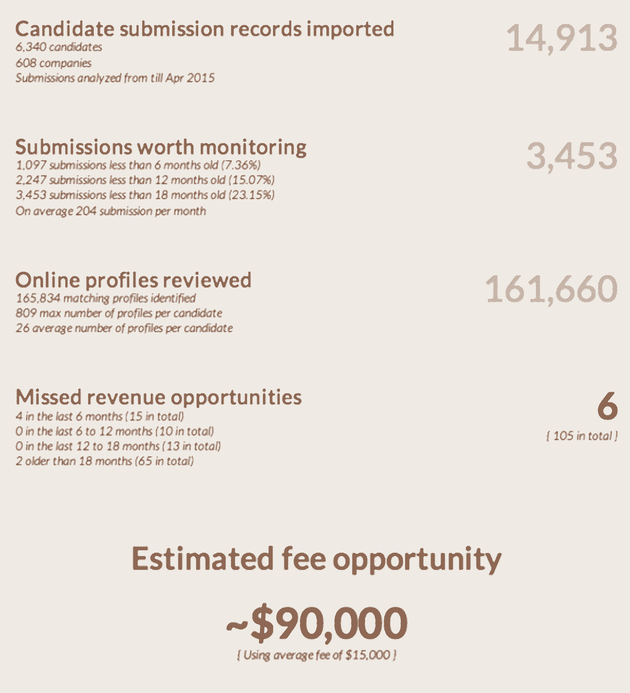
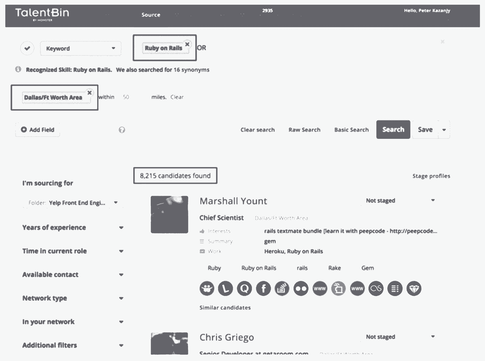
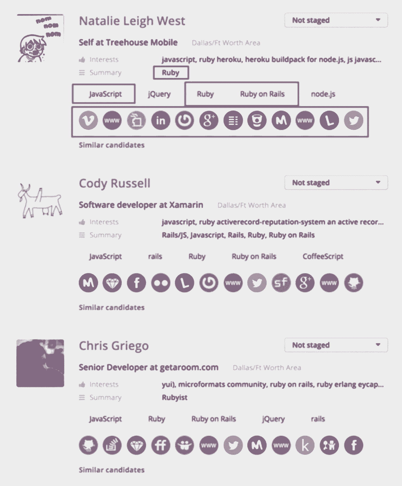
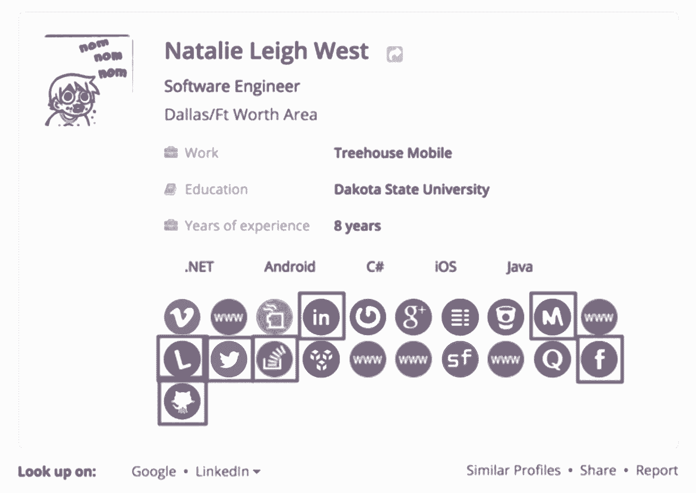
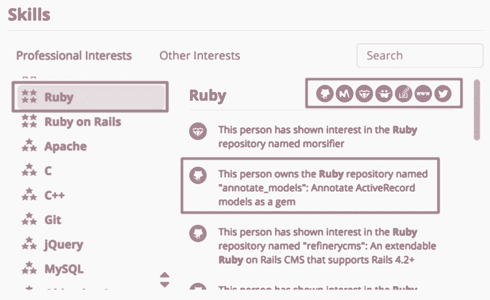

# 以下是销售成功的脚本—达成交易的电子邮件、电话和演示

> 原文：<https://review.firstround.com/here-are-the-scripts-for-sales-success-emails-calls-and-demos-that-close-deals>

*本文由* *[彼得·卡赞吉](https://www.linkedin.com/in/kazanjy/ "null")***[中庭](https://www.atriumhq.com/ "null")* *和 talent bin(2014 年被 Monster Worldwide 收购)联合创始人。节选自他的书* *[创始销售](https://www.foundingsales.com/ "null")* *中的* *[销售演示、电话和电子邮件脚本章节](https://www.foundingsales.com/3-sales-materials "null")* *，它解决了创始人和首次销售人员需要了解的关于获取早期客户、建立和扩大成功销售团队的一切问题。**

***[打造一副成功的销售牌是一回事](http://firstround.com/review/building-your-best-sales-deck-starts-here/ "null")** 。但是给潜在客户打电话所需的电子邮件模板呢？安排销售演示预约的电话脚本怎么样？世界上最好的销售资料放在架子上也没什么用，因为你没有预约使用它。虽然销售演示很好，但需要一个精心编写的现场演示，向潜在客户展示它并不全是烟雾和镜子。*

*当然，教一组人在每种情况下说什么，更不用说，简单地记住你自己，与简单地拼凑一组引人注目的销售幻灯片是完全不同的事情。关键是要尽可能地去除等式中的可变性和即兴创作，这样你就可以定义、测试和坚持什么是有效的。但是你从哪里开始呢？*

*首先，这是一个确保你可能在[销售资料](http://firstround.com/review/building-your-best-sales-deck-starts-here/ "null")和[核心销售陈述](http://firstround.com/review/To-Build-An-Amazing-Sales-Team-Start-Here-First/ "null")等材料中体现的商业论点，也能以销售漏斗其他部分的形式出现的问题。也就是说，你不能只靠一把锤子来盖房子。工作的每一部分都需要合适的工具。这也是你希望你的公司听起来如何的问题。创业公司[需要定位和定义他们想要使用的面向公众的语气和声音](http://firstround.com/review/three-moves-every-startup-founder-must-make-to-build-a-brand-that-matters/ "null")，这并不遥远。*

*销售是一个重要的渠道，公司需要通过这个渠道用清晰的声音讲述一个令人信服的故事。您的销售团队发送的每一封电子邮件、他们留下的每一封语音邮件，以及他们亲自或通过电话进行的每一次演示，都会加强或削弱您向潜在客户提出的关于为什么您的解决方案对她的业务如此重要的商业论点。这场商业争论的成败将决定你收入的成败。你可以看到为什么从一个强有力的位置开始是如此重要。*

*这篇独家文章摘自我为创始人和其他首次销售人员撰写的《企业销售》一书，我分享了我在 TalentBin 的销售组织和我建议的许多其他早期销售组织中获得的重要经验。*

*但我也知道，光说人们应该对客户说的那种话是不够的。这就是为什么我分享了一些对我们有用的实际电子邮件和演示脚本的例子。您可以利用这些信息，按照自己的风格和价值主张来塑造它们，但是如果您正在寻找开始这些对话的起点，那么您来对地方了。*

# *电子邮件模板*

*就像你的[销售资料](http://firstround.com/review/building-your-best-sales-deck-starts-here/ "null")一样，你的团队发送的电子邮件应该是你的[销售叙述](http://firstround.com/review/To-Build-An-Amazing-Sales-Team-Start-Here-First/ "null")的特定媒体封装，最终目标是促使收件人进行在线或离线演示。就像你的资料一样，这些可以从最基本的层面开始，随着你的信息变得更加具体，可以从那里开始变得更加详细。*

*我们将从外向拓展的概念开始。虽然呼入销售线索(你严格限定的)是潜在交易的最高质量来源，但当你第一次开始时，在你开始呼出之前，你不太可能有任何价值的呼入需求。*

*首先，您只需要几个外联模板，用于联系潜在公司的决策者。发现潜在客户的好处是，您能够选择具有您的解决方案能够转变和缓解的业务难题特征的潜在客户。因此，当您创建这些模板时，可以很方便地假设读者有您正在解决的痛点，而且，坦率地与他们谈论他们的业务痛点和您的解决方案。*

*当你阅读下面的电子邮件模板时，[你应该认识到你的主要叙述](http://firstround.com/review/To-Build-An-Amazing-Sales-Team-Start-Here-First/ "null")的一些部分:问题和谁有问题(收件人！)，您的解决方案与现有解决方案之间的差异，以及您的产品优越性的证明点。*

*您会注意到主题行通常是定制的——其中包含的信息向潜在客户表明该消息是专门为他或她设计的——还包括资格信息(例如，“招聘 Ruby 开发人员？那不容易”)。您还会看到模板包括“点击目标”，即指向吸引潜在客户点击的宣传材料(我特别喜欢 YouTube 演示视频)的超链接。*

*这些很重要，不仅因为它们可以提供更多的背景和说服力，还因为，通过你应该使用的电子邮件工具，它们可以让你看到哪些潜在客户在点击，从而对你要说的内容表现出兴趣。它们不一定只是文本链接。您可以嵌入幻灯片的屏幕截图，或者我最喜欢的一个演示视频的缩略图，它们都可以通过超链接链接到源，从而推动点击以获得更多引人注目的信息。电子邮件模板也应该包括链接到您的网站。这有助于解决点击目标问题，还能让潜在客户了解更多信息，并有可能成为请求您演示的潜在客户。*

*您还会注意到，这些示例模板非常具体地说明了该解决方案要解决的问题，并煞费苦心地向潜在客户证明，已经进行了调查，以确认他或她有这些业务难题。在 TalentBin 的案例中，这就是雇佣技术人才。这些邮件没有提到“社会招聘”他们一般不说“招兵买马”。他们不谈面试。他们谈论寻找和招聘技术人才的棘手问题，以及这些问题的潜在解决方案。信息不断回到潜在客户的角度。潜在客户不在乎你。他们关心他们。*

*你必须优先考虑潜在客户的观点；即使在你介绍你的解决方案时，也要强调它如何帮助他们。*

*最好的模板以一种坦率的方式完成所有这些工作(我敢说有趣吗？)以坦诚、权威、对等的方式与潜在客户交谈。他们避免扯淡的行话和不必要的“商业”交流模式。*

*过度华丽的设计也是如此。你的模板应该是 100%的文本，避免营销图片——屏幕截图和幻灯片除外，如果你喜欢的话。但是要避免高光泽的商标之类的。它让你的推广看起来像一个机器人发送的，就像它背后没有资格，因此它是不适用的垃圾邮件，而不是高度有针对性的咨询推广。不要让你的邮件被误认为是其他垃圾邮件。*

*最后，你会注意到每封邮件的结尾都强烈呼吁采取行动，要求建立一对一的互动(无论是通过 telepresence à la Join.me、ClearSlide 等。或者面对面)。这是本次推广活动的最终目标:推动对潜在客户的业务难题和您的解决方案进行同步演示和讨论。通俗地说，就是“演示”。*

*这里有几个冷外联电子邮件的例子(带有邮件合并代码):*

# *模板:简短而甜蜜——快速记录疼痛并提问。*

***主题行:**嘿{ {名字}}！解决技术招聘难题的神奇方法。*

*嘿{ {名字}}，*

*我希望你今天过得愉快！*

*是{ {用户。我伸出手来，因为我有一些东西，我认为有助于雇用我在你的职业页面上看到的所有 Ruby、iOS 和 Java 角色。*

*如果你像我们合作的大多数技术招聘人员一样(我们有成千上万的客户)，你可能会对大多数开发人员糟糕的 LinkedIn 档案、他们不回复 InMails 的事实以及这一切都需要太多时间感到沮丧。超级沮丧。*

*好消息是，TalentBin 专为通过自动化减少时间和繁重工作而设计，因此您可以花更多时间与候选人进行精彩对话，并在{{CompanyName}}工作时推销这些内容。这就是招聘的意义所在，对吧？*

*你看， [TalentBin](http://www.talentbin.com "null") 是一个人才搜索引擎，帮助招聘人员根据他们在 Github、Stack Overflow、Twitter、Meetup、美国专利数据库等网站上展示的活动，找到并接触优秀的技术人才。更多请看:【https://www.youtube.com/watch?v=fClV97ONRyI *

*我很乐意向您展示我们如何能够帮助您为您的空缺职位找到合格的技术候选人，并以更少的工作量更快地雇用更多更好的技术人员。*

*下周你有 20 分钟时间吗？什么时间对你有用？请随时回复此电子邮件，或者直接拨打我的电话{{User。BIZ_PHONE}}。*

*谢谢，{ {用户。名字}}*

# *模板:简短而甜蜜 TalentBin 的基础。*

***主题行:**嘿{ {名字}}！认识 TalentBin:人才搜索引擎*

*嘿{ {名字}}，*

*我希望你今天过得愉快！*

*是{ {用户。我希望向您介绍我们最新收购的一款名为 [TalentBin](http://www.talentbin.com "null") 的技术招聘工具。很明显，{{CompanyName}}正在招聘技术人才，我很高兴有机会向您展示 TalentBin 如何在这方面让您的工作变得更轻松。*

*TalentBin 开发了一个令人惊叹的人才搜索引擎，招聘人员可以用它来寻找软件开发人员和其他技术人才。更多有用的视频请看这里:[https://www.youtube.com/watch?v=fClV97ONRyI](https://www.youtube.com/watch?v=fClV97ONRyI "null")*

*脸书、亚马逊、微软、Salesforce 和数百家其他公司的招聘人员每天都在使用 TalentBin 搜索和招聘这些难以找到的候选人。*

*我们通过搜索*整个互联网*来获取候选人数据，并把它作为你的技术招聘平台。这意味着我们正在利用互联网的巨大潜力，记录来自不同网站的信息，构建丰富的复合资料。所有那些 LinkedIn 档案糟糕或不存在的软件工程师都不回复邮件吗？我们根据他们在 GitHub、Stack Overflow、Twitter、Meetup 等网站上的所作所为为他们建立了个人档案。我们有他们的个人电子邮件地址。*

*这些档案横跨**专业**和**个人**兴趣，还包括**个人电子邮件地址**！*

*根据我在你的求职网站({ { CareerSiteLink } })上看到的技术职位空缺，TalentBin 应该很适合你。*

*我很乐意向您展示 TalentBin 如何帮助您为您的空缺职位找到合格的技术候选人，并以更少的工作量更快地雇用更多更好的技术人员。*

*下周你有 20 分钟时间吗？什么时间对你有用？请随时回复此电子邮件，或者直接拨打我的电话{{User。BIZ_PHONE}}。*

*谢谢{ {用户。名字}}*

# *模板:TalentBin 的快速总结——侧重于它将如何节省时间。*

***学科行:**想在一半的时间内达到两倍的技术考生？TalentBin 可以提供帮助。*

*您好{{First Name}}，*

*是{ {用户。名字}}和怪物在一起。我想花一点时间向你介绍我们不断增长的招聘锦囊中的最新成员:TalentBin。如果下面的信息与您相关，我很乐意一对一地进行进一步讨论。我相信它对你会是一个非常有用的工具。*

*TalentBin 开发了一个搜索引擎，招聘人员用它来寻找软件开发人员和其他技术人才。*

*脸书、亚马逊、Kelly IT、Robert Half 和数百家其他公司和机构的招聘人员每天都在使用 TalentBin 搜索这些难以找到的候选人。*

*根据我在你的网站上看到的空缺职位，TalentBin 应该能很好地为你服务！*

*一些可爱特征的快照:*

*比 LinkedIn 招聘人员能够识别的技术候选人多 4 到 5 倍*

*数百万个个人电子邮件地址*

*消息模板和群发电子邮件功能(只需一次点击，即可向多达 30 名候选人发送电子邮件。)*

*电子邮件打开/链接点击跟踪(查看候选人何时打开您的电子邮件。)*

*Gmail 和 Outlook 集成(从 TalentBin 内部向候选人发送电子邮件，而不必跳出到另一个窗口。)*

*CRM 功能(管道管理和自动化——无失误)*

*...和一些更酷/更无聊的数据资料。:)*

*快速讲解者视频**(挺搞笑的。你会笑的。)**:[https://www.youtube.com/watch?v=fClV97ONRyI](https://www.youtube.com/watch?v=fClV97ONRyI "null")*

*我们很乐意向您展示 TalentBin 如何帮助您为您的空缺职位寻找和招聘合格的技术候选人。下周你有 30 分钟时间吗？什么时间对你有用？*

***不信题线？给我发邮件！我很乐意解释。或者您可以直接拨打我的电话{{User。BIZ_PHONE}}。***

*谢谢，{ {用户。名字}}*

*你应该总是以一种迭代的心态对待这些类型的电子邮件模板。随着您的解决方案的扩展，您将扩展它们。事实上，当您向销售资料中添加幻灯片时，您通常可以添加一封相关的外联电子邮件，甚至可以嵌入幻灯片的屏幕截图。当你在你的客户群中找到排列时，你可以根据你的客户的子类型设计模板。*

*与幻灯片一样，你应该将电子邮件模板保存在某种“源存储库”中，它可以像谷歌文档一样简单，也可以是更复杂的内容管理系统，如 Yesware、SalesLoft 或其他一些电子邮件潜在客户工具。*

# *电话和语音邮件脚本*

*虽然针对预约设置的定向电子邮件外联是将您的信息呈现给合格潜在客户的最具扩展性的方法之一，但您可能会打电话——要么处理呼入电话(可能是由您的出站电子邮件提示的！)或者做彻头彻尾的推销(每个人都知道这很伤脑筋)。*

*虽然一个电话几乎不可能直接按照脚本来打，但至少有一些快速项目可以参考，这有助于确保你抓住了你的信息要点。同样，这些应该是你的核心叙述的重新编排，设计成在 30 到 90 秒内完成。当你有 10 个以上的销售代表时，这不是那种电话脚本；取而代之的是，当你打电话试图开车去看演示时，有路标可以帮助你。*

*下面是一家名为 [HIRABL](http://www.hirabl.com/ "null") 的公司提供的一些预约电话脚本，这家公司为招聘机构生产增加收入的产品。这些脚本是一种产品，可以帮助机构知道他们提交给客户的候选人何时可能被录用，即使客户没有报告。*

***冷召唤脚本— HIRABL***

***版本#1***

*你好。*

*这是希拉卜的名字。我想联系你们，因为我们一直在帮助像你们这样的职业介绍所识别后门招聘。*

*你熟悉后门招聘吗，或者你在你的机构有很多？*

**顾客:是的，我们很熟悉他们，但是我们并没有做太多，因为我们不知道该怎么做。**

*是的，我们经常听到这种说法。听起来，用我们的客户总监的名字进行演示可能会有意义—您每天有 20 分钟的时间吗？*

***版本#2***

*你好。*

*这是希拉卜的名字。你今天过得怎么样？*

*我打电话的原因是，我们开发了一种软件，当客户雇用了他们的候选人，但忘记告诉他们时，该软件会通知招聘人员。去年，我们仅在 120 个客户中就发现了超过 4，200 项遗漏费用。*

*我很乐意为您安排一个时间，与我们的客户总监谈谈，因为我认为我们可以确定您已经获得的费用。你白天或白天有二十分钟吗？*

*---*

*这是 TalentBin 的一个更复杂的电话脚本，它包含了比上面简洁的描述更多的销售叙述。这个脚本中的所有信息不太可能在给定的呼叫中使用，但是让呼叫者可以使用这些信息总是有帮助的。*

*你好。*

*这是怪兽的名字。*

**(客套话。天气。运动队。个人花絮。)**

*所以，我打电话是因为我知道 ACCOUNT_NAME 雇佣了相当多的*(软件工程/设计/医疗保健)*专业人士。*

*Monster 最近收购了一家名为 TalentBin 的公司。你看新闻了吗？*

**(顾客回答。)**

*明白了！因此，TalentBin 开发了招聘人员用来寻找人才的工具。它通过搜索整个互联网来寻找这些人参与的活动。*

*因为这类候选人的就业率很高，所以招聘他们通常需要一种被动的候选人拓展方法。*

*但与此同时，因为这些人往往不会花时间在 LinkedIn 这样的专业社交网络上，所以在那里找到他们可能真的会有问题。不像招聘人员和销售人员，他们只是不在那里花时间。*

*然而，这类专业人士确实会花时间在网上的其他地方，留下关于他们专业工作的信息。TalentBin 收集了所有这些信息，并为招聘人员做好了准备。*

*因此，TalentBin 比市场上的任何其他寻源工具都更能识别这些专业人士。通过提供个人联系信息(如个人电子邮件地址)和社交媒体(如 Twitter、Meetup、脸书等)，你可以很容易地直接联系到他们。*

*很漂亮，是吧？*

*是的，更重要的是:*

*例如，在一个给定的地区，比方说 TalentBin 的数量将是 Ruby、Java、.与 LinkedIn 相比，他们将拥有大量的个人电子邮件地址。这是因为 TalentBin 已经抓取了 GitHub、Stack Overflow、Meetup、Twitter 和许多其他这些工程师经常出没的网站。]*

*[ **医疗保健:**例如，在一个给定的地区，比方说 TalentBin 的注册护士、医师助理、执业护士、医师(肿瘤学家、骨科医生等)的数量将是其 5 到 10 倍。)，等等感谢 LinkedIn。它包括许多直接电话号码和这些候选人的其他联系信息！这是因为 TalentBin 已经搜索了每一个医疗执照数据库，这些专业人士必须出现在那里。所以我们的数据库里有美国所有的医疗专业人员！多酷啊。]*

*最后，TalentBin 通过自动化大量涉及候选人寻找和拓展的枯燥工作，节省了招聘人员大量的时间。像集成电子邮件、模板和邮件合并、群发消息、滴流营销活动以及电子邮件打开和点击跟踪等功能使我们的客户成为超级高效的喷气式战斗机！它就像一个机器人招聘助手，让招聘人员有更多时间花在更高价值的活动上，如关闭候选人。*

*这就是为什么怪物买下了公司！因为这对雇佣这类员工的客户来说很有影响。成千上万的客户已经注册了 TalentBin，包括亚马逊、IBM、Kelly Services、Manpower 等知名公司。*

*鉴于 ACCOUNT_NAME 目前的招聘特点，我认为这将对您的业务产生重大影响。我很乐意与我和我的 TalentBin 产品专家同事一起为您的团队建立一个走查演示，以深入了解更多信息。*

*下周的某一天或某一天你有空来做一个 30 分钟的演示吗？我保证这值得你花时间。*

*---*

*当我们创建此脚本时，我们还包括了一些反应排列，以帮助指导电话的后续步骤:*

***客户感兴趣** — **书籍演示。***

*太好了！下周什么时间对你合适？我有每天的可用性时间段，每天的时间段，每天的时间段。*

*太好了。我将发送会议邀请，用联机会议室信息阻止您的日历。我们将进行屏幕分享，并浏览一些幻灯片和产品。期待啊！*

***客户提出后续问题——推迟并开始演示。***

*这是一个很好的问题！通常这就是我们喜欢与 TalentBin 产品专家进行的简短演示和演示，他们是解释每个功能的专家。通常为 30 分钟，专门关注您的业务难题以及 TalentBin 可以提供帮助的地方。*

*这很有教育意义，值得花时间去做。*

*下周的某一天或某一天你有空来做一个 30 分钟的演示吗？我保证这是值得的。*

*客户问:“这是免费的/要花钱吗？”—推迟并转向演示。*

*它不是免费的，但它非常强大，并提供了丰厚的投资回报。对于 TalentBin 来说，每月增加一名工程师并不罕见。*

*但通常这是我们喜欢在与 TalentBin 产品专家的简短介绍和演示中讨论的事情。通常为 30 分钟，专门关注您的业务难题以及 TalentBin 可以帮助解决这些难题的地方。*

*这很有教育意义，值得花时间去做。*

*下周的某一天或某一天你有空来做 30 分钟的演示吗？我保证这是值得的。*

***客户说，“我不感兴趣”——转移话题，清楚表达价值。开车去演示。***

*NAME，如果我不是强烈认为这可以帮助 ACCOUNT_NAME 以更低的成本、更快的速度雇佣更多的人，并且减少招聘人员的工作量，我现在就不会与您通电话。[就代理而言，“最终让 ACCOUNT_NAME 赚更多的钱。”]*

*我向你保证，这种技术将成为行业标准。推迟考虑这个问题，会让你的企业和你作为招聘人员的能力处于不利地位。*

***客户问，“这像是[竞争对手名称]？”—转向并驶向演示。***

*哦！您熟悉 COMPETITOR_NAME。TalentBin 类似，但实际上是行业中最初的先驱，拥有最丰富的功能、最好的数据源和最自动化的功能。这就是为什么 TalentBin 赢得了最多的行业赞誉和奖项！鉴于您对该领域的熟悉程度，看起来演示将非常有助于您进一步完善知识。*

*下周的某一天或某一天你有空来做一个 30 分钟的演示吗？我保证这是值得的。*

***客户说，“不，我真的不感兴趣。”—明确表示你会继续跟进，不会离开。(** **[这里更多关于如何做到这一点](http://kazanjy.svbtle.com/pitching-the-inevitable "null")** **)。)***

*好吧，我知道这与你的业务有关，但听起来现在时机不对。然而，我相信 TalentBin 将帮助您的企业取得更大的成功。*

*因此，我将发送一些视频示例，展示 TalentBin 可以为 ACCOUNT_NAME 带来的巨大时间节约和投资回报，我将确保在一个月左右的时间内与您联系，向您介绍最新动态。[然后，通过电子邮件跟进电子邮件模板中定义的材料。]*

*---*

*接下来，我们有一些设计用于提示回电的示例语音邮件脚本。如预约设置一章所述，语音邮件通常应该与电子邮件配对。*

*虽然听语音邮件可以很容易(尤其是在转录到电子邮件的时代)，潜在客户很少会回信息。最好把它们想象成音频邮件。*

*也就是说，如果一封电子邮件配有语音邮件，引起了潜在客户的兴趣，那么回复的时机就成熟了。*

***后续语音邮件***

*你好。又是怪兽的名字。*

*我想跟进我之前关于人才搜索引擎 Monster 的 TalentBin 的消息。*

*从理论上讲，鉴于您的招聘需求，您的公司似乎非常适合我们的工具，我只想和您聊一会儿，看看安排您参加现场网络演示是否有意义。*

*再一次，TalentBin 的名字呼叫，电话号码，那是电话号码。我期待着尽快与您通话。*

***客户验证语音邮件***

*你好。*

*这是 TalentBin 的名字。*

*我之所以联系您，是因为我们公司开发了令人惊叹的技术人才搜索软件，而且看起来您的组织喜欢雇佣令人惊叹的软件工程师。*

*我们在脸书、亚马逊、Groupon、微软和数百家其他优秀的技术招聘机构中非常受欢迎。所以我们是合法的。*

*我很乐意与您联系，了解我们正在做什么，以及如何帮助你们满足工程招聘需求。*

*给我回电话号码。我期待着很快与你聊天！*

*谢谢！*

*---*

*当然，所有这些电子邮件和电话的目标都是为了进入流程的演示阶段。这是销售漏斗中的具体进展，你在每个阶段达成销售的机会都要大得多。当然，你摸索交易的机会也更大，因为你进入了这个过程中接触点更高的部分。为了确保你不会牺牲演示前的所有努力，下一节将讲述如何在这个级别上获胜。*

# *演示脚本*

*你的演示应该以你的首要销售叙述为中心。因为现场演示通常会在您分享了销售资料中的一些初始幻灯片后进行，所以您应该遵循您在资料中展示的框架。您的演示将重复其中的大部分内容，但会有更多的上下文、定制和视觉清晰度。*

*这到底是什么框架？就像您的销售资料一样，关键使用案例和支持这些案例的功能也是如此。理想情况下，您应该已经确定了这些使用案例，因为它们可能会在您的销售资料中提及。但是，请考虑一下您的解决方案支持的最常见、最重要和最令人印象深刻的使用案例的组合。然后对它们进行排序，这样您就可以从最重要和最引人注目的开始，因为您永远不知道演示何时会提前结束！除此之外，我喜欢将演示视为讲述如何使用您的解决方案的故事，同样是从主要难点开始。*

****定制****

*在您的演示中，可以真正认真地为特定的潜在客户进行定制。事实上，在开发产品时，要想办法让使用潜在客户内容的演示变得更容易，可以是简单到确保快速嵌入潜在客户的姓名和徽标，也可以是复杂到让导入客户数据以在现场演示中使用变得容易。但是，演示的目的不是冷冰冰地重复您在销售演示中可能刚刚提到的功能。*

*您的演示是向潜在客户充分展示产品潜在价值的机会。*

*更多的定制将提高成交率，缩短交易周期。这种定制的最简单的版本是了解潜在客户的业务背景，无论是通过之前的研究还是通过电话会议开始时的发现性问题，并以此来指导演示。*

*在 TalentBin，这意味着要确保我们的销售代表了解他们正在交谈的潜在客户的技术和设计招聘要求，这很容易通过提前查看这些潜在客户的职业网页来预测。这样，TalentBin 的代表可以很容易地说，“我看了你的招聘页面，知道你正在费城招聘一些 iOS 开发人员。我很乐意向您展示 TalentBin 在这方面的帮助。”*

*请将此与非上下文相关的内容进行对比，比如“我们向您展示一下在旧金山招聘 Java 开发人员的情况如何？”—当潜在客户不招聘 Java 人员，并且肯定不在旧金山时。您可以使用哪些关键信息来修改演示，使其对潜在客户更有影响力？哪些可以提前嗅出，哪些需要从潜在客户那里引出？*

*如果你的演示没有上下文，没有直接联系到潜在客户的业务现实，它将总是让人觉得你在运行演示以使产品发挥其最大的吸引力，而不是展示当客户使用时它将如何工作。你可以通过首先关注潜在客户的业务背景来避免这一点。这将使你的材料比他们看到的其他供应商演示更可信，并提高信任系数。这也有助于你自己做这项研究。因为如果你简单地问客户他们想做什么，他们可能不知道，或者可能会问错方向。*

*再说一次，对于 TalentBin，最糟糕的方法是问:“你很难胜任的角色是什么？”因为客户可能会简单地提出他们当前最困难的角色。相反，更好的办法是专注于客户雇佣最多的职位，因为这是更大的难点。*

*演示定制的一个更高级的版本是实际包含用户数据的演示。一个很好的例子是 HIRABL(为招聘机构制作收入加速产品的公司)如何运行他们的演示:在演示电话前一周，潜在客户从他们用来跟踪招聘的 CRM 系统发送 HIRABL 候选人提交数据。然后，HIRABL 在他们为潜在客户开发的 SaaS 软件的一个新实例中运行他们的“漏聘”分析。*

*到了演示时间，他们执行一个轻量级演示，让潜在客户了解问题、解决方案、价值等的一般心理模型，然后他们转向 HIRABL 为该潜在客户确定的所有错过的费用。这是一个相当杀手演示！“因此，我们从您过去两年的提交数据中发现了大约 25 项遗漏的费用。每次安置你能赚 2 万美元。你想购买产品，这样你就可以开始收集错过的 40 万美元的费用？我们会让你在这里访问这个实例。已经整装待发了。”答案通常是“是的！”*

**

*显然，后一种情况要先进得多，而且你绝不应该说，“嗯，我们没有能力超定制一个演示环境，所以我们不能开始销售。”一点也不。但是，当您与产品管理人员一起工作，就您希望在产品中看到的功能提供反馈时，请记住，有些功能可以通过更加定制化的演示使销售变得更加容易。即使这些功能不一定为客户提供购买后的价值，但从创收的角度来看，它们仍然非常有价值，因为它们提高了成交率，带来了更多的收入。*

****示例演示脚本****

*TalentBin 的演示脚本是什么样的？当然，它与我们的核心销售叙述相关，并且是围绕我们在销售资料中展示的“搜索、确认、拓展、自动化”框架构建的。你可以看看我们是如何处理下面的前两个桶的(如果你想看完整的脚本，你可以在附录中找到它。).它从招聘人员最重要的使用案例之一开始，然后以招聘人员从发现新候选人到对该候选人进行资格审查再到拓展的方式进行，这是招聘人员在日常工作流程中经常做的事情的完整生命周期。还要注意的是，它是被分开的，以允许暂停和与客户讨论。*

*当你通读它的时候，想象一下当 TalentBin 在屏幕上分享产品的时候，带领潜在客户通过所有适合他们日常生活的方式，并解决他们每一步的困难。想想你的演示会是什么样的！您的潜在客户日常工作的自然工作流程是什么？你的解决方案如何适应他们，让他们更好、更快、更强？*

***搜索:**增强候选人发现是 TalentBin 的第一个价值主张，也是最容易被潜在客户理解的一个。在这一部分，我们谈到了能够发现以前在传统招聘数据库中无法发现的工程候选人的重要性，或者至少非常难找到，需要太多的人工努力。*

*我们知道，没有什么比向技术招聘人员展示他们可以使用我们的解决方案找到并聘用的潜在候选人更能吸引他们的注意力，特别是与标准数据库相比，所以我们从这一点开始:*

*我从你们公司的招聘网站上看到，你们需要在达拉斯地区招聘一些 Ruby 工程人员，所以我们来找找吧。下面是我们如何在达拉斯地区搜索认识 Ruby 的人。我们可以手动完成，或者我们可以使用我们新的工作请求翻译器，它会自动提取您的工作公告中的相关条款。实际上，我在打电话之前就拿到了这个帖子，所以让我们把它粘贴到那里。看到多简单了吗？*

*现在，我们可以保存该搜索以备后用，因为我们将回到这一点。此外，通过保存搜索，您现在可以每隔几天从这些搜索中获得推荐的候选人电子邮件。但是让我们扩展一下，看看达拉斯这个职位的潜在候选人总数。太棒了。嗯，看起来我们有大约 8000 个结果。这很有希望，因为 LinkedIn 只有大约 1100 个相同的查询！很好，这大概是这个数字的七倍——我敢打赌，在这些搜索结果中，有相当多的人没有 LinkedIn 个人资料。*

**当然，你之前的做法是手动浏览 GitHub 或 Stack Overflow 或 Twitter 每位有效候选人可能需要五分钟。这样，它们已经准备好供您审阅了。他们中的很多人没有在 LinkedIn 上被其他有 LinkedIn 招聘席位的招聘人员搭讪！”**

***展示潜在客户所在地区所需技能的缩放搜索结果:***

**

*资格:这就是我们要讨论的，为什么能够接触到所有这些综合的职业活动对于证明一个候选人具备招聘者所寻找的特征是非常棒的。此外，我们还研究了如何在外展中使用这种背景信息(包括专业和个人信息)来显著影响回复率和招聘人员的效率:*

**“好吧，让我们开始看看这些简介。您可以看到，我们在搜索页面上显示了一个预览，其中包括所搜索技能的相关信息，以及我们为候选人确定和搜索的各种社交简档。如果您愿意，可以将这些人标记为“感兴趣”或“不感兴趣”，以便稍后进行批量处理。但是现在，让我们来看看一个人。娜塔莉看起来很有趣。”**

***展示搜索结果和预览信息:***

**

*个人资料视图 **:** 了解候选人“符合要求”并且至少值得接触是招聘工作的核心。无论是根据简历还是 LinkedIn 个人资料做出决定，招聘人员都习惯这么做。因此，向他们展示如何利用 TalentBin 个人资料，以及从网络上收集的数据来做到这一点非常重要:*

**“让我们点击进入她的个人资料。现在你可以看到我们已经汇总了她所有不同的网页资料。看，这是她的 GitHub，Stack Overflow，Meetup，Twitter，LinkedIn 和脸书，我们甚至有她的 Lanyrd 社交会议资料。很好。如果你想去那些网站，你可以像这样点击它们。但是，这里的主要思想是聚合这些活动，这样您就不必这么做了。”**

***展示娜塔莉的各种网络个人资料以及它们是如何被聚合的:***

**

*兴趣详情:对于招聘人员来说，了解某个候选人“为什么”拥有相关的专业技能也很重要。他们通常会花时间将简历与网上的专业活动资源进行交叉关联。此外，他们知道在外展中使用上下文信息是提高响应能力的一种有价值的方式，但是以可扩展的方式手动完成通常需要很长时间:*

**“那么让我们看看我们是如何知道娜塔莉与‘红宝石’有关联的。好的，在她的个人资料下面，我们有她的“兴趣查看者”部分，如果我们点击“Ruby ”,我们会看到，哇，Natalie 真的很喜欢 Ruby！她在 GitHub 上关注了许多 Ruby 库，在她的 Twitter 传记中也有，她是几个 Ruby Meetups 的成员，她回答了一些关于 Stack Overflow 的 Ruby 问题。**

**真好！看来娜塔莉真的很喜欢露比。问题是，从历史上看，这是那种你必须花五分钟在网上点击才能确定的事情。很高兴这些有趣细节就在这里，这样你就可以查看它们，甚至可以和招聘经理分享。我们去看看娜塔莉在 LinkedIn 上的资料。哎呦！那个链接已经死了！可能是因为她删除了自己的 LinkedIn 个人资料。但是我们已经得到了！我们可以看到她对与我们相关的技术有很多其他的兴趣——首先是 Ruby 所以她看起来像一个活生生的人！”**

***四处导航并展示技能查看器:***

**

*从这里开始，我们将讨论剩下的关键部分，“拓展”和“自动化”我们继续遵循招聘人员的自然工作流程——使用符合潜在招聘需求的真实候选人——并强调可以提高每一步效率的功能。重要的是，我们会将演示的部分内容与之前的元素联系起来，确保对产品如何更好地影响招聘人员的整个工作流程有一个整体的理解。如果你想读完整的剧本，可以看看附录。*

*在 TalentBin 的例子中，产品是相当进化的，所以有相当多的不确定性，并且有相当多的地方要覆盖。但这并不意味着您的演示必须如此。我们的目标是逐步将已知的棘手问题与解决方案及其优势联系起来，以便您的潜在客户能够真正看到解决方案如何融入他们的工作流程，并让他们的生活变得更美好。当潜在客户说“太棒了”或“你不知道这对我在 XYZ 的工作有多大帮助”时，你知道你做得很好*

*思考演示您的产品的正确方法。是否有一个自然的工作流程来引导用户？有年表吗？是否有与您提供的价值相关的特定关键用例，您希望从这些用例开始？想想你的产品的“故事”在你向其展示的人手中，或者在向她汇报的人手中。他们会关心什么，什么会让他们更好、更快、更强、更聪明、更成功？专注于这些事情，你就会处于有利位置。*

# *把所有的放在一起*

*新产品企业销售是一项多点接触的工作，需要在销售漏斗中上下传递引人注目的、一致的信息。因此，虽然一套出色的销售资料很有帮助，但绝不是全部！相反，对于漏斗的每个部分，你至少需要你的[销售叙事](http://firstround.com/review/To-Build-An-Amazing-Sales-Team-Start-Here-First/ "null")的最小可行体现。*

*在顶部，这意味着电子邮件推广模板和电话脚本，靠近底部，这将是一个伟大的演示脚本。这不完全是火箭科学，更确切地说，这只是一个花时间投入工作并把它们写出来的问题，而不是认为你可以“即兴发挥”但是如果你把工作放进去，你会发现这些材料是无价的，首先是供你在记忆它们的过程中使用和参考(这将需要数十次的反复才能开始成为你的肌肉记忆)，然后，作为你雇用和让其他销售人员加入你的团队的参考。他们将需要培训文档，这样他们就可以像您现在一样完美地执行所有这些操作。*