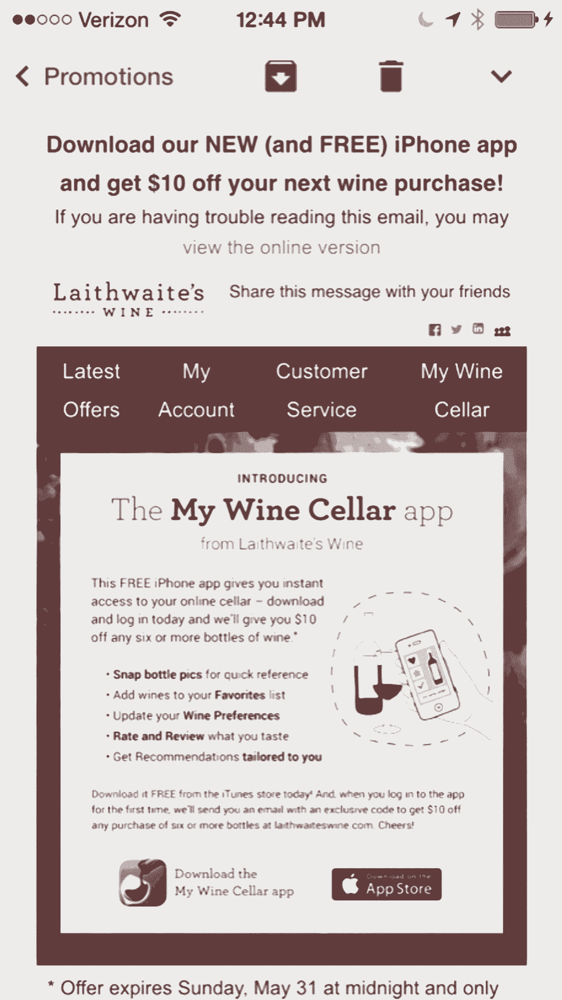

# 以下是 Adobe 产品营销总监如何驾驭选择的悖论

> 原文：<https://review.firstround.com/heres-how-adobes-director-of-product-marketing-navigates-the-paradox-of-choice>

*这篇文章是由* ***[【凯文林赛】](https://www.linkedin.com/in/kevinlindsay "null")*******[Adobe](http://www.adobe.com "null")****产品营销总监撰写的。他花时间传达各种极其复杂的产品信息。如果有人看到了选择是如何阻碍消费者的，那就是他。这就是他如何学会在悖论中生存的。**

*人们渴望相关性——我们都同意这一点。但是随着个性化功能的兴起，有一个新的第 22 条军规在起作用:**尽管品牌** ***可以*** **策划和传递相关体验，但是** ***实际上*** **你的用户想要什么呢？还是说，人们真的希望在做决策时有无限的途径、选择和机会？***

*我认为两者都有一点。尽管拥有无与伦比的能力来提供精心策划、消息灵通和现场的数字体验，但需要在选择和超相关性之间取得平衡。*

*上菜太多，你已经麻痹了消费者。不提供足够的服务，你的用户会觉得被欺骗了或者被“老大哥”了。*

*当然，这是一种微妙的平衡，但对于大规模提供有意义的相关性来说是必不可少的。*

*随着对时间和可自由支配支出的需求不断增加(加上消费者对任何不是高度定制的东西的完全不容忍和不耐烦)，个性化不仅是一个强大的工具，而且是一个必要的工具——几乎十分之九的消费者表示定制体验会影响他们的购买决定。那么，品牌难道不应该至少尝试传递它们似乎想要的东西吗？*

*在你同意之前，想想你自己作为购物者或应用程序用户的经历。普通美国人每天面临 [70 种不同的选择](http://www.businessinsider.com/too-many-choices-are-bad-for-business-2012-12?op=1 "null")，从简单的——穿什么、去哪里买咖啡、晚餐做什么——到戏剧性的、棘手的决定，比如是接受一份新工作还是高价购买机票。这种情况每天发生很多次，我们甚至没有注意到我们做出的大多数选择。但当我们面临更艰难的决定时，有一种复合效应会增加我们的焦虑。*

# *营销者的困境*

*定位和个性化技术有助于缓解一些日常压力。它让消费者可以花时间去担心更重要的事情，比如那些更大、更重要的决定。像“我该买什么桌布？”以及“我想要哪件冬季夹克？”可以委托给专家，即能够基于过去的行为和偏好创建相关消费者体验的品牌营销人员。*

*听起来很棒，但作为消费者，我还是很纠结。我对完全策划的个性化体验的概念产生了动摇。毕竟，我有不同的口味。如果你浏览了我的书架或 iTunes 账户，你绝不会猜到是同一个人选择了这一切。那么，你怎么能据此猜测我想要什么呢？现在，想想这样一个事实，营销人员的工作远远少于这种对我个人财产的深入调查。由于匿名访问者——很可能是网站流量的主要来源——品牌正在无限减少。*

**在* *[选择的悖论](http://www.amazon.com/The-Paradox-Choice-More-Less/dp/149151423X "null")* 中，作者巴里·施瓦茨就这个话题清楚地表明了自己的观点:大量的选择和无尽的可能性并不能让人感到自由和自主。*

*选择太多实际上会造成高度的压力和焦虑。*

*假设我正在为我的第一次马拉松训练。我需要运动鞋，所以我在谷歌上输入“马拉松最佳运动鞋”。出现了将近 110 万个结果。我点击了前几个，但我不喜欢我所看到的。或者更有可能的是，它们与我并不完全相关——它们是女鞋，没有我的尺码，超出了我的价格范围，或者，它们只是不适合我已经拥有的其他装备。我很沮丧，继续点击。也许我会买，也许我不会买，或者也许我决定以后再来看看，尽管体验是一样的。*

*相反，如果那段经历是为了最大程度的相关性而为我策划的呢？根据我目前的跑步服装或过去的购买情况以及已知的考虑因素，无论是人口统计学、心理学还是历史因素，我似乎会得到一双对我来说完美或几乎完美的运动鞋。首先展示给我的运动鞋永远是正确的颜色、尺码、审美和价格。就好像有人钻进了我的脑袋，然后神奇地，这双运动鞋就出现了。我买了它们，显然每个人都赢了。*

*有大量的研究支持这个概念。在一项里程碑式的研究中，杂货店购物者遇到了两种类似的显示:一种显示 6 种果酱，另一种显示 24 种果酱。不出所料， **[50%](http://www.businessinsider.com/too-many-choices-are-bad-for-business-2012-12?op=1 "null")** 更多的购物者停在了 24 人桌前，但只有 **[3%](https://blog.kissmetrics.com/too-many-choices/ "null")** 真正进行了购买。至于那张六人桌？换算成 30%。*

*当 P&G 从商店货架上砍掉五款海飞丝产品时，他们看到该品牌的销售额增加了 10%。在这些例子中，在最重要的时间和地点——在转化中——更少导致更多，所有这些都支持 Schwartz 以及亲个性化数字营销人员所做的深入工作。*

*但是所有这些并不意味着严格限制选择是正确的。 **人们总是想知道他们** ***还应该*** **想要或需要什么。**虽然我可能会为我的马拉松比赛买一双合适的运动鞋，但我仍会好奇第二扇门后是什么，二十万还是两百万。更重要的是，如果我买的运动鞋有什么不对劲的地方，我会怀念另一双的话，为我没有更深入更努力地去寻找的决定而惋惜。即使运动鞋很棒，也有“[机会成本](http://www.ted.com/talks/barry_schwartz_on_the_paradox_of_choice/transcript?language=en "null")的巨大痛苦——如果我真的不知道还有什么可以与它们相比，我真的能充分重视这些运动鞋吗？*

*【FOMO——害怕错过——搭配无限制的访问，让人觉得有无限的东西可以潜在错过。*

*这是一个非常真实的悖论，作为营销人员和消费者，我每天都能看到和感受到。如果有一个正确的答案，我会主张培养和拥抱消费者对选择和丰富的渴望，同时提供一些经过仔细考虑的相关性——这是一个微妙的平衡，你的品牌需要通过严格的测试来找到，但这是可行的。*

# *寻求平衡以打破悖论*

*以下是我个人使用过的一些策略，我发现这些策略对试图在选择自由和过度定制之间找到平衡点的营销人员很有帮助:*

***允许人们根据自己的判断进行深入研究:**从小的、简单的消费者决定开始，向上发展到更大的、更具挑战性的决定。例如，夹克的颜色应该放在具体的合身程度和特点之前。*

***区别对待大采购:**“当你有更多好的选择时，你并不觉得更好。“你只会感到更加焦虑，”大采购公司的心理学家阿米泰·申赫夫说。在这些情况下，客户的行为可能更倾向于质量而不是价值。将它们默认为中等价格的选择——不是最便宜的，但也不是最陡的——往往会有回报。之后，客户可以自行上下移动秤台。*

*当你提供搜索结果时，请三个一组地思考:从产品推荐到多项选择测试，三个似乎是最佳选择。他们的想法是，这三个人中有一个是完美的，另外两个是优秀的亚军。你可以这样想:你可能从来没有一个活生生的销售助理说，“你可能也喜欢这个，或者这个，那个，那边那个，也许这个……”对于搜索结果，人们通常不想看到一页又一页的“相关”项目。通过测试找到你的最佳点，但在此期间，三是一个很好的起点。*

***社交分享也是一种选择:**让顾客或用户分享他们对你品牌的体验比以往任何时候都重要。但是你可以轻易地压倒他们，让他们不采取任何行动。不要让你的产品页面充斥着所有可用的社交图标和分享选项。你只是在给你的顾客制造更多不必要的选择和焦虑。提供两到三个核心图标——也许是脸书、推特和电子邮件——如果需要，提供一个其他图标的下拉列表，将它们隐藏起来。*

***邮件应该问一个简单的是或否:**点击此处或不点击。当你用选择来包装你的信息时，你会分散注意力，从而导致更少的转化。得益于手机，电子邮件营销正在经历一次复兴，带来无缝、优雅的购物体验。一个简单的号召可以是，“嘿，你正在用 iPhone 阅读这封邮件。太好了，下载我们的 iPhone 应用吧！”如果人们现在在手机上阅读大部分电子邮件，简单的行动号召是最重要的，有一个反映你的目的的主题是至关重要的。这里有几封我认为特别有启发性的电子邮件:*

*这里有一个与移动阅读体验明显相关的例子:*

**

*这封邮件清晰地号召人们采取行动，引导每一个看到邮件的人做出特定的选择，同时也培养了一种无限选择的意识:*

**

# *你会失去什么*

*消费者总是可以做出不选择的选择，然后大家都输了。*

*被太多的决定弄得不知所措的消费者通常什么都不做，因为他们不能归类、合理化或处理需要发生的事情来做决定。在这些情况下，这不仅仅是营销失败，它不为任何人服务。你没有销路，但消费者也错过了一双完美的马拉松运动鞋。*

*那么，哪些品牌在这方面胜出了呢？一个很好的例子是去年被诺德斯特龙收购的男士个性化服装服务公司 [Trunk Club](https://www.trunkclub.com/ "null") 。Trunk Club 的 250 名私人造型师将传统的学校服务与巧妙的应用程序和其他数字策略相结合，在选择服装并发货之前，了解会员的品味和偏好。结果是一个策划的经验，不觉得受到限制。当我觉得有一个专家看到所有的选择并为我做出这些决定时，我不需要很多选择。这只是一个例子，说明了一个品牌如何在根据数据精确定位产品的同时，提供自由的感觉。人类专家的想法使得过滤不那么令人不安。但大多数创业公司都能通过不断的实验和迭代找到自己的凹槽。对于大多数营销人员来说，这就是我如何看到它朝着正确的方向发展的。关键是要知道你一开始就在和这个悖论打交道，过度个性化只是一个简单的答案，不一定是正确的答案。*

*看似无穷无尽的选择和机会只需点击一下鼠标，再加上个性化程度的提高，这是一场真正的拔河比赛。作为一名消费者，我想要选择，还是仅仅*认为*我想要选择？作为营销人员，我应该为消费者做这些选择吗？如果是，我应该做多深？*

*最终，如果没有创造出来自相关性的亲和力和舒适感，你的品牌最终会疏远消费者。即使是那些像我一样习惯于认为更多、更多、更多总是更好的消费者。*