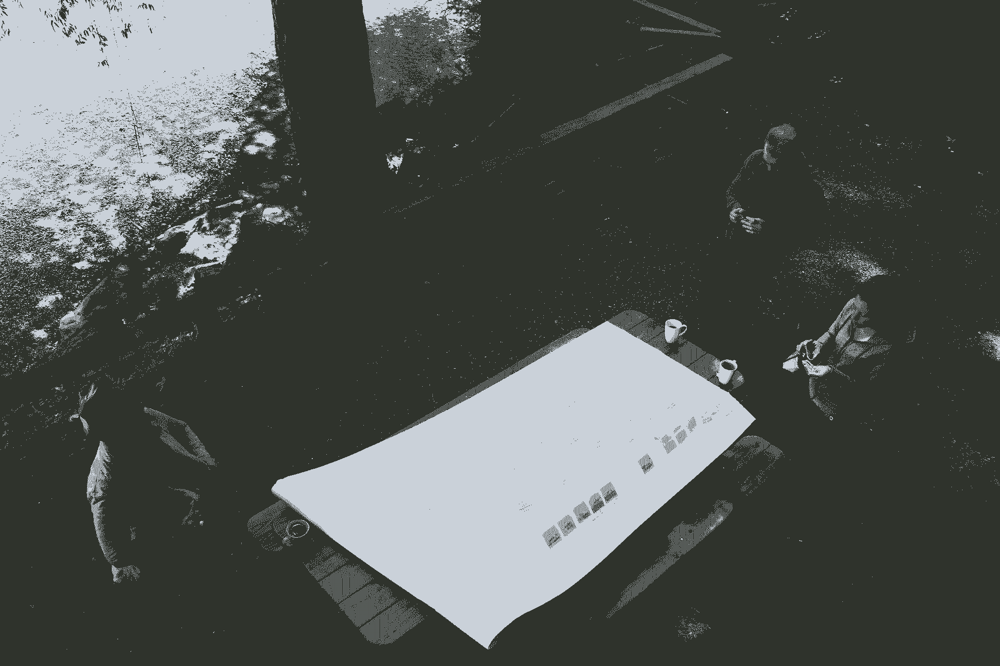

# 以下是 Asana 如何通过其产品重新设计赢得

> 原文：<https://review.firstround.com/heres-how-asana-won-with-its-product-redesign>

产品重新设计散热器成为头条: [Instagram 得到了我们一直等待的重新设计](http://gizmodo.com/instagram-gets-the-redesign-weve-been-waiting-for-1775997545 "null")。 [Medium 重新设计的网站想把我们带回博客](http://www.theverge.com/2015/10/7/9476753/medium-redesign-blogger-2 "null")。[脸书联合创始人莫斯科维茨重新打造未来工作创业公司 Asana](http://www.usatoday.com/story/tech/2015/09/30/facebook-co-founder-moskovitz-retools-look-his-future--work-startup-asana/73096480/ "null") 。然后是你的用户。无论是消费者产品还是企业产品的重新设计，他们都是宣布成功或失败的人——要么通过赞扬和推荐，要么通过对他们的卸载程序投票。当对重新设计的评判常常来自用户的品味时，一家公司怎么能拥有自己不断变化的身份呢？

产品经理山姆·戈特勒对这个问题思考了很多，尤其是当它涉及到改善团队协作的时候。作为 Asana 产品团队的早期成员，她专注于构建一个简单而强大的产品，帮助团队更好地一起跟踪工作。Goertler 之前在 Yammer 工作，早期致力于企业社交网络。她熟悉深夜推送、幕后混乱和大规模发布前的准备工作。还有重新设计的期望可能会像中学舞蹈一样分裂。一方是设计师，他们有远大的梦想，广阔的思维，希望找到解决所有产品问题的灵丹妙药。另一方面是项目管理系统，正在努力应对高得不可思议的风险、对用户反弹的恐惧以及要执行的复杂计划。这只是两种类型的利益相关者。

在这次采访中，Goertler 解释了为什么重新设计——即使是用户已经喜欢上的应用程序——既困难又不可避免，以及如何用勇气和优雅驾驭它们。使用 Asana 的成功重新设计作为案例研究，她概述了需要集合的团队，旗帜的障碍以及如何克服它们。最后，她深入探讨了如何采用独特的迭代方法进行重新设计，以及何时宣布成功。

# 为什么重新设计如此艰难却又如此不可避免

曾经有一段时间，微软 Word 以奥运会一样的节奏出了新版本，但那段时间已经过去了。人们已经采用了敏捷方法和快速发布周期。现在扩展设计系统的跑道更短了；时间单位是周而不是年。如果 SaaS 公司每隔几周发布一次新功能，这并不罕见，因此重新设计成为与更快的产品开发周期相匹配的自然考虑。Goertler 认为，有两个关键因素——一个外部因素，一个内部因素——主要推动了这种变化。

数字界面在我们日常生活中的流行加速了设计趋势的演变。“我们现在做的几乎所有事情，无论是购物、理财还是预约医生，都是通过数字界面来完成的，”Goertler 说。“这意味着有更多的设计师正在集体推进设计语言，推动视觉风格向前发展。反过来，这导致了设计趋势的更快转变。这是一个良性循环。”

但是良性循环也是恶性循环。那些不能跟上市场速度的人可能会被彻底淘汰。“归根结底，设计趋势的发展速度比以往任何时候都要快。戈特勒说:“新款式一推出，相比之下，以前的版本就显得非常过时了。”“一个明显的例子是，当 iOS 发布其新的[平面设计](https://en.wikipedia.org/wiki/Flat_design "null")来取代史蒂夫·乔布斯长期青睐的更具[外形的设计](https://en.wikipedia.org/wiki/Skeuomorph "null")。现在，如果你看那个早期的设计，感觉就像一个旧世界的遗迹。像苹果这样的标志性品牌之所以能在*存活下来，是因为*他们发展了自己的品牌。如果你跟不上，你将很难吸引和留住用户。”

如果设计趋势的快速循环是重新设计的外部触发因素，那么还有一个内部原因也应该被启动:产品开发的速度。“不仅仅是设计趋势在加速发展。Goertler 说:“我们看到在更短的时间内开发了更多的功能和特性。“在一年内，你可以从一个 MVP 变成一个充满功能的产品，当更多的功能以最高速度堆积时，可能会变得难以为继。这时你就达到了你最初设计的极限。你不能扩展你的设计系统来适应新功能的开发。所以是时候重新设计了。另一种选择是继续把所有东西塞进已经很混乱的用户界面，这会扼杀你所有的功能开发工作。”

在动态力量的作用下，你会认为重新设计过程相对容易。然而，在有些情况下，执行团队和产品经理会拖延重新设计。当他们这样做的时候，让你的用户为你说话。下面是对这些关键利益相关方的详细介绍:

**期待高管团队和项目经理对重新设计采取规避风险的态度**。“让他们接受重新设计肯定很难。他们倾向于选择在投资回报和风险方面更直接的项目，”Goertler 说。“例如，相比之下，功能开发工作似乎对项目经理和高管更有吸引力，因为增量构建功能可能更简单。这意味着在 A/B 测试的帮助下，风险更低，成功的衡量标准更清晰。假设是，为了成功地执行重新设计，你必须埋头几个月，然后带着一个大启示从另一边出来。你祈祷你没有错过目标。对于高管、项目经理和其他关键利益相关者来说，这可能非常可怕，也没有吸引力。”

**通过引导用户来强调重新设计的紧迫性。你的用户是你的风向标，会激发重新设计的灵感，所以每隔 24 周在你的定期调查中加入一个关于设计的问题，对他们进行调查。如果你已经达到了设计可扩展性的极限，扼杀了所有功能开发的成功，或者搞乱了你的 UI，那就让你的用户为你说话吧。**

“如果你的公司仍然不觉得有必要重新设计，并且一拖再拖，那就联系你的用户。我认为追踪重新设计需求的最好方法是通过净推广分数调查从你的用户那里获得脉搏。许多公司使用 NPS 来衡量口碑增长，所以这是公司和客户都熟悉的工具。Goertler 说:“它会询问他们是否会推荐你的产品，并提供一个选项来增加颜色。”“在 Asana，我们发现原始设计是人们不推荐我们产品的首要原因。这是一个明显的迹象，表明我们无法适应用户的现代生活，我们杂乱的用户界面阻碍了他们从新功能中获得价值。有证据表明，我们的设计阻碍了我们的成长和参与，这两个指标引起了高管和项目经理的注意，并对他们产生了深远的影响。"

如果你的用户没有改变重新设计的内在动力，那就模仿产品团队的策略。这并不意味着将设计团队的目标改变为产品团队的目标，而是适应他们实现和衡量目标的方式。Goertler 说:“我们通过提出一个增量战略来减轻内部对重新设计的担忧，该战略将利用[的所有优势，我们从功能开发过程](https://asana.com/pm-teams "null")中学到的东西，并将其应用到重新设计过程中。“这种方法可以让你尽早验证你的假设，建立势头，知道何时改变路线，并识别何时达到收益递减。当我们能够将功能开发的这些方面应用到我们的重新设计策略中时，每个人都同意了。”

# 如何组建你的重新设计团队

重新设计不仅影响你的公司如何使用你的产品，也影响他们如何在本能层面上联系和感受它。从逻辑上讲，这意味着这是一项影响整个组织的独特任务，但实际上不可能让每个人都参与到每一步中。以下是 Asana 如何组建负责其重新设计的团队:

**召集一个临时的、跨职能的团队。作为产品经理的 Goertler 和首席设计师 Vanessa Koch 合作领导了这次重新设计。他们组建了一个由产品经理、设计师、高管和用户研究人员组成的团队，一起为一个明确的 sprint 而工作。“有两个领导很重要，一个负责产品，一个负责设计，这样才能成功。Vanessa 是我们这个项目如此成功的重要原因。她能够让整个设计团队参与到项目的探索阶段，我们在这个阶段考虑所有不同的视觉风格和 UX 的变化。Goertler 说:“她能够从整个设计团队获得意见，并将其整合到一个单一的愿景中，这一点至关重要。“至于团队，我们组织了我们的‘计划’，对我们来说，这是一个跨职能团队，在四个月的时间里聚集在一起解决更高层次的问题。在这种情况下，它是关于用户困惑——我们还不知道重新设计是解决方案。我们从 NPS 报告中收到一个信号，我们的 UX 让用户感到困惑，我们需要深入研究这个问题。直到那时，我们才意识到问题的严重性和全面改革的必要性。”**

我们重新设计的起源的关键在于，我们首先召集会议是为了解决一个问题，而不是实施一个解决方案。

重新设计项目通过搬迁到森林中的一个小屋开始了与团队的合作。目标是走出办公室，在不受现有设计干扰的情况下，留出大量不受干扰的时间一起工作。“由设计师、产品经理、高管和用户研究人员组成的团队开始了由我们的用户研究团队领导的头脑风暴练习。戈特勒说:“他们会通过展示从用户那里收集的大量定性数据来描绘问题的全貌。“然后他们会在轶事胡椒。一个用例是关于一家建筑公司使用 Asana 来帮助他们的团队协调房屋建筑。我们真正了解了用户是如何工作的，他们如何使用我们的产品，以及他们使用什么其他产品来完成他们的工作。一旦我们真正清楚地了解了他们的工作流程，我们就开始集思广益，让我们的产品能够改善他们跟踪工作的方式。”

**从痛点入手解决哲学分歧。**重新设计团队中的产品经理团队渴望使用迭代方法进行产品开发。概括地说，这意味着从一个 MVP 开始，A/B 测试它，并迭代到一个更好的最终结果。然而，这种方法并没有立即让设计师们满意。“他们认为重新设计不仅仅是各个部分的总和。因此，他们无法想象以零敲碎打的方式进行重新设计，或者让用户经历弗兰肯斯坦式的体验，旧风格的部分将与新设计的残余共存，”Goertler 说。

Goertler 和 Koch 想知道是否有一种方法可以两全其美，将团队中设计师和项目经理的本能结合起来。他们找到了一种采用迭代方法的方法，同时还构建了一个对用户来说更全面、更全面的盛大发布。

“我们没有选择设计师的方法而不是产品经理的方法，而是更深入地研究了用户认为的主要问题。“我们意识到有两类问题:结构性问题，如导航中断和缺乏层次结构，以及视觉问题，如过时的按钮样式和单调的配色方案，”戈特勒说。在困难点中做出这种区分允许我们合并我们团队的不同哲学。我们意识到，我们可以在旧的视觉风格中逐步启动结构改进，而不会让用户经历弗兰肯斯坦 UX。一旦结构变化被整合，我们可以一举完成视觉刷新，已经减轻了用户反弹的风险，因为他们不必在一夜之间改变他们的工作流程。"

我们知道设计会改变，但我们需要一颗北极星来指引我们完成增量工作。

# 如何采用迭代方法进行重新设计

在 Asana，一个递增的、迭代的重新设计计划获得了批准，但它并没有立即平息所有的担忧或重整组织。将紧张转化为富有成效的团队合作需要更多的步骤。要启动迭代风格进行重新设计，借鉴功能开发中使用的相同方法:设定一个总体愿景，将其分解为独立的部分，并对它们的发布进行排序。下面是重新设计团队如何开始这一过程的:

**定下大方向。**“我们的用户研究团队领导了头脑风暴练习，梳理出一个可以解决我们用户困惑问题的愿景。我们的设计团队列出了可能会提高用户清晰度的具体可能性。在我们的森林之旅后，Vanessa 将所有这些想法整合到一个单一的概念模型中，这个模型不需要太完美，”Goertler 说。“因为每个人都知道我们正在采取渐进的方法，所以更容易就总体愿景达成共识，并得到其他利益相关方的支持。每个人都知道我们永远都不需要运送那些最初的设计，所以这降低了风险，也更容易不去挑剔哪种蓝色最好。”

**将设计分解成几个部分**。“一旦我们有了大方向，我们就必须逐步实现目标。Goertler 说:“这意味着将 concept mock 分解成所有独立的部分，比如顶栏和侧边栏导航。“在这里，你很容易迷路，所以依靠一个咒语——我们使用‘最大化清晰度’当我们把设计放在一起时，我们有了新导航的许多版本。所以当我们陷入困境时，我们回到了我们的口号。如果我们认为一个设计会比另一个给用户带来更多的清晰度，我们就选择它并继续前进。"

**对发射进行排序**。“在确定了重新设计的独立部分后，我们必须找出如何以一种能够优化预先学习的方式安排发布顺序。为此，我们列出了我们认为可以从每个单独的版本中学到的东西，”Goertler 说。“如果它与现状大相径庭，或者如果它是一个基于假设的设计，我们无法用原型进行测试或获得用户反馈，那么我们知道我们需要从实际推出它中学到很多东西。我们希望尽早获得这些见解，以便我们能够调整我们的路线，达到最佳的最终状态。”

**尽早验证假设**。“渐进式方法的主要优势是边走边学。戈特勒说:“在根据错误的假设做出重大决定之前，你可以回答最大的开放性问题，从而减少未来发生大灾难的可能性。”“但另一个优势是，你还可以一路造势。使用 *[美丽心灵](https://en.wikipedia.org/wiki/A_Beautiful_Mind_(film) "null")* 方法，你不会几个月都躲在一个房间里——你可以发布、获得反馈并赢得组织的信任。”

**取得第一场小胜**。即使在 Asana 开始重新设计的计划后，仍然有紧张。在人们真正接受重新设计之前，它取得了一个小小的胜利。“最初几次发布取得初步成果后，人们的情绪终于发生了变化。Goertler 说:“展示我们的工作是如何推进的，有助于改变人们的想法，并让公司在那之后团结在我们周围。“我们的第一次发布是重新设计的顶栏导航，我们进行了 A/B 测试。这是核心指标的一大胜利。一旦人们看到小的变化奏效，他们就会意识到他们不需要害怕更大的转变。”

Sam Goertler

# 如何让用户帮助指导你的重新设计

定义一个粗略的时间表、发布策略和反馈循环是很重要的，但是你的用户会帮助你完善这些元素。下面是 Goertler 关于如何让你的用户在你的重新设计中发挥额外作用的建议。

**冲刺到一个信号，而不是一个期限**。进行重新设计的 Asana 团队没有拖延，但他们也没有赶在预定的最后期限前完成。Goertler 说:“虽然我们在设计上花的时间确实有上限，但更有价值的衡量标准是限制我们获得特定信号的时间。”“请记住，我们是通过渐进的步骤来工作的。我们将向下一次发射冲刺，一旦我们有了那次发射的 A/B 测试结果，他们就会给我们下一步做什么的信号。我们让信号的强度指引我们。例如，导航发布是我们核心指标的巨大胜利。但随着时间的推移，每一次后续变化的影响越来越微妙。那时我们知道，与追求收益递减相比，在重新设计的其他地方，可能需要做更有影响力的工作。”

**抵制过度捆绑销售**。迭代方法的优势在于，与用户的交互有助于您更好更快地隔离问题。“如果我们用顶栏导航来启动侧边栏导航，我们可能无法从用户那里获得清晰的信息。Goertler 说:“顶部导航栏确实有助于解决用户界面混乱的问题，因为它到处都有太多的行动要求。“但如果我们将它与我们的侧边栏导航版本配对，我们可能不得不理清这些反馈。我们意识到侧边栏不适合拥有许多共享项目的大型组织。取回那些 A/B 测试结果是痛苦的，但我们真的很高兴它已经独立启动，这样我们就可以找到我们的失误，回滚并修复它。否则，它可能会污染整个发射。”

Asana's initial design

Asana's new design

**将您的客户融入您的大型设计展示中**。如果你只是把你的客户当作运行你的设计 A/B 测试的机制，你就错过了一个很大的机会。Asana 为了他们的大型发布会特意激活了它们。Goertler 说:“所有 UX 的增量变化都有一个最小量的进入市场战略，因为我们正在进行 A/B 测试，不确定我们可能会回滚什么。“但当我们最终推出新的视觉风格时，这是我们向世界展示所有进展的机会。营销活动倾向于顾客的喜爱:为媒体举办的[特别活动](https://vimeo.com/140956244 "null")，吸引社交媒体，博客帖子都围绕着宣布全新 Asana 的顾客故事。“在野外的用户反应也是这个过程的核心——他们的反应是我们发布的关键。”

我们给了用户一个选项:新设计的体式或者回归老版本。不到 1%的人回去了。

重新设计不仅应该反映一个公司，而且应该反映使用其产品的顾客。两者都在继续发展，数字接口的激增和产品开发的步伐加快了这两者的发展。尽管重新设计是不可避免的，但考虑到它们被认为是有风险的、不可预测的努力，请期待内部的阻力。组建一个跨职能团队。镜像度量标准，结合每个参与功能的方法，启动重新设计的迭代方法。设定一个总的方向，把它分成几个部分，并对你的发射进行排序，以便在早期更快地学习。最后，让你的用户参与进来，帮助衡量和庆祝成功。

“重新设计最重要的一个方面是灵活性。当你采用增量方法时，你的计划会根据你从用户那里收集的反馈而改变。戈特勒说:“这是一件好事，因为这意味着你正在学习，越来越接近理想的最终状态，而这种状态在开始时是模糊的。”“你必须先开始，然后才能确切知道你会在哪里结束。虽然我们在 Asana“完成”了我们的重新设计，但我们以这样一种方式创造了它，随着我们的发展，有改变的空间。如果你是一家打算长期存在的公司，你不仅需要一个增长模式，还需要一种灵活性。”