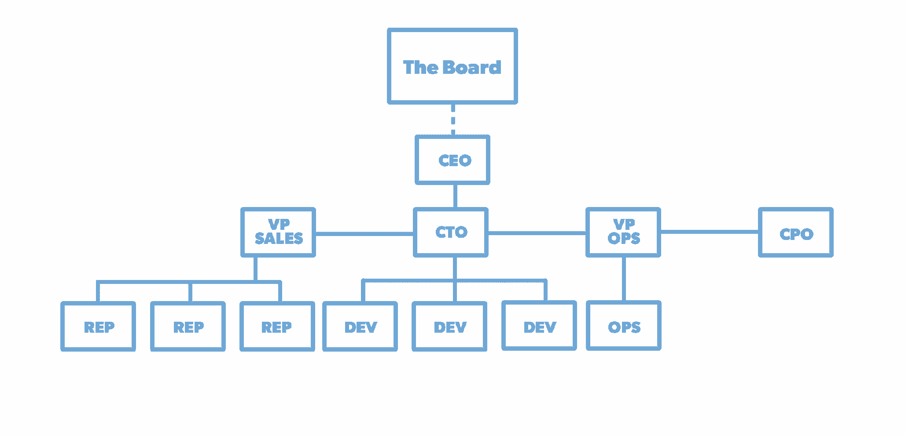
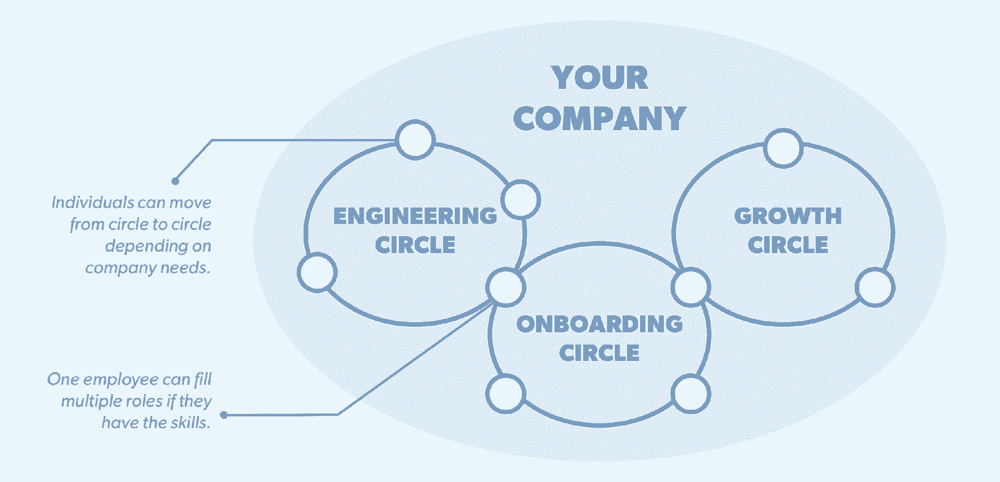

# 以下是您应该关注 Holacracy 的原因

> 原文：<https://review.firstround.com/heres-why-you-should-care-about-holacracy>

*本文由* *[亚当皮索尼](https://twitter.com/adampisoni "null")***[Yammer](http://yammer.com "null")**联合创始人兼前 CTO。他还是**[Responsive.org](http://www.responsive.org/ "null")**的创始人，这是一个致力于帮助公司变得更加敏捷、适应性更强和更有能力的新运动。**

*最近，我在一家名为[暗流](http://www.undercurrent.com "null")的咨询公司呆了一个月，观察他们如何帮助组织变得更加适应和灵敏。这是一个变革性的概念，我最近想了很多——包括没有一种通用语言来简洁地解释在这种情况下 responsive 意味着什么。所以我先打个比方:*

*软件开发人员知道术语'**敏捷**'描述了一套应该帮助你构建更好产品的原则。SCRUM 是一种开发方法，它体现了这些随着你的学习和调整而构建的原则。这意味着是对瀑布式开发的改进——也就是人们过去用来构建软件的方式，即先计划后构建。*

*在敏捷出现之前，我们很少使用瀑布这个术语。这就是我们建造东西的方式，所以我们不需要一个词来形容。我们也不需要谈论开发方法，直到我们有多种选择进行比较。现在我们都明白了"**开发方法学**"具体来说就是"一个用来构建、计划和控制**开发**一个信息系统的过程的框架。"*

*但是我们怎么称呼用来运营整个公司的框架呢？大多数学者称之为“运营模式”——一个组织进行结构、计划和流程的方法。特别有趣的是，尽管所有公司的运营略有不同，但它们实际上都使用 100 多年前发明的相同运营模式。例如，几乎所有的公司都使用相同的层级结构，即经理在经理之下，经理在经理之下，决策自上而下，行动在下。*

*“指挥&控制”(或 C & C) 是这类组织的公认术语。它至少做对了一件事:它创造了一种通用语言来描述每个人都能理解的运营模式。一个多世纪以来，我们第一次开始看到可信的替代方案，其中大多数[指出了“响应性”的概念](http://www.responsive.org/ "null")——一个组织应该通过优化开放的信息流来学习和快速响应；鼓励快速循环中的实验和学习；以及在共同目标的激励下，组织一个由员工、客户和合作伙伴组成的网络。*

*这些响应方法之一是 **Holacracy** ，定义为“*一种构建、管理和运行组织的综合实践。它用一种通过分配权力来实现控制的新方式取代了今天自上而下、预测和控制的范式。*“现在，这个系统正被用来为像 [Zappos](http://www.zappos.com/ "null") 、 [Medium](https://medium.com/ "null") 等公司服务。*

*但是在我深入研究 Holacracy 之前，让我们来看看为什么我们甚至需要新的组织方法，如果旧的组织方法已经运行了这么长时间。*

# *我们一直在做的事情有什么问题吗？*

*为什么我们如此重视在开始执行之前制定详细的前期计划？嗯，在我们的前辈看来，如果你的地基设计成只能支撑 10 层，你就不会想开始建造一座 20 层的摩天大楼。你想要一个具体的计划，你想要实现这个计划。*

*这种态度变得如此根深蒂固，以至于围绕它形成了一个完整的咨询和服务生态系统，从而降低了项目投标价格，并在不可避免的变更单上获得了大量利润。次优系统非常适应它们的环境。这就是它们如此难以破解的原因。例如，这就是为什么底特律汽车公司和 UAW 能够长期生产劣质汽车。*

*人类普遍希望最大化可预测性，消除意外。*

*我们非常喜欢这样，所以我们也尝试用这种方式来构建软件。只有软件比建筑更难预测。与其说是科学，不如说是艺术。而且，当你了解到新的信息时，改变你的计划实际上是可能的和有益的。这是敏捷的基础。您在短周期内构建软件，以收集反馈并快速调整。突然，旧模式满足的需求发生了变化，做生意的成本不再值得。*

*当问题的解决方案不可预测时，制定僵化的长期计划是行不通的。问题是，不可预测性不再仅仅影响软件。现在，我们希望各种产品和服务能够随着我们快速变化的需求而变化。我们希望杂货服务在我们知道之前就推荐我们需要的东西。我们希望服装品牌能跟上当前的潮流。旧的做生意方式达不到这些目标。但是直到现在，人们认为那是他们唯一的选择——C&C 或者混乱。*

*Holacracy 只是第一个真正的公司成功使用的 C&C 的完全成型的替代品。是唯一的替代品吗？是不是所有人都应该马上转行？肯定不是。在不久的将来会有很多其他的运营模式可供选择。*

*就像历史学家切斯特·斯塔尔曾经写道的那样:“*文明似乎时常把自己逼入一个角落，在那里沿着当时显而易见的路线前进实际上是不可能的；然而，如果新思想有机会出现，旧体系必须被彻底动摇，以至于失去主导地位。*”*

# *是什么让 Holacracy 与众不同？*

*有着传统层级结构的公司只能在他们的领导者能够应付的情况下改变。引进更好的领导或简化业务会赢得时间，但变化的速度仍然会超过他们。*

*看到这一限制，反应迅速的组织旨在将权力和决策权分配给所有员工——即使这在短期内会降低他们的可预测性和效率。目标是通过增强他们的能力来提高他们学习和应对变化的能力。*

*混乱仍是敌人。*

*很多人认为反应迅速的公司很少有关于谁决定事情和为什么决定的规则。Holacracy 最令人惊讶的方面可能是它对规则和流程的依赖程度。为了避免混乱，它实际上迫使你比旧的 C 系统更严格地定义角色和职责。*

*假设有一个 10 人的会议，他们需要做出一个具有重大影响的极其重要的决定。在 C&C 的一家公司，房间里职位最高的人负责这个决定。如果那个人仍然没有权力扣动扳机，他们必须去找他们的老板。好消息是最终会做出决定。坏消息是，房间里的每个人在这个过程中都被剥夺了权力。*

*现在假设这 10 个人来自公司的 10 个不同的团队，他们都有相同的权限。除非有广泛的共识，否则他们通常会争论这个问题，直到陷入僵局或升级到他们的老板或老板的老板。或者更糟的是，它将落入最年长、最年轻、最响亮、最有政治头脑的男性或主导者手中——不管这种疲惫、隐含的权力动态如何规定。*

*反应迅速的组织也有可能成为共识暴政的牺牲品，退回到旧的权威体系。这就是为什么明确的规则和协议——就像 Holacracy 概述的那些——如此重要，而且往往效果良好。*

# *Holacracy 是如何运作的？*

*每当你试图改变一个系统的规则时，你都会遇到许多新问题。因此，为了解释 Holacracy，让我们看看它带来了什么变化——一次一个——它们导致了什么问题，以及它们是如何解决的。*

**静态策略的快速迭代**

*就像敏捷开发系统将工作分成冲刺一样，Holacracy 迫使公司在短周期内重新审视其规则、角色、目标和权限。这可以防止你提前过度规划。这也让你有机会定期、频繁地重新评估你的计划、方向和信念。*

*如果你熟悉[康威定律](http://en.wikipedia.org/wiki/Conway's_law "null")，你就会知道公司创造的产品和服务是他们自身的反映。因此，为了快速迭代您的产品，您也应该快速迭代您的组织如何工作是有意义的。*

*为了实现这一点，Holacracy 要求每个团队定期(比如说每月)召开治理会议，人们可以在会上对团队、角色、政策、责任等提出修改建议。*

*C&C 组织没有这样的机制。只有高层的人才有能力重新安排事情，他们很少这样做，因为这只会增加不可预测性。这些类型的变化通常会产生意想不到的后果。Holacracy 没有回避这一事实，而是承认了这一点——没有什么变化是完美的。*

*通过不断迭代，跨国公司可以缓解变化带来的新的紧张，这样他们可以快速学习和适应。*

*治理会议听起来像是浪费时间，而这些时间本可以用来“工作”我的反驳观点是:做正确的事情和你努力工作一样重要，如果不是更重要的话。*

*在 A/B 测试被广泛接受为构建应用程序的最佳实践之前，人们会认为构建多个版本是对时间的巨大浪费。为什么不选择合适的东西开始，然后一次性完成呢？我们现在知道我们经常犯错。如果能帮你找到合适的，构建多个版本也不算浪费。为什么组织应该有所不同？*

**自组织的适应性团队胜过静态团队**

*在 Holacracy，团队被重新命名为“圈子”，他们可以随时被创建或销毁。圈子的定义域可以多次重新定义，圈子内的角色也可以相应改变。听起来很乱，但是有一条规则可以让事情保持一致:圈子只有权力去改变他们权力范围内的事情。如果有必要完成工作，他们还可以在下面创建新的圈子。从本质上讲，圈子是有层次结构的，他们只是不断变化，这使他们在最重要的问题上得到训练，并在任何给定的时间工作。*

**角色不魂**

*在 C&C 公司，允许所有员工提议团队或角色的变化是行不通的。第一，头衔和军衔太重要了。第二，人们通常在一个团队中只有一个角色，一个焦点。人们把 1-1 和他们的头衔等同起来，使他们不精确和不灵活。无论你的头衔是什么，排名也倾向于对其下的所有事情负责。这使得它更加不精确。如果你和 10 个首席营销官交谈，你会得到 10 个不同的答案，关于他们的工作和职责是什么。*

*Holacracy 通过将“角色与灵魂”分离来解决这个问题。角色是基于职责或专业领域的逻辑分组来定义的，忽略了公司的实际人数。你可以有比员工更多的角色，人们会在几个圈子里扮演多个角色。其实一个人在同一个圈子里处理多个角色是常有的事。这使得在不改变头衔或伤害自尊的情况下将责任从一个人转移到另一个人变得容易。*

**角色高于等级**

*考虑到等级的重要性，简单地将角色从灵魂中分离是不够的。我们都经历过地位如何胜过角色。虽然 Holacracy 可能有一个等级的圈子，但它试图尽可能地将人类从那个等级中分离出来。然而，如果说不存在等级制度，那将是一种误导。每个圈子都有一个名为 **Lead Link** 的角色，他有权将人们分配到圈子中的其他角色。然而，与普通的“老板”不同的是，领导链接不应该告诉那些角色的占有者如何做他们的工作。*

**为什么和谁超过如何和什么**

*在传统的组织中，很多时间花在争论做什么工作或如何做。这往往占用了大部分会议时间，源于缺乏明确的问责制。没人知道谁能决定什么。如果说有什么不同的话，试图在传统框架内赋予员工权力只会让事情变得更糟。*

*当老板告诉他们的团队他们要做决定时，每个人都知道这真的是老板的危险。*

*在 Holacracy，人们不会告诉其他人如何做他们的工作——即使是领导环节。因此，与其争论，Holacratic 组织倾向于花更多的时间争论谁应该能够决定，以及为什么一开始就不清楚。这是迄今为止我在观察霍拉克雷斯和 C&C 的行动时注意到的最本质的区别。*

**层级网络**

*解决任何问题的最有效的方法是把所有具备解决问题所需技能的人聚集在一起。我们称之为跨职能或多学科团队。听起来显而易见，但正如任何在大公司工作过的人会告诉你的那样，在实践中很少这样做。*

*早些时候，我提到过，依赖长期的、僵化的计划很难随着新信息的学习而调整。你可能没有意识到，但是组织结构图本身仅仅是早期长期计划的表现。*

*想象一下，你的任务是从零开始创建一个汽车制造商。你可能会从弄清楚所有你想做的产品开始。然后是制造这些产品所需的所有不同类型的工作。然后，围绕这些产品和功能设计组织结构图。您的目标之一是创建一个组织结构图，通过最小化团队之间的相互依赖，给予每个团队最大的自主权。这是因为完全在一个正式团队中完成的工作比需要多个团队参与的工作要容易得多。*

*随着团队数量的增长，这个策略变得越来越困难。最终，你会找到那些从未共事过的人，他们真的应该一起共事。这个问题一直困扰着公司，但随着工作变得越来越复杂，未来越来越不可预测，这个问题变得更加严重。到目前为止，我们对此问题的最佳回应是添加“虚线”矩阵结构。虽然这可能有一点帮助，但它没有解决根本问题:*

*组织结构图本身仅仅是“前期大设计”的最极端形式*

*没有办法设计一个永久的组织结构，让合适的人在尽可能少的依赖下一起工作。如果这是真的，那么当每天都有新问题出现时，你如何确保正确的人在正确的团队中。尤其是当改变团队结构需要痛苦而昂贵的重组时。*

*为了解决这一问题，Holacracy 让创建新的圈子变得容易且相对无摩擦，重新安排圈子内的人，把所有圈子都拆了，重新开始。正如我们之前看到的，这些团队不受早已过时的组织结构图的约束。*

*阅读本文的每个人可能都熟悉传统的组织结构图，以及它们僵化的报告结构:*

**

*然而，当你采用 Holacracy 时，你就进入了一个更加网络化的图表，在这个图表中，人们经常扮演一个以上的角色，并在有意义的时候移动团队/圈子，而不用担心打破一些预先建立的等级制度:*

**

**安全试用**

*由于没有明确的等级制度，任何提议的改变都很容易被其他人阻止。Holacracy 通过创建有利于提议者而不是反对者的规则来处理这个问题。这个想法是通过让任何人都容易提出改变来减少改变的摩擦。*

*这并不意味着没有办法在响应系统中玩弄系统或玩弄政治。*

*机能失调、自私自利和操纵他人的行为如果不被仪式化地压制，它们会茁壮成长。*

*也就是说，通过频繁地采纳建议，确保它们完美的压力会更小。如果某件事不正常，任何人都可以在任何时候改变它。因此，只要每个人都同意这些提议有助于收集有价值的数据，它们就被认为是“可以尝试的”。“尝试安全”是 Holacracy 的一个关键理念。*

*唯一有效的异议是 **A)** 这个圈子无权管理您要更改的域名，或者 **B)** 有证据表明更改会在减轻之前对业务造成实质性损害。*

*因此，举例来说，如果招聘圈子里的人提出一项新政策，即公司应该将 100%的收入捐给慈善机构，人们可能会反对说 **A)** 招聘圈子不控制公司的财务，而 **B)** 捐出他们所有的钱会扼杀这个行业。当然，反复提出糟糕建议的人最终会被感动，甚至可能被解雇。*

*要点是:你不能因为不喜欢一个想法或有更好的想法而简单地反对。即使这样你会犯更多的错误，你也会学得更快，改正得更快。*

**关于部落知识的文档**

*在 C&C 的组织中，规则其实很简单。你的老板授权给你，他们的老板授权给他们。如果你不知道该做什么，你可以问你的老板。无论对错，如果你照他们说的做，你很可能是安全的。鉴于这种简单性，规则很少被写下来，除了以组织结构图的形式。*

*当然，大部分规则都是部落的。“因为这是我们一贯的做法，”这是传统公司的常用语。然而没有人知道为什么，谁决定的，或者谁能改变规则。为了以一种适应性的方式分配权力，规则必须被写下来，这样任何人都可以查找它们，并且快速地弄清楚谁拥有什么以及策略实际上是什么。*

*Glassfrog 是你用来帮助你运营一家 Holacratic 公司的软件的名字。理论上，没有它也能运行 Holacracy，但这很难。这种对软件的依赖并不像其他人那样困扰我。**科技处理了许多我们过去手工做的事情，这扩展了我们的能力。***

*经营公司也不会有什么不同。Glassfrog 帮助你记录你的组织结构、圈子、角色、责任、政策等。它还有助于会议的进行。最后，它提供了对组织所做变更的持续记录。从理论上讲，Glassfrog 更容易弄清楚谁拥有什么，规则是什么，事情如何随着时间的推移而变化，以及学到了什么。*

**隐私透明**

*假设你已经设法让你的组织发展到这一步，并成功地将权力分配到边缘。如果你的员工有更多的权力，你如何确保他们有足够的背景？*

*在大多数组织中，工作和交流都是私下进行的。*

*对于一个分布式组织来说，要发挥作用，更多的工作需要在公共场合进行，在那里很容易被其他人发现。*

*大多数时候，记录事情的人并不清楚发生了什么变化，产生了什么好处。*

*现在有很多好的工具可以帮助你将你的交流、任务管理和文档转移到你组织中的其他人可以找到的地方。Yammer，Asana，Trello，Slack 和 HipChat 只是其中的几个。*

# *其余的在哪里？*

*在一家荷兰公司，你如何招聘、提升和解雇员工？你应该如何优先处理要做的工作或决定谁做什么？剩下的就看你的了。重点不是预先确定什么适合每个人。它给你一个基本的结构，帮助你使规则透明，易于改变，并增加你改变它们的速度。*

# *什么会出错？*

*所以，很多事情。最大的挑战是处理一开始的错误感觉。我们中的大多数人只经历过 C&C 组织，对于事情可能如何不同地运行或者——理想地——比平常更好，没有模型。因此，不退回到旧的思维方式也是不可能的，尤其是当事情出错的时候，这是必然的。你必须给新系统一个真正的尝试，这意味着用它来缓解紧张局势，重塑自我，解决它所带来的问题。*

# *流程的动力*

*对于大多数新人来说，Holacracy“感觉”很奇怪。它经常被描述为“沉重”我甚至感到困惑，为什么一个旨在赋予人们权力的系统需要这么多规则。只是在亲眼目睹之后，我才意识到为什么。*

*人类的权力结构是难以驯服的巨大力量。*

*但是这种力量必须在某个地方终结。在 Holacracy，权力掌握在过程本身，使得个人很难利用他们的地位。如果这让人感觉不舒服，要意识到这是一段时间以来社会前进的方向。*

*在独裁者统治下，规则是由领导者随心所欲制定的。在一个民主国家，我们写下规则，并让我们的领导人像其他任何人一样遵守这些规则。民主之所以能发挥作用，是因为我们将权力从权威人士手中转移到了一个我们都同意遵循的过程中。*

# *结论和后续步骤*

*在暗流，似乎有大量的细微差别，使 Holacracy 为他们工作。显然，他们对这些原则深信不疑，这有助于他们更有效地管理系统。他们也同意，Holacracy 不是万能药，也不是 T4 的绝对替代品*

*当他们第一次改变 Holacracy 时，我不在那里，但我想他们已经随着时间和坚持而改进了。他们也是一群非常聪明和有思想的人，他们知道这很难，但这是他们想做的，以变得更加灵活，有效和有竞争力。*

*我相信，正如越来越多的政府向公民放权一样，越来越多的组织也会向员工放权。至少他们会，如果他们想创建持久的组织。*

***显而易见:分散决策并不容易。**它违背了几代人习得的行为和根深蒂固的心智模式。好消息是我们现在知道这是可能的。从先驱公司的早期报告来看，这似乎也非常有益。*

*如果你选择跟随他们的领导，记住分配权力不是二元的——它是一个光谱。如果你想让你的组织变得反应更快，你可能应该开始想出如何分配权力，即使你一次只做一点点。*

*我的建议是开始行动，不要让你知道会遇到的问题阻碍你。开始尝试朝着正确的方向前进，接受它会带来问题，并把每一个障碍作为一个信号，让它走得更远。*