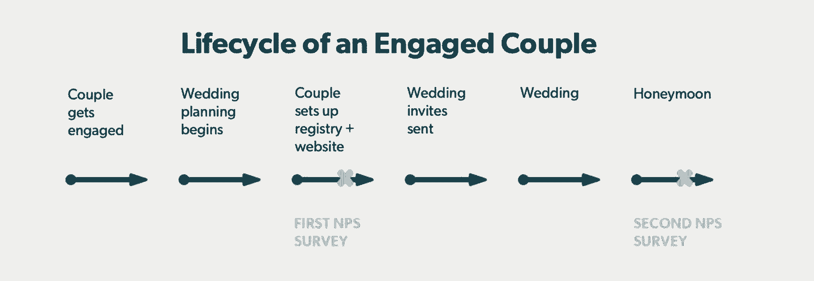
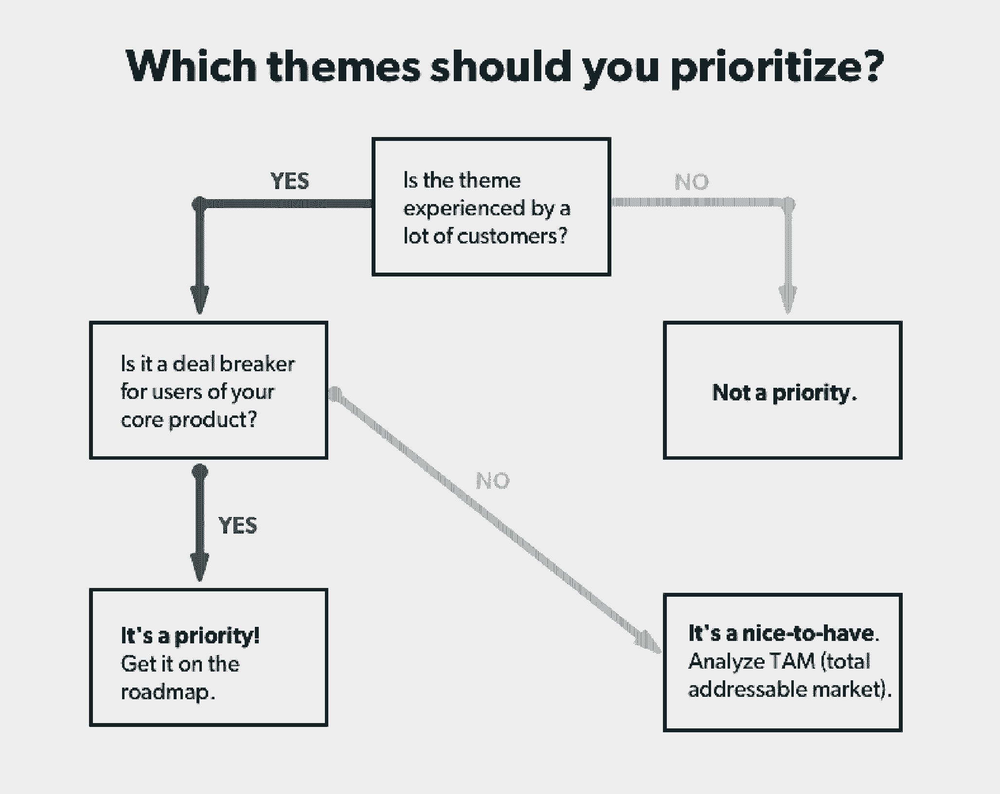

# 这就是为什么左拉珍惜它的 NPS 诽谤者和它的推动者一样多

> 原文：<https://review.firstround.com/heres-why-zola-cherishes-its-nps-detractors-as-much-as-its-promoters>

当 2013 年佐拉 推出为千禧一代夫妇重塑婚礼登记体验时，一些潜在客户需要一点时间才能到达蜜月阶段。“我们采访了数百对夫妇，形成了一个假设，即他们不再需要传统的登记项目。Zola 的首席执行官兼创始人 **[Shan-Lyn Ma](https://www.linkedin.com/in/shanlynma "null")** 说:“我们以为他们只想要体验、未来的现金和新兴品牌的酷礼物。“通过我们的 NPS(净启动子得分)研究和我们在网站上收集的数据，我们马上发现，我们的论文并不完全正确。情侣都想要。我们不得不迅速改变我们的营销策略。”

自从实现这一点以来，Zola 的 NPS 分数提高了 50%以上，超过了亚马逊的分数和零售行业基准。客户满意度一直是马关注的焦点，她曾在 Gilt、Chloe + Isabel 和 Yahoo！。现在她领导着 Zola，这家公司的市值超过 2 亿美元，并被评为最值得关注的 25 家科技公司之一。

在这次独家采访中，马超越了 NPS 的基础，专注于左拉如何对此采取行动——特别是来自批评者的反馈。她深入探讨了推动左拉 NPS 调查外联工作的两个关键因素，以及如何按主题收集 NPS 反馈。有了这些信息，她清楚地说明了闭环意味着什么，以及与谁闭环。我们开始吧。

# 早期批评者是新的早期采纳者

大多数初创公司会寻找早期产品爱好者和品牌大使，以获得提升和宣传来吸引更多客户。这群冠军通常被用作 beta 测试者，他们帮助进一步完善用户体验，甚至帮助决定产品方向。作为“为爱做任何事的婚礼公司”，你会认为 Zola 会被那些赞美它的用户所吸引——并加倍下注。但是你错了。

“听听你在 NPS 调查中得到的所有好东西是很有诱惑力的，”马说。“但我们知道，通过关注那些不太好的评论，我们学到了更多。我们想真正理解某些夫妇不做推广人的原因。”

通过这种哲学，马和她的团队发现了一个反直觉的真理:**诋毁者往往比推动者更清楚地引导。“当我们推出 Zola 时，我们从批评者那里得到的反馈很直接:他们选择了不同的注册，因为我们没有提供足够多他们想要的品牌，”马说。“只有我们的一些推动者触及这个问题，当他们这样做时，就不那么直接了。对于建设性的批评，他们就不那么就事论事了——而且通常是在表达了一些赞美之后:“我们喜欢左拉，希望我们能只和你注册，但我们需要多个注册才能得到所有我们真正想要的东西。”"**

左拉清楚而响亮地听到了这种反馈，尤其是来自批评者的反馈。“我们列出了前 100 名传统注册品牌，并积极跟进。“我们在我们的销售团队中增加了买家，并派代表参加每个家庭用品和桌面贸易展，”马说。“一年后，我们推出了所有 100 个品牌。我们现在拥有 500 多个品牌，并在我们的注册表中提供超过 50，000 件礼品，包括那些传统的注册主食，如全包炊具和 Vitamix 搅拌机。”

自从那次经历之后，来自不冷不热的顾客的反馈现在是影响佐拉产品策略的主要因素之一。但是一项调查中的一个吱吱响的轮子不足以改变产品计划。马和她的团队已经开发了一种系统的方法来处理 NPS，并最大限度地利用 NPS 的诋毁者。以下是她最喜欢的建议:

# 当谈到 NPS 调查外展时，请看这两位女士。

Zola 通过每月**和**里程碑对用户进行调查，从用户(包括批评者)那里获得了最可行的反馈。****

就前者而言，自推出以来，Zola 每个月都会向部分用户发送一份 NPS 调查。“当然，这从一开始就建立了一个强大的反馈回路。但它也让我们能够有条不紊、深思熟虑地解决出现的诋毁者的话题，”马说。“我们知道，如果我们每个月能让少数客户进入促销员类别，将对客户体验和整体业务产生巨大影响。然而，为了不断取得进步，我们不能仅凭任何一条信息就妄下结论或原地打转。”

给予反馈适当权重的很大一部分是节奏。“每季度一次太不频繁，无法长期跟踪主题，而且太容易被一次性反馈分散注意力。从工作量的角度来看，每周一次太频繁了，”Shan 说。“每个月我们都会撰写一份新的调查，并整理数百份答案。每月一次是我们能够与用户保持联系的最佳时机，而且不会在内部产生太多工作，以至于无法承受。”

生病和健康时的名词短语。自发布以来，我们每个月都会发送 NPS 调查。

每月 NPS 调查创造了一个强有力的节奏，但如果没有适当的背景，它们可能会平淡无奇。为了在适当的时候征求意见，马的建议是在开始征求反馈之前做一些思考:“人们生活中的哪些转折点——无论是一周中的某个时刻，一个月中的某个时刻，还是客户生命周期中的某个时刻——最有可能对调查做出回应？”，马反问道。"**当你的客户准备好提供反馈，并且他们有充分的反馈依据时，你就应该主动出击，而不是在对你这个公司来说最方便的时候。**”

对佐拉来说，这意味着在两个不同的地方进行调查。他们的第一项调查是针对那些与佐拉签约并花了一些时间来建立注册的夫妇。第二份调查在新婚夫妇结婚几周后到达他们的收件箱。“策划婚礼不同于购买衣服，也不同于购买保险，”马说。“当我与那些考虑做类似我们所做的事情的创业公司交谈时，我告诉他们要把握时间框架，这样他们才能真正优化以获得最佳反馈。”

这就是 Zola 在客户生命周期中为 NPS 调查找到切入点之前所做的工作:

做好这件事的关键是要广泛地看待顾客生活中正在发生的事情，而不仅仅是他们如何与你的产品互动。“我们的夫妇正处于充满压力的生活变化中。我们不想在他们深入筹划婚礼的时候打扰他们，也不想在他们结婚后的第二天早上发送调查。他们正在度蜜月，但他们还没有机会去考虑登记处的哪些礼物是他们想要保留或归还的，”马说。“所以我们一直等到看到我们的夫妇走过整个生命周期。我必须感谢我们的发展主管[玛雅·西蒙](https://www.linkedin.com/in/maya-simon-371a132/ "null")，他计算出了正确的调查节奏。虽然其他公司可能会在购买产品后发送 NPS 调查，但她发现我们必须考虑用户的完整体验，以更好地适应 Zola 独特的客户生命周期。

除了提高回复率和限制向客户提出的侵扰性问题的数量之外，在这两个关键时刻发送 NPS 调查还意味着马的团队获得了更多可用于产品更改和增强的素材。“这很有价值，因为我们可以了解我们最近注册的群体正在经历什么，以及我们整个周期的群体正在经历什么。我们可以走在生命周期早期出现的新问题的前面，”Ma 说。“或者，我们也可以跟踪夫妇在生命周期后期有时会遇到的问题，而不必等待有人全程参与。”

# 按主题收集您的反馈。

每个月，Zola 都会收到至少 500 份来自 NPS 调查的回复(通常是几百份),这些回复会发送给处于这两个关键生命周期阶段的用户。当回应到来时，是成长团队闪亮登场的时候了。“增长从 NPS 结果中剔除了批评者的评论，并根据我们长期跟踪的主题进行了分类，”马解释道。“例如，一个要求零送货费用的将被存入‘免费送货’，另一个表示品牌数量不足的将被存入‘有限库存’等等。”

一旦诋毁者的评论被分类成主题，佐拉的成长团队就会对它们进行分类。“我们对批评者的反馈进行审查和分类，他们的评论通常与我们一直关注的少数几个主题相对应。我们观察到，前两个主题往往占评论的 50%以上，所以这是我们关注的地方。但不管怎样，一旦出现一个主题，我们就开始调查解决它的方法，或者是什么可能导致这个问题，”马说。“对我们来说，跟踪主题如何随着时间的推移而变化很重要。如果一个连续两三个月出现，我们会把它加到路线图上。其他考虑因素包括问题是什么、解决问题需要多长时间，以及该解决方案对我们利润的影响。”

不过，佐拉的分析比仅仅识别最吱吱响的轮子更深入一点。“阻止人们选择佐拉的问题——交易破坏者——对我们来说是最重要的，因为它们将对我们的核心业务产生最大的影响，”马说。“一个这样的例子来自一些夫妇，他们的年长亲戚很难在网上完成注册购买。这对夫妇选择了佐拉，但他们的年长客人并不总是对网上购物感到放心。因此，负责结帐的团队寻找机会来简化订单流程，并与祖父母一起进行了一些用户测试。解决方案是“随时打电话给我们”的提示和电话号码，这很简单，但在产品采用和客户参与方面却有很大的不同。”

我们核心业务之外的其他主题是“最好拥有”。这些请求需要更多的分析来正确地确定优先级。比如很多对左拉的婚礼登记处有过美好体验的情侣，在爱情和婚姻不可避免地导致婴儿车里的婴儿的时候，都想回来。“由于调查数据的原因，我们选择在婴儿登记处之前举办左拉婚礼，”马说。"帮助新人建立他们的婚礼网站一直是排名第一的主题."

更深入的分析支持了调查数据所讲述的故事。首先，长时间照镜子有助于佐拉明白，提供婴儿注册表将超出其核心产品和品牌承诺。马的团队还考虑了一个他们知道会在下次董事会上提出的问题:“婴儿与婚礼的 TAM(总目标市场)是多少？”

毫无疑问，答案是婚礼。

左拉提出的区分不同主题优先级的问题可以被任何初创公司采用。当你分解它时，决策树看起来像这样:

通过在对佐拉婚礼下大赌注之前运行这个框架，马的团队能够提高他们挑选赢家的几率。“在佐拉出生的前三年，我们希望专注于打造最好的婚礼登记处。但从一开始就收集意见，到我们准备转向婚礼策划工具的时候，我们已经从我们的用户那里获得了三年关于这个主题的数据，”马说。“有鉴于此，我们知道如果我们推出它，它将是一个成功。事实上，它打破了我们最初的所有期望。”

正在进行的 NPS 调查也有助于完善佐拉婚礼产品，在它们正式出现之前消除额外的交易破坏者。“有趣的是，我们听到这样的事情，‘我的家人是印度人，但我未婚夫的家人是犹太人，所以我们有很多压力，如何将这两种传统融入我们的婚礼规划，’”马说。“更多的研究发现，自 2010 年以来，40%结婚的夫妇与不同文化或宗教的人结婚。我们知道，如果这些夫妇得不到照顾，他们最终会成为诋毁者的研究对象，因此解决他们的痛点立即成为当务之急。没有哪两个婚礼是一样的，所以清单也不应该是一样的。”

这项研究对左拉的作品产生了直接影响。“佐拉建立了第一个动态婚礼清单，它超越了基本的东西，比如结婚日期。“当新人第一次报名参加佐拉婚礼时，他们现在会被问及哪些信仰和文化对他们来说很重要，”马说。“情侣们不会得到一份标准的婚礼清单，而是自动得到一份符合他们家庭传统的事件和里程碑清单。"

# 闭合回路，强化你的圈子。

Zola 为回应批评者所做的并不都是可扩展的产品改进——至少最初不是。但不管怎样，佐拉会回复每个留下评论的人。这不仅是一次闭环练习，也是一次一个成员强化社区的练习。

“无论反馈是积极的还是消极的，我们的社区经理 [Melissa Trentadue](https://www.linkedin.com/in/melissatrentadue/ "null") 都会回复每个在 NPS 调查中留下评论的人，并表示他们有兴趣与佐拉进一步交谈，”马说。“个人回应向夫妇们表明，佐拉承认了他们的意见，但这也是为表达关切的夫妇解决问题的机会。”

例如，当客户看起来可能难以采取某些行动时，销售代表会介入提供帮助。有时，这意味着提供额外的服务，以确保这对夫妇保持快乐。“如果我们已经发现了很多把推广者变成诋毁者的共同问题，为什么我们不去干预呢？”马反问道。

如果客户支持问题出现得足够频繁——并且高接触干预是成功的——Zola 将回去设计一个确实可扩展的解决方案。“我们在推出后不久就经常注意到一个问题:一位婚礼嘉宾从登记处购买了一份礼物，但在新人准备好交付礼物之前，它就缺货了，”马说。“起初，每当有顾客抱怨时，我们都会竭尽全力找到替代品，连夜送到，有时还会亲自送到。”

这种程度的干预起了作用，但它耗费了大量资源。按照设计，这不会永远持续下去。“一旦每个人都看到解决了这个问题，减少了我们的诽谤者，我们就找到了在产品中加入类似内容的方法，”马说。“结果是，当商品缺货时，我们会自动发送一封电子邮件。这封邮件给情侣们提了个醒，如果他们不想等，可以换一种不同的产品。总而言之，它防止了缺货情况成为糟糕的客户体验。”

有了 NPS 反馈，不会导致产品增强的东西仍然是建立你的品牌的机会。

当谈到 NPS 反馈时，不要忽视与你最投入的利益相关者:你的团队的闭环。为了让所有员工了解最新情况，Zola 的成长团队在全体会议上公布了每月 NPS 调查的详细结果。“这意味着每个月，公司里的每个人都会看到我们的研究结果，”马说。“是的，这是关于透明度，但更重要的是，这是关于问责制。每个人都必须知道他们在为我们的 NPS 表演和佐拉的成功做出贡献，因此，他们也同样有责任。这样，解决反馈就不再仅仅是产品团队的职责了。每个人都有责任。它触及了每一个团队。”

为了巩固成长团队的发现并激励进一步的探索，所有批评者的评论都被匿名化，并根据需要分发给整个公司。众所周知，马甚至会让同事们分享他们从报告中学到的或最感兴趣的东西。

但是分享这种 NPS 反馈不仅仅是告知更广泛的团队挑战，而是让他们参与到解决方案中来。如果他们看过 NPS 的报道，这一点都不奇怪。“运费是每个月评论中的热门话题，”马说。“对于像这样的大型项目，我们将组建一个‘运营团队’这需要从不同的团队中挑选五到七个人来阐明客户的问题，解构它并找出解决方法。"

在这种情况下，团队的任务是研究 Zola 可以提供免费送货的方式。“这次行动涉及产品、财务、增长和运营部门的成员，他们真正理解了问题，以及不同的解决方案如何改变了我们的底线。马说:“每一项操作都是从收集足够的数据来启动和运行测试开始的，一旦有了结果，团队就会提出长期的建议。“我们最初的测试表明，提供免费送货服务对企业来说是有意义的，而且顾客也很喜欢。我们花了几个月的时间向前推进，因为免费送货是一个昂贵的决定。我们必须预测它对我们底线的影响。但是，一旦我们给它开了绿灯，它花了不到一个月的时间实际上把免费送货到位。这对我们的业务产生了直接影响。我们从销售计划的右下方上升到上方。”

# 开始是

虽然解决那些滋生诋毁者的问题推动了左拉的许多决策，但目标始终是让每对夫妇都成为推动者。如果你正处于同一条船上或者刚刚开始，养成一个习惯，每个月至少调查一部分用户。通过在关键的生命周期里程碑上接触那些客户来提升这种实践——在这些里程碑上，他们有足够的经验来形成观点*和*时间来分享它。将你的反馈——尤其是来自批评者的反馈——按主题分类，并解决前几个问题。有些是直接的，也是你的模型的核心，你应该快速跟踪。最后，与您的客户和公司的其他人形成闭环。回应调查意见是对未来完成调查的投资，有助于产品改进和建立您的品牌。在整个组织中分享 NPS 反馈——好的或坏的——会产生责任感和团结精神。

“向您的客户发送一份 NPS 调查可能是与他们建立持续关系的第一步。目前，我们正在测试一个“惊喜”项目，我们会随机给情侣们送上惊喜礼物。例如，我们的一对夫妇结婚了，然后有了一个孩子，我们注意到他们在 Instagram 上的一张照片，照片上他们穿着匹配的 Vans 鞋。“为了庆祝他们的结婚纪念日，我们送了一对同样款式的婴儿车，”马说。“追溯这种模糊的感觉——和程序——你会回到我们通过 NPS 调查从客户那里获得好与坏的实践。我们从他们那里学到了很多，尤其是从诋毁者那里。当你听到一个负面的反馈时，不要忽视他们或惊慌失措。注意说谢谢。他们通常是通向更好产品的渠道，他们的每一条评论都会让你的产品更加清晰。”

左拉提供的摄影作品。