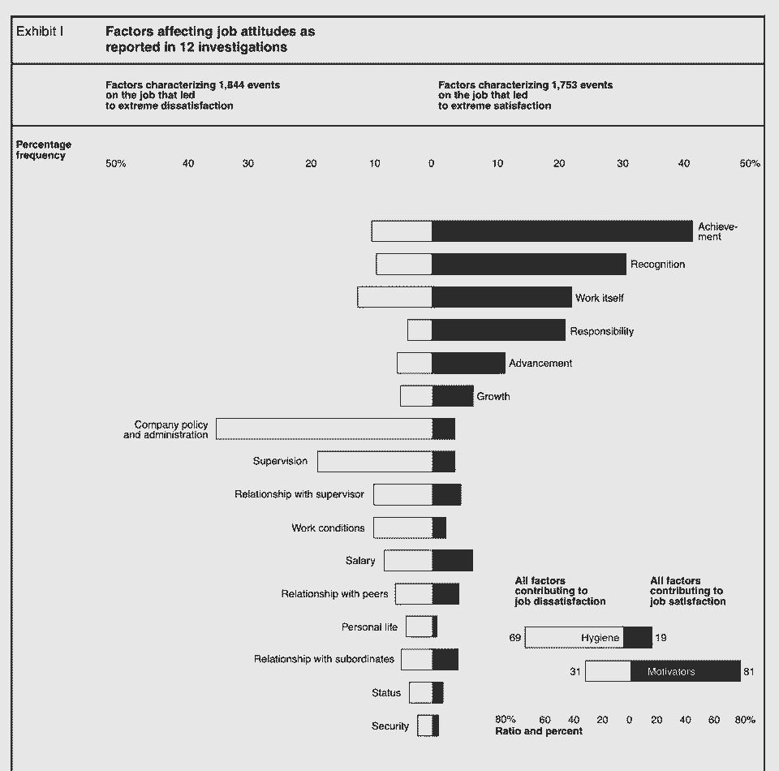

# 雇佣工程副总裁？使用 Shopify 的 VPE 的这个框架来做正确的事情

> 原文：<https://review.firstround.com/hiring-a-vp-of-engineering-use-this-framework-from-shopify>

## 介绍

*[法尔汉·塔瓦](https://twitter.com/fnthawar "null")* *是* *[Shopify](https://www.shopify.com/ "null")* *的工程副总裁。在收购 Helpful.com 后，他加入了该公司，在那里他是联合创始人兼首席技术官。此前，他是 Pivotal 和 Xtreme Labs 的工程副总裁。*

当给快速成长的初创公司提供建议时，我最常被问到的一个问题是“我如何聘用工程副总裁？”经过 20 多年，8 家公司，数千人的雇佣，我开始怀疑这可能是个错误的问题。一个更好的问题是，“什么是工程副总裁？”

2018 年，我为一家公司提供咨询，该公司希望了解他们的工程副总裁怎么能在公司工作一个季度后就被解雇。他们写了一份深思熟虑的职位描述，寻找了许多候选人，并在发出邀请前对最终候选人进行了多轮面试——所有这些都是为了让新员工在这个职位上只呆三个月。哪里出了问题？事实证明，该公司对副总裁工程中他们需要什么和他们想要什么有一个错误的假设。在这种情况下，当他们需要一个善解人意的领导者来扩展组织时，他们雇佣了一个专注于技术的领导者。幸运的是，他们很快发现了这一点，并能够转向另一个更适合的候选人。

但是，我们如何帮助公司避免这种太常见的流失？对我来说，它总是回到定义你在寻找什么，以及在一个非常精细的层面上什么是好的。回答这个问题将有助于你更好地理解如何发现、雇佣、激励和培养员工进入这个职位。你可能会发现你甚至不需要工程副总裁——很多时候，团队领导、经理或总监才是你需要的。(比在你的四面墙之外寻找更好的方法是从内部提拔某人担任这个领导角色。)

首先，考虑每一级的必要条件:

**团队领导**:有能力指导他人但仍然是唯一贡献者的工程师。不仅仅是一个有资历的高绩效者，也是一个能帮助他人的人。

经理:有能力领导他人的工程师。经理仍然有所贡献，但他们也让其他人有所贡献。经理们专注于确保他们的团队长期保持高效。

**主管**:管理多个团队和经理的领导。一个有系统思考倾向的同理心的人，他犯了错误，但将来会做出更好的选择。

副总裁:对如何建立一个高效的工程组织有远见的领导者。优秀的人知道要移交什么工作，并以所需的方式不断激励下属。

接下来，如果工程副总裁确实是你想要的，我发现候选人必须精通所有三个经典领域:

**过程**:什么时候发生什么？

**人物**:谁参与其中，他们是如何被激励的？

技术:我们要用什么去那里？

如果你问一位技术领导者，他们如何从最重要到最不重要排列上述三项技能，你会很好地了解他们的技能和兴趣。但更有价值的是，你有机会梳理出他们的技能是否符合你的需求，对吗*现在*在*你的公司*目前的阶段。

对于你的公司和这个人来说，这些的顺序会随着时间而改变。例如，在初创公司，你通常会找一个技术含量很高的联合创始人或首席技术官来帮助定义早期开发流程。随着公司规模的扩大，需求也会发生变化。随着团队规模的扩大，技术工艺和职业发展成为焦点，你现在可能正在寻找一个更加以人为本的领导者。根据我的经验，大多数初创公司都没有调整这些资料，也没有对招聘过程进行微调。

工程副总裁的“合适”在一定程度上是时间的作用——他们的技能和兴趣必须与当前的需求相匹配。

有大量的内容和建议围绕着这个重要的招聘，但很少有实用的决策框架来帮助创始人和技术领导者更深入地探索他们在工程副总裁身上寻找什么。多年来，过程-人-技术框架是我学习和指导创业公司的一个方法。在本文中，我将深入这些技能领域，讨论它们为什么重要，如何知道它们是否是你在这个阶段的首要任务，以及如何识别适合每个领域的人。

有许多不同的成功人士、风格和过程可以帮助你建立有效的工程团队。没有灵丹妙药。但希望这个框架——以及面试中要问的一些问题和要注意的危险信号——能帮助你更深入地了解你需要什么样的领导来发展你的公司。

Farhan Thawar, VP of Engineering at Shopify.

# **流程:评估候选人的优化技能**

一个伟大的工程领导者对自己喜欢的开发过程有自己的看法。这并不一定意味着他们会把这个过程强加给你的公司(嗯，也许是)，但是有强烈的意见和他们自己的过程技术工具箱来尝试是很好的。

然而，这种需求不仅仅是微调开发过程。他们还需要赢得和保持工程师信任的工具。早在 1968 年，*《哈佛商业评论》*(HBR)[发表了一篇关于如何激励员工的开创性文章](https://hbr.org/2003/01/one-more-time-how-do-you-motivate-employees "null")。许多教训至今仍有共鸣。最值得注意的发现是，员工可能会对公司政策及其管理方式非常不满。优秀的领导者必须减少这种不满，这在工程领域尤为迫切。

大多数工程师都非常关心优化，次优的流程会让他们抓狂。

对任何技术专家来说，另一个危险是对技术太过兴奋，而忘记了他们最初为什么要建造。无论是内部还是外部，客户都很重要。一个伟大的领导者知道如何运行反馈周期短的项目，也知道如何运行反馈周期长的项目。这意味着客户可能会在早期和经常性地(如功能更新)或在长期范围内(如平台重写)看到价值。

让我们深入其中的几个特定领域:

## **1。开发过程的实验**

我不相信真的有一种编写软件的正确方法。因此，每个开发团队和环境都可以是不同的，但仍然是成功的。你只需看看围绕封闭式办公室与开放式办公室或办公室内工作与远程工作的争论，就能发现有许多取胜的方法。

这意味着一个强有力的领导者必须知道是否要尝试一些想法，比如结对编程、每日站立、远程工作、弹性时间、每周回顾、频繁的一对一、季度主题等等。仅仅因为某项技术在他们的上一份工作中有效，并不意味着它在你的公司也会有效。**类似于产品领导者如何在产品中与用户进行实验，成长团队中的工程领导者也在他们的领域中进行实验:开发过程**。

更具体地说，一个强有力的工程领导知道*何时*以及*多久*为开发团队尝试过程改进。例如，在 Shopify，我们从 2019 年开始尝试六周的开发周期，以此将我们的工作分成更易于管理的块，演示高保真工作，并做出更好的优先决策。在一个团队中试验之后，它很快成为公司范围内所有工程和商业团队的步调。

好的过程就像交通灯。它可能会减缓单个司机的通勤速度，但它优化了路上每个人的系统。

**寻找这些品质找到一个强有力的实验者:**

提供了不同开发过程的代码。

有失败的例子，但他们会再次尝试。

有强烈的观点，但愿意改变他们的想法。

**问这些问题，找出最佳候选人:**

描述一下你上一家公司的发展过程。你会再次尝试什么，为什么？你不想再尝试什么，为什么不想？

当谈到开发过程或工程团队实践时，您改变了对什么的看法？

**小心这些危险信号以避免误伤:**

强烈的观点，坚定的持有。不反思他们的经历。如果之前的事情没有成功，他们会再次做同样的事情。

仅使用一个开发过程交付软件。

## **2。减轻管理负担**

人们常常忽略了不满意的管理任务是多么的强大。回到我最喜欢的 1968 年 HBR 文章，员工不满意的最强有力的原因——公司政策和管理——几乎和最大的满足者——成就一样强大。

我把这张图片作为最喜欢的照片保存在手机里，经常参考。

最好的领导者可以保护工程师免受不必要的管理和政策，因为低劣的系统，如假期跟踪，按时支付费用，提交简历推荐，甚至帮助取消无效会议(这需要高级技能)。

一个好的领导者还会从过程的角度找到解决团队问题的方法。一种方法是通过调查(一旦团队足够大)。你会惊讶地发现，从季度调查中，只要问一些简单的问题，比如“你一天中最糟糕的是什么？”或者“你希望我们使用但没有使用的工具是什么？”

让你的工程师花时间工作让他们开心(技术上来说，更少的不满)。[Twitter 的工程副总裁 Nick Caldwell](https://twitter.com/nickcald "null") 建议在你的季度调查中增加一个关于你的工程组织中“浪费时间”的问题，然后让一个精干的团队消除它们。

**寻找这些品质找到一个解封者:**

解除对所有问题的封锁(不仅仅是工程问题)。

定期识别和销毁浪费时间的东西。

士气高昂的工程组织的历史。

**问这些问题，找出最佳候选人:**

描述一下你上一家公司糟糕的系统。你对此做了什么？

在更大的团队中，你如何感觉到什么是有效的，什么是无效的？

**小心这些危险信号以避免误伤:**

对次优系统有容忍度。没有让事情变得更好的记录。

只关注工程问题。没有扩大到解决组织问题。

## **3。专注于持续向客户提供价值**

我合作过的一些最好的工程领导者希望与客户互动。这意味着他们总是在考虑*如何*提供客户能够感受到的价值。注意我没有说*什么*，而是说*如何*。这意味着他们喜欢频繁发货以获得反馈。

与希望试验产品及其工作原理的产品和 UX 领导者一起，工程领导者应该有一个过程节奏，允许客户给出定期的详细反馈。一个伟大的过程，没有不必要的后台旋转(不适当的重构，漫长的 QA 周期，批准等)。)会让客户经常看到产品，并在几天或几周内，而不是几个月内，给出源源不断的评论。

聪明人陷入的一个危险是认为他们了解客户想要什么。认识到客户拥有问题，但您可以拥有解决方案，这一点非常重要。保持这两个所有权圈的不同，允许两个伟大的过程分别发生。首先，客户可以生动地表达他们的需求，而不必过早地“解决”。然后，技术团队可以想出并测试解决他们问题的惊人的原型解决方案。双赢。

**寻找这些品质，找到客户的拥护者:**

知道哪些项目适合快速反馈节奏。

说“这需要三个星期，但是如果我们做了这个改变，我们可以在两天内测试。”

让客户拥有问题，但拥有解决方案。

**问这些问题，找出最佳候选人:**

你如何获得平台重写的反馈？

您如何处理客户的功能请求？

描述一次你觉得你的团队发货不够频繁的情况。你对此做了什么？

**小心这些危险信号以避免误伤:**

需要很长的反馈周期，并且不知道如何更快地获得反馈。

对客户的功能要求进行分类和实施，而不是理解客户的问题。

# **人物:评估候选人的团队建设能力**

我认为说“人”是工程领导者工具箱中最重要的工具并不为过。然而，在公司发展的不同转折点，人的关注可能会变得更重要或更不重要。

对于一个领导者来说，关键是要确保所有的工程(以及相邻的学科)都指向正确的方向。这种指向(通过愿景和使命)不需要——通常也不需要——取决于他们在组织结构图中的位置。影响力独立于权威而存在。以下是我在这里寻找优秀工程领导者的具体品质:

## **1。吸引候选人并创造渠道**

伟大的人希望为伟大的领导者工作。每当我看到一位出色的领导者跳槽到不同的团队或公司时，精明的人都会紧随其后。这就是为什么如果有人将几乎整个团队移植到一个新的组织中，这是一个很好的迹象——它告诉你人们想要跟随他们，并且他们会努力争取他们的人让他们被雇用。

这种人格效应的力量才是招聘的真正关键——而不仅仅是招聘人员、配额、陌生电话或 LinkedIn 搜索的系统。我发现许多最优秀的人无论如何都不会积极寻找。他们的动机不仅仅是薪酬，他们希望通过应对重大而大胆的挑战来证明自己。把他们从舒适的角色中引诱出来的唯一方法之一是在一个好的领导下提供巨大的挑战。

优秀的领导者也能直觉地理解参加招聘活动、演讲以及密切关注潜在候选人的价值。你必须去寻找顶尖人才，他们知道这一点。他们也知道一旦录取通知书签署，工作并没有结束。这意味着他们不断倡导团队成员成为大机会的一部分，无论是在他们的领导下还是在另一个领导下。优秀的领导者也重视多样性和观点的多样性。通过长时间收集证据，他们也知道何时与某人分道扬镳，以及如何有效地做到这一点。

领导者在这方面的远见应该在面试中体现出来，也应该在他们面试候选人时体现出来。他们应该能够让你想成为他们正在建设的一部分。工程候选人的最佳副总裁会做两件事:

他们会问很多试探性的问题并做笔记(或者对讨论的细节有很好的记忆力)。

他们将根据在上述步骤中学到的知识，制定并分享第一季度的角色计划样本。

很少遇到做到以上的考生，但是做到了就让人耳目一新。这表明他们知道如何在组织中寻找信息，并能想出一些事情来尝试。当然，在候选人开始工作之前，你永远不知道他是空谈还是能在你的公司真正执行，但你可以用过去的表现作为一个有损的代理。

**寻找这些品质来找到一个强有力的招聘人员:**

他们的团队倾向于跟随他们寻找下一个机会。

在公司外有导师或学员，并继续进行外部一对一辅导。

有效地与表现不佳的人分道扬镳。

**问这些问题，让最佳候选人浮出水面:**

你曾经在不同的公司和相同的人或团队一起工作过吗？那是怎么发生的？随着时间的推移，和一些相同的人一起工作有什么好处和坏处吗？

告诉我一个你合作过的超级明星。你会和 X 一起工作还是再次雇佣他？为什么或为什么不？

**小心这些危险信号以避免误伤:**

从未在新公司与前队友共事过。

从来没有放过任何人。

## **2。让在那里工作过的团队更有价值**

有些组织在简历上看起来很棒，因为它们是家喻户晓的名字。在你的行业中，还有其他人看起来很棒，因为他们知道你在那里解决了一个大挑战。这两者没有必然联系，后者更有价值。你需要的是那种能帮助团队取得成功、让公司成为工程师们的代名词的领导人。

一家公司不一定要很大，也不一定要有巨大的资金出口，才能让校友形成一个有价值的网络。我过去最强的两个网络是[三部曲](https://twitter.com/auren/status/1354647166745120771?s=20 "null")和 [Xtreme Labs](https://twitter.com/unbrelievable/status/1347698492354015238?s=20 "null") 。这两家公司都是中型企业，从未超过几百人的规模。两人都在职业生涯的早期关注人们，并为未来的角色留下了[的强烈印记](https://hbswk.hbs.edu/item/how-career-imprinting-shapes-leaders "null")。然而，每所学校都有一个非常强大和积极参与的校友社区，这使得其成员通过私人社交网络和工作推荐变得更加强大。

这不仅仅是培养一个强大的校友网络或建立一个良好的工程品牌，而是当员工仍在公司时，你创造和鼓励的机会。

举个例子，我见过的伟大领袖总是要求他们的工程师直接与其他公司的客户和工程师打交道。他们相信让他们参加客户电话会议、举办黑客马拉松、发表演讲、写博客以及承担领导角色[，因为这对他们有好处](https://review.firstround.com/the-engineering-leader%27s-guide-to-crafting-a-personal-brand-that-stands-out-from-the-crowd "null")，因为这能改善他们的工作。

**寻找这些品质找一个教育工作者:**

受校友信任，帮助他们实现职业抱负

员工最终为客户工作

新雇主的知名工程品牌

**问这些问题，找出最佳候选人:**

你和你之前的车队保持联系吗？为什么或为什么不？

你如何跟踪你以前共事过的人的职业生涯？

**小心这些危险信号以避免误伤:**

从未参与或建立基于以往经验的校友社区

以前公司的工程品牌是平的往下的

## **3。从帮助他人成功中获得能量**

伟大的工程领导者会委派任务，即使他们知道结果并不完美。作为一项政策，他们首先信任，因为他们知道微观管理会侵蚀人们的信心。

如果你的父母总是批改你的作业，你却从来不学会自己检查。好的领导者会让你尝试，失败，然后介入。他们信任，但核实。

在以前的公司，我甚至消除了工程师和投入生产的代码之间的制衡。“看，没有人会检查你的工作，”我会告诉他们。“如果你认为它已经准备好了，它将直接投入生产。你没有责任，你有责任。”我发现这种没有刹车的方法在工程师团队中滋生了一种完全不同的心态。他们成为所有者，而不是参与者，并产生更高质量的代码。

一个好的领导者也会在小事上表现出来。一个被责任压得喘不过气来的领导者没有时间在员工身上投资，尤其是当这意味着他们在 1:1 这样的事情上迟到的时候。我认为这是个人时间管理问题，而不是组织问题。如果你在有效地运作，你永远不会太忙。优秀的副总裁会授权给他们的员工，所以有时间露面。

**寻找这些品质找仆人领导:**

承担所有的责任，不承担任何荣誉。

危机期间可用。

专注于给人们一生中最好的机会。

**问这些问题，找出最佳候选人:**

你经常和你的团队一对一吗？为什么或为什么不？

描述一个你觉得超级明星应该离开你的团队去另一个团队的时候。

你如何在团队成员面前展示自己的一个小例子是什么？你意识到你在这里可以做得更好的例子是什么？

**小心这些危险信号以避免误伤:**

不使用一对一的方式来解决问题、了解他们的团队并提供延伸任务。

从未觉得团队成员在团队之外有更大的机会。

# **技术:评估候选人的潜深能力**

你的工程副总裁不必是每项技术的专家，尽管优秀的副总裁会对一些领域有深刻的理解。相反，他们必须修补，知道什么是可能的，并建立一个团队来发现、实施和改进正确的技术。并非所有这些领导者都会定期编写代码，但许多人会找到一种方法来原型化想法或用代码面试高技术候选人。

根据康威定律，你的架构通常反映了你的组织结构图。如果你的工程副总裁是所有技术选择的最终决定权，他们可能会成为一个瓶颈。更好的办法是让团队选择伟大的技术，但保持客观，挑战他们，并改进他们的选择。

值得注意的是，伟大的领导者会有伟大的[技术性](https://randsinrepose.com/archives/technicality/ "null")。他们应该能够卷起袖子深入研究一个问题，即使只是问一个更深一两层的问题，或者验证一个未言明的假设。我会对那些离开个人贡献者的工作去“远离”技术的领导者做更深入的探究。在我看来，像“我想远离编码”或“我一直想成为一名经理”这样的回答应该被视为危险信号。一旦工程领导者意识到他们可以通过人获得更大的影响力，他们就不会再写代码了。

技术性问题会一直出现在组织结构图中。在 Shopify，即使在一家拥有数千名工程师的公司里，看到[鸢](https://twitter.com/tobi "null")(首席执行官)或 [JML](https://twitter.com/jmwind "null") (首席技术官)卷起袖子开发新技术原型、参与黑客马拉松或评论公关也并不罕见。

## **1。不怕问尖锐或深刻的问题**

一个好的工程副总裁能够充分了解某人是否掌握了他们的领域。乔尔·斯波尔斯基有一个关于他和比尔·盖茨互动的精彩故事。虽然领导者不需要了解全部背景，但他们应该能够更深入一些。例如，在苹果公司，领导者[被期望](https://hbr.org/2020/11/how-apple-is-organized-for-innovation "null")深入他们的组织三层。目标不是微观管理团队，而是能够提出好的试探性问题。通过接近技术并能够进一步挖掘，领导者可以质疑一些可能不再正确的基本假设。同样，信任但核实是目标。

优秀的副总裁还擅长组织讨论，得出客观的结论。例如，像[启示录会议](https://medium.com/helpful-com/accelerate-technical-decisions-with-apocalypses-bea5a4b9733e "null")这样的形式可以用来确保每个人的声音都被听到——特别是那些不喜欢公开辩论但在晦涩的问题上往往是正确的安静的人。

领导者的工作是简化常规信息流，以获得真正的答案。我喜欢想起小 TJ·沃森写给他的公司——IBM 的信。在这里，沃森试图理解为什么一个更小更灵活的公司能够比 IBM 执行得更有效。

一个好的 VP 是健康地执着于每天变得更好，提问才能到那里。

**找这些素质找一个询问者:**

被视为工会领袖。

知道何时条件发生变化以进行技术变革。

每个季度可以深入了解一些事情。

**问这些问题，让最佳候选人浮出水面:**

你还编码吗？为什么或为什么不？

为什么要离开 IC(个人贡献者)工作？

给我一个你如何深入挖掘你的团队正在处理的项目的例子。你有什么想问的问题，或者你认为在这里有效的方法吗？

**小心这些危险信号以避免误伤:**

对理解技术问题或查看代码不感兴趣。

进入管理层是为了“摆脱”编码。

## **2。对自己的经历保持公正**

巴顿的名言是:“领导我，跟随我，或者给我让开。”伟大的副总裁有一点巴顿(减去自我)。他们参与其中是为了完成使命，并且愿意接受任何解决方法。他们不只是带来他们过去成功使用的工具，他们还会询问当前的情况需要什么，并进行调整。如果他们过去使用 Java，他们对 Ruby 是开放的。如果他们在办公室工作过，他们会接受远程工作。如果他们习惯了原生的移动应用程序，他们会乐于尝试原生的应用程序。

我想起了一个最近的例子:2013 年，我根据我在 Xtreme Labs 开发数百个移动应用的经验，为第一轮原生移动工程写了一篇文章。但围绕移动工程的基本假设慢慢发生了变化，到 2019 年不再正确。一旦我开始在 Shopify 领导移动工程，我们就决定全力以赴[React Native](https://shopify.engineering/react-native-future-mobile-shopify "null")——我在 2013 年第一轮文章中强烈反对这种方法。因此，虽然看起来我在反驳自己的建议，但我并没有成为自己偏见的牺牲品。

这里的关键能力是知道如何客观地权衡利弊，比如团队现有的熟悉度与未来的技术曲线——技术的发展方向。或者需要为特定的技能组合而雇用员工。或者一项新技术的招聘潜力，因为它可能会让你雇佣一批未来的工程师。

另一个关键属性是确定正在发生什么以及谁拥有最佳上下文的能力。很难不依赖于领导者可能会发现自己身处其中的“信息泡沫”。一个伟大的领导者将能够卷起袖子，在实际工作中动手——而不是依赖每周的状态报告。

**寻找这些品质来寻找技术专家的领导者:**

用新信息改变想法。

可以尝试解决他们从未遇到过的问题。

不使用代理来表现。

**问这些问题，找出最佳候选人:**

你过去推荐过什么技术，现在不再推荐了？

你如何确保自己不会停留在信息泡沫中？

**小心这些危险信号以避免误伤:**

继续以他们一贯的方式做事。

没有一个小型委员会或越级对话和项目来从 ICs 获取真实数据。

## **3。信任团队，但可以打决胜局**

好的副总裁是空中交通管制员。他们没有为所有的飞机规划路线，也没有给它们加油，也没有驾驶它们。但是当他们在一个关键的十字路口汇合时，控制器会告诉他们如何避免相撞，并重新规划最佳路线。他们大多让飞机随心所欲，但如果两架飞机即将相撞或不必要地燃烧燃料，他们毫无保留地打破平局并发号施令。

我特别珍视的一项技能是，能够看出什么时候决策不是零和的。有一个经典的练习，两个人被告知边吃橘子边谈判。两人都被告知，他们经营着制造救命疫苗的制药公司。(自从发明了这个练习，这个场景变得更加真实了。)给两个参与者一个预算。这个游戏的设计是为了让人们整天谈判而毫无进展，直到有人最终发现谈判者 A 需要果皮，而谈判者 B 需要果汁。他们可以分享。

工程推论:在 [A 和 B](https://medium.com/helpful-com/helpful-do-it-most-things-are-reversible-anyway-aa029b9487f1 "null") 之间，你能两者都做吗，或者选择一个，然后依次选择另一个？通常这比花时间在分析上要快。

**找这些素质找教练:**

第一个问题总是:“你觉得怎么样？”

经常被称为教练，共鸣板，或魔鬼的倡导者。

代表们出人意料地做出重大决定。

**问这些问题，找出最佳候选人:**

当你团队中的两个成员意见不一致时，你如何帮助解决分歧？

你是通过什么方式进入团队的“信息流”的？

**小心这些危险信号以避免误伤:**

要么总是决定分歧，要么总是授权。不考虑上下文。

不在项目的信息流中，也就是说，不被团队信任来提供帮助。

*感谢**[Joshua Koppelman](https://www.linkedin.com/in/jkoppelman/ "null")**首先向我介绍了这个框架，感谢**[Mallorie Broadie](https://twitter.com/MalBrodie "null")**首先向我提出了正确的问题。对于问题，* *[在 Twitter 上打我](https://twitter.com/fnthawar "null")* *。*